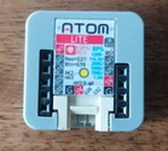
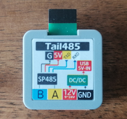
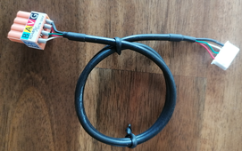
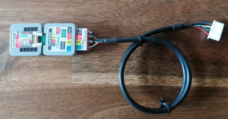
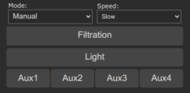

# Sugar Valley NeoPool Controller

??? failure "This feature is not included in precompiled binaries"  

    When [compiling your build](Compile-your-build) add the following to `user_config_override.h`:
    ```arduino
    #ifndef USE_NEOPOOL
    #define USE_NEOPOOL                       // Add support for Sugar Valley NeoPool Controller - also known under brands Hidrolife, Aquascenic, Oxilife, Bionet, Hidroniser, UVScenic, Station, Brilix, Bayrol and Hay (+6k flash, +60 mem)
    #endif
    ```

[Sugar Valley](https://sugar-valley.net/en/productos/) NeoPool are water treatment systems also known under the names Hidrolife, Aquascenic, Oxilife, Bionet, Hidroniser, UVScenic, Station, Brilix, Bayrol and Hay.
It uses a [RS485](https://en.wikipedia.org/wiki/RS-485) interface with the [Modbus](https://en.wikipedia.org/wiki/Modbus) data protocol for enhancement equipment like Wifi-Interface or a second attached control panel. All functions and parameters can be queried and controlled via this bus interface.

The Tasmota Sugar Valley NeoPool Controller sensor module shows the most of parameters such as the built-in display:


There are [Tasmota commands](#commands) implemented to control the high level functions for filtration, light and system parameters such as pH setpoint, hydrolysis level, redox setpoint etc.
However, the sensor also provides low-level commands to directly [read](#npread) and [write](#npwrite) NeoPool register, means that you have the option to implement your own commands via home automation systems or by using the Tasmota build-in possibilities [Rules](Commands.md#rules) with [Backlog](Commands.md#the-power-of-backlog) or the powerful Berry language on ESP32.

## Connection

The NeoPool controller uses a RS485 interface, the ESP has RS232 interfaces. Both are serial interfaces but with different physical specifications. Therefore to connect your NeoPool controller to an ESP82xx/32 you need a TTL-UART to RS485 converter. For an ESP8266 it is recommended to use GPIO1 and GPIO3, because the ESP then uses the serial interface of the hardware.


### Using M5Stack Atom Lite with Tail485 addon

This is the easiest and the most comfortable way to run Tasmota with the Sugar Valley system. The combination of a [M5Stack Atom Lite](https://docs.m5stack.com/en/core/atom_lite) and the [Tail485](https://docs.m5stack.com/en/atom/tail485) addon is very small, does not need a separate power supply (because it is powered from the Sugar Valley system) and can even be placed directly next to the system or in the junction box itself. 

For this you will need:

- a [M5Stack Atom Lite](https://docs.m5stack.com/en/core/atom_lite)<BR>
- a [Tail485](https://docs.m5stack.com/en/atom/tail485)<BR>
- a 4 wire dupont cable or 4 wire cable using a 5 pin 2,54 mm JST connector<BR><BR>(see also [Sugar Valley connection](#sugar-valley-connection))<br>
  - Sugar Valley pin 1 (+12V) goes to Tail485 pin 12V (9-24V)
  - Sugar Valley pin 3 (Modbus A+) goes to Tail485 pin A
  - Sugar Valley pin 4 (Modbus B-) goes to Tail485 pin B
  - Sugar Valley pin 5 (Modbus GND) goes to Tail485 pin GND

For final use, put the whole thing together:



To get this combination running:

- compile your own Tasmota including the NeoPool driver as described under the red note `"This function is not included in precompiled binaries"` at the very top of this page and flash your this to your M5STack Atom Lite using USB
- make the configuration steps [M5Stack Atom Lite with Tail485 template](#m5stack-atom-lite-with-tail485-template)
- turn off the Sugar Valley device and plug the 4-wire dupont or 5 pin JST cable into the [WIFI](#using-wifi-port) or [EXTERN](#using-extern-port) ports
- turn on the Sugar Valley device

That's all.

### Using any other ESP

The following TTL UART to RS485 converter have been tested with both an ESP8266 and ESP32 using a Vcc of 3.3V:

 

!!! note
    Your TTL UART to RS485 converter must be able to work with an operating voltage of 3.3V. Some converters are not designed for operating with 3.3V and only works with 5V TTL level - these converters are useless. __Do not operate your TTL UART to RS485 converter with 5V__, your converter __must be operated with the 3.3V__ from ESP, otherwise the ESP GPIO ports will be damaged.

### Sugar Valley connection

The Sugar Valley NeoPool RS485 connector pins are located under the connection cover, for the Sugar-Valley products on the right-hand side next to the relay connections:

The pin assignment (from top to bottom):

| Pin | Description |
|-----|-------------|
|  1  | +12V        |
|  2  | nc          |
|  3  | Modbus A+   |
|  4  | Modbus B-   |
|  5  | Modbus GND  |

!!! failure "The +12V connection is the 12V from the internal power supply, do not feed in any external voltage."     

You can use the "WIFI" or "EXTERN" connector, both are independent Modbus channels and uses the Modbus address 1 by default.

!!! note
    The "DISPLAY" port can only be used if neither the built-in nor an external display is connected but since there is probably at least one display connected to one of the two "DISPLAY" ports, the "DISPLAY" port is useless.

#### Using WIFI Port


#### Using EXTERN Port


!!! note
    Leave the define for `NEOPOOL_MODBUS_ADDRESS` set to 1 whether you are using the "WIFI" or "EXTERNAL" port (unless you have changed the parameters for it within your Sugar Valley device).

## Configuration

### Tasmota settings

The configuration is limited to the assignment of two GPIOs under Tasmota **_Configuration -> Configure Module_**:

- change the Module type to `Generic (0)` - this will restart your Tasmota
- After restart set<BR>
  - GPIO1 to `NeoPool RX`<BR>
  - GPIO3 to `NeoPool TX`


Don't be surprised that Rx seems to be connected to Tx here (and vice versa). The Rx and Tx designations are to be considered from the point of view of the respective devices, which can be confusing.

### M5Stack Atom Lite with Tail485 template

For this combination use a template, got to Console and enter the command below:

```
Template {"NAME":"NeoPool","GPIO":[0,0,0,0,0,0,0,0,0,0,0,0,0,0,0,1,0,1,1,1,0,0,6976,0,0,0,0,0,7008,1,0,0,0,0,0,0],"FLAG":0,"BASE":1}
```

This also allows the later use of the additonal GPIOs 19, 21 - 23 and 33 for other purposes (sensors or similar).

After a restart active the template using command `Module 0`.

### Final check

After Tasmota restarts, the main screen should display the controller data as shown above. If not, check that the A+/B pins aren't swapped and that the Rx/Tx pins are on the correct GPIOs - swap once if in doubt.

## SENSOR data

Sensor data is sent via the Tasmota topic `tele/%topic%/SENSOR` in JSON format every [TelePeriod](Commands.md#teleperiod) interval. To get the data immediately, use the Tasmota [TelePeriod](Commands.md#teleperiod) command without parameter:

```json
{
  "Time": "2021-06-01T11:00:00+02:00",
  "NeoPool": {
    "Time": "2021-06-01T11:00:00",
    "Type": "Oxilife",
    "Module": {
      "pH": 1,
      "Redox": 1,
      "Hydrolysis": 1,
      "Chlorine": 1,
      "Conductivity": 1,
      "Ionization": 1
    },
    "Temperature": 23.5,
    "Powerunit": {
      "Version": "V3.45",
      "NodeID": "XXXX XXXX XXXX XXXX XXXX 442A",
      "5V": 5.017,
      "12V": 13.904,
      "24-30V": 33.721,
      "4-20mA": 0.01
    },
    "pH": {
      "Data": 7.2,
      "Min": 7.0,
      "Max": 7.2,
      "State": 0,
      "Pump": 2,
      "FL1": 0,
      "Tank": 1
    },
    "Redox": {
      "Data": 752,
      "Setpoint": 750
    },
    "Chlorine": {
      "Data": 0.7,
      "Setpoint": 1.0
    },
    "Conductivity": 0,
    "Ionization": {
      "Data": 0,
      "Setpoint": 0,
      "Max": 0
    },
    "Hydrolysis": {
      "Data": 100,
      "Unit": "%",
      "Setpoint": 100,
      "Max": 100,
      "Runtime": {
        "Total": "28T22:13:19",
        "Part": "28T22:13:02",
        "Pol1": "14T12:32:46",
        "Pol2": "14T09:40:33",
        "Changes": 258
      },
      "State": "Pol1",
      "Cover": 0,
      "Boost": 0,
      "Low": 0,
      "FL1": 0,
      "Redox": 1
    },
    "Filtration": {
      "State": 1,
      "Speed": 2,
      "Mode": 1
    },
    "Light": 0,
    "Relay": {
      "State": [0, 1, 0, 0, 0, 1, 0],
      "Aux": [0, 0, 1, 0],
      "Acid": 0
    },
    "Connection": {
      "Time": "2024-08-14T15:00:00",
      "MBRequests": 9040,
      "MBNoError": 9039,
      "MBIllegalFunc": 0,
      "MBIllegalDataAddr": 0,
      "MBIllegalDataValue": 0,
      "MBSlaveError": 0,
      "MBAck": 0,
      "MBSlaveBusy": 0,
      "MBNotEnoughData": 0,
      "MBMemParityErr": 0,
      "MBCRCErr": 0,
      "MBGWPath": 0,
      "MBGWTarget": 0,
      "MBRegErr": 0,
      "MBRegData": 0,
      "MBTooManyReg": 0,
      "MBUnknownErr": 0,
      "MBNoResponse": 1,
      "DataOutOfRange": 0
    }
  },
  "TempUnit": "C"
}
```

### SENSOR data description

Key|Details
:---|:---
Time|(String) Device time
Type|(String) Model description (`Hidrolife`, `Aquascenic`, `Oxilife`, `Bionet`, `Hidroniser`, `UVScenic`, `Station`, `Brilix`, `Generic`, `Bayrol` or `Hay`)
Module|(Bool) These subkeys indicate whether the corresponding module is installed and activated (`1`) or not (`0`)
Temperature|(Float) Temperature value from temperature sensor (only available if temperature sensor is installed)
Powerunit.Version|(String) The firmware version of the power unit module
Powerunit.NodeID|(String) The NodeID of your device (default hidden, do not publish your NodeID). See [`SetOption157`](Commands.md#setoption157)
Powerunit.5V|(Float) Voltage value of the 5 Volt output
Powerunit.12V|(Float) Voltage value of the 12 Volt output
Powerunit.24-30V|(Float) Voltage value of the 24-30 Volt output
Powerunit.4-20mA|(Float) Current value of the 4-20mA output
pH.Data|(Float) Current pH value (`0`..`14`)
pH.Min|(Float) Minimum setting value for pH control (only useful if a base pump is connected).
pH.Max|(Float) Maximum setting value for pH control (only useful if an acid pump is connected).
pH.State|(Int) Status of the pH controller:<BR>`0` = no alarm<BR>`1` = pH too high: pH value is 0.8 points higher than setpoint (`NPpHMax` on acid systems, `NPpHMin` on base systems, `NPpHMax` on acid+base systems)<BR>`2` = pH too low: pH value is 0.8 points lower than setpoint (`NPpHMax` on acid systems, `NPpHMin` on base systems, `NPpHMin` on acid+base systems)<BR>`3` = pH pump has exceeded the working time set by the MBF_PAR_RELAY_PH_MAX_TIME parameter and has stopped<BR>`4` = pH higher than setpoint (`NPpHMax` + 0.1 on acid systems, `NPpHMin` + 0.1 on base systems, `NPpHMax` on acid+base systems)<BR>`5` = pH lower than setpoint (`NPpHMax` - 0.3 on acid systems, `NPpHMin` - 0.3 on base systems, `NPpHMin` on acid+base systems)<BR>`6` = Tank level alarm
pH.Pump|(Int) pH control module and controlling pumps:<BR>`0` = pH control module and controlling pumps inactive<BR>`1` = Acid/base pH pump pump on<BR>`2` = Acid/base pH pump pump off
pH.FL1|(Bool) Control status of the pH module by flow detection:<BR>`0` = Disable<BR>`1` = Enable
pH.Tank|(Bool) Acid/Base tank signal input:<BR>`0` = Tank empty<BR>`1` = No Tank alarm
Redox.Data|(Int) Current redox value [mV]
Redox.Setpoint|(Int) Redox target [mV]
Chlorine.Data|(Float) Current chlorine value [ppm]
Chlorine.Setpoint|(Float) Chlorine target production level [ppm]
Conductivity|(Int) Current conductivity level [%]
Ionization.Data|(Int) Current ionization level
Ionization.Setpoint|(Int) Ionization target production level
Ionization.Max|(Int) Ionization maximum production level (system defined)
Hydrolysis.Data|(Float/Int) Hydrolysis current production level
Hydrolysis.Unit|(String)  Hydrolysis unit ("g/h" or "%")
Hydrolysis.Setpoint|(Float/Int) Hydrolisis target production level
Hydrolysis.Max|(Float/Int) Hydrolysis maximum production level [g/h|%]
Hydrolysis.Runtime.Total|(String) Cell total runtime (format _dd_T_hh_:_mm_:_ss_)
Hydrolysis.Runtime.Part|(String) Cell partly runtime
Hydrolysis.Runtime.Pol1|(String) Cell runtime for polarization 1
Hydrolysis.Runtime.Pol2|(String) Cell runtime for polarization 2
Hydrolysis.Runtime.Changes|(Int) Number of polarization changes
Hydrolysis.State|(String) Cell state:<BR>`OFF` = Cell inactive<BR>`FLOW` = Cell water flow alarm<BR>`POL1` = Cell polarization 1 active<BR>`POL2` = Cell polarization 2 active
Hydrolysis.Cover|(Bool) Cover signal input:<BR>`0` = Cover input inactive<BR>`1` = Cover input active
Hydrolysis.Boost|(Int) Boost mode state:<BR>`0` = Boost mode inactive<BR>`1` = Boost mode active<BR>`2` = Boost mode active with redox control
Hydrolysis.Low|(Bool) Hydrolysis low alarm:<BR>`0` = No alarm<BR>`1` = Hydrolysis cannot reach the setpoint
Hydrolysis.FL1|(Bool) Hydrolysis cell flow indicator:<BR>`0` = No alarm<BR>`1` = Hydrolysis flow alarm, no flow detected
Hydrolysis.Redox|(Bool) Activation of hydrolysis by the redox module:<BR>`0` = Not activated by redox module<BR>`1` = Activated by redox module
Filtration.State|(Int) Filtration pump state:<BR>`0` = Pump off<BR>`1` = Pump on
Filtration.Speed|(Int) Filtration pump speed:<BR>`1` = Low<BR>`2` = Middle<BR>`3` = High
Filtration.Mode|(Int) Filtration mode:<BR>`0` = Manual<BR>`1` = Auto<BR>`2` = Heating<BR>`3` = Smart<BR>`4` = Intelligent<BR>`13` = Backwash operation
Light|(Bool) Light state:<BR>`0` = Light off<BR>`1` = Light on
Relay|Relay state values (`0` = off, `1` = on):
Relay.State|(Array) Relay states for all possible seven relays 1-7 (functional independent)
Relay.Aux|(Array) Relay states for the 4 Aux relais (these are the same as `Relay.State` 4-7 - functional independent)
Relay.Acid|(Bool) Acid relay state
Relay.Base|(Bool) Base relay state
Relay.Redox|(Bool) Redox relay state
Relay.Chlorine|(Bool) Chlorine relay state
Relay.Conductivity|(Bool) Conductivity relay state
Relay.Heating|(Bool) Heating relay state
Relay.UV|(Bool) UV relay state
Relay.Valve|(Bool) Valve relay state
Connection|NeoPool Modbus connection statistics (ESP32 only, [NPSetOption1](#npsetoption1) must be 1):
Connection.Time|(String) Start time statistics
Connection.MBRequests|(Int) Total ModBus queries
Connection.MBNoError|(Int) Responses without error
Connection.MBNoResponse|(Int) Missing responses
Connection.DataOutOfRange|(Int) Number of values outside the sensor range
Connection.MBIllegalFunc|(Int) Err 1: Illegal Function
Connection.MBIllegalDataAddr|(Int) Err 2: Illegal Data Address
Connection.MBIllegalDataValue|(Int) Err 3: Illegal Data Value
Connection.MBSlaveError|(Int) Err 4: Slave Error
Connection.MBAck|(Int) Err 5: Acknowledge but not finished (no error)
Connection.MBSlaveBusy|(Int) Err 6: Slave Busy
Connection.MBNotEnoughData|(Int) Err 7: Not enough minimal data received
Connection.MBMemParityErr|(Int) Err 8: Memory Parity error
Connection.MBCRCErr|(Int) Err 9: CRC error
Connection.MBGWPath|(Int) Err 10: Gateway Path Unavailable
Connection.MBGWTarget|(Int) Err 11: Gateway Target device failed to respond
Connection.MBRegErr|(Int) Err 12: Wrong number of registers
Connection.MBRegData|(Int) Err 13: Register data not specified
Connection.MBTooManyReg|(Int) Err 14: To many registers
Connection.MBUnknownErr|(Int) Unknown errors occured

The JSON values `pH`, `Redox`, `Hydrolysis`, `Chlorine`, `Conductivity` and `Ionization` are only available if the corresponding module is installed in the device (the corresponding "Module" subkey must be `1`).

The `Relay` subkeys `Acid`, `Base`, `Redox`, `Chlorine`, `Conductivity`, `Heating`, `UV` and `Valve` are only available if the related function is assigned to a relay.

To check which modules are installed use the `Module` value from SENSOR topic or query it manually by using the [NPControl](#npcontrol) command:

```json
{
  "Modules": {
    "pH": 1,
    "Redox": 1,
    "Hydrolysis": 1,
    "Chlorine": 0,
    "Conductivity": 0,
    "Ionization": 0
  },
  "Relay": {
    "Acid": 1,
    "Base": 0,
    "Redox": 0,
    "Chlorine": 0,
    "Conductivity": 0,
    "Heating": 4,
    "UV": 0,
    "Valve": 0
  }
}
```

Key|Details
:---|:---
Modules|(Bool) These subkeys indicate whether the corresponding module is installed and activated (`1`) or not (`0`)
Relays|(Int) These subkeys list the relay number assignments to the internal function (`0`..`7`)<BR>`0` = functionality is unassigned<BR>`1`..`7`  functionality is assigned to the related relay number<BR><BR>Examples: `"Acid": 1` means relay 1 is assigned to the acid function<BR>`"Heating": 4` means relay 4 (is equal to Aux1) is assigned to the heating function

## Commands

This sensor supports some high-level [commands](#commands) for end user.

Regardless, all other Modbus registers can be read and write, so you can [enhance](#enhancements) your Sugar Valley control by using low-level [NPRead](#npread)/[npwrite](#npwrite) commands.

Modbus register addresses and their meaning are described within source file [xsns_83_neopool.ino](https://github.com/arendst/Tasmota/blob/development/tasmota/xsns_83_neopool.ino) at the beginning and (partly) within document [171-Modbus-registers](https://downloads.vodnici.net/uploads/wpforo/attachments/69/171-Modbus-registers.pdf).<BR>
Please note that Sugar Valley Modbus registers are not byte addresses but modbus registers containing 16-bit values - don't think in byte memory layout.

Command|Parameters
:---|:---
NPFiltration<a id="npfiltration"></a>|`<state>( <speed>)`<BR>Set manual filtration (state = `0` or `1`, speed = `1..3`):<ul><li>`0` - manual turn filtration pump off</li><li>`1` - manual turn filtration pump on</li></ul>Optional set filtration `<speed>` (only available if filtration speed control is configured):<ul><li>`1` - slow</li><li>`2` - medium</li><li>`3` - fast</li></ul>
NPFiltrationmode<a id="npfiltrationmode"></a>|`<mode>`<BR>Set filtration mode (mode = `0..4` or `13`):<ul><li>`0` - *MANUAL*<BR>allows to turn the filtration (and all other systems that depend on it) on and off</li><li>`1` - *AUTO*<BR>allows filtering to be turned on and off according to the settings of the [MBF_PAR_TIMER_BLOCK_FILT_INT](https://github.com/arendst/Tasmota/blob/development/tasmota/tasmota_xsns_sensor/xsns_83_neopool.ino#L204) timers.</li><li>`2` - *HEATING*<BR>similar to the AUTO mode, but includes setting the temperature for the heating function. This mode is activated only if the BF_PAR_HEATING_MODE register is at 1 and there is a heating relay assigned.</li><li>`3` - *SMART*<BR>adjusts the pump operating times depending on the temperature. This mode is activated only if the [MBF_PAR_TEMPERATURE_ACTIVE](https://github.com/arendst/Tasmota/blob/development/tasmota/tasmota_xsns_sensor/xsns_83_neopool.ino#L166) register is at 1.</li><li>`4` - *INTELLIGENT*<BR>performs an intelligent filtration process in combination with the heating function. This mode is activated only if the [MBF_PAR_HEATING_MODE](https://github.com/arendst/Tasmota/blob/development/tasmota/tasmota_xsns_sensor/xsns_83_neopool.ino#L171) register is at 1 and there is a heating relay assigned.</li><li>`13` - *BACKWASH*<BR>started when the backwash operation is activated.</ul>
NPFiltrationspeed<a id="npfiltrationspeed"></a>|`<speed>`<BR>Set manual filtration speed (speed = `1..3`):<ul><li>`1` - Low</li><li>`2` - Mid</li><li>`3` - High</li></ul>Note: The command is only available if filtration speed control is configured.
NPBoost<a id="npboost"></a>|`<mode>`<BR>Set hydrolysis/electrolysis boost mode (mode = `0..2` or `OFF`, `ON`, `REDOX`):<ul><li>`0` or `OFF` - *Boost off*<BR>disables the boost mode</li><li>`1` or `ON` - *Boost on*<BR>enables the boost mode independent of the redox value</li><li>`2` or `REDOX` - *Boost on with Redox control*<BR>similar to ON, but with consideration of the current redox settings.</li></ul>Note: The boost function always switches the filtering on.
NPTime<a id="nptime"></a>|`<time>`<BR>Set device time:<ul><li>`0` - sync with Tasmota local time</li><li>`1` - sync with Tasmota utc time</li><li>`2..4294967295` - set time as epoch</li></ul>
NPLight<a id="nplight"></a>|`<state>( <delay>)`<BR>Set light (state = `0..4`, delay = `5..100` in 1/10 sec):<ul><li>`0` - manual turn light off</li><li>`1` - manual turn light on</li><li>`2` - manual toggle light</li><li>`3` - switch light into auto mode according [MBF_PAR_TIMER_BLOCK_LIGHT_INT](https://github.com/arendst/Tasmota/blob/development/tasmota/tasmota_xsns_sensor/xsns_83_neopool.ino#L208) settings</li><li>`4` - select light RGB LED to next program. This is normally done by power the light on (if currently off), then power off the light for `<delay>` time and power on again. `<delay>` must be specified in 1/10 seconds, default is 15 (=1.5 sec).</ul>
NPpHMin<a id="npphmin"></a>|`<ph>`<BR>Set pH lower limit (ph = `0..14`)<BR>Note: The command is only available if the pH module is installed.
NPpHMax<a id="npphmax"></a>|`<ph>`<BR>Set pH upper limit (ph = `0..14`)<BR>Note: The command is only available if the pH module is installed.
NPpH<a id="npph"></a>|`<ph>`<BR>Set pH upper limit (ph = `0..14`) - alias for NPpHMax<BR>Note: The command is only available if the pH module is installed.
NPRedox<a id="npredox"></a>|`<setpoint>`<BR>Set redox setpoint in mV (setpoint = `0..1000`)<BR>Note: The command is only available if the redox module is installed.
NPHydrolysis<a id="nphydrolysis"></a>|`<level>( %)`<BR>Set hydrolysis/electrolysis level:<ul><li>`0..100` in % for systems configured to %</li><li>`0..<max>` in g/h for systems configured to g/h (`<max>` depends on the value of the [MBF_PAR_HIDRO_NOM](https://github.com/arendst/Tasmota/blob/development/tasmota/tasmota_xsns_sensor/xsns_83_neopool.ino#L141) register of the device)</li></ul>`<level>` can specified in % on all systems by appending the % sign to the value<BR>Note: The command is only available if the hydrolysis/electrolysis control is present.
NPIonization<a id="npionization"></a>|`<level>`<BR>Set ionization target production level (level = `0..<max>`, the upper limit `<max>` may vary depending on the [MBF_PAR_ION_NOM](https://github.com/arendst/Tasmota/blob/development/tasmota/tasmota_xsns_sensor/xsns_83_neopool.ino#L140) register)<BR>Note: The command is only available if the hydrolysis/electrolysis control is present.
NPChlorine<a id="npchlorine"></a>|`<setpoint>`<BR>Set chlorine setpoint in ppm (setpoint = `0..10`)<BR>Note: The command is only available if the free chlorine probe detector is installed.
NPControl<a id="npcontrol"></a>|Show information about [system controls](NeoPool#sensor-data-description).
NPTelePeriod<a id="npteleperiod"></a>|`<time>`<BR>Enables/disables auto telemetry message when NeoPool values change (time = `0` or `5..3600`):<ul><li>`0` - disable this function off (default), telemetry message are only reported depending on [TelePeriod](Commands.md#teleperiod) setting</li><li>`5..3600` - set the minimum of seconds between two telemetry messages for NeoPool measured values (status changes for relays and settings trigger the SENSOR messages immediately, regardless of the time set)</li></ul>Hint: To get immediate telemetry messages only for status changes (relays, settings) set `<time>` higher than [TelePeriod](Commands.md#teleperiod). In this case, measured sensors are reported only by [TelePeriod](Commands.md#teleperiod) setting, status changes are reported immediately.
NPOnError<a id="nponerror"></a>|`<repeat>`<BR>Set the number of retries for Modbus read/write commands errors (repeat = `0..10`):<ul><li>`0` - disable auto-repeat on read/write error</li><li>`1..10` - repeat commands n times until ok</li></ul>
NPResult<a id="npresult"></a>|`<format>`<BR>Set addr/data result format for read/write commands (format = `0|1`):<ul><li>`0` - output decimal numbers</li><li>`1` - output hexadecimal strings, this is the default</li></ul>
NPPHRes<a id="npphres"></a>|`<resolution>`<BR>Set number of decimal places in results for PH value (resolution = `0..3`).
NPCLRes<a id="npclres"></a>|`<resolution>`<BR>Set number of decimal places in results for CL value (resolution = `0..3`).
NPIONRes<a id="npionres"></a>|`<resolution>`<BR>Set number of decimal places in results for ION value (resolution = `0..3`).
NPSetOption0<a id="npsetoption0"></a>|Sensor data min/max validation and correction function (ESP32 only)<BR>`0` = disable correction<BR> `1` = enable correction *(default)*
NPSetOption1<a id="npsetoption1"></a>|NeoPool Modbus connection statistics (ESP32 only)<BR>`0` = disable statistics<BR> `1` = enable statistics *(default)*
NPRead<a id="npread"></a>|`<addr>( <cnt>)`<BR>Read device 16-bit register (addr = `0..0x06FF`, cnt = `1..30`). `<cnt>` = `1` if omitted
NPRead<a id="npread"></a>|`<addr>( <cnt>)`<BR>Read device 16-bit register (addr = `0..0x06FF`, cnt = `1..30`). `<cnt>` = `1` if omitted
NPReadLSB<a id="npreadlsb"></a>|`<addr>( <cnt>)`<BR>Read device LSB of 16-bit register (addr = `0..0x06FF`, cnt = `1..30`). `<cnt>` = `1` if omitted
NPReadMSB<a id="npreadmsb"></a>|`<addr>( <cnt>)`<BR>Read device MSB of 16-bit register (addr = `0..0x06FF`, cnt = `1..30`). `<cnt>` = `1` if omitted
NPReadL<a id="npreadl"></a>|`<addr>( <cnt>)`<BR>Read device 32-bit register (addr = `0..0x06FF`, cnt = `1..15`). `<cnt>` = `1` if omitted
NPWrite<a id="npwrite"></a>|`<addr> <data>( <data>...)`<BR>Write device 16-bit register (addr = `0..0x06FF`, data = `0..0xFFFF`). Use of `<data>` max 20 times
NPWriteLSB<a id="npwritelsb"></a>|`<addr> <data>( <data>...)`<BR>Write device LSB 16-bit register (addr = `0..0x06FF`, data = `0..0xFF`). Use of `<data>` max 20 times
NPWriteMSB<a id="npwritemsb"></a>|`<addr> <data>( <data>...)`<BR>Write device MSB 16-bit register (addr = `0..0x06FF`, data = `0..0xFF`). Use of `<data>` max 20 times
NPWriteL<a id="npwritel"></a>|`<addr> <data>( <data>...)`<BR>Write device 32-bit register (addr = `0..0x06FF`, data = `0..0xFFFFFFFF`). Use of `<data>` max 10 times
NPBit<a id="npbit"></a>|`<addr> <bit>( <data>)`<BR>Read/Write a single bit from device 16-bit register (addr = `0..0x06FF`, bit = `0..15`, data = `0|1`). Read if `<data>` is omitted, otherwise set single bit
NPBitL<a id="npbitl"></a>|`<addr> <bit>( <data>)`<BR>Read/Write a single bit from device 32-bit register (addr = `0..0x06FF`, bit = `0..31`, data = `0|1`). Read if `<data>` is omitted, otherwise set single bit
NPEscape<a id="npescape"></a>|Clears possible errors (like pump exceeded time etc.)
NPExec<a id="npexec"></a>|Take over changes without writing to EEPROM. This command is necessary e. g. on changes in *Installer page* (addr 0x0400..0x04EE).
NPSave<a id="npsave"></a>|Write data permanently into EEPROM.<BR>During the EEPROM write procedure the NeoPool device may be unresponsive to MODBUS requests, this process always takes less than 1 second.<BR>Since this process is limited by the number of EEPROM write cycles, it is recommend to write all necessary changes to the registers and only then execute EEPROM write process using this command.<BR>__Note: The number of EEPROM writes for Sugar Valley NeoPool devices is guaranteed 100,000 cycles. As soon as this number is exceeded, further storage of information can no longer be guaranteed__.
See also|[`SetOption157`](Commands.md#setoption157) - Hide/Show sensitive data

!!! note
    The setttings changed by commands [NPPHRes](#npphres), [NPCLRes](#npclres), [NPIONRes](#npionres), [NPSetOption0](#npsetoption0)
    and [NPSetOption1](#npsetoption1) are permanently stored only if firmware was compiled with USE_UFILESYS
    (#define `USE_UFILESYS`, default enabled on ESP32 and disabled on ESP82xx).
    Without USE_UFILESYS (default on ESP82xx), you can alternatively use a rule to set your defaults during system start, e. g.:
    `Rule1 ON System#Init DO Backlog NPPHRes 1;NPCLRes 1;NPIonRes 1;NPSetOption0 1;NPSetOption1 0`

### Examples

!!! example
    Get filtration mode

```json
NPFiltrationmode
RESULT = {"NPFiltrationmode":"Manual"}
```

!!! example
    Set filtration mode

```json
NPFiltrationmode 1
{"NPFiltrationmode":"Auto"}
```

!!! example
    Switch light relay on

```json
NPLight 1
RESULT = {"NPLight":"ON"}
```

!!! example
    Read Heating setpoint temperature

Here we read register `MBF_PAR_HEATING_TEMP` (`0x0416`):

```json
Backlog NPResult 0;NPRead 0x416
RESULT = {"NPResult":0}
RESULT = {"NPRead":{"Address":1046,"Data":28}}
```

!!! example
    Enable additional factory menu

For that enable bit `MBMSK_SHOW_FACTORY_MENU` (15) in register `MBF_PAR_UICFG_VISUAL_OPTIONS` (`0x0605`)

```json
Backlog NPBit 0x605,15,1;NPSave
RESULT = {"NPBit":{"Address":"0x0605","Data":"0xAFC0","Bit15":1}}
RESULT = {"NPSave":"Done"}
```

!!! example
    Read system time

We either use command `NPTime` or read the 32-bit value starting `MBF_PAR_TIME_LOW` (`0x0408`) using decimal output:

```json
Backlog NPResult 0;NPTime;NPReadL 0x408
RESULT = {"NPResult":0}
RESULT = {"NPTime":"2021-01-31T21:22:20"}
RESULT = {"NPReadL":{"Address":1032,"Data":1612124540}}
```

!!! example
    Enable temperature module

Do this by enabling `MBF_PAR_TEMPERATURE_ACTIVE` (`0x04F`) and set it permanently in EEPROM::

```json
Backlog NPWrite 0x40F,1;NPSave
RESULT = {"NPWrite":{"Address":"0x040F","Data":"0x0001"}}
RESULT = {"NPSave":"Done"}
```

!!! example
    Hide auxiliary relay display from main menu

To do this, set bit `MBMSK_HIDE_AUX_RELAYS` (3) in register `MBF_PAR_UICFG_VISUAL_OPTIONS` (`0x0605`):

```json
NPBit 0x605,3,1
RESULT = {"NPBit":{"Address":"0x0605","Data":"0x08C8"}}
```

!!! example
    Read Filtration interval 1-3 settings

To do this, we read the registers `MBF_PAR_TIMER_BLOCK_FILT_INT1` (`0x0434`), `MBF_PAR_TIMER_BLOCK_FILT_INT2` (`0x0443`) and `MBF_PAR_TIMER_BLOCK_FILT_INT3` (`0x0452`) with offset `MBV_TIMER_OFFMB_TIMER_ENABLE` (0) as 16-bit values and the remaining timer offset values `MBV_TIMER_OFFMB_*` as 32-bit values:

```json
Backlog NPResult 0;NPRead 0x434;NPReadL 0x435,7;NPRead 0x443;NPReadL 0x444,7;NPRead 0x452;NPReadL 0x0453,7
RESULT = {"NPResult":0}
RESULT = {"NPRead":{"Address":1076,"Data":1}}
RESULT = {"NPReadL":{"Address":1077,"Data":[28800,0,86400,14400,0,1,0]}}
RESULT = {"NPRead":{"Address":1091,"Data":1}}
RESULT = {"NPReadL":{"Address":1092,"Data":[43200,0,86400,21600,0,1,0]}}
RESULT = {"NPRead":{"Address":1106,"Data":1}}
RESULT = {"NPReadL":{"Address":1107,"Data":[0,0,86400,0,0,1,0]}} *
```

!!! example
    Set filtration interval

Here we set interval 1 to a daily interval between 9:00 - 12:30 (9:00: 3600 * 9 ≙ 32400 / 12:30 ≙ 3,5h = 12600)

For this write register `MBF_PAR_TIMER_BLOCK_FILT_INT1` (`0x0434`) using the offsets `MBV_TIMER_OFFMB_`.  For the sake of simplicity we write 4 consecutive 32-bit registers:

* `MBV_TIMER_OFFMB_TIMER_ON`: Timer start = 9*3600 + 00*60 = 32400
* `MBV_TIMER_OFFMB_TIMER_OFF`: Timer stop - not used
* `MBV_TIMER_OFFMB_TIMER_PERIOD`: Time in seconds between starting points = 86400 (means daily interval)
* `MBV_TIMER_OFFMB_TIMER_INTERVAL`: Time in seconds that the timer has to run when started. This is the difference between 12:30 (12*3600 + 30*60 = 45000) and 9:30(see Timer start = 32400) = 12600

```json
NPWriteL 0x435,32400 0 86400 12600
RESULT = {"NPWriteL":{"Address":1077,"Data":[32400,0,86400,12600]}}
```

!!! example
    Manual switch relay 7 (Aux4)

To switch Aux4 ON, we set `MBF_PAR_TIMER_BLOCK_AUX4_INT1` (`0x04D9`) + `MBV_TIMER_OFFMB_TIMER_ENABLE` (0) to MBV_PAR_CTIMER_ALWAYS_ON (`3`):.

```json
Backlog NPWrite 0x4D9,3;NPExec
RESULT = {"NPWrite":{"Address":"0x04D9","Data":"0x0003"}}
RESULT = {"NPExec":"Done"}
```

To switch Aux4 OFF, we set `MBF_PAR_TIMER_BLOCK_AUX4_INT1` (`0x04D9`) + `MBV_TIMER_OFFMB_TIMER_ENABLE` (0) to MBV_PAR_CTIMER_ALWAYS_OFF (`4`):.

```json
Backlog NPWrite 0x4D9,4;NPExec
RESULT = {"NPWrite":{"Address":"0x04D9","Data":"0x0004"}}
RESULT = {"NPExec":"Done"}
```

!!! example
    Modbus autorepeat on communication error

Read current autorepeat value:

```json
NPOnError
RESULT = {"NPOnError":2}
```

Set autorepeat value to 3:

```json
NPOnError 3
RESULT = {"NPOnError":3}
```

## Enhancements

### Daily sync device to Tasmota time

Since the NeoPool devices, without a WiFi module, have no way of synchronizing their internal clock with an external clock and, in addition, the accuracy of the internal clock leaves something to be desired, it makes sense to synchronize the clock with Tasmota once a day. Advantageously, we do this at night after a possible daylight saving time or normal time change.

We use a rule that synchronizes the time and which is triggered by the Tasmota built-in timer (here we use timer 10):

```haskell
Rule2
  ON Clock#Timer=10 DO NPTime 0 ENDON
```

Activate it:

```haskell
Backlog Rule2 4;Rule2 1
```

Configure Tasmota "Timer 10" for your needs:


### ESP82xx/ESP32: Add buttons for filtration and light control

Add two dummy buttons to control the filtration pump and the light.

First we define two dummy relay (which does not have any physical function) on two unused GPIO (here we use GPIO0 and GPIO4 where we define Tasmota Relay 1 and 2):

```haskell
Backlog GPIO0 224;GPIO4 225
```

Then we rename the buttons for better visibility:

```haskell
Backlog WebButton1 Filtration;WebButton2 Light
```

Now we have the WebGUI buttons like this:


but missing the functionality behind. For that we use [Rules](Rules) and connect the states for Tasmota Power, Neopool filtration and light:

```haskell
Rule1
  ON Power1#State==0 DO NPFiltration %value% ENDON
  ON Power1#State==1 DO NPFiltration %value% ENDON
  ON NeoPool#Filtration#State==0 DO Power1 %value% ENDON
  ON NeoPool#Filtration#State==1 DO Power1 %value% ENDON
  ON Power2#State==0 DO NPLight %value% ENDON
  ON Power2#State==1 DO NPLight %value% ENDON
  ON NeoPool#Light==0 DO Power2 %value% ENDON
  ON NeoPool#Light==1 DO Power2 %value% ENDON
```

Don't wonder about the double trigger definition, which at first glance seem nonsensical - they are necessary so that the rule does not trigger endless.

At least we activate the rule:

```haskell
Backlog Rule1 5;Rule1 1
```

It is important to enable the Rule ONCE (`Rule1 5`) function, which prevents the trigger is triggering themself in a loop.

You can now control filtration and light using the WebGUI and get the current status of the device elements when they are switched by auto-mode or manually on the device directly.


Additional advantage is that you can also use Tasmota Timer switching Power1 (=filtration) and Power2 (light) for your needs.

### ESP32: Adding user defined NeoPool commands to Tasmota

The following enhancements are made using the [Berry Scripting Language](Berry) which is available on ESP32 only.

The Berry script file [neopoolcmd.be](#neopoolcmdbe) below adds the following new commands to Tasmota:

Command|Parameters
:---|:---
NPAux<x\><a id="npaux"></a>|`<state>`<BR>Set auxiliary relay <x\> (x=`1..4`, state = `0..2`):<ul><li>`0` - switch off auxiliary relay</li><li>`1` - switch on auxiliary relay</li>`2` - toggle auxiliary relay</li></ul>
NPAntiFreeze<x\><a id="npantifreeze"></a>|`<state>`<BR>Set Smart mode antifreeze (state = `0..2`):<ul><li>`0` - switch Smart mode antifreeze off</li><li>`1` - switch Smart mode antifreeze on</li>`2` - toggle Smart mode antifreeze</li></ul>
NPTimer<x\><a id="nptimer"></a>|`0` or `OFF` or `<hh:mm hh:mm>( <period>)` or `<json>`<BR>Set device timer for filtration, light and auxiliary relay (x=`1..12`)<BR> <x\>:<ul><li>`1` - Filtration timer 1</li><li>`2` - Filtration timer 2</li><li>`3` - Filtration timer 3</li><li>`4` - Light timer</li><li>`5` - Aux1 timer 1</li><li>`6` - Aux1 timer 2</li><li>`7` - Aux2 timer 1</li><li>`8` - Aux2 timer 2</li><li>`9` - Aux3 timer 1</li><li>`10` - Aux3 timer 2</li><li>`11` - Aux4 timer 1</li><li>`12` - Aux4 timer 2</li></ul><BR><ul><li>`0` or `OFF` - Switch timer off</li><li>`hh:mm hh:mm` - Start/End time pair<li>`period` - optional period interval (default seconds), use postfix (e. g. "1d") for period unit:<BR>`s` - seconds<BR>`m` - minutes<BR>`h` - hours<BR>`d` - days<BR>`w` - weeks</li><li>`json` - valid JSON string containng start-/endtime and period e. g. `#!json {"Start":"17:00","End":"22:15","Period":"1d"}`</li></ul>
NPVersion<a id="npversion"></a>|Get the firmware info as array (firmware version and creation date)
NPBackup<a id="npbackup"></a>|(`<name>`( `overwrite`)<BR>Creates a backup copy of device setting (it saves the INSTALLER (0x04xx), USER (0x05xx) and MISC (0x06xx) pages). `<name>` is optional and may contain [strftime format codes](https://docs.python.org/3/library/datetime.html#strftime-and-strptime-format-codes) (default `devicename_%Y-%m-%dT%H:%M:%S`).<BR>The command fails if the backup file already exists. Explicitly use `<name>` and append `overwrite` to overwrite an existing backup file or delete the file manually.<BR>Note: The backup files are stored in Tasmota file system within the hidden directory `.npbackup`, pay attention to the maximum free size of the file system and use `NPPrune` if necessary
NPRestore<a id="nprestore"></a>|`<name>`<BR>Restores a previous device setting backup, `<name>` is required. Use command `NPList` to get a list the backup files.<BR>Note: A restart of the system may be necessary if massive changes are made by an `NPRestore`.
NPList<a id="nplist"></a>|Get a list of all stored backup files.
NPPrune<a id="npprune"></a>|`<age>`( `dry-run`)<BR>Deletes backup files that are older than specified `<age>` seconds. Use postfix (e. g. "1w") for <age>:<BR>`s` - seconds<BR>`m` - minutes<BR>`h` - hours<BR>`d` - days<BR>`w` - weeks<BR>`y` - years<BR>Use `dry-run` to simulate the `NPPrune` run, it will list the files that will be deleted.

Store the following script into the Tasmota file system by using the WebGUI "Console" / "Manage File system".

#### neopoolcmd.be

??? summary "View script"
    ```berry
    # File: neopoolcmd.be
    #
    # Add commands NPAux, NPAntiFreeze, NPTimer, NPVersion, NPBackup, NPRestore, NPList and NPPrune

    # Neopool definitions

    MBF_POWER_MODULE_REGISTER = 0x000C
    MBF_POWER_MODULE_DATA = 0x000D
    MBF_RELAY_STATE = 0x010E
    MBF_PAR_SMART_ANTI_FREEZE = 0x41A
    MBF_PAR_UICFG_MACHINE = 0x0600

    # MBF_PAR_TIMER_BLOCK_BASE
    MBV_TIMER_OFFMB_TIMER_ENABLE = 0
    MBV_TIMER_OFFMB_TIMER_ON = 1
    MBV_TIMER_OFFMB_TIMER_OFF = 3
    MBV_TIMER_OFFMB_TIMER_PERIOD = 5
    MBV_TIMER_OFFMB_TIMER_INTERVAL = 7
    MBV_TIMER_OFFMB_TIMER_COUNTDOWN = 9
    MBV_TIMER_OFFMB_TIMER_FUNCTION = 11
    MBV_TIMER_OFFMB_TIMER_WORK_TIME = 13

    MBV_TIMER_OFFMB_TIMER_ON_IDX = 0
    MBV_TIMER_OFFMB_TIMER_OFF_IDX = 1
    MBV_TIMER_OFFMB_TIMER_PERIOD_IDX = 2
    MBV_TIMER_OFFMB_TIMER_INTERVAL_IDX = 3
    MBV_TIMER_OFFMB_TIMER_COUNTDOWN_IDX = 4
    MBV_TIMER_OFFMB_TIMER_FUNCTION_IDX  = 5
    MBV_TIMER_OFFMB_TIMER_WORK_TIME_IDX = 6

    # MBV_TIMER_OFFMB_TIMER_ENABLE working modes:
    MBV_PAR_CTIMER_DISABLE = 0
    MBV_PAR_CTIMER_ENABLED  = 1
    MBV_PAR_CTIMER_ENABLED_LINKED = 2
    MBV_PAR_CTIMER_ALWAYS_ON  = 3
    MBV_PAR_CTIMER_ALWAYS_OFF = 4
    MBV_PAR_CTIMER_COUNTDOWN_KEY = 5
    MBV_PAR_CTIMER_COUNTDOWN_KEY_PLUS = 0x01
    MBV_PAR_CTIMER_COUNTDOWN_KEY_MINUS = 0x02
    MBV_PAR_CTIMER_COUNTDOWN_KEY_ARROWDOWN = 0x04
    MBV_PAR_CTIMER_COUNTDOWN_KEY_ARROWUP = 0x08
    MBV_PAR_CTIMER_COUNTDOWN_KEYS = {
      MBV_PAR_CTIMER_COUNTDOWN_KEY_PLUS:"+",
      MBV_PAR_CTIMER_COUNTDOWN_KEY_MINUS:"-",
      MBV_PAR_CTIMER_COUNTDOWN_KEY_ARROWDOWN:"▼",
      MBV_PAR_CTIMER_COUNTDOWN_KEY_ARROWUP:"▲"
    }

    # MBV_TIMER_OFFMB_TIMER_FUNCTION codes:
    MBV_PAR_CTIMER_FCT_FILTRATION = 0x0001
    MBV_PAR_CTIMER_FCT_LIGHTING = 0x0002
    MBV_PAR_CTIMER_FCT_HEATING = 0x0004
    MBV_PAR_CTIMER_FCT_RELAY1 = 0x0100
    MBV_PAR_CTIMER_FCT_RELAY2 = 0x0200
    MBV_PAR_CTIMER_FCT_RELAY3 = 0x0400
    MBV_PAR_CTIMER_FCT_RELAY4 = 0x0800
    MBV_PAR_CTIMER_FCT_RELAY5 = 0x1000
    MBV_PAR_CTIMER_FCT_RELAY6 = 0x2000
    MBV_PAR_CTIMER_FCT_RELAY7 = 0x4000
    # Function codes text
    MBV_PAR_CTIMER_FCT = {
      MBV_PAR_CTIMER_FCT_FILTRATION:"Filtration",
      MBV_PAR_CTIMER_FCT_LIGHTING:"Light",
      MBV_PAR_CTIMER_FCT_HEATING:"Heating",
      MBV_PAR_CTIMER_FCT_RELAY1:"Relay1",
      MBV_PAR_CTIMER_FCT_RELAY2:"Relay2",
      MBV_PAR_CTIMER_FCT_RELAY3:"Relay3",
      MBV_PAR_CTIMER_FCT_RELAY4:"Aux1",
      MBV_PAR_CTIMER_FCT_RELAY5:"Aux2",
      MBV_PAR_CTIMER_FCT_RELAY6:"Aux3",
      MBV_PAR_CTIMER_FCT_RELAY7:"Aux4"
    }

    # configuration of the system timers
    MBF_PAR_TIMER_BLOCK_FILT_INT1 = 0x0434
    MBF_PAR_TIMER_BLOCK_FILT_INT2 = 0x0443
    MBF_PAR_TIMER_BLOCK_FILT_INT3 = 0x0452
    MBF_PAR_TIMER_BLOCK_LIGHT_INT = 0x0470
    MBF_PAR_TIMER_BLOCK_AUX1_INT1 = 0x04AC
    MBF_PAR_TIMER_BLOCK_AUX1_INT2 = 0x0461
    MBF_PAR_TIMER_BLOCK_AUX2_INT1 = 0x04BB
    MBF_PAR_TIMER_BLOCK_AUX2_INT2 = 0x047F
    MBF_PAR_TIMER_BLOCK_AUX3_INT1 = 0x04CA
    MBF_PAR_TIMER_BLOCK_AUX3_INT2 = 0x048E
    MBF_PAR_TIMER_BLOCK_AUX4_INT1 = 0x04D9
    MBF_PAR_TIMER_BLOCK_AUX4_INT2 = 0x049D

    # Timer base addr index
    PAR_TIMER_BLOCK = [
      # addr, function
      [MBF_PAR_TIMER_BLOCK_FILT_INT1, MBV_PAR_CTIMER_FCT_FILTRATION],
      [MBF_PAR_TIMER_BLOCK_FILT_INT2, MBV_PAR_CTIMER_FCT_FILTRATION],
      [MBF_PAR_TIMER_BLOCK_FILT_INT3, MBV_PAR_CTIMER_FCT_FILTRATION],
      [MBF_PAR_TIMER_BLOCK_LIGHT_INT, MBV_PAR_CTIMER_FCT_LIGHTING],
      [MBF_PAR_TIMER_BLOCK_AUX1_INT1, MBV_PAR_CTIMER_FCT_RELAY4],
      [MBF_PAR_TIMER_BLOCK_AUX1_INT2, MBV_PAR_CTIMER_FCT_RELAY4],
      [MBF_PAR_TIMER_BLOCK_AUX2_INT1, MBV_PAR_CTIMER_FCT_RELAY5],
      [MBF_PAR_TIMER_BLOCK_AUX2_INT2, MBV_PAR_CTIMER_FCT_RELAY5],
      [MBF_PAR_TIMER_BLOCK_AUX3_INT1, MBV_PAR_CTIMER_FCT_RELAY6],
      [MBF_PAR_TIMER_BLOCK_AUX3_INT2, MBV_PAR_CTIMER_FCT_RELAY6],
      [MBF_PAR_TIMER_BLOCK_AUX4_INT1, MBV_PAR_CTIMER_FCT_RELAY7],
      [MBF_PAR_TIMER_BLOCK_AUX4_INT2, MBV_PAR_CTIMER_FCT_RELAY7]
    ]
    PAR_TIMER_BLOCK_AUX = [
      MBF_PAR_TIMER_BLOCK_AUX1_INT1,
      MBF_PAR_TIMER_BLOCK_AUX2_INT1,
      MBF_PAR_TIMER_BLOCK_AUX3_INT1,
      MBF_PAR_TIMER_BLOCK_AUX4_INT1
    ]

    # Register to exclude from restore
    MBF_PAR_TIME_LOW = 0x0408
    MBF_PAR_TIME_HIGH = 0x0409
    MBF_ACTION_COPY_TO_RTC = 0x04F0

    RESTORE_EXCL = [
      MBF_PAR_TIME_LOW,
      MBF_PAR_TIME_HIGH,
      MBF_ACTION_COPY_TO_RTC
    ]

    MACHINE_NAMES = [
      "NeoPool",
      "Hidrolife",
      "Aquascenic",
      "Oxilife",
      "Bionet",
      "Hidroniser",
      "UVScenic",
      "Station",
      "Brilix",
      "Generic",
      "Bayrol",
      "Hay"
    ]

    import string
    import json
    import path

    # NeoPool command class
    class NeoPoolCommands
      var TEXT_OFF
      var TEXT_ON
      var TEXT_TOGGLE
      var BACKUP_DIR
      var BACKUP_NAME
      var BACKUP_START_ADDR
      var BACKUP_END_ADDR

      # helper
      def ltrim(s)
        var i = 0 while(i < size(s) && s[i] == ' ') i += 1 end
        return string.split(s, i)[1]
      end
      def rtrim(s)
        var i = size(s) while(i && s[i-1] == ' ') i -= 1 end
        return string.split(s, i)[0]
      end
      def trim(s)
        return self.rtrim(self.ltrim(s));
      end
      def list_sort(_list)
        for i:1..size(_list)-1
          var _value = _list[i]
          var j = i
          while (j > 0) && (_list[j-1] > _value)
            _list[j] = _list[j-1]
            j -= 1
          end
          _list[j] = _value
        end
        return _list
      end
      def get_args(payload)
        if nil == payload
          return []
        end
        var p = string.replace(payload, ' ', ',')
        var d = nil
        var s = ""
        for i:0..size(p)-1
          if nil == d && ('"' == p[i] || "'" == p[i])
            d = p[i]
          elif nil != d && d == p[i]
            d = nil
          elif nil != d && "," == p[i]
            s += ' '
          else
            s += p[i]
          end
        end
        p = string.split(s, ',')
        while p.find('') != nil p.remove(p.find('')) end
        return p
      end
      def get_args_switch(payload, p2)
        var parm, res
        try
          parm = string.tolower(self.trim(payload))
        except ..
          parm = ""
        end
        if parm != ""

          if (size(parm) == size('off') && string.find(parm, 'off') == 0) ||
            (size(parm) == size('0') && string.find(parm, '0') == 0) ||
            (size(parm) == size(self.TEXT_OFF) && string.find(parm, self.TEXT_OFF) == 0)
            res = 0
          elif (size(parm) == size('on') && string.find(parm, 'on') == 0) ||
              (size(parm) == size('1') && string.find(parm, '1') == 0) ||
              (size(parm) == size(self.TEXT_ON) && string.find(parm, self.TEXT_ON) == 0)
            res = 1
          elif p2 != nil &&
              ((size(parm) == size(p2) && string.find(parm, p2) == 0) ||
                (size(parm) == size('2') && string.find(parm, '2') == 0)
              )
            res = 2
          else
            res = -1
          end
        else
          res = nil
        end
        parm = nil
        tasmota.gc()
        return res
      end
      def get_period_from_int(period_num)
        if (period_num == 0)
          return "0"
        elif ((period_num % (86400 * 365)) == 0)
          return string.format("%dy", period_num / (86400 * 365))
        elif ((period_num % (86400 * 7)) == 0)
          return string.format("%dw", period_num / (86400 * 7))
        elif ((period_num % 86400) == 0)
          return string.format("%dd", period_num / 86400)
        elif ((period_num % 3600) == 0)
          return string.format("%dh", period_num / 3600)
        elif ((period_num % 60) == 0)
          return string.format("%dm", period_num / 60)
        else
          return string.format("%ds", period_num)
        end
      end
      def get_period_from_str(period_str)
        period_str = string.tolower(self.trim(period_str))
        var period_num = int(period_str)
        if period_str[size(period_str) - 1] == 'y'
          period_num *= 365 * 24 * 60 * 60
        elif period_str[size(period_str) - 1] == 'w'
          period_num *= 7 * 24 * 60 * 60
        elif period_str[size(period_str) - 1] == 'd'
          period_num *= 24 * 60 * 60
        elif period_str[size(period_str) - 1] == 'h'
          period_num *= 60 * 60
        elif period_str[size(period_str) - 1] == 'm'
          period_num *= 60
        end
        return period_num
      end
      def get_timer(cmd, idx)
        var timer_enable = self.read_register(cmd, "NPRead", PAR_TIMER_BLOCK[idx - 1][0] + MBV_TIMER_OFFMB_TIMER_ENABLE);
        if nil == timer_enable return nil end
        var data = self.read_register(cmd, "NPReadL", PAR_TIMER_BLOCK[idx - 1][0] + MBV_TIMER_OFFMB_TIMER_ON, 7)
        if nil == data return nil end

        var mode, state = "Unknown"
        var values = ""
        if (timer_enable == MBV_PAR_CTIMER_DISABLE || timer_enable == MBV_PAR_CTIMER_ENABLED)
          mode = "Timer"
          state = self.TEXT_OFF
          if (timer_enable == MBV_PAR_CTIMER_ENABLED &&
            (int(data[MBV_TIMER_OFFMB_TIMER_ON_IDX]) !=
              (int(data[MBV_TIMER_OFFMB_TIMER_ON_IDX]) + int(data[MBV_TIMER_OFFMB_TIMER_INTERVAL_IDX]))
            )
          )
            state = self.TEXT_ON
          end

          values = string.format(',"Start":"%s","End":"%s","Period":"%s"',
            tasmota.strftime("%H:%M", int(data[MBV_TIMER_OFFMB_TIMER_ON_IDX])),
            tasmota.strftime("%H:%M", int(data[MBV_TIMER_OFFMB_TIMER_ON_IDX]) + int(data[MBV_TIMER_OFFMB_TIMER_INTERVAL_IDX])),
            self.get_period_from_int(int(data[MBV_TIMER_OFFMB_TIMER_PERIOD_IDX]))
          )
        end

        if (timer_enable == MBV_PAR_CTIMER_ALWAYS_OFF || timer_enable == MBV_PAR_CTIMER_ALWAYS_ON)
          mode = "Manual"
          state = (timer_enable == MBV_PAR_CTIMER_ALWAYS_OFF) ? self.TEXT_OFF : self.TEXT_ON
          values = ""
        end

        if ((timer_enable & 0x00FF) == MBV_PAR_CTIMER_COUNTDOWN_KEY)
          mode = "Temporary"
          state = self.TEXT_ON
          values = string.format(',"Key":"%s","Duration":"%s"',
            MBV_PAR_CTIMER_COUNTDOWN_KEYS.find(((timer_enable >> 8) & 0x0F), "unknown"),
            self.get_period_from_int(int(data[MBV_TIMER_OFFMB_TIMER_INTERVAL_IDX]))
          )
        end

        var alloc = MBV_PAR_CTIMER_FCT.find(int(data[MBV_TIMER_OFFMB_TIMER_FUNCTION_IDX]), "undefined")
        return string.format('{"%s%d":{"Mode":"%s","State":"%s","Allocation":"%s"%s}}', cmd, idx, mode, state, alloc, values)
      end
      def read_register(cmd, read_cmnd, addr, cnt)
        var res = tasmota.cmd(string.format("%s 0x%04X,%d", read_cmnd, addr, cnt), true).find(read_cmnd, "Unknown")
        # result must be a json
        if "Unknown" == res
          tasmota.resp_cmnd(string.format('{"%s":"NeoPool module not available or not activated"}', cmd))
          return nil
        end
        var _json = json.load(json.dump(res))
        if nil == _json || "Error" == res
          tasmota.resp_cmnd(string.format('{"%s":"NeoPool device does not respond"}', cmd))
          return nil
        end
        return compile("return ".._json.find('Data'))()
      end

      # NPAux<x> OFF|0|ON|1|TOGGLE|2 (<x> = 1..4)
      def NPAux(cmd, idx, payload)
        var ctrl, parm

        if idx < 1 || idx > 4
          tasmota.resp_cmnd_error()
          return
        end
        parm = self.get_args_switch(payload, self.TEXT_TOGGLE)
        if parm != nil
          if 0 == parm
            ctrl = MBV_PAR_CTIMER_ALWAYS_OFF
          elif 1 == parm
            ctrl = MBV_PAR_CTIMER_ALWAYS_ON
          elif 2 == parm
            try
              ctrl = self.read_register(cmd, "NPRead", MBF_RELAY_STATE)
              if nil == ctrl return end
              ctrl = (ctrl >> (idx+2)) & 1 ? MBV_PAR_CTIMER_ALWAYS_OFF : MBV_PAR_CTIMER_ALWAYS_ON
            except ..
              return
            end
          else
            tasmota.resp_cmnd_error()
            return
          end
          tasmota.cmd(string.format("NPWrite 0x%04X,%d", PAR_TIMER_BLOCK_AUX[idx-1], ctrl), true)
          tasmota.cmd("NPExec", true)
        else
          try
            ctrl = self.read_register(cmd, "NPRead", MBF_RELAY_STATE)
            if nil == ctrl return end
            ctrl = (ctrl >> (idx+2)) & 1
        except ..
            return
          end
        end
        tasmota.resp_cmnd(string.format('{"%s%d":"%s"}', cmd, idx, ctrl == (parm != nil ? 4 : 0) ? self.TEXT_OFF : self.TEXT_ON))
      end

      # NPAntiFreeze OFF|0|ON|1|TOGGLE|2
      def NPAntiFreeze(cmd, idx, payload)
        var ctrl, parm
        parm = self.get_args_switch(payload, self.TEXT_TOGGLE)
        if parm != nil
          if 0 == parm
            ctrl = 0
          elif 1 == parm
            ctrl = 1
          elif 2 == parm
            try
              ctrl = self.read_register(cmd, "NPRead", MBF_PAR_SMART_ANTI_FREEZE)
              if nil == ctrl return end
              if 1 == ctrl
                ctrl = 0
              else
                ctrl = 1
              end
            except ..
              return
            end
          else
            tasmota.resp_cmnd_error()
            return
          end
          tasmota.cmd(string.format("NPWrite 0x%04X,%d", MBF_PAR_SMART_ANTI_FREEZE, ctrl), true)
          tasmota.cmd("NPExec", true)
        else
          try
            ctrl = self.read_register(cmd, "NPRead", MBF_PAR_SMART_ANTI_FREEZE)
            if nil == ctrl return end
        except ..
            tasmota.resp_cmnd_error()
            return
          end
        end
        tasmota.resp_cmnd(string.format('{"%s":"%s"}', cmd, ctrl ? self.TEXT_ON : self.TEXT_OFF))
      end

      # NPTimer<x> 0|OFF|<hh:mm hh:mm>( <period>)|<json> (<x> = 1..12)
      def NPTimer(cmd, idx, payload)
        var parm

        if idx < 1 || idx > size(PAR_TIMER_BLOCK)
          tasmota.resp_cmnd_error()
          return
        end

        try
          parm = string.tolower(self.trim(payload))
        except ..
          parm = nil
        end

        if parm != nil && size(parm)

          # Set timer
          if self.get_args_switch(payload) == 0
            parm = ''
          end

          try
            if (nil == json.load(parm))
              # convert none json parm to json parm
              var params = self.get_args(parm)
              var keys = ["start", "end", "period"]
              if size(params) > size(keys)
                tasmota.resp_cmnd_error()
                return
              end
              var _json = {}
              while params.size() > 0
                _json[keys[0]] = params[0]
                keys.remove(0)
                params.remove(0)
              end
              parm = json.dump(_json)
            end
          except ..
            tasmota.resp_cmnd_error()
            return
          end

          parm = json.load(parm)
          if (nil != parm)
            var timer_start, timer_end, strp
            try
                # set start and end
              strp = tasmota.strptime(parm.find("start", "00:00"), "%H:%M")
              timer_start = (strp.find("hour", 0) * 3600) + (strp.find("min", 0) * 60)
              strp = tasmota.strptime(parm.find("end", "00:00"), "%H:%M")
              timer_end = strp.find("hour", 0) * 3600 + strp.find("min", 0) * 60
              if (timer_start > timer_end)
                var tmp = timer_end
                timer_end = timer_start
                timer_start = tmp
              end
            except ..
              tasmota.resp_cmnd_error()
              return
            end
            tasmota.cmd(string.format("NPWrite 0x%04X,%d", PAR_TIMER_BLOCK[idx - 1][0] + MBV_TIMER_OFFMB_TIMER_ENABLE, MBV_PAR_CTIMER_ENABLED), true)
            tasmota.cmd(string.format("NPWriteL 0x%04X,%d", PAR_TIMER_BLOCK[idx - 1][0] + MBV_TIMER_OFFMB_TIMER_FUNCTION, PAR_TIMER_BLOCK[idx - 1][1]), true)
            tasmota.cmd(string.format("NPWriteL 0x%04X,%d", PAR_TIMER_BLOCK[idx - 1][0] + MBV_TIMER_OFFMB_TIMER_ON, timer_start), true)
            tasmota.cmd(string.format("NPWriteL 0x%04X,%d", PAR_TIMER_BLOCK[idx - 1][0] + MBV_TIMER_OFFMB_TIMER_INTERVAL, timer_end - timer_start), true)

            if (self.get_period_from_str(parm.find("Period", "0")) != 0)
              tasmota.cmd(string.format("NPWriteL 0x%04X,%d", PAR_TIMER_BLOCK[idx - 1] + MBV_TIMER_OFFMB_TIMER_PERIOD, self.get_period_from_str(parm.find("Period", "0"))), true)
            end
            tasmota.cmd("NPExec", true)

            var res = self.get_timer(cmd, idx)
            if nil != res
              tasmota.resp_cmnd(res)
            end
          else
            tasmota.resp_cmnd_error()
          end

        else
          # Get timer
          var res = self.get_timer(cmd, idx)
          if nil != res
            tasmota.resp_cmnd(res)
          end

        end

      end

      # NPVersion
      def NPVersion(cmd)
        var verstr = ""
        for i: 0 .. 12
          tasmota.cmd(string.format("NPWrite 0x%04X,%d", MBF_POWER_MODULE_REGISTER, i*2), true)
          var data = self.read_register(cmd, "NPRead", MBF_POWER_MODULE_DATA)
          if nil == data return end
          verstr += string.char(data>>8 & 0xFF)
          verstr += string.char(data    & 0xFF)
        end
        var arr = []
        for i: string.split(verstr,'\n') arr.push(i) end
        tasmota.resp_cmnd(string.format('{"%s":%s}', cmd, json.dump(arr)))
      end

      # NPBackup (<name>( overwrite)
      #   <name> may contain strftime specifier
      def NPBackup(cmd, idx, payload)
        var name, overwrite = nil

        var machine = self.read_register(cmd, "NPRead", MBF_PAR_UICFG_MACHINE)
        if nil == machine return end
        machine = machine > size(MACHINE_NAMES) ? 0 : machine

        var parm = self.get_args(payload)
        if parm != nil && size(parm)
          name = self.trim(parm[0])
          if size(parm) > 1
            overwrite = string.tolower(self.trim(parm[1]))
          end
        else
          name = tasmota.strftime(MACHINE_NAMES[machine]+"_"+self.BACKUP_NAME, tasmota.rtc()['local'])
          name += string.format("%+03d:%02d", (tasmota.rtc()['local'] - tasmota.rtc()['utc']) / 3600, 0)
        end

        path.mkdir(self.BACKUP_DIR)
        name = tasmota.strftime(name, tasmota.rtc()['local'])
        if nil != overwrite
          if size(overwrite) > 0 && 'o' == overwrite[0]
            if path.exists(self.BACKUP_DIR+"/"+name)
              # overwrite, first delete existing
              path.remove(self.BACKUP_DIR+"/"+name)
            end
          else
            tasmota.resp_cmnd(string.format('{"%s":"Error","File":"%s","Msg":"Unknown command %s"}', cmd, name, overwrite))
            return
          end
        end
        if path.exists(self.BACKUP_DIR+"/"+name)
          # do not overwrite existing backups
          tasmota.resp_cmnd(string.format('{"%s":"Error","File":"%s","Msg":"Already exists"}', cmd, name))
          return
        end

        # read register
        var reg_data = []
        try
          for addr:range(self.BACKUP_START_ADDR, self.BACKUP_END_ADDR, 16)
            var r = self.read_register(cmd, "NPRead", addr, 16)
            if nil == r return end
            for i:r
              reg_data.push(int(i))
            end
          end
        except ..
          reg_data = []
        end

        if 0 == size(reg_data)
          tasmota.resp_cmnd(string.format('{"%s":"Error","Msg":"Reading Modbus register error"}', cmd))
          return
        end

        # write backup file
        try
          var f = open(self.BACKUP_DIR+"/"+name, "w")
          f.write(json.dump({string.format("0x%04X", self.BACKUP_START_ADDR):reg_data}))
          f.close()
        except ..
          tasmota.resp_cmnd(string.format('{"%s":"Error","File":"%s","Msg":"Writing file error"}', cmd, name))
          return
        end
        tasmota.resp_cmnd(string.format('{"%s":"Done","File":"%s"}', cmd, name))
        return
      end

      # NPRestore <name>
      def NPRestore(cmd, idx, payload)
        var name = nil

        var machine = self.read_register(cmd, "NPRead", MBF_PAR_UICFG_MACHINE)
        if nil == machine return end

        var parm = self.get_args(payload)

        if parm != nil && size(parm)
          name = self.trim(parm[0])
        else
          tasmota.resp_cmnd_error()
          return
        end
        if !path.exists(self.BACKUP_DIR+"/"+name)
          tasmota.resp_cmnd(string.format('{"%s":"Error","File":"%s","Msg":"Does not exists"}', cmd, name))
          return
        end

        # Restore
        # read backup file
        var backup = {}
        var f = open(self.BACKUP_DIR+"/"+name, "r")
        try
          backup = json.load(f.read())
          f.close()
        except ..
          tasmota.resp_cmnd(string.format('{"%s":"Error","File":"%s","Msg":"JSON format error"}', cmd, name))
          return
        end

        # if any multiple addr sort it
        var addr_list = []
        for i:backup.keys()
          addr_list.push(i)
        end
        addr_list = self.list_sort(addr_list)
        # do restore commands
        for addr:addr_list
          var reg_list = backup[addr]
          var write_cmnd = ""
          var cnt = 0
          var write_addr = int(addr)
          for reg_value:reg_list
            if nil == RESTORE_EXCL.find(write_addr)
              if "" == write_cmnd
                write_cmnd = string.format("NPWrite 0x%04X", write_addr)
              end
              write_cmnd +="," + str(int(reg_value))
              cnt += 1
              if cnt >= 8
                tasmota.cmd(write_cmnd, true)
                write_cmnd = ""
                cnt = 0
              end
            elif size(write_cmnd)
              tasmota.cmd(write_cmnd, true)
              write_cmnd = ""
              cnt = 0
            end
            write_addr += 1
          end
          if size(write_cmnd)
            tasmota.cmd(write_cmnd, true)
          end
        end
        tasmota.cmd("NPExec", true)
        tasmota.cmd("NPSave", true)
        tasmota.resp_cmnd(string.format('{"%s":"Done","File":"%s"}', cmd, name))
        return
      end

      # NPList
      def NPList(cmd)
        tasmota.resp_cmnd(string.format('{"%s":%s}', cmd, json.dump(path.listdir(self.BACKUP_DIR)) ))
      end

      # NPPrune <age>( dry-run)
      def NPPrune(cmd, idx, payload)
        var age = nil
        var dry_run = false

        var parm = self.get_args(payload)
        if parm != nil && size(parm)
          age = self.get_period_from_str(string.tolower(self.trim(parm[0])))
          if size(parm) > 1
            if size(string.tolower(self.trim(parm[1]))) > 0 && 'd' == string.tolower(self.trim(parm[1]))[0]
              dry_run = true
            else
              tasmota.resp_cmnd_error()
              return
            end
          end
        else
          tasmota.resp_cmnd_error()
          return
        end

        var dfiles = []
        for _filename:path.listdir(self.BACKUP_DIR)
          if (tasmota.rtc()['local'] - path.last_modified(self.BACKUP_DIR+"/"+_filename)) > age
            dfiles.push(_filename)
            if !dry_run
              path.remove(self.BACKUP_DIR+"/"+_filename)
            end
          end
        end
        if dry_run
          tasmota.resp_cmnd(string.format('{"%s":"dry-run","File":%s}', cmd, json.dump(dfiles)))
          return
        end
        tasmota.resp_cmnd(string.format('{"%s":"Done","File":%s}', cmd, json.dump(dfiles)))
      end


      def init()
        # get tasmota settings
        self.TEXT_OFF = tasmota.cmd('StateText1', true).find('StateText1', 'OFF')
        self.TEXT_ON = tasmota.cmd('StateText2', true).find('StateText2', 'ON')
        self.TEXT_TOGGLE = tasmota.cmd('StateText3', true).find('StateText3', 'TOGGLE')
        self.BACKUP_DIR = "/.npbackup"
        self.BACKUP_NAME = '%Y-%m-%dT%H:%M:%S'
        self.BACKUP_START_ADDR = 0x0400
        self.BACKUP_END_ADDR = 0x06FF
        # add commands
        tasmota.add_cmd('NPAux', / cmd, idx, payload -> self.NPAux(cmd, idx, payload))
        tasmota.add_cmd('NPAntiFreeze', / cmd, idx, payload -> self.NPAntiFreeze(cmd, idx, payload))
        tasmota.add_cmd('NPTimer', / cmd, idx, payload -> self.NPTimer(cmd, idx, payload))
        tasmota.add_cmd('NPVersion', / cmd -> self.NPVersion(cmd))
        tasmota.add_cmd('NPBackup', / cmd, idx, payload -> self.NPBackup(cmd, idx, payload))
        tasmota.add_cmd('NPRestore', / cmd, idx, payload -> self.NPRestore(cmd, idx, payload))
        tasmota.add_cmd('NPList', / cmd -> self.NPList(cmd))
        tasmota.add_cmd('NPPrune', / cmd, idx, payload -> self.NPPrune(cmd, idx, payload))
      end

      def deinit()
        # remove commands
        tasmota.remove_cmd('NPAux')
        tasmota.remove_cmd('NPAntiFreeze')
        tasmota.remove_cmd('NPTimer')
        tasmota.remove_cmd('NPVersion')
        tasmota.remove_cmd('NPBackup')
        tasmota.remove_cmd('NPRestore')
        tasmota.remove_cmd('NPList')
        tasmota.remove_cmd('NPPrune')
      end
    end
    neopoolcommands = NeoPoolCommands()
    ```

To activate the new commands, go to WebGUI "Consoles" / "Berry Scripting console" and execute

```berry
load("neopoolcmd.be")
```

### ESP32: Add GUI controls for filtration, light and aux relais

The following enhancements are made using the [Berry Scripting Language](Berry) which is available on ESP32 only.

The class `NeoPoolButtonMethods` below adds new GUI elements to control filtration, light and aux relais:



Store the following code into a Tasmota file by using the WebGUI "Console" / "Manage File system".

####  neopoolgui.be

??? summary "View script"
    ```berry
    # File: neopoolgui.be
    #
    # Add GUI elements for filtration control, light and aux relais

    import webserver
    import string

    class NeoPoolButtonMethods : Driver

      #- method for adding elements to the main menu -#
      def web_add_main_button()

        def selected(value, comp)
          return comp == value ? 'selected=""' : ''
        end

        var html = '<p></p>'

        var speed = tasmota.cmd('NPFiltration').find('Speed', 'invalid')
        var mode = tasmota.cmd('NPFiltrationmode').find('NPFiltrationmode', 'invalid')
        if 'invalid' == speed && 'invalid' == mode
          html+= 'NeoPool device not available'
        else
          # Filtration mode/speed
          html+= '<table style="width:100%"><tbody><tr>'
          html+= '  <td style="width:50%;padding: 0 4px 0 4px;">'
          html+= '    <label for="mode"><small>Mode:</small></label>'
          html+= '    <select id="mode" name="mode">'
          html+= string.format('<option value="m_sv_manual"%s>Manual</option>', selected(mode, 'Manual'))
          html+= string.format('<option value="m_sv_auto"%s>Auto</option>', selected(mode, 'Auto'))
          html+= string.format('<option value="m_sv_heating"%s>Heating</option>', selected(mode, 'Heating'))
          html+= string.format('<option value="m_sv_smart"%s>Smart</option>', selected(mode, 'Smart'))
          html+= string.format('<option value="m_sv_intelligent"%s>Intelligent</option>', selected(mode, 'Intelligent'))
          html+= '    </select>'
          html+= '  </td>'
          html+= '  <td style="width:50%;padding: 0 4px 0 4px;">'
          html+= '    <label for="speed"><small>Speed:</label>'
          html+= '    <select id="speed" name="speed">'
          html+= string.format('<option value="m_sv_slow"%s>Slow</option>', selected(speed, '1'))
          html+= string.format('<option value="m_sv_medium"%s>Medium</option>', selected(speed, '2'))
          html+= string.format('<option value="m_sv_fast"%s>Fast</option>', selected(speed, '3'))
          html+= '    </select>'
          html+= '  </td>'
          html+= '</tr><tr></tr></tbody></table>'
          html+= '<script>'
          html+= 'document.getElementById("speed").addEventListener ("change",function(){la("&"+this.value+"=1");});'
          html+= 'document.getElementById("mode").addEventListener ("change",function(){la("&"+this.value+"=1");});'
          html+= '</script>'

          # Filtration button
          html+= '<table style="width:100%"><tbody><tr>'
          html+= '  <td style="width:100%">'
          html+= '    <button id="bn_filtration" name="bn_filtration" onclick="la(\'&m_sv_filtration=1\');">Filtration</button>'
          html+= '  </td>'
          html+= '</tr><tr></tr></tbody></table>'

          # Light button
          html+= '<table style="width:100%"><tbody><tr>'
          html+= '  <td style="width:100%">'
          html+= '    <button onclick="la(\'&m_sv_light=1\');">Light</button>'
          html+= '  </td>'
          html+= '</tr><tr></tr></tbody></table>'

          # Aux buttons
          html+= '<table style="width:100%"><tbody><tr>'
          html+= '  <td style="width:25%"><button onclick="la(\'&m_sv_aux=1\');">Aux1</button></td>'
          html+= '  <td style="width:25%"><button onclick="la(\'&m_sv_aux=2\');">Aux2</button></td>'
          html+= '  <td style="width:25%"><button onclick="la(\'&m_sv_aux=3\');">Aux3</button></td>'
          html+= '  <td style="width:25%"><button onclick="la(\'&m_sv_aux=4\');">Aux4</button></td>'
          html+= '</tr><tr></tr></tbody></table>'
        end

        webserver.content_send(html)
        html = nil
        speed = nil
        mode = nil
        tasmota.gc()
      end

      #- As we can add only one sensor method we will have to combine them besides all other sensor readings in one method -#
      def web_sensor()
        if webserver.has_arg("m_sv_filtration")
          tasmota.cmd("NPFiltration 2")
        end

        if webserver.has_arg("m_sv_slow")
          tasmota.cmd("NPFiltration 1,1")
        end
        if webserver.has_arg("m_sv_medium")
          tasmota.cmd("NPFiltration 1,2")
        end
        if webserver.has_arg("m_sv_fast")
          tasmota.cmd("NPFiltration 1,3")
        end

        if webserver.has_arg("m_sv_manual")
          tasmota.cmd("NPFiltrationmode 0")
        end
        if webserver.has_arg("m_sv_auto")
          tasmota.cmd("NPFiltrationmode 1")
        end
        if webserver.has_arg("m_sv_heating")
          tasmota.cmd("NPFiltrationmode 2")
        end
        if webserver.has_arg("m_sv_smart")
          tasmota.cmd("NPFiltrationmode 3")
        end
        if webserver.has_arg("m_sv_intelligent")
          tasmota.cmd("NPFiltrationmode 4")
        end

        if webserver.has_arg("m_sv_light")
          tasmota.cmd("NPLight 2")
        end

        if webserver.has_arg("m_sv_aux")
          tasmota.cmd("NPAux"+webserver.arg("m_sv_aux")+" TOGGLE")
        end
      end

      def init()
      end

      def deinit()
      end
    end

    neopool_driver = NeoPoolButtonMethods()
    tasmota.add_driver(neopool_driver)
    ```

To activate the new gui elements, go to WebGUI "Consoles" / "Berry Scripting console" and execute

```berry
load("neopoolgui.be")
```

### ESP32: Make the scripts persistent

If you want the extensions to be activated automatically every time you restart your ESP32, save the `load()` commands into the special file `autoexec.be`:

#### autoexec.be

```berry
load("neopoolcmd.be")
load("neopoolgui.be")
```
