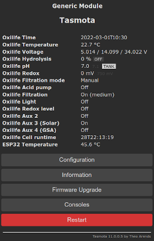
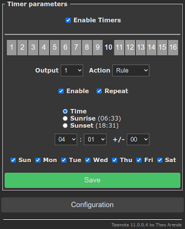

# Sugar Valley NeoPool Controller

!!! failure "This feature is not included in precompiled binaries"     

To use it you must [compile your build](Compile-your-build). Add the following to `user_config_override.h`:

```C
#ifndef USE_NEOPOOL
#define USE_NEOPOOL                       // Add support for Sugar Valley NeoPool Controller (+6k flash, +60 mem)
#endif
```

Optional set Modbus address matching the address of your device (default is 1) by add the following to `user_config_override.h`:

```C
#ifndef NEOPOOL_MODBUS_ADDRESS
#define NEOPOOL_MODBUS_ADDRESS       1    // Any modbus address
#endif
```

----

Sugar Valley NeoPool are water treatment systems also known under the names Hidrolife, Aquascenic, Oxilife, Bionet, Hidroniser, UVScenic, Station, Brilix, Bayrol and Hay. It uses a RS485 interface for enhancment equipments like Wifi-Interface or a second attached control panel. Most functions and parameters can be queried and controlled via the RS485 interface.

The sensor shows the most of parameters such as the built-in display:



Basic commands to control filtration and light are implemented.
However, the sensor provides commands to read and write the NeoPool controller Modbus register, means that everyone has the option of implementing their own commands via their home automation system or using the Tasmota build-in possibilities with [Rules](Commands/#rules) and [Backlog](Commands/#the-power-of-backlog).

## Configuration

### NeoPool controller connection

Connect NeoPool controller using a TTL UART to RS485 converter to two GPIOs of your ESP. It is recommended to use GPIO 1 and GPIO 3 for this because the ESP then uses the serial hardware interface.

Note that your TTL UART to RS485 converter also works with a operation voltage of 3.3V. Some converters are not designed for operating with 3.3V and only works with 5V TTL level - these converters are useless. __Do not operate your TTL UART to RS485 converter with 5V__, your converter __must be operated with the 3.3V__ from ESP, otherwise the ESP GPIO ports will be damaged.

The Sugar Valley NeoPool RS485 connector pins are located under the connection cover, for the Sugar-Valley products on the right-hand side next to the relay connections:


The pin assignment (from top to bottom):


| Pin | Description |
|-----|-------------|
|  1  | +12V        |
|  2  |             |
|  3  | Modbus A+   |
|  4  | Modbus B-   |
|  5  | Modbus GND  |

### Tasmota settings

If you followed the recommendations above, the two GPIOs will be assigned as follows under Tasmota **_Configuration -> Configure Module_**:

* first change Module type to `Generic (0)` - this will restart your Tasmota

After restart
* set GPIO1 to `NeoPool RX`
* set GPIO3 to `NeoPool TX`

so it looks like this


After Tasmota restarts the main screen should display the controller data as shown above.

### SENSOR data

Sensor data are send by `tele/%topic%/SENSOR` JSON reponse:

```json
{
  "Time": "2021-06-01T11:00:00+02:00",
  "NeoPool": {
    "Time": "2021-06-01T11:00:00",
    "Type": "Oxilife (green)",
    "Temperature": 23.5,
    "pH": {
      "Data": 7.2,
      "Max": 7.1,
      "State": 0,
      "Pump": 2,
      "FL1": 0,
      "Tank": 1
    },
    "Redox": 752,
    "Hydrolysis": {
      "Data": 100,
      "Unit": "%",
      "Runtime":"17T21:48:25",
      "State": "Pol2",
      "Cover": 0,
      "Boost": 0,
      "Low": 0
    },
    "Filtration": {
      "State": 1,
      "Speed": 2,
      "Mode": 1
    },
    "Light": 0,
    "Relay": {
      "State": [
        0,
        1,
        0,
        0,
        0,
        0,
        0,
        0
      ],
      "Acid": 0
    }
  },
  "TempUnit": "C"
}
```

### Commands

This sensor supports some basic [Tasmota commands](Commands).

Regardless, all other device registers can be read and write, so you can [enhance](#esp8266-enhancements) your Sugar Valley control by using basic `NPRead`/`NPWrite` commands.

Modbus register addresses and their meaning are described in [xsns_83_neopool.ino](https://github.com/arendst/Tasmota/blob/development/tasmota/xsns_83_neopool.ino) at the beginning and within document [171-Modbus-registers](https://downloads.vodnici.net/uploads/wpforo/attachments/69/171-Modbus-registers.pdf).<BR>
Please note that Sugar Valley Modbus registers are not byte addresses but modbus registers containing 16-bit values - don't think in byte memory layout.

Command|Parameters
:---|:---
NPFiltration<a id="NPFiltration"></a>|`{<state> {speed}}`<BR>get/set manual filtration (state = `0|1`, speed = `1..3`). Get if state is omitted, otherwise set accordingly  `<state>`:<ul><li>`0` - manual turn filtration pump off</li><li>`1` - manual turn filtration pump on</li></ul>optional speed control is possible for non-standard filtration types:<ul><li>`1` - slow</li><li>`2` - medium</li><li>`3` - fast</li></ul>
NPFiltrationMode<a id="NPFiltrationMode"></a>|`{<mode>}`<BR>get/set filtration mode (mode = `0..4|13`). Get if mode is omitted, otherwise set accordingly `<mode>`:<ul><li>`0` - *MANUAL* allows to turn the filtration (and all other systems that depend on it) on and off</li><li>`1` - *AUTO* allows filtering to be turned on and off according to the settings of the *MBF_PAR_TIMER_BLOCK_FILT_INT* timers.</li><li>`2` - *HEATING* similar to the AUTO mode, but includes setting the temperature for the heating function. This mode is activated only if the BF_PAR_HEATING_MODE register is at 1 and there is a heating relay assigned.</li><li>`3` - *SMART* adjusts the pump operating times depending on the temperature. This mode is activated only if the MBF_PAR_TEMPERATURE_ACTIVE register is at 1.</li><li>`4` - *INTELLIGENT* performs an intelligent filtration process in combination with the heating function. This mode is activated only if the MBF_PAR_HEATING_MODE register is at 1 and there is a heating relay assigned.</li><li>`13` - *BACKWASH* started when the backwash operation is activated.</ul>
NPTime<a id="NPTime"></a>|`{<time>}`<BR>get/set device time. Get if time is omitted, otherwise set device time accordingly `<time>`:<ul><li>`0` - sync with Tasmota local time</li><li>`1` - sync with Tasmota utc time</li><li>`2..4294967295` - set time as epoch</li></ul>
NPLight<a id="NPLight"></a>|`{<state> {delay}}`<BR>get/set light (state = `0..4`, delay = `5..100` in 1/10 sec). Get if state is omitted, otherwise set accordingly `<state>`:<ul><li>`0` - manual turn light off</li><li>`1` - manual turn light on</li><li>`2` - manual toogle light</li><li>`3` - switch light into auto mode according MBF_PAR_TIMER_BLOCK_LIGHT_INT settings</li><li>`4` - select light RGB LED to next program. This is normally done by power the light on (if currently off), then power off the light for a given time (delay) and power on again. The default delay is 15 (=1.5 sec).</ul>
NPOnError<a id="NPOnError"></a>|`{<repeat>}`<BR>get/set auto-repeat Modbus read/write commands on error (repeat = `0..10`). Get if repeat is omitted, otherwise set accordingly `<repeat>`:<ul><li>`0` - disable auto-repeat on read/write error</li><li>`1..10` - repeat commands n times until ok</li></ul>
NPResult<a id="NPResult"></a>|`{<format>}`<BR>get/set addr/data result format for read/write commands (format = `0|1`). Get if format is omitted, otherwise set accordingly `<format>`:<ul><li>`0` - output decimal numbers</li><li>`1` - output hexadecimal strings, this is the default</li></ul>
NPPHRes<a id="NPPHRes"></a>|`{<digits>}`<BR>get/set number of digits in results for PH value (digits = `0..3`).
NPCLRes<a id="NPPHRes"></a>|`{<digits>}`<BR>get/set number of digits in results for CL value (digits = `0..3`).
NPIonRes<a id="NPPHRes"></a>|`{<digits>}`<BR>get/set number of digits in results for ION value (digits = `0..3`).
NPRead<a id="NPRead"></a>|`<addr> {<cnt>}`<BR>read 16-bit register (addr = `0..0x060F`, cnt = `1..30`). cnt = `1` if omitted
NPReadL<a id="NPReadL"></a>|`<addr> {<cnt>}`<BR>read 32-bit register (addr = `0..0x060F`, cnt = `1..15`). cnt = `1` if omitted
NPWrite<a id="NPWrite"></a>|`<addr> <data> {<data>...}`<BR>write 16-bit register (addr = `0..0x060F`, data = `0..0xFFFF`). Use of data max 10 times
NPWriteL<a id="NPWriteL"></a>|`<addr> <data> {<data>...}`<BR>write 32-bit register (addr = `0..0x060F`, data = `0..0xFFFFFFFF`). Use of data max 10 times
NPBit<a id="NPBit"></a>|`<addr> <bit> {<data>}`<BR>read/write a 16-bit register single bit (addr = `0..0x060F`, bit = `0..15`, data = `0|1`). Read if data is omitted, otherwise set single bit
NPBitL<a id="NPBitL"></a>|`<addr> <bit> {<data>}`<BR>read/write a 32-bit register single bit (addr = `0..0x060F`, bit = `0..31`, data = `0|1`). Read if data is omitted, otherwise set single bit
NPEscape<a id="NPEscape"></a>|clears possible errors (like pump exceeded time etc.)
NPExec<a id="NPExec"></a>|take over changes without writing to EEPROM. This command is necessary e.g. on changes in *Installer page* (addr 0x0400..0x04EE).
NPSave<a id="NPSave"></a>|write data permanently into EEPROM.<BR>During the EEPROM write procedure the NeoPool device may be unresponsive to MODBUS requests, this process always takes less than 1 second.<BR>Since this process is limited by the number of EEPROM write cycles, it is recommend to write all necessary changes to the registers and only then execute EEPROM write process using this command.<BR>__Note: The number of EEPROM writes for Sugar Valley NeoPool devices is guaranteed 100,000 cycles. As soon as this number is exceeded, further storage of information can no longer be guaranteed__.

#### Examples

##### Get filtration mode
```json
NPFiltrationMode
RESULT = {"NPFiltrationmode":"Manual"}
```

##### Set filtration mode
```json
NPFiltrationMode 1
{"NPFiltrationmode":"Auto"}
```

##### Enable hydrolysis boost mode without redox control
```json
Backlog NPWrite 0x020C,0x85A0;NPSave;NPExec;NPWrite 0x0110,0x7F
RESULT = {"NPWrite":{"Address":"0x020C","Data":"0x85A0"}}
RESULT = {"NPSave":"Done"}
RESULT = {"NPExec":"Done"}
RESULT = {"NPWrite":{"Address":"0x0110","Data":"0x0000"}}
```

##### Disable hydrolysis boost mode
```json
Backlog NPWrite 0x020C,0;NPSave;NPExec;NPWrite 0x0110,0x7F
RESULT = {"NPWrite":{"Address":"0x020C","Data":"0x0000"}}
RESULT = {"NPSave":"Done"}
RESULT = {"NPExec":"Done"}
RESULT = {"NPWrite":{"Address":"0x0110","Data":"0x0000"}}
```

##### Switch light relay on
```json
NPLight 1
RESULT = {"NPLight":"ON"}
```

##### Read Heating setpoint temperature MBF_PAR_HEATING_TEMP
```json
Backlog NPResult 0;NPRead 0x416
RESULT = {"NPResult":0}
RESULT = {"NPRead":{"Address":1046,"Data":28}}
```

##### Read system time MBF_PAR_TIME_* as 32-bit register using decimal output
```json
Backlog NPResult 0;NPReadL 0x408
RESULT = {"NPResult":0}
RESULT = {"NPReadL":{"Address":1032,"Data":1612124540}}
```

##### Enable temperature module by setting MBF_PAR_TEMPERATURE_ACTIVE and set it permanently into EEPROM
```json
Backlog NPWrite 0x40F,1;NPSave
RESULT = {"NPWrite":{"Address":"0x040F","Data":"0x0001"}}
RESULT = {"NPSave":"Done"}
```

##### Hide auxiliary relay display from main menu by setting bit 3 of MBF_PAR_UICFG_VISUAL_OPTIONS
```json
NPBit 0x605,3,1
RESULT = {"NPBit":{"Address":"0x0605","Data":"0x08C8"}}
```

##### Read Filtration interval 1-3 settings
```json
Backlog NPResult 0;NPRead 0x434;NPReadL 0x435,7;NPRead 0x443;NPReadL 0x444,7;NPRead 0x452;NPReadL 0x0453,7
RESULT = {"NPResult":0}
RESULT = {"NPRead":{"Address":1076,"Data":1}}
RESULT = {"NPReadL":{"Address":1077,"Data":[28800,0,86400,14400,0,1,0]}}
RESULT = {"NPRead":{"Address":1091,"Data":1}}
RESULT = {"NPReadL":{"Address":1092,"Data":[43200,0,86400,21600,0,1,0]}}
RESULT = {"NPRead":{"Address":1106,"Data":1}}
RESULT = {"NPReadL":{"Address":1107,"Data":[0,0,86400,0,0,1,0]}} *
```

##### Set filtration interval 1 to daily 9:00 - 12:30 (9:00: 3600 * 9 ≙ 32400 / 12:30 ≙ 3,5h = 12600)
```json
NPWriteL 0x435,32400 0 86400 12600
RESULT = {"NPWriteL":{"Address":1077,"Data":[32400,0,86400,12600]}}
```

##### Manual switch relay 7 (Aux4) to on (to do this we set MBF_PAR_TIMER_BLOCK_AUX4_INT1+MBV_TIMER_OFFMB_TIMER_ENABLE to MBV_PAR_CTIMER_ALWAYS_ON)
```json
Backlog NPWrite 0x4D9,3;NPExec
RESULT = {"NPWrite":{"Address":"0x04D9","Data":"0x0003"}}
RESULT = {"NPExec":"Done"}
```

##### Manual switch relay 7 (Aux4) to off (to do this we set MBF_PAR_TIMER_BLOCK_AUX4_INT1+MBV_TIMER_OFFMB_TIMER_ENABLE to MBV_PAR_CTIMER_ALWAYS_OFF)
```json
Backlog NPWrite 0x4D9,4;NPExec
RESULT = {"NPWrite":{"Address":"0x04D9","Data":"0x0004"}}
RESULT = {"NPExec":"Done"}
```

##### Read Modbus autorepeat on communication error
```json
NPOnError
RESULT = {"NPOnError":2}
```

##### Set Modbus autorepeat on communication error
```json
NPOnError 3
RESULT = {"NPOnError":3}
```

### ESP8266 Enhancements

#### Add buttons for filtration and light control

Add two dummy buttons to control the filtration pump and the light.

First we define two dummy relay (which does not have any physical function) on two unused GPIO (here we use GPIO0 and GPIO4 where we define Tasmota Relay 1 and 2):

```haskell
Backlog GPIO0 224;GPIO4 225
```

Then we rename the buttons for better visibility:

```haskell
Backlog WebButton1 Filtration;WebButton2 Light
```

Now we have the WebGUI buttons like this:


but missing the functionality behind. For that we use [Rules](Rules) and connect the states for Tasmota Power, Neopool filtration and light:

```haskell
Rule1
  ON Power1#State==0 DO NPFiltration %value% ENDON
  ON Power1#State==1 DO NPFiltration %value% ENDON
  ON NeoPool#Filtration#State==0 DO Power1 %value% ENDON
  ON NeoPool#Filtration#State==1 DO Power1 %value% ENDON
  ON Power2#State==0 DO NPLight %value% ENDON
  ON Power2#State==1 DO NPLight %value% ENDON
  ON NeoPool#Light==0 DO Power2 %value% ENDON
  ON NeoPool#Light==1 DO Power2 %value% ENDON
```

Don't wonder about the double trigger definition, which at first glance seem nonsensical - they are necessary so that the rule does not trigger endless.

At least we activate the rule:

```haskell
Backlog Rule1 5;Rule1 1
```

Here it is important to enable the Rule ONCE function, which prevents that the trigger are trigger themself in a loop.

You can now control filtration and light using the WebGUI and get the current status of the device elements when they are switched by auto-mode or manually on the device directly.


Additional advantage is that you can also use Tasmota Timer switching Power1 (=filtration) and Power2 (light) for your needs.

#### Daily sync device time to Tasmota time

Since the NeoPool devices, without a WiFi module, have no way of synchronizing their internal clock with an external clock and, in addition, the accuracy of the internal clock leaves something to be desired, it makes sense to synchronize the clock with Tasmota once a day. Advantageously, we do this at night after a possible daylight saving time or normal time change.

Sync time is easy and we have two options for implementing it:

##### Option 1: Sync device using rules only

Simply use the rule:

```haskell
Rule2
  ON Time#Minute=241 DO NPTime 0 ENDON
```

and activate it:

```haskell
Backlog Rule2 4;Rule2 1
```

This syncronize the device time using Tasmota local time each night at 4:01 h.

##### Option 2: Sync device using Tasmota timer

With this second option it is easier to setup the synchronization times using WebGUI and the Tasmota build-in timer.

Write a rule that synchronizes the time and that is triggered by the Tasmota built-in timer (here we use timer 10):

```haskell
Rule2
  ON Clock#Timer=10 DO NPTime 0 ENDON
```

and activate it:

```haskell
Backlog Rule2 4;Rule2 1
```

Configure Tasmota Timer 10 for your needs (for example using same rule to sync time to Tasmota local time every day at 4:01 h).



#### Add rule event macros for easier control

For easier reading/writing of the register with simple named event commands, we can define rules to handle it.

Note: To use the following rules you must [compile your build](Compile-your-build) adding the following to `user_config_override.h`:

```C
#ifndef USE_NEOPOOL
#define USE_RULES                                // Add support for rules
#endif

#ifndef USE_EXPRESSION
#define USE_EXPRESSION                          // Add support for expression evaluation in rules
#endif

#ifndef SUPPORT_IF_STATEMENT
#define SUPPORT_IF_STATEMENT                    // Add support for IF statement in rules
#endif
```

Then we can define [rule events](Rules) to control pH, redox and hydrolysis level:

```haskell
Rule2
  ON Event#PH DO IF (%value%>=690 AND %value%<=780) NPWrite 0x504,%value%;NPExec ELSE NPRead 0x504 ENDIF ENDON
  ON Event#Redox DO IF (%value%>=400 AND %value%<=900) NPWrite 0x508,%value%;NPExec ELSE NPRead 0x508 ENDIF ENDON
  ON Event#Hydrolysis DO IF (%value%>=0 AND %value%<=1000) NPWrite 0x502,%value%;NPExec ENDIF ENDON
```

At least we activate the rule:

```haskell
Backlog Rule2 4;Rule2 1
```

Now we can use the Tasmota command Event to control Sugar Valley values (use `NPResult 0` before for decimal value results)):

##### Read/write pH setpoint

Note: pH setpoint is stored as setpoint*100

Get current pH setpoint:

```json
Event PH
RESULT = {"NPRead":{"Address":1284,"Data":710}}
```

Set new pH setpoint to 7.0

```json
Event PH=700
RESULT = {"NPRead":{"Address":1284,"Data":710}}
```

##### Read/write redox setpoint

Get current redox setpoint:

```json
Event Redox
{"NPRead":{"Address":1288,"Data":750}}
```

Set redox setpoint to 780

```json
Event Redox=780
{"NPRead":{"Address":1288,"Data":780}}
```

##### Read/write hydrolysis setpoint

Note: Hydrolysis setpoint percentage is stored as setpoint*10

Get current hydrolysis setpoint:

```json
Event Hydrolysis
{"NPRead":{"Address":1282,"Data":1000}}
```

Set hydrolysis setpoint to 80%

```json
Event Hydrolysis=800
{"NPRead":{"Address":1282,"Data":800}}
```