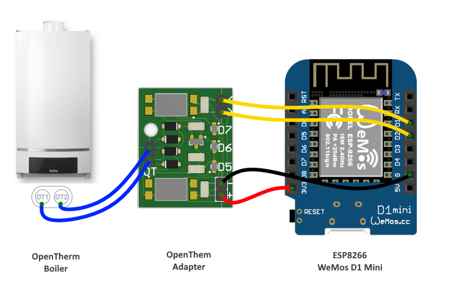
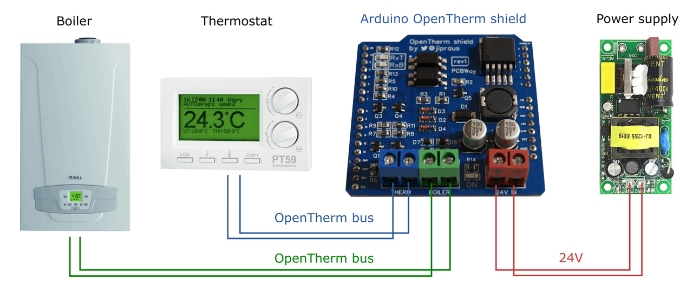
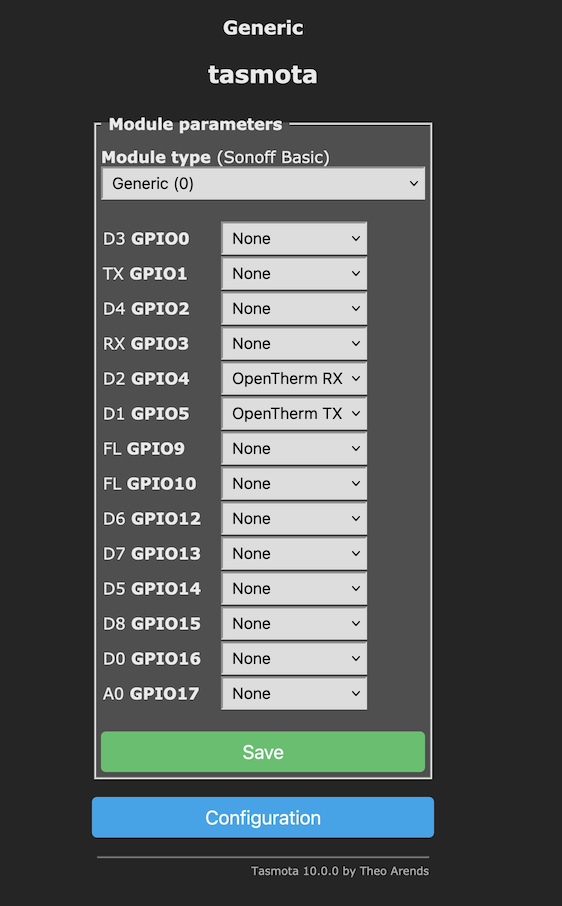
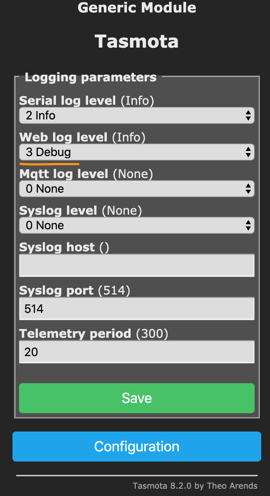
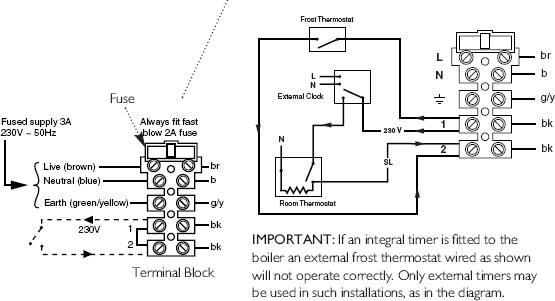
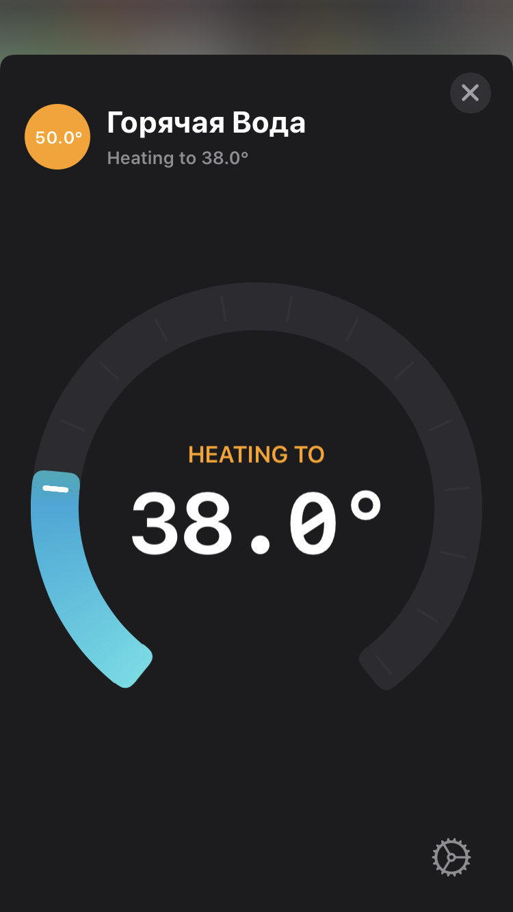

!!! failure "This feature is not included in precompiled binaries."
To use it, you must [compile your build](Compile-your-build). Add the following to `user_config_override.h`:

```
#ifndef USE_OPENTHERM
#define USE_OPENTHERM
#endif
```
----

!!! info "Implementation of OpenTherm protocol"

OpenTherm integration is based on OpenTherm protocol specification v2.2 and works with all OpenTherm compatible boilers.

OpenTherm protocol requires a simple low voltage two-wire connection to the boiler, but voltage levels (7..15V) still much higher than ESP8266 levels, which requires OpenTherm Adapter.

## Compatible Open Therm Adapters
- [Ihor Melnyk OpenTherm Adapter](http://ihormelnyk.com/opentherm_adapter)
- [OpenTherm Gateway Arduino shield](https://www.tindie.com/products/jiripraus/opentherm-gateway-arduino-shield/)
- [OpenTherm master shield for Wemos/Lolin](https://www.tindie.com/products/thehognl/opentherm-master-shield-for-wemoslolin/)

All adapters have a fully isolated circuit from the boiler. However, please be aware that you can damage your boiler. You may also void your boiler warranty by installing this hardware. Please consult with your boiler manufacturer.

!!! note
    For my home automation project, I used [OpenTherm Gateway Arduino shield](https://www.tindie.com/products/jiripraus/opentherm-gateway-arduino-shield/); however, this project uses [OpenTherm](https://github.com/ihormelnyk/opentherm_library) library from [Ihor Melnyk](http://ihormelnyk.com/). I assume all adapters will work.

Please note, this integration does not work with the [OTGW](http://otgw.tclcode.com/index.html#intro). You might want to take a look at the [HA OpenTherm GW](https://www.home-assistant.io/integrations/opentherm_gw/)

## Connecting to the Boiler

Current integration acts as a master to the boiler.



!!! note
    If OpenTherm `master` device is present, the boiler may disable it's front panel controls. Users may not be able to set a boiler and hot water temperature through the boiler. Now it's the responsibility of the `master` device. This behavior might vary across different boilers.

You may disable this behavior by removing [OpenTherm Slave Status](https://github.com/arendst/Tasmota/blob/development/tasmota/xsns_69_opentherm_protocol.ino#L58-L67) command. However, the integration will not be able to read flame/heating/failure flags.

[OpenTherm Gateway Arduino shield](https://www.tindie.com/products/jiripraus/opentherm-gateway-arduino-shield/) support a gateway mode. As of now, this mode does *not supported* by the integration.



!!! failure "As of now, gateway mode is not supported"

## Setting Up Tasmota

!!! note
    You need to define `USE_OPENTHERM` and rebuild Tasmota to enable OpenTherm integration.

- Log into your Tasmota device
- Go to `Configuration` -> `Configure Module`
- Select `Generic` module type, save & restart
- In the `Module parameters` window, assign `OpenTherm RX` and `OpenTherm TX` to the corresponding pins
- Save settings and restart



!!! note
    The integration attaches ISR to the `RX` GPIO to avoid pooling. That GPIO should support interrupts. Please consider this while working on the schematics.


## Troubleshooting

In order to troubleshoot you may need to enable `Debug` or `More Debug` logging level,



After restart you might see the following in the logs:
```
00:00:00 CFG: Loaded from flash at 3F7, Count 72
00:00:00 QPC: Flag 0E
00:00:00 CFG: CR 338/699
00:00:00 SRC: Restart
00:00:00 Project tasmota Tasmota Version 8.2.0(sensors)-STAGE
00:00:01 [OTH]: perform handshake
00:00:01 [OTH]: Processing response. Status=SUCCESS, Response=0x4003011B
00:00:01 [OTH]: getLastResponseStatus SUCCESS. Slave Cfg: 4003011B
00:00:01 [OTH]: Processing response. Status=SUCCESS, Response=0xC0000000
00:00:02 [OTH]: Setting Boiler Temp. Old: 0, New: 85
00:00:02 [OTH]: Processing response. Status=SUCCESS, Response=0xD0015500
00:00:02 [OTH]: Setting Hot Water Temp. Old: 0, New: 37
12:34:58 [OTH]: Processing response. Status=INVALID, Response=0x70730000
12:34:58 [OTH]: command OEMD is not supported by the boiler. Last status: INVALID
12:35:00 [OTH]: Processing response. Status=INVALID, Response=0xF01B0000
12:35:00 [OTH]: command TOUT is not supported by the boiler. Last status: INVALID
12:35:00 [OTH]: Processing response. Status=INVALID, Response=0x701C0000
12:35:00 [OTH]: command TRET is not supported by the boiler. Last status: INVALID
12:35:16 MQT: tele/boiler/SENSOR = {"Time":"2020-05-12T12:35:16","ANALOG":{"A0":7},"OPENTHERM":{"conn":"BUSY","settings":3,"SLAVE":{"FAULT":0,"CH":0,"DHW":0,"FL":0,"COOL":0,"CH2":0,"DIAG":0,"RAW":3221225472},"BTMP":{"FAULT":0,"REQ":85.0,"ACT": 85.0},"HWTMP":{"REQ":37.0,"ACT": 37.0},"ASFF":{"FC":0,"OFC":0},"FLM":0.0,"TB":31.0,"TDHW":30.0,"DHWS":37.0,"TMAX":0.0}}
```

In the example, `perform handshake` was successful, and the OpenTherm integration started to fetch various OpenTherm statuses.

!!! note
    Your boiler may not respond to some of the OpenTherm commands. The integration made 3 attempts to execute the command. If the third attempt failed, the command marked as not supported and excluded from the rotation.

## External Thermostat Wiring and Safety

Central heating is the last thing you want to fail in your home. You might have significant damage to your property in case of the software bug or your custom hardware or wiring failure.

As a last resort measure, you probably want to use some sort of mechanical thermostat, which turns on your boiler if the temperature drops below the safe threshold.



In the worst-case scenario, your OpenTherm hardware stop communicating with the boiler. Proper boiler implementation will flag external panel error and take control back, following the external thermostat circuit state.

The second issue can be with your thermostat logic, especially if your logic is running on some external device. To address this, OpenTherm integration is using `Diagnostics Indication` to enable central heating. That way, if your external thermostat report freezing condition, OpenTherm integration activates heating. To enable this option, set the `CHOD` flag.

!!! note
    Another use case for the `CHOD` flag might be an external hot water tank storage using central heating to heat the hot water in the tank.

## Configuration

OpenTherm integration supports the following commands.

- `ot_flags`            Get/Set OpenTherm flags
- `ot_tboiler`          Get/Set central heating temperature
- `ot_twater`           Get/Set domestic hot water temperature
- `ot_save_setpoints`   Save central heating and domestic hot water temperatures
- `ot_ch`               Activate/Deactivate central heating

### ot_flags command

OpenTherm integration supports the following flags:

- `CHOD` - Enable CH (central heating) on diagnostics flag. See [External Thermostat](#external-thermostat-wiring-and-safety) section
- `DHW`  - Enable Domestic Hot Water. If you have an on-demand gas heater, it won't start heating immediately, but enable heating when water is on
- `CH`   - If set, activate central heating permanently, following the `ot_tboiler` setpoint value. If disabled and `CHOD` is set, it follows the `Diagnostics` flag. Otherwise, heating is controlled by the `ot_ch` status
- `COOL` - Enable cooling, if supported. Refer to your boiler manual.
- `OTC`  - Enable external temperature compensation thermistor. Refer to your boiler manual.
- `CH2`  - Enable auxiliary central heating. Refer to your boiler manual.

!!! note
    During the first run, `ot_flags` is set to the `CHOD,DHW`. Hot water setpoint set to 36-degree Celsius and central heating temperature set to 85 degree celsius


To get OpenTherm flags, type `ot_flags`
```
13:49:48 CMD: ot_flags
13:49:48 MQT: stat/boiler/RESULT = CHOD,DHW
```

To set OpenTherm flags, type `ot_flags DHW,CH,OTC`
```
13:49:48 CMD: ot_flags DHW,CH,OTC
13:49:48 MQT: stat/boiler/RESULT = DHW,CH,OTC
```

### ot_tboiler command

`ot_tboiler` set boiler (CH) desired temperature. The actual command to the boiler will be issued if your new temperature difference bigger than the [OPENTHERM_BOILER_SETPOINT_TOLERANCE](https://github.com/arendst/Tasmota/blob/development/tasmota/xsns_69_opentherm_protocol.ino#L26) value which is 1-degree Celsius as of today.

```
14:12:04 CMD: ot_tboiler
14:12:04 MQT: stat/boiler/RESULT = {"ot_tboiler":60.0}
```

```
14:12:55 CMD: ot_tboiler 85
14:12:55 MQT: stat/boiler/RESULT = {"ot_tboiler":85.0}
14:12:57 [OTH]: Setting Boiler Temp. Old: 60, New: 85
```

!!! note
    Some boilers might write setpoint temperature into the Flash memory. Having PID controlled appliance may produce a lot of small fluctuations in the setpoint value, wearing out Boiler flash memory.

!!! warning
    `ot_tboiler` do not write the value in the Tasmota settings, reducing Flash memory writes. To store it permanently, invoke `ot_save_setpoints` command after `ot_tboiler` command

### ot_twater command

`ot_twater` set domestic hot water temperature setpoint (DHW).

!!! warning
    `ot_twater` do not write the value in the Tasmota settings. To store it permanently, invoke `ot_save_setpoints` command after `ot_twater` command.

```
14:13:55 CMD: ot_twater
14:13:55 MQT: stat/boiler/RESULT = {"ot_twater":38.0}
```

```
14:13:55 CMD: ot_twater 40
14:13:55 MQT: stat/boiler/RESULT = {"ot_twater":40.0}
```


### ot_save_setpoints command

`ot_save_setpoints` store boiler and domestic hot water setpoints into the flash memory of the Tasmota.

### ot_ch command

`ot_ch` enable or disable central heating (CH). The Boiler follows the `ot_tboiler` temperature setpoint.

```
14:14:57 CMD: ot_ch
14:14:57 MQT: stat/boiler/RESULT = {"ot_ch":0}
```

```
14:15:57 CMD: ot_ch 1
14:15:57 MQT: stat/boiler/RESULT = {"ot_ch":1}
```

!!! warning
    `ot_ch 0` won't turn the boiler off, if `CHOD` flag is set and external thermostat requires heat

## Setting Hot Water temperature

One of the drawbacks, at least with my boiler, is that the boiler disables all the external knobs, so I can not set up the desired hot water temperature from the boiler itself. You might come up with the automation, setting hot water temperature by some schedule.

Another way is to use Home Assistant with the HomeKit integration. I created [MQTT Hot Water Heater](https://github.com/yury-sannikov/ha-mqtt-water-heater) integration to the Home Assistant, so the Water Heater is exposed to the Home Kit. You should be able to install it through [HACS](https://hacs.xyz/)



You can add the following configuration into the `configuration.yaml` of your Home Assistant set up.

```
water_heater:
  platform: mqtt_water_heater
  name: "Water Heater"
  state_topic: "tele/boiler/SENSOR"
  command_topic: "cmnd/boiler/OT_TWATER"
  value_template: "{{ value_json.OPENTHERM.DHWS }}"
  qos: 0
  availability_topic: "tele/boiler/LWT"
  payload_available: "Online"
  payload_not_available: "Offline"
  target_temperature: 38
  heater_min_temperature: 35
  heater_max_temperature: 50
```

## Automation Examples

This automation example turns on then Bathroom towel heater if someone is using hot water more than 5 minutes in the evening or more than 7 minutes in the evening.
Bathroom towel heater has a coolant pump relay at `192.168.1.xx`
Also, it always turns on the heater on Clock#Timer3 event, working according to the schedule

It publishes state to the `st/boiler/rr_dry` for the Home Assistant bookkeeping.
Also, it set boiler temperature to the %var3% value if external heating is required during the bathroom Dry mode.

Also, it syncs up the coolant pump state in case of the pump controller power outage.

```
# var1 - hot water ON time to enable bathroom Dry mode
# var2 - Bathroom Dry Mode boiler setpoint
# var3 - Normal Mode boiler setpoint
# var15 - a lock of the flame mode to avoid timer restart
# var16 - sync power4 state
# use VAR3 to set the actual boiler temperature setpoint

# If heat demand is on during RR Dry Mode, the temperature should be set back to the normal

Rule1
on system#boot do backlog TelePeriod 20; var1=540; var2=60; var3=85; var15 0; var16 0 endon
on tele-OPENTHERM#SLAVE#FL do WebSend [192.168.1.xx] POWER4 %var16%; endon
on Clock#Timer=1 do var1=300 endon
on Clock#Timer=2 do var1=420 endon
on Clock#Timer=3 do event dr=1 endon
on var3#state do ot_tboiler %value% endon

Rule2
on tele-OPENTHERM#SLAVE#DHW>%var15% do backlog RuleTimer1 %var1%; var15 1 endon
on tele-OPENTHERM#SLAVE#DHW=0 do backlog RuleTimer1 0; var15 0 endon
on Rules#Timer=2 do backlog ot_ch 0; ot_tboiler %var3%; var16 0; WebSend [192.168.1.xx] POWER4 OFF; publish st/boiler/rr_dry 0 endon
on Rules#Timer=1 do event dr=1 endon
on event#dr do backlog RuleTimer2 7200; ot_ch 1; ot_tboiler %var2%; var16 1; WebSend [192.168.1.xx] POWER4 ON; publish st/boiler/rr_dry 1 endon

Rule3
on tele-OPENTHERM#SLAVE#DIAG=1 do ot_tboiler %var3%; endon
on tele-OPENTHERM#SLAVE#DIAG=0 do ot_tboiler %var2%; endon

```
