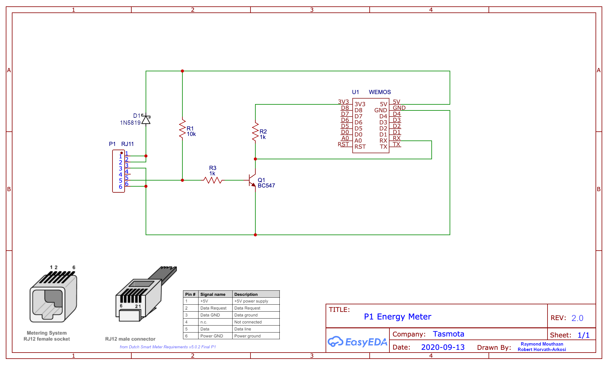

# P1 Smart Meter
 Reading serial data from a P1 smart meter using a Wemos with Tasmota installed.

 Tested on the following smart meters:
  - Kaifa MA105C
  - De Landis + Gyr, E350 (ZCF110)
  - Sanxing SX631 (S34U18)

## Schematics
 

The transistor makes sure that the RxD signal is converted and inverted to 3.3V.
According to the [DSMR v5.0.2 P1 specification](https://www.netbeheernederland.nl/_upload/Files/Slimme_meter_15_a727fce1f1.pdf) the P1 connector on the meter provides 5V DC output for the OSM (Other Service Module) connected to this port, which is able to continuously supply maximum current of 250mA. A Wemos D1 mini module draws way less than 100mA so it is perfectly safe to use this as a power source. It can be powered through the 5V pin just inserting a protection diode.

## Tasmota Settings
In the **_Configuration -> Configure Module_** page, select module `Generic (18)`

From the web console set the serial delimiter to 10 (newline). This makes Tasmota publish each line of the telegram separately to mqtt. 

- `SerialDelimiter 10`
- `SerialSend 1`

For more details see [serial-bridge](Commands.md#serial-bridge).

Should you run into problems with serial buffer overflows, then try to increase the serial buffer size using `SerialBuffer 520`. This will **not be automatically persisted**, so try the command first and when the device works fine after having increased the serial buffer size, then try to add a rule like:

```haskell
Rule1 ON Power1#Boot DO SerialBuffer 520 ENDON
```

## Example output
Below an example of the telegram message published (per line) to mqtt. From here your HA system can process the data required for your needs.

```json
09:16:17 MQT: tele/wemos-9/RESULT = {"SerialReceived":"/KFM5KAIFA-METER\r"}
09:16:17 MQT: tele/wemos-9/RESULT = {"SerialReceived":"\r"}
09:16:17 MQT: tele/wemos-9/RESULT = {"SerialReceived":"1-3:0.2.8(42)\r"}
09:16:17 MQT: tele/wemos-9/RESULT = {"SerialReceived":"0-0:1.0.0(200913101618S)\r"}
09:16:17 MQT: tele/wemos-9/RESULT = {"SerialReceived":"0-0:96.1.1(4530303235303030303639363432393136)\r"}
09:16:17 MQT: tele/wemos-9/RESULT = {"SerialReceived":"1-0:1.8.1(005779.835*kWh)\r"}
09:16:17 MQT: tele/wemos-9/RESULT = {"SerialReceived":"1-0:1.8.2(005583.617*kWh)\r"}
09:16:17 MQT: tele/wemos-9/RESULT = {"SerialReceived":"1-0:2.8.1(000000.000*kWh)\r"}
09:16:17 MQT: tele/wemos-9/RESULT = {"SerialReceived":"1-0:2.8.2(000000.000*kWh)\r"}
09:16:17 MQT: tele/wemos-9/RESULT = {"SerialReceived":"0-0:96.14.0(0001)\r"}
09:16:17 MQT: tele/wemos-9/RESULT = {"SerialReceived":"1-0:1.7.0(00.498*kW)\r"}
09:16:17 MQT: tele/wemos-9/RESULT = {"SerialReceived":"1-0:2.7.0(00.000*kW)\r"}
09:16:17 MQT: tele/wemos-9/RESULT = {"SerialReceived":"0-0:96.7.21(00000)\r"}
09:16:17 MQT: tele/wemos-9/RESULT = {"SerialReceived":"0-0:96.7.9(00000)\r"}
09:16:17 MQT: tele/wemos-9/RESULT = {"SerialReceived":"1-0:99.97.0(1)(0-0:96.7.19)(000101000001W)(2147483647*s)\r"}
09:16:17 MQT: tele/wemos-9/RESULT = {"SerialReceived":"1-0:32.32.0(00000)\r"}
09:16:17 MQT: tele/wemos-9/RESULT = {"SerialReceived":"1-0:32.36.0(00000)\r"}
09:16:17 MQT: tele/wemos-9/RESULT = {"SerialReceived":"0-0:96.13.1()\r"}
09:16:17 MQT: tele/wemos-9/RESULT = {"SerialReceived":"0-0:96.13.0()\r"}
09:16:17 MQT: tele/wemos-9/RESULT = {"SerialReceived":"1-0:31.7.0(002*A)\r"}
09:16:17 MQT: tele/wemos-9/RESULT = {"SerialReceived":"1-0:21.7.0(00.496*kW)\r"}
09:16:17 MQT: tele/wemos-9/RESULT = {"SerialReceived":"1-0:22.7.0(00.000*kW)\r"}
09:16:17 MQT: tele/wemos-9/RESULT = {"SerialReceived":"0-1:24.1.0(003)\r"}
09:16:17 MQT: tele/wemos-9/RESULT = {"SerialReceived":"0-1:96.1.0(4730303332353631323736373836373136)\r"}
09:16:17 MQT: tele/wemos-9/RESULT = {"SerialReceived":"0-1:24.2.1(200913100000S)(04139.079*m3)\r"}
09:16:17 MQT: tele/wemos-9/RESULT = {"SerialReceived":"!F798\r"}
```

## Description of each line 
see also [DSMR 5.0 - P1 Companion Standard](https://www.netbeheernederland.nl/_upload/Files/Slimme_meter_15_a727fce1f1.pdf)

``` 
Header information - {"SerialReceived":"/KFM5KAIFA-METER"}
Empty line - {"SerialReceived":""}
Version information for P1 output - {"SerialReceived":"1-3:0.2.8(42)"}
Date-time stamp of the P1 message - {"SerialReceived":"0-0:1.0.0(181227093413W)"}
Equipment identifier - {"SerialReceived":"0-0:96.1.1(4530303235303030303639363432393136)"}
electricityUsedTariff1 >> Meter Reading electricity delivered to client (Tariff 1) in 0,001 kWh - {"SerialReceived":"1-0:1.8.1(002293.192*kWh)"}
electricityUsedTariff2 >> Meter Reading electricity delivered to client (Tariff 2) in 0,001 kWh - {"SerialReceived":"1-0:1.8.2(002523.640*kWh)"}
Meter Reading electricity delivered by client (Tariff 1) in 0,001 kWh - {"SerialReceived":"1-0:2.8.1(000000.000*kWh)"}
Meter Reading electricity delivered by client (Tariff 2) in 0,001 kWh - {"SerialReceived":"1-0:2.8.2(000000.000*kWh)"}
electricityActiveTariff >> Tariff indicator electricity. The tariff indicator can also be used to switch tariff dependent loads e.g boilers. This is the responsibility of the P1 user - {"SerialReceived":"0-0:96.14.0(0002)"}
Actual electricity power delivered (+P) in 1 Watt resolution - {"SerialReceived":"1-0:1.7.0(00.474*kW)"}
Actual electricity power received (-P) in 1 Watt resolution - {"SerialReceived":"1-0:2.7.0(00.000*kW)"}
Number of power failures in any phase - {"SerialReceived":"0-0:96.7.21(00000)"}
Number of long power failures in any phase - {"SerialReceived":"0-0:96.7.9(00000)"}
Power Failure Event Log (long power failures) - {"SerialReceived":"1-0:99.97.0(1)(0-0:96.7.19)(000101000001W)(2147483647*s)"}
Number of voltage sags in phase L1 - {"SerialReceived":"1-0:32.32.0(00000)"}
Number of voltage swells in phase L1 - {"SerialReceived":"1-0:32.36.0(00000)"}
Text message max 1024 characters. - {"SerialReceived":"0-0:96.13.1()"}
Text message max 1024 characters. - {"SerialReceived":"0-0:96.13.0()"}
Instantaneous current L1 in A resolution - {"SerialReceived":"1-0:31.7.0(002*A)"}
Instantaneous active power L1 (+P) in W resolution - {"SerialReceived":"1-0:21.7.0(00.474*kW)"}
Instantaneous active power L1 (-P) in W resolution - {"SerialReceived":"1-0:22.7.0(00.000*kW)"}
Device-Type - {"SerialReceived":"0-1:24.1.0(003)"}
Equipment identifier (Gas) - {"SerialReceived":"0-1:96.1.0(4730303332353631323736373836373136)"}
GasMeterReadingFiveMinutes >> Last 5-minute value (temperature converted), gas delivered to client in m3, including decimal values and capture time - {"SerialReceived":"0-1:24.2.1(181227090000W)(02910.491*m3)"}
{"SerialReceived":"!5E3E"}
```

Additional info
* [Kaifa Meters (Dutch)](https://www.liander.nl/sites/default/files/Meters-Handleidingen-elektriciteit-Kaifa-uitgebreid.pdf)
* [DSMR 5.0 - P1 Companion Standard](https://www.netbeheernederland.nl/_upload/Files/Slimme_meter_15_a727fce1f1.pdf)
