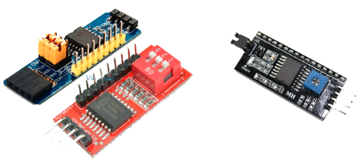
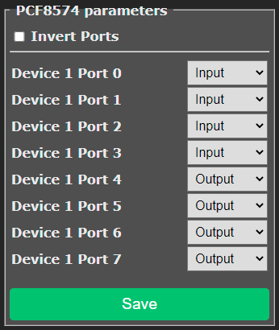
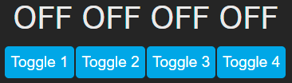
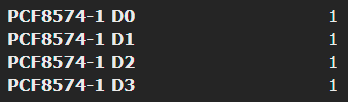

# PCF8574 / PCF8574A GPIO Expander

!!! Warning
    The driver for PCF8574 is not included in any of Tasmota prebuild binaries. See [compiling for PCF8574](#compiling-for-pcf8574).

## Introduction

PCF8574 and PCF8574A are I2C 8-bit IO port extender originally designed by Philips (now NXP) but also 
now available from various manufacturer.

* PCF8574 and PCF8574A at [NXP](https://www.nxp.com/docs/en/data-sheet/PCF8574_PCF8574A.pdf)
* [PCF8574](https://www.ti.com/lit/ds/symlink/pcf8574.pdf) and [PCF8574A](https://www.ti.com/lit/ds/symlink/pcf8574a.pdf) at Texas Instruments

As usual when using an electronic part, reading the datasheet is highly recommended as the below 
document only focus on Tasmota integration.

A few different breakout boards are available although some are dedicated to be mounted as a backpack on
standard 16x2 or 16x4 LCD displays and are not suitable for general I/Os (but works well with tasmota-display).



* On the left: generic modules suitable for extending IO
* On the right: specific module to control a LCD display (not the purpose of this doc page)

#### Supported I2C addresses and number of PCF8574

PCF8574 and PCF8574A are identical functionally and each can be configured to work on 1 of 8 possible I2C address.
PCF8574 can use one address of 0x20 to 0x27 and PCF8574A can use one of 0x38 to 0x3F.

As of today, Tasmota driver supports:

* Up to 4 PCF8574 OR PCF8574A is supported by Tasmota allowing up to 32 additional GPIO pins.
* Addresses 0x27 and 0x38 are excluded to avoid conflict with other I2C peripheral which can't 
  be differentiated at run-time.

!!! warning "If USE_MCP230xx_ADDR is defined, this address is reserved for MCP230XX IO expander."

## Compiling Additional Features

The PCF8574 driver is not included by default in any Tasmota [build](https://github.com/arendst/Tasmota/blob/development/BUILDS.md).
In order to use it you must [compile](https://tasmota.github.io/docs/Compile-your-build/) your own tasmota build
by adding the following lines to your `user_config_override.h`:
``` c++
#define USE_I2C                                // Add support for I2C
#define USE_PCF8574                            // [I2cDriver2] Enable PCF8574 I/O Expander (I2C addresses 0x20 - 0x26 and 0x39 - 0x3F) (+1k9 code)
// #define USE_PCF8574_SENSOR                   // enable PCF8574 inputs and outputs in SENSOR message
// #define USE_PCF8574_DISPLAYINPUT             // enable PCF8574 inputs display in Web page
// #define USE_PCF8574_MQTTINPUT                // enable MQTT message & rule process on input change detection : stat/%topic%/PCF8574_INP = {"Time":"2021-03-07T16:19:23+01:00","PCF8574-1_INP":{"D1":1}}
```

The first 2 lines are mandatory to enable I2C support and including the driver in the build. The 3 other lines allows to add optional features to support inputs.
By default only the "outputs" feature is enabled.

## Tasmota Configuration

!!! note 
    Once the firmware with the PCF8574 driver has been loaded, make sure to have it enabled with `I2Cdriver22 1`.

PCF8574 can be configured from Tasmota web GUI in "Configure" => "Configure PCF8574"


Each IO port can be configured as Input or Output in a similar way as a native GPIO of the ESP.

If you are using outputs to drive relays, it is possible to choose if the relay is activated by a 
HIGH signal (checkbox "Invert Ports" unchecked) or a LOW signal (checkbox checked). The selection 
applies to all output ports. This checkbox can also be controlled by [SetOption81](Commands#setoption81).

Once configuration is complete, it must be saved by clicking on the green "Save" button. Like for 
general ESP GPIO configuration, this will trigger a reboot of the ESP.

!!! note "It is not possible to change pin definition at run-time."

## Outputs

A PCF8574 pin configured as an output support all features of a Tasmota `Relay` component.

It is assigned a Power index and can be controlled by [Power](Commands#power) command (on, off, toggle).
Power indexes of PCF8574 outputs are assigned after the ESP GPIO configured as `Relay`. For example,
if you have Relay 1 (Power1) to Relay 4 (Power4) configured on the ESP's GPIO, PCF8574 outputs will start at Power5.

A state text and an on/off button are automatically created on the Web GUI and syncs with the pin state.

All `Power` features are supported including `PowerOnState`, `PulseTime`, `Blink`, `SetOption0`, ...



## Inputs

In order to use PCF8574 inputs, you must add at least one of the following build-time options in
your `user_config_override.h`:

``` c++
#define USE_PCF8574_SENSOR                   // enable PCF8574 inputs and outputs in SENSOR message
#define USE_PCF8574_DISPLAYINPUT             // enable PCF8574 inputs display in Web page
#define USE_PCF8574_MQTTINPUT                // enable MQTT message & rule process on input change detection : stat/%topic%/PCF8574_INP = {"Time":"2021-03-07T16:19:23+01:00","PCF8574-1_INP":{"D1":1}}
```

### Usage

Enabling `USE_PCF8574_SENSOR` adds a `PCF8574-xx` field into the JSON payload of the `tele/topic/SENSOR`
message. The form of the message is:
``` json
{"Time":"2021-03-11T19:50:58+01:00","PCF8574-1":{"D0":1,"D1":1,"D2":1,"D3":1,"D4":0,"D5":0,"D6":0,"D7":0}}
``` 

As you can see, all pins are listed, including both inputs and outputs. The value reported is the
digital level of the pin. If "Invert Ports" has been enabled, `Power ON` will be reported as 0 as
the pin is at a LOW level.

As for any sensor published in the `tele/topic/SENSOR` message, it is possible to use Rules triggers such as:
```
ON tele-PCF8574-1#D0 DO something_with %value% ENDON
```
Numerical operators such as `==` can be used to compare to 0 or 1. See also [change detection](#input-change-detection).

### PCF8574 inputs pins in the Web GUI

Enabling `USE_PCF8574_DISPLAYINPUT` will add the state of PCF8574 inputs displayed as sensors
in the Web GUI. Outputs are not represented here as they are already shown as Power.



Value of pin is updated in almost "real-time".

### Input Change Detection

While reporting the pin level in SENSOR or on the GUI is interesting, it is even better to
detect pin change. This is enabled by `USE_PCF8574_MQTTINPUT`. When this feature is enabled at
build time, a test will be performed every 50ms to detect if an input pin has changed. In that case,
Tasmota will publish on `stat/topic/PCF8574_INP` a JSON payload with the PCF8574 index
and the pin level:
``` json
20:19:39.385 MQT: stat/topic/PCF8574_INP = {"Time":"2021-03-11T20:19:39+01:00","PCF8574-1_INP":{"D0":0}}
20:19:39.584 MQT: stat/topic/PCF8574_INP = {"Time":"2021-03-11T20:19:39+01:00","PCF8574-1_INP":{"D0":1}}
```

This can be caught in rules such as:

Implementing a Power push "Button":
``` haskel
ON PCF8574-1_INP#D0=0 DO Power2 toggle ENDON
```
