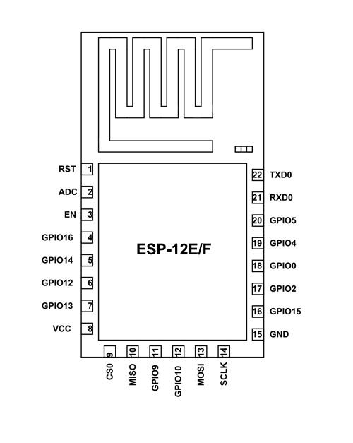
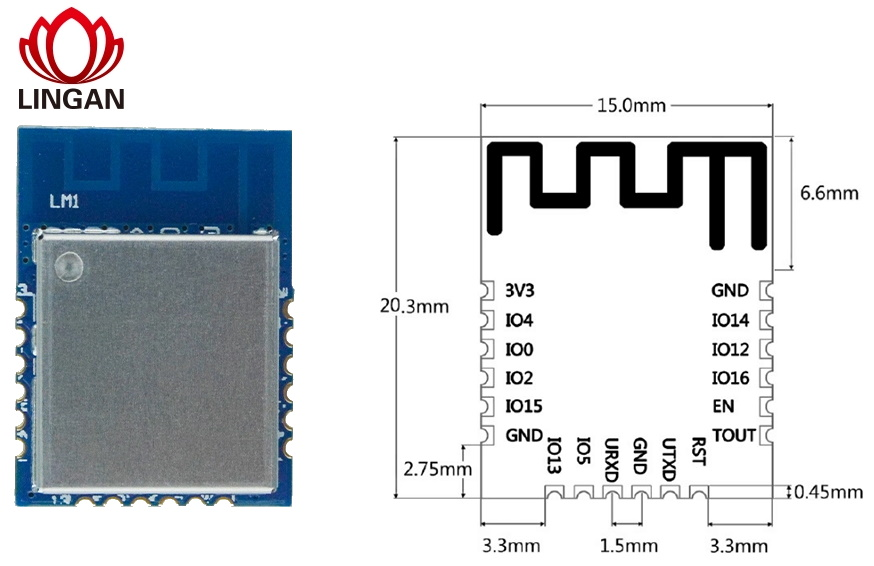
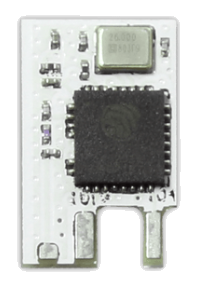

# Wi-Fi Module Pinouts

## ESP82xx Based
### ESP8266 and ESP8285 

### ESP-12E/ESP-12F

### ESP-12S 

### ESP-WROOM-02

### LM1 

### TYWE1S 

### TYWE2S 

### TYWE2L 

### TYWE3S 

### TYWE3L 

### TYLC4 

### TYLC5 

### TYWE5P 

### PSF-B85/PSF-B01/PSF-B04

### ESP8266-S3

## ESP32 

### ESP32-CAM

### ESP32-S

### ESP32-SOLO-1

### ESP32-WROVER

Includes ESP32-WROVER-B and ESP32-WROVER-BI

### ESP32-WROOM-32x

## ESP32-S

### ESP-12K

## ESP32-C3

### ESP-C3-12F

### ESP-C3-32S

### ESP-C3-13

### ESP-C3-01M

## Devices
### Sonoff Mini

### Sonoff TH
</img>

### Sonoff Basic
</img>

### Digoo DG-SP202 / OxaOxe NX-SP202
</img>
(Found out by tracing the PCB copper tracks of the unknown ESP module. Not verified, except GPIO0, RX, TX, Vcc and GND which have successfully been used for flashing.)
