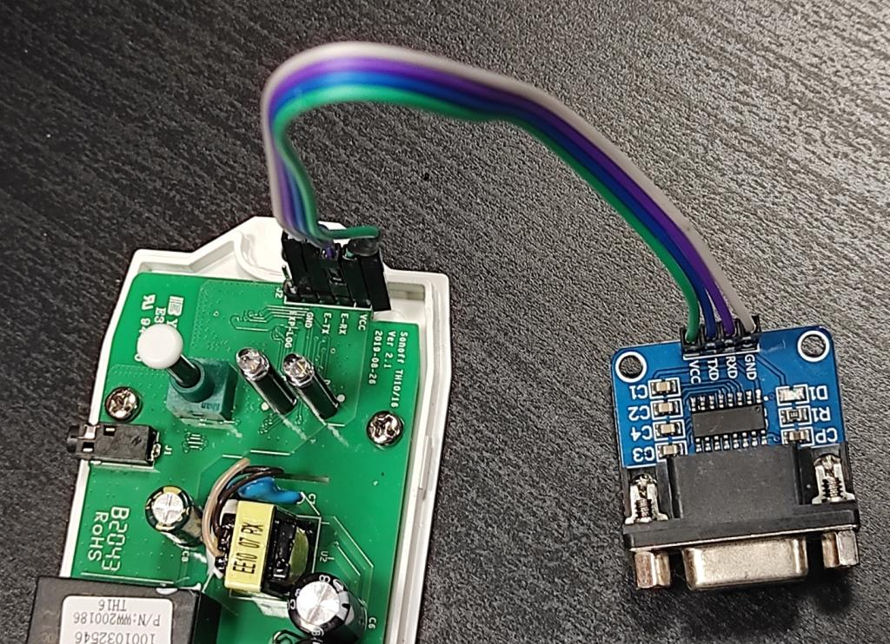
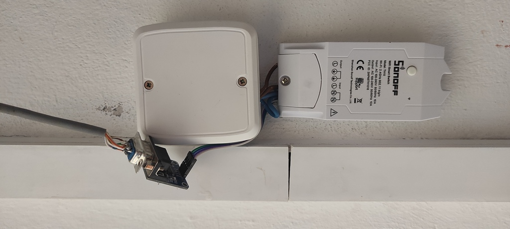
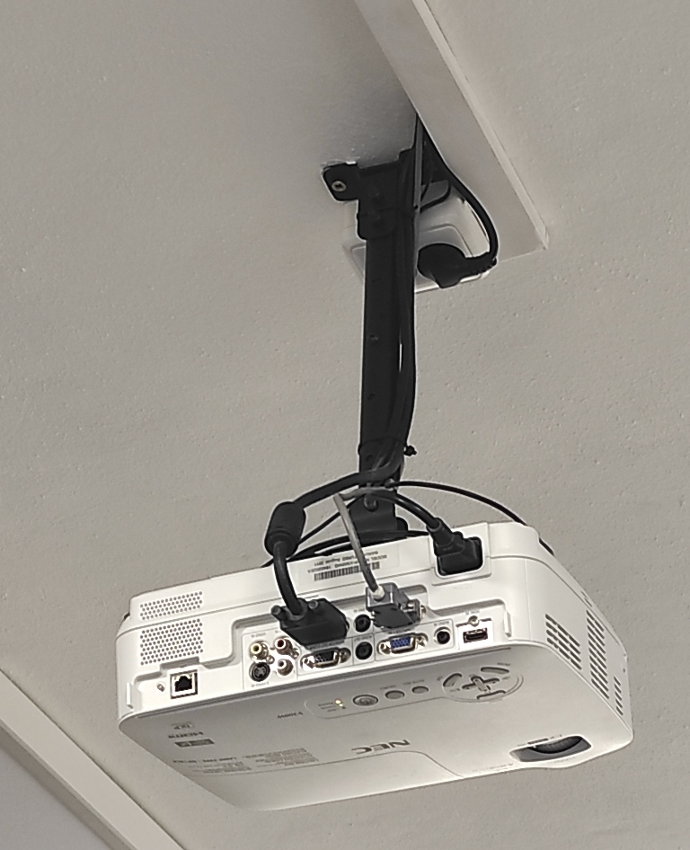

# LCD/DLP Projector Serial Control

!!! failure "This feature is not included in precompiled binaries"

To use it you must [compile your build](Compile-your-build). Add the following to `user_config_override.h`:

```C
#define USE_PROJECTOR_CTRL
```

_Mandatory:_ choose the communication protocol for your Projector (either NEC, OPTOMA or ACER - just one of them) by adding the following to `user_config_override.h`:

```C
#define USE_PROJECTOR_CTRL_NEC
```

```C
#define USE_PROJECTOR_CTRL_OPTOMA
```

```C
#define USE_PROJECTOR_CTRL_ACER
```

_Optional:_ set the Relay that powers your device (default is 1) by adding the following to `user_config_override.h`:

```C
#define PROJECTOR_CTRL_PWR_BY_RELAY 1  //the relay that powers the Projector
```

_Optional:_ set the baudrate to communicate to your device (default is 9600) by adding the following to `user_config_override.h`:

```C
#define PROJECTOR_CTRL_SERIAL_BAUDRATE 9600
```

_Optional:_ enable debugging messages by adding the following to `user_config_override.h`:

```C
#define DEBUG_PROJECTOR_CTRL
```

_Optional:_ Add [Serial to TCP Bridge](Serial-to-TCP-Bridge) to your build if you want to play with your Projector's communication protocol over network connection. Useful for ASCII protocol testing. Needs a different GPIO configuration and is completely independent to this module. Add the following to `user_config_override.h`:

```C
#define USE_TCP_BRIDGE
```

----

## Description
This driver simulates an additional relay in your Tasmota device. If you have N physical relays and you configure GPIO pin functions `DLP Tx` and `DLP Rx` you'll see relay (N+1) after reboot. The two GPIO pins will be used for serial communication with your LCD or DLP Projector. The communication protocol is unique for each manufacturer (compile-time option). The driver polls the Projector's state periodically and updates the fake relay state. When you toggle the fake relay, serial commands are sent to the Projector to power it up or down. While the Projector is running, the driver prevents to switch off the real relay that feeds the Projector. This protects the lamp of the projector (needs to be cooled down before power is cut from the device).

## Supported Projectors
* NEC projectors - tested with NEC V300W
* OPTOMA projectors - not tested yet / report your results!
* Acer projectors - tested with Acer P1500 & H5360BD

Fixes and definitions for further manufacturers should go to `tasmota\xdrv_53_projector_ctrl.h`

## Physical connection
Connect your Tasmota GPIO pins (3.3V TTL level) to a MAX3232 interface (cheap items on internet sales). Such interface changes TTL signals to proper RS232 levels. There are 4 wires on TTL side (Vcc,GND,Rx,Tx) and 3 wires on RS232 side (GND,Tx,Rx). A wire jumper between pins 7(RTS) and 8(CTS) may be needed in DSUB9 connector going to Projector.





## Tasmota configuration

* set GPIO1 to `DLP Tx`
* set GPIO3 to `DLP Rx`
* save and reboot

Replace GPIO1/GPIO3 with your scenario. Use command `Weblog 3` to see extended logging of serial communication in Console.

## Projector configuration
Check your Projector settings concerning Serial port. It must match Tasmota settings eg. 9600 8N1. Some models have "ID number" feature to allow several Projectors in one room. The control commands in Tasmota contain ID 0. Please switch off the "ID" control completely or set the ID to 0.

Since Acer H5360BD does not offer simple RS2332 port setup is as follows:


