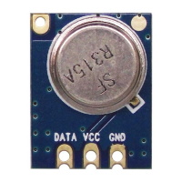
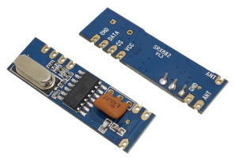

RC Switch driver enables sending RF codes through an RF transmitter and receiving them through an RF receiver via [rc-switch library](https://github.com/sui77/rc-switch/).

## RF Transmitter


Not all transmitter modules will work with the rc-switch library.
Some of officially supported modules by rc-switch are:

- SC5262 / SC5272
- HX2262 / HX2272
- PT2262 / PT2272
- EV1527 / RT1527 / FP1527 / HS1527
- Intertechno outlets
- HT6P20X

This guide was created using STX882 RF transmitter which also works without issues.

### Wiring
| RF   | ESP |
|---|---|
|data   |GPIOx   |
|+   | 3.3v/5v  |
|-  |GND    |

### Tasmota
In the **_Configuration -> Configure Module_** page assign:

- GPIOx to `RFSend (105)`   

See [RF commands](Commands.md#rf-transceiver) for use. 

## RF Receiver


RF receiver is used to capture RF codes. Those codes can be sent using [`RFSend`](Commands.md#rfsend) or used as a [rule](Rules) trigger.   

!!! warning "Not all transmitter modules will have sufficient power or range for normal use" 

This guide is using SRX882 RF receiver module with a helical antenna. 

### Wiring
| SRX882   | ESP |
|---|---|
|Data   |GPIOx   |
|VCC   | 5v  |
|GND  |GND    |
|CS  |3v3 or 5v   |

CS pin needs to be pulled high to put the module in active mode

### Tasmota
In the **_Configuration -> Configure Module_** page assign:

- GPIOx to `RFrecv (106)`   

On a captured code RF receiver sends a `tele/%topic%/RESULT` JSON reponse visible in console:

```json
{
  "Time": "2019-01-01T00:00:00",
  "RfReceived": {
    "Data": "0x7028D5",
    "Bits": 24,
    "Protocol": 1,
    "Pulse": 238
  }
}
```
