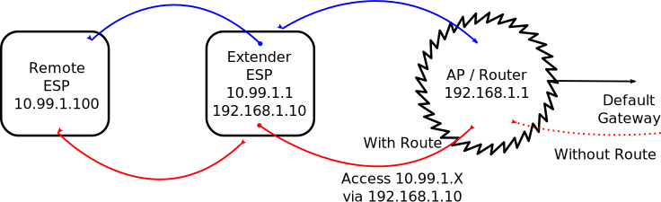

# Range Extender

!!! failure "This feature is not included in precompiled binaries"

Enabling this feature allows Tasmota to publish an AP with a dedicated SSID that is then routed to the core WiFi network.

To use it you must [compile your build](Compile-your-build). Introduced in version 9.5.0.5.

Create a section in `platformio_tasmota_cenv.ini` such as the following for an ESP8266:

```ini
[env:tasmota-rangeextender]
monitor_port = /dev/cu.SLAB*
upload_port  = /dev/cu.SLAB*
upload_speed = 921600
build_unflags               = ${esp_defaults.build_unflags}
build_flags                 = ${esp82xx_defaults.build_flags}
                              -D FIRMWARE_RANGE_EXTENDER
                              -D USE_WIFI_RANGE_EXTENDER				; adds about 11k to flash size
                              -D USE_WIFI_RANGE_EXTENDER_NAPT			; Optional, adds about 1k to flash size
                              -D PIO_FRAMEWORK_ARDUINO_LWIP2_HIGHER_BANDWIDTH	; required option to use this feature
```

For the ESP32 (note this extends the `tasmota32idf4` section included in the `platformio_tasmota_cenv_sample.ini`):

```ini
[env:tasmota32-rangeextender]
extends                 = env:tasmota32idf4
build_flags             = ${env:tasmota32idf4.build_flags}
                          -D FIRMWARE_TASMOTA32
                          -D USE_WIFI_RANGE_EXTENDER
                          -D USE_WIFI_RANGE_EXTENDER_NAPT
```

Alternatively, add the following to `user_config_override.h` (however the `PIO_FRAMEWORK_ARDUINO_LWIP2_HIGHER_BANDWIDTH` or `tasmota32idf4` must still be set as per above):

```arduino
#ifndef USE_WIFI_RANGE_EXTENDER
#define USE_WIFI_RANGE_EXTENDER
#endif
// Optionally, to enable NAT/NAPT
#ifndef USE_WIFI_RANGE_EXTENDER_NAPT
#undef USE_WIFI_RANGE_EXTENDER_NAPT
#endif
```

## Overview

If you have a Tasmota device at the edge of your WiFi coverage and require a bit more distance, this feature allows you to turn it into a routing WiFi node.

Note that this should be considered low bandwidth as the ESP has to process every packet.

Additionally, if desired, it can also NAT/NAPT traffic, removing the need for a route on your core router. See below for the pros and cons of each option.

### Routing (not NAPT)



If using routing, you must setup a return route on your "core" router for each _extender_ node. Each _extender_ must also have a unique client side IP address range, and a static core side IP address so the core router knows where to send routes.

**Pros**

- Can access web interface remote devices
- Lower overhead on the _extender_ device
- Slightly smaller flash foot print if you choose to disable NAPT

**Cons**

- More complex to setup, requiring return routes and static IP addressing

An example setup using commands to match the above image to route traffic, with an AP name `rangeextender` and password `securepassword` would be:

```
RgxSSID rangeextender
RgxPassword securepassword
RgxAddress 10.99.1.1
RgxSubnet 255.255.255.0
RgxState ON
```

Alternatively, it could also be set in your `user_config_override.h` with:

```arduino
#define WIFI_RGX_SSID "rangeextender"
#define WIFI_RGX_PASSWORD "securepassword"
#define WIFI_RGX_IP_ADDRESS "10.99.1.1"
#define WIFI_RGX_SUBNETMASK "255.255.255.0"
#define WIFI_RGX_STATE 1
```

NAPT defaults to off - however if you needed to disable it, run `RgxNAPT OFF`.

### With NAPT


If using NAPT, deployment is a lot easier as there is no need for a static IP address, or adding routes to your core router. Also, all _extender_ nodes could have the same "remote" IP address range as these addresses never enter into the "core" network.

**Pros**

- Very simple to setup

**Cons**

- More overhead on the _extender_ device
- No access to the web interface of the _remote_ devices

An example setup using commands to match the above image with NAPT, with an AP name `rangeextender` and password `securepassword` would be:

```
RgxSSID rangeextender
RgxPassword securepassword
RgxAddress 10.99.1.1
RgxSubnet 255.255.255.0
RgxState ON
RgxNAPT ON
```

Alternatively, it could also be set in your `user_config_override.h` with:

```arduino
#define WIFI_RGX_SSID "rangeextender"
#define WIFI_RGX_PASSWORD "securepassword"
#define WIFI_RGX_IP_ADDRESS "10.99.1.1"
#define WIFI_RGX_SUBNETMASK "255.255.255.0"
#define WIFI_RGX_STATE 1
#define WIFI_RGX_NAPT 1
```

## Commands

| Command     | Parameters                                                                                                                                                                 |
| :---------- | :------------------------------------------------------------------------------------------------------------------------------------------------------------------------- |
| RgxSSID     | The SSID of the AP that Tasmota will present for devices to connect to                                                                                                     |
| RgxPassword | The password for the above SSID                                                                                                                                            |
| RgxAddress  | The IP address on the AP side, the connection to the "core" network IP addressing remains the same (eg: DHCP)                                                              |
| RgxSubnet   | The subnet mask for the AP side, it's recommended to use `255.255.255.0`. The AP will automatically use addresses from this subnet to serve via DHCP to connecting devices |
| RgxState    | Enable or disable the AP. Note that turning the AP off will cause a reboot                                                                                                 |
| RgxNAPT     | Only available if `USE_WIFI_RANGE_EXTENDER_NAPT` is enabled. Enable or disable NAPT. Note that turning off NAPT will cause the device to reboot                            |
