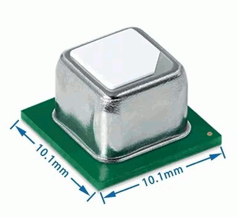
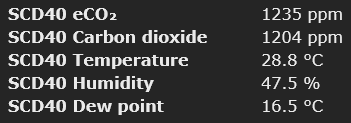
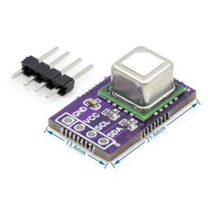
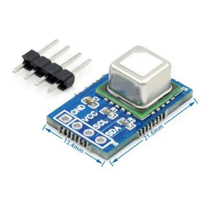
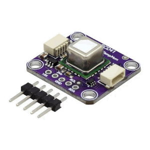

# SCD40/SCD41 CO~2~ sensor

??? tip "This feature is included only in `tasmota32` binaries" 

    When [compiling your build](Compile-your-build) add the following to `user_config_override.h`:
    ```c++
    #ifndef USE_SCD40 
    #define USE_SCD40       // [I2cDriver62] Enable Sensiron SCd40/Scd41 CO2 sensor (I2C address 0x62) (+3k5 code)
    #endif
    ```

## Device information



The SCD40/SCD41 is Sensirion’s miniature CO2 sensor. This sensor builds on the photoacoustic NDIR sensing principle and Sensirion’s patented PASens® and CMOSens® technology to offer high accuracy at an unmatched price and smallest form factor. SMD assembly allows cost- and space-effective integration of the sensor combined with maximal freedom of design. On-chip signal compensation is realized with the built-in SHT4x humidity and temperature sensor.

### Features
- Photoacoustic NDIR sensor technology PASens®
- Smallest form factor: 10.1 x 10.1 x 6.5 mm3
- Reflow solderable for cost-effective assembly
- Digital I&#x00B2;C interface
- Integrated temperature and humidity sensor

### Product Variants
- SCD40: Base accuracy, specified measurement range 400 –2’000 ppm
- SCD41: High accuracy, specified measurement range 400 – 5’000 ppm, compatible with relevant IAQ standards, several power modes

### Datasheets

The Sensirion SCD40/SCD41 [datasheet](https://sensirion.com/resource/datasheet/scd40/scd41). 

## Configuration

### Wiring
| SCD4x   | ESP |
|---|---|
|VCC | 3.3V
|GND | GND   
|SDA | GPIOx
|SCL | GPIOy


### Tasmota Settings 
In the **_Configuration -> Configure Module_** page assign:

1. GPIOx to `I2C SDA`
2. GPIOy to `I2C SCL`

After a reboot the driver will detect SCD4x automatically and display sensor readings.




and in MQTT topic (according to TelePeriod):    
```js
{"Time":"2024-01-01T10:31:09","SCD40":{"CarbonDioxide":1204,"eCO2":1235,"Temperature":28.8,"Humidity":47.5,"DewPoint":16.5},"TempUnit":"C"}
```

## Commands

- Return errorvalue: -1 in case of error, 0 otherwise
- Return data: -1 in case of error, "value" otherwise
- Exec(ms): time in ms needed for execution
- DPM: may be executed during periodic measurements
- Use SCD40Stop before changing settings. Use SCD40Pers and SCD40strt after changing settings.

| Command | Returns | Exec(ms) | DPM | Function |
|---|---|---|---|---|
| SCD40Alt      | data           | 1 | no | Get Sensor Altitude (in m)
| SCD40Alt x    | errorvalue     | 1 | no | Set Sensor Altitude in range 0-3000 (in m)
| SCD40Auto     | data           | 1 | no | Get CalibrationEnabled status (bool)
| SCD40Auto x   | errorvalue     | 1 | no | Set CalibrationEnabled status (bool)
| SCD40Toff     | data           | 1 | no | Set Temperature offset (centigrades) (higher value is lower reading, no negative value)
| SCD40Toff x   | errorvalue     | 1 | no | Set Temperature offset (centigrades) (some rounding may occur)
| SCD40Pres x   | errorvalue     | 1 | yes | Set Ambient Pressure in range 700-1200(mbar) (overrides Sensor Altitude setting)
| SCD40Cal x    | errorvalue   | 400 | no | Perform forced recalibration (ppm CO2)
| SCD40Test     | errorvalue | 10000 | no | Perform selftest
| SCD40StLp     | errorvalue     | 0 | no | Start periodic measurement in low-power mode (1/30s)
| SCD40Strt     | errorvalue     | 0 | no | Start periodic measurement (1/5s)
| SCD40Stop     | errorvalue   | 500 | yes | Stop periodic measurement
| SCD40Pers     | errorvalue   | 800 | no | Persist settings in EEPROM (2000 write cycles guaranteed)
| SCD40Rein     | errorvalue    | 20 | no | Reinit sensor
| SCD40Fact     | errorvalue  | 1200 | no | Factory reset sensor
| SCD40Sing     | errorvalue  | 5000 | no | (SCD41 only) Measure single shot
| SCD40SRHT     | errorvalue    | 50 | no | (SCD41 only) Measure single shot, RHT only

### First installation 
The SCD4x features on-chip signal compensation to counteract pressure and temperature effects. Feeding the SCD4x with the pressure or altitude enables highest accuracy of the CO2 output signal across a large pressure range. Setting the temperature offset improves the accuracy of the relative humidity and temperature output signal. Note that the temperature offset does not impact the accuracy of the CO2 output.

Upon first installation it is convenient to set the current altitude and temperature offset.
To do this you must first send the command to stop the periodic measurements, then the set commands can be sent and then the settings must be saved with the persist command, then restart.

```js
12:03:19.012 CMD: SCD40Stop
12:03:19.019 MQT: stat/air/RESULT = {"SCD40Stop":0}
12:03:50.584 CMD: SCD40Toff 400
12:03:50.593 MQT: stat/air/RESULT = {"SCD40Toff":0}
12:04:16.511 CMD: SCD40Alt 60
12:04:16.520 MQT: stat/air/RESULT = {"SCD40Alt":0}
12:04:23.745 CMD: SCD40pers
12:04:23.752 MQT: stat/air/RESULT = {"SCD40Pers":0}
```

## Breakout Boards




