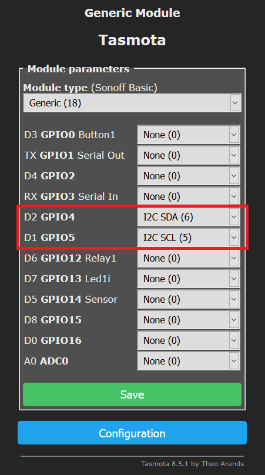
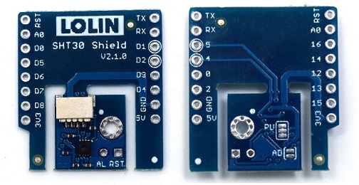

# SHT30 temperature sensor
!!! info "This feature is included only in tasmota-sensors.bin" 

**Wemos SHT30 Shield High Precision Humidity & Temperature (I2C) sensor**

From the [Wemos SHT30 shield specs](https://www.wemos.cc/en/latest/d1_mini_shield/sht30.html) the SDA pin on the SHT30 shield is connected to D2 and the SCL pin to D1. 

## Configuration

As a default the SHT30 uses I2C address 0x45 and is user changeable by short-circuiting the two soldering pads at the **lower** left-side of the sensor (see image below marked green).

Also if no other I2C devices are connected to the Wemos it might be wise to short-circuit the three soldering pads at the **upper** left-side of the sensor (see image below marked red). This connects the pull-up resistors for I2C and biases the SCL and SDA pins to VCC. This is to avoid possible false detections of other sensors like VEML6070.

_Note: On the v2.1.0 board these pads are on the rear._

### Tasmota Settings
In the **_Configuration -> Configure Module_** page assign:

* D2 GPIO4 to `I2C SDA`
* D1 GPIO5 to `I2C SCL`

After reboot of the device the temperature, humidity and dew point are displayed.

## Breakout Boards

Three versions are known to exist, they all share the same pinout. Lolin is the new name for Wemos going forward.

* v.1.0.0 - orignal design (retired)
* v.2.0.0 - detachable design
* v.2.1.0 - detachable design with TFT I2C connector

</img>
</img>
