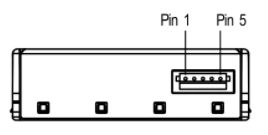

# SPS30 Particulate sensor

## Device information

The Sensirion SPS30 is a laser based, fan driven, MCERTS-certified particulate matter (PM) sensor with a I&#x00B2;C and UART interface ([datasheet](https://www.sensirion.com/fileadmin/user_upload/customers/sensirion/Dokumente/9.6_Particulate_Matter/Datasheets/Sensirion_PM_Sensors_Datasheet_SPS30.pdf)). The Tasmota driver implements the I&#x00B2;C interface.

### Mass Concentration Measurements

The device exposes the following data:

* Volumetric concentration (μg/m&#x00B3;):
  * PM1.0, PM2.5, PM4 and PM10
* Number concentration (binning, #/cm&#x00B3;):
  * PM0.5, PM1.0, PM2.5, PM4 and PM10
* Typical particle size (μm)

### Sampling

The module has a minimum sampling interval of 1 second in continuous mode (default).

### Automatic Cleaning

It implements an automatic fan cleaning routine, which sets the built-in fan speed to maximum for 10 seconds to clear out the detector chamber and accumulated dust on the fan blades. The default cleaning interval is 1 week of interrupted use, and resetting the sensor power also resets the built-in time counter for this. The current implementation does not support disabling this or setting a custom interval.

## Pre-requisites

**The driver is not available in the pre-built images**, and needs a custom compiled image. The following custom parameters will enable the driver and compile it into the firmware:

```cpp
#define USE_I2C                                  // I2C using library wire (+10k code, 0k2 mem, 124 iram)
#define I2CDRIVERS_30        0xFFFFFFFF          // Enable I2CDriver30

#ifdef USE_I2C
  #define USE_SPS30 // [I2cDriver30] Enable Sensiron SPS30 particle sensor (I2C address 0x69) (+1.7 code)
#endif  // USE_I2C
```

## Configuration

The sensor has a 5 pin JST ZHR type connector, with a 1.5mm pitch ([connector](https://octopart.com/zhr-5-jst-279203), [datasheet](http://www.farnell.com/datasheets/1393424.pdf)). Pin5 (SEL/Interface Select) must be shorted to Pin4/Ground to enable the I&#x00B2;C interface.

The sensor and fan components require 5V VDD, so a 5V capable board (e.g. Wemos D1) or external power must be supplied.

Finding appropriate connectors/cables for this module are somewhat cumbersome, [SparkFun sells them](https://www.sparkfun.com/products/15103) with handy breadboard friendly breakout cables.



| Pin | SPS30 | ESP8266 | Wemos D1 Mini | Comment                   |
|-----|-------|---------|---------------|---------------------------|
| 1   | VDD   | +       | 5V            | 5V ± 10%                  |
| 2   | SDA   | GPIO4   | D2            | 5V and 3.3V compatible    |
| 3   | SCL   | GPIO5   | D1            | 5V and 3.3V compatible    |
| 4   | SEL   | -       | G             | Pull to GRD to enable I²C |
| 5   | GND   | -       | G             |                           |

### Tasmota Settings

In the **_Configuration -> Configure Module_** page change the Module Type to `Generic (18)` ([device doc](devices/Wemos-D1-Mini.md)), the board will reboot, now you should see all GPIOs in **_Configuration -> Configure Module_**.

* Set `D2 GPIO5` to `I2C SDA`
* Set `D1 GPIO4` to `I2C SCL`

After saving the board will reboot and the particulate measurements will be displayed on the main page.
