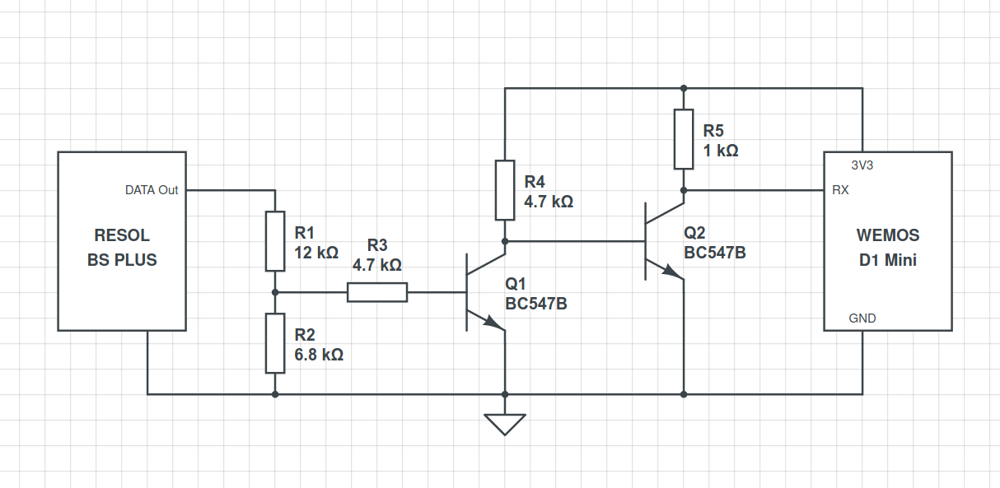
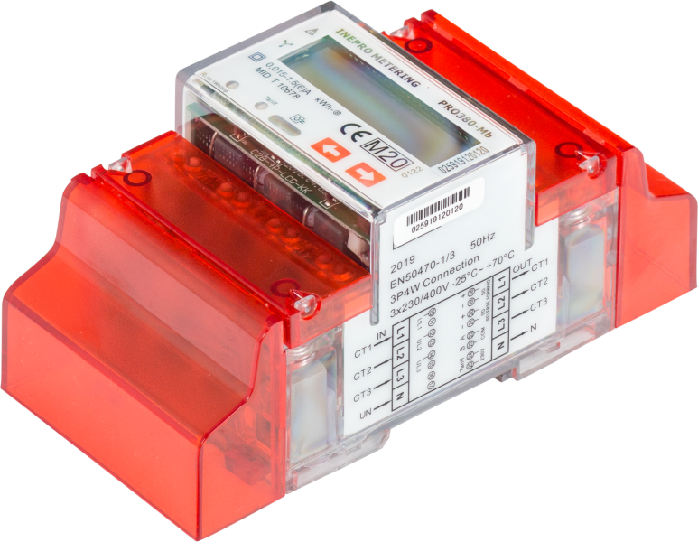
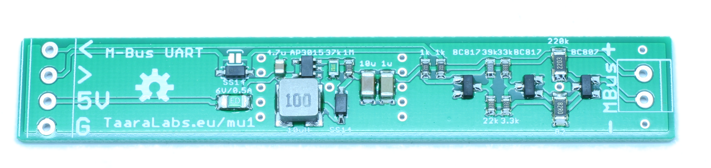

<a id="top">
# Smart Meter Interface 

!!! info "This driver extracts selected values from Smart Meters over various protocols, filters and publishes them to MQTT as regular sensors."

!!! failure "This feature is not included in precompiled binaries"

Based on Tasmota's [scripting language](Scripting-Language). To use it you must [compile your build](Compile-your-build). Add the following to `user_config_override.h`:

```c++
#ifndef USE_SCRIPT
#define USE_SCRIPT
#endif
#ifndef USE_SML_M
#define USE_SML_M
#endif
#ifdef USE_RULES
#undef USE_RULES
#endif
```

Additional features can be enabled by adding the following `#define` compiler directive parameters and then compiling the firmware. These parameters are explained further below in the article. Most features are now enabled by default, others may be set in the descriptor per meter.  
	
| Feature | Description |
| -- | -- |
|SML_BSIZ n| (default 48) Maximum number of characters per line in serial input buffer. Complete chunk of serial data must fit into this size, so include any CR/LF if that applies. can now be defined per meter in descriptor, see special options|
|MAX_METERS n| (default 5) Maximum number of meters. Decrease this to 1 for example if you have a meter with many lines and lots of characters per descriptor line.|
|TMSBSIZ n| (default 256) Maximum number of characters in serial IRQ buffer (should always be larger than SML_BSIZ and even larger on high baud rates).can now be defined per meter in descriptor, see special options|
|SML_DUMP_SIZE n | (default 128) Maximum number of characters per line in dump mode. Only use if you have long strings comin in and they truncate. |
|USE_ESP32_SW_SERIAL| enables additional software serial channels for ESP32, (receive only), define pin with '-' sign to assign to software serial |
|NO_USE_SML_SPECOPT| disables special decoder entry to specify direction bit for some SML meters |
|NO_USE_SML_SCRIPT_CMD | disables some special SML script cmds and allows access to sml vars in other parts of the script. Is needed by some of the examples below.
|NO_SML_REPLACE_VARS | disables replacement of any text in descriptor by script text variables. Useful if several occurrences of a text occupies a lot of space and you get short of script buffer. Readability may get worse so only makes sense on large descriptors. Note: to use `%` symbol un measurement units, you need to escape it like `%%`.|
|NO_USE_SML_DECRYPT | disables decoding of encrypted ams meters. decrypting needs TLS, so must define USE_TLS also.|
|USE_SML_AUTHKEY | enables authentication, this is not needed by most energy meters.|
	
### General description

To use this interface, connect the meter to available GPIO pins. These GPIOs must be set as `None` in Tasmota. If the interface detects that a script driven meter descriptor GPIO conflicts with a Tasmota GPIO setting, the interface will generate a `duplicate GPIO defined` error in the log and the meter descriptor will be ignored. 
    
!!! note
    When changing GPIO configurations, especially in conjunction with other Tasmota drivers, a restart may be required.

!!! note
    On an ESP32, due to a different implementation, serial ports may not be used in conjunction with other Tasmota serial devices.  

!!! note
    when using bidirectional serial IO (receive and transmit), hardware serial is recommended.
    
The Smart Meter Interface provides a means to connect many kinds of meters to Tasmota. **The following types of meter protocols are supported:**

| Protocol | Description |
| -- | -- |
| OBIS ASCII | telegrams emitted from many smart meters, including [P1 Smart Meters](https://tasmota.github.io/docs/P1-Smart-Meter/) |
| OBIS Binary SML| telegrams emitted from many smart meters |
| MODBus Binary | telegrams used by many power meters and industrial devices |
| Kamstrup Binary | telegrams used by many power meters from Kamstrup |
| EBus Binary | telegrams emitted by many heaters and heat pumps  (e.g. Vaillant, Wolf) |
| VBus Binary | telegrams emitted by many solar thermal systems boilers (e.g. Resol, Viessmann) |
| RAW Binary | decodes all kinds of binary data eg EMS heater bus |
| Counter interface | uses Tasmota counter storage (for e.g. REED contacts either in polling or IRQ mode) |

There are many different meters that use the same protocol. There are multitudes of variants and use cases. This interface provides a means of specifying these definitions through [meter descriptors](#meter-metrics). This method uses the [scripting language](Scripting-Language) editor to define the descriptors. In this way, only one firmware binary version is required and a modification can be made easily _on the fly_.  

!!! note
    Additional hardware may be required to read certain measuring devices. For example: RS485toTTL adapter for Modbus, IR transistor for electricity meters. Sometimes an additional IR diode and resistors.  
  
  
## Descriptor Syntax
This section must be present, even if it's empty. If compiled with `SML_REPLACE_VARS`, here is the place where text variables can be defined for the script:
> `>D`  
------------------------------------------------------------------------------
Declare `>B` (boot) section to inform the interface to read the meter descriptor(s):
> `>B`  
=>[sensor53 r](Commands#sensor53)
------------------------------------------------------------------------------
(Optional) declare `>S` section with additional scripting commands:
> `>S <n>`
------------------------------------------------------------------------------
Declare `>M` section with the number of connected meters (n = `1..5`):
> `>M <n>`  

!!! note
    If no `>M` section is found in the script or if the scripting language is not compiled, the driver reverts to the default hardcoded `#define` definitions. If no meter script is defined, the default hardcoded descriptor interface (deprecated) uses `RX GPIO3` for receiving data and thus may interfere with other Tasmota Definitions without warning. 
    
!!! note
    Software serial only supports 8N1 serial format. Must use hardware serial for e.g. 8E1!  

## Meter Definition

> `+<M>,<rxGPIO>,<type>,<flag>,<parameter>,<jsonPrefix>{,<txGPIO>,<txPeriod>,<cmdTelegram>}`  

| Parameter | Description |
| :--- | :--- |
| `+<M>` | Meter number. The number must be increased with each additional Meter (default 1 to 5).|
| `<rxGPIO>` | The GPIO pin number where meter data is received. <BR> [xxx.xxx.xxx.xxx] IP number instead of pin number enables MODBUS TCP mode (tx pin can be any number and is ignored)|
| `<type>` | The type of meter: <BR>- `o` - OBIS ASCII type of coding<BR>- `s` - SML binary smart message coding<BR>- `e` - EBus binary coding<BR>- `v` - VBus binary coding<BR>- `m` - MODBus binary coding with serial mode 8N1<BR>- `M` - MODBus binary coding with serial mode 8E1<BR>- `k` - Kamstrup binary coding with serial mode 8N1<BR>- `c` - Counter type<BR>- `r` - Raw binary coding (any binary telegram) |
| `<flag>` | Options flag:<BR>- `0` - counter without pullup<BR>- `1` - counter with pullup<BR>- `16` - enable median filter for that meter. Can help with sporadic dropouts, reading errors (not available for counters). this option is enabled by default #define USE_SML_MEDIAN_FILTER, if you are low on memory and dont use this feature you may outcomment this define in the driver |
| `<parameter>` | Parameters according to meter type:<BR>- for `o,s,e,v,m,M,k,r` types: serial baud rate e.g. `9600`.<BR>- for `c` type: a positive value = counter poll interval (not really recommended) or a negative value = debounce time (milliseconds) for irq driven counters. |
| `<jsonPrefix>` | Prefix for Web UI and MQTT JSON payload. Up to 7 characters.|
| `<txGPIO>` | The GPIO pin number where meter command is transmitted (optional).|
| `<tx enable>` | The GPIO pin number to enable transmitter (RS485) may follow the TX pin in bracket (pin) without a colon an 'i' in front of the pin number means 'inverted' (optional).|
| `<txPeriod>` | Period to repeat the transmission of commands to the meter (optional). Number of 100ms increments (n * 100ms).|
| `<cmdTelegram>` | Comma separated hex coded byte blocks to send to meter device. For MODBus each comma separated block is a command to retrieve a certain register from the meter (optional: only required for measuring devices that have to be triggered with a certain character string).|
    
!!! note
    for other serial protocols you may specify the exact mode (only for hardware serial) by the following code after the type specifier:  
N =no parity  
E =even parity  
O =odd parity  
and number of stop-bits  

e.g for Modbus:  mN1,mN2,mE1,mE2,mO1,mO2  

!!! example
    ```
    +1,3,o,0,9600,OBIS1,1,2,2F3F210D0A
    +1,3,o,0,9600,OBIS1,1(i4),2,2F3F210D0A  with pin 4 as inverted TX enable
    +1,3,o,16,115200,NormalTariff,1
    +1,3,s,16,9600,SML1
    +1,12,c,1,-10,H20_Cnt
    +1,3,v,0,9600,Solar
    ```

!!! example
    For MODBus:
    `+1,3,m,0,9600,MODBUS,1,1,01040000,01040002,01040004,01040006,01040008,0104000a,0104000c,0104000e,01040010`    
    Components of the character string:  
    `...01040000,01040002,...`    
    `01` = Modbus slave device ID<BR>
    `04` = Instruction to read an Input Register (alternatively, `03` = Instruction to read a Holding Register)<BR>
    `0000`/`0002` = Register # (as Hexadecimal codification, without the prefix `0x`. Example: `0x0079` -> `0079`)  
    the number of requested registers is fixed to 2, however with the char 'r' before the hex string the complete request string may be specified  
    `...r010400000001,r010400020003,...`    
    **Note:**
    `ID`, `Instruction` to read the register value (Input vs Holding) and `Register#` may differ depending on the measuring device.  
   

## Meter Metrics

Each meter typically provides multiple metrics (energy, voltage, power, current etc.) which it measures. An entry for each metric to be collected must be specified. An entry defines how to decode the data and put it into variables.

> `<M>,<decoder>@<scale><offs>,<label>,<UoM>,<var>,<precision>`  

| Parameter | Description |
| :--- | :--- |
| `<M>` | The meter number to which this decoder belongs |
| `<decoder>` | **Decoding specification**: OBIS as ASCII; SML, EBus, VBus, MODBus, RAW as HEX ASCII etc. _No space characters allowed in this section!_ <BR> **OBIS**: ASCII OBIS code terminated with `(` character which indicates the start of the meter value<BR>**Counter**: ASCII code 1-0:1.8.0\*255 for counter value, code 1-0:1.7.0\*255 for pulse rate (e.g. for actual power value)<BR> **SML**: SML binary OBIS as hex terminated with `0xFF` indicating start of SML encoded value<BR>**EBus, MODBus, RAW** - hex values of data blocks to compare:<BR> - `xx` = ignore value  (1 byte) or `xN` = ignore N bytes<BR> - `ss` = extract a signed byte<BR> - `uu` = extract an unsigned byte<BR>  - `UUuu` = extract an unsigned word (high order byte first)<BR> - `uuUU` = extract an unsigned word (low order byte first)<BR> - `UUuuUUuu` = extract an unsigned long word (high order byte first)<BR> - `uuUUuuUU` = extract an unsigned long word (low order byte first)<BR> - `SSss` = extract a signed word (high order byte first)<BR> - `ssSS` = extract a signed word (low order byte first)<BR> - `SSssSSss` = extract a signed long word (high order byte first)<BR> - `ssSSssSS` = extract a signed long word (low order byte first)<BR> - **on long word values**, if a trailing s is added at the end of the mask, word order is reversed<BR> - `bcdN` = extract a binary coded decimal N=2..12<BR> - `ffffffff` = extract a float value - IEEE754 decode<BR> - `FFffFFff` = extract a reverse float value - IEEE754 decode<BR>- `kstr` = decode KAMSTRUP data<BR>- `pm(x.y.z)` = pattern match(asci obis code)<BR>- `pm(hHHHHHH)` = pattern match(hex obis code)<BR>- `pm(rHHHHHH)` = pattern match(any hex pattern)<BR><BR>if using **VBus** - hex values of data blocks to compare:<BR> - `AAffffaddrff0001ffff` = VBus-specific hex header: `AA`-sync byte, `addr`-the reversed address of the device. To find his out first look up the known [hex address of the device](http://danielwippermann.github.io/resol-vbus/vbus-packets.html). E.g. Resol DeltaSol BS Plus is `0x4221`. Reverse it (without `0x`) and you will get `21 42` hex characters. Now turn on raw dump mode using command `sensor53 d1` and look for rows starting with `aa`, containing your reversed address at position 4 and 5 and `00 01` hex characters at position 7 and 8. If found, the entire header will be 10 hex characters long including `aa` (20 ascii chars without space, e.g. for Resol DeltaSol BS Plus this will be `AA100021421000010774`). At position 9 you see the number of frames containing readable data. To turn off raw dump use `sensor53 d0`.<BR> - `v` = VBus protocol indicator<BR> - `oN` = extract data from offset `N` (see offsets of your device in [VBus protocol documentation](http://danielwippermann.github.io/resol-vbus/vbus-packets.html))<BR> - `u` or `s` = extract unsigned or signed data<BR> - `w` or `b` = extract word or byte<BR>**End of decoding**: `@` indicates termination of the decoding procedure.<BR>- `(` following the `@` character in case of obis decoder indicates to fetch the 2. value in brackets, not the 1. value.  (e.g. to get the second value from an obis like `0-1:24.2.3(210117125004W)(01524.450*m3)`)<BR>- decoding multiple values coming in brackets after each other is possible with `(@(0:1`, `(@(1:1`, `(@(2:1` and so on  (e.g. to get values from an obis like `0-0:98.1.0(210201000000W)(000000.000*kWh)(000000.000*kWh)`)<BR>- decoding a 0/1 bit is indicated by a `@` character followed by `bx:` (x = `0..7`) extracting the corresponding bit from a byte. (e.g.: `1,xxxx5017xxuu@b0:1,Solarpump,,Solarpump,0`)<BR>- in case of MODBus/Kamstrup, `ix:` designates the index (x = `0..n`) referring to the requested block in the transmit section of the meter definition
| `<scale>` | scaling factor (divisor) or string definition<BR>This can be a fraction (e.g., `0.1` = result * 10), or a negative value. When decoding a string result (e.g. meter serial number), use `#` character for this parameter _(Note: only one string can be decoded per meter!)_. For OBIS, you need a `)` termination character after the `#` character. |
| `<offs>` | optional offset must precede with + or - sign, note: offset is applied before scale!|
| `<label>` | web UI label (max. 23 characters) |
| `<UoM>` | unit of measurement (max. 7 characters) |
| `<var>` | MQTT label (max. 23 characters) | 
| `<precision>` | number of decimal places. Add `16` to transmit the data immediately. Otherwise it is transmitted on [`TelePeriod`](Commands#teleperiod) only. |

> Use `;` character to comment lines in the script.

> Put `#` character at the end to terminate `M` section of the script.

!!! example  
    (OBIS/SML/MODBus):  
    ```
    1,1-0:1.8.1*255(@1,Total consumption,KWh,Total_in,4`  
    1,77070100010801ff@1000,W1,kWh,w1,4`  
    1,010304UUuuxxxxxxxx@i0:1,Spannung L1,V,Voltage_L1,0`  
    1,0:98.1.0(@(0:1,Havi adat, KWh,havi1,3`
    1,0:98.1.0(@(1:1,Havi adat, KWh,havi2,3`
    1,0:98.1.0(@(2:1,Havi adat, KWh,havi3,3`
    ```

    OBIS: `1,1-0:0.0.0*255(@#),Meter Nr,, Meter_number,0`

    Counter: `1,1-0:1.8.0*255(@1000,consumption,KWh,Total_in,3)` precision of 3, scale for 1000 pulses/kWh<BR>
    `1,1-0:1.7.0*255(@0.01667, power,W,Power_actual,0)` actual power from pulse rate (in pulses/min) of counter meter, scale for 1 pulse/Wh (1 pulse/min => 60W; 1/60(=0.01667) (pulses/min)/W)

    SML: `1,77078181c78203ff@#,Service ID,,Meter_id,0`<BR>
    `1,1-0:1.8.0*255(@1,consumption,KWh,Total_in,4` precision of 4, transmitted only on [`TelePeriod`](Commands#teleperiod)<BR>
    `1,1-0:1.8.0*255(@1,consumption,KWh,Total_in,20` precision of 4, transmitted immediately (4 + 16 = 20)
    
    MODBus: `+1,3,M,1,9600,SBC,1,2,01030023,01030028...`<BR>
    `1,010304UUuuxxxxxxxx@i0:1,Voltage L1,V,Voltage_L1,0` the `i0:1` refers to: `01030023` with a scaling factor (`:1`) for 1<BR>
    `1,010304UUuuxxxxxxxx@i1:10,Current L1,V,Current_L1,2` the `i1:10` refers to: `01030028` with a scaling factor (`:10`) for 10


!!! tip
    Use: `sensor53 dM` to output the received data in the console. `M` = the number of the meter in the definition line.  
    During the output of the data in the console, the data in the WEB UI are not updated. To return write: `sensor53 d0`  

!!! tip
	You can monitor the serial activity at a GPIO with a connected LED. This function is useful for debugging purposes and also to see data is coming in during normal operation.<BR>
    Usage: Enter the command `sensor53 lx` to activate this function (Lowercase `L` for `LED`). `x` is the number of the GPIO where the LED is connected. For example you can use `sensor53 l2` for the onboard LED on a Wemos D1-mini or `sensor53 l13` on a Sonoff Basic. `sensor53 l255` turns the function off. This is the default value.<BR>
	With `sensor53 mx` you can choose which serial meter (`x`) will be monitored. Set `sensor53 m0` will monitor all serial meters. This is the default value.<BR>
    To start the monitoring at boot-time, simply add the necessary entries in the boot-section (`>B`) of the script:<BR>
	!!! example
		```
		>B
		=>sensor53 r
		=>sensor53 l13
		```

## Special Commands

With `=` character at the beginning of a line you can do some special decoding. With `*` character fields can be hidden or skipped.

| Command | Description |
| :--- | :--- |
| `M,=m` | Perform arithmetic (`+,-,*,/`) on the measured data. Use `#` before a number to designate a constant value <BR>e.g. `1,=m 3+4+5/#3 @100,Voltage L1+L2+L3/3,V,Volt_avg,2` to sum results of decoder entries 3,4,5 and divide by 3 (average) |
| `M,=d` | Calculate difference between metric values decoded at time intervals (up to 10 =d lines possible) <BR>e.g. `1,=d 3 10` calculate 10 second interval difference of decoder entry 3  |
| `M,=h` | Insert text on the web interface (html text up to 30 chars). These lines do not count as decoder entry.<BR> e.g. `1,=h<hr/>` to insert a separator line on the web UI |
| `*` character | To hide fields from result output or disable output completely. Compiling with `USE_SML_SCRIPT_CMD` required. <BR> - as single character in `<label>` of the metrics line will hide that value from the web UI <BR> - as single character in `<label>` of the meter definition line will suppress the entire JSON output on MQTT |
| `M,=so1 `| special SML option for meters that use a bit in the status register to sign import or export like ED300L, AS2020 or DTZ541 <BR>e.g. 1,=so1,00010800,65,11,65,11,00100700 for DTZ541<BR> 1. obis code that holds the direction bit, 2. Flag identifier, 3. direction bit, 4. second Flag identifier (some meters use 2 different flags), 5. second bit, 6 obis code of value to be inverted on direction bit.<BR>|
| `M,=so2 `| if 1 fixes the bug introduced by meter DWS74, if 2 enabled OBIS line compare mode instead of shift compare mode.<BR>e.g. 1,=so2,2 enable obis line compare.<BR>|
| `M,=so3 `| sets serial buffer size, serial IRQ buffer size and serial dump buffer size.<BR>e.g. 1,=so3,512 set serial buffer size to 512.<BR>|
| `M,=so4 `| sets AES decrytion key for encrypted meters.must define exactly 16 hexadecimal chars<BR>e.g. 1,=so4,deabcd0020a0cfdedeabcd0020a0cfde sets decryption key and enables decrypt mode for that meter.<BR>|
| `M,=so5 `| sets AES authentication key for encrypted meters.must define exactly 16 hexadecimal chars<BR>e.g. not needed by most energy meters (needs USE_SML_AUTHKEY).<BR>|
| `M,=so6 `| sync time in milliseconds for serial block detection with AMS meters (defaults to 1000).<BR>|
| `M,=so7 `| on ESP32 force selection of UART Nr. X (0,1,2) allows coexistence with other serial drivers <BR>|
	
!!! example
    To get the value of one of the descriptor lines, use `sml[X]`. `X` = Line number. Starts with `1`. (compiling with `USE_SML_SCRIPT_CMD` required)
    ```
    >D
    v1=0
    v2=0
    >S
    ;Writes the value of Descriptorline 1 to v1
    v1=sml[1] 
    ;Writes the value of Descriptorline 2 to v2
    v2=sml[2]
    ```

!!! example
    To disable and enable publishing of MQTT data on TelePeriod, use `smlj=0` and `smlj|=1`, respectively. For example to skip first MQTT publishing after boot (may contain erroneous data at after restart if meter is slow, see [Sanxing SX6x1](#sanxing-sx6x1-sxxu1x-ascii-obis)):
    ```
    >B
    ;disable publishing at MQTT teleperiod, on boot
    smlj=0
    >S
    ;re-enable publishing at MQTT teleperiod, after 10 seconds of uptime
    if upsecs>10
    then
    smlj|=1
    endif
    ```
	the variable smlj also switches to obis_line_mode if bit 1 = 1, default is 0 

!!! example
    If you have large meter descriptors and want to extract multiple values from the same descriptor, you can save flash space using `SML_REPLACE_VARS` at compile time (see [Resol Deltasol BS Plus](#resol-deltasol-bs-plus-vbus)):
    ```
    >D
    ;define a text variable
    r="1,AA100021421000010774"
    >M 1
    ;in your meter definitions you can use your variable for the same descriptor
    +1,3,v,0,9600,Solar
    %r%vo12ut@#,time,,zeit,1
    %r%vo0uw@10,S1 COL,°C,sens1,1
    %r%vo2uw@10,S2 TST1,°C,sens2,1
    %r%vo4uw@10,S3 TST2,°C,sens3,1
    %r%vo6uw@10,S4 TR,°C,sens4,1
    ;%r% inserts the text variable and saves script storage space (3 instead of 22 chars for each line)
    ```

!!! attention 
    With a few meters, it is necessary to request the meter to send data using a specific character string. This string has to be sent at a very low baud rate (300Baud). If you reply the meter with an acknowledge and ask the it for a new baud rate of 9600 baud, the baud rate of the SML driver has to be changed, too (see [Landis + Gyr ZMR120AR](#landis-gyr-zmr120ares2r2sfcs-obis)).
    
    To change the baud rate:
    >sml(`METERNUMBER` 0 `BAUDRATE`)  
    
    For sending a specific character string:
    >sml(`METERNUMBER` 1 `STRING`)
    
    And it works like this:  
    ```
    >D
    res=0  
    scnt=0    
    ;For this Example in the >F section  
    >F
    ;count 100ms   
    scnt+=1  
    switch scnt  
    case 6  
    ;set sml driver to 300 baud and send /?! as HEX to trigger the Meter   
    res=sml(1 0 300)  
    res=sml(1 1 "2F3F210D0A")  
    ;1800ms later \> Send ACK and ask for switching to 9600 baud  
    case 18  
    res=sml(1 1 "063035300D0A")  
    ;2000ms later \> Switching sml driver to 9600 baud    
    case 20  
    res=sml(1 0 9600)   
    ;Restart sequence after 50x100ms    
    case 50  
    ; 5000ms later \> restart sequence    
    scnt=0  
    ends        
    >M 1
    +1,3,o,0,9600, ,1  
    ;...etc.  
    ```

    **Note**: This procedure is only necessary, if the meter explicitly asks for 300 baud. The most meters work directly with 9600 baud. Therefore it is easier to give this method a try (see [Iskra MT 174](#iskra-mt-174-obis)):  

    `Meter#,GPIO# Input,TYPE,FLAG,Baudrate,JSONNAME,GPIO# Output,TX Period,Character string`  
    `+1,3,o,0,9600,energy,1,4,2F3F210D0A`


!!! tip
    If you use a Wemos D1 Mini you could compile a 4M flash image with filesystem support so your script will survive upgrades and factory resets. To do this, create a new entry in `platformio_tasmota_env.ini`:
    ```
    [env:tasmota-4mb]
    board_build.ldscript    = eagle.flash.4m2m.ld
    ```
    Add `tasmota-4mb` to `platformio.ini`'s build variants.

    Add the following to `user_config_override.h`:
    ```
    #undef  MODULE
    #define MODULE WEMOS
    #define USE_UFILESYS
    #define GUI_TRASH_FILE
    ```
    Also recommended, if you use lots of vars and increased buffer sizes to free up the image from unused drivers. You should get some inspiration from the `tasmota-lite` image definition in `tasmota_configurations.h`. 


!!! tip
    You can dump to your PC the raw data coming in if you use the module's hardware serial ports (1 and 3) as GPIOs of the script, [using Serial to TCP Bridge](https://tasmota.github.io/docs/Serial-to-TCP-Bridge/). Compile your firmware with `USE_TCP_BRIDGE`, disable the script and configure in module parameters `TCP Tx` and `TCP Rx`. After module reboot, start the server with command `TCPStart 8888`. Connect to this port from your PC to see or dump the data, in Linux it's as easy as `cat < /dev/tcp/IP.OF.YOUR.TASMOTA/8888 > rawdump.txt`. To revert to SML you need to set back both GPIO ports to `None`, enable the script and restart.

##  Commands  
 - sensor53 r = resets the sml driver, must be applied in script >B section  
 - sensor53 cx num = sets counter x (1 or 2) to number (persistent change)  
 - sensor53 dm = sets dump mode for meter m (1...N), must be set to 0 for normal operation  
 - sensor53 l x = set an optional LED GPIO pin to indicate serial activity of a meter, set to 255 for disable  
 - sensor53 m x = sets the meter from which to show activity via the l cmd  

## Smart Meter Descriptors

### ABB B23 (MODBus)

Meter is basically the same as [Janitza B23](#janitza-b23-modbus) with the same interface. It's just missing whole section of registers which are used in Janitza B23 example.

Beware that A and B MODBus connectors are switched!

??? summary "View script"
    ```
    >D
    >B
    ->sensor53 r
    >M 1
    +1,3,m,0,9600,ABB,1,10,01035B00,01035B02,01035B04,01035B14,01035B16,01035B18,01035B1A,r010350080004,r010350000004,r010350040004
    1,010304UUuuUUuu@i0:10,Voltage L1-N,V,Voltage_L1,1
    1,010304UUuuUUuu@i1:10,Voltage L2-N,V,Voltage_L2,1
    1,010304UUuuUUuu@i2:10,Voltage L3-N,V,Voltage_L3,1
    1,010304SSssSSss@i3:100,Active power Total,W,Active_power_Total,2
    1,010304SSssSSss@i4:100,Active power L1-N,W,Active_power_L1,2
    1,010304SSssSSss@i5:100,Active power L2-N,W,Active_power_L2,2
    1,010304SSssSSss@i6:100,Active power L3-N,W,Active_power_L3,2
    1,010308xxxxxxxxSSssSSss@i7:100,Real energy,kWh,Real_energy,2
    1,010308xxxxxxxxUUuuUUuu@i8:100,Real energy consumed,kWh,Real_energy_consumed,2
    1,010308xxxxxxxxUUuuUUuu@i9:100,Real energy delivered,kWh,Real_energy_delivered,2
    #
    ```

### ABB B-Series (like B21, B23) (M-Bus over Infrared port)
	
Using the IR Port on left side of the device. The IR interface does NOT support MODBUS, only M-Bus (Meter Bus) and EQ-Bus protocol. 
Configure the IR output at the device menu. This example is using 9600 baud and address 10h (16 decimal) for the meter.  
The meter is using equal parity 1 stop bit 9600E1
The upper diode is TX the lower RX. My device is sending always 2 telegrams. I tried to add additional values by sending SND_UD telegram.
I only receive the e5 response showing that the request was accepted. No change in response. The last telegram will end on a "0F xx 16" instead of a "1F xx 16", which will show that additional telegrams are available. If you can receive more telegrams, add alternating  107b108b16 - 105b106b16. One for each telegram.
 This example will only work with address 10! the second last byte is a check sum. For this REQ_UD2 it is the sum of the 2 bytes before (Address and VIF). 
    
??? summary "View script"
    ```
    >M 1
    +1,3,rE1,0,9600,ABB,1,10,1040105016,107b108b16,105b106b16[,107b108b16[,105b106b16]] 
    1,081072bcd8@1,Meter ID,,ID,0 ; meter ID (BCD-8)
    1,0E8400bcd8@100,E Imp total,kWh,Imp,2 ; Total imported energy 0.01 kWh
    1,04A900ssSSssSSs@100,P total,W,P_tot,2 ; Total Power 0.01 W
    1,04A9FF8100ssSSssSSs@100,P L1,W,P_L1,2 ; L1 Power 0.01 W
    1,04A9FF8200ssSSssSSs@100,P L2,W,P_L2,2 ; L2 Power 0.01 W
    1,04A9FF8300ssSSssSSs@100,P L3,W,P_L3,2 ; L3 Power 0.01 W
    1,04FDC8FF8100uuUUuuUUs@10,U L1,V,U_L1,1 ; Voltage L1 0.1 V
    1,04FDC8FF8200uuUUuuUUs@10,U L2,V,U_L2,1 ; Voltage L2 0.1 V
    1,04FDC8FF8300uuUUuuUUs@10,U L3,V,U_L3,1 ; Voltage L3 0.1 V
    1,0AFFD900bcd4@100,*,Hz,F,2 ; Frequency
    1,0E84FF8100bcd8@100,E Imp L1,kWh,Imp-L1,2 ; L1 imported energy 0.01 kWh
    1,0E84FF8200bcd8@100,E Imp L2,kWh,Imp-L2,2 ; L2 imported energy 0.01 kWh 
    1,0E84FF8300bcd8@100,E Imp L3,kWh,Imp-L3,2 ; L3 imported energy 0.01 kWh
    #
    ``` 

### Apator APOX+ (SML)

Energy provider supplied a PIN code to enable output of additional data.

??? summary "View script"
    ```
    >D  
    >B  
    ->sensor53 r
    >M 1  
    +1,3,s,0,9600,SML
    1,77070100010801ff@1000,Verbrauch_Tarif_1,kWh,Total_Tarif1,3
    1,77070100010802ff@1000,Verbrauch_Tarif_2,kWh,Total_Tarif2,3
    1,77070100010800ff@1000,Verbrauch_Summe,kWh,Total_Summe,3
    1,77070100100700ff@1,Current consumption,W,Power_curr,3
    1,=h   ----  
    1,770701001f0700ff@1,Current L1,A,Curr_p1,3  
    1,77070100330700ff@1,Current L2,A,Curr_p2,3  
    1,77070100470700ff@1,Current L3,A,Curr_p3,3  
    1,=h   ----  
    1,77070100200700ff@1,Voltage L1,V,Volt_p1,3 
    1,77070100340700ff@1,Voltage L2,V,Volt_p2,3  
    1,77070100480700ff@1,Voltage L3,V,Volt_p3,3
    #
    ```

### Carlo Gavazzi EM340 (MODBUS RTU)

??? summary "View script"
    ```
    >D
    >B
    ->sensor53 r
    ;->sensor53 d1
    >M 1
    +1,13,m,0,115200,MODBUS,12,2,01030000,01030002,01030004,0103000C,0103000E,01030010,01030012,01030014,01030016,01030018,0103001A,0103001C,0103001E,01030020,01030022,01030034,01030038,0103002e,0103002f,01030030,0103004e
    1,010304SSssSSsss@i0:10,Voltage L1,V,Voltage_L1,1
    1,010304SSssSSsss@i1:10,Voltage L2,V,Voltage_L2,1
    1,010304SSssSSsss@i2:10,Voltage L3,V,Voltage_L3,1
    1,010304SSssSSsss@i3:1000,Current L1,A,Current_L1,3
    1,010304SSssSSsss@i4:1000,Current L2,A,Current_L2,3
    1,010304SSssSSsss@i5:1000,Current L3,A,Current_L3,3
    1,010304SSssSSsss@i6:10,Power L1,W,Power_L1,1
    1,010304SSssSSsss@i7:10,Power L2,W,Power_L2,1
    1,010304SSssSSsss@i8:10,Power L3,W,Power_L3,1
    1,010304SSssSSsss@i9:10,Power VA L1,VA,Power_va_L1,1
    1,010304SSssSSsss@i10:10,Power VA L2,VA,Power_va_L2,1
    1,010304SSssSSsss@i11:10,Power VA L3,VA,Power_va_L3,1
    1,010304SSssSSsss@i12:10,Power var L1,var,Power_var_L1,1
    1,010304SSssSSsss@i13:10,Power var L2,var,Power_var_L2,1
    1,010304SSssSSsss@i14:10,Power var L3,var,Power_var_L3,1
    1,010304SSssSSsss@i15:10,Energy Tot,kWh,Energy_Tot,1
    1,010304SSssSSsss@i16:10,Energy Demand,W,Energy_Demand,1
    1,010304SSss@i17:1000,PF L1,PF,PF_L1,1
    1,010304SSss@i18:1000,PF L2,PF,PF_L2,1
    1,010304SSss@i19:1000,PF L3,PF,PF_L3,1
    1,010304SSssSSsss@i20:10,Energy Tot Export,kWh,Energy_Tot_Export,1
    #
    ```

### COMBO Meter (Water, Gas, SML)

??? summary "View script"
    ```
    >D  
    >B  
    ->sensor53 r
    >M 3  
    +1,1,c,0,10,H20  
    +2,4,c,0,50,GAS  
    +3,3,s,0,9600,SML  
    1,1-0:1.8.0*255(@10000,Water reading,cbm,Count,4  
    2,=h==================  
    2,1-0:1.8.0*255(@100,Gas reading,cbm,Count,3  
    3,77070100010800ff@1000,Total consumption,KWh,Total_in,3  
    3,=h==================  
    3,77070100100700ff@1,Current consumption,W,Power_curr,2  
    3,=h   ----  
    3,=m 10+11+12 @100,Currents L1+L2+L3,A,Curr_summ,2  
    3,=m 13+14+15/#3 @100,Voltage L1+L2+L3/3,V,Volt_avg,2  
    3,=h==================  
    3,77070100240700ff@1,Consumption P1,W,Power_p1,2  
    3,77070100380700ff@1,Consumption P2,W,Power_p2,2  
    3,770701004c0700ff@1,Consumption P3,W,Power_p3,2  
    3,=h   ----  
    3,770701001f0700ff@100,Current L1,A,Curr_p1,2  
    3,77070100330700ff@100,Current L2,A,Curr_p2,2  
    3,77070100470700ff@100,Current L3,A,Curr_p3,2  
    3,=h   ----  
    3,77070100200700ff@100,Voltage L1,V,Volt_p1,2  
    3,77070100340700ff@100,Voltage L2,V,Volt_p2,2  
    3,77070100480700ff@100,Voltage L3,V,Volt_p3,2  
    3,=h==================  
    3,77070100000009ff@#,Service ID,,Meter_id,0  
    3,=h     
    #  
    ```
    
### DDM18SD (MODBus) 
	
This script, based on tasmota scripting language, is to read data on a unsupported DDM18SD 
power meter. It has 8E1 parity and the slave ID address is n 5.
On a Nodemcu or Wemos D1 board, put wires between GPIO3 and GPIO1 to the RX and 
TX pinout of a RS485 to TTL board, but leave empty (none) the GPIO Tasmota software settings. 
A & B connected to the meter pinout. 

??? summary "View script"
    ```
    >B  
    ->sensor53 r
    >M 1  
    +1,3,M,0,9600,DDM,1,2,05040000,05040008,05040012,0504001A,05040036,0504002A,05040100,05040400
    1,050404ffffffff@i0:1,Tensione,V,DDM_Voltage,2  
    1,050404ffffffff@i1:1,Corrente,A,DDM_Current,2  
    1,050404ffffffff@i2:1,Consumo Ist.,W,DDM_Power,2
    1,050404ffffffff@i3:1,Reactive power,Var,DDM_React_Power,2
    1,050404ffffffff@i4:1,Frequenza,Hz,DDM_Frequency,2 
    1,050404ffffffff@i5:1,Power factor,,DDM_PF,2
    1,050404ffffffff@i6:1,Consumi tot.,Kwh,DDM_Tot_Power,2
    1,050404ffffffff@i7:1,Tot. react. power,Kvarh,DDM_Reac_Power,2
    #
    ```

### Digimeto GS303 (SML)  

??? summary "View script"
    ```
    >D
    >B
    =>sensor53 r
    >M 1
    +1,3,s,0,9600,GS303
    1,77070100010800ff@1000,Total Consumed,KWh,Total_in,3
    1,77070100100700ff@1,Current Consumption,W,Power_cur,0
    1,77070100020800ff@1000,Total Delivered,KWh,Total_out,3
    1,7707010060320101@#,Service ID,,Meter_id,0
    #    
    ```

### DZG DWS7410.2V.G2 (SML) and DZG DVS7420.2 (SML)

A bidirectional metering device from DZG Metering GmbH.

Once unlocked with a PIN and set to `Inf on`, the meter returns not only an integer of the total consumption, but an extended dataset which also includes decimals as well as the current power.

??? summary "View script for the extended dataset"
    ```
    >D
    >B
    =>sensor53 r
    >M 1
    +1,3,s,16,9600,DWS7410
    1,77070100010800ff@1000,Energie,kWh,energy,4
    1,77070100020800ff@1000,Lieferung,kWh,en_out,4
    1,77070100100700ff@1,Leistung,W,power,2
    1,7707010060320101@#,SID,,meter_id,0
    #
    ```

The script was derived from the DZG DWS76 (SML) device below and extended by the delivered energy. The lines for `meter_id`, `unknown` and `meter_number` were reduced to one line for `meter_id` because all values were identical.

For `Inf off`, a simplified dataset is returned only.
    
??? summary "Alternative script for the simplified dataset"
    ```
    >D
    >B
    =>sensor53 r
    >M 1
    +1,3,s,16,9600,DWS7410
    1,77070100010800ff@1000,Energie,kWh,energy,0
    1,7707010060320101@#,Service ID,,meter_id,0
    1,77010b0a01445a47@#,Unbekannt,,unknown,0
    1,77070100600100ff@#,Zählernummer,,meter_number,0
    #
    ```
### DZG DWS7412.1.G2 (SML)

A uni-directional metering device from DZG Metering GmbH.

Once unlocked with a PIN and set to `Inf on`, the meter returns not only an integer of the total consumption, but an extended dataset which also includes decimals as well as the current power.

??? summary "View script for the extended dataset"
    ```
    >D
    >B
    =>sensor53 r
    >M 1
    +1,3,s,16,9600,DWS7412
    1,77070100010800ff@1000,Energy,kWh,energy,4
    1,77070100240700ff@1,Power,W,power,2
    1,7707010060320101@#,Service ID,,meter_id,0
    #
    ```

For `Inf off`, a simplified dataset is returned only.
    
??? summary "Alternative script for the simplified dataset"
    ```
    >D
    >B
    =>sensor53 r
    >M 1
    +1,3,s,16,9600,DWS7412
    1,77070100010800ff@1000,Energy,kWh,energy,4
    1,7707010060320101@#,Service ID,,meter_id,0
    #
    ```

### DZG DWS76 (SML)

Should also be applicable to many other DZG Metering GmbH meters, like DVS76, DVS74, DWS74 or in general DxS7x - not tested though.

Once unlocked with a PIN and set to `Inf on`, the meter returns not only an integer of the total consumption, but an extended dataset which also includes decimals as well as the current power. Further values unknown yet.

??? summary "View script for the extended dataset"
    ```
    >D
    >B
    =>sensor53 r
    >M 1
    +1,3,s,16,9600,DWS7612
    1,77070100010800ff@1000,Energie,kWh,energy,4
    1,77070100100700ff@1,Leistung,W,power,2
    1,7707010060320101@#,Service ID,,meter_id,0
    1,77010b0a01445a47@#,Unbekannt,,unknown,0
    1,77070100600100ff@#,Zählernummer,,meter_number,0
    #  
    ```

For `Inf off`, a simplified dataset is returned only.
    
??? summary "Alternative script for the simplified dataset"
    ```
    >D
    >B
    =>sensor53 r
    >M 1
    +1,3,s,16,9600,DWS7612
    1,77070100010800ff@1000,Energie,kWh,energy,0
    1,7707010060320101@#,Service ID,,meter_id,0
    1,77010b0a01445a47@#,Unbekannt,,unknown,0
    1,77070100600100ff@#,Zählernummer,,meter_number,0
    #
    ```
### DZG DWSB12.2 (SML)

For `Inf off`, a simplified dataset is returned.
The energy meter does have 2 meters, one for incoming and outgoing power. If you have a solar panel installed and you are delivering power to the network the second value will increase appropriately.
   
??? summary "Alternative script for the simplified dataset"
    ```
    >D
    >B
    =>sensor53 r
    >M 1
    +1,3,s,16,9600,DWSB122
    1,77070100010800ff@1000,Energie bezogen,kWh,energy,0
    1,77070100020800ff@1000,Energie geliefert,kWh,energy,0
    1,7707010060320101@#,Service ID,,meter_id,0
    1,77010b0a01445a47@#,Unbekannt,,unknown,0
    1,77070100600100ff@#,Zählernummer,,meter_number,0
    #
    ```
	
### EasyMeter Q3A / Apator APOX+ (SML)

A 2-Tariff Meter which for Example SWM (Stadtwerke München) oder DGY (Discovergy) uses. Unfortunately this Version sends only whole kWh (precision 0) without PIN. With PIN behaviour changes and high resolution is available as seen below (e.g. precision 7 for consumption/kWh, precision 2 for power/W, precision 1 for voltage/V).
    
Apator APOX+ behaves same as the EasyMeter while pin locked, just precision 0 without additional data. After calling the energy provider they send a letter with the unlock pin. 

??? summary "View script"
    ```
    >D
    >B
    =>sensor53 r
    >M 1
    +1,3,s,0,9600,SML
    1,77070100010801ff@1000,Verbrauch_Tarif_1,kWh,Verbrauch_T1,7
    1,77070100010802ff@1000,Verbrauch_Tarif_2,kWh,Verbrauch_T2,7
    1,77070100010800ff@1000,Verbrauch_Summe,kWh,Verbrauch_Summe,7
    1,77070100020800ff@1000,Einspeisung_Summe,kWh,Einspeisung_Summe,7
    1,=h-- 
    1,77070100240700ff@1,Leistung_L1,W,Watt_L1,2
    1,77070100380700ff@1,Leistung_L2,W,Watt_L2,2
    1,770701004c0700ff@1,Leistung_L3,W,Watt_L3,2
    1,77070100100700ff@1,Leistung_Summe,W,Watt_Summe,2
    1,=h-- 
    1,77070100200700ff@1,Spannung_L1,V,Volt_L1,1
    1,77070100340700ff@1,Spannung_L2,V,Volt_L2,1
    1,77070100480700ff@1,Spannung_L3,V,Volt_L3,1
    #
    ```

### EasyMeter Q3B (SML)

Two separate 2-Tariff meters (e.g. from Fairenergie Reutlingen) are readout by the same Tasmota device. The first one is for general purpose and is connected to `GPIO14`. The JSON prefix is set to `Power`. The second one is for the heat pump and connected to `GPIO13`. The JSON prefix is set to `Pump`. For both meters, tariff 1 & 2 are rounded kWh (precision 0), actual consumption in W has a higher precision (1).

??? summary "View script"
    ```
    >D
    >B
    =>sensor53 r
    >M 2
    +1,14,s,0,9600,Power
    1,77070100010801ff@1000,Tarif 1,kWh,Power_T1,0
    1,77070100010802ff@1000,Tarif 2,kWh,Power_T2,0
    1,77070100010800ff@1000,Summe,kWh,Power_Sum,0
    1,77070100010700ff@1000,Verbrauch,W,Power_Use_Sum,1
    +2,13,s,0,9600,Pump
    2,77070100010801ff@1000,Tarif 1,kWh,HP_T1,0
    2,77070100010802ff@1000,Tarif 2,kWh,HP_T2,0
    2,77070100010800ff@1000,Summe,kWh,HP_Sum,0
    2,77070100010700ff@1000,Verbrauch,W,HP_Use_Sum,1 
    #
    ```

### EasyMeter Q3D, Q3DA1024 (OBIS)

The Q3D is a three-phase model energy meter, which was sold in a number of different configurations. This is a legacy device, however still available new in some shops. The most popular model seems to be the two-direction model for solar power metering. The D0 port is read-only with a fixed time interval of two seconds. The communication settings are unusual: 7 data bits, even parity, one stop bit, 9600 baud (9600 7E1).

Because the 7E1 serial mode is not supported by Tasmota software serial, the hardware serial port must be used, i.e. GPIO 3. This will /not/ work using GPIO 0 or 2.

Also, the source code has to be patched from 8N1 to 7E1 mode for the hardware serial in file src/TasmotaSerial.cpp, please see the patch further down below. Since Tasmota 9.5.0 the serial mode can be changed in the console by typing `SerialConfig 7E1` without having to patch TasmotaSerial.

??? summary "Example reading of the two-direction model using GPIO 3 - P_in power reading will be negative in case of inverse power flow:"
    ```
    >D
    >B
    =>sensor53 r
    >M 1
    +1,12,o,0,9600,SML,1
    1,1-0:1.7.255*255(@1,P_in,W,P_in,18
    1,1-0:21.7.255*255(@1,L1,W,L1,18
    1,1-0:41.7.255*255(@1,L2,W,L2,18
    1,1-0:61.7.255*255(@1,L3,W,L3,18
    1,1-0:1.8.0*255(@1,E_in,kWh,E_in,19
    1,1-0:2.8.0*255(@1,E_out,kWh,E_out,19
    1,1-0:0.0.0*255(@1,Netzbetreiber-ID,,NetID,0
    1,0-0:96.1.255*255(@#),Seriennummer,,serial,0
    #
    ```
??? summary "Alternative script running on a Wemos D1 mini on hardware serial pin 3 for the Q3DB1024 two direction"
    ```
    >D
    >B
    =>sensor53 r
    >M 1
    +1,3,o,0,9600,Haupt,1
    1,1-0:1.7.0*255(@1,P_in,W,P_in,18
    1,1-0:1.8.0*255(@1,E_in,kWh,E_in,19
    1,1-0:2.8.0*255(@1,E_out,kWh,E_out,19
    1,1-0:21.7.0*255(@1,L1,W,L1,18
    1,1-0:41.7.0*255(@1,L2,W,L2,18
    1,1-0:61.7.0*255(@1,L3,W,L3,18
    1,1-0:0.0.0*255(@1,Netzbetreiber-ID,,NetID,0
    1,0-0:96.1.255*255(@#),Seriennummer,,serial,0
    #    
    ```    
 
??? info "Apply following patch to src/TasmotaSerial.cpp"
    ```c++
    --- a/lib/default/TasmotaSerial-3.2.0/src/TasmotaSerial.cpp
    +++ b/lib/default/TasmotaSerial-3.2.0/src/TasmotaSerial.cpp
    @@ -117,7 +117,7 @@ bool TasmotaSerial::begin(long speed, int stop_bits) {
        if (2 == m_stop_bits) {
        Serial.begin(speed, SERIAL_8N2);
        } else {
    -      Serial.begin(speed, SERIAL_8N1);
    +      Serial.begin(speed, SERIAL_7E1);
        }
        if (m_hardswap) {
        Serial.swap();
    ```

### eBZ DD3 (OBIS)

The eBZ DD3 by eBZ GmbH is a three-phase model energy meter, which is sold in a number of different configurations. The D0 port is read-only with a fixed time interval of one second. 

There are two communication interfaces:
  * The INFO interface on the front, with a metal backplate. Pushes a reduces OBIS ASCI datagram every second.
  * The MSB interface on the top, no metal backplate. Pushes a full OBIS ASCI datagram every second.    
    
There are two types available using different communication settings: 
  * OD-type: 7 data bits, even parity, one stop bit, 9600 baud (9600 7E1)
  * SM-type: 8 data bits, no parity, one stop bit, 9600 baud (9600 8N1) 

Tested with an eBZ DD3 2R06 ODZ1 (two-direction model for e. g. solar power metering).
    
Because the 7E1 serial mode is not supported by Tasmota software serial, the hardware serial port must be used, i.e. GPIO 3. This will /not/ work using GPIO 0 or 2.

Change the serial mode in the console by typing `SerialConfig 7E1`.

Example reading of the two-direction model using GPIO 3:
    
  * "TelePeriod 30" sets telemetry period to 30 seconds (remove if not needed/wanted)
  * Values for ?6.7.0 (power) are transmit immediately (precision + 16)    
  * power readings will be negative in case of inverse power flow
    
??? summary "View script"
    ```
    >D
    >B
    TelePeriod 30
    =>sensor53 r
    >M 1
    ; Device: eBZ DD3 2R06 ODZ1
    ; protocol is D0 OBIS ASCII
    ; 9600@7E1 for OP-type devices, 9600@8N1 for SM-type devices
    +1,3,o,0,9600,SM,1
    ; Zählerstand zu +A, tariflos, 
    ; Zählerstände Auflösung 10 µW*h (6 Vorkomma- und 8 Nachkommastellen)
    1,1-0:1.8.0*255(@0.001,Energie Bezung,Wh,1_8_0,8
    ; Zählerstand zu +A, Tarif 1
    1,1-0:1.8.1*255(@0.001,Energie Bezung T1,Wh,1_8_1,8
    ; Zählerstand zu +A, Tarif 2
    1,1-0:1.8.2*255(@0.001,Energie Bezung T2,Wh,1_8_2,8
    ; Zählerstand zu -A, tariflos
    1,1-0:2.8.0*255(@0.001,Energie Export,Wh,2_8_0,8
    ; Summe der Momentan-Leistungen in allen Phasen, Auflösung 0,01W (5 Vorkomma- und 2 Nachkommastellen)
    1,1-0:16.7.0*255(@1,Leistung,W,16_7_0,18
    ; Momentane Leistung in Phase Lx, Auflösung 0,01W (5 Vorkomma- und 2 Nachkommastellen)
    1,1-0:36.7.0*255(@1,Leistung L1,W,36_7_0,18
    1,1-0:56.7.0*255(@1,Leistung L2,W,56_7_0,18
    1,1-0:76.7.0*255(@1,Leistung L3,W,76_7_0,18
    ; Spannung in Phase Lx, Auflösung 0,1V (nur über MSB)
    1,1-0:32.7.0*255(@1,Spannung L1,V,32_7_0,1
    1,1-0:52.7.0*255(@1,Spannung L2,V,52_7_0,1
    1,1-0:72.7.0*255(@1,Spannung L3,V,72_7_0,1
    ; Statuswort, 4 Byte Information über den Betriebszustand, HEX string
    ; tasmota can decode one string per device only!
    ;1,1-0:96.5.0*255(@#),Status1,,96_5_0,0
    ;1,1-0:96.8.0*255(@#),Status2,,96_8_0,0
    ; Geräte-Identifikation, Nach DIN 43863-5 
    1,1-0:96.1.0*255(@#),Identifikation,,96_1_0,0
    ;1,1-0:0.0.0*255(@#),Identifikation,,0_0_0,0
    #
    ```


??? summary "For the SM-type meter DD3 2R06 DTA SMZ1 the following script worked without having to apply the above patch, because it uses 8N1 for communication"
    ```
    >D
    >B
    ;TelePeriod 30
    =>sensor53 r
    >M 1
    ; Device: eBZ DD3 2R06 DTA SMZ1
    ; protocol is D0 SML HEX
    ; 9600@7E1 for OP-type devices, 9600@8N1 for SM-type devices
    +1,3,s,0,9600,SML,1
    ; Zählerstand zu +A, tariflos, 
    ; Zählerstände Auflösung 10 µW*h (6 Vorkomma- und 8 Nachkommastellen)
    1,77070100010800FF@100000000,Energie Bezug,kWh,1_8_0,8
    ; Zählerstand zu +A, Tarif 1
    1,77070100010801FF@100000000,Energie Bezug T1,kWh,1_8_1,8
    ; Zählerstand zu +A, Tarif 2
    1,77070100010802FF@100000000,Energie Bezug T2,kWh,1_8_2,8
    ; Zählerstand zu -A, tariflos
    1,77070100020800FF@100000000,Energie Export,kWh,2_8_0,8
    ; Summe der Momentan-Leistungen in allen Phasen, Auflösung 0,01W (5 Vorkomma- und 2 Nachkommastellen)
    1,77070100100700FF@1,Leistung,W,16_7_0,16
    ; Momentane Leistung in Phase Lx, Auflösung 0,01W (5 Vorkomma- und 2 Nachkommastellen)
    1,77070100240700FF@1,Leistung L1,W,36_7_0,16
    1,77070100380700FF@1,Leistung L2,W,56_7_0,16
    1,770701004C0700FF@1,Leistung L3,W,76_7_0,16
    ; Spannung in Phase Lx, Auflösung 0,1V (nur über MSB)
    ;1,77070100200700FF@1,Spannung L1,V,32_70,1
    ;1,77070100340700FF@1,Spannung L2,V,52_7_0,1
    ;1,77070100480700FF@1,Spannung L3,V,72_7_0,1
    ; Statuswort, 4 Byte Information über den Betriebszustand, HEX string
    ; tasmota can decode one string per device only!
    ;1,1-0:96.5.0*255@#),Status1,,96_5_0,0
    ;1,1-0:96.8.0*255@#),Status2,,96_8_0,0
    ; Geräte-Identifikation, Nach DIN 43863-5 
    1,77070100000009FF@#),Identifikation,,96_1_0,0
    ;1,77070100000000FF@#),Identifikation,,0_0_0,0
    #
    ```
	
### EasyMeter Q1D (ASCII OBIS)

This script is for the EasyMeter Q1DB1004 variant of the Q1D series. This variant is a one-phase one-way electricity counter with a backstop mechanism. 
	
Therefore the script reads only two values: the energy counter value and the power value. The power value is positive when you are drawing power from the public grid, and negative when you are feeding power to the public grid. Due to the backstop mechanism, the energy counter value will not decrease when you feed power to the public grid.
	
The meter's manufacturer's datasheet neatly explains the serial message format used, so you can easily adapt the code below to your EasyMeter Q1D, e.g. if you have a two-way counter variant like the EasyMeter Q1DA1026.
	
??? summary "View script"
    ```
    >D
    >B
    =>sensor53 r
    >M 1
    +1,3,o,0,9600,SML
    1,1-0:1.8.0*255(@1,EC_CounterVal,kWh,EC_CounterVal,4
    1,1-0:61.7.255*255(@1,EC_PowerVal,W,EC_PowerVal,0
    #
    ```
	
    According to the manufacturer's datasheet, the serial parameters are 9600 baud and 7E1. 
	
    For Tasmota versions that are built with a TasmotaSerial.cpp of version 3.5.0 (and probably all higher versions, too), no modification of the TasmotaSerial.cpp source code (as suggested in other entries of this documentation) is necessary to set the serial parameters to 7E1: By configuring the [meter type](#meter-definition) as OBIS ("o") in line 5 of the above code, you implicitly tell Tasmota to set the serial parameters to 7E1 (probably the same applies to all other meters in this documentation where a modification of TasmotaSerial.cpp has previously been recommended).

### EFR SGM-C2/C4 (SML)

By default, the energy meter only sends the total energy values. To be able to read all the other values, you need to enter the PIN and set `InF on`.
The PIN must be requested from the metering provider, which is usually your local grid provider and not your energy provider (but they know whom to ask). After entering the PIN and setting `InF on`, all the values will be available. The jsonPrefix `ENERGY` and variable names (between second to last and last `,`) Total, Power, Voltage and Current are chosen to match the regular MQTT message format, used by tasmota powerplugs.
For SGM-C4, double-tariff variants or meters measuring supply remove the appropriate leading `;` to uncomment and enable the values you are interested in.

??? summary "View script"
    ```
    
    >D
    >B
    ->sensor53 r
    >M 1
    +1,3,s,16,9600,ENERGY
    1,77070100010800ff@1000,Comsumption,kWh,Total,4
    ;for meters measuring feed-in SGM-Cx-xxx2xx
    ;1,77070100020800ff@1000,Supply,kWh,Supply,4
    ;next 4 lines for double-tariff meters SGM-Cx-xxxxTx
    ;1,77070100010801ff@1000,Comsumption_t1,kWh,Total_t1,4
    ;1,77070100010802ff@1000,Comsumption_t2,kWh,Total_t2,4
    ;1,77070100020801ff@1000,Supply_t1,kWh,Supply_t1,4
    ;1,77070100020802ff@1000,Supply_t2,kWh,Supply_t2,4
    ;all commented lines from here on for 3-phase meter SGM-C4
    1,77070100100700ff@1,Actual Power,W,Power,0
    1,77070100200700ff@1,Voltage L1,V,Voltage,1
    ;1,77070100340700ff@1,Voltage L2,V,Voltage_L2,1
    ;1,77070100480700ff@1,Voltage L3,V,Voltage_L3,1
    1,770701001f0700ff@1,Current L1,A,Current,2
    ;1,77070100330700ff@1,Current L2,A,Current_L2,2
    ;1,77070100470700ff@1,Current L3,A,Current_L3,2
    ;1,77070100510701ff@1,Phaseangle L2-L1,deg,phase_angle_L2_L1,0
    ;1,77070100510702ff@1,Phaseangle L3-L1,deg,phase_angle_L3_L1,0
    1,77070100510704ff@1,Phaseangle I/U L1,deg,phase_angle_L1,1 
    ;1,7707010051070fff@1,Phaseangle I/U L2,deg,phase_angle_L2,1  
    ;1,7707010051071aff@1,Phaseangle I/U L3,deg,phase_angle_L3,1 
    1,770701000e0700ff@1,Frequency,Hz,Freq,1
    ;all commented lines from here on just for completeness
    ;1,7707010000020000@1,Firmware Version,,FwVer,0
    ;1,77070100605a0201@1,Firmware Checksum,,FwCheck,0
    ;1,7707010061610000@1,Error Register,,ErrorReg,0
    ;1,7707010060320101@1,Hardware Version,,HwVer,0
    ;1,7707010060320104@1,Parameter Version,,ParamVer,0
    1,77070100600100ff@#,Server-ID,,ID,0
    ;You can find your server-id printed on your meter. If you want you can also convert it to your Identifikationsnummer with some ASCII, DEC and HEX encoding. 0A-01-45-46-52-ST-UV-WX-YZ = 1EFR + string(S) + string(T) + hexToDec(UVWXYZ)
    #
    ```

    Overview of the codes
    
	
### Elster / Honeywell AS1440 (OBIS)
    
Based on Landis script with changed timings in the >F section, as AS1440 seems to be slower in responding.

This defines metrics for totals and current power usage for both incoming and outgoing power. Just delete the lines you don't need from the last sections.  
Current power values get published to mqtt immediately when received from the meter.
    
??? summary "View script"
    ```
    >D
    scnt=0
    res=0

    >B
    =>sensor53 r

    >F
    ; count 100ms
    scnt+=1
    switch scnt

    ;300ms after start: set sml driver to 300 baud and send /?! as HEX to trigger the Meter
    case 3
    res=sml(1 0 300)
    res=sml(1 1 "2F3F210D0A")

    ;1700ms later: Ack and ask for switching to 9600 baud
    case 20
    res=sml(1 1 "063035300D0A")

    ;300ms later: switch sml driver to 9600 baud
    case 23
    res=sml(1 0 9600)

    ;6000ms after start: Restart sequence
    case 60
    scnt=0

    ends

    >M 1
    +1,3,o,0,9600,AS1440,1
    1,1.7.0(@0.001,Power In,W,power_in,16
    1,1.8.1(@1,Total In,KWh,Total_in,1
    1,2.7.0(@0.001,Power Out,W,power_out,16
    1,2.8.1(@1,Total Out,KWh,Total_out,1
    #
    ```

### Elster F96 Plus (Sharky 775) (Ditech Integral-V UltraLite PRO) M-Bus

This heat meter needs a wakeup sequence with 2400 Baud 8N1, wheras communication is done by 2400 Baud 8E1. The script will therefore only rund starting with Tasmota 12.2 where switching parity is implemented. For compiling, add the following to your `user_config_override.h` to increase serial communication buffer size and enable MQTT and Web publishing:

??? summary "View user_config_override.h"
    ```
    #ifndef USE_SCRIPT
    #define USE_SCRIPT
    #endif
    #ifndef USE_SML_M
    #define USE_SML_M
    #endif
    #ifdef USE_RULES
    #undef USE_RULES
    #endif
    #ifndef SML_BSIZ
    #define SML_BSIZ 200
    #endif
    #ifndef USE_SML_SCRIPT_CMD
    #define USE_SML_SCRIPT_CMD
    #endif
    #ifndef USE_SCRIPT_JSON_EXPORT
    #define USE_SCRIPT_JSON_EXPORT
    #endif
    #ifndef USE_SCRIPT_WEB_DISPLAY
    #define USE_SCRIPT_WEB_DISPLAY
    #endif
    ```

Delta calculation for previous day is included as the meter shall not be read often when operated with a battery.

??? summary "View script"
    ```
    >D
    ;start, define variables
    cnt=1
    timer=1
    w_new=0
    w_delta=0
    p:w_last=0

    >B
    ;setup sensor
    ->sensor53 r

    >T
    w_new=WAERME#w_total

    >S
    timer=int(time)
    if chg[timer]>0 
    then
    switch timer
    case 0
    print It is midnight
    print wakeup start
    sml(-1 1 "2400:8N1")
    for cnt 1 72 1
    sml(1 1 "55555555555555555555")
    next
    print wakeup end
    print wait for the meter
    delay(350)
    sml(-1 1 "2400:8E1")
    print request data
    sml(1 1 "105BFE5916")
    case 1
    print It is a minute after midnight
    print calculating daily value
    print w_last %0w_last%
    w_delta=w_new-w_last
    w_last=w_new
    svars
    print w_new %0w_new%
    print w_delta %0w_delta%
    ends
    endif

    >J  
    ,"w_delta":%w_delta% 

    >W
    ===============
    Vortagsverbrauch:    {m} %3w_delta% KWh 

    >M 1
    +1,3,rE1,0,2400,WAERME,1
    1,0C06bcd8@1,Total Energy,kWh,w_total,0
    1,0C13bcd8@1000,Total volume,m³,v_total,2
    1,0C2Bbcd8@1,Current power,W,p_act,0
    1,0B3Bbcd6@1000,Current flow,m³/h,F_akt,3
    1,0A5Abcd4@10,Flow temp,°C,t_flow,1
    1,0A5Ebcd4@10,Return temp,°C,t_return,1
    1,0A62bcd4@10,Temp diff,°C,t_diff,2
    #
    ```

### Elster / Honeywell AS2020 (SML)

??? summary "View script"
    ```
    >D
    >B
    ->sensor53 r
    >M 1
    +1,3,s,0,9600,,1
    1,77070100600100ff@#,Server-ID,,Wert,0
    1,77070100010800ff@1000,Total Consumed,kWh,total_consumed_kwh,1
    1,77070100020800ff@1000,Total Delivered,kWh,total_delivered_kwh,1
    1,77070100100700ff@0.1,Current Consumption,W,current_consumption,0
    #
    ```

### Elster T510 (OBIS)

It seems you can not read the total power like `1,1.7.0(@0.001,Leistung,W,Power_curr,0`, as the value just alternates between the values of the three phases.
So in this script the three phases get added and published as `Power_total`.

??? summary "View script"

    ```
    >D
    ;Var for baudrate changing
    res=0
    ;Var for counter see >F=ms  
    scnt=0  

    >B
    ->sensor53 r
    ;Set teleperiod to 20sec  
    ;tper=10

    >F
    ; count 100ms   
    scnt+=1  
    switch scnt  
    case 6  
    ;set sml driver to 300 baud and send /?! as HEX to trigger the Meter   
    res=sml(1 0 300)  
    res=sml(1 1 "2F3F210D0A")  

    ;1800ms later \> Ack and ask for switching to 9600 baud  
    case 18  
    res=sml(1 1 "063035300D0A")  

    ;2000ms later \> Switching sml driver to 9600 baud    
    case 20  
    res=sml(1 0 9600)  

    ;Restart sequence after 50x100ms    
    case 50  
    ; 5000ms later \> restart sequence    
    scnt=0  
    ends  

    >M 1

    +1,3,o,0,9600,,1
    1,0.0.0(@1,Zählernummer,,Meter_number,0
    1,0.9.1(@#),Zeitstempel,Uhr,timestamp,0
    1,1.8.0(@1,Zählerstand,kWh,Total_in,3
    1,21.7.0(@0.001,Leistung Phase 1,W,Power_L1,0
    1,41.7.0(@0.001,Leistung Phase 2,W,Power_L2,0
    1,61.7.0(@0.001,Leistung Phase 3,W,Power_L3,0
    1,=m 4+5+6 @1,Leistung,W,Power_total,0
    1,31.7.0(@1,Strom Phase 1,A,Current_L1,2
    1,51.7.0(@1,Strom Phase 2,A,Current_L2,2
    1,71.7.0(@1,Strom Phase 3,A,Current_L3,2
    #
    ```
	
### EMH eBZD (SML)

??? summary "View script"
    ```
    >D
    >B
    ->sensor53 r
    >M 1
    +1,3,s,0,9600,Main
    1,77070100100700ff@1,Power,W,power,0
    1,77070100010800ff@1000,Total Consumed,kWh,counter_pos,3
    1,77070100020800ff@1000,Total Feed,kWh,counter_neg,3
    #
    ```        

### EMH ED300L (SML)  

??? summary "View script"
    ```
    >D    
    >B   
    ->sensor53 r  
    >M 2  
    +1,13,s,0,9600,Haus  
    +2,12,s,0,9600,Heizung  
    1,770701000F0700FF@1,Aktuell,W,Power_curr,0  
    1,77070100010800FF@1000,Zählerstand Verb.,kWh,Tariflos,2  
    1,77070100020800FF@1000,Zählerstand Einsp.,kWh,Tariflos,2  
    2,=h==================  
    2,770701000F0700FF@1,Aktuell,W,Power_curr,0  
    2,77070100010800FF@1000,Zählerstand Verb.,kWh,Tariflos,2  
    2,77070100020800FF@1000,Zählerstand Einsp.,kWh,Tariflos,2  
    #    
    ```

### EMH ED300S (SML)

??? summary "View script"
    ```
    >D
    >B
    ->sensor53 r
    >M 1
    +1,3,s,0,9600,Main
    1,77070100100700ff@1,Power,W,power,0
    1,77070100010800FF@1000,Counter,kWh,counter,3
    #
    ```

### EMH eHZ Generation K (SML)

??? summary "View script"
    ```
    >D
    >B
    
    =>sensor53 r
    >M 1
    +1,3,s,0,9600,
    1,77070100010800ff@1000,Gesamtverbrauch,KWh,Total_in,2
    1,77070100020800ff@1000,Gesamteinspeisung,KWh,Total_out,2
    1,77070100100700ff@1,Verbrauch,W,Power_curr,0
    #
    ```
		
### EMH mMe4.0 (SML)

??? summary "View script"
    ```
    >D
    >B
    ->sensor53 r
    >M 1
    +1,3,s,0,9600,Main,1,10
    1,77070100010800FF@1000,Total Consumed,kWh,counter_pos,3
    1,77070100020800FF@1000,Total Feed,kWh,counter_neg,3
    1,77070100100700FF@1,Power,W,power,0
    #
    ```

### eZB MD3 (SML)
	
??? summary "View script"
    ```
    >D
    >B
    =>sensor53 r
    >M 1
    +1,3,s,0,9600,Smartmeter
    1,77070100010800ff@100000000,Total consumption,KWh,Total_in,3
    1,77070100020800ff@100000000,Total generation,KWh,Total_out,3
    1,77070100100700ff@1,Power L1+L2+L3,W,P_L1_L2_L3,18
    1,77070100240700ff@1,Power L1,W,P_L1,18
    1,77070100380700ff@1,Power L2,W,P_L2,18
    1,770701004C0700ff@1,Power L3,W,P_L3,18
    #
    ```

### Growatt MAX4200 (MODBus)  

Growatt solar inverter. this example also shows how to send cmds to modbus  

??? summary "View script"
    ```
    >D 22

    cstr=""
    gl=0
    tmp=0

    >B
    =>sensor53 r


    >S
    if chg[gl]>0 {
        ; change limit
        tmp=int(gl/42)
        cstr="r0106000300"+hn(tmp)
        sml(1 3 cstr)
    }

    >M 1
    +1,18,m,0,9600,GRW,19,5,01040026,01040028,01040005,01040009,01030003
    1,010404UUuu@i0:10,Netzspannung,V,mainsv,1
    1,010404xxxxUUuu@i0:10,Einspeisestrom,A,mainsc,1
    1,010404UUuuUUuu@i1:10,Einspeiseleistung,W,mainsw,1
    1,010404UUuuUUuu@i2:10,string 1 unten,W,s1w,1
    1,010404UUuuUUuu@i3:10,string 2 oben,W,s2w,1
    1,010304UUuu@i4:1,limit,%,limit,0
    #

    >W
    <hr>
    nm(1000 3600 10 gl "Growatt limit (W) " 80 0) 
    ```

### Hager EHZ161 / EHZ361 (OBIS)

??? summary "View script"
    ```
    >D
    >B
    ->sensor53 r
    >M 1
    +1,3,o,0,9600,OBIS
    1,1-0:0.0.0*255(@#),Meter Number,,meter_number,0
    1,1-0:1.8.0*255(@1,Power Consumption A+,kWh,zaehler_a+,4
    1,1-0:2.8.0*255(@1,Power Feed A-,kWh,zaehler_a-,4
    1,1-0:32.7.0*255(@1,Volt_L1,V,volt_l1,2
    1,1-0:52.7.0*255(@1,Volt_L2,V,volt_l2,2
    1,1-0:72.7.0*255(@1,Volt_L3,V,volt_l3,2
    1,1-0:31.7.0*255(@1,Ampere_L1,A,volt_l1,2
    1,1-0:51.7.0*255(@1,Ampere_L2,A,volt_l2,2
    1,1-0:71.7.0*255(@1,Ampere_L3,A,volt_l3,2
    1,1-0:21.7.0*255(@1,Watt_L1,W,watt_l1,0
    1,1-0:41.7.0*255(@1,Watt_L2,W,watt_l2,0
    1,1-0:61.7.0*255(@1,Watt_L3,W,watt_l3,0
    #
    ```

### Hager EHZ363, Apator Norax 3D (SML)

??? summary "View script"
    ```
    >D
    >B
    ->sensor53 r
    >M 1
    +1,3,s,0,9600,SML
    1,77070100010800ff@1000,Total consumption,KWh,Total_in,4
    1,77070100020800ff@1000,Total Feed,KWh,Total_out,4
    1,77070100100700ff@1,Current consumption,W,Power_curr,0
    1,77070100200700ff@1,Voltage L1,V,Volt_p1,1
    1,77070100340700ff@1,Voltage L2,V,Volt_p2,1
    1,77070100480700ff@1,Voltage L3,V,Volt_p3,1
    1,770701001f0700ff@1,Amperage L1,A,Amperage_p1,1
    1,77070100330700ff@1,Amperage L2,A,Amperage_p2,1
    1,77070100470700ff@1,Amperage L3,A,Amperage_p3,1
    1,77070100510704ff@1,Phaseangle I-L1/U-L1,deg,phase_angle_p1,1 
    1,7707010051070fff@1,Phaseangle I-L27I-L2,deg,phase_angle_p2,1  
    1,7707010051071aff@1,Phaseangle I-L3/I-L3,deg,phase_angle_p3,1 
    1,770701000e0700ff@1,Frequency,Hz,frequency,0
    #
    ```

??? summary "SML with daily values"
    ```
    >D  
    pin=0  
    pout=0  
    pi_d=0  
    po_d=0  
    hr=0  
    ; permanent midnight values  
    p:pi_m=0  
    p:po_m=0  
    >B  
    ->sensor53 r  
    >T  
    ; get total consumption and total feed  
    pin=SML#Total_in  
    pout=SML#Total_out  
    >S  
    ; at midnight, save meter total values  
    hr=hours  
    if chg[hr]>0  
    and hr==0  
    then  
    pi_m=pin  
    po_m=pout  
    svars  
    endif  
    ; on teleperiod calculate current daily values from midnight  
    if upsecs%tper==0  
    then  
    pi_d=pin-pi_m  
    po_d=pout-po_m  
    endif  
    ; show these values on WEB UI  
    >W  
    Tagesverbrauch: {m} %pi_d% kWh  
    Tageseinspeisung: {m} %po_d% kWh    
    ; transmit these values with MQTT  
    >J  
    ,"daily_consumption":%pi_d%,"daily_feed":%po_d%  
    ; meter definition  
    >M 1  
    +1,3,s,0,9600,SML  
    1,77070100010800ff@1000,Total Consumed,KWh,Total_in,4  
    1,77070100020800ff@1000,Total Delivered,KWh,Total_out,4  
    1,77070100100700ff@1,Current Consumption,W,Power_curr,0  
    1,77070100000009ff@#,Meter Number,,Meter_number,0  
    #
    ```

### Hiking DDS238-2 ZN/S3 4x (MODBus)

This is an example for 4 MODBus devices on the same bus (at different addresses).

??? info "Wiring diagram"
    

??? summary "View script"
    ```
    >D
    >B
    ->sensor53 r
    >M 1
    +1,3,m,1,9600,Hiking,1,10,0103000c,0103000e,0303000c,0303000e,0403000c,0403000e,0503000c,0503000e
    ;---> two groups of registers for each device --> default 2 registers returned ---> 4 values per device
    1,=h Contatore 1
    1,010304UUuu@i0:10,C1_Voltage,V,C1Voltage,1
    ;---> decoder for the first registry returned for the first group
    1,010304xxxxUUuu@i0:1000,C1_Current,A,C1Current,3
    ;---> decoder for the second registry returned for the first group
    1,010304SSss@i1:1,C1_ActivePower,W,C1ActivePower,0
    1,010304xxxxUUuu@i1:1,C1_ReactivePower,Var,C1ReactivePower,0
    1,=h Contatore 3
    1,030304UUuu@i2:10,C3_Voltage,V,C3Voltage,1
    1,030304xxxxUUuu@i2:1000,C3_Current,A,C3Current,3
    1,030304SSss@i3:1,C3_ActivePower,W,C3ActivePower,0
    1,030304xxxxUUuu@i3:1,C3_ReactivePower,Var,C3ReactivePower,0
    1,=h Contatore 4
    1,040304UUuu@i4:10,C4_Voltage,V,C4Voltage,1
    1,040304xxxxUUuu@i4:1000,C4_Current,A,C4Current,3
    1,040304SSss@i5:1,C4_ActivePower,W,C4ActivePower,0
    1,040304xxxxUUuu@i5:1,C4_ReactivePower,Var,C4ReactivePower,0
    1,=h Contatore 5
    1,050304UUuu@i6:10,C5_Voltage,V,C5Voltage,1
    1,050304xxxxUUuu@i6:1000,C5_Current,A,C5Current,3
    1,050304SSss@i7:1,C5_ActivePower,W,C5ActivePower,0
    1,050304xxxxUUuu@i7:1,C5_ReactivePower,Var,C5ReactivePower,0
    #
    ```

### Holley DTZ541 (SML)  

This script reads pretty much all given information.
Make sure to enable `info` in the settings, otherwise you only get total / current consuption and total export.

This script was used and tested on a WeMos D1 mini with an IR Head connected to the RX pin (3).

??? summary "View script"
    ```
    >D
    >B
    ->sensor53 r
    >M 1
    +1,3,s,16,9600,SML
    1,77070100600100ff@#,Server ID,,server_id,0
    1,77070100020800ff@1000,Export (Total),kWh,export_total_kwh,4
    1,77070100010800ff@1000,Consumption (Total),kWh,total_kwh,4
    1,77070100100700ff@1,Consumption (Current),W,curr_w,0
    1,77070100200700ff@1,Voltage L1,V,volt_p1,1
    1,77070100340700ff@1,Voltage L2,V,volt_p2,1
    1,77070100480700ff@1,Voltage L3,V,volt_p3,1
    1,770701001f0700ff@1,Amperage L1,A,amp_p1,1
    1,77070100330700ff@1,Amperage L2,A,amp_p2,1
    1,77070100470700ff@1,Amperage L3,A,amp_p3,1
    1,77070100510701ff@1,Phase angle U-L2/U-L1,deg,phase_angle_l2_l1,1
    1,77070100510702ff@1,Phase angle U-L3/U-L1,deg,phase_angle_l3_l1,1
    1,77070100510704ff@1,Phase angle I-L1/U-L1,deg,phase_angle_p1,1
    1,7707010051070fff@1,Phase angle I-L2/U-L2,deg,phase_angle_p2,1
    1,7707010051071aff@1,Phase angle I-L3/U-L3,deg,phase_angle_p3,1
    1,770701000e0700ff@1,Frequency,Hz,freq,0
    #
    ```

### Iskra MT 174 (OBIS)

??? summary "View script"
    ```
    >D
    >B
    ->sensor53 r
    >M 1
    +1,3,o,0,300,STROM,1,100,2F3F210D0A
    1,1-0:1.8.1*255(@1,Total Consumed,KWh,Total_in,3
    1,1-0:2.8.1*255(@1,Total Delivered,KWh,Total_out,3
    1,1-0:0.0.0*255(@#),Meter Number,,Meter_number,0
    #
    ```
    
### Iskra MT 175 (SML)

This meter needs a PIN to unlock the current power usage.
You need to ask your provider.  

??? summary "View script"
    ```
    >D
    >B
    ->sensor53 r
    >M 1
    +1,3,s,16,9600,MT175
    1,77070100010800ff@1000,E_in,kWh,E_in,1
    1,77070100020800ff@1000,E_out,kWh,E_out,1
    1,77070100100700ff@1,P,W,P,18
    1,77070100240700ff@1,L1,W,L1,18
    1,77070100380700ff@1,L2,W,L2,18
    1,770701004C0700ff@1,L3,W,L3,18
    1,77070100000009ff@#,Server_ID,,Server_ID,0
    #
    ```

### Iskra MT 681 (SML)

This is script for a two-direction meter (consumption and delivery) for the Isra MT 681, that is widely used in Germany. If you don't deliver energy, just delete the "Total Delivered" line. If the meter provides the consumption values for the 3 phases depends also on the configuration by your local energy provider.

??? summary "View script"
    ```
    >D
    >B
    =>sensor53 r
    >M 1
    +1,3,s,0,9600,MT681
    1,77070100010800ff@1000,Total Consumed,KWh,Total_in,3
    1,77070100100700ff@1,Current Consumption,W,Power_cur,0
    1,77070100240700ff@1,Current Consumption P1,W,Power_p1,0
    1,77070100380700ff@1,Current Consumption P2,W,Power_p2,0
    1,770701004c0700ff@1,Current Consumption P3,W,Power_p3,0
    1,77070100020800ff@1000,Total Delivered,KWh,Total_out,3
    1,77070100000009ff@#,Service ID,,Meter_id,0|
    #
    ```

### Iskra eHZ-MT681-D4A51-K0p

2012 version of the Iskra MT 681 with slightly other OBIS codes for the power values.

??? summary "View script"
    ```
    >D
    >B
    =>sensor53 r
    >M 1
    +1,3,s,0,9600,MT681
    1,77070100010800ff@1000,Gesamtverbrauch,KWh,Total_in,3
    1,770701000f0700ff@1,Leistung,W,Power_cur,0
    1,77070100150700ff@1,Leistung P1,W,Power_p1,0
    1,77070100290700ff@1,Leistung P2,W,Power_p2,0
    1,770701003d0700ff@1,Leistung P3,W,Power_p3,0
    1,77070100020800ff@1000,Gesamteinspeisung,KWh,Total_out,3
    1,77070100000009ff@#,Service ID,,Meter_id,0|
    #
    ```

### Itron (SML V1.04)
    
The Itron electrical meter is a German end-user meter installed by EnBW. You can read values using an IR Sensor. The following script shows the meter number and the consuption and the generation of a Photovoltaik generator. 

??? summary "View script"
    ```
    >D
    >B
    =>sensor53 r
    >M 1
    +1,12,s,0,9600,ELZ
    1,77070100600100ff@#,Zählernummer,,Wert,0
    1,77070100010800ff@1000,Verbrauch,kWh,ELZ_PV_1.8.0,1
    1,77070100020800ff@1000,Erzeugung,kWh,ELZ_PV_2.8.0,1
    #
    ``` 

??? summary "This script additionally reads the power in watts" 
    It has enhanced precision of 4 decimal places for the total consumption. Be sure to turn on the full precision at the meter using a flashlight (if you see `inF=Off`, hold for 5 seconds until you see `inF=On`)

    ```
    >D
    >B
    =>sensor53 r
    ;Set teleperiod to 20sec  
    tper=10  
    >M 1
    +1,3,s,0,9600,Power
    1,77070100600100ff@#,Zählernummer,,Meter_Number,0
    1,77070100010800ff@1000,Verbrauch,kWh,Total_in,4
    1,77070100100700ff@1,Leistung,W,Power_curr,0
    1,77070100020800ff@1000,Erzeugung,kWh,Total_out,4
    #
    ```    

### Janitza B23 (MODBus)

??? summary "View script"
    ```
    >D
    >B  
    ->sensor53 r
    >M 1  
    +1,3,m,0,9600,Janitza,1,1,01034A38,01034A3A,01034A3C,01034A4C,01034A4E,01034A50,01034A72,01034A7A,01034A82  
    1,010304ffffffff@i0:1,Voltage L1-N,V,Voltage_L1-N,2  
    1,010304ffffffff@i1:1,Voltage L2-N,V,Voltage_L2-N,2  
    1,010304ffffffff@i2:1,Voltage L3-N,V,Voltage_L3-N,2  
    1,010304ffffffff@i3:1,Real power L1-N,W,Real_power_L1-N,2  
    1,010304ffffffff@i4:1,Real power L2-N,W,Real_power_L2-N,2  
    1,010304ffffffff@i5:1,Real power L3-N,W,Real_power_L3-N,2  
    1,010304ffffffff@i6:1,Real energy L3,Wh,Real_energy_L3,2  
    1,010304ffffffff@i7:1,Real energy L3-consumed,Wh,Real_energy_L3_consumed,2  
    1,010304ffffffff@i8:1,Real energy L3-delivered,Wh,Real_energy_L3_delivered,2   
    #
    ```


### JANZ C3801 (MODBus)

This is an example for one of the many quite similar smart meters implemented in Portugal, by EDP Distribuição S.A. May be valid for many more models, as stated.

??? summary "View script"
    ```
    >D
    >B
    =>sensor53 r
    >M 1
    +1,14,m,1,9600,EB,5,50,0104006C,01040079,0104007A,0104007F,01040026,01040027,01040028,0104000B,01040084
    1,=hVALORES TÉCNICOS
    1,010404UUuuxxxx@i0:10,Tensão,V,Voltage_P1,17
    1,010404xxxxUUuu@i0:10,Corrente,A,Current_P1,17
    1,010408UUuuUUuuxxxxxxxxxxxx@i1:1,Potência ativa,W,Power_P1,16
    1,010406xxxxxxxxUUuu@i2:1000,Fator de potência,pu,PFactor_P1,19
    1,01040aUUuuxxxx@i3:10,Frequência,Hz,Frequency_P1,17
    1,=h&#8205;
    1,=hTOTALIZADORES DE ENERGIA
    1,010408UUuuUUuuxxxxxxxxxxxx@i4:1000,Vazio (1),kWh,Energy_P1_R1,17
    1,010408UUuuUUuuxxxxxxxxxxxx@i5:1000,Ponta (2),kWh,Energy_P1_R2,17
    1,010408UUuuUUuuxxxxxxxxxxxx@i6:1000,Cheia (3),kWh,Energy_P1_R3,17
    1,=h&#8205;
    1,=hESTADOS
    1,010406uuxxxxxxxx@i7:1,Tarifa,,Tariff_P1,16
    1,010406uuxxxxxxxx@i8:1,DCP,,DCP_P1,16
    #
    ```

### KAIFA MB310H4BDE
By default, the KAIFA MB310H4BDE will only deliver the Total_in and Total_out values (without decimals). In order to get precise values, and especially in order to receive Power_curr, you have to login to configure it: Press the button besides the display. When asked for pin, enter it with a flashlight or by pressing the same button repeatedly. (If you don't have a PIN, get it from your grid operator.) If that was successful, you will see accurate values in the meters display already. To activate them on the SML interface, press the button repeatedly for 13 times, until "INF OFF" is displayed. Now press and hold the button, until it switches to INF ON. After that, you should receive all values.
??? summary "View script"
    ```
    >D
    >B
    =>sensor53 r
    >M 1
    +1,3,s,0,9600,Haus
    1,77070100010800ff@1000,Zaehlerstand In,KWh,Total_in,2
    1,77070100020800ff@1000,Zaehlerstand Out,KWh,Total_out,2
    1,77070100100700ff@1,Leistung-akt.,W,Power_curr,0
    1,77070100600100ff@#,Server-ID,,Meter_Number,0
    ```

### Kamstrup Multical 4xx / 6xx / 8xx
	
Those meters provide [several registers](https://github.com/tvwerkhoven/PyMultical/blob/master/pymultical.py) via [optical interface](https://wiki.hal9k.dk/projects/kamstrup) called [D0 interface](https://www.msxfaq.de/sonst/bastelbude/smartmeter_d0_sml.htm). Baudrate is only 1200 thus reading multiple registers simultaneously takes some time (e.g. one: ~300ms, six ~750ms). Size of response varies depending on register type and needs to be considered when reading more than one with a single telegram. Analyze length with `sensor53 d1`. Responses have format of `3F10<rg><response><rg><response>`. So asking for 0x003C and 0x0056 with telegram `3F10 02 003C 0056` could be responded with `3F10 003C xxXXxxXXxxXXxx 0056 xxXXxxXXxx`.

Default buffer size suffices for **four values** at once. The following example reads seven values at once so please `#define SML_BSIZ 90`. SML allows only one date value per meter at the moment.

??? summary "View script (seven at once, needs #define SML_BSIZ 90)"
    ```
    >D
    >B
    =>sensor53 r
    >M 1
    +1,3,kN2,0,1200,KSMC403,1,10,3F1007003C005600570059004A0044007B
    1,3F10003Ckstr@i0:1000,Wärmemenge,MWh,HeatEnergyE1,3
    1,3F10x08xx0056kstr@i0:100,Vorlauftemp.,°C,PreTemp,2
    1,3F10x15xx0057kstr@i0:100,Rücklauftemp.,°C,AftTemp,2
    1,3F10x22xx0059kstr@i0:100,Temp.diff.,°C,DifTemp,2
    1,3F10x29xx004Akstr@i0:1,Fließgeschw.,l/h,Flow,0
    1,3F10x36xx0044kstr@i0:100,Volumenstrom,m³,Volume,2
    1,3F10x45xx007Bkstr@#,max. Fluss am,,MaxFlowDate,0
    #
    ```

??? summary "View script (same as above with two telegrams and default SML_BSIZ)"
    ```
    >D
    >B
    =>sensor53 r
    >M 1
    +1,3,kN2,0,1200,KSMC403,1,5,3F1004003C005600570059,3F1003004A0044007B
    1,3F10003Ckstr@i0:1000,Wärmemenge,MWh,HeatEnergyE1,3
    1,3F10x08xx0056kstr@i0:100,Vorlauftemp.,°C,PreTemp,2
    1,3F10x15xx0057kstr@i0:100,Rücklauftemp.,°C,AftTemp,2
    1,3F10x22xx0059kstr@i0:100,Temp.diff.,°C,DifTemp,2
    1,3F10004Akstr@i1:1,Fließgeschw.,l/h,Flow,0
    1,3F10x06xx0044kstr@i1:100,Volumenstrom,m³,Volume,2
    1,3F10x15xx007Bkstr@#,max. Fluss am,,MaxFlowDate,0
    #
    ```

### Landis + Gyr E220 (SML)

For read-out of "current power" the advanced data set has to be enabled in user menu

??? summary "View script"
    ```
    >D
    >B
    =>sensor53 r
    ;Set teleperiod to 20sec  
    tper=10  
    >M 1
    +1,3,s,0,9600,Power
    1,77070100600100ff@#,Server-ID,,Meter_Number,0
    1,77070100010800ff@1000,Verbrauch,kWh,Total_in,4
    1,77070100100700ff@1,Leistung-akt.,W,Power_curr,0
    #
    ```
	
### Landis + Gyr E320 (SML)

For read-out of "Current power" the advanced data set has to be enabled in user menu

??? summary "View script"
    ```
    >D
    >B
    =>sensor53 r
    >M 1
    +1,3,s,20,9600,E320
    1,77070100020800ff@1000,Total Delivered,KWh,Total_out,3
    1,77070100010800ff@1000,Total Consumed,KWh,Total_in,3
    1,77070100100700ff@1,Current power,W,Power_in,3
    1,77070100600100ff@#,Server-ID,,Meter_Number,0    
    #
    ```

### Landis + Gyr ZMB120 T213CS (OBIS)

This meter may need a PIN to unlock the current power usage - ask your provider. 

??? summary "View script"
    ```
    >D
    >B
    =>sensor53 r
    >M 1
    +1,3,o,0,300,STROM,1,10,2F3F210D0A,063030300D0A
    1,0(@1,Zählernummer,,Meter_number,0  
    1,=h===================  
    1,8.0(@1,Total T1 & T2,KWh,Total,2  
    1,8.1(@1,T1 aktuell,KWh,Total_T1,2  
    1,8.2(@1,T2 aktuell,KWh,Total_T2,2  
    1,=h===================  
    1,8.1.1(@1,T1 letzte Saison,KWh,Total_T1-1,2   
    1,8.2.1(@1,T2 letzte Saison,KWh,Total_T2-1,2   
    1,8.1.2(@1,T1 vorletzte Saison,KWh,Total_T1-2,2
    1,8.2.2(@1,T2 vorletzte Saison,KWh,Total_T2-2,2     
    #
    ```

### Landis + Gyr ZMR120AReS2R2sfCS (OBIS)
  
Example: Changing the baud rate during operation.

??? summary "View script"
    ```
    >D  
    ;Var Power consumption total HT+NT  
    v1=0  
    ;HT Main electricity tariff consumption total   
    v2=0  
    ;NT Night electricity tariff consumption total  
    v3=0  
    ; Energie L1+L2+L3  
    v4=0  
    ;recent Energie L1  
    v5=0  
    ;recent Energie L2  
    v6=0  
    ;recent Energie L3  
    v7=0  
    
    ;Var minute   
    min=0  
    ;Var hour  
    hr=0  
    ;Var begin of the month 01.xx.20xx 0:00 Uhr  
    md=0  
    ;Var begin of the year 01.01. 0:00 Uhr  
    yr=0  
    ;Var for counter see >F=ms  
    scnt=0  
    ;Var for baudrate changing
    res=0  
    
    ;Permanent Var Meter1 0:00   
    p:sm=0  
    p:HT_sm=0  
    p:NT_sm=0  
    ;Var for daily =0  
    sd=0  
    HT_sd=0  
    NT_sd=0  
    ;Permanent Var for month begin  
    p:sma=0  
    p:HT_sma=0  
    p:NT_sma=0  
    ;Var for monthly =0  
    smn=0  
    HT_smn=0  
    NT_smn=0  
    ;Permanent Var for year begin  
    p:sya=0  
    p:HT_sya=0  
    p:NT_sya=0  
    ;Var for yearly =0  
    syn=0  
    HT_syn=0  
    NT_syn=0  
    
    ;Fill vars with content on teleperiod    
    >T  
    v1=#Total_in  
    v2=#HT_Total_in  
    v3=#NT_Total_in  
    v4=#kW_L1+L2+L3  
    v5=#kw_L1  
    v6=#kw_L2  
    v7=#kw_L3  
    
    >B  
    ;Restart driver  
    ->sensor53 r  
    ;Set teleperiod to 20sec  
    tper=20  
    
    >F  
    ; count 100ms   
    scnt+=1  
    switch scnt  
    case 6  
    ;set sml driver to 300 baud and send /?! as HEX to trigger the Meter   
    res=sml(1 0 300)  
    res=sml(1 1 "2F3F210D0A")  
    
    ;1800ms later \> Ack and ask for switching to 9600 baud  
    case 18  
    res=sml(1 1 "063035300D0A")  
    
    ;2000ms later \> Switching sml driver to 9600 baud    
    case 20  
    res=sml(1 0 9600)  
    
    ;Restart sequence after 50x100ms    
    case 50  
    ; 5000ms later \> restart sequence    
    scnt=0  
    ends  
    
    >S  
    ;daily usage  
    hr=hours  
    if chg[hr]>0  
    and hr==0  
    and v1>0  
    then  
    sm=v1  
    HT_sm=v2  
    NT_sm=v3  
    svars  
    endif  
    
    if upsecs%tper==0{  
    sd=v1-sm  
    HT_sd=v2-HT_sm  
    NT_sd=v3-NT_sm  
    }  

    ;Monthly usage  
    md=day  
    if chg[md]>0  
    and md==1  
    and v1>0  
    then  
    sma=v1  
    HT_sma=v2  
    NT_sma=v3  
    svars  
    endif  
    
    if upsecs%tper==0{  
    smn=v1-sma  
    HT_smn=v2-HT_sma  
    NT_smn=v3-NT_sma  
    }  
    
    ;Yearly usage  
    yr=year  
    if chg[yr]>0  
    and v1>0  
    then  
    sya=v1  
    HT_sya=v2  
    NT_sya=v3  
    svars  
    endif  
    
    if upsecs%tper==0{  
    syn=v1-sya  
    HT_syn=v2-HT_sya  
    NT_syn=v3-NT_sya  

    ; Json payload \> send on teleperiod  
    >J  
    ,"Strom_Vb_Tag":%3sd%  
    ,"HT_Strom_Vb_Tag":%3HT_sd%  
    ,"NT_Strom_Vb_Tag":%3NT_sd%  
    ,"Strom_Vb_M":%1smn%  
    ,"HT_Strom_Vb_M":%1HT_smn%  
    ,"NT_Strom_Vb_M":%1NT_smn%  
    ,"Strom_Vb_Jahr":%0syn%  
    ,"HT_Strom_Vb_Jahr":%0HT_syn%  
    ,"NT_Strom_Vb_Jahr":%0NT_syn%  
    ,"Strom_0:00 _Uhr":%1sm%  
    ,"HT_Strom_0:00 _Uhr":%1HT_sm%  
    ,"NT_Strom_0:00 _Uhr":%1NT_sm%  
    ,"Strom_Ma":%3sma%  
    ,"HT_Strom_Ma":%3HT_sma%  
    ,"NT_Strom_Ma":%3NT_sma%  
    ,"Strom_Ja":%3sya%  
    ,"HT_Strom_Ja":%3HT_sya%  
    ,"NT_Strom_Ja":%3NT_sya%  

    ;Webdisplay stuff  
    >W  
    
    0:00 Uhr Σ HT+NT: {m} %0sm% KWh  
    HT: {m} %0HT_sm% KWh  
    NT: {m} %0NT_sm% KWh  
    
    Monatsanfang: {m} %1sma% KWh  
    HT: {m} %1HT_sma% KWh  
    NT: {m} %1NT_sma% KWh  
    
    Jahresanfang: {m} %0sya% KWh  
    HT: {m} %0HT_sya% KWh  
    NT: {m} %0NT_sya% KWh  
    .............................  
    Tagesverbrauch: {m} %1sd% KWh  
    HT: {m} %1HT_sd% KWh  
    NT: {m} %1NT_sd% KWh  
    
    Monatsverbrauch: {m} %0smn% KWh  
    HT: {m} %0HT_smn% KWh  
    NT: {m} %0NT_smn% KWh  
        -  
    Jahresverbrauch: {m} %0syn% KWh  
    HT: {m} %0HT_syn% KWh  
    0:00 Uhr Σ HT+NT: {m} %0sm% KWh  
    HT: {m} %0HT_sm% KWh  
    NT: {m} %0NT_sm% KWh  
    
    Monatsanfang: {m} %1sma% KWh  
    HT: {m} %1HT_sma% KWh  
    NT: {m} %1NT_sma% KWh  
    
    Jahresanfang: {m} %0sya% KWh  
    HT: {m} %0HT_sya% KWh  
    NT: {m} %0NT_sya% KWh  
    .............................  
    Tagesverbrauch: {m} %1sd% KWh  
    HT: {m} %1HT_sd% KWh  
    NT: {m} %1NT_sd% KWh  
    
    Monatsverbrauch: {m} %0smn% KWh  
    HT: {m} %0HT_smn% KWh  
    NT: {m} %0NT_smn% KWh  
        -  
    Jahresverbrauch: {m} %0syn% KWh  
    HT: {m} %0HT_syn% KWh  
    NT: {m} %0NT_syn% KWhNT: {m} %0NT_syn% KWh  
    
    >M 1  
    +1,3,o,0,9600,,1  
    1,0.0.1(@1,Zählernummer,,Meter_number,0  
    1,0.9.1(@#),Zeitstempel,Uhr,time-stamp,0  
    1,=h===================  
    1,1.8.0(@1,HT+NT Zählerstand,KWh,Total_in,3  
    1,1.8.1(@1,HT,KWh,HT_Total_in,3  
    1,1.8.2(@1,NT,KWh,NT_Total_in,3  
    1,=h===================  
    1,36.7.0(@1,Power_L1,kW,kW_L1,2  
    1,56.7.0(@1,Power_L2,kW,kW_L2,2  
    1,76.7.0(@1,Power_L3,kW,kW_L3,2  
    1,16.7.0(@1,Σ_L1+L2+L3,kW,kW_L1+L2+L3,2  
    1,=h===================  
    1,31.7.0(@1,Strom_L1,A,I_L1,2  
    1,51.7.0(@1,Strom_L2,A,I_L2,2  
    1,71.7.0(@1,Strom_L3,A,I_L3,2  
    #
    ```  

### 2 * Landis+Gyr E450 (encrypted)

??? summary "View script"
    ```
    >D
    >B
    smlj=0
    =>sensor53 r
    >R
    smlj=0
    >S
    if upsecs>22
    then
    smlj|=1
    endif
    >M 2
    +1,17,r,0,2400,Heizung
    1,=so3,512
    1,=so4,GUEK
    1,pm(1.8.0)@1000,kWh_IN,kWh,kWh_IN,3;Wirkenergie Lieferung (+A)
    1,pm(1.8.1)@1000,kWh_IN_T1,kWh,kWh_IN_T1,3;Wirkenergie Lieferung (+A) Tarif 1
    1,pm(1.8.2)@1000,kWh_IN_T2,kWh,kWh_IN_T2,3;Wirkenergie Lieferung (+A) Tarif 2
    1,pm(1.7.0)@1000,kW_IN,kW,kW_IN,3;Momentane Wirkleistung Lieferung (+A)
    ;1,pm(2.8.0)@1000,kWh_OUT,kWh,kWh_OUT,3;Wirkenergie Bezug (-A)
    ;1,pm(2.8.1)@1000,kWh_OUT_T1,kWh,kWh_OUT_T1,3;Wirkenergie Bezug (-A) Tarif 1
    ;1,pm(2.8.2)@1000,kWh_OUT_T2,kWh,kWh_OUT_T2,3;Wirkenergie Bezug (-A) Tarif 2
    ;1,pm(.2.7.0)@1000,kW_OUT,kW,kW_OUT,3;Momentane Wirkleistung Bezug (-A)
    1,pm(3.8.0)@1000,kvarh_IN,kvarh,kvarh_IN,3;Blindenergie Lieferung (+R)
    1,pm(.3.8.1)@1000,kvarh_IN_T1,kvarh,kvarh_IN_T1,3;Blindenergie Lieferung (+R) Tarif 1
    1,pm(.3.8.2)@1000,kvarh_IN_T2,kvarh,kvarh_IN_T2,3;Blindenergie Lieferung (+R) Tarif 2
    1,pm(.3.7.0)@1000,kvar_IN,kvar,kvar_IN,3;Momentane Blindleistung Lieferung (+R)
    1,pm(4.8.0)@1000,kvarh_OUT,kvarh,kvarh_OUT,3;Blindenergie Bezug (-R)
    1,pm(.4.8.1)@1000,kvarh_OUT_T1,kvarh,kvarh_OUT_T1,3;Blindenergie Bezug (-R) Tarif 1
    1,pm(.4.8.2)@1000,kvarh_OUT_T2,kvarh,kvarh_OUT_T2,3;Blindenergie Bezug (-R) Tarif 2
    1,pm(.4.7.0)@1000,kvar_OUT,kvar,kvar_OUT,3;Momentane Blindleistung Bezug (-R)
    
    +2,16,r,0,2400,Haus
    2,=so3,512
    2,=so4,GUEK
    2,pm(1.8.0)@1000,kWh_IN,kWh,kWh_IN,3;Wirkenergie Lieferung (+A)
    2,pm(1.8.1)@1000,kWh_IN_T1,kWh,kWh_IN_T1,3;Wirkenergie Lieferung (+A) Tarif 1
    2,pm(1.8.2)@1000,kWh_IN_T2,kWh,kWh_IN_T2,3;Wirkenergie Lieferung (+A) Tarif 2
    2,pm(1.7.0)@1000,kW_IN,kW,kW_IN,3;Momentane Wirkleistung Lieferung (+A)
    ;2,pm(2.8.0)@1000,kWh_OUT,kWh,kWh_OUT,3;Wirkenergie Bezug (-A)
    ;2,pm(2.8.1)@1000,kWh_OUT_T1,kWh,kWh_OUT_T1,3;Wirkenergie Bezug (-A) Tarif 1
    ;2,pm(2.8.2)@1000,kWh_OUT_T2,kWh,kWh_OUT_T2,3;Wirkenergie Bezug (-A) Tarif 2
    ;2,pm(2.7.0)@1000,kW_OUT,kW,kW_OUT,3;Momentane Wirkleistung Bezug (-A)
    2,pm(.3.8.0)@1000,kvarh_IN,kvarh,kvarh_IN,3;Blindenergie Lieferung (+R)
    2,pm(3.8.1)@1000,kvarh_IN_T1,kvarh,kvarh_IN_T1,3;Blindenergie Lieferung (+R) Tarif 1
    2,pm(3.8.2)@1000,kvarh_IN_T2,kvarh,kvarh_IN_T2,3;Blindenergie Lieferung (+R) Tarif 2
    2,pm(3.7.0)@1000,kvar_IN,kvar,kvar_IN,3;Momentane Blindleistung Lieferung (+R)
    2,pm(4.8.0)@1000,kvarh_OUT,kvarh,kvarh_OUT,3;Blindenergie Bezug (-R)
    2,pm(4.8.1)@1000,kvarh_OUT_T1,kvarh,kvarh_OUT_T1,3;Blindenergie Bezug (-R) Tarif 1
    2,pm(4.8.2)@1000,kvarh_OUT_T2,kvarh,kvarh_OUT_T2,3;Blindenergie Bezug (-R) Tarif 2
    2,pm(4.7.0)@1000,kvar_OUT,kvar,kvar_OUT,3;Momentane Blindleistung Bezug (-R)
    #
    ```

### Logarex LK11BL (OBIS)

    This script keeps optical communication on the initial 300 baud speed and reject to switch any other speed smart meter requests.
    
    In my case, smart meter wanted to switch to 9600 baud but I felt it is better to follow the 'keep it simple' principle at the script's level and use 300 baud through the whole communication.

    If you know the meaning of the below unnamed OBIS codes please update the script.

??? summary "View script"
    ```
    >D
    >B
    =>sensor53 r
    >M 1
    +1,3,o,0,300,zm,1,100,2F3F210D0A,060000D0A
    
    1,15.8.0(@1,total,kWh,total,3
    1,0.0.0(@1,serial,,serial,0
    1,F.F(@1,F.F,,F.F,0
    1,C.8.0(@1,C.8.0,,C.8.0,0
    1,0.2.0(@#),ver,,ver,3
    1,0.3.0(@1,0.3.0,imp/kWh,0.3.0,0
    1,.8.1(@1,.8.1,,.8.1,0
    1,C.7.1(@1,C.7.1,,C.7.1,0
    1,C.2.1(@1,C.2.1,,C.2.1,0
    1,C.2.9(@1,C.2.9,,C.2.9,0
    #
    ```
       
### Logarex LK13BE (OBIS)

??? summary "View script"
    ```
    >D
    >B
    =>sensor53 r
    >M 1
    +1,3,o,0,9600,LK13BE,13,30,2F3F210D0A,063035310D0A

    1,1-0:1.8.0*255(@1,Gesamtverbrauch,KWh,total,4
    1,1-0:1.8.0*96(@1,Verbrauch 1 Tag,KWh,total_1d,4
    1,1-0:1.8.0*97(@1,Verbrauch 7 Tage,KWh,total_7d,4
    1,1-0:1.8.0*98(@1,Verbrauch 30 Tage,KWh,total_30d,4
    1,1-0:1.8.0*99(@1,Verbrauch 365 Tage,KWh,total_365d,4
    1,1-0:16.7.0*255(@1,Verbrauch aktuell,W,power,20
    #
    ```

### Logarex LK13BE (SML) (LK13BE904639)
This meter does not provide detailed information regarding phase etc.
??? summary "View script"
    ```
    >D
    >B
    =>sensor53 r
    ; Monitor Sensor at GPIO25
    =>sensor53 l25
    >M 1
    +1,3,s,0,9600,LK13BE,1,10,2F3F210D0A,063035310D0A

    1,77070100010800ff@1000,Energie gesamt,kWh,energy_sum,3 
    1,77070100010801ff@1000,Energie Tarif 1,kWh,energy_tarif1,3 
    1,77070100010802ff@1000,Energie Tarif 2,kWh,energy_tarif2,3
    1,77070100020800ff@1000,Einspeisung,kWh,energy_supply,3
    1,=h --------------
    1,77070100100700ff@1,Leistung,W,power,16
    1,=h --------------
    1,77070100600100ff@#,Server ID,,meter_number,0
    #
    ```	
	
### Logarex LK13BE (SML) (e.g. LK13BE6067x9)

??? summary "View script"
    ```
    >D
    >B
    ->sensor53 r
    >M 1
    +1,3,s,0,9600,LK13BE,1,10,2F3F210D0A,063035310D0A

    1,77070100010800ff@1000,Gesamt kWh bezogen,kWh,Power_total_in,1
    1,77070100020800ff@1000,Gesamt kWh geliefert,kWh,Power_total_out,1
    1,77070100100700ff@1,Verbrauch aktuell,W,Power_curr,0
    1,77070100240700ff@1,Power L1,W,Power_L1_curr,0
    1,77070100380700ff@1,Power L2,W,Power_L2_curr,0
    1,770701004C0700ff@1,Power L3,W,Power_L3_curr,0
    1,77070100200700ff@1,Voltage L1,V,Volt_L1_curr,1
    1,77070100340700ff@1,Voltage L2,V,Volt_L2_curr,1
    1,77070100480700ff@1,Voltage L3,V,Volt_L3_curr,1
    1,770701001f0700ff@1,Amperage L1,A,Amperage_L1_curr,2
    1,77070100330700ff@1,Amperage L2,A,Amperage_L2_curr,2
    1,77070100470700ff@1,Amperage L3,A,Amperage_L3_curr,2
    1,770701000e0700ff@1,Frequency,Hz,HZ,2
    1,77070100510704ff@1,Phaseangle I-L1/U-L1,deg,phase_angle_p1,1 
    1,7707010051070fff@1,Phaseangle I-L2/I-L2,deg,phase_angle_p2,1  
    1,7707010051071aff@1,Phaseangle I-L3/I-L3,deg,phase_angle_p3,1 
    1,77070100510701ff@1,Phase angle U-L2/U-L1,deg,phase_angle_l2_l1,1
    1,77070100510702ff@1,Phase angle U-L3/U-L1,deg,phase_angle_l3_l1,1
    #
    ```

### Norax 3D+ (SML)  

This script gives also the wattage per phase. Make sure to get the PIN from your grid operator! Tested on a WeMos D1 mini with an IR Head from <https://agalakhov.github.io/ir-interface> connected to the RX pin (3). The meter also outputs the phase angles, but i left them out since i do not need them. You can easily find additional values by activating the debug mode ("sensor53 d1" for the first meter, switch off after a few seconds with "sensor53 d0").

??? summary "View script"
    ```
    >D
    >B
    ->sensor53 r
    >M 1
    +1,3,s,1,9600,SML
    1,77070100010800ff@1000,Total consumption,KWh,Total_in,4
    1,77070100020800ff@1000,Total Feed,KWh,Total_out,4
    1,77070100100700ff@1,Current consumption,W,Power_curr,0
    1,77070100200700ff@1,Voltage L1,V,Volt_p1,1
    1,77070100340700ff@1,Voltage L2,V,Volt_p2,1
    1,77070100480700ff@1,Voltage L3,V,Volt_p3,1
    1,770701001f0700ff@1,Amperage L1,A,Amperage_p1,1
    1,77070100330700ff@1,Amperage L2,A,Amperage_p2,1
    1,77070100470700ff@1,Amperage L3,A,Amperage_p3,1
    1,77070100240700ff@1,Current consumption L1,W,Power_curr_p1,0
    1,77070100380700ff@1,Current consumption L2,W,Power_curr_p2,0
    1,770701004c0700ff@1,Current consumption L3,W,Power_curr_p3,0
    1,770701000e0700ff@1,Frequency,Hz,frequency,0
    #
    ```
### PAFAL 20EC3gr

Documentation for this Counter is very small. This informations were collected across the internet.

??? summary "View script"
    ```
    >D
    >B
    ->sensor53 r
    >M 1
    +1,3,o,0,300,PAFAL,1,30,2F3F210D0A,063030300D0A
    1,1.8.1*00(@1),Gesamtverbrauch_HT,kWh,Total_IN,2
    1,1.8.2*00(@1),Gesamtverbrauch_NT,kWh,Total_IN,2
    1,2.8.0*00(@1),Einspeisung,kWh,Total_OUT,2
    #
    ```

??? summary "Dump of the script"
    ```
    15:48:40.855 : �H/PAF5EC3gr00006
    15:48:45.643 : �0.0.0(serialnumber)
    15:48:46.260 : 0.0.1(PAF)
    15:48:46.768 : F.F(00)
    15:48:47.405 : 0.2.0(1.27)
    15:48:48.314 : 1.8.1*00(071354.27)
    15:48:49.228 : 1.8.2*00(070726.91)
    15:48:50.149 : 2.8.0*00(013640.33)
    15:48:52.730 : C.2.1(000000000000)(                                                )
    15:48:53.542 : 0.2.2(:::::G11)!
    ```
	
### Peacefair PZEM004TV30 (MODBUS)

PZEM004T V30 multiple meters on Modbus
       
??? summary "View script"
    ```
    >D
    >B
    ->sensor53 r
    >M 1
    +1,3,m,0,9600,ENERGY,1,1,02040000,02040001,02040003,02040005,02040007,02040008,03040000,03040001,03040003,03040005,03040007,03040008,05040000,05040001,05040003,05040005,05040007,05040008
    1,=h<hr/>Sensor-1
    1,020404UUuuxxxxxxxx@i0:10,Voltage,V,Sensor-1-V,2
    1,020404UUuuUUuusxxxx@i1:1000,Current,A,Sensor-1-A,2
    1,020404UUuuUUuusxxxx@i2:10,Power,W,Sensor-1-W,2
    1,020404UUuuUUuusxxxx@i3:1000,Energy,kWh,Sensor-1-kWh,4
    1,020404UUuuxxxxxxxx@i4:10,Frequency,Hz,Sensor-1-hz,2
    1,020404UUuuxxxxxxxx@i5:100,Power Factor,PF,Sensor-1-PF,2
    1,=h<hr/>Sensor-2
    1,030404UUuuxxxxxxxx@i6:10,Voltage,V,Sensor-2-V,2
    1,030404UUuuUUuusxxxx@i7:1000,Current,A,Sensor-2-A,2
    1,030404UUuuUUuusxxxx@i8:10,Power,W,Sensor-2-W,2
    1,030404UUuuUUuusxxxx@i9:1000,Energy,kWh,Sensor-2-kWh,4
    1,030404UUuuxxxxxxxx@i10:10,Frequency,Hz,Sensor-2-hz,2
    1,030404UUuuxxxxxxxx@i11:100,Power Factor,PF,Sensor-2-PF,2
    1,=h<hr/>Sensor-5
    1,050404UUuuxxxxxxxx@i12:10,Voltage,V,Sensor-05-V,2
    1,050404UUuuUUuusxxxx@i13:1000,Current,A,Sensor-05-A,2
    1,050404UUuuUUuusxxxx@i14:10,Power,W,Sensor-05-W,2
    1,050404UUuuUUuusxxxx@i15:1000,Energy,kWh,Sensor-05-kWh,4
    1,050404UUuuxxxxxxxx@i16:10,Frequency,Hz,Sensor-05-hz,2
    1,050404UUuuxxxxxxxx@i17:100,Power Factor,PF,Sensor-05-PF,2

    #
    ```

### Resol Deltasol BS Plus (VBus)

This is a controller for standard solar thermal systems equipped with VBus data interface. Outputs data every second at 9600 baud 8N1.
To connect to this and read data from the bus a level shifting is needed as the voltage is around 8V. Although this is a symmetric connection supporting long wires for our purposes it's enough to measure its polarity with a voltmeter and adapt the level appropriately to 3.3V using the below circuit (many others exist but this is simple and works). Do not connect the GND pin of Wemos with the ground of Resol unit as that may damage the output port of it. The Wemos module needs its own power supply (double insulated recommended). 



??? summary "The script (compile firmware with `SML_REPLACE_VARS`)"
    ```
    >D
    r="1,AA100021421000010774"
    >B
    =>sensor53 r
    >M 1
    +1,3,v,0,9600,Solar
    %r%vo12ut@#,time,,zeit,1
    %r%vo0sw@10,S1 COL,°C,sens1,1
    %r%vo2sw@10,S2 TST1,°C,sens2,1
    %r%vo4sw@10,S3 TST2,°C,sens3,1
    %r%vo6sw@10,S4 TR,°C,sens4,1
    %r%vo10ub@b0:1,R1 PUMP,,relay1,0
    %r%vo10ub@b1:1,R2 VALVE,,relay2,0
    %r%vo8ub@1,Pump1 speed,%%,pump1,0
    %r%vo9ub@1,Pump2 speed,%%,pump2,0
    %r%vo20uw@1,p1,Wh,p1,0
    %r%vo22uw@1,p1000,Wh,p2,0
    %r%vo24uw@1,p1000000,Wh,p3,0
    %r%vo15ub@b0:1,Col Max,,col1,0
    %r%vo15ub@b1:1,Col Min,,col2,0
    %r%vo15ub@b2:1,Col Frost,,col3,0
    %r%vo15ub@b3:1,Col Opt,,col4,0
    %r%vo15ub@b4:1,Col Rueck,,col5,0
    %r%vo15ub@b5:1,Col WMZ,,col6,0
    #
    ``` 

### Sanxing SX6x1 (SxxU1x) (Ascii OBIS)

Tested on SX631 (S34U18). Needs an RJ12 cable and a small adaptor circuit:

(Note how power for the Wemos module is drawn directly from the meter. No external power supply needed)

This meter sends bursts of data at 115200 baud every 10 seconds. Some data lines exceed 1038 characters. To adapt to these conditions, compile firmware with:
```arduino
#define SML_BSIZ 1060
#define MAX_METERS 1
#define TMSBSIZ 2048
#define USE_SML_SCRIPT_CMD
#define SML_REPLACE_VARS
```
??? summary "View script"
    ```
    >D
    r="1,0-0:98.1.0(@("
    ;use a variable to store the decode string
    >B
    smlj=0
    ;don't send teleperiod MQTT at boot, because we can have 0 values (meter didn't send data yet)
    ->sensor53 r
    >R
    smlj=0
    ;don't send teleperiod MQTT at script restart, because we can have 0 values (meter didn't send data yet)
    >S
    if upsecs>22
    then
    smlj|=1
    endif
    ;only send teleperiod MQTT if 22 seconds passed since boot (during this time meter most probably sent data)
    >M 1
    +1,3,o,16,115200,Name,1
    1,1-0:32.7.0(@1,L1 Voltage,V,volts_l1,1
    1,1-0:52.7.0(@1,L2 Voltage,V,volts_l2,1
    1,1-0:72.7.0(@1,L3 Voltage,V,volts_l3,1
    1,1-0:14.7.0(@1,Frequency,Hz,freq,2
    1,0-0:96.14.0(@1,Current tariff,,tariff,0
    1,=h<hr/>
    1,1-0:1.8.0(@1,Energy import,kWh,enrg_imp,3
    1,1-0:2.8.0(@1,Energy export,kWh,enrg_exp,3
    1,1-0:1.8.1(@1,Energy import T1,kWh,enrg_imp_t1,3
    1,1-0:1.8.2(@1,Energy import T2,kWh,enrg_imp_t2,3
    1,1-0:2.8.1(@1,Energy export T1,kWh,enrg_exp_t1,3
    1,1-0:2.8.2(@1,Energy export T2,kWh,enrg_exp_t2,3
    1,1-0:1.7.0(@1,Power import,kW,pwr_imp,3
    1,1-0:2.7.0(@1,Power export,kW,pwr_exp,3
    1,1-0:13.7.0(@1,Power factor,,factor,3
    1,=h<hr/>
    1,1-0:3.8.0(@1,Reactive nrg import,kvarh,nrg_reac_imp,3
    1,1-0:4.8.0(@1,Reactive nrg export,kvarh,nrg_reac_exp,3
    1,1-0:5.8.0(@1,Reactive energy QI,kvarh,nrg_reac_q1,3
    1,1-0:6.8.0(@1,Reactive energy QII,kvarh,nrg_reac_q2,3
    1,1-0:7.8.0(@1,Reactive energy QIII,kvarh,nrg_reac_q3,3
    1,1-0:8.8.0(@1,Reactive energy QIV,kvarh,nrg_reac_q4,3
    1,1-0:5.7.0(@1,Reactive power QI,kvar,pwr_reac_q1,3
    1,1-0:6.7.0(@1,Reactive power QII,kvar,pwr_reac_q2,3
    1,1-0:7.7.0(@1,Reactive power QIII,kvar,pwr_reac_q3,3
    1,1-0:8.7.0(@1,Reactive power QIV,kvar,pwr_reac_q4,3
    1,=h<hr/>
    1,=hPrevious month stats:
    %r%1:1,Energy import,kWh,mo_enrg_imp,3
    %r%2:1,Energy import T1,kWh,mo_enrg_impt1,3
    %r%3:1,Energy import T2,kWh,mo_enrg_impt2,3
    %r%4:1,Energy export,kWh,mo_enrg_exp,3
    %r%5:1,Energy export T1,kWh,mo_enrg_expt1,3
    %r%6:1,Energy export T2,kWh,mo_enrg_expt2,3
    %r%7:1,Reactive nrg import,kvarh,mo_nrg_reac_imp,3
    %r%8:1,Reactive nrg export,kvarh,mo_nrg_reac_exp,3
    %r%9:1,Reactive energy QI,kvarh,mo_nrg_reac_q1,3
    %r%10:1,Reactive energy QII,kvarh,mo_nrg_reac_q2,3
    %r%11:1,Reactive energy QIII,kvarh,mo_nrg_reac_q3,3
    %r%12:1,Reactive energy QIV,kvarh,mo_nrg_reac_q4,3
    %r%13:1,Reactive energy SUM?,kvarh,mo_nrg_reac_sum,3
    %r%14:1,Peak power import L1,kW,mo_pw_pk_in_l1,3
    %r%15:1,Peak power import L2,kW,mo_pw_pk_in_l2,3
    %r%16:1,Peak power import L3,kW,mo_pw_pk_in_l3,3
    %r%17:1,Peak power export L1,kW,mo_pw_pk_ex_l1,3
    %r%18:1,Peak power export L2,kW,mo_pw_pk_ex_l2,3
    %r%19:1,Peak power export L3,kW,mo_pw_pk_ex_l3,3
    #
    ```
??? info "Sample data"
    ```
    /1234567890123

    0-0:1.0.0(202056789012W)
    0-0:42.0.0(AUX1234567890123)
    0-0:96.1.0(1234567890)
    0-0:96.14.0(0001)
    0-0:96.50.68(ON)
    0-0:17.0.0(90.000*kW)
    1-0:1.8.0(000258.072*kWh)
    1-0:1.8.1(000103.782*kWh)
    1-0:1.8.2(000154.290*kWh)
    1-0:1.8.3(000000.000*kWh)
    1-0:1.8.4(000000.000*kWh)
    1-0:2.8.0(000048.367*kWh)
    1-0:2.8.1(000032.813*kWh)
    1-0:2.8.2(000015.554*kWh)
    1-0:2.8.3(000000.000*kWh)
    1-0:2.8.4(000000.000*kWh)
    1-0:3.8.0(000003.513*kvarh)
    1-0:4.8.0(000156.910*kvarh)
    1-0:5.8.0(000003.498*kvarh)
    1-0:6.8.0(000000.015*kvarh)
    1-0:7.8.0(000027.718*kvarh)
    1-0:8.8.0(000129.192*kvarh)
    1-0:15.8.0(000306.440*kWh)
    1-0:32.7.0(233.0*V)
    1-0:52.7.0(230.6*V)
    1-0:72.7.0(228.7*V)
    1-0:31.7.0(002*A)
    1-0:51.7.0(002*A)
    1-0:71.7.0(001*A)
    1-0:13.7.0(0.758)
    1-0:33.7.0(0.615)
    1-0:53.7.0(0.746)
    1-0:73.7.0(0.937)
    1-0:14.7.0(49.98*Hz)
    1-0:1.7.0(00.000*kW)
    1-0:2.7.0(00.854*kW)
    1-0:5.7.0(00.000*kvar)
    1-0:6.7.0(00.000*kvar)
    1-0:7.7.0(00.735*kvar)
    1-0:8.7.0(00.000*kvar)
    0-0:98.1.0(210301000000W)(000249.070*kWh)(000100.816*kWh)(000148.254*kWh)(000047.903*kWh)(000032.349*kWh)(000015.554*kWh)(000003.513*kvarh)(000150.665*kvarh)(000003.498*kvarh)(000000.015*kvarh)(000027.119*kvarh)(000123.546*kvarh)(000296.974*kWh)(04.872*kW)(04.872*kW)(04.072*kW)(01.844*kW)(01.672*kW)(01.844*kW)
    0-0:96.13.0(����������������������������������������������������������������������������������������������������������������������������������������������������������������������������������������������������������������������������������������������������������������������������������������������������������������������������������������������������������������������������������������������������������������������������������������������������������������������������������������������������������������������������������������������������������������������������������������������������������������������������������������������������������������������������������������������������������������������������������������������������������������������������������������������������������������������������������������������������������������������������������������������������������������������������������������������������������������������������������������������������������������������������������������������������������������)
    !DA6A
    ```

### SBC ALE3 (MODBus)

??? summary "View script"
    ```
    >DH
    >B
    ->sensor53 r
    >M 1
    +1,3,M,1,9600,SBC,1,1,02030023,02030028,0203002d,02030025,0203002a,0203002f,02030032,02030027,0203002c,02030031,02030021,02030015,02030018
    1,020304UUuu@i0:1,Spannung L1,V,Voltage_L1,0
    1,020304UUuu@i1:1,Spannung L2,V,Voltage_L2,0
    1,020304UUuu@i2:1,Spannung L3,V,Voltage_L3,0
    1,020304xxxxUUuu@i0:10,Strom L1,A,Current_L1,2
    1,020304xxxxUUuu@i1:10,Strom L2,A,Current_L2,2
    1,020304xxxxUUuu@i2:10,Strom L3,A,Current_L3,2
    1,=h=
    1,020304UUuu@i3:100,Leistung L1,kW,Power_L1,3
    1,020304UUuu@i4:100,Leistung L2,kW,Power_L2,3
    1,020304UUuu@i5:100,Leistung L3,kW,Power_L3,3
    1,020304UUuu@i6:100,Leistung Total,kW,Power_Total,3
    1,020304xxxxSSss@i3:100,BlindLeistung L1,kVAr,ReaktivePower_L1,3
    1,020304xxxxSSss@i4:100,BlindLeistung L2,kVAr,ReaktivePower_L2,3
    1,020304xxxxSSss@i5:100,BlindLeistung L3,kVAr,ReaktivePower_L3,3
    1,020304xxxxSSss@i6:100,BLeistung Total,kVAr,ReaktivePower_Total,3
    1,=h=
    1,020304UUuu@i7:100,CosPhi L1,,CosPhi_L1,2
    1,020304UUuu@i8:100,CosPhi L2,,CosPhi_L2,2
    1,020304UUuu@i9:100,CosPhi L3,,CosPhi_L3,2
    1,=h=
    1,020304UUuuUUuu@i10:100,T2 Wert,kWh,T2_Value,2
    #
    ```

### SBC ALE3 2x (MODBus)

??? summary "View script"
    ```
    >D
    >B
    ->sensor53 r
    >M 1
    +1,3,M,1,9600,Meter,1,1,01030023,01030028,0103002d,01030025,0103002a,0103002f,01030032,01030027,0103002c,01030031,0103001B,0103001d,03030023,03030028,0303002d,03030025,0303002a,0303002f,03030032,03030027,0303002c,03030031,0303001B,0303001d
    1,=h Domestic Electricity:
    1,010304UUuuUUuu@i10:100,1 Tariff 1 total,kWh,M1_T1_total,2
    1,010304UUuuUUuu@i11:100,1 Tariff 1 partial,kWh,M1_T1_par,2
    1,=h Readings:
    1,010304UUuu@i0:1,1 Voltage L1,V,M1_Voltage_L1,0
    1,010304UUuu@i1:1,1 Voltage L2,V,M1_Voltage_L2,0
    1,010304UUuu@i2:1,1 Voltage L3,V,M1_Voltage_L3,0
    1,010304xxxxUUuu@i0:10,1 Current L1,A,M1_Current_L1,2
    1,010304xxxxUUuu@i1:10,1 Current L2,A,M1_Current_L2,2
    1,010304xxxxUUuu@i2:10,1 Current L3,A,M1_Current_L3,2
    1,010304UUuu@i3:100,1 Active Power L1,kW,M1_PRMS_L1,3
    1,010304UUuu@i4:100,1 Active Power L2,kW,M1_PRMS_L2,3
    1,010304UUuu@i5:100,1 Active Power L3,kW,M1_PRMS_L3,3
    1,010304UUuu@i6:100,1 Active Power total,kW,M1_PRMS_total,3
    1,010304xxxxSSss@i3:100,1 Reactive Power L1,kVAr,M1_QRMS_L1,3
    1,010304xxxxSSss@i4:100,1 Reactive Power L2,kVAr,M1_QRMS_L2,3
    1,010304xxxxSSss@i5:100,1 Reactive Power L3,kVAr,M1_QRMS_L3,3
    1,010304xxxxSSss@i6:100,1 Reactive Power total,kVAr,M1_QRMS_total,3
    1,010304UUuu@i7:100,1 CosPhi L1,,M1_CosPhi_L1,2
    1,010304UUuu@i8:100,1 CosPhi L2,,M1_CosPhi_L2,2
    1,010304UUuu@i9:100,1 CosPhi L3,,M1_CosPhi_L3,2
    1,=h________________________________________________
    ; meter 2 +12 offset
    1,=h Heat Pump
    1,030304UUuuUUuu@i22:100,2 Tariff 1 total,kWh,M2_T1_total,2
    1,030304UUuuUUuu@i23:100,2 Tariff 1 partial,kWh,M2_T1_par,2
    1,=h Readings:
    1,030304UUuu@i12:1,2 Voltage L1,V,M2_Voltage_L1,0
    1,030304UUuu@i13:1,2 Voltage L2,V,M2_Voltage_L2,0
    1,030304UUuu@i14:1,2 Voltage L3,V,M2_Voltage_L3,0
    1,030304xxxxUUuu@i12:10,2 Current L1,A,M2_Current_L1,2
    1,030304xxxxUUuu@i13:10,2 Current L2,A,M2_Current_L2,2
    1,030304xxxxUUuu@i14:10,2 Current L3,A,M2_Current_L3,2
    1,030304UUuu@i15:100,2 Active Power L1,kW,M2_PRMS_L1,3
    1,030304UUuu@i16:100,2 Active Power L2,kW,M2_PRMS_L2,3
    1,030304UUuu@i17:100,2 Active Power L3,kW,M2_PRMS_L3,3
    1,030304UUuu@i18:100,2 Active Power total,kW,M2_PRMS_total,3
    1,030304xxxxSSss@i15:100,2 Reactive Power L1,kVAr,M2_QRMS_L1,3
    1,030304xxxxSSss@i16:100,2 Reactive Power L2,kVAr,M2_QRMS_L2,3
    1,030304xxxxSSss@i16:100,2 Reactive Power L3,kVAr,M2_QRMS_L3,3
    1,030304xxxxSSss@i18:100,2 Reactive Power total,kVAr,M2_QRMS_total,3
    1,030304UUuu@i19:100,2 CosPhi L1,,M2_CosPhi_L1,2
    1,030304UUuu@i20:100,2 CosPhi L2,,M2_CosPhi_L2,2
    1,030304UUuu@i21:100,2 CosPhi L3,,M2_CosPhi_L3,2
    #
    ```

### Schneider iEM3155 (MODBus)
Set device parity to NONE
	
??? summary "View script"
    ```
    	>D  
	>B  
	->sensor53 r
	>M 1  
	+1,3,m,0,19200,iEM3155,1,1,0103B02D,0103B02B,01030BF3,01030BED,01030BEF,01030BF1,01030BD3,01030BD5,01030BD7,01030BB7,01030BB9,01030BBB,01030C0B,01030C25
	; ***************************************
	; *   Schneider iEM3155 Energy Meter    *
	; ***************************************
	; Serial: 19200
	; Set device parity to NONE
	; Slave address: 0x01
	; https://download.schneider-electric.com/files?p_Doc_Ref=DOCA0005EN&p_enDocType=User+guide&p_File_Name=DOCA0005EN-13.pdf
	1,010304ffffffff@i0:1,Gesamteinspeisung,kWh,Gesamteinspeisung,0
	1,010304ffffffff@i1:1,Gesamtverbrauch,kWh,Gesamtverbrauch,0
	1,010304ffffffff@i2:0.001,Momentanverbrauch,W,Momentanverbrauch,0
	1,010304ffffffff@i3:1,L1 Wirkenergie,kW,L1Wirkenergie,3
	1,010304ffffffff@i4:1,L2 Wirkenergie,kW,L2Wirkenergie,3
	1,010304ffffffff@i5:1,L3 Wirkenergie,kW,L3Wirkenergie,3
	1,010304ffffffff@i6:1,L1 Spannung,V,L1Spannung,0
	1,010304ffffffff@i7:1,L2 Spannung,V,L2Spannung,0
	1,010304ffffffff@i8:1,L3 Spannung,V,L3Spannung,0
	1,010304ffffffff@i9:1,L1 Strom,A,L1Strom,2
	1,010304ffffffff@i10:1,L2 Strom,A,L2Strom,2
	1,010304ffffffff@i11:1,L3 Strom,A,L3Strom,2
	1,010304ffffffff@i12:1,Leistungsfaktor,,Leistungsfaktor,2
	1,010304ffffffff@i13:1,Frequenz,Hz,Frequenz,0
	#

    ```

### SDM230 (MODBus)

??? summary "View script"
    ```
    >D  
    ms="1,010404ffffffff@"  
    >B  
    ->sensor53 r  
    >M 1  
    +1,3,m,0,9600,PV,1,2,01040000,01040006,0104000C,01040012,01040018,0104001E,01040024,01040046,01040048,0104004A,0104004C,0104004E,01040054,01040056,01040058,0104005A,0104005C,0104005E,01040102,01040108,01040152,01040158,01040180,01040182  
    %ms%i0:1,Volt,V,Volt,2  
    %ms%i1:1,Strom P1,A,Strom,3  
    %ms%i2:1,*,W,Leistung,2  
    %ms%i3:1,Scheinleistung,VA,ScheinLeistung,2  
    %ms%i4:1,Blindleistung,VAr,Blindleistung,2  
    %ms%i5:1,P-Faktor,,P_Faktor,1  
    %ms%i6:1,cosPhi,°,cosPhi,2  
    %ms%i7:1,Frequenz,Hz, Frequenz,1  
    %ms%i8:1,Wirkleistung Import,kWh,Wirkleistung_Im1,3  
    %ms%i9:1,Wirkleistung Export,kWh,Wirkleistung_Ex,3  
    %ms%i10:1,Blindleistung Import,VkkVARh,Blindleistung_Im,3  
    %ms%i11:1,Blindleistung Export,VkkVARh,Blindleistung_Ex,3  
    %ms%i12:1,Gesamtleistungsbedarf,W,GesLeistBed,2  
    %ms%i13:1,GesamtLeistung Max,W,GesLeistMax,2  
    %ms%i14:1,Akt.Nachfrage,W,AktNachfrage,2  
    %ms%i15:1,Rückleistungs Bed,W,RueckLeistBed,2  
    %ms%i16:1,Rückleistungs Bed Max,W,RueckLeistBedMax,2  
    %ms%i17:1,Strom Nachfrage,A,StromNachfrage2,2  
    %ms%i19:1,Max Strombedarf,A,StromBedMax,2  
    %ms%i20:1,Wirkleistung Gesamt,kWh,Wirkleistung_total,2  
    %ms%i21:1,Blindleistung Gesamt,kVARh,Blindleistung_total,2  
    %ms%i22:1,Temp Gesamtleistung,kWh,TempGesamtLeist,2  
    #  
    ```

### SDM530 (MODBus)

??? summary "View script"
    ```
    >D  
    >B  
    ->sensor53 r
    >M 1  
    +1,3,m,0,9600,MODBUS,1,1,01040000,01040002,01040004,01040006,01040008,0104000a,0104000c,0104000e,01040010  
    1,010404ffffffff@i0:1,Voltage P1,V,Voltage_P1,2  
    1,010404ffffffff@i1:1,Voltage P2,V,Voltage_P2,2  
    1,010404ffffffff@i2:1,Voltage P3,V,Voltage_P3,2  
    1,010404ffffffff@i3:1,Current P1,A,Current_P1,2  
    1,010404ffffffff@i4:1,Current P2,A,Current_P2,2  
    1,010404ffffffff@i5:1,Current P3,A,Current_P3,2  
    1,010404ffffffff@i6:1,Active Power P1,W,Power_P1,2  
    1,010404ffffffff@i7:1,Active Power P2,W,Power_P2,2  
    1,010404ffffffff@i8:1,Active Power P3,W,Power_P3,2  
    #  
    ```

### SDM72D (MODBus)
Script to extract readings from Eastron [SDM72D Series](https://www.eastroneurope.com/products/view/sdm72modbus) devices (tested on SDM72D-M). Manual with comprehensive documentation about all Modbus registers available [here](https://stromzähler.eu/media/pdf/93/17/d7/SDM72DM-V2.pdf).

??? summary "View script"
    ```
    >D
    >B
    ->sensor53 r
    >M 1
    +1,25,mN1,0,9600,SDM72D,26,1,01040000,01040002,01040004,01040006,01040008,0104000a,0104000c,0104000e,01040010,01040012,01040014,01040016,01040018,0104001a,0104001c,0104001e,01040020,01040022,0104002a,0104002e,01040030,01040034,01040038,0104003c,0104003e,01040046,01040048,0104004A,01040156,01040158,0104018c,01040500,01040502
    1,010404ffffffff@i0:1,Voltage P1,V,voltage_phase1,2
    1,010404ffffffff@i1:1,Voltage P2,V,voltage_phase2,2
    1,010404ffffffff@i2:1,Voltage P3,V,voltage_phase3,2
    1,010404ffffffff@i3:1,Current P1,A,current_phase1,2
    1,010404ffffffff@i4:1,Current P2,A,current_phase2,2
    1,010404ffffffff@i5:1,Current P3,A,current_phase3,2
    1,010404ffffffff@i6:1,Power P1,W,power_phase1,2
    1,010404ffffffff@i7:1,Power P2,W,power_phase2,2
    1,010404ffffffff@i8:1,Power P3,W,power_phase3,2
    1,010404ffffffff@i9:1,Power Apparent P1,VA,power_apparent_phase1,2
    1,010404ffffffff@i10:1,Power Apparent P2,VA,power_apparent_phase2,2
    1,010404ffffffff@i11:1,Power Apparent P3,VA,power_apparent_phase3,2
    1,010404ffffffff@i12:1,Power Reactive P1,VAr,power_reactive_phase1,2
    1,010404ffffffff@i13:1,Power Reactive P2,VAr,power_reactive_phase2,2
    1,010404ffffffff@i14:1,Power Reactive P3,VAr,power_reactive_phase3,2
    1,010404ffffffff@i15:1,Power Factor P1,,power_factor_phase1,2
    1,010404ffffffff@i16:1,Power Factor P2,,power_factor_phase2,2
    1,010404ffffffff@i17:1,Power Factor P3,,power_factor_phase3,2
    1,010404ffffffff@i18:1,Average Voltage,V,voltage_avg,2
    1,010404ffffffff@i19:1,Average Current,A,current_avg,2
    1,010404ffffffff@i20:1,Current Total,A,current_total,2
    1,010404ffffffff@i21:1,Power Total,W,power_total,2
    1,010404ffffffff@i22:1,Power Apparent Total,VA,power_apparent_total,2
    1,010404ffffffff@i23:1,Power Reactive Total,VAr,power_reactive_total,2
    1,010404ffffffff@i24:1,Power Factor Total,,power_factor_total,2
    1,010404ffffffff@i25:1,Frequency,Hz,frequency,2
    1,010404ffffffff@i26:1,Energy Imported,kWh,energy_imported,3
    1,010404ffffffff@i27:1,Energy Exported,kWh,energy_exported,3
    1,010404ffffffff@i28:1,Energy Total,kWh,energy_total,3
    1,010404ffffffff@i29:1,Energy Reactive Total,kVArh,energy_reactive_total,3
    1,010404ffffffff@i30:1,Net Energy,kWh,energy_net,3
    1,010404ffffffff@i31:1,Import Power,W,power_import,2
    1,010404ffffffff@i32:1,Export Power,W,power_export,2
    #
    ```

### Trovis 557x (MODBus)

These heating regulators have a [lot of registers](https://raw.githubusercontent.com/Tom-Bom-badil/samson_trovis_557x/master/_register.py). If your station number is different from standard (247 ==> 0xF7) you have got to change every first byte accordingly.

??? summary "View script"
    ```
    >D
    >B
    ->sensor53 r
    >M 1
    +1,3,m,0,19200,Trovis,1,2,rF7030009000E,rF703001C0004,F703006A
    1,F7031CSSss@i0:10,Außentemp.,°C,Temp_Outside,1
    1,F7031CxxxxxxxxxxxxSSss@i0:10,Vorlauftemp.,°C,Temp_Flow,1
    1,F7031CxxxxxxxxxxxxxxxxxxxxxxxxxxxxSSss@i0:10,Rücklauftemp.,°C,Temp_Return,1
    1,F7031CxxxxxxxxxxxxxxxxxxxxxxxxxxxxxxxxxxxxxxxxxxxxxxxxxxxxSSss@i0:10,Speichertemp.,°C,Temp_Vessel,1
    1,F70308UUuu@i1:1,MesswertImp-h,imp/h,Metric_ImpH,0
    1,F70308xxxxUUuu@i1:100,Messwertm3-h,m³/h,Metric_M3H,2
    1,F70308xxxxxxxxUUuu@i1:10,AA10-10V,V,Metric_AA10,1
    1,F70308xxxxxxxxxxxxUUuu@i1:10,AA20-10V,V,Metric_AA20,1
    1,F70304UUuu@i2:1,StellsignalRk1,%,CtrlSig_RK1,0
    #
    ```

### WOLF CSZ 11/300 Heater (EBus)

??? summary "View script"
    ```
    >D  
    >B  
    ->sensor53 r
    >M 1  
    +1,3,e,0,2400,EBUS  
    1,xxxx0503xxxxxxxxxxxxxxxxss@1,Outside temperature,C,Outsidetemp,0  
    1,xxxx5014xxxxxxxxxxuu@1,Romm temperature,C,Roomtemp,0  
    1,xxxx0503xxxxxxxxxxxxxxuu@1,Warmwater,C,Warmwater,0  
    1,xxxx0503xxxxxxxxxxuu@1,Boiler,C,Boiler,0  
    1,03fe0503xxxxxxxxxxxxuu@1,Returns,C,Returns,0  
    1,03fe0503xxxxuu@1,Status,,Status,0  
    1,03fe0503xxxxxxuu@b3:1,Burner on,,Burner,0  
    1,xxxx5017xxxxxxuuuu@16,Solar collektor,C,Collector,1  
    1,xxxx5017xxxxxxxxxxuuuu@16,Solar storage,C,Solarstorage,1  
    1,xxxx5017xxuu@b0:1,Solar pump on,,Solarpump,0  
    #  
    ```

### ZPA GH302 (SML)

??? summary "View script"
    ```
    >D
    >B
    =>sensor53 r
    >M 1
    +1,3,s,0,9600,Strom
    1,77070100010800ff@1000,Bezug,kWh,Total_in,0
    1,77070100020800ff@1000,Einspeisung,kWh,Total_out,0
    #
    ```
	

### ZPA GH305 (SML)

??? summary "View script"
    ```
    >D
    >B
    =>sensor53 r
    >M 1
    +1,3,s,0,9600,Strom
    1,77070100010800ff@1000,Verbrauch,kWh,Total_out,4
    1,77070100020800ff@1000,Einspeisung,kWh,Total_in,4
    1,77070100010800ff@1000,Verbrauch,kWh,Total_out,1
    1,77070100020800ff@1000,Einspeisung,kWh,Total_in,1
    #
    ```

### inepro Metering PRO380-MB (M-Bus)

This is a controller for standard solar thermal systems equipped with VBus data interface. Outputs data every second at 9600 baud 8N1.
To connect to this and read data from the bus a level shifting is needed as the voltage is around 8V. Although this is a symmetric connection supporting long wires for our purposes it's enough to measure its polarity with a voltmeter and adapt the level appropriately to 3.3V using the below circuit (many others exist but this is simple and works). Do not connect the GND pin of Wemos with the ground of Resol unit as that may damage the output port of it. The Wemos module needs its own power supply (double insulated recommended). 


??? summary "The script (compile firmware with `USE_SML_M`)"
    
    

    ```
    >D
    >B
    ->sensor53 r 
    ; ->sensor53 d1 ; Dump mode for console debug
    >M 1
    +1,16,rE1,0,2400,,17,100,680303685300b40716,105b005b16,680303685300B10416
    1,4BFD47bcd6@100,L1 voltage,V,L1_V,2
    1,8B01FD47bcd6@100,L2 voltage,V,L2_V,2
    1,CB01FD47bcd6@100,L3 voltage,V,L3_V,2
    1,4BFD59bcd6@100,L1 current,A,L1_I,2
    1,8B01FD59bcd6@100,L2 current,A,L2_I,2
    1,CB01FD59bcd6@100,L3 current,A,L3_I,2
    1,4C2Abcd5@1000,L1 active power,kW,L1_P,3
    1,8C012Abcd5@1000,L2 active power,kW,L2_P,3
    1,CC012Abcd5@1000,L3 active power,kW,L3_P,3
    1,0C2Abcd6@1000,Total active power,kW,T_P,3
    1,4C04bcd8@100,L1 total energy,kWh,L1_TE,2
    1,8C0104bcd8@100,L2 total energy,kWh,L2_TE,2
    1,CC0104bcd8@100,L3 total energy,kWh,L3_TE,2
    1,000C04bcd8@100,Total active energy,kWh,TE,2
    1,6C04bcd8@100,L1 reverse energy,kWh,L1_TRE,2
    1,AC0104bcd8@100,L2 reverse energy,kWh,L2_TRE,2
    1,EC0104bcd8@100,L3 reverse energy,kWh,L3_TRE,2
    1,2C04bcd8@100,Total reverse energy,kWh,TRE,2
    #

    ``` 
