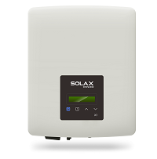
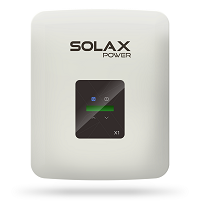
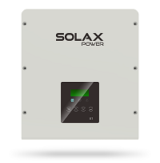
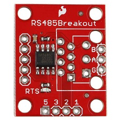
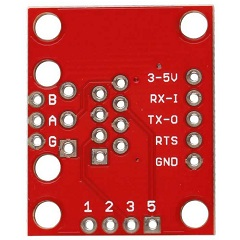
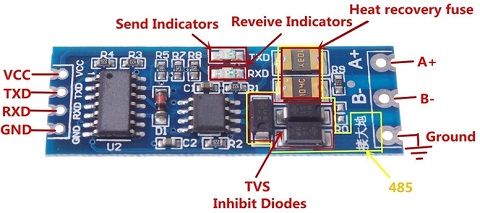
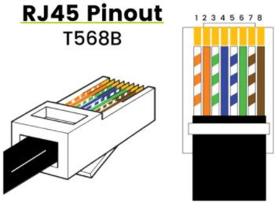
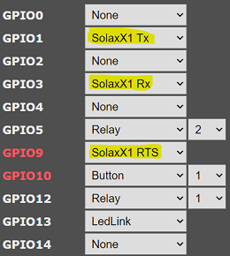
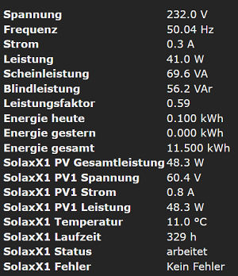

<a id="top">
# SolaX Power - Single phase string inverter X1

??? failure "This feature is not included in precompiled binaries"  

    When [compiling your build](Compile-your-build) add the following to `user_config_override.h`:
    ```arduino
	#ifndef USE_SOLAX_X1
	#define USE_SOLAX_X1
	// Change serial speed from the default value of 9600:
	  #define SOLAXX1_SPEED        9600              // Solax X1 Modbus RS485 serial speed (default: 9600 baud)
	// If your inverter has two PV-inputs, you can activate the 2nd one:

	  #define SOLAXX1_PV2                            // Solax X1 using second PV
	#endif
```

## General

This module reads runtime values from a [Solax X1](https://www.solaxpower.com) device via RS485 Modbus interface and publishes them to MQTT.  
[](_media/solax-x1/X1Mini.png) [](_media/solax-x1/X1Air.png) [](_media/solax-x1/X1Smart.png)

## Wiring

To connect the inverter to the Tasmota-device, you have to use a breakout board to adapt the RS485 interface of the inverter to serial interface of the ESP.

### Breakout boards

There are many RS485-to-TTL modules, aka breakout boards, available. They may work or not. You should have attention on the operation voltage. The ESP-devices work with 3 volts.
Because of that be carefull experimenting with 5 volts. In the best case nothing works. In the worst case it will destroy your ESP or breakout board.
Here are two examples of tested breakout boards. Recommended is a board with a SP3485 chip, because it is designed for operating at 3 volts.

#### SP3485

The SP3485 breakout board is specially made to work with only 3 volts. It has a seperate RTS-pin and works with a voltage from 3 to 5 volts.  
[](_media/solax-x1/SP3485_Breakout1.jpg) [](_media/solax-x1/SP3485_Breakout1.jpg)
#### HW-0519
The HW-0519 breakout board does not need a seperate RTS-pin, because it automatically switches between sending and receiving. The recommended voltage is 5 volts, but it should also work with 3 volts.  
[](_media/solax-x1/HW-0519_Breakout.jpg)
### ESP ⬌ breakout board
The RX-, TX- and RTS- (if needed) lines have to be connected to the ESP matching the [module configuration](#configuration).

| ESP  | SP3485 | HW-0519 |
|------|--------|---------|
| 3.3V | 3-5V   | VCC     |
| GND  | GND    | GND     |
| RX   | TX-O   | TXD     |
| TX   | RX-I   | RXD     |
| RTS  | RTS    | -       |

### Breakout board ⬌ inverter
The RS485 interface is a 2-wire-connection. The wires are called `A+` and `B-`. The big advantage of the interface is, beside of needing only two wires, that it can reach a length up to 1200 meters.
The inverter has a RJ45-jack, where the interface is accessible. Please consult the manual of your inverter where it is located.

!!! tip	"Tip: You can use an ethernet cable and cut off one connector. The RS485 interface uses the blue wire pair."



| Breakout board | RJ45 inverter | Wire color (T568B) |
|----------------|---------------|--------------------|
| A (+)          | Pin 4         | blue               |
| B (-)          | Pin 5         | blue-white         |
| G / Ground     | Pin 7         | brown-white        |

!!! info
	In many cases two wires are enough to keep it working without errors.
	When your environment has electrical interferences or your cable is quiet long, you should use a third wire to establish a common signal reference.
	This wire has to be connected to the `Ground` pins.

## Configuration
You have to configure the module or the template. Select `SolaxX1 Tx` and `SolaxX1 Rx` for the RS485 communication. If you have a breakout board which needs the RTS line, you must also select `SolaxX1 RTS`.  


## Operation
### Result
When every thing works you will see the current data on the main page. They are also provided via MQTT.  


!!! tip
	To send a MQTT telemetry message immediately on every change of power, you can set a [`PowerDelta`](Commands#powerdelta) value.  
	E.g. `PowerDelta 101` for every change of at least 1 W.


### Inverter status
The inverter status field represents the value reported by the inverter, when the inverter is sending data.
In the case when no data is received, it will be display `off`. As the converter is only working, when _the sun is shining_, you will see `off` normally at night or too low light.  

!!! tip
	When the inverter is working and `off` is displayed, so you have to check your hard- and software setup.

### Communcation protocol
The communication of this module is based on the description of the [communication protocol version 1.7](_media/solax-x1/SolaxPower_Single_Phase_External_Communication_Protocol_X1_V1.7.pdf).
