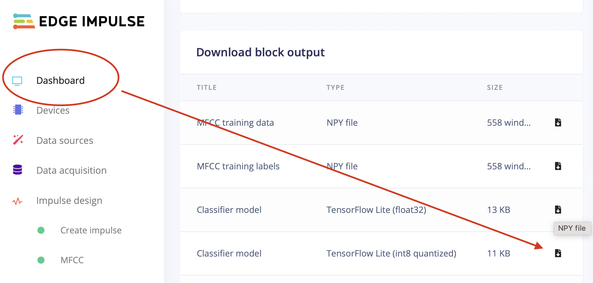
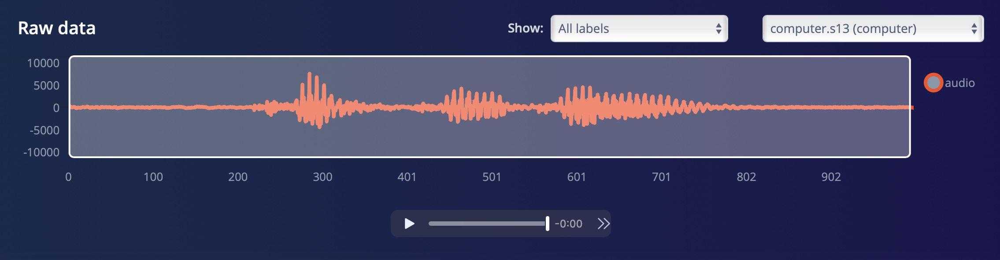
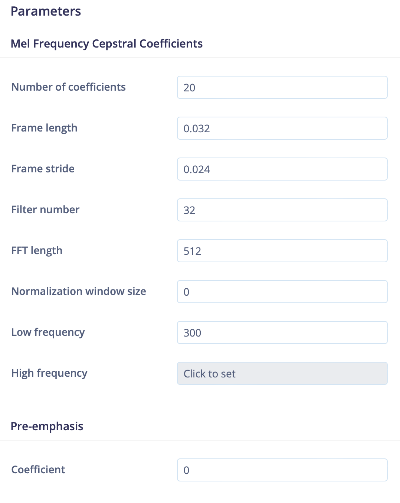
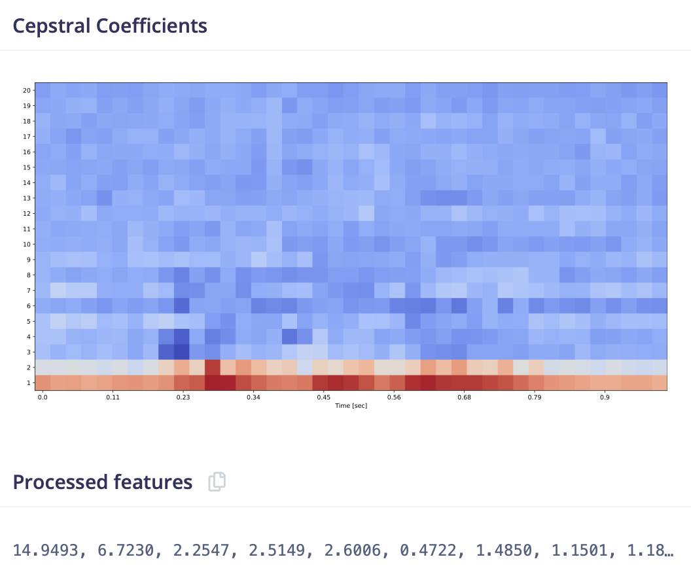
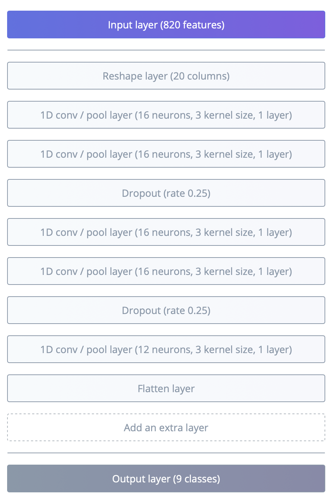

# Tensorflow Lite for Microcontrollers for ESP32 :material-cpu-32-bit:
  
??? failure "This feature is not included in precompiled binaries"  
    add as a build flag to any build environment, i.e. in platformio_tasmota_cenv.ini:  
    ```
    build_flags             = ${env:tasmota32_base.build_flags}
                            -DUSE_BERRY_TF_LITE
                            -DESP_NN ;use optimized kernels for ESP32
                            -DUSE_I2S ;add only for speech/microphone use
                            ; the important part of the next line is lib/libesp32_ml
    lib_extra_dirs          = lib/libesp32, lib/libesp32_div, lib/lib_basic, lib/lib_i2c, lib/lib_div, lib/lib_ssl, lib/libesp32_ml
    ```  
  
### The different levels of Tensorflow
  
[Tensorflow](https://www.tensorflow.org) is an open-source machine-learning platform that is widely adopted and thus is a whole ecosystem with tools, libraries and a huge community. It is not application specific and can be used for all kind of tasks.  
Initially it was only usable on fully fledged computers but over time technical advances in software and hardware made it possible to step down the stairs and make it usable on weaker devices.  
So the next smaller thing is called [Tensorflow Lite](https://www.tensorflow.org/lite) that was targeted for smaller devices like the famous ARM-based 'RaspberryPi'.  
  
But - you guessed it - this was not the end of the line and the whole armada of microcontrollers reached out to be part of the machine learning world. The name of this stripped down platform is [Tensorflow Lite for Microcontrollers](https://www.tensorflow.org/lite/microcontrollers).  
Tasmota uses a [fork](https://github.com/espressif/esp-nn) from Espressif with optimized functions for maximal performance.  
  
### Machine Learning ... is what exactly again?
  
Machine learning, deep learning, KI, AI, ... - these are very blurry defined words, that mean more or less the same and scale from pretty complex up to extremely complex software constructs. Let's try to have a very simplified look at it.   
  
In ancient times (like 20 years ago) problems where solved on computers by finding an algorithm to compute input data and thus getting output data.  
With machine learning the process is still to have input data, but to use known good output data to let a piece of software find the algorithm to get from the known input data to the known output data - and hope that this still works with unknown input data.  
The mixture of algorithms and found parameters will be put into a structure which is called a *model* and the process of building it is usually named *training*.  
The model is created programmatically, although this process can be hidden behind a GUI and at this stage the number of inputs and outputs will be defined.  
Although it would be technically possible to feed raw sensor data into the model, this is not how it is done in most cases. The very common step in between is called *feature extraction*, which reduces the amount of data and often the dimensionality to make the whole process more efficient and thus even possible for some applications. A good feature extraction will help to later run a successful *inference* and there are tools to show, how different input entities form clusters of feature data.  
After feeding the model with sensible data it is time to press a virtual "go button" and invoke an *inference*, that does the magic computations inside the *model*.  
After that the *outputs* will get populated with some values, that have to be interpreted as probabilities. It can be required to add some complex logic in order interpret this data or do some averaging of real-time data. 
  
The processed data is historically typically in the floating point format, but for weak devices like MCU's it is a very common thing to shrink the 4 bytes of a *float32* to 1 byte of an *int8* by quantization. This happens on various places and will lead to a loss of precision, but is very often nearly on par in the final result.  
  
### Design considerations for Tasmota
  
The understandable way to optimize machine learning applications for MCU's is to build and later flash one monolithic firmware, where everything has to be done at/before compile time. This makes sense and is fundamentally the only way to quench out every little bit of performance and memory optimization.  
  
Nonetheless for Tasmota we do not really want to build one-trick-pony firmwares and the idea is to be able to run all kinds of Tensorflow applications with one firmware, that has enough generic capabilities to dynamically load models and extra code at runtime. On the other hand we can optimize the program flow for the ESP chips and Free-RTOS.  
The API shall be quite slim with as few boilerplate code as possible, but can be extended as needed and use Berry to add additional logic in the first place.  
  
!!! tip "Accelerate your development workflow for machine learning"  
    Usually developing machine learning applications on MCU's means that every small change to the model and/or application code will need a firmware compilation and flashing.  
    With Tasmota this is now independent to each other. You can retrain and reupload the model to the file system as often as needed at runtime. The same is valid for refining the Berry code.
  
In order to get things done like speech recognition, where especially realtime feature extraction is not possible to achieve with Berry (with the knowledge of today), additional specialized functionality is included.  
Where it makes sense helper functions for capturing data are added too.  
  
!!! failure "Before you proceed, check you expectations!!" 
    The most important prerequisite for speech recognition on MCU's is to have the right mindset. It is totally impossible to reach the level of recognition of a commercial product (Alexa, Siri, Cortana, ... you name it) on much stronger hardware. The usual cheap I2S MEMS microphone alone is a severe problem and the tuning of the various variables of the model is trial and error in many cases. It will make the final application fail with wrong but similar sounding words or mumbling.   
    Be happy if it works and just don't do it, if you can not handle frustration!
    You will have to invest some time to fine tune every specific application!
  
This sums up to these steps:  
  
1. Create a Tensorflow lite model (including collecting data, finding good parameters, final training).  Use Edgeimpulse to make this easy or create your own training pipeline.
  
2. Create a Berry application (loading the model, running inference, interpret the result, acting on the result).  Use building blocks from this page to get started.
  

#### Speech recognition

For the specific task of speech recognition a big hurdle lies in the way in the form of "How to create a model"?. Although there are numerous ways published on various places, that sound quite similar to each other, this is a very non-trivial task.  
While the same principles apply to all examples that you may find, the implementation differences under the hood are quite substantial.  
The hardest part here is to do the *feature extraction* of the audio data in a compatible(!!!) way for training and inference on the device. Usually the raw audio data is processed using mel frequency conversion, FFT and some kind of logarithm. You may find words like power spectrum, mel frequency energies and mel frequency cepstral coefficients, which sadly are very implementation specific and not interchangeable.  
So it is utterly important to use the same (= compatible) implementations for the whole pipeline of `Training->Deployment->Usage`.  
  
For convenience reasons and after extended testing it was decided to be compatible with [Speechpy](https://github.com/astorfi/speechpy) (with small differences). Thus it is possible to use
[Edge Impulse](https://www.edgeimpulse.com) as the training platform for model creation, which uses *Speechpy* too and is a development platform for machine learning on small devices, that shares some similarities to GitHub with regards to costs. Everything that we need for Tasmota is free, the enterprise solution they offer for money is not needed.  
Technically it is definitely possible to build a complete offline training pipeline as basically everything on Edgeimpulse is open source and can be recreated by a motivated user for local usage.  
  
If you use [Edge Impulse](https://www.edgeimpulse.com) for online training, you do not have to create a new firmware image for your Tasmota device. Instead of choosing one of the deployment options from Edge Impulse, you only have to download the binary TensorFlow Lite model (usually the `int8 quantized` version) from the `Dashboard`, give it a suitable name and upload it to Tasmotas filesystem in order to use it with Berry afterwards.  
<figcaption>Example -  speech recognition using MFCC:</figcaption>
{ width="500" }


## Usage
  
Functionality is provided by the module `TFL`, so always start with `import TFL`.
  
TFL Function|Parameters and details
:---|:---
begin<a class="cmnd" id="tfl_begin">|`(type:string, descriptor:bytes)`<br>First step creates an internal context of type<br>"BUF" - generic session with arbitrary byte buffers for input and output<br>"MIC" - for voice recognition and capturing training data<br>"CAM" - not implemented yet<br>"" - stops a running session, can be used to init the internal log buffer<br>``descriptor`a byte array with specific meaning for every type
load<a class="cmnd" id="tfl_begin">|`(model:bytes, output:bytes, memory:int)`<br>Will load and run the model<br>`model` a bytes buffer that holds the model data for the entire lifecycle<br>`output` a byte buffer that matches the output size of the model<br>`memory` optional (default: 2000), a model specific memory size in bytes that will be allocated, find by trial-end-error
input<a class="cmnd" id="tfl_input">|`(input:bytes)`<br>Feed the input of the model with values, must match the size of the model input. Will invoke an inference.
output<a class="cmnd" id="tfl_output">|`(output:bytes) -> bool`<br>Returns true if function was not called yet on actual output data.
rec<a class="cmnd" id="tfl_rec">|`(filename:string, seconds:int)`<br>Records audio to a WAV file (Mono, 16 kHz, 16 Bit).
stats<a class="cmnd" id="tfl_stats">|`() -> string`<br>Returns a JSON string with some metrics of the current session.
log<a class="cmnd" id="tfl_log">|`() -> string`<br>Returns a log message, typically for debugging.  
  
!!! tip "Use Netron to check your model" 
    [https://netron.app](https://netron.app) shows the inner structure of a tensorflow model including format and size of the inputs and outputs.
    Online and offline versions of the application available for every major platform.


### "hello world" ... sort of
  
Perhaps THE starter project is the in itself pretty useless "sinewave example", which is nicely explained here:
[YOUTUBE-VIDEO](https://www.youtube.com/watch?v=BzzqYNYOcWc&t=2s) (a series of videos)  
  
Of course we can run this model perfectly fine inside Tasmota, with a Berry code snippet:
  
``` Berry
import TFL
TFL.begin("BUF")  # generic TFL session 
var i = bytes(-4) # holds one float, size must match the model
var o = bytes(-4) # dito

var model = open("sine_model.tflite").readbytes() # this binary file must have been saved in the FS before
TFL.load(model,o,3000) # load and run

var count = 0.0
def cb() 
    if TFL.output(o)
        # "draw" a bar
        var v =  int((o.getfloat(0) + 1) * 15)
        var bar_el = "="
        var bar = ""
        for i:0..v bar+=bar_el end
        print(bar)

        # or print the value
        # print(o.getfloat(0))

        # prepare new input in the range of 0..6
        count+= 0.1 
        if count>6 count=0 end
        i.setfloat(0,count) 
        TFL.input(i) # and feed it into the model
    end
    var s = TFL.log() # receive log messages from the TF lite tasks
    if s print(s) end 
    tasmota.set_timer(50, cb) 
end
cb()

# initiate loop 
TFL.input(i)

```
  
This will pollute your Tasmota console with a moving bar resembling a sine wave. 
  
In fact this shows a very generic application, where the format and size as well as the meaning of the in- and outputs must be known, but the model itself can remain a "black box". We do not need to know, which kernels or parameters are used.  
  
!!! tip "Use 'TFL.stats()' to find memory size" 
    The metrics will show the used bytes of the model. So start with a large value and tune down, but leave a margin above the number in the output of the command.

### Speech recognition / keyword spotting
  
Training can be done entirely with Edgeimpulse. See their documentation for [Responding to your voice](https://docs.edgeimpulse.com/docs/tutorials/responding-to-your-voice).  
  
It is important to have a basic understanding of the process of speech recognition in order to set and tune the configuration:  
An audio stream is processed in small slices, which have a duration and a stride. They can overlap or run one after the other.  

Tasmota will process every audio slice and immediately extract the features with support for the modes: [MFE](https://docs.edgeimpulse.com/docs/edge-impulse-studio/processing-blocks/audio-mfe?q=mfe) and [MFCC](https://docs.edgeimpulse.com/docs/edge-impulse-studio/processing-blocks/audio-mfcc?q=mfe).  
For performance reasons, we do not support every setting Edgeimpulse provides. Do not use `Window size` for MFCC mode by setting it to 0. More on this later.
  
We use the following fixed audio settings:  

Setting|Value
:---|:---
Sample length|1 second - means the word to train should be shorter (you might get away with training a shorter part of a longer word)
Sample frequency|16kHz - a proven compromise of sound quality, that is just enough for voice recognition, but can be handled by the ESP32
Sample format|16 bit, mono
Low frequency|300 Hz - default in Edgeimpulse
High frequency|8000 Hz - Sample frequency/2 and default too. Higher values would not make sense because of the NYQUIST theorem.
  
  
#### Create training data  
  
A working microphone setup for recording training data and later audio recognition is needed.  
Therefor the *-DUSE_I2S* must be added to the *build_flags section* of the environment in *platformio_tasmota_cenv.ini*. This allows to set the GPIO pins for the I2S microphone according to [I2S-Audio](I2S-Audio.md#audio-input).  
Although you can use the microphone of your computer or smartphone, it is highly recommended to use your ESP32-microphone-installation at least for a large amount of samples in order to train the model with the same pure sound quality, that it later has to run inference on. A working SD card config is for sure the best way to capture training data. 

You can use a simple Berry driver to get this done:  

```Berry
# record to 16-bit WAV file at 16 kHz, SD card highly recommended
# repeat the intended keyword roughly every second in the same technical setup, that will later be used for keyword spotting
# usage 'rec<seconds> filename', example: rec30 left -> record 30 seconds from I2S microphone to '/left.wav'
class WAV_REC : Driver
    var secs

    def init()
        import TFL
        TFL.begin("") # init empty for log buffer
        print("TFL: command 'rec' added")
        self.secs = 0
    end

    def begin()
        import TFL
        var descriptor = bytes(-10) # mic descriptor
        descriptor[0] = 4  # i2s_channel_fmt, 4=left
        descriptor[1] = 16 # amplification factor
        descriptor[2] = 32 # slice_dur
        descriptor[3] = 32 # slice_stride
        descriptor[4] = 40 # mfe filter (= features if MFE mode)
        descriptor[5] = 0  # mfcc coefficients, if 0 -> compute MFE only
        descriptor[6] = 9  # 2^9 = 512 fft_bins
        descriptor[7] = 10 # max. invocations per second
        descriptor[8] = 52 # db noisefloor -> negative value
        descriptor[9] = 0  # preemphasis
        TFL.begin("MIC",descriptor)
    end

    def every_second()
        if self.secs > 0
            print(self.secs)
            if self.secs == 1 print("... done!") end
            self.secs -= 1
        end
    end

    def every_100ms()
        import TFL
        var s = TFL.log()
        if s print(s) end
    end

    def rec(name,secs)
        import TFL
        self.begin()
        TFL.rec(name,secs) # Edgeimpulse can infer the label from the name, so name it accordingly
        self.secs = secs + 1 # add startup latency
        print("TFL: record",secs,"seconds to",name)
    end
end

var wav_rec = WAV_REC()
tasmota.add_driver(wav_rec)

def rec(cmd, idx, payload, payload_json)
    var file = "/" + payload + ".wav"
    wav_rec.rec(file,idx)
    tasmota.resp_cmnd_str(file)
end

tasmota.add_cmd('rec', rec) # rec30 left -> record 30 seconds from I2S microphone to "/left.wav"
``` 
Note: Most of the descriptor values do not really matter here, but the whole descriptor must have valid values, meaning some values MUST not be 0!
  
Then you can talk into the microphone with around 1 word per second and later upload this file to your Edgeimpulse project via your computer. 
  
!!! tip "General strategies" 
    1. Mix input samples from different microphones. Using the computer or phone for audio recording is way more user friendly, so add some samples the easy way.
    But without enough samples from your ESP-microphone-setup the final performance will be mediocre at best.
    2. Input samples from different speakers will very likely lead to a more robust model. So ask family and friends for help.
    3. More is more. Almost always adding more samples will result in a better performing model. Don't give up, if testing performance degrades in the early stages of audio harvesting. Just make sure to only add valid audio data with correct labels and the final result will improve with more audio data. 
  
#### For training on Edgeimpulse.com some post processing is usually necessary.  

If you have uploaded a sample containing many repetitions of one word, there is a convenient split function, that slices the long megasample into one-second samples. For very short words this works automatically pretty well, for longer words close to one second it is recommended to check and fix possible errors immediately.  
You can check the resulting simple sample including the correct label:  
  
<figcaption>16-bit-sample with label "computer":</figcaption>


  
The feature extraction step needs some parameters and will happen in the same way before training and later on-device.  
  
<figcaption>MFCC parameters:</figcaption>
{ width="500" }

  
This will create a feature array, which will stack the features of every slice on each other. This will be visualized as a heat map, where a slice is a column (oldest left) and the lines represent the frequency banks.  Thus this "picture" holds the data of one second of audio, that the ML model will later "see" to do inference.   
  
<figcaption>MFCC features for 1 second of audio:</figcaption>

  
Configuring the neural network architecture can be done in a GUI. Following the rule to go deep (more layers) and not too wide (less neurons) results in smaller models.  
  
<figcaption>"Deep" model for 7 keywords (plus unknown and noise) with size of only 14 kB:</figcaption>
{ width="500" }
  
After training and configuring the model on Edgeimpulse we can simply download the 
Tensorflow Lite model from the dashboard (the int8 version) and upload it to the ESP32 files system.  
  
#### On the Tasmota side the feature settings have to be translated in Berry with a descriptor 
  
The descriptor settings may change in the future!  
  
|number|property|value|
|---|:---|:---|
0|i2s_channel_fmt_t|*i2s_channel_fmt_t* from i2s_types.h, we need mono, so 3 for right or 4 for left
1|amplification factor|typical values are 8 - 32, must be >0, too high values will lead to clipping<br>The audio output of most I2S microphone is very low. Check your setup by recording a WAV file and analyze in Edgeimpulse or use an audio tool like *Audacity*.
2|slice duration<br>*or* Frame length|A slice of audio data in milliseconds. With the fixed audio settings 32 milliseconds translate to 512 samples, which as a power of 2 is a good fit for FFT.
3|slice stride<br>*or* Frame stride|Time in milliseconds between the starts of 2 adjacent slices. No overlap happens if duration and stride are equal. Lower values create more stress for the system. Values around and below 20 milliseconds may leads to problems. Bad Wifi will worsen things earlier!!
4|Filter number|Number of captured mel energies. For MFE mode these are the feature values for one slice.
5|MFCC coefficients<br>*or* Number of coefficients|If not 0, this means we use MFCC mode and these are the feature values for one slice.
6|FFT size<br>*or* FFT length|In powers of 2. For now must be equal or greater than sample size, means slice duration of 32 ms -> sample size 512 -> 2^9 -> 9
7|Inferences per second|Typical values 4-10. More values need more averaging in post-processing, but will likely show less missed words.
8|Noisefloor|In dB for MFE mode. Sound data with level below that threshold will be discarded.
9|preemphassis|Factor will be divided by 100, so 98 -> 0.98. It is recommended to not use this, as Edgeimpulse and Speechpy compute this over the whole sample, while Tasmota does this per slice, which is way more efficient but creates a difference. There is a way to overcome this. More later ...  
  
  
The Berry driver for the speech recognition must be adapted for every *model* and use case. A plain old ESP32 without extra PS-RAM is enough to "hear" with about 10 inferences per per second.   
Demo example:  
```Berry
# globals
var key_words = ["down", "left", "noise", "right", "up"] # must match your trained model!! Edgeimpulse sorts them alphabetically
var thresholds = [700,710,680,680,720] # same indices as key_words, increase against false positives, decrease against misses, 
                                       # max. theoretical value = 256 * number of averages for int8_t output tensor

class PREDICTOR
    var avgs, sz, time_out
    var out_buf, out_buf_idx

    def init(sz, averages)
        self.out_buf = bytes(-(averages * sz)) # creates circular buffer for averaging
        self.out_buf_idx = 0 
        self.time_out = 0 # after successful word finding, make a break to avoid "noise findings"
        self.sz = sz # size of word list/output tensor
        self.avgs = averages # number of averaging/oversampling steps
    end

    def clear() # clear oversampling buffer after word was found
        for i:0..size(self.out_buf)-1
            self.out_buf[i] = 0
        end
    end

    def run(data)
        if self.time_out > 0
            self.time_out -= 1
            return 255 # return some error code = no result
        end

        for i:0..(self.sz-1)
            self.out_buf[self.out_buf_idx+i] = data[i]
        end
        self.out_buf_idx += self.sz
        if self.out_buf_idx>(self.avgs-1) * self.sz
            self.out_buf_idx = 0 
        end

        var average
        for i:0..(self.sz-1)
            average = 0
            for j:0..self.avgs-1
                average +=  self.out_buf[i+(j*self.sz)]
            end
            # if i == 4
            #     print(average) # test the threshold for single words while developing, needed in the next step
            # end
            if average > thresholds[i] # find the threshold stored in the global list by trial and error
                if i != 2 # this is the non-noise/unknown output - you must infer this from your model
                    self.clear() # only clear the buffer after finding a keyword, not for noise/unknown
                    self.time_out = 10 # find the value by trial and error - good starting point is one second
                                       # lower number allows faster speech, but might increase false positives
                    print(average)
                end
                return i
            end
        end
        return 255 # return some error code = no result
    end
end

class MICROSPEECH : Driver
    var o, o_sz  # output tensor, size of output tensor
    var p        # predictor instance
    var model    # this var really holds the model data for the entire session
    var new_out  # current output sensor converted to uint8_t

    def init()
        import TFL
        self.o_sz = size(key_words) # this value must be correctly taken from the model/training pipeline
        self.new_out = []
        self.new_out.resize(self.o_sz)
        self.o = bytes(-self.o_sz) # size must match the model
        self.p = PREDICTOR(self.o_sz,4) # second arg is number of averages for prediction

        var descriptor = bytes(-10)
        descriptor[0] = 4  # i2s_channel_fmt, 4=left
        descriptor[1] = 16 # amplification factor
        descriptor[2] = 32 # slice_dur in ms 
        descriptor[3] = 32 # slice_stride in ms
        descriptor[4] = 26 # mfe filter (= features if MFE mode)
        descriptor[5] = 13 # mfcc coefficients, if 0 -> compute MFE only
        descriptor[6] = 9  # 2^9 = 512 fft_bins
        descriptor[7] = 10 # max. invocations per second - find best value by testing on device
        descriptor[8] = 52 # db noisefloor -> negative value
        descriptor[9] = 0 # preemphasis
        TFL.begin("MIC",descriptor)
        self.model = open("mfcc.lite").readbytes() # file must be present on the ESP
        if self.model
            TFL.load(self.model,self.o,28000)
        end
    end

    def every_50ms()
        import TFL
        if TFL.output(self.o)
            for i:0..(self.o_sz-1)
                self.new_out[i] = self.o.geti(i,1) + 128
            end
            #print(self.new_out)
            var r = self.p.run(self.new_out)
            if r != 2 && r != 255 # in this example not noise/unknown/error code - can be more complex
                print(key_words[r])
                # do something useful
            end
        end
        var s = TFL.log()
        if s print(s) end
    end
end

var mic = MICROSPEECH()

tasmota.add_driver(mic)
```

