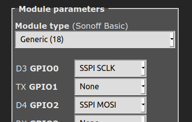
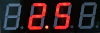
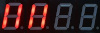
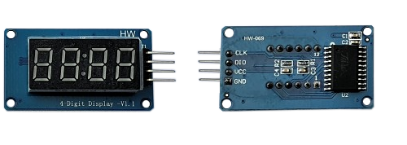
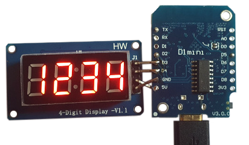

# TM1637 Seven-Segment Display (4-digit and 6-digit)
<br>

!!! info 
    This feature is included only in the _tasmota*-display.bin_" precompiled binary     
<br>

To use this feature (i.e., if you're not using _tasmota*-display.bin_ precompiled binary), you must [compile your build](Compile-your-build) after adding the following to `user_config_override.h`:
```
#ifndef USE_DISPLAY
#define USE_DISPLAY
#endif

#ifndef USE_DISPLAY_TM1637
#define USE_DISPLAY_TM1637
#endif
```
----  
<br>

**TM1637**  


<br><br>

The **TM1637** display module is a small (~ 10mm high digits) 7-segment, LED-based display unit with 4 or 6 digits. It uses a two-wire I2C-like (but not exactly) protocol for communication with MCUs like the ESP8266 / ESP32 / Arduino etc., 

This module is a great way to add a simple numeric display to any MCU project.  
<br><br>

## Features
<br>

The _Tasmota_ support for this module can --

* display **Numbers** and **Floats** with control over _position_ and _leading zeros_.
* display basic **Text**, for example, sending the text `22.5^` will display:<br>
<br>
* display **Raw** segments.
* display **Level**, like a _bar graph_
* display  **Scrolling text**
* display a **Clock** in 12 hr and 24 hr format
* set **Brightness** (8 levels) and **Clear** the display.


<br><br>  

## Configuration  
<br>

### Wiring
<br>

The **TM1637** module needs to be connected to two GPIO pins and a 3.3V-5V power supply.  
<br>

| TM1637   | ESP8266 based module |
|---|---|
|CLK   | GPIOx   |
|DIO   | GPIOy 
|VCC   | 3.3V (e.g., _ESP-01_) or 5V (e.g., _Wemos D1 Mini_)
|GND   | GND  

<br><br>

### Tasmota Settings
<br>

In _Tasmota_'s **Configuration -> Configure Module** page, assign:  

1. `GPIOx` to `TM1637 CLK`
2. `GPIOy` to `TM1637 DIO`
<br><br>

For example, if x=0 and y=2, then the module configuration would look like the following:  
<br>



<br><br>
Once the GPIO configuration is saved and the ESP8266 / ESP32 module restarts, set the Display Model to 15 using the command  
<br>
`DisplayModel 15`
<br><br>

After the ESP8266/ESP32 module restarts again, the _Display-_ commands listed below can be used from the _Tasmota_ web-console, _MQTT_, and from Tasmota  [Rules](https://tasmota.github.io/docs/Rules/)
<br><br>

Next, depending upon your display variant, set your _Display Type_ to **0** or **1** using the command  
<br>

`DisplayType 0`   for the 4-digit TM1637  -or-  
`DisplayType 1`   for the 6-digit TM1637  
<br><br>
## Commands and Usage
<br>

 Console/MQTT Commands    | Description                                             | values     |
---------------------|---------------------------------------------------------|------------|
 DisplayType         | Sets the display type to one of _TM1637 4-Digit_ **(0)** or _TM1637 6-Digit_ **(1)**                              | 0 or 1
 DisplayClear     | Clears the display  | 
 DisplayNumber     | Clears and then displays number without decimal. command e.g., "DisplayNumber 1234". <br> Control `leading zeros`, `length` and `position`. <br> `leading zeros` can be `1` or `0` (default),<br> `length` can be `1` to `NUM_DIGITS` (4 or 6), <br> `position` can be `0` (left-most) to `NUM_DIGITS` (right-most).  <br> Command example: `DisplayNumber 12, 1, 1, 3`  This will display:<br>  |    `num` [, `position`[, `leading_zeros`[, `length`]]]
 DisplayNumberNC | Display integer number as above, but without clearing first. e.g., "DisplayNumberNC 1234". Usage is same as above. | same as above
DisplayFloat | Clears and then displays float (with decimal point)  command e.g., "DisplayFloat 12.34". <br> Control `precision`, `length` and `position`. <br> `precision` can be `0` to `NUM_DIGITS` (default), <br> `length` can be `1` to `NUM_DIGITS` (4 or 6), <br> `position` can be `0` (left-most) to `NUM_DIGITS` (right-most).  <br> Command example: `DisplayFloat 2.48, 1, 1, 2`  This will display:<br>  | `num`[, `position`[, `precision`[, `length`]]]
DisplayFloatNC | Displays float (with decimal point) as above, but without clearing first. command e.g., "DisplayFloatNC 12.34" | same as above
DisplayBrightness | Set brightness of the display.  Command e.g., "DisplayBrightness 2" | 1 to 8
DisplayRaw | Takes upto `NUM_DIGITS` comma-separated integers (0-255) and displays raw segments. <br> Each number represents a 7-segment digit. Each 8-bit number represents individual segments of a digit. <br> Segment a=1, b=2, c=4, d=8, e=16, f=32, g=64 and h (decimal point)=128.<br> To turn on all segments, the number would be 1+2+4+8+16+32+64+128 = 255<br> For example, the command `DisplayRaw 0, 2, 255, 255` would display:<br>  | `position`, `length`,  `num1` [, `num2`[, `num3`[, `num4`[, ...upto `NUM_DIGITS` numbers]]...]
DisplayText | Clears and then displays basic text.  Command e.g., `DisplayText a.b12` <br> Control `length` and `position` of the displayed text. <br> `length` can be `1` to `NUM_DIGITS` , <br> `position` can be `0` (left-most) to `NUM_DIGITS-1` (right-most) <br><br>  A caret(`^`) symbol in the text input is dispayed as the degrees(`°`) symbol. This is useful for displaying Temperature (or angle)! <br> For example, the command `DisplayText 22.5^` will display:<br>   | `text`[, `position`[, `length`]]
DisplayTextNC | Clears first, then displays text. Usage is same as above. | same as above
DisplayScrollText | Displays scrolling text, upto 50 characters. Command example: `DisplayScrollText tasmota is awesome`| text
DisplayScrollDelay | Sets the speed of text scroll. Smaller delay = faster scrolling. | 0 to 15
DisplayLevel | Display a horizontal bar graph. Command e.g., `DisplayLevel 50` will display:<br> <br> | 0 to 100
DisplayClock | Displays a clock. <br> `DisplayClock 1` displays a clock in 12-hour format. <br> `DisplayClock 2` displays a clock in 24-hour format. <br> `DisplayClock 0` turns off the clock and clears the display  | 1 or 2 or 0
 | | 

<br><br>
## Usage in Rules
<br>

All the above commands can be used in Tasmota [Rules](https://tasmota.github.io/docs/Rules/), as usual. 

For example, a simple digital thermometer can be implemented by connecting a **DHT22** Temperature-Humidity Sensor and a **TM1637** to a **Wemos D1 Mini**, and writing a Rule like the following:
<br><br>

```haskell
Rule1
ON Tele-AM2301#Temperature DO DisplayText %value%^ ENDON
```
<br><br><br>
## TM1637 Images


  
The TM1637 4-digit module (front and back)  
<br><br><br><br>
  
TM1637 4-digit module with Wemos D1 Mini