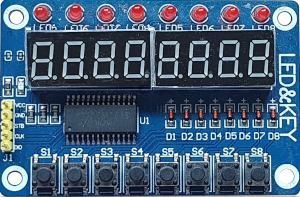
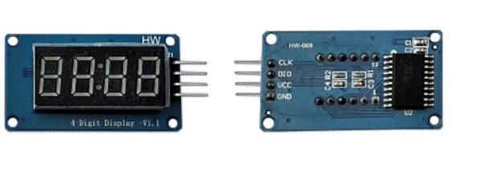
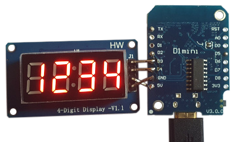

# TM1637, TM1638 and MAX7219 Seven-Segment Display

??? tip "This feature is included only in `tasmota*-display.bin` precompiled binaries"     
    When [compiling your build](Compile-your-build) add the following to `user_config_override.h`:
    ```arduino
    #ifndef USE_DISPLAY
    #define USE_DISPLAY
    #endif

    #ifndef USE_DISPLAY_TM1637
    #define USE_DISPLAY_TM1637
    #endif
    ```
    In case you want MAX7219 also add:
    ```
    #ifndef USE_DISPLAY_MAX7219
    #define USE_DISPLAY_MAX7219
    #endif
    ```
    In order to use TM1368 leds and buttons, see instructions in [TM1638 leds and buttons](#tm1638-leds-and-buttons)


| TM1637 | TM1638 | MAX7219  |
|:---:|:---:|:---:|
|&nbsp;&nbsp;&nbsp;&nbsp;&nbsp;&nbsp;&nbsp;&nbsp;&nbsp;   | &nbsp;&nbsp;&nbsp;&nbsp;&nbsp;&nbsp;&nbsp;   |    |

The **TM1637**, **TM1638** and **MAX7219** display modules are small (~ 10mm high digits) 7-segment, LED-based display units with 4/6 digits (TM1637), 8 digits and 8 digits (TM1638 and MAX7219) respectively. They use a two-wire (TM1637) or three-wire (TM1638 and MAX7219) I2C-like (but not exactly) protocol for communication with MCUs like the ESP8266 / ESP32 / Arduino etc., 

These modules are a great way to add a simple numeric display to any MCU project.  

## Features

The _Tasmota_ support for these modules can --

* display **Numbers** and **Floats** with control over _position_ and _leading zeros_.
* display basic **Text**, for example, sending the text `22.5^` will display:<br>
<br>
* display **Raw** segments.
* display **Level**, like a _bar graph_
* display  **Scrolling text**
* display a **Clock** in 12 hr and 24 hr format
* set *Brightness* (8 levels) and **Clear** the display.


## Configuration  


### Wiring


The **TM1637** module needs to be connected to two GPIO pins and a 3.3V-5V power supply.  


| TM1637   | ESP based module |
|---|---|
|CLK   | GPIOx   |
|DIO   | GPIOy 
|VCC   | 3.3V (e.g., _ESP-01_) or 5V (e.g., _Wemos D1 Mini_)
|GND   | GND  


The **TM1638** module needs to be connected to three GPIO pins and a 5V power supply.  
<br>

| TM1638   | ESP based module |
|---|---|
|CLK   | GPIOx   |
|DIO   | GPIOy 
|STB   | GPIOz 
|VCC   | 5V
|GND   | GND  


The **MAX7219** module needs to be connected to three GPIO pins and a 5V power supply.  
<br>

| MAX7219   | ESP based module |
|---|---|
|CLK   | GPIOx   |
|DIN   | GPIOy 
|CS    | GPIOz 
|VCC   | 5V
|GND   | GND  


### Tasmota Settings


In _Tasmota_'s **Configuration -> Configure Module** page, assign:

For **TM1637**

1. `GPIOx` to `TM1637 CLK`
2. `GPIOy` to `TM1637 DIO`


For **TM1638**

1. `GPIOx` to `TM1638 CLK`
2. `GPIOy` to `TM1638 DIO`
3. `GPIOz` to `TM1638 STB`


For **MAX7219**

1. `GPIOx` to `MAX7219 CLK`
2. `GPIOy` to `MAX7219 DIN`
3. `GPIOz` to `MAX7219 CS`
<br>


For example, if x=0 and y=2, z=4 then the module configuration would look like the following:  
<br>
**TM1637**<br>

<br><br>
**TM1638**<br>

<br><br>
**MAX7219**<br>

<br>


### Initial Setup

The power toggle button in webUI turns the display on or off. However, if there are additional relays defined, resulting in multiple power toggle buttons in WebUI, display power will create and map to the last button. Thus, it is necessary to ensure that relays are numbered from 1, otherwise a conflict will occur with the display power.

In the console, turn ON the display with the command `Power 1`.

### DisplayModel

Once the GPIO configuration is saved and the ESP8266 / ESP32 module restarts, set the Display Model to 15 using the command:  

`DisplayModel 15`
<br>

### DisplayWidth

If you have a TM1637 with 6 digits, set the number of digits using the command:  

`DisplayWidth 6`
<br>

### DisplayType

The 6-digit TM1637 has 2 known variants with different hardware wiring for the digit ordering.  
You can switch between these two variants with the following commands:  

`DisplayType 0`  - Use this for the Type 0 variant, with wiring similar to the TM1637 4-digit modules  
`DisplayType 1`  - Use this for the Type 1 variant, with a different wiring that causes the text **123456** to appear as **321654**
<br>

After the ESP8266/ESP32 module restarts again, the display module is ready to accept commands.

### DisplayModes

[DisplayModes](Displays.md#displaymode-parameters) `0..3` are supported. The firmware default is `DisplayMode 1`.  

To use the Seven-Segment specific _Display-_ commands described below, set the `DisplayMode` to `0` with:  

`DisplayMode 0`
<br>


### DisplayDimmer
  
The *brightness* of the display can be set using the `DisplayDimmer` command.  

`DisplayDimmer 0..100` maps the brightness value to 8 steps from `0..7`  

For a minimum brightness, make sure this value is at least about `13` 


### 7-Segment specific Commands

 The _Display-_ commands listed below can be used from the _Tasmota_ web-console, _MQTT_, and from Tasmota  [Rules](Rules.md)
<br>


### TM1638 leds and buttons

In order to use the TM1638 leds and buttons, you must self-compile `tasmota` with the following in your `user_config_override.h`:

```arduino
#define USE_DISPLAY
#define USE_DISPLAY_TM1637

#define USE_TM1638 // Add support for TM1638 switches copying Switch1 .. Switch8 (+1k code)
// #define TM1638_USE_AS_BUTTON // Add support for buttons
#define TM1638_USE_AS_SWITCH // Add support for switches (default)
#define TM1638_MAX_DISPLAYS 8 // Add support for power control 8 displays
#define TM1638_MAX_KEYS 8 // Add support for 8 keys
#define TM1638_MAX_LEDS 8 // Add support for 8 leds    
```

This will define the buttons as `Switches`. If you want to use them as `Buttons`, invert the comments on the lines:
```
#define TM1638_USE_AS_BUTTON // Add support for buttons
//#define TM1638_USE_AS_SWITCH // Add support for switches (default)
```

The 8 leds will be created as `Relay`s. If no other relays are defined, they will start as `Relay1` 
up to `Relay8`.
A 9th relay is assigned to the 7-segment display.

The 8 buttons will be created by default as `Switch`es with all the features of switches including 
debouncing and all Switchmodes.

Alternatively, using `#define TM1638_USE_AS_BUTTON` they would be created as `Button`s fully equivalent 
to a native Tasmota Button on a GPIO.

In all cases, leds, switches or buttons index will be assigned **after** native relays, switches or 
buttons get assigned. Other drivers providing relays, buttons or switchs initialized before TM1368
will be also get index assigned before TM1638. So actual indexes may depends on what other GPIO/drivers
are configured on your system.

See [rule sample](#tm1638-in-rules) below.


## Commands and Usage


 Console/MQTT Commands    | Description                                             | values     |
---------------------|---------------------------------------------------------|------------|
  DisplayClear     | Clears the display  | 
 DisplayNumber     | Clears and then displays number without decimal. command e.g., "DisplayNumber 1234". <br> Control `position`, `leading zeros`, and `length`. <br> `position` can be `0` (left-most) to `NUM_DIGITS-1` (right-most), <br> `leading zeros` can be `1` or `0` (default), <br> `length` can be `1` to `NUM_DIGITS` (4 or 6).  <br> Command example: `DisplayNumber 12, 1, 1, 3`  This will display:<br>  |    `num` [, `position`[, `leading_zeros`[, `length`]]]
 DisplayNumberNC | Display integer number as above, but without clearing first. e.g., "DisplayNumberNC 1234". Usage is same as above. | same as above
DisplayFloat | Clears and then displays float (with decimal point)  command e.g., "DisplayFloat 12.34". <br> Control `position`, `precision`, and `length`. <br> `position` can be `0` (left-most) to `NUM_DIGITS-1` (right-most), <br> `precision` can be `0` to `NUM_DIGITS` (default), <br> `length` can be `1` to `NUM_DIGITS` (4 or 6).  <br> Command example: `DisplayFloat 2.48, 1, 1, 2`  This will display:<br>  | `num`[, `position`[, `precision`[, `length`]]]
DisplayFloatNC | Displays float (with decimal point) as above, but without clearing first. command e.g., "DisplayFloatNC 12.34" | same as above
DisplayRaw | Takes up to `NUM_DIGITS` comma-separated integers (0-255) and displays raw segments. <br> Each number represents a 7-segment digit. Each 8-bit number represents individual segments of a digit. <br> Segment a=1, b=2, c=4, d=8, e=16, f=32, g=64 and h (decimal point)=128.<br> To turn on all segments, the number would be 1+2+4+8+16+32+64+128 = 255<br> For example, the command `DisplayRaw 0, 2, 255, 255` would display:<br>  | `position`, `length`,  `num1` [, `num2`[, `num3`[, `num4`[, ...up to `NUM_DIGITS` numbers]]...]
DisplayText | Clears and then displays basic text.  Command e.g., `DisplayText a.b12` <br> Control `length` and `position` of the displayed text. <br> `length` can be `1` to `NUM_DIGITS` , <br> `position` can be `0` (left-most) to `NUM_DIGITS-1` (right-most) <br><br>  A caret(`^`) symbol in the text input is displayed as the degrees(`°`) symbol. This is useful for displaying Temperature (or angle)! <br> For example, the command `DisplayText 22.5^` will display:<br>   | `text`[, `position`[, `length`]]
DisplayTextNC | Displays text without first clearing the display. Usage is same as above. | same as above
DisplayScrollText | Displays scrolling text, up to 50 characters. <br>If `num_iterations` is not specified, it scrolls indefinitely, until another *Display-* command is issued. Optionally, specifying `num_iterations` causes the scrolling to stop after the specified number of iterations.<br>Command examples: <br>`DisplayScrollText tasmota is awesome`   -- causes indefinite scrolling<br>`DisplayScrollText tasmota is awesome, 5`   -- causes scrolling to stop after 5 iterations| `text` [, `num_iterations`]
DisplayScrollDelay | Sets the speed of text scroll. Smaller delay = faster scrolling. | 0 to 15
DisplayLevel | Display a horizontal bar graph. Command e.g., `DisplayLevel 50` will display:<br> <br> | 0 to 100
DisplayClock | Displays a clock. <br> `DisplayClock 1` displays a clock in 12-hour format. <br> `DisplayClock 2` displays a clock in 24-hour format. <br> `DisplayClock 0` turns off the clock and clears the display  | 1 or 2 or 0


## Usage in Rules

All the above commands can be used in Tasmota [Rules](https://tasmota.github.io/docs/Rules/), as usual. 

For example, a simple digital thermometer can be implemented by connecting a **DHT22** Temperature-Humidity Sensor and a **TM1637** to a **Wemos D1 Mini**, and writing a Rule like the following:

```haskell
Rule1
ON Tele-AM2301#Temperature DO DisplayText %value%^ ENDON
```
Another example, using a **MAX7219** and a **SHT3X** temp/humidity sensor, with value comparison so displaytext only fires when the value changes. The first four digits display the temperature and the second four digits display the humidity. The DisplayTextNC command is used to leave unused digits illuminated, so both numbers can be independently updated.
```pkkrusty
Rule1
on sht3x#Temperature!=%var1% do backlog displaytextnc %value%^;var1 %value% endon on sht3x#Humidity!=%var2% do backlog displaytextnc %value%h,4;var2 %value% endon on system#init do power 1 endon
```

### TM1638 in rules

As the leds and buttons are fully equivalent to Relays and Buttons/Switches, they can be used in 
rules in exactly the same way as native Relay/Power, Buttons/Switches.

Here is a little ruleset which implement a 8-digit code entry (using only digit 1 to 8).

At start Time is displayed (DisplayMode 1) but as soon as you type in the 1st key, it starts the 
entry mode. After each digit entry the user has up to 5 seconds to enter the next digit. 
It (s)he fails, the state machine is reset and the display reverts showing Time.

Once all 8 digits are entered, the resulting string is stored in `var3` as a text message.

This is only a sample which can be adapted for example to send the code through MQTT.

```
DisplayModel 15
DisplayWidth 8

rule1 
  on system#init do event reset endon 
  on event#reset do backlog ruletimer1 0; displaymode 1; var1 1; var2 " endon
  on button1#state do event key=1 endon
  on button2#state do event key=2 endon 
  on button3#state do event key=3 endon 
  on button4#state do event key=4 endon 
  on button5#state do event key=5 endon 
  on button6#state do event key=6 endon 
  on button7#state do event key=7 endon 
  on button8#state do event key=8 endon 
  on event#key do backlog var2 %var2%%value%; displaymode 0; displaytext %var2%%value%; ruletimer1 5; add1 1 endon 
  on rules#timer=1 do event reset endon 
  on var1#state==9 do backlog ruletimer1 5; var3 The Code is %var2% endon

rule1 1
```


## TM1637 Images


  
The TM1637 4-digit module (front and back)  
<br><br><br><br>
  
TM1637 4-digit module with Wemos D1 Mini
