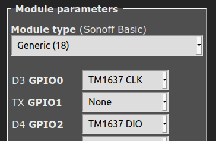
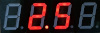
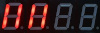

# TM1637, TM1638 and MAX7219 Seven-Segment Display

!!! info 
    This feature is included only in the _tasmota*-display.bin_" precompiled binary     


To use this feature (i.e., if you're not using _tasmota*-display.bin_ precompiled binary), you must [compile your build](Compile-your-build) after adding the following to `user_config_override.h`:
```
#ifndef USE_DISPLAY
#define USE_DISPLAY
#endif

#ifndef USE_DISPLAY_TM1637
#define USE_DISPLAY_TM1637
#endif
```
----  


| <center>TM1637</center>   | <center>TM1638</center>  | <center>MAX7219</center>  |
|---|---|---|
|&nbsp;&nbsp;&nbsp;&nbsp;&nbsp;&nbsp;&nbsp;&nbsp;&nbsp;   | &nbsp;&nbsp;&nbsp;&nbsp;&nbsp;&nbsp;&nbsp;   |    |

   


The **TM1637**, **TM1638** and **MAX7219** display modules are small (~ 10mm high digits) 7-segment, LED-based display units with 4/6 digits (TM1637), 8 digits and 8 digits (TM1638 and MAX7219) respectively. They use a two-wire (TM1637) or three-wire (TM1638 and MAX7219) I2C-like (but not exactly) protocol for communication with MCUs like the ESP8266 / ESP32 / Arduino etc., 

These modules are a great way to add a simple numeric display to any MCU project.  


## Features


The _Tasmota_ support for these modules can --

* display **Numbers** and **Floats** with control over _position_ and _leading zeros_.
* display basic **Text**, for example, sending the text `22.5^` will display:<br>
<br>
* display **Raw** segments.
* display **Level**, like a _bar graph_
* display  **Scrolling text**
* display a **Clock** in 12 hr and 24 hr format
* set *Brightness* (8 levels) and **Clear** the display.

!!! info 
    This driver does not support the buttons and LEDs on the *TM1638*   


## Configuration  


### Wiring


The **TM1637** module needs to be connected to two GPIO pins and a 3.3V-5V power supply.  


| TM1637   | ESP8266 based module |
|---|---|
|CLK   | GPIOx   |
|DIO   | GPIOy 
|VCC   | 3.3V (e.g., _ESP-01_) or 5V (e.g., _Wemos D1 Mini_)
|GND   | GND  


The **TM1638** module needs to be connected to three GPIO pins and a 5V power supply.  
<br>

| TM1638   | ESP8266 based module |
|---|---|
|CLK   | GPIOx   |
|DIO   | GPIOy 
|STB   | GPIOz 
|VCC   | 5V
|GND   | GND  


The **MAX7219** module needs to be connected to three GPIO pins and a 5V power supply.  
<br>

| MAX7219   | ESP8266 based module |
|---|---|
|CLK   | GPIOx   |
|DIN   | GPIOy 
|CS    | GPIOz 
|VCC   | 5V
|GND   | GND  


### Tasmota Settings


In _Tasmota_'s **Configuration -> Configure Module** page, assign:

For **TM1637**

1. `GPIOx` to `TM1637 CLK`
2. `GPIOy` to `TM1637 DIO`


For **TM1638**

1. `GPIOx` to `TM1638 CLK`
2. `GPIOy` to `TM1638 DIO`
3. `GPIOz` to `TM1638 STB`


For **MAX7219**

1. `GPIOx` to `MAX7219 CLK`
2. `GPIOy` to `MAX7219 DIN`
3. `GPIOz` to `MAX7219 CS`
<br>


For example, if x=0 and y=2, z=4 then the module configuration would look like the following:  
<br>
**TM1637**<br>

<br><br>
**TM1638**<br>

<br><br>
**MAX7219**<br>

<br>


### Initial Setup

THe power toggle button in webUI turns the display on or off. 

**DisplayModel:**  
Once the GPIO configuration is saved and the ESP8266 / ESP32 module restarts, set the Display Model to 15 using the command:  

`DisplayModel 15`
<br>

**DisplayWidth:**  
If you have a TM1637 with 6 digits, set the number of digits using the command:  

`DisplayWidth 6`
<br>

**DisplayType:**  
The 6-digit TM1637 has 2 known variants with different hardware wiring for the digit ordering.  
You can switch between these two variants with the following commands:  

`DisplayType 0`  - Use this for the Type 0 variant, with wiring similar to the TM1637 4-digit modules  
`DisplayType 1`  - Use this for the Type 1 variant, with a different wiring that causes the text **123456** to appear as **321654**
<br>

After the ESP8266/ESP32 module restarts again, the display module is ready to accept commands.

**DisplayModes:**  
[DisplayModes](Displays.md#displaymode-parameters) `0..3` are supported. The firmware default is `DisplayMode 1`.  

To use the Seven-Segment specific _Display-_ commands described below, set the `DisplayMode` to `0` with:  

`DisplayMode 0`
<br>


**DisplayDimmer:**  
The *brightness* of the display can be set using the `DisplayDimmer` command.  

`DisplayDimmer 0..100` maps the brightness value to 8 steps from `0..7`  

For a minimum brightness, make sure this value is at least about `13` 


### 7-Segment specific Commands

 The _Display-_ commands listed below can be used from the _Tasmota_ web-console, _MQTT_, and from Tasmota  [Rules](Rules.md)
<br>


## Commands and Usage


 Console/MQTT Commands    | Description                                             | values     |
---------------------|---------------------------------------------------------|------------|
  DisplayClear     | Clears the display  | 
 DisplayNumber     | Clears and then displays number without decimal. command e.g., "DisplayNumber 1234". <br> Control `leading zeros`, `length` and `position`. <br> `leading zeros` can be `1` or `0` (default),<br> `length` can be `1` to `NUM_DIGITS` (4 or 6), <br> `position` can be `0` (left-most) to `NUM_DIGITS` (right-most).  <br> Command example: `DisplayNumber 12, 1, 1, 3`  This will display:<br>  |    `num` [, `position`[, `leading_zeros`[, `length`]]]
 DisplayNumberNC | Display integer number as above, but without clearing first. e.g., "DisplayNumberNC 1234". Usage is same as above. | same as above
DisplayFloat | Clears and then displays float (with decimal point)  command e.g., "DisplayFloat 12.34". <br> Control `precision`, `length` and `position`. <br> `precision` can be `0` to `NUM_DIGITS` (default), <br> `length` can be `1` to `NUM_DIGITS` (4 or 6), <br> `position` can be `0` (left-most) to `NUM_DIGITS` (right-most).  <br> Command example: `DisplayFloat 2.48, 1, 1, 2`  This will display:<br>  | `num`[, `position`[, `precision`[, `length`]]]
DisplayFloatNC | Displays float (with decimal point) as above, but without clearing first. command e.g., "DisplayFloatNC 12.34" | same as above
DisplayRaw | Takes upto `NUM_DIGITS` comma-separated integers (0-255) and displays raw segments. <br> Each number represents a 7-segment digit. Each 8-bit number represents individual segments of a digit. <br> Segment a=1, b=2, c=4, d=8, e=16, f=32, g=64 and h (decimal point)=128.<br> To turn on all segments, the number would be 1+2+4+8+16+32+64+128 = 255<br> For example, the command `DisplayRaw 0, 2, 255, 255` would display:<br>  | `position`, `length`,  `num1` [, `num2`[, `num3`[, `num4`[, ...upto `NUM_DIGITS` numbers]]...]
DisplayText | Clears and then displays basic text.  Command e.g., `DisplayText a.b12` <br> Control `length` and `position` of the displayed text. <br> `length` can be `1` to `NUM_DIGITS` , <br> `position` can be `0` (left-most) to `NUM_DIGITS-1` (right-most) <br><br>  A caret(`^`) symbol in the text input is dispayed as the degrees(`°`) symbol. This is useful for displaying Temperature (or angle)! <br> For example, the command `DisplayText 22.5^` will display:<br>   | `text`[, `position`[, `length`]]
DisplayTextNC | Clears first, then displays text. Usage is same as above. | same as above
DisplayScrollText | Displays scrolling text, upto 50 characters. Command example: `DisplayScrollText tasmota is awesome`| text
DisplayScrollDelay | Sets the speed of text scroll. Smaller delay = faster scrolling. | 0 to 15
DisplayLevel | Display a horizontal bar graph. Command e.g., `DisplayLevel 50` will display:<br> <br> | 0 to 100
DisplayClock | Displays a clock. <br> `DisplayClock 1` displays a clock in 12-hour format. <br> `DisplayClock 2` displays a clock in 24-hour format. <br> `DisplayClock 0` turns off the clock and clears the display  | 1 or 2 or 0


## Usage in Rules

All the above commands can be used in Tasmota [Rules](https://tasmota.github.io/docs/Rules/), as usual. 

For example, a simple digital thermometer can be implemented by connecting a **DHT22** Temperature-Humidity Sensor and a **TM1637** to a **Wemos D1 Mini**, and writing a Rule like the following:

```haskell
Rule1
ON Tele-AM2301#Temperature DO DisplayText %value%^ ENDON
```

## TM1637 Images


  
The TM1637 4-digit module (front and back)  
<br><br><br><br>
  
TM1637 4-digit module with Wemos D1 Mini
