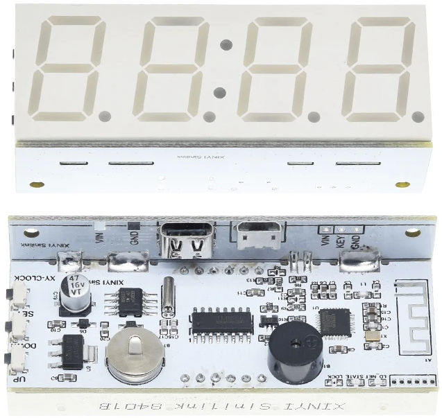
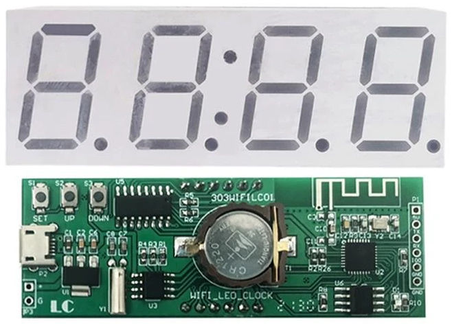
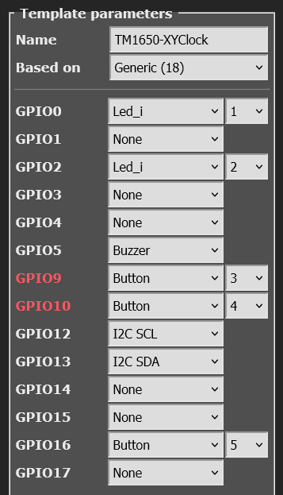

# TM1650 Seven-Segment Display

??? failure "This feature is not included in precompiled binaries"  

    When [compiling your build](Compile-your-build) add the following to `user_config_override.h`:
    ```c++
    #ifndef USE_I2C
    #define USE_I2C
    #endif

    #ifndef USE_DISPLAY
    #define USE_DISPLAY
    #endif
    #ifndef USE_DISPLAY_MODES1TO5
    #define USE_DISPLAY_MODES1TO5
    #endif
    #ifndef USE_DISPLAY_TM1650
    #define USE_DISPLAY_TM1650
    #endif

    // ONLY XY-Clock
    #ifndef USE_RTC_CHIPS 
    #define USE_RTC_CHIPS
    #endif
    #ifndef USE_DS3231
    #define USE_DS3231
    #endif

    ```

| TM1650 - XY-Clock | TM1650 - 303WiFiLC01 |
|:---:|:---:|
|&nbsp;&nbsp;&nbsp;&nbsp;&nbsp;&nbsp;&nbsp;&nbsp;&nbsp;   | &nbsp;&nbsp;&nbsp;&nbsp;&nbsp;&nbsp;&nbsp;   | 

The **TM1650** display modules are usually found in "cheap" Wifi LED clock. They manage 7-segment LED displays (~ 27 mm high) with 4 digits. They use two wire I2C protocol to communicate with MCU such as ESP8266/ESP32/Arduino etc.,  

## Features

The _Tasmota_ support for these modules can --

* display **Numbers** and **Floats** with control over _position_ and _leading zeros_.
* display basic **Text**, for example, sending the text `22.5^` will display:<br>
<br>
* display **Raw** segments.
* display **Level**, like a _bar graph_
* display  **Scrolling text**
* display a **Clock** in 12 hr and 24 hr format
* set *Brightness* (8 levels) and **Clear** the display.


## Configuration  


### Wiring


The **TM1650** module needs to be connected to I^2^C GPIO pins and a 3.3V-5V power supply.  


| TM1650   | ESP based module |
|---|---|
|SCL   | GPIOx   |
|SDA   | GPIOy 
|VCC   | 3.3V (e.g., _ESP-01_) or 5V (e.g., _Wemos D1 Mini_)
|GND   | GND  


### Tasmota Settings


In _Tasmota_'s **Configuration -> Configure Module** page, assign:

For **TM1650**

1. `GPIOx` to `I2C SCL`
2. `GPIOy` to `I2C SDA`

<br>


For example, with XY-Clock hardware, the module configuration would look like the following:  
<br>
**TM1650 - XY-Clock**<br>

<br>


### Initial Setup

The power toggle button in webUI turns the display on or off. However, if there are additional relays defined, resulting in multiple power toggle buttons in WebUI, display power will create and map to the last button. Thus, it is necessary to ensure that relays are numbered from 1, otherwise a conflict will occur with the display power.

In the console, turn ON the display with the command `Power 1`.

### DisplayModel

Once the GPIO configuration is saved and the ESP8266 / ESP32 module restarts, set the Display Model to 20 using the command:  

`DisplayModel 20`
<br>

### DisplayType

The 6-digit TM1637 has 2 known variants with different hardware wiring for the digit ordering.  
You can switch between these two variants with the following commands:  

`DisplayType 0`  - Use this for the Type 0 variant **XY-Clock**, with wiring is equal to datasheet  
`DisplayType 2`  - Use this for the Type 2 variant **303WifiLC01**, with a different wiring
<br>

After the ESP8266/ESP32 module restarts again, the display module is ready to accept commands.

### DisplayModes

[DisplayModes](Displays.md#displaymode) `0..3` are supported. The firmware default is `DisplayMode 1`.  

To use the Seven-Segment specific _Display-_ commands described below, set the `DisplayMode` to `0` with:  

`DisplayMode 0`
<br>


### DisplayDimmer
  
The *brightness* of the display can be set using the `DisplayDimmer` command.  

`DisplayDimmer 0..100` maps the brightness value to 8 steps from `0..7`  

For a minimum brightness, make sure this value is at least about `13` 

### 7-Segment specific Commands

 The _Display-_ commands listed below can be used from the _Tasmota_ web-console, _MQTT_, and from Tasmota  [Rules](Rules.md)
<br>

## Commands and Usage


 Console/MQTT Commands    | Description                                             | values     |
---------------------|---------------------------------------------------------|------------|
  DisplayClear     | Clears the display  | 
 DisplayNumber     | Clears and then displays number without decimal. command e.g., "DisplayNumber 1234". <br> Control `position`, `leading zeros`, and `length`. <br> `position` can be `0` (left-most) to `NUM_DIGITS-1` (right-most), <br> `leading zeros` can be `1` or `0` (default), <br> `length` can be `1` to `NUM_DIGITS` (4 or 6).  <br> Command example: `DisplayNumber 12, 1, 1, 3`  This will display:<br>  |    `num` [, `position`[, `leading_zeros`[, `length`]]]
 DisplayNumberNC | Display integer number as above, but without clearing first. e.g., "DisplayNumberNC 1234". Usage is same as above. | same as above
DisplayFloat | Clears and then displays float (with decimal point)  command e.g., "DisplayFloat 12.34". <br> Control `position`, `precision`, and `length`. <br> `position` can be `0` (left-most) to `NUM_DIGITS-1` (right-most), <br> `precision` can be `0` to `NUM_DIGITS` (default), <br> `length` can be `1` to `NUM_DIGITS` (4 or 6).  <br> Command example: `DisplayFloat 2.48, 1, 1, 2`  This will display:<br>  | `num`[, `position`[, `precision`[, `length`]]]
DisplayFloatNC | Displays float (with decimal point) as above, but without clearing first. command e.g., "DisplayFloatNC 12.34" | same as above
DisplayRaw | Takes up to `NUM_DIGITS` comma-separated integers (0-255) and displays raw segments. <br> Each number represents a 7-segment digit. Each 8-bit number represents individual segments of a digit. <br> Segment a=1, b=2, c=4, d=8, e=16, f=32, g=64 and h (decimal point)=128.<br> To turn on all segments, the number would be 1+2+4+8+16+32+64+128 = 255<br> For example, the command `DisplayRaw 0, 2, 255, 255` would display:<br>  | `position`, `length`,  `num1` [, `num2`[, `num3`[, `num4`[, ...up to `NUM_DIGITS` numbers]]...]
DisplayText | Clears and then displays basic text.  Command e.g., `DisplayText a.b12` <br> Control `length` and `position` of the displayed text. <br> `length` can be `1` to `NUM_DIGITS` , <br> `position` can be `0` (left-most) to `NUM_DIGITS-1` (right-most) <br><br>  A caret(`^`) symbol in the text input is displayed as the degrees(`°`) symbol. This is useful for displaying Temperature (or angle)! <br> For example, the command `DisplayText 22.5^` will display:<br>   | `text`[, `position`[, `length`]]
DisplayTextNC | Displays text without first clearing the display. Usage is same as above. | same as above
DisplayScrollText | Displays scrolling text, up to 50 characters. <br>If `num_iterations` is not specified, it scrolls indefinitely, until another *Display-* command is issued. Optionally, specifying `num_iterations` causes the scrolling to stop after the specified number of iterations.<br>Command examples: <br>`DisplayScrollText tasmota is awesome`   -- causes indefinite scrolling<br>`DisplayScrollText tasmota is awesome, 5`   -- causes scrolling to stop after 5 iterations| `text` [, `num_iterations`]
DisplayScrollDelay | Sets the speed of text scroll. Smaller delay = faster scrolling. | 0 to 15
DisplayLevel | Display a horizontal bar graph. Command e.g., `DisplayLevel 50` will display:<br> <br> | 0 to 100
DisplayClock | Displays a clock. <br> `DisplayClock 1` displays a clock in 12-hour format. <br> `DisplayClock 2` displays a clock in 24-hour format. <br> `DisplayClock 0` turns off the clock and clears the display  | 1 or 2 or 0


## Usage in Rules

All the above commands can be used in Tasmota [Rules](https://tasmota.github.io/docs/Rules/), as usual. 

For example, a simple digital thermometer can be implemented by connecting a **DHT22** Temperature-Humidity Sensor and a **TM1650** to a **Wemos D1 Mini**, and writing a Rule like the following:

```haskell
Rule1
ON Tele-AM2301#Temperature DO DisplayText %value%^ ENDON
```
