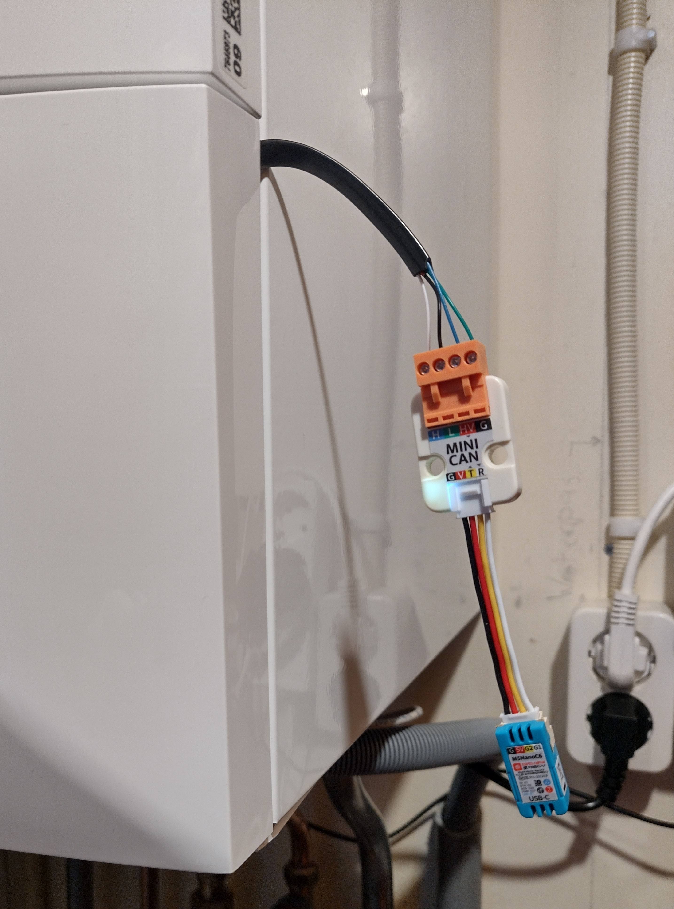
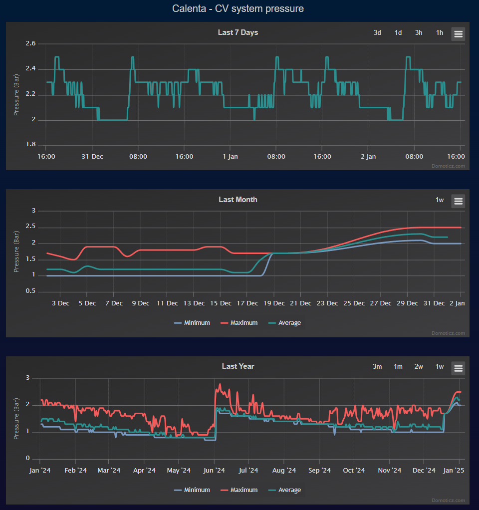

??? note "This ESP32 only feature is included in tasmota32 binaries"     

    When [compiling your build](Compile-your-build) add the following to `user_config_override.h`:
    ```arduino
    #ifndef USE_ESP32_TWAI
    #define USE_ESP32_TWAI  // Add support for TWAI/CAN interface (+7k code)
    #endif
    ```

## What is TWAI?

[Two-Wire Automotive Interface](https://https://docs.espressif.com/projects/esp-idf/en/stable/esp32/api-reference/peripherals/twai.html) (TWAI) or Controller Area Network (CAN) is a real-time serial communication protocol suited for automotive and industrial applications. It is compatible with ISO11898-1 Classical frames, thus can support Standard Frame Format (11-bit ID) and Extended Frame Format (29-bit ID).

The ESP32 series contains 1 to 3 TWAI controller(s) that can be configured to communicate on a TWAI bus via an external transceiver.

Platform|TWAI busses
:-|:-:
ESP8266|0
ESP32 (ESP32solo1)|1
ESP32-S2|1
ESP32-S3|1
ESP32-C2 (ESP8684)|0
ESP32-C3 (ESP8685)|1
ESP32-C5|2
ESP32-C6|2
ESP32-C61|2
ESP32-H2|1
ESP32-P4|3

??? warning "The TWAI controller is not compatible with ISO11898-1 FD Format frames, and will interpret such frames as errors."

## Hardware needed

TWAI needs only 2 GPIOs connected to an external tranceiver like [M5 Unit CAN](https://docs.m5stack.com/en/unit/can) with isolation or [M5 Mini CAN Unit](https://docs.m5stack.com/en/unit/Unit-Mini%20CAN) without isolation.


## Configuration

Parameters to configure the driver need to be entered using a berry script. See examples below.

The following table shows the supported Interface Speed.

Code|Speed
---|:---
0|25Kbit/s
1|50Kbit/s
2|100Kbit/s 
3|125Kbit/s
4|250Kbit/s
5|500Kbit/s
6|800Kbit/s
7|1Mbit/s

The following table shows the supported Operating Modes.

Code|Mode
---|:---
0|Normal Mode
1|No Ack Mode
2|Listen Only Mode

## Command

Without a berry configuration and decoding script the driver is configured for 100Kbit/s and Normal Mode. The received data is output as logging messages in debug log level 3.

The amount of CAN data can be very high AND decoding this data is specific to every implementation. Therefor it was decided to implement both functions as a berry script. See below for examples.

The driver has one command for sending data.

Command|Parameters
:---|:---
TwaiSend<bus\><a class="cmnd" id="dalisend"></a>|Send zero or up to eigth data bytes to an 11-bit or 29-bit identifier.<br><br>`<id>` = Send no data to identifier where identifier is an 11-bit id if bit 31 is 0, ex. `0x284`. If bit 31 is 1 then a 29-bit id is expected, ex. `0x80001234`.<br>`<id>,<byte1>[..,<byte8>]` = Send one or more data bytes.<br>`{"ID":0x284,"DATA":[0x44,3,0x1E,0xFF]}` = Alternative using JSON sending four data bytes.

## Example

### Basic configuration

A minimal berry script should look like this:
```
class twai_cls
  var twai_speed, twai_mode    # (int, int)

  def init()
    self.twai_speed = 4        # 0 = 25K, 1 = 50K, 2 = 100K, 3 = 125K, 4 = 250K, 5 = 500K, 6 = 800K, 7 = 1Mbits
    self.twai_mode = 2         # 0 = TWAI_MODE_NORMAL, 1 = TWAI_MODE_NO_ACK, 2 = TWAI_MODE_LISTEN_ONLY
  end

  #----------------------------------------------------------------------------------------------
  Allow TWAI driver configuration on restart (if this file is installed by preinit.be)
  ----------------------------------------------------------------------------------------------#
  def config(bus)                                    # This function name (config) is called by the TWAI driver!
    return self.twai_mode << 3 | self.twai_speed     # Initial configure TWAI driver
  end

  #----------------------------------------------------------------------------------------------
  This example decodes nothing but allows for the driver to show message logging in log level 4
  ----------------------------------------------------------------------------------------------#
  def decode(param, ident, data1, data2)             # This function name (decode) is called by the TWAI driver!
    var bus = param & 0xF                            # Bus number (1..3)
    var len = param >> 4 & 0xF                       # Number of data bytes (0..8)
    var extended = ident >> 31 & 0x1                 # Extended identifier flag (0..1)
    var id = ident & 0x1fffffff

  end
end

twai = twai_cls()                                    # This class name (twai) is used by the TWAI driver!
tasmota.add_driver(twai)
```
Save the file as `twai_minimal.be` and add a line `load('twai_minimal.be')` to file `preinit.be`. This will execute the file at restart and prepare the driver for 250Kbit/s and Listen Only Mode.

### Remeha Calenta Ace sniffer for Domoticz

 </img>
The Remeha boiler provides a RJ12 connector for a Service Tool. The communication between the boiler and the Service Tool takes place using CAN-bus in 11-bit identifier mode. A dongle consisting of a <b>M5 Mini CAN Unit</b> and a <b>M5Atom</b> (ESP32/ESP32S3) or <b>M5Nano</b> (ESP32C6) with Tasmota can be used as sniffer sending important data to a Home Automation tool like Domoticz.

??? note "To make the M5 Mini CAN Unit compliant with the CAN-bus standard you'll need to remove the internal 120 Ohm resistor as the Remeha L-Bus is already terminated with two 120 Ohm resistors."

??? warning "When using the M5 Mini CAN Unit DO NOT CONNECT ANY USB CABLE TO THE M5ATOM OR M5NANO. It likely blows (one of) the ESD diodes (as mine did). If USB connection is needed use M5 Unit CAN."

As an alternative you can use the <b>M5 Unit CAN</b> which has no internal 120 Ohm termination resistor. In that case you'll need to power the M5Atom or M5Nano externally with a USB power supply as the CAN-bus is isolated.

The RJ12 6-pin usage as shown from the front of the boiler

```
             Pin   1    2    3    4    5    6
      Remeha Ace  24V   nc  Gnd   nc   Tx   Rx
M5 Mini CAN Unit   HV        G         L    H
     M5 Unit CAN             G         L    H
```

#### Berry class

This berry class supports a Remeha Calenta Ace boiler sending some data to Domoticz home automation for logging. 
```
class twai_cls
  var active, pressure_next                          # (bool, bool)
  var twai_speed, twai_mode                          # (int, int)
  var am012_status, am014_substatus, am024_power     # (int, int, int)
  var dz_am012_status, dz_am014_substatus            # (int, int)
  var pressure, setpoint, flow_temp                  # (float, float, float)
  var dz_pressure, dz_flow_temp                      # (float, float)

  def init()
    self.twai_speed = 7        # 0 = 25K, 1 = 50K, 2 = 100K, 3 = 125K, 4 = 250K, 5 = 500K, 6 = 800K, 7 = 1Mbits
    self.twai_mode = 2         # 0 = TWAI_MODE_NORMAL, 1 = TWAI_MODE_NO_ACK, 2 = TWAI_MODE_LISTEN_ONLY
    self.active = 0
    self.am012_status = 0
    self.am014_substatus = 0
    self.dz_am012_status = 0
    self.dz_am014_substatus = 0
    self.am024_power = 0
    self.pressure_next = 0
    self.pressure = 0
    self.dz_pressure = 0
    self.setpoint = 0
    self.flow_temp = 0
    self.dz_flow_temp = 0
  end

  #----------------------------------------------------------------------------------------------
  Allow TWAI driver configuration on restart (if this file is installed by preinit.be)
  ----------------------------------------------------------------------------------------------#
  def config(bus)
#    if bus != 1 return nil end                       # Exit if not my bus
    return self.twai_mode << 3 | self.twai_speed     # Initial configure TWAI driver
  end

  #----------------------------------------------------------------------------------------------
  This example decodes Remeha Calenta Ace CAN-bus messages and sends it to predefined Domoticz idx
  ----------------------------------------------------------------------------------------------#
  def decode(param, ident, data1, data2)
    var bus = param & 0xF                            # Bus number (1..3)
#    if bus != 1 return nil end                       # Exit if not my bus
    var len = param >> 4 & 0xF                       # Number of data bytes (0..8)
    var extended = ident >> 31 & 0x1                 # Extended identifier flag (0..1)
    if extended == 1 return nil end                  # Remeha uses 11-bit Standard Frame Format
    var id = ident & 0x1fffffff
    if id == 0x076                                   # Incremental counter from 0 to 255
#      tasmota.log(f"RMH: 0x{id:03x} Count {data1}", 3)
#    elif id == 0x080                                 # Heartbeat every second
    elif id == 0x100                                 # Date and Time
      var epoch = 441763200 + (data2 * 24 * 60 * 60) + (data1 / 1000)
#      tasmota.log(f"RMH: 0x{id:03x} Time {tasmota.time_str(epoch)}", 3)
    elif id == 0x1C1                                 # Many different data1/2
      if data1 & 0x00ffffff == 0x503f41              # Next time it's pressure
        self.pressure_next = 1
      elif self.pressure_next == 1
        self.pressure = (data2 & 0xff00)/2560.0      # This must be pressure
        self.pressure_next = 0
      end
    elif id == 0x382
      self.am024_power = data1 & 0xff                # Relative power
      self.setpoint = (data1 & 0xffff00)/25600.0     # Setpoint
#      tasmota.log(f"RMH: 0x{id:03x} Busy {self.am024_power}%, Setpoint {self.setpoint}", 3)
    elif id == 0x282
      self.flow_temp = (data1 & 0xffff00)/25600.0
#      tasmota.log(f"RMH: 0x{id:03x} DHW temp {self.flow_temp}", 3)
    elif id == 0x481                                 # Status information
      self.am012_status = data1 & 0xff
      self.am014_substatus = (data1 & 0xff00)/256
    else      
      return
    end
    self.active = 1                                  # At least one valid decode
  end

  #----------------------------------------------------------------------------------------------
  Add sensor value to teleperiod
  ----------------------------------------------------------------------------------------------#
  def json_append()
    if !self.active return nil end                   # Exit if never decoded something
    import string
    var msg = string.format(",\"Calenta\":{\"AM012\":%i,\"AM014\":%i,\"Pressure\":%.1f,\"Setpoint\":%.1f,\"Flow\":%.1f}",
                             self.am012_status, self.am014_substatus, self.pressure, self.setpoint, self.flow_temp)
    tasmota.response_append(msg)
  end

  #----------------------------------------------------------------------------------------------
  Perform action just after teleperiod (not used)
  ----------------------------------------------------------------------------------------------#
#  def after_teleperiod() 
  #----------------------------------------------------------------------------------------------
  Perform action every second

  As many datagrams can occur sending at teleperiod time takes too long
  Also only send if changed to reduce TWAI wait time 
  ----------------------------------------------------------------------------------------------#
  def every_second()
    if self.dz_pressure != self.pressure
      tasmota.cmd('_DzSend1 523,' .. self.pressure)   # Send pressure to Domoticz
    end
    self.dz_pressure = self.pressure

    if self.dz_flow_temp != self.flow_temp
      tasmota.cmd('_DzSend1 526,' .. self.flow_temp)  # Send flow temp to Domoticz
    end
    self.dz_flow_temp = self.flow_temp

    if self.dz_am012_status != self.am012_status
      tasmota.cmd('_DzSend1 536,' .. self.am012_status)  # Send status to Domoticz
    end
    self.dz_am012_status = self.am012_status

    if self.dz_am014_substatus != self.am014_substatus
      tasmota.cmd('_DzSend1 537,' .. self.am014_substatus)  # Send substatus to Domoticz
    end
    self.dz_am014_substatus = self.am014_substatus
  end

  #----------------------------------------------------------------------------------------------
  Display sensor value in the web UI
  ----------------------------------------------------------------------------------------------#
  def web_sensor()
    if !self.active return nil end                   # Exit if never decoded something
    import string
    var msg = string.format("{s}AM012/AM014 State{m}%i/%i{e}"..
                            "{s}AM024 Relative Power{m}%i %%{e}"..
                            "{s}Pressure{m}%.1f{e}"..
                            "{s}Setpoint Temperature{m}%.1f{e}"..
                            "{s}Flow Temperature{m}%.1f{e}",
                            self.am012_status, self.am014_substatus, self.am024_power, self.pressure, self.setpoint, self.flow_temp)
    tasmota.web_send_decimal(msg)
  end
end

twai = twai_cls()
tasmota.add_driver(twai)
```
Save the file as `calenta.be` and add a line `load('calenta.be')` to file `preinit.be`. This will execute the file a restart and prepare the driver for 1Mbit/s and Listen Only Mode.

#### Result of monitoring boiler pressure over time

 </img>

