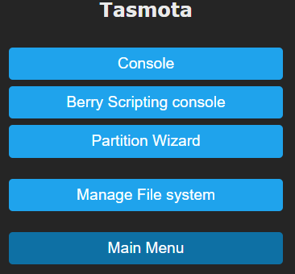

# Tasmota Application Files 

!!! info "Easily import any configuration or script using the `.tapp` file extension :material-cpu-32-bit:"

Any file with `.tapp` (Tasmota Application) extension will be considered as an uncompressed ZIP, and if it contains a sub-file `autoexec.be` it will be executed. In parallel `tasmota.wd` (working dir) contains the archive tapp prefix to easily load other assets from the same archive.

!!! example 
    `heating.tapp` contains: `autoexec.be` and `html.json`. The sub-file `html.json` can be opened with `f = open(tasmota.wd + "html.json", "r")`

Berry allow imports from files inside a Tasmota App (.tapp file). Also enabled `sys` module.

Here is the code you should add in your `autoexec.be` inside tapp file:

```berry
import sys
var wd = tasmota.wd
if size(wd) sys.path().push(wd) end

# [...] you can import files from within the archive

if size(wd) sys.path().pop() end
```

## TAPP's

### LCD/OLED Anti Screen Burn

* copy [Antiburn.tapp](https://raw.githubusercontent.com/arendst/Tasmota/development/tasmota/berry/modules/Antiburn.tapp) to file system
* Either issue Tasmota command `Antiburn` or programmatically using `lv.antiburn()` in Berry

The LVGL screen will change from black to red to green to blue to white each second for 30 seconds. The anti-burn cleaning can be cancelled by touching the screen or it will complete after 30 seconds. Once complete the previous screen will be reloaded.

### Partition Management

[Partition Wizard](https://raw.githubusercontent.com/arendst/Tasmota/development/tasmota/berry/modules/Partition_Wizard.tapp)

[Partition Manager](https://raw.githubusercontent.com/arendst/Tasmota/development/tasmota/berry/modules/Partition_Manager.tapp)

To run either of these apps, simply upload the .tapp file to the filesystem and reboot the board.  After doing so, the app will appear on the consoles page in the GUI.



### Display Calibration

Tasmota Application useful for Touch Screen calibration (resistive touchscreens only). This application guides you through simple steps and generates automatically the required settings in `display.ini` (the ':M' line).

1. First download [`DisplayCalibrate.tapp`](https://raw.githubusercontent.com/arendst/Tasmota/development/tasmota/berry/modules/DisplayCalibrate.tapp) application and upload it in the file system, and restart.

2. Make sure you are in orientation `DisplayRotate 0`

3. In the console, type the command `DisplayCalibrate`

You will see the following screens. Click on all 4 crosses near corners.


Note: measures are taken every 50 ms and are averaged, and requires at least 3 measures (150ms).

If everything went well, you will see the following screen. After reboot, your touchscreen is ready and calibrate.


If the geometry is wrong, you will see the following screen and no change is done to `display.ini`


