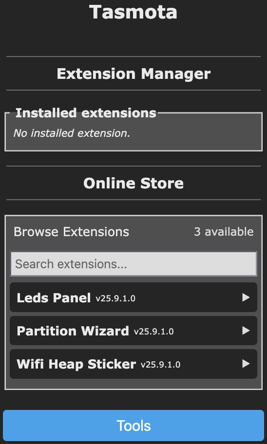
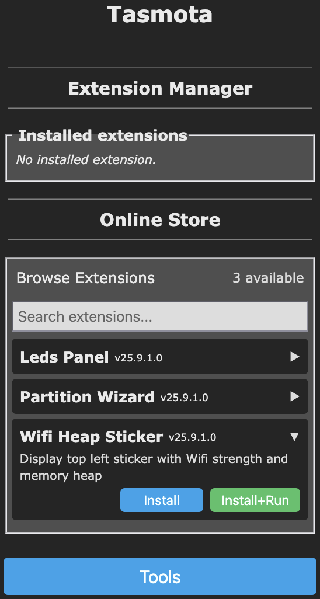
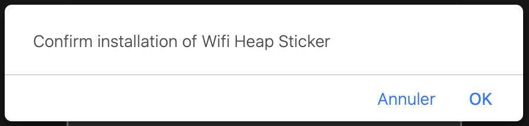
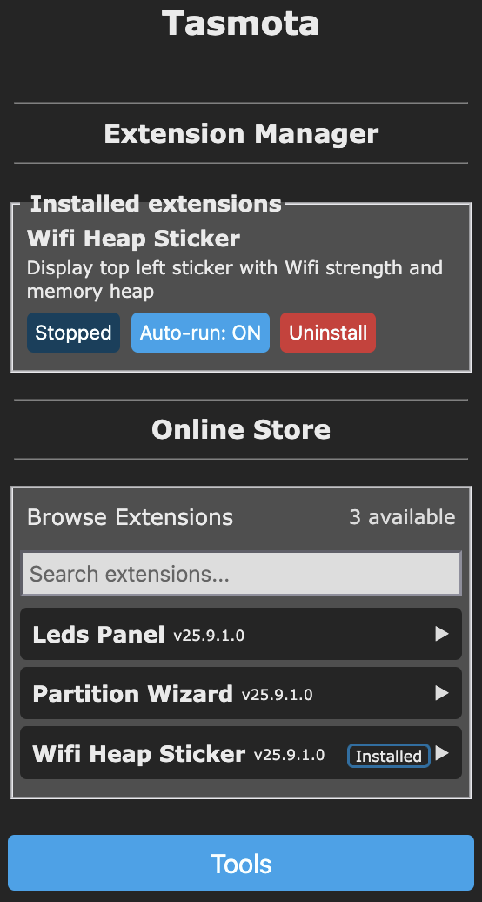
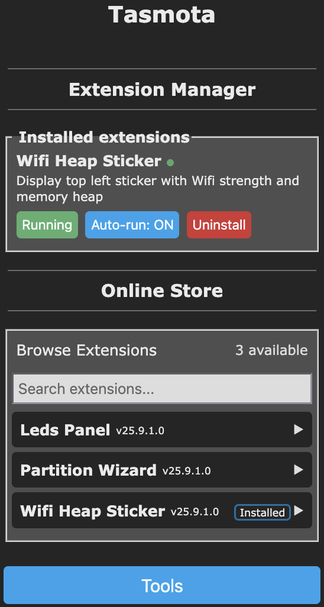

# Tasmota Extension 

!!! info "An extensible way to load and unload extensions dynamically :material-cpu-32-bit:"

Tasmota Extension is a new option for all ESP32\<x\> variants. It provides an online "Extension Store", similar to App Stores, so you can install and uninstall extension at will. Once installed, each Extension can be started and stopped (hence freeing memory) without rebooting; or configured at auto-start at boot.

Extensions includes features like:

- Partition Wizard
- Display Calibration for resistive touchscreens
- WebUI mirroring of Led Strips or LVGL/HASPmota
- enhanced display in tag bar (upper line in WebUI)

## Quickstart

"**Extension Manager**" is in the "**Tools**" menu. When you first click on it, you see an empty
list of installed extensions, followed by the list of extensions available in the online store:

{ width="300" }

Then click on "**Wifi Heap Sticker**" in the Online Store to show the details and actions:

{ width="300" }

Then click on "**Install**" button, and confirm:

{ width="350" }

The page refreshes itself and shows the list of installed extensions:

{ width="300" }

The "Wifi Heap Sticker" extensions is installed, configured as Auto-Run but not yet running.
Click on "**Stopped**" to run it immediately:

{ width="300" }

You may go back to the main page to see the Ticker showing on the top left corner:

{ width="300" }

### How it works

Tasmota Extension relies on the [Berry scripting language](Berry.md) and on [Tasmota Application](Tasmota-Application.md) `.tapp` files. Each `.tapp` includes all the necessary resources for the extension. Once installed, extensions are copied in the hidden `/.extensions/` folder.

By default, all extensions present in the `/.extensions/` folder are run at boot. You can switch off autorun when you rename the file with the `.tapp_` file suffix (add a trailing underscore); this is handled automatically via the WebUI.


## Creating Extensions (for developers)

The section below is intended for extension creators who want to package their code into a new extension and possibly publish them into the online store.

Extension are regular `.tapp` files with some specificities:

- they contain a `manifest.json` file with mandatory fields
- they contain an `autoexec.be` file with specificities
- they must guarantee that all resources are freed when `unload()` is called (this is probably the most delicate step)

### `manifest.json`

**Note**: All version numbers are published as 32 bits integers in the format `'0xAABBCCDD'` where the human readable is `vA.B.C.D` with decimal numbers. For example:

- `0x19090100` converts to `v25.9.1.0` - referred as the date version meaning it was released in 2025-Sep-1
- `0x0E060001` converts to `v14.6.0.1` - refers as classical version like used in Tasmota firmware version
- you can choose whatever numbering scheme you want as long as the numbers increase when converted to signed 32 bit integers.

Extensions must include a mandatory `manifest.json` file with the mandatory and optional fields:

Field||details
:---|:---|:---
name|mandatory|the display name of the extension, keep it very short
version|mandatory|the version of the extension using the 32-bit integer format (see above)
description|mandatory|a longer description of what the extension is doing
author|optional|name of the author and/or maintainer
min_tasmota|optional|the minimum version of Tasmota required to run this extension; older Tasmota version will not be able to install it

Full example of `manifest.json`:

```json
{
  "name": "Wifi Memory Sticker",
  "version": "0x19090100",
  "description": "Display top left sticker with Wifi strength and memory heap.",
  "author": "Stephan Hadinger",
  "min_tasmota": "0x0F000100"
}
```

### `autoexec.be`

Extensions must follow some very strict rules for `autoexec.be` that must have the following structure:

```berry
do
  import introspect
  var my_ext = introspect.module('<main_file>', true)     # load module but don't cache
  tasmota.add_extension(my_ext)
end
```

Here are the details:

- the whole statement is enclosed in `do ... end` to avoid having `my_ext` polluting the global namespace. `do ... end` creates a local scope.
- `introspect.module('<main_file>', true)`: this is equivalent to `import <main_file>` except it does not keep the loaded module into cache, which allows to eventually unload the entire code
- `tasmota.add_extension(my_ext)`: registers the Berry driver as an extension. Tasmota will call the `unload()` method of the driver to remove it from memory

Example for Leds Panel:

```berry
do                          # embed in `do` so we don't add anything to global namespace
  import introspect
  var wifi_memory_sticker = introspect.module('wifi_memory_sticker', true)     # load module 'wifi_memory_sticker.be' but don't cache
  tasmota.add_extension(wifi_memory_sticker)
end
```

### Berry driver

A Tasmota extension is in essence a Berry driver with an `unload()` method.

The tricky part is that when Tasmota calls `unload()` on the driver, it must ensure the following:

- unregister itself with `tasmota.remove_driver(self)` - this is a safeguard although the driver will be deregistered anyways
- free any resource allocated, for example close any file, port or network connection
- clear any global variable referring to code or data of the driver. Optionally deregister any global variable with `global.undef()`

You need to deeply test that all references to code and data are cleared. Sometimes reference can hide in hard to find places. The process is very simple: run `tasmota.gc()` without the extension, run `tasmota.gc()` after running the extension, finally unload the extension and run `tasmota.gc()` again; if you don't fall back to a similar value then you need to investigate.

Here is an example of a minimal Tasmota Extension:

```berry
#######################################################################
# Minimal Tasmota Extension

class Minimal_Tasmota_Extension

  # init - constructor
  def init()
    tasmota.add_driver(self)
  end

  # called when the extension is unloaded from memory
  def unload()
    tasmota.remove_driver(self)
  end

  # [...] implement the logic here
end

return Minimal_Tasmota_Extension()    # return an instance of the driver
```

## Publishing Extensions to this Repository

To publish a new extension to this repository and make it available in the online store, follow these steps:

### 1. Prepare Your Extension Files

Create a new folder in the `raw/` directory with your extension name (use underscores instead of spaces). Your extension must include these required files:

- `manifest.json` - Extension metadata
- `autoexec.be` - Extension loader script  
- `<your_extension>.be` - Main extension code (Berry script)

### 2. Create the manifest.json

Your `manifest.json` must include these mandatory fields:

```json
{
  "name": "Your Extension Name",
  "version": "0x19090100",
  "description": "Brief description of what your extension does",
  "author": "Your Name",
  "min_tasmota": "0x0E060001"
}
```

**Version Format**: Use 32-bit integer format `0xAABBCCDD` where human readable is `vA.B.C.D`:

- `0x19090100` = v25.9.1.0 (date-based: 2025-Sep-1)
- `0x0E060001` = v14.6.0.1 (semantic versioning)

### 3. Create the autoexec.be

Your `autoexec.be` must follow this exact structure:

```berry
do
  import introspect
  var your_extension = introspect.module('your_extension_file', true)
  tasmota.add_extension(your_extension)
end
```

Replace `your_extension_file` with the name of your main Berry script (without `.be` extension).

### 4. Directory Structure Example

```
raw/
└── Your_Extension_Name/
    ├── manifest.json
    ├── autoexec.be
    └── your_extension.be
```

### 5. Build and Test

The repository includes an automated build system:

1. **Local Testing**: Run `python3 gen.py` to build your extension into a `.tapp` file
2. **Validation**: The script will validate your `manifest.json` and check for required files
3. **Output**: Generated `.tapp` files appear in `extensions/tapp/` directory

### 6. Submit Your Extension

1. Fork this repository
2. Add your extension folder to the `raw/` directory
3. Test locally with `python3 gen.py`
4. Copy manually the `.tapp` file in the `/.extensions/` directory on your Tasmota device (click on "Show hidden files" to show the hidden directory)
5. Create a pull request with:

   - Clear description of your extension
   - Screenshots if applicable
   - Testing notes

### 7. Automated Processing

Once merged, GitHub Actions will automatically:

- Build your extension into a `.tapp` file
- Update the `extensions.jsonl` manifest
- Make your extension available in the online store
