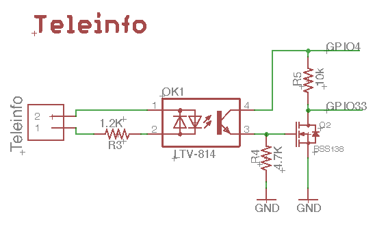
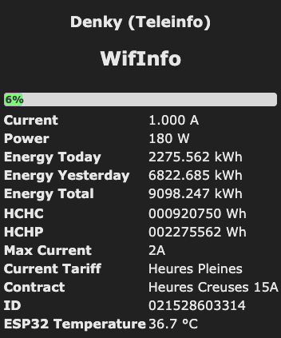
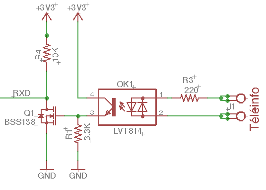
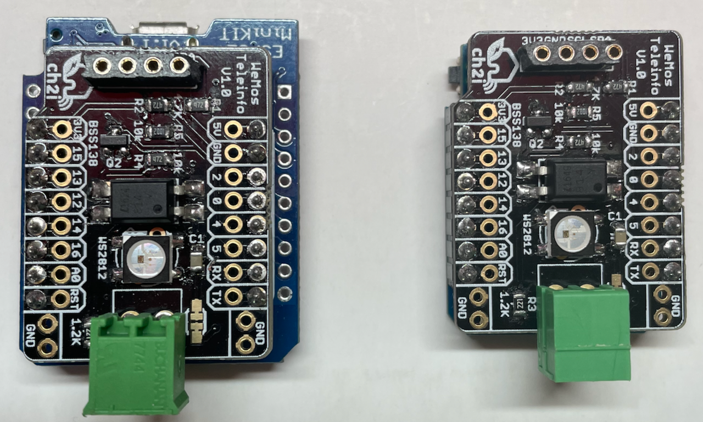
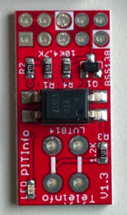

!!! failure "This feature is not included in precompiled binaries."

See below how to build you own Tasmota with Teleinfo enabled.

## Overview

Teleinfo is an Tasmota ENERGY driver for energy meters installed by French national electricity 
grid manager Enedis in all households. Teleinfo driver works with either legacy meters or the new
Linky meters. It is based on Charles Hallard's LibTeleinfo.

Teleinfo driver features:

* Support for Legacy mode (mode _Historique_ at 1200 baud) or Standard mode (9600 baud)
* Extract fields to feed Tasmota standard ENERGY module allowing Tasmota to report standard 
SENSOR.ENERGY messages and all related features (PowerDelta, margins, ...)
* Publish raw Teleinfo frame to MQTT for processing by the backend 

Support in french is available on Charles Hallard [forums](https://community.ch2i.eu/topic/676/tasmota).

## Compiling with support for Teleinfo

As the feature is not included by default, you must [compile your build](Compile-your-build).

To enable Teleinfo, add the following line in your `user_config_override.h` and compile `tasmota` or `tasmota32`. 
```
#define USE_TELEINFO
```

But as I'm testing lot of boards, my preference goes to add my custom boards section into the file `platformio_tasmota_cenv.ini`


For example on ESP8266 board with teleinfo and I2C display to display Energy data
```ini
[env:tasmota-tic-display]
extends                     = env:tasmota
platform_packages           = ${common.platform_packages}
build_unflags               = ${common.build_unflags}
build_flags                 = ${common.build_flags}
                             -DUSE_TELEINFO
                             -DUSE_DISPLAY
```

## Configure GPIOs for Teleinfo

### Serial reception

Once you have flashed Tasmota with the support for Teleinfo, you need to configure the proper GPIO
to receive the Teleinfo serial data with "TInfo RX"

On ESP8266, suitable pins are

* Standard UART0 RX pin on GPIO3 
* Alternate UART0 RX pin on GPIO13 (D7) 

On ESP32, most of the pins can be used since uart can be mapped on almost all pins.

On Denky boards it's connected to GPIO33 and on new DenkyD4 it's on GPIO8.

### Optional enable pin

An optional Enable GPIO can be configured as "TInfo EN". Any GPIO output can be used for that purpose. 
Enable pin is for low power future use and avoid to have any consumption when there is nothing to do.

For example schematic on custom Denky board (ESP32) is as follow



!!! warning "Resistors values R3 and R4 need to be changed to work with `standard` and `historique`. New official values for R3 is 220ohm and R4 is 3.3Kohm."

As you can see GPIO33 is used for RX and GPIO4 for Enable (need set to 1 to be able to receive data) 

Setup in this case is 

* Enable pin on GPIO4 
* RX pin on GPIO33 

Another example on ESP8266 could be D5/GPIO14:


After selecting the GPIOs, click on "SAVE" and Tasmota will reboot.

## Configuring Teleinfo

You can customize Teleinfo with the command `EnergyConfig <command> <parameter>`. The list of
supported commands and parameters are:

Command|Parameters
:---:|:---
 |Without any command and parameter, displays the current active configuration.
Historique|Set Teleinfo in legacy (_historique_) mode at 1200 baud.
Standard|Set Teleinfo in standard mode at 9600 baud.
NoRaw|Disable sending of raw frame (see below).
Full|Enable sending of all frames in raw mode.
Changed|Enable sending raw frames only when data has changed.
Skip _n_|Skips _n_ frames before sending raw frame.
Limit|Limit raw frames to values subject fo fast change (Power, Current, ...)

Changing mode from historique to standard and vice-versa will restart tamota.

### Check current configuration

First thing is to see how teleinfo is configured, for this you need to use `EnergyConfig` command from console

```
17:24:56.758 CMD: EnergyConfig
17:24:56.766 TIC: Settings Mode:historique, RX:GPIO23, EN:None, Raw:noraw, Skip:0, Limit:0
17:24:56.783 MQT: emoncms/ch2i/factory/denky_D6C0C0/stat/RESULT = {"EnergyConfig":"Done"}
```

In this case we can see we are in historique mode, RX data is coming on GPIO32 (it's an ESP32) and Enable Pin is not used.
No MQTT raw frame will be sent (noraw) on teleinfo frame reception, so keeping default config of telemetry.

## Energy from Teleinfo

If correct mode and GPIO configuration are set, you'll be able to see on main tasmota screen something like that 



It's happening only as soon as tasmota was able to read one valid frame from Teleinfo.

Data received from teleinfo is used by tasmota in real time to display information but also to calculate daily energy consumption. Of course as Teleinfo is returning lot of data (such as kWh indexes) all interesting information is displayed on the Web interface.
Since we know (because it's on teleinfo frame) the current contract we can display bargraph of charge (in %). This can help to see when main house smartmeter will shut down due to over consumption (for example)


### Default data

If configuration is left by default (and if you have configured MQTT of course) you will receive a frame each time telemtry happens (menu **configuration -> configure logging -> telemetry period**) which is by default every 5 minutes.

You can check on console, the frame received is sent every 5 minutes under `SENSOR` topic as a JSON string. This frame as all default tasmota fields and also a object ENERGY related to tasmota Energy module.

```
17:28:45.907 MQT: emoncms/ch2i/factory/denky_D6C0C0/tele/SENSOR = {"Time":"2021-10-26T17:28:45","ENERGY":{"TotalStartTime":"2021-10-25T15:22:04","Total":9098.245,"Yesterday":6822.685,"Today":2275.560,"Period": 9,"Power":170,"Current":1.000,"Load":6},"TIC":{"ADCO":"021528603314","OPTARIF":"HC..","ISOUSC":15,"HCHC":920750,"HCHP":2275560,"PTEC":"HP..","IINST":1,"IMAX":2,"PAPP":170,"HHPHC":"A","MOTDETAT":0},"ESP32":{"Temperature":36.1},"TempUnit":"C"}
17:33:45.906 MQT: emoncms/ch2i/factory/denky_D6C0C0/tele/SENSOR = {"Time":"2021-10-26T17:33:45","ENERGY":{"TotalStartTime":"2021-10-25T15:22:04","Total":9098.255,"Yesterday":6822.685,"Today":2275.570,"Period":10,"Power":190,"Current":1.000,"Load":6},"TIC":{"ADCO":"021528603314","OPTARIF":"HC..","ISOUSC":15,"HCHC":920750,"HCHP":2275570,"PTEC":"HP..","IINST":1,"IMAX":2,"PAPP":190,"HHPHC":"A","MOTDETAT":0},"ESP32":{"Temperature":36.1},"TempUnit":"C"}
17:38:45.905 MQT: emoncms/ch2i/factory/denky_D6C0C0/tele/SENSOR = {"Time":"2021-10-26T17:38:45","ENERGY":{"TotalStartTime":"2021-10-25T15:22:04","Total":9098.265,"Yesterday":6822.685,"Today":2275.579,"Period": 9,"Power":170,"Current":1.000,"Load":6},"TIC":{"ADCO":"021528603314","OPTARIF":"HC..","ISOUSC":15,"HCHC":920750,"HCHP":2275579,"PTEC":"HP..","IINST":1,"IMAX":2,"PAPP":170,"HHPHC":"A","MOTDETAT":0},"ESP32":{"Temperature":36.7},"TempUnit":"C"}
```

But in our case we have also a TIC object which contains all the frame received on teleinfo frame (last reveived value), for example in the frame above the TIC object is the following.

```json
{
  "TIC":{
    "ADCO":"021528603314",
    "OPTARIF":"HC..",
    "ISOUSC":15,
    "HCHC":920750,
    "HCHP":2275579,
    "PTEC":"HP..",
    "IINST":1,
    "IMAX":2,
    "PAPP":170,
    "HHPHC":"A",
    "MOTDETAT":0
  }
}
```


## Sending data to other 

Teleinfo is a very powerfull tool to monitor house energy consumption that many of you may need to send theese date to backend for other treatment. For example receiving power value every 5 minutes may be an issue to real time monitoring house consuption, this is why we introduced option to send data in real time. 

Best would be sending full received frame to MQTT for example, let's do that.

### Raw Frame going outside (MQTT)

To enable real time raw teleinfo frame to be sent to MQTT you need to use `EnergyConfig Full` command from console

```
17:57:04.579 TIC: Raw to 'full'
17:57:04.594 MQT: emoncms/ch2i/factory/denky_D6C0C0/stat/RESULT = {"EnergyConfig":"Done"}
17:57:05.038 MQT: emoncms/ch2i/factory/denky_D6C0C0/tele/SENSOR = {"TIC":{"ADCO":"021528603314","OPTARIF":"HC..","ISOUSC":15,"HCHC":920750,"HCHP":2275613,"PTEC":"HP..","IINST":1,"IMAX":2,"PAPP":180,"HHPHC":"A","MOTDETAT":0}}
17:57:06.693 MQT: emoncms/ch2i/factory/denky_D6C0C0/tele/SENSOR = {"TIC":{"ADCO":"021528603314","OPTARIF":"HC..","ISOUSC":15,"HCHC":920750,"HCHP":2275613,"PTEC":"HP..","IINST":1,"IMAX":2,"PAPP":180,"HHPHC":"A","MOTDETAT":0}}
17:57:08.183 MQT: emoncms/ch2i/factory/denky_D6C0C0/tele/SENSOR = {"TIC":{"ADCO":"021528603314","OPTARIF":"HC..","ISOUSC":15,"HCHC":920750,"HCHP":2275614,"PTEC":"HP..","IINST":1,"IMAX":2,"PAPP":170,"HHPHC":"A","MOTDETAT":0}}
17:57:09.684 MQT: emoncms/ch2i/factory/denky_D6C0C0/tele/SENSOR = {"TIC":{"ADCO":"021528603314","OPTARIF":"HC..","ISOUSC":15,"HCHC":920750,"HCHP":2275614,"PTEC":"HP..","IINST":1,"IMAX":2,"PAPP":200,"HHPHC":"A","MOTDETAT":0}}
```

Then each frame received is sent immediatly thru MQTT

### Skip frames

Depending on what you want to do on backend side it may be too much data and flood your database so we intrduced `Skip` flag. For example we may need only one frame up to 10 to be send on backend (so free up some network traffic).
To limit teleinfo frame to one each 10 frames, you need to use `EnergyConfig Skip 10` command from console

```
18:04:43.210 CMD: EnergyConfig Skip 10
18:04:43.214 TIC: Raw each 11 frame(s)
18:04:43.226 MQT: emoncms/ch2i/factory/denky_D6C0C0/stat/RESULT = {"EnergyConfig":"Done"}
18:05:00.438 MQT: emoncms/ch2i/factory/denky_D6C0C0/tele/SENSOR = {"TIC":{"ADCO":"021528603314","OPTARIF":"HC..","ISOUSC":15,"HCHC":920750,"HCHP":2275628,"PTEC":"HP..","IINST":1,"IMAX":2,"PAPP":170,"HHPHC":"A","MOTDETAT":0}}
18:05:17.438 MQT: emoncms/ch2i/factory/denky_D6C0C0/tele/SENSOR = {"TIC":{"ADCO":"021528603314","OPTARIF":"HC..","ISOUSC":15,"HCHC":920750,"HCHP":2275629,"PTEC":"HP..","IINST":1,"IMAX":2,"PAPP":170,"HHPHC":"A","MOTDETAT":0}}
```

As you can see we now send one full frame every approx 17s, choose your limit depending on frame lenght (of course) and serial speed. In historique mode a frame takes about 1.2s to be received.

!!! warning "This works only if Raw mode has been selected with `EnergyConfig Full`."

### Relevant data

We can also going further, in previous mode, even if we limited the number of frames sent, a complete frame with all data was send. And this is not optimized because some fields in the frame may vary only once or twice a day `PTEC` or even never `ADCO`, `ISOUSC`, ...
So we indroduced the `Changed` mode where only data changed from one frame to another is sent. To enable this mode, you need to use `EnergyConfig Changed` command from console

```
18:28:57.610 CMD: EnergyConfig Changed
18:28:57.615 TIC: Raw to 'changed'
18:28:57.627 MQT: emoncms/ch2i/factory/denky_D6C0C0/stat/RESULT = {"EnergyConfig":"Done"}
18:29:00.425 MQT: emoncms/ch2i/factory/denky_D6C0C0/tele/SENSOR = {"TIC":{"PAPP":160}}
18:29:17.745 MQT: emoncms/ch2i/factory/denky_D6C0C0/tele/SENSOR = {"TIC":{"PAPP":190}}
18:29:34.689 MQT: emoncms/ch2i/factory/denky_D6C0C0/tele/SENSOR = {"TIC":{"PAPP":170}}
```

As you can see we now only data changed is sent.

!!! warning "This works only if Raw mode has been selected with `EnergyConfig Full` and `Skip` mode should be disabled `EnergyConfig Skip 0` for this to works properly."


!!! tip "Don't worry about other fields, they will be send on each telemetry data as usual."

## Tasmota Rules examples

### Raw Frame going outside (HTTP)

TBD, example to post HTTP data every 5 minutes

### Driving RGB Led depening on power

TBD, example to manage Led from Green (no charge) to Red (full charge)

## Tasmota Berry script examples

TBD, any idea is welcome

## Display info on display

TBD, any idea is welcome

## Raw frames examples

You can find various raw frames for standard and historique mode and different contracts on Teleinfo replay tool [here](https://github.com/hallard/tinfo_replay/tree/main/trames) 

## Hardware information

### Basic Schematics

Classic connectivity of teleinfo can be done with following schematic, works with historique and standard mode.



### DIY or ready made Shields 

#### WeMos

Wemos Mini D1 (ESP8266) and MH-ET Live ESP32 Mini Kit 



You can get more information about this shield on github [repository](https://github.com/hallard/WeMos-TIC)

#### Raspberry Pi (Bare PCB)

You can also use or buy tiny Raspberry Pi shield to connect Teleinfo output signal to Tasmota device RX Pin



Documentation and reference of this shield are available on [tindie](https://www.tindie.com/products/hallard/pitinfo/)


## References

You can find a lot of information, such as schematics and wiring diagrams, on Charles' [blog](http://hallard.me/)


