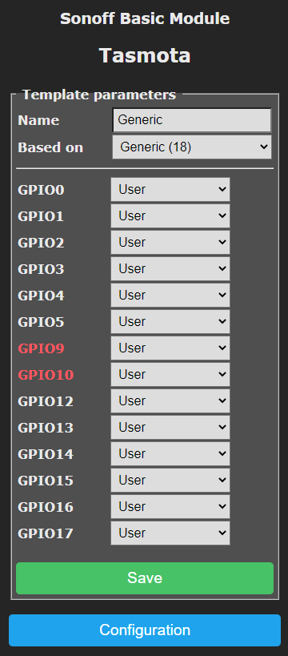
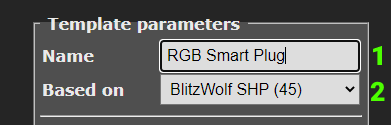
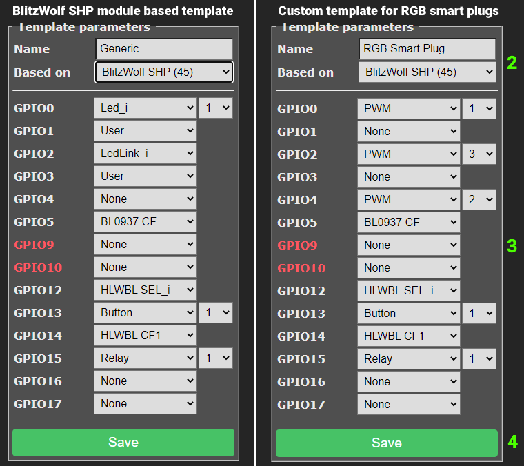

description: Template is a definition of a device and how its GPIOs are assigned

!!! info "**Template** is a definition of a device and how its GPIOs are assigned."

Templates provide an easy way for you to create, modify and share configurations for various devices that have features supported in Tasmota. 

!!! bug 
    Tasmota 9.1 completely redesigned template layout to allow for future expansion. Read more about the [GPIO Conversion](GPIO-Conversion.md). 

To provide easy processing by Tasmota a template is written as a JSON string and looks like this:
```json
{"NAME":"Example Template","GPIO":[416,0,418,0,417,2720,0,0,2624,32,2656,224,0,0],"FLAG":0,"BASE":45}
```
!!! tip
    [**Tasmota Device Templates Repository**](https://templates.blakadder.com/) has a complete list of supported devices.
    We encourage everyone who creates a template for a [new unknown device](Configuration-Procedure-for-New-Devices) to submit it using [Add New Template form](https://templates.blakadder.com/new.html).


## How to Use

Go to **Configuration - Configure Template** ...


... and you'll end up looking at this screen.



Time to create your template.

### Creating Your Template 
1. Change the template name (also defines the name for the module).
2. Select a module to [**BASE** your template on](#base). If you're not sure, `Module 18` is the best choice. In this example the device is based on Blitzwolf SHP (45) module.
3. Configure the components assigned to the [**GPIOs**](#gpio) to match your device. If you do not know what pins your device uses, read about the [new device configuration procedure](Configuration-Procedure-for-New-Devices) to determine the correct pin assignments.

 
    - Any unused GPIO that has cannot have a peripheral connected should be set to `None` (0). In our example the device has no exposed GPIO's so the unused ones are set to `0` compared to the original BlitzWolf module.     
    - GPIOs that can have peripherals connected to (exposed GPIOs) should be set to `User` (1). This allows future configuration through the **Configure Module** dialog without the need to create a new template.  
   
    !!! example 
        Sonoff TH has a jack connected to GPIO4 that allows a user to plug in a sensor. Assigning GPIO4 as `User` allows a Template to have correct GPIOs for this device even if nothing is plugged in. But, when a user decides to connect a sensor using the jack, GPIO4 can be set to the type of sensor through the Configure Module page.

4. Click on **Save** and you'll see this message      
    

5. Finally, the device will reboot with the new template name       
    

### Exporting Your Template

Now that you've set up your previously unsupported device in Tasmota it is time to share the knowledge:

1. Check that `Module 0` is selected in the **Configuration - Configure Module** menu. 
2. Open up **Console** and issue command `Template` which will output a string with the configuration of your currently active template. Our example gives the following:

```json
MQT: stat/tasmota/RESULT = {"NAME":"Merged","GPIO":[416,0,418,0,417,2720,0,0,2624,32,2656,224,0,0],"FLAG":0,"BASE":45}
```

Copy the string `{"NAME":"Merged","GPIO":[416,0,418,0,417,2720,0,0,2624,32,2656,224,0,0],"FLAG":0,"BASE":45}` and share it on the [Tasmota Device Templates Repository](https://templates.blakadder.com/new.html).

### Importing Templates

Go to **Configuration - Configure Other**


When there:

1. Paste the template string into the Template field
2. Make sure you **check Activate**
3. Click on **Save**. 


The device will reboot with a name reflecting your template name and `Module 0` selected which has your new template stored.

!!! warning "If your device was previously configured you will have to manually change to `Module 0` in ****_Configuration -> Configure Module_****."


## Commands
A user provided template can be stored in Tasmota using the [`Template`](Commands.md#template) command. It has the following parameters.

|Parameter|  Description |
|---------|----------|
` `|Show current Template
`0`|Create template from active module
`1..71`|Create template from a supported module
`{ ... }`|Store template written in a JSON string	
`255` | Merge configured template and current module											

``Template {"NAME":"Example Template","GPIO":[416,0,418,0,417,2720,0,0,2624,32,2656,224,0,0],"FLAG":0,"BASE":45}`` stores a complete template based on the Generic module

``Template {"NAME":"AnotherModuleName"}`` updates the name of a stored template

``Template {"FLAG":0}`` changes FLAG value

``Template {"BASE":18}`` updates the base of a stored template to Generic

!!! warning "After setting a template in command line it is necessary to issue `Module 0` command if the device doesn't reboot on its own."

#### Merge Template with Module
You can set up your device in module ****_Configuration -> Configure Module_**** and use command `Template 255` to merge the settings of the Module with current template into a new Template named "Merged".

## Anatomy of a Template
Let's look again at our example template:

```
{"NAME":"Example Template","GPIO":[416,0,418,0,417,2720,0,0,2624,32,2656,224,0,0],"FLAG":0,"BASE":45}
```

The four properties with UPPERCASE property names have the following functionality:

Property name | Property value description
--------------|-----------------------------------------------------------------------------------------------------------
NAME          | Up to 60 characters for the Module name
[GPIO](#gpio) | Numbers from 0 to 65535 representing GPIO0 to GPIO5, GPIO09, GPIO10 and GPIO12 to GPIO16 and GPIO17 for A0 pin for ESP8266. ESP32 has more configurable GPIO's
[FLAG](#flag) | 8 bit mask flag register
[BASE](#base) | Module number of a hard-coded device to be used when device specific functionality is needed

### GPIO

#### GPIO order

```  
GPIO# |00| 01|02| 03|04| 05| 09| 10| 12| 13| 14| 15| 16|  
CODE  [416,0,418,0,417,2720,0,0,2624,32,2656,224,0,0] 
```

#### GPIO functionality
The GPIO functionality numbers are the same as shown by command ``GPIOs``. In addition code 1 is added to select a GPIO as user configurable via the GUI Configure Module menu.

!!! example
    In our example the GPIO 12 data element is `32` which corresponds to the `Button1` component, according to the [components table](Components.md). If you change that template element to `160` it would then be assigned as a `Switch1` component instead.

#### Components
See [Components](Components.md) for a complete list or use command `Gpios 255` in console.

### FLAG
Before Tasmota 9.1 used to configure the [ADC](ADC) type. In new templates this should be set to `0` and the analog pin should be configured on GPIO17

FLAG |  Feature description
-----|------------------------------
   0 | No features
   1 | Analog value
   2 | Temperature
   3 | Light
   4 | Button
   5 | Buttoni
  15 | User configured (same as `User`)

### BASE
BASE is the starting module setup for the custom template. Some modules include special programming. If your device is similar to an existing built-in module it is best to use that as a starting point. When you're not sure which BASE module is suitable for your device use the `Generic (18)` module. A list of hard-coded devices can be found in [Modules](Modules).

!!! example
    In the [RGB Smart Plug](https://templates.blakadder.com/XS-A12.html) template we used the `BlitzWolf SHP (45)` module as BASE since the power monitoring circuitry is identical but GPIO00 and GPIO02 were changed and an unused GPIO04 was added to enable the RGB LED function. Using that specific module we took advantage of that module's calibrated power monitoring special programming which the `Generic (18)` module does not use.


