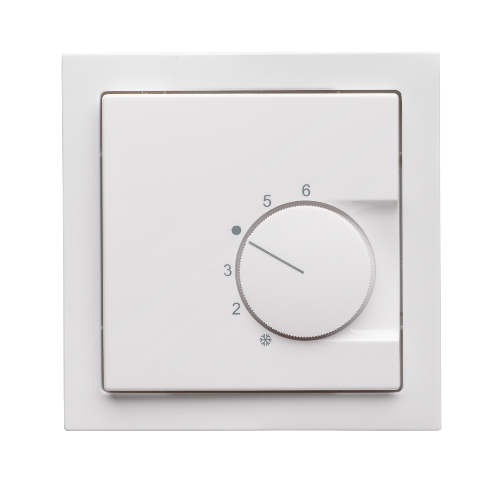

# Thermostat

The Thermostat driver allows the tasmota device, provided it receives the temperature input via MQTT or a locally connected sensor, to follow control heating/cooling strategies to reach the desired setpoint. The thermostat offers similar functions as feature reach commercial ones, such as:

## Typical setup, bypassing existing room thermostat

The tasmota device running the thermostat driver can be installed bypassing a conventional room thermostat:

