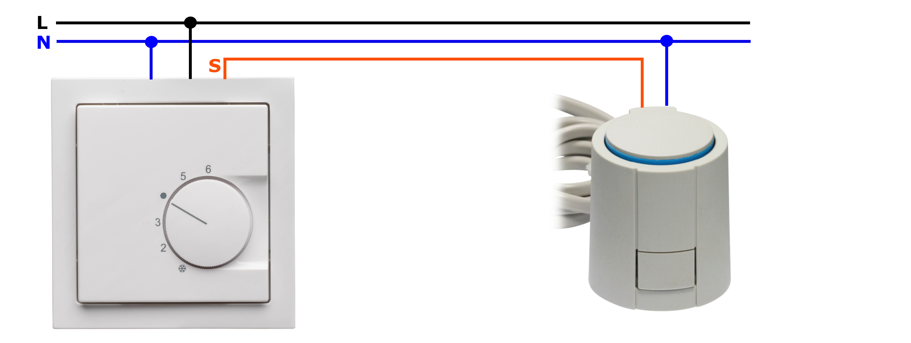

# Thermostat

The Thermostat driver allows the tasmota device, provided it receives the temperature input via MQTT or a locally connected sensor, to follow control heating/cooling strategies to reach the desired setpoint. The thermostat offers similar functions as feature reach commercial ones as the ones found below:


## Typical setup: Heating floor system

A typical setup for heating room systems can be found in the picture below. A conventional room thermostat is connected to a heating floor valve actuator, both running at AC voltage (f.i. 220V). The thermostat is connected to neutral as well as to the phase, the actuator to the same neutral connection of the thermostat and to its actuation signal. The actuation signal will switch between the neutral voltage (actuation Off) and the phase voltage (actuation On).

The conventional room thermostats offer nowadays either 2 point control with hysteresis or a more advanced PI (Proportional-Integral) control. The result of the PI control is typically transformed into a PWM signal with a pre-defined period and a variable duty cycle.



### Use of tasmota switch to bypass an existing wall thermostat

A tasmota switch can be installed in a way that it bypasses the existing wall thermostat. The advantage of this setup is that the thermostat driver offers the possibility to follow the output of the existing wall thermostat or acting autonomously. This setup allows a seamless integration with existing wall thermostats and gives the user the freedom to still use them.

Below you can find an example of a Shelly switch bypassing a wall thermostat:


## Temperature input / setpoint

### Local temperature sensor

The tasmota driver can receive the temperature either via the related MQTT command or via a local temperature sensor (see example of a DS18B20 temperature sensor and a shelly temperature sensor addon below).


The default temperature input is MQTT. The following command can be used to select the local sensor as default input:

```
cmnd/Tasmota_Name/SENSORINPUTSET 1
```

### MQTT temperature value and setpoint

The following commands can be used to provide the driver with the temperature value of the room and the desired setpoint:

```
cmnd/Tasmota_Name/TEMPMEASUREDSET 22.5
```

```
cmnd/Tasmota_Name/TEMPTARGETSET 21.8
```

Note: Examples for room temperature of 21.8°C and temperature setpoint of 22.5°C.

There are several ways to send the MQTT room temperature. For the development and testing of this driver, a Raspberry Pi with Domoticz and a Z-Wave stick has been used to gather all room temperatures from Z-Wave sensors and send them to the respective Tasmota room thermostats.

## Customize the controller for best results

The thermostat controller includes a default parameter set that targets a typical floor heating application for mid-sized rooms (< 20m2) with one heating circuit. The controller is however highly configurable via MQTT. The following sections will guide the user to adapt the main parameters to improve the performance of the thermostat controller via customization.

### Enable the thermostat driver

The thermostat driver is by default disabled. To enable it the following command can be used:

```
cmnd/Tasmota_Name/THERMOSTATMODESET 1
```

### Set the controller in degrees Celsius or Fahrenheit

The default temperature format is degrees Celsius. The format can be easily switched to degrees Fahrenheit via MQTT command, see below:

```
cmnd/Tasmota_Name/TEMPFORMATSET 1
```

### PI controller main parameters

#### Cycle time
Depending on the heating system, the cycle time (PMW period) can be adapted. Very slow systems (high time constants) such as heating floor systems might need higher values (default value is 30 minutes), faster systems might need smaller cycle times. Below the command to adapt the cycle time can be found:

```
cmnd/Tasmota_Name/TIMEPICYCLESET 30
```

#### Proportional Band 
Depending on the dimensioning of your heating system, the proportional band of the controller might be increased (if it takes too long to reach setpoint) or reduced (very high overshoot). The default proportional gain is 4, which means that the duty cycle due to the proportional part of the PI controller will be 100% for temperature deltas between setpoint and room temperature equal or bigger than 4°C. Below the command to adapt the proportional band can be found:

```
cmnd/Tasmota_Name/PROPBANDSET 1
```

Note: With the command above, the PI controller will output a proportional time equivalent to 100% of the duty cycle for delta temperatures between setpoint and room temp. above 1°C (f.i. for big rooms with weak dimensioned heating circuit).

#### Reset Time
The reset time is the time the PI controller takes to overcome steady-state errors. The default value for the reset time is 1800 seconds. This value can be for instance increased in case a stronger integral reaction of the controller is desired. Below the command to adapt the proportional band can be found:

```
cmnd/Tasmota_Name/TIMERESETSET 1800
```

#### Temperature for the anti-windup reset
To avoid the accummulated error and therefore integral component of the PI controller to grow too much and produce a high overshoot, a temperature delta can be defined within the integrator will work. Outside this range the accummulated error and integral part will be set to 0. The default value for the integrator to work is 0.8°C. Below the command to adapt the anti-windup temperature can be found:

```
cmnd/Tasmota_Name/TEMPANTIWINDUPRESETSET 0.8
```

#### Temperature hysteresis
A temperature hysteresis can be set to avoid any PI controller actions within a certain value arround the setpoint. The default value for the hysteresis is 0.1°C. In well configured controller this value should be as low as possible to avoid unwanted temperature oscillations which reduce efficiency and therefore increase costs. Below the command to adapt the anti-windup temperature can be found:

```
cmnd/Tasmota_Name/TEMPHYSTSET 0.1
```

#### Maximum action of the controller
The maximum On time (Duty Cycle) in minutes within a cycle can be set by this parameter. The default value is 20 minutes. This represents for the default cycle time of 30 minutes 2 thirds of the complete cycle. In case the controller takes too long to reach the setpoint, this value can be increased to values closer to the cycle time. Below the command to adapt the maximum action time can be found:

```
cmnd/Tasmota_Name/TIMEMAXACTIONSET 20
```

#### Minimum action of the controller
The minimum On time (Duty Cycle) in minutes within a cycle can be set by this parameter. The default value is 4 minutes. In case the controller is not capable of mantaining the temperature arround the setpoint without integral action and generates oscillations, the value should be increased. Below the command to adapt the minimum action time can be found:

```
cmnd/Tasmota_Name/TIMEMINACTIONSET 4
```

Note: It is very important to adapt this value to your heating system to obtain accurate temperature control. If the value is very low, in case of floor heating systems, the heating actuators might not have enough time to open the valves (depending on the actuator it could take from 1 to 3 minutes).

### Ramp-Up controller main parameters

#### Cycle time
Depending on the heating system, the cycle time (PMW period) can be adapted. Very slow systems (high time constants) such as heating floor systems might need higher values (default value is 30 minutes), faster systems might need smaller cycle times. Below the command to adapt the cycle time can be found:

```
cmnd/Tasmota_Name/TIMERAMPUPCYCLESET 30
```

#### Maximum Ramp-Up time
The maximum time the ramp-up phase of the controller shall be active can be configured. The default value is 960 minutes. Below the command to adapt this time can be found:

```
cmnd/Tasmota_Name/TIMERAMPUPMAXSET 960
```

## Advanced features

### Multi-controller

The tasmota driver can be compiled to be used in devices with more than one output, allowing independant controllers for each one of the outputs. This feature has been successfully tested with a Sonoff 4CH PRO R2.


To increase the number of controller outputs, modify the value of the thermostat controller outputs in my_user_config.h or redefine it in user_config_override.h and compile a customized tasmota software.

```
#define THERMOSTAT_CONTROLLER_OUTPUTS         1         // Number of outputs to be controlled independently
```

## Future improvements

### Cooling

The controller offers the possibility to switch from heating to cooling. Due to lack of cooling setup at the time of the development of the driver, this feature has however not been propertly tested. Testers for cooling are therefore welcomed.

The following MQTT command can be used to switch from heating (default) to cooling:

```
cmnd/Tasmota_Name/CLIMATEMODESET 1
```

### "Ramp-Up" controller

The "Ramp-Up" controller evaluates the time constant of the system and predicts when to switch off the actuator to reach the desired temperature as fast as possible. This controller offers the best speed to reach the Setpoint. This controller will be improved by a learning process to evaluate how accurate the target value has been reached without overshoot. This feature will improve the behavior of the current controller which depending on the application and thermal capacity of the system might produce some overshoot. By default the controller set is the Hybrid one, enabling "Ramp-Up" for big temperature deltas between Setpoint and measured temperature and PI for smaller ones. If you are not satisfied with the performance of this controller in your system, you can disable it by MQTT and force the use of the PI controller exclusively. For that purpose the following command can be used:

```
cmnd/Tasmota_Name/CONTROLLERMODESET 1
```

### PI Autotune

A PI autotune feature following the Zigler-Nichols closed loop algorithm has been implemented. This feature is untested and will be further developed soon. To enable it for testing purposes add the following define in user_config_override.h and compile a customized tasmota software.

```
#define USE_PI_AUTOTUNING // (Ziegler-Nichols closed loop method)
```
