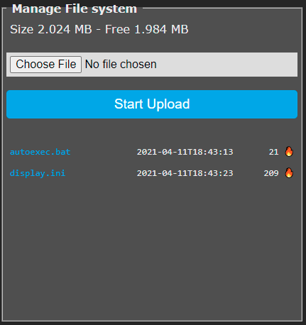

!!! failure "This feature is included in every precompiled binary with flash size >1M"

For ESP8266 modules that have more than 1MB of flash memory (NodeMCU, Wemos-D1) you can build a variant 
with a _universal file system or UFS_ and store your files there (data, images, commands, etc).
There are some special files that you can upload and use to execute actions.

!!! warning
    The file partition **DOES NOT** get erased by reset commands. Only a complete flash erase will remove it

## Compiling UFS enabled firmware

Copy `platformio_override_sample.ini` as `platformio_override.ini`

For ESP8266 boards, activate by removing the `;` in front of one of the below lines:

* `board = esp8266_4M2M` for 2Mb universal file system    
* `board = esp8266_2M1M` for 1Mb universal file system


!!! warning "About ESP32"
    **ESP32** boards with default 4MB flash only support a file system **limited to 320KB**. You need a board with more 
    than 4MB to enable a larger file system.

Extending file system size on ESP32 is performed through the `board_build.partitions` setting. 
There are preconfigured settings for 4M, 8M and 16MB ESP32 devices. The are enabled in `platformio_override.ini`
like for the ESP8266. Comment the standard setting and uncomment the variant you want.

```
; Build variant ESP32 4M Flash, Tasmota 1856k Code/OTA, 320k LITTLEFS (UFS) (default)
board                   = esp32_4M
; Build variant ESP32 8M Flash, Tasmota 2944k Code/OTA, 2112k LITTLEFS (UFS)
;board                   = esp32_8M
; Build variant ESP32 16M Flash, Tasmota 2944k Code/OTA, 10M LITTLEFS (UFS)
;board                   = esp32_16M
```

## UFS in the Web GUI

After compiling and flashing you will find a new entry in Tasmota webUI: ***Consoles - Manage File system***


The "Manage File System" page provides:

* On top, the total size of the file system and the free size
* A button to upload a file from the host (1st select the file with the `Choose File` button, then `Start Upload`)
* A list of available files with timestamp of upload and size in bytes
* The 'fire' icon allows to delete the file **without any confirmation**
* The 'memo' icon allows to edit the file and the "Create and edit new file"
button launches the editor with a new file.



The file editor allows to edit the content of a text file online, save it back to the UFS. 
By changing the name at the top, it will be saved-as the new name (original file remains unchanged).
Changes can be discarded by clicking on the button "Manage File System" to returns to the manager.


## Commands
Complete list of [UFS commands](Commands#ufs)

Also look into [Berry scripting language](Berry.md#loading-code-from-filesystem) for ESP32 which works with UFS.

## Special files

### autoexec.bat

Stores commands that will be executed at every boot, similar to the backlog commands in rules trigger at `System#Boot`. 

Almost any command can be used in the file. However, avoid commands that will make the device reboot, 
such as: changing Wifi setting, MQTT settings, Templates & GPIO, etc. Commands that triggers reboot
will create a boot loop which will force Tasmota to automatically disable `autoexec.bat` and other settings.
See [SetOption36](Commands#setoption36) for more details.

Commands must be kept one command per line and they will be executed sequentially.

### display.bat

Stores data that will be displayed at every boot, similar to the DisplayText commands in rules trigger at `System#Init` (as long as you have a display driver initializated).

!!! example
    ```
    ; clr screen
    [z]
    ; draw full screen picture - corona.rgb file must exist in UFS storage
    [x0y0P/corona.rgb]
    ; define index color
    [dc19:31000]
    ; draw transparent text with new index color
    [x60y30f2Ci19D2]Tasmota
    ```

### autoexec.be

For ESP32 with [Berry scripting language](Berry.md), `autoexec.be` file will be automatically
loaded and executed at the start of the VM.
