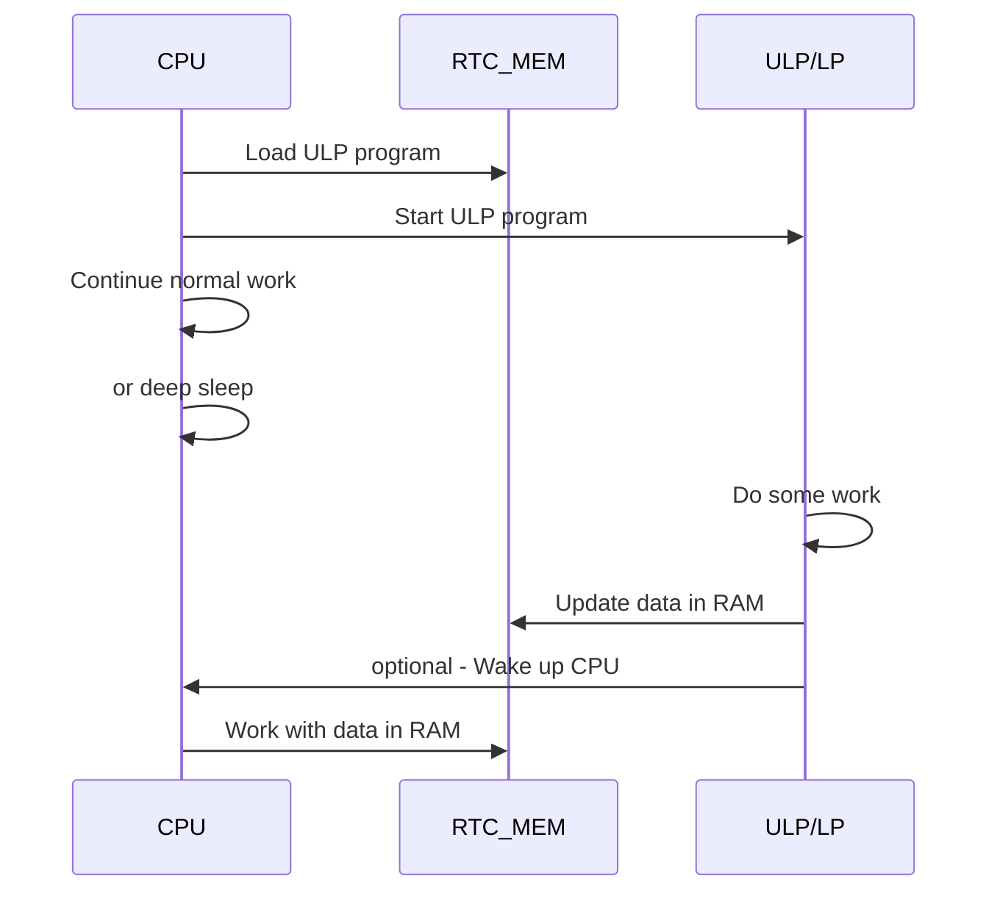

# ULP for ESP32 :material-cpu-32-bit:
  
## Ultra Low Power coprocessor

Many members of the ESP32 family have an additional coprocessor with limited features and processing power but at the same time the ability to work independent from the main CPU and in deep sleep mode. This Berry module exposes these processing units in order to load and execute code at runtime thus allowing to provide solutions for special use cases and using every bit of available processing power.

??? failure "This feature is not included in precompiled binaries"  
    When [compiling your build](Compile-your-build) add the following to `user_config_override.h`:
    ```arduino
    #define USE_BERRY_ULP      // (ESP32, ESP32S2 and ESP32S3 only) Add support for the ULP via Berry (+5k flash)
    ``` 
    or add as a build flag to any build environment, i.e. in platformio_tasmota_cenv.ini:  
    ```
    build_flags             = ${env:tasmota32_base.build_flags}
                            -DUSE_BERRY_ULP
    ```  
  
The purpose of this document is not to repeat every information of these documents:  
[https://docs.espressif.com/projects/esp-idf/en/latest/esp32/api-reference/system/ulp.html](https://docs.espressif.com/projects/esp-idf/en/latest/esp32/api-reference/system/ulp.html)  
[https://docs.espressif.com/projects/esp-idf/en/latest/esp32/api-reference/system/ulp_instruction_set.html](https://docs.espressif.com/projects/esp-idf/en/latest/esp32/api-reference/system/ulp_instruction_set.html)  
  
It will also not make it easy to write assembler code for the ULP and embed it in Berry projects. But it shall guide you through the process of adapting one of many open source examples, do some little changes and setting up a toolchain for personal use cases.  
In return, it can even make it easier and substantially faster to rapidly develop assembler projects, because there is no flashing involved in the code deployment, which happens in Berry at runtime.
  
  
### FSM and RISCV ... what?
  
Currently there are 3 SOC's of the ESP32-family with an included ULP, which are the ESP32, the ESP32S2 and the ESP32S3.  
New to the game is the ESP32C6 with a so called **LP_CORE** which for simpicity is handled by the ULP module too.  
  
The oldest one - the ESP32 - features the simplest type, which Espressif names **Finite State Machine** or in short **FSM**. This ULP can only be programmed in assembly.  
The newer ESP32S2/S3 allow to run the ULP in FSM mode too with some minor additions in the instruction set. They are able ( = should be able in most cases) to use the same assembly source code, but the resulting binaries are not compatible.  
But additionally both of the new models (ESPS2/S3) are able to run the ULP in RISCV mode, which has a different toolchain and allows to use C as programming language. This makes it a lot easier to work with it. Only one ULP mode possible at a time, so you can run only in FSM or RISCV mode.  
The LP_CORE of the ESP32C6 always runs in RISCV mode and is the most powerful low power core to date.  

For Tasmota it was decided to keep things as simple and modern as possible, thus for ESP32S2 and ESP32S3 the old FSM mode is not supported and we enjoy the simplicity of the high level language C. 
Of course it is possible to use inline assembly for the RISCV cores in a C file for hand optimized code parts.
   
Bottom line for Tasmota:  
**ESP32** - uses ULP in **FSM** mode  
**Every other device** - use ULP/LP in **RISCV** mode  
  
!!! tip
    Although the main core of the ESP32C3 uses the RISCV architecure, there is no built in ULP at all. For the upcoming ESP32C6 an integrated ULP was anounced, but no further info is available at the moment. 
  
### Limits of the ULP
  
To simplify some things:  
Everything in the ULP is limited. On the old FSM type ULP there are only 4 registers, very few operations and limited memory access. For some operations it is not possible to use mutable values, but the code must be fixed (for pin/register access) at compile time. That's why you will see lots of defines and constants in basically every example project.  
This was the reason, why for projects like Tasmota it never made sense to include ULP code in core parts.  
  
### Advantages of the ULP
Besides the possibility to run code in deep sleep and wake up the system, it can also make sense to run the ULP in parallel to the main system.  
To simplify again:  
Everything that is critical to precise timing and is somehow portable to ULP, should run better than on the main cores! This includes the internal temperature sensor and the hall sensor. Additionally it can free the main cores of some tasks. It could be demonstrated that the newer LP_CORE is fast enough to controll a WS2812 LED strip using bitbanging.  
  
### Data exchange between main system and ULP
  
There is a memory region which is located at fixed  address 0x5000000, which is called RTC_SLOW_MEM. This is the only region that is accessible from main cores and the ULP. It is the coders job to find a way to control the data flow, by reading and writing from and to certain addresses. The toolchains down below will print out data, that will show, where accessible variable can be found to access from Berry with `ULP.get_mem()` and `ULP.set_mem()`.  
  
### General program flow
  
A typical ULP program is started from the main core at the position of the so called *global entry point*. Then it executes its chain of commands and ends with a `halt` command. It is technically possible to create a run loop inside the code and to not end with `halt`. But typically such a loop is realized with a wakeup timer, that restarts the  with a certain interval, which can be set with `ULP.wake_period(register,time in microseconds)`. The register is numbered from 0 to 4 and can be changed in the assembly code with `sleep register`.  


  
### Tasmota conventions
  
The assembly code can be divided in different sections of which the so called `.text`sections contains the program, but can hold variables or arbitrary data too. In general for the assembler it is not so important, where the functions or the *global entry point* is located.  
But for the FSM in Tasmota the rule is, that the global entry point or a jump to it is located at position 0 in RTC_SLOW_MEM. That way `ULP.run()` can always point to this address 0. On RISCV ULP's the entry point is always 0.  
It is a design decision to keep the ULP module as small as possible and the addition of more internal functions shall be avoided, i.e. for doing setup of GPIO/RTC pins. If possible, this should be done in assembly code.  
  
!!! example 
``` asm
// rtc_gpio_isolate(12) translates to:
WRITE_RTC_REG(RTC_IO_TOUCH_PAD5_REG, 27, 1, 0) //disable pullup
WRITE_RTC_REG(RTC_IO_TOUCH_PAD5_REG, 28, 1, 0) //disable pulldown
WRITE_RTC_REG(RTC_IO_TOUCH_PAD5_REG, 13, 1, 0) //disable input
WRITE_RTC_REG(RTC_GPIO_ENABLE_W1TS_REG, 29, 1, 0) //disable output
WRITE_RTC_REG(RTC_IO_TOUCH_PAD5_REG, 31, 1, 1) //hold
```
  

## Using external toolchains for this driver  
  
There are 2 ways to assemble code for later use in Tasmota. In theory every external ULP project, which fits in the reserved memory space that is defined in the framework package used to compile the Tasmota firmware, should be convertible. This limit is subject to change.  

###  Export from ESP-IDF project
  
This is the recommended way, that works for every ULP version in Tasmota.
  
Many projects are using the ESP-IDF with CMAKE and will be compiled with `idf.py build`. We can extract the ULP code without flashing this project, with two simple methods: 

#### Python script 'binS2Berry.py'
Start a helper Python [binS2Berry.py](https://github.com/Staars/berry-examples/blob/main/ulp_helper/binS2Berry.py) script in the root level of the project, which prints hooks to used variables and functions to console as Berry code, that can be used as a base application.  
  
#### Web-App:  
Use the embedded JS application right here.  
<script src="../extra_javascript/ulp2berry.js"></script>
<p>ESP-IDF build folder: <input type="file" id="ulp_files" onchange="processULPFiles()" webkitdirectory mozdirectory multiple/></p>
(You can drag and drop the folder on the button too.)

<div id="ulp_output"></div>
``` py
# Generate ULP code in your browser !! Parsing completely in JS, no file upload to a server.
```
  
Additionally it can be helpful, to test the ULP code in a minimal working example outside of Tasmota.
  
### Micropython and micropython-esp32-ulp (FSM only) - DEPRECATED!!

!!! failure "DO NOT USE FOR NEW PROJECTS!"  

Only available for the ESP32 using the FSM type ULP.
  
A great project to run ULP code in Micropython on the ESP32 can be used to assemble and export the same projects to Tasmota.  
There are ports of Micropython for Linux, Windows and Mac, which must be installed to the system of your choice. Run it and in the Micropython console install like that:  
``` py
# MacOS
import upip
# Linux
import mip
upip.install('micropython-esp32-ulp')
```
  
After that your are ready to assemble.  
The ULP code is embedded as a multiline string in Micropython scripts. For use in Tasmota it makes sense to make some changes, that are described in an [ulp_template.py](https://github.com/Staars/berry-examples/blob/main/ulp_helper/ulp_template.py) and to use this template by replacing the source code string with the new code.  
!!! tip
    The Micropython module can not really include external headers, but it offers a very convenient database function as described here:   [link:preprocess](https://github.com/micropython/micropython-esp32-ulp/blob/master/docs/preprocess.rst)  
    Otherwise the missing defines must be added annually.

After you created or did download your `ulp_app.py` you can export the data with 'micropython ulp_app.py' to the console, from where it can be copy pasted to the Berry console or to your Berry project.  
!!! tip
    It is recommended to embed the setup steps for GPIO pins or ADC to the bottom part of this `ulp_app.py` by printing Berry commands for easier testing in the Berry console.
  

## Examples
  
This is all about porting and adapting existing code. Thank you to everyone who is sharing their ULP code!!  
  
### Blink an LED - FSM
  
Let's take a look at [https://github.com/micropython/micropython-esp32-ulp/blob/master/examples/blink.py](https://github.com/micropython/micropython-esp32-ulp/blob/master/examples/blink.py).  
  
1.  Use a copy of [ulp_template.py](https://github.com/Staars/berry-examples/blob/main/ulp_helper/ulp_template.py)  and name it to your liking.
2.  Replace the `source` string of the template with the version of the example.
    The `.text`section starts with:
    ``` asm
    .text
    magic: .long 0
    state: .long 0
    ```
    this must become:
    ``` asm
    .text
    jump entry
    magic: .long 0
    state: .long 0
    ```
3.  This is already enough to assemble. For convenience it is recommended to add a line to the last section (with multiple "prints") with content: `print("ULP.wake_period(0, 500000)")`. 
  
Done!
  
Now let's modify the code slightly for different intervals for "on" and "off".

1. Add a second wake period with `print("ULP.wake_period(1, 200000)")`.
2. Add `sleep` commands to the source code like so:
    ``` asm
    on:
    # turn on led (set GPIO)
    WRITE_RTC_REG(RTC_GPIO_ENABLE_W1TS_REG, RTC_GPIO_ENABLE_W1TS_S + gpio, 1, 1)
    sleep 0
    jump exit

    off:
    # turn off led (clear GPIO)
    WRITE_RTC_REG(RTC_GPIO_ENABLE_W1TC_REG, RTC_GPIO_ENABLE_W1TC_S + gpio, 1, 1)
    sleep 1
    jump exit
    ```
  
The console output should look something like that:  
  
``` berry
    #You can paste the following snippet into Tasmotas Berry console:
    import ULP
    ULP.wake_period(0,500000) # on time
    ULP.wake_period(1,200000) # off time 
    var c = bytes().fromb64("dWxwAAwAaAAAAAAADAAAgAAAAAAAAAAAEACAcgEAANDlryxyMABAgCcFzBkABWgdEACAcuGvjHIBAABoIQCAcgQAANASAIByCAAgcAQAAGgBAAWCWAAAgAQFaB0AAACSZAAAgAUFaB0BAACSZAAAgAAAALA=")
    ULP.load(c)
    ULP.run()
```
  
After executing it the built in LED should blink (if wired to the usual GPIO 2).
You can change the wake intervals on-the-fly with i.e. `ULP.wake_period(1, 800000)` in the Berry console.

Now on to something more complex with wake from deep sleep.
  
### Hall sensor - FSM
  
We have a working example here: [https://github.com/duff2013/ulptool/blob/master/src/ulp_examples/ulp_hall_sensor/hall_sensor.s](https://github.com/duff2013/ulptool/blob/master/src/ulp_examples/ulp_hall_sensor/hall_sensor.s)
  
Converting is possible in the same manner as before. Start with  `ulp_template.py`, replace the string with the content of the .s file and make sure you have the include database properly populated or you add the missing defines from the header files manually.  
Additionally we need to setup the ADC pins with the help of `ULP.adc_config()`. In this particular example the resulting code is (in the form of print outputs placed in the .py file):  

``` berry
print("ULP.adc_config(0,2,3)") # adc1_config_channel_atten(ADC1_CHANNEL_0, ADC_ATTEN_DB_6);
print("ULP.adc_config(3,2,3)") # adc1_config_channel_atten(ADC1_CHANNEL_3, ADC_ATTEN_DB_6); + adc1_config_width(ADC_WIDTH_BIT_12);
```
  
The entry point is already at address zero, so there are no changes needed to assemble, load and start he ULP program in Tasmota. In the console output we can find the positions of the variables which hold the voltage measurements and can read out it values:

```
0000 entry
0051 jmp_threshold
0052 exit
0053 wake_up
0059 Sens_Vp0
0060 Sens_Vn0
0061 Sens_Vp1
0062 Sens_Vn1
0063 Sens_Diff_p1
0064 Sens_Diff_n1
```
 
  
In order to use this whole construction to wake the ESP32 with the help of a magnet, we now have to do some measurements to find feasible threshold values. 
This can be done by calculating the difference between  `Sens_Vpx` and `Sens_Vnx` in Berry. Then place the magnet of your choice near the ESP32 and note how these values change. If the magnet is strong enough, chances are great, that you find a stable threshold.  
Now let's add some assembly code!  
  
We can add some constants in the header part of the code (that worked with a tested weak magnet):
``` asm
    .set threshold_pos   , 7
    .set threshold_neg   , 2
```
  
Now append some variables to the end of the .bss section:  
``` asm
  .global Sens_Diff_p1
Sens_Diff_p1:
  .long 0
  
  .global Sens_Diff_n1
Sens_Diff_n1:
  .long 0
```
  
The we need some code, which replaces line 135 and 136 of the original example:  
``` asm
/* calculate differences */
    move r3, Sens_Vn1
    ld r3, r3, 0
    move r2, Sens_Vn0
    ld r2, r2, 0
    sub r3, r2, r3         # eventually change to sub r3, r3, r2 for your setup
    move r2, Sens_Diff_n1
    st r3,r2,0
    move r3, Sens_Vp1
    ld r3, r3, 0
    move r2, Sens_Vp0
    ld r2, r2, 0
    sub r3, r3, r2          # eventually change to sub r3, r2, r3 for your setup
    move r2, Sens_Diff_p1
    st r3,r2,0
    
/* wake up */
    ld r0,r2,0 # Sens_Diff_p1
    JUMPR wake_up, threshold_pos, GE
```
  
After loading and starting you can send the ESP to deep sleep. For testing it is recommended to add the optional wake timer as a fallback:  
`ULP.sleep(30)` 
  
Try to wake up the system with the magnet.  

But is there a way to circumvent the limitation of this example, that forces us to set the threshold value as a constant? Well ... yes, we can do some hacky stuff.  
  
We must dig a little deeper, to understand how the 32-bit instructions are constructed. Let's look at the `jumpr` command, which is defined in ulp.h like that:  
  
``` c
    struct {
        uint32_t imm : 16;          /*!< Immediate value to compare against */
        uint32_t cmp : 1;           /*!< Comparison to perform: B_CMP_L or B_CMP_GE */
        uint32_t offset : 7;        /*!< Absolute value of target PC offset w.r.t. current PC, expressed in words */
        uint32_t sign : 1;          /*!< Sign of target PC offset: 0: positive, 1: negative */
        uint32_t sub_opcode : 3;    /*!< Sub opcode (SUB_OPCODE_B) */
        uint32_t opcode : 4;        /*!< Opcode (OPCODE_BRANCH) */
    } b;                            /*!< Format of BRANCH instruction (relative address, conditional on R0) */
```
  
The constant (= immediate) value is stored in the upper 16 bits and we can access in the byte buffer. To find the address of the command we can simply add a label in the code:  
  
``` asm
  .global jmp_threshold
jmp_threshold:
    JUMPR wake_up, threshold_pos, GE
```
  
This will get printed to the console while assembling. Then in Berry we can do a:  
  
``` berry
    var c = bytes("...")
    # jmp_threshold is the 32-bit-address in RTC_SLOW_MEM
    var jmp_threshold = 51
    var pos = (3+jmp_threshold)*4
    var cmd = c[pos..pos+4]       # we do not have uint32 in Berry
    cmd.set(0,threshold,2)        # upper 16 bit
    ULP.set_mem(51,cmd.get(0, 4)) # modify running ULP program
```  
  
Now we can change these constant values on the fly.  
  
#### Example driver in Berry allowing deep sleep with wake up via magnet:
     
Add commands:  
`hall_thres x` - shows current threshold for the p difference value or sets it to x.  
`usleep x` - start deep sleep for x seconds or infinitely 
  
[ulp_hall.be](https://github.com/Staars/berry-examples/blob/main/ulp_hall.be)
  

### I2C access  - FSM
  
Although there are special assembler commands to access I2C devices the most common method in the examples on GitHub is bit banging. This is reported to be more reliable and circumvents some limitations (only 2 pin combinations and bytewise access with special I2C commands).  
Nearly every example is based on some very clever macros and control flow tricks, that replicate a simple stack and subroutines (similar to a library), which is a good example for the "Art of coding".  
To make it assemble in Micropython we need some functions in the Micropython-script, that can expand the macros. These functions are in a very early stage of development and might eventually later find their way into the micropython-esp32-ulp project after more refinement.  
!!! tip
    If your examples do not assemble in Micropython, please try out the ESP-IDF variant.
  
An example for the BH-1750 light sensor can be found here:
[https://github.com/duff2013/ulptool/tree/master/src/ulp_examples/ulp_i2c_bitbang](https://github.com/duff2013/ulptool/tree/master/src/ulp_examples/ulp_i2c_bitbang)
  
With our techniques from above the concatenation of the .s files results in:   [BH-1750](https://github.com/Staars/berry-examples/blob/main/ulp_examples/ulp_I2C_BH1750.py)  
  
#### Example Berry driver:  
  
[ulp_bh1750.be](https://github.com/Staars/berry-examples/blob/main/ulp_bh1750.be)

