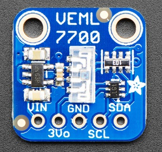

# VEML7700 Ambient light sensor

!!! failure "This feature is not included in precompiled binaries"     

To use it you must [compile your build](Compile-your-build). Add the following to `user_config_override.h`:
```
#ifndef USE_VEML7700
#define USE_VEML7700            // Add I2C code for VEML7700 sensor
#endif
```
----


VEML7700  is  a  high  accuracy  ambient  light  digital  16-bitresolution  sensor  in  a  miniature  transparent  6.8  mm  x2.35  mm  x  3.0  mm  package.  It  includes  a  high  sensitivephoto  diode,  a  low  noise  amplifier,  a  16-bit  A/D  converterand  supports  an  easy  to  use  I2C  bus  communicationinterface.The ambient light result is as digital value available.

## Configuration

### Wiring
| VEML7700   | ESP8266  |
|---|---|
|GND   |GND   |
|VCC   |3.3V 
|SDA   | GPIOx
|SCL   | GPIOy

### Tasmota Settings 
In the **_Configuration -> Configure Module_** page assign:

1. GPIOx to `I2C SDA (6)`
2. GPIOy to `I2C SCL (5)`

## Commands and Use

 Console Commands    | Description                                    | values                           |
---------------------|------------------------------------------------|----------------------------------|
 VEML7700power       | Power on/off the modul                         |  0/1
 VEML7700inttime     | integration time in ms                         | 25, 50, 100, <br> 200, 400, 800
 VEMLgain            | Gain Setting <br> (x1, x2, x1/8, x1/4)         | 0 = x1<br>1 = x2 <br> 2 = x1/8 <br> 3 = x1/4  


### Tasmota Main
After a reboot the driver will detect VEML7700 automatically and display light intensity.


## Breakout Boards


