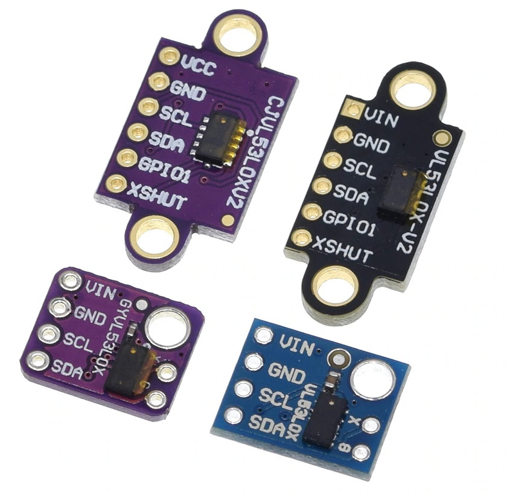
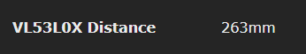

# VL53L0X and VL53L1X laser ranging modules

The VL53L0X and VL53L1X are Time-of-Flight (ToF) laser-ranging devices from ST MicroElectronics commonly available on small modules.

The support for VL53L0X sensor is included by default in Tasmota-sensors.bin (ESP8266) and in Tasmota32.bin (ESP32).

The support for VL53L1X is not included in any prebuilt Tasmota or Tasmota32 variant and requires [self-compile](Compile-your-build).

In the documentation below, VL53LXX is used whenever the information applies to either VL53L0X or VL53L1X. The exact name is used for any information that is specific to the specific model.

## The devices

About how to install those sensor and how to adapt the laser operation for several use-cases, please check:

* Datasheet [VL53L0X](https://www.st.com/resource/en/datasheet/vl53l0x.pdf)
* Datasheet [VL53L1X](https://www.st.com/resource/en/datasheet/vl53l1x.pdf)

| Characteristic  | VL53L0X | VL53L1X | Unit |
|-----------------|---------|---------|------|
| Max distance    | 2000    | 4000    | mm   |
| Field of vision | 25      | 27      | °    |

For more details on the supported distance range depending on the mode, the reflectance of the object and the ambient light regarding the different modes, please refer to the datasheets.

If you are going to use long I2C wires read [this article](https://hackaday.com/2017/02/08/taking-the-leap-off-board-an-introduction-to-i2c-over-long-wires/)

## Breakout Boards

Sample boards for VL53L0X. Similar boards exist for VL53L1X.



## Configuration for single sensor

### Wiring for single sensor
| VL53LXX   | ESP8266 |
|---|---|
|GND   |GND
|VCC   |3.3V
|SDA   | GPIOa
|SCL   | GPIOb

### Tasmota Settings for single sensor
In order to use a VL53LXX sensor you need to:
- configure ESP GPIOs for I2C bus
- enable the right driver

#### Step 1 - Configure I2C
In the **_Configuration -> Configure Module_** page assign:

1. GPIOa to `I2C SDA`
2. GPIOb to `I2C SCL`

On ESP8266 almost any GPIO can be used for I2C except for GPIO15. However the standard is to use GPIO4 (D1) for I2C SCL and GPIO5 (D2) for I2C SDA.

On ESP32 any pin can be assigned to I2C.

#### Step 2 - Enable the proper driver
I2C devices are identified on the I2C bus by their address. Because the number of possible addresses are limited (127) a lot of devices are sharing the same address. This as means that it is not possible to use simulatenously on the same I2C bus 2 devices that are using the same address. Beside, in most cases, a driver cannot correctly identify the chip it is talking to. This is why in most of the case it is important to disable Tasmota drivers for devices that you are not using and leave enabled only driver for a device you are going to use.

In the list of [I2CDEVICES](I2CDEVICES) supported by Tasmota it is listed that the address 0x29 can be used by either TSL2561 (driver 16), VL53L0X (driver 31), TSL2591 (driver 40) and VL53L1X (driver VL53L1X). It means that you can't use a TSL2561 or a TSL2591 at the same time as a VL53L0X/VL53L1X. ANd you can't use a VL53L0X at the same time as a VL53L1X.

If you have build a tasmota bynary that include the driver for TSL2561 and/or TSL2591 you must disable those drivers. You must also disable the driver for the other VL53LXX device. As a summary, here are the command to type in the console:

* To use a VL53L0X : `backlog i2cdriver16 0;i2cdriver40 0;i2cdriver31 1;i2cdriver54 0`
* To use a VL53L1X : `backlog i2cdriver16 0;i2cdriver40 0;i2cdriver31 0;i2cdriver54 1`


After a reboot Tasmota will detect the VL53LXX automatically is the proper driver has been enabled.



Sensor sends a  `tele/%topic%/SENSOR` JSON reponse:

For VL53L0X:
```json
{"Time":"2019-12-20T11:29:22","VL53L0X":{"Distance":263}}
```
Or for VL53L1X
```json
{"Time":"2019-12-20T11:29:22","VL53L1X":{"Distance":263}}
```

## Configuration for Multiple VL53LXX sensors in parallel

Tasmota supports by default up to 8 of these sensors in parallel. Note that they all must be of the same model (either all VL53L0X or all VL53L1X). In any case, the above I2C GPIO and I2C driver configuration remain valid.

When using multiple VL53LXX, it is required to wire the XSHUT pin of each sensors to a dedicated free GPIO and assign as `VL53LXX XSHUT` 1 to 8. This is to let Tasmota change by software the I2C address of those and give them an unique address for operation. The sensor don't save its address and this procedure is performed automatically at every restart. The Addresses used for this are by default 0x78 (120) to 0x7F (127). As for a single sensor, you must not use any other I2C device on those addresses. As the date of writing, there is currently no I2C device supported by Tasmota with those addresses. However such devices exists and may be supported by later versions of Tasmota. You can change the relocation address by a compile option, see the [compile options](#compile-options) section.

### Wiring for Multiple Sensors
| VL53LXX-1   | VL53LXX-2   | VL53LXX-3   | ... | ESP8266 |
|---|---|---|---|---|
|GND   |GND   |GND   |GND   |GND
|VCC   |VCC   |VCC   |VCC   |3.3V
|SDA   |SDA   |SDA   |SDA   | GPIOa
|SCL   |SCL   |SCL   |SCL   | GPIOb
|XSHUT | -     | -     | - | GPIOc
| -    | XSHUT | -     | - | GPIOd
| -    | -     | XSHUT | - | GPIOe
| -    | -     | -     | XSHUT | GPIOz

On ESP8266, please refer to the guide [Expending Tasmota](Expanding-Tasmota#gpio-overview) for suitable GPIOs. GPIO 1 and 3 being used by serial console are generally unadvised. GPIO15 has a pull-down on every ESP board to allow proper boot. If you want to use this GPIO for a XSHUT, you must remove the pull-up resistor that is on the VL53LXX module otherwise your ESP will not boot.

On ESP32 any GPIO that can be an output can be used.

### Tasmota Settings for multiple sensors
In the **_Configuration -> Configure Module_** page assign:

1. GPIOa to `I2C SDA`
2. GPIOb to `I2C SCL`
3. GPIOc to `XSHUT 1`
4. GPIOd to `XSHUT 2`
5. GPIOe to `XSHUT 3`
6. ...

After a reboot Tasmota will detect each VL53LXX in sequence and after auto-configuring them, it will display distance in mm.

Exemple: for VL53L0X it sends `tele/%topic%/SENSOR` JSON such as:

```json
{"Time":"2019-12-20T11:29:22","VL53L0X_1":{"Distance":263},"VL53L0X_2":{"Distance":344},"VL53L0X_3":{"Distance":729}}
```

With VL053L1X, the name of the sensor is adapted.

The index seperator is either a `-` if `SetOption4` is `0` or a `_` if it is `1`. See [`SetOption4`](Commands#setoption4).


## Compile options

### General

* **MAXIMUM AMOUNT OF SENSORS:** Tasmota supports by default up to 8 of these sensors in parallel. Expanding this limit is possible but backwards incompatible. The default value of VL53LXX_MAX_SENSORS is set in the file tasmota.h

* **XHUT Relocation address** The addresses at which the VL53LXX are relocated when using XSHUT can be changed by a define in `user_config_override.h` file. Replace the `0x78` for the 1st address. You need that as many consecutives address are free for the number of devices you are using.
For VL53L0X use:
```cpp
#define VL53L0X_XSHUT_ADDRESS 0x78
```
For VL53L1X use:
```cpp
#define VL53L1X_XSHUT_ADDRESS 0x78
```

### VL53L0X options

* **VL53L0X LONG RANGE:** By default VL53L0X reads up to 1.2 meters. If you want to use the long range mode (up to 2.2 meters), you need to add a define in `user_config_override.h` file:
```cpp
#define VL53L0X_LONG_RANGE
```
This increases the sensitivity of the sensor and extends its potential range, but increases the likelihood of getting an inaccurate reading because of reflections from objects other than the intended target. It works best in dark conditions.

* **VL53L0X_HIGH_SPEED** vs **VL53L0X_HIGH_ACCURACY** Either or the other can be added in `user_config_override.h` file to change the default compromise to either proceed at higher speed (but at the cost of accurancy) or at higher accuracy.
```cpp
#define VL53L0X_HIGH_SPEED
```
or
```cpp
#define VL53L0X_HIGH_ACCURACY
```

### VL53L1X options

* **Distance range** can be changed between *Long*, *Medium* or *Short* by copying one (and only one) of the below lines in `user_config_override.h`. The default value is **Long**. For details on those range, please refer to the [datasheet](#the-devices) of the device.
```cpp
#define VL53L1X_DISTANCE_MODE Long
#define VL53L1X_DISTANCE_MODE Medium
#define VL53L1X_DISTANCE_MODE Short
```
