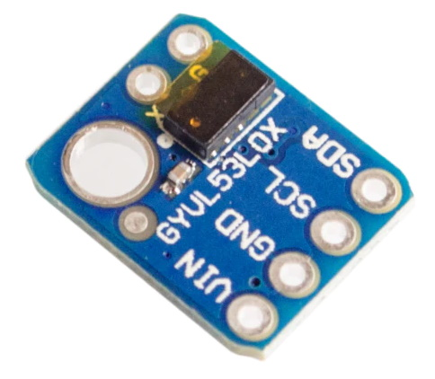

# VL53L0X and VL53L1X laser ranging modules

??? tip "Support for VL53L0X is included only in `tasmota-sensors` and `tasmota32` binaries" 

    When [compiling your build](Compile-your-build) add the following to `user_config_override.h`:
    ```arduino
    #ifndef USE_VL53L0X 
    #define USE_VL53L0X                            // [I2cDriver31] Enable VL53L0x time of flight sensor (I2C address 0x29) (+4k code)
      #define VL53L0X_XSHUT_ADDRESS 0x78           //   VL53L0X base address when used with XSHUT control
    #endif
    ```

??? failure "Support for VL53L1X is not included in precompiled binaries" 

    When [compiling your build](Compile-your-build) add the following to `user_config_override.h`:
    ```arduino
    #ifndef USE_VL53L1X 
    #define USE_VL53L1X                            // [I2cDriver54] Enable VL53L1X time of flight sensor (I2C address 0x29) using Pololu VL53L1X library (+2k9 code)
      #define VL53L1X_XSHUT_ADDRESS 0x78           //   VL53L1X base address when used with XSHUT control
      #define VL53L1X_DISTANCE_MODE Long           //   VL53L1X distance mode : Long | Medium | Short
    #endif
    ```

The VL53L0X and VL53L1X are Time-of-Flight (ToF) laser-ranging devices from ST MicroElectronics commonly available on small modules.

In the documentation below, VL53LXX is used whenever the information applies to either the VL53L0X or the VL53L1X. The exact names are used for information that are model specific.

## The devices

For specifics on how to install and adapt these sensors for specific use-cases, please consult the datasheet. You will also find infomration on the supported distances and the impact of the reflectance of the target object and the amount of ambinet light and how those are effected by each mode.

* Datasheet [VL53L0X](https://www.st.com/resource/en/datasheet/vl53l0x.pdf)
* Datasheet [VL53L1X](https://www.st.com/resource/en/datasheet/vl53l1x.pdf)

| Characteristic  | VL53L0X | VL53L1X | Unit |
|-----------------|---------|---------|------|
| Max distance    | 2000    | 4000    | mm   |
| Field of vision | 25      | 27      | °    |


If long I2C wires will be used, please consult [this article](https://hackaday.com/2017/02/08/taking-the-leap-off-board-an-introduction-to-i2c-over-long-wires/)

## Breakout Boards

Sample boards for VL53L0X. Similar boards exist for VL53L1X.



## Configuration for single sensor

### Wiring for single sensor
| VL53LXX   | ESP |
|---|---|
|GND   |GND
|VCC   |3.3V
|SDA   | GPIOa
|SCL   | GPIOb

### Tasmota Settings for single sensor
To use a VL53LXX sensor one must:
- configure ESP GPIOs for I2C bus
- enable the right driver

#### Step 1 - Configure I2C
In the **_Configuration -> Configure Module_** page, assign:

1. GPIOa to `I2C SDA`
2. GPIOb to `I2C SCL`

On an ESP8266, almost any GPIO can be used for I2C except for GPIO15. However the standard is to use GPIO4 (D1) and GPIO5 (D2) for I2C SCL and I2C SDA, respectively.

On ESP32 any pin can be assigned to I2C SDA and I2C SCL.

#### Step 2 - Enable the proper driver
I2C devices are identified on the I2C bus by their address. Because the number of possible addresses is limited to 127 a lot of devices share the same address. It is not possible to simultaneously use two devices using the same address on a single I2C bus. Also, typically, a driver cannot correctly identify the chip it is communicating with. Due to this fact, in most cases, the drivers for devices that will not be used must be disabled.

The list of supported [I2CDEVICES](I2CDEVICES) the address 0x29 can be used by the TSL2561 (driver 16), the VL53L0X (driver 31), the TSL2591 (driver 40), or the VL53L1X (driver VL53L1X). This means that a TSL2561 or a TSL2591 cannot be used at the same times as a VL53L0X or VL53L1X.  Also, a VL53L0X cannot be used at the same time as a a VL53L1X.

If your Tasmota binary includes the drivers for the TSL2561 and/or the TSL2591 they must disabled. Similarly, the driver for the other VL53LXX device must also be disabled. Here are the commands to type in the console for each sensor:

* To use a VL53L0X : `backlog i2cdriver16 0;i2cdriver40 0;i2cdriver31 1;i2cdriver54 0`
* To use a VL53L1X : `backlog i2cdriver16 0;i2cdriver40 0;i2cdriver31 0;i2cdriver54 1`


After configuring these optinos, Tasmota will reboot and detect the correct VL53LXX device automatically.


These sensors send a `tele/%topic%/SENSOR` JSON response:

For the VL53L0X:
```json
{"Time":"2019-12-20T11:29:22","VL53L0X":{"Distance":263}}
```
For the VL53L1X
```json
{"Time":"2019-12-20T11:29:22","VL53L1X":{"Distance":263}}
```

## Configuration for Multiple VL53LXX sensors in parallel

Tasmota, by default, supports up to 8 of sensors of the same model in parallel. The I2C GPIO and I2C driver configuration listed above are the same.

When using multiple VL53LXX devices the XSHUT pin of each sensor must be wired to a dedicated GPIO and assigned as `VL53LXX XSHUT` 1 to 8. This allows Tasmota to programatically change the I2C address of each sensor so that they are unique. The sensors don't save this new address so this procedure is performed automatically at every restart. The addresses used for this are, by default, 0x78 (120) to 0x7F (127). As a concequence, no other devices can use those addresses. As of January 2023, there are no I2C devices supported by Tasmota with those addresses. However, such devices exist and may be supported by later versions. You can change the reassigned addresses via a compile option, see the [compile options](#compile-options) section.

### Wiring for Multiple Sensors
| VL53LXX-1   | VL53LXX-2   | VL53LXX-3   | ... | ESP |
|---|---|---|---|---|
|GND   |GND   |GND   |GND   |GND
|VCC   |VCC   |VCC   |VCC   |3.3V
|SDA   |SDA   |SDA   |SDA   | GPIOa
|SCL   |SCL   |SCL   |SCL   | GPIOb
|XSHUT | -     | -     | - | GPIOc
| -    | XSHUT | -     | - | GPIOd
| -    | -     | XSHUT | - | GPIOe
| -    | -     | -     | XSHUT | GPIOz

On ESP8266, please refer to the guide [Expending Tasmota](Expanding-Tasmota#gpio-overview) for suitable GPIOs. GPIO 1 and 3 being used by serial console are generally unadvised. GPIO15 has a pull-down on every ESP board to allow proper boot. If you want to use this GPIO for a XSHUT, you must remove the pull-up resistor that is on the VL53LXX module otherwise your ESP will not boot.

On ESP32 any GPIO that can be configured as an output can be used.

### Tasmota Settings for multiple sensors
In the **_Configuration -> Configure Module_** page assign:

1. GPIOa to `I2C SDA`
2. GPIOb to `I2C SCL`
3. GPIOc to `XSHUT 1`
4. GPIOd to `XSHUT 2`
5. GPIOe to `XSHUT 3`
6. ...

After a reboot Tasmota will detect each VL53LXX in sequence and after re-addressing them, the distance will be displayed in mm.

Example: for VL53L0X it sends `tele/%topic%/SENSOR` JSON such as:

```json
{"Time":"2019-12-20T11:29:22","VL53L0X_1":{"Distance":263},"VL53L0X_2":{"Distance":344},"VL53L0X_3":{"Distance":729}}
```

With VL053L1X, the name of the sensor is adapted.

The index separator is either `-` if `SetOption4` is set to `0` or `_` if `SetOption4` is set to `1`. See [`SetOption4`](Commands.md#setoption4).


## Compile options

### General

* **MAXIMUM AMOUNT OF SENSORS:** Tasmota supports by default up to 8 of these sensors in parallel. Expanding this limit is possible but backwards incompatible. The default value of VL53LXX_MAX_SENSORS is set in the file tasmota.h

* **XHUT Relocation address** The addresses the VL53LXX are relocated to when using XSHUT can be changed by a define in the `user_config_override.h` file. Replace the `0x78` with the 1st address. Each successive sensor will use the next address. All addresses must be free of other devices. 
For VL53L0X use:
```cpp
#define VL53L0X_XSHUT_ADDRESS 0x78
```
For VL53L1X use:
```cpp
#define VL53L1X_XSHUT_ADDRESS 0x78
```

### VL53L0X options

The VL53L0X can operate in one of 4 ranging profiles.  They are Default, Long Range, High Speed, and High Accuracy. The default Ranging Profile can read up to 1.2 meters and provides a good mix of accuracy and speed. The Long Range Mode profile can read distances up to 2.2m. However, this profile is more susceptible to reflections from objects otehr than the target and to ambient light. This profile works best in dark conditions. The High Speed  profile will give the fastest readings and the High Accuracy profile will result in the most accurate readings but be slower than the other three profiles.  The profile can be onfigured by adding one of the following to the `user_config_override.h` file.
* **VL53L0X LONG RANGE:** 
```cpp
#define VL53L0X_LONG_RANGE
```
* **VL53L0X_HIGH_SPEED:**
```cpp
#define VL53L0X_HIGH_SPEED
```
* **VL53L0X_HIGH_ACCURACY:**
```cpp
#define VL53L0X_HIGH_ACCURACY
```

### VL53L1X options

* **Distance range** can be changed. The options are *Long*, *Medium*, and *Short*. Copy one, and only one, of the following lines into `user_config_override.h`. The default value is **Long**. For details on the resulting range please refer to the [datasheet](#the-devices).
```cpp
#define VL53L1X_DISTANCE_MODE Long
#define VL53L1X_DISTANCE_MODE Medium
#define VL53L1X_DISTANCE_MODE Short
```
