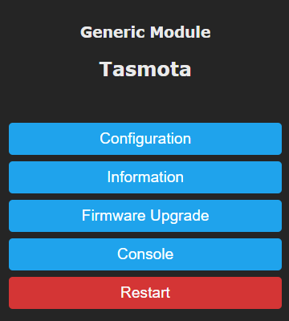
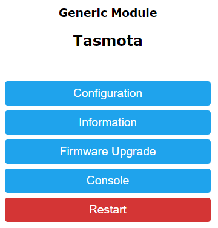
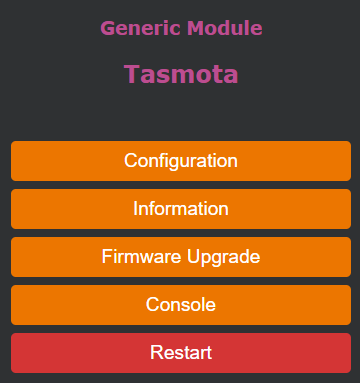
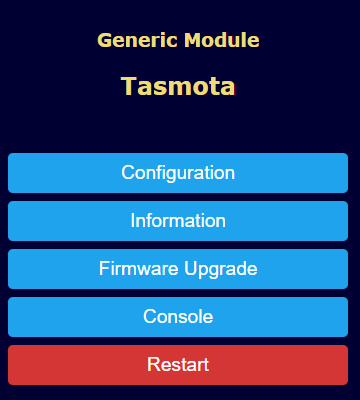
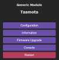
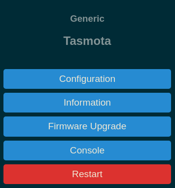

Tasmota's web user interface is a practical way to control and manage your tasmotized device. 

!!! warning
    WebUI **does not** and **can not** have all the features and commands implemented. For precise and complete control use Console or MQTT commands!

To access the WebUI use your device's IP address in your favorite web browser.

By default, WebUI starts in unprotected admin mode which allows complete access to your device to anyone with access to that IP.

If you want to restrict other users to only control through the WebUI, use [`WebServer 1`](Commands#webserver).

Command [`WebPassword`](Commands#webpassword) will set up a password that needs to be entered when trying to access WebUI. This is a very thin layer of protection since everything is transmitted over unencrypted HTTP protocol.
 
## Menus
#### Configuration
Configuration menu allows you to configure everything from components to Wi-Fi and gives you the option to backup and restore the configuration in a secure location.

#### Information
Displays a single page loaded with information about the device including: current Tasmota version, Wi-Fi AP data, MQTT host data, and more

#### Firmware Upgrade
An easy to use menu to initiate a firmware [upgrade](Upgrading.md) from an uploaded `.bin` file or an OTA server.

#### Console
Terminal access to Tasmota. Issue [commands](Commands.md) here or follow the information stream. Useful for debugging when using [˙Weblog 4`](Commands.md#weblog).

## Customizing

### WebButton

Change names of the toggle buttons using [`WebButton`](Commands#webbutton). 

### Themes
WebUI is themable using [`WebColor`](Commands.md#webcolor) commands. 

To apply a theme from below copy the entire code block and send it using the console or via MQTT.

#### Dark (default theme)


```haskell
WebColor {"WebColor":["#eaeaea","#252525","#4f4f4f","#000000","#dddddd","#65c115","#1f1f1f","#ff5661","#008000","#faffff","#1fa3ec","#0e70a4","#d43535","#931f1f","#47c266","#5aaf6f","#faffff","#999999","#eaeaea"]}
```
<br>

#### Light (default until 6.7.1.)


```haskell
WebColor {"WebColor":["#000000","#ffffff","#f2f2f2","#000000","#ffffff","#000000","#ffffff","#ff0000","#008000","#ffffff","#1fa3ec","#0e70a4","#d43535","#931f1f","#47c266","#5aaf6f","#ffffff","#999999","#000000"]}
```
<br>

#### Halloween


```haskell
WebColor {"WebColor":["#cccccc","#2f3133","#3d3f41","#dddddd","#293134","#ffb000","#293134","#ff5661","#008000","#ffffff","#ec7600","#bf5f00","#d43535","#931f1f","#47c266","#5aaf6f","#ffffff","#999999","#bc4d90"]}
```
<br>

#### Navy 


```haskell
WebColor {"WebColor":["#e0e0c0","#000033","#4f4f4f","#000000","#dddddd","#a7f432","#1e1e1e","#ff0000","#008000","#ffffff","#1fa3ec","#0e70a4","#d43535","#931f1f","#47c266","#5aaf6f","#ffffff","#999999","#eedd77"]}
```

<br>

#### Purple Rain 


```haskell
WebColor {"WebColor":["#eaeaea","#252525","#282531","#eaeaea","#282531","#d7ccff","#1d1b26","#ff5661","#008000","#faffff","#694fa8","#4d3e7f","#b73d5d","#822c43","#1f917c","#156353","#faffff","#716b7f","#eaeaea"]}
```

<br>

#### Solarized Dark


```haskell
WebColor {"WebColor":["#839496","#002b36","#073642","#839496","#002b36","#839496","#073642","#b58900","#859900","#eee8d5","#268bd2","#185886","#dc322f","#90211f","#859900","#647300","#839496","#073642","#839496"]}
```

<br style="clear: both;">

!!! tip
    When using an MQTT client such as `mosquitto_pub`, enclose the message payload in single quotes (`'`)

```
mosquitto_pub -h 192.168.1.20 -t "cmnd/myTopic/WebColor" -m '{"WebColor":["#eaeaea","#252525","#4f4f4f","#000000","#dddddd","#65c115","#1f1f1f","#ff5661","#008000","#faffff","#1fa3ec","#0e70a4","#d43535","#931f1f","#47c266","#5aaf6f","#faffff","#999999","#eaeaea"]}'
```
