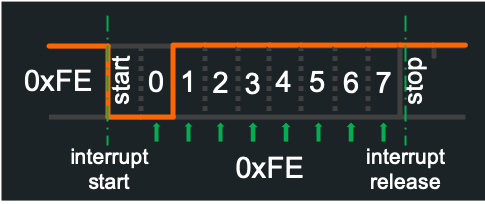
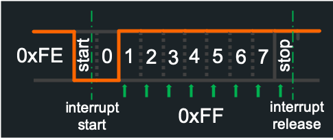
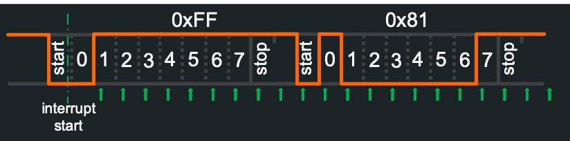

# Zigbee internals
[Back to Zigbee](Zigbee)

This page is for developers who want to understand how Zigbee2Tasmota (Z2T) works and its implementation details.

## CC2530 Serial protocol
The CC2530 is flashed with Texas Instrument ZNP Software version 1.2. The protocol is build on a serial communication between the main cpu and the CC2530.

[Z-Stack 1.2 Monitor and Test API](/docs/_media/zigbee/Z-Stack_API_1_2.pdf)

Serial communication is configured as 8N1, 115200 bauds. We suggest to use GPIO13/15 because they have hardware serial support. Please note that there is only one usable hardware serial, either on GPIO1/3 or GPIO13/15.

To enable hardware serial on GPIO13/15 for Tasmota, set `Serial 0` and restart. Otherwise Z2T will use Software serial provided by TasmotaSerial.

Receiving 115200 bauds in software is a timing challenge. Here is the anatomy of a byte transmitted in serial mode. Each bit is 8.7µs, or ~700 CPU cycles at 80MHz (1400 cycles at 160MHz).

It all starts with a LOW "start bit" that generates an interrupt transferred to TasmotaSerial. Then TasmotaSerial enters a tightly controlled loop to read each bit (least sifnificant first). The frame stops with a HIGH stop bit.


What can go wrong? Tasmota may be already handling an interrupt when the start bit arrives, potentially causing a shift by 1 bit and a wrong message.

Here is a 0xFE byte correctly received:



Same frame with a delay in the interrupt handler, and mistakenly read 0xFF:



TasmotaSerial has been improved to allow receiving a train of bytes withtout any disruption.

CC2530 generally sends all the bytes one after the other for a single ZNP message (up to 250 bytes). Instead of giving back control after the first byte, the TasmotaSerial interrupt handler continues to monitor the serial RX line for the next 4 bits and checks whether a new start bit arrived. It avoids any error after the first byte was received.



Still the first byte in the message could have been wrong. Fortunately, the first byte sent by ZNP is always 0xFE (see below). This means that if the interrupt arrives too late, Tasmota will read 0xFF instead of 0xFE. Z2T software does automatic error correction in this case, i.e. if the first byte received is 0xFF, it is automatically assumed to be 0xFE and the rest of the message is read normally.

With these two schemes, software serial for Zigbee proved to be extremely reliable, even at 80MHz. It is highly recommended though to run at 160MHz.

## State machine - CC2530 initialization and configuration
After Tasmota boots, it sends the sequence `410001` to force a CC2530 hardware reset. Z2T implements an asynchronous state machine to handle the initialization and configuration of the CC2530. The state machine sends commands and waits for responses (with time-outs) and takes different branches depending on the responses.

### Instruction set

The program is encoded as a list of 32 bits instructions, stored in Flash in the `zb_prog` array of type `Zigbee_Instruction[]`. There is a PC (program counter) that is increased at each tick (i.e. every 50ms).

The state machine has very simple instructions.

Instructions encoded with 4 bytes:

* `NOOP`: no-operation, do nothing and move to the next instruction
* `LABEL(x)`: no-operation, and defines a Label (8 bits) that can be called by code.
* `GOTO(x)`: moves the PC to the instruction with LABEL(x)
* `ZI_ON_ERROR_GOTO(x)`: if an error occurs, move to label <x>
* `ZI_ON_TIMEOUT_GOTO(x)`: if a timeout occurs, move to lavel <x>
* `WAIT(y)`: wait for <y> milliseconds (unsigned 16 bits). Note the granularity is 50ms and the wait is non-blocking
* `WAIT_FOREVER`: pause the state machine and wait for an external goto
* `STOP`: stop completely the state machine, only used after an unrecoverable error

Instructions encoded with 8 bytes:

* `CALL(f, x)`: call a function, <f> is the address of the function of type `uint32_t f(uint8_t)`. The input parameter is <x>. The response is according to callbacks responses, except `-1` (time-out) simply continues the flow.
* `LOG(m)`: log the string <m>. <m> can be in PROGMEM. For debugging only.
* `MQTT_STATE(x, m)`: sends a MQTT `ZbState` message, with status code <x> and message <m>. <m> can be in PROGMEM.
* `SEND(d)`: send a ZNP sequence to CC2530. <d> is an array of <uint8_t>, a macro computes automatically the size of the array. <d> can be in PROGMEM.
* `WAIT_RECV(x, m)`: wait for a specific message <m> to be received with a time-out of <x> (uint16_t). Messages take into account are owly those matching the first 2 bytes. The complete message match is expected or an error is generated. If the message received is longer than <m>, additional bytes are ignored
* `WAIT_UNTIL(x, m)`: similar to `WAIT_RECV` but message that don't match are ignored, until a matching message is received.
* `ON_RECV_UNEXPECTED(f)`: if we received an unexpected (or unsupported) zigbee message, call function <f>


Instructions encoded with 12 bytes:

 * `WAIT_RECV_FUNC(x, m, f)`: similar to `WAIT_RECV` and a function <f> is called when the message matches.

All callbacks return `int32_t` with the following effect:

* `> 0`: goto the corresponding label
* `0`: continue
* `-1`: signal a time-out
* `< -1`: trigger an error (goto on\_error) 

### Initialization code for the state machine
At Tasmota start-up, the state-machine fires. The current Z2T pseudo-code does the following:

Init:

* Set-up all the error handling functions
* Wait for 10.5 seconds after boot
* Send a RESET to CC2530
* Wait for CC2530 boot

Check configuration (if something is wrong, go to CONFIGURE):

* Check if the CC2530 was previously configured. It uses the same 1-byte Non-Volatile 0xF00 address and stores 0x55.
* Checks the Z-Stack version
* Checks the internal configuration: PanID, Ext PanID, Channel, PFGK and PFGKEN.
* If all good, emit an MQTT message saying Zigbee is configured
* Goto Start

Configure (only if needed):

* Emit an MQTT message for reconfiguration
* Do a factory reset of CC2530
* Reset the device once again
* Configure the following: PanId, Ext PanId, Channel, set type to Coordinator, PFKEY, PFKEYEN, Security Module
* Create NF 0xF00 location and store 0x55
* Goto Start

Start:

* Wait for CC2530 message saying the coordinator sucessfully started
* Query DeviceInfo
* Query Node Descriptor
* Query Active Endpoints
* Register 2 endpoints with profile 0x0104 (Home Automation) : 0x01 (default), 0x0B (for Xiaomi)
* Query Active Endpoints to verify 0x01 and 0x0B are active
* Close PermitJoin: don't accept any pairing
* Emit an MQTT message to indicate Zigbee started
* Mark Zigbee as initialized, accept incoming messages
* Load device configuration from Flash
* Query any lights declared with `ZbLight` to read their current states
* Pause the state machine

## Pairing devices
When you open pairing with `ZbPermitJoin 1` (60 seconds) or `ZbPermitJoin 99` (until next reboot), you allow new devices to join the network.

Example below is for an OSRAM Plug.

When a new devices joins, Z2T receives a TC Device Indication: `ZDO_TC_DEV_IND` (45CA) message with the device short (16 bits) address and IEEEAddress (64 bits).

```json
16:39:26 MQT: tele/Zigbee_home/RESULT = {"ZbState":{"Status":30,"IEEEAddr":"0x7CB03EAA0A0292DD","ShortAddr":"0xF75D","PowerSource":true,"ReceiveWhenIdle":true,"Security":false}}
```

Z2T then queries the device for additional information, like `ZbProbe` would do.

First probe for Active Endpoint `ZDO_ACTIVE_EP_REQ`

```json
16:39:26 MQT: tele/Zigbee_home/RESULT = {"ZbState":{"Status":32,"ActiveEndpoints":["0x03"]}}
```

Finally query for the following general attributes: Manufacturer Id and Model Id.

```
16:39:26 ZIG: ZbZCLRawReceived: {"0xF75D":{"0000/0004":"OSRAM","0000/0005":"Plug 01"}}
16:39:26 MQT: tele/tasmota/Zigbee_home/SENSOR = {"ZbReceived":{"0xF75D":{"Manufacturer":"OSRAM","ModelId":"Plug 01","Endpoint":3,"LinkQuality":36}}}
```