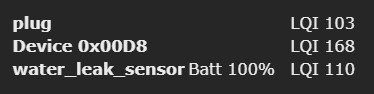

!!! info "Zigbee2Tasmota serves as a gateway for devices connected to a Zigbee wireless network to bridge their communications over to Wi-Fi"

!!! warning "If you are using [ZHA](https://www.home-assistant.io/integrations/zha/) or [Zigbee2MQTT](https://www.zigbee2mqtt.io/) via [Ser2Net](Serial-to-TCP-Bridge.md), Tasmota is only passing bytes between the controller (HA or Z2M) and the Zigbee MCU. Please refer to their respective sites to ask any question. All of the below is dedicated to Zigbee2Tasmota mode."

Zigbee2Tasmota (Z2T) is a lightweight Zigbee gateway/bridge solution running on ESP8266/ESP8285 or ESP32 Wi-Fi chips. Hence it is easier to deploy wherever you want in your home. It was inspired by Zigbee2MQTT but it was written from scratch to make it fit into the resource constraints of a ESP82xx chip with just 80kB of RAM and only 1MB of flash memory.

For quick reference about Zigbee commands see [Zigbee Commands](Commands.md#zigbee). 

## Hardware

Zigbee2Tasmota (Z2T) supports a wide variety of Zigbee MCUs from Texas Instruments (CC253X, CC26x2, CC13x2) and from Silicon Labs (EFR32MG12/EFRMG21), and runs on ESP8266 or any variant of ESP32. Since ESP8266 has very limited resources, we strongly advise to prefer ESP32 based Zigbee gateways.

Flashing and installation instructions for **ESP32** based:

- [Sonoff Zigbee Bridge Pro](https://zigbee.blakadder.com/Sonoff_ZBBridge-P.html)
- [ZB-GW03 eWeLink Ethernet Zigbee Gateway (also sold as EACHEN Zigbee Smart Hub and SmartWise Zigbee Bridge Pro)](https://templates.blakadder.com/ewelink_ZB-GW03)
- [Tube's Ethernet Zigbee Gateway (EFR32 varient)](https://templates.blakadder.com/tube_TUBE013_EFR32.html)
- [DIY Zigbee gateway/bridge device example based on Ebyte E180-ZG120B or E180-ZG120B-TB](https://github.com/zigpy/zigpy/discussions/584)

Flashing and installation instructions for **ESP8266** based:

- [Sonoff ZBBridge by ITead](https://zigbee.blakadder.com/Sonoff_ZBBridge.html)
- [CC2530 based devices](CC2530.md)
- [DIY Zigbee gateway/bridge device example based on IKEA TRÅDFRI ICC-A-1 Module](https://github.com/MattWestb/IKEA-TRADFRI-ICC-A-1-Module/tree/master/Tasmota)

A complete list of compatible Zigbee coordinators and Zigbee devices compatible with Z2T is in the [Zigbee Device Compatibility Repository](https://zigbee.blakadder.com/zigbee2tasmota.html). 

### Advanced topic: ZNP or EZSP

Z2T supports MCU running either the ZNP or EZSP zigbee stack. They require different compilation options but from a user point of view the features are very similar.

Z-Stack or ZNP (Zigbee Network Processor) is an open-source Zigbee stack from Texas Instruments and run TI MCUs. Ready to use firmwares are found on [Koenkk's Github](https://github.com/Koenkk/Z-Stack-firmware). Older CC2530 require special wiring or external devices for flashing, while more recent like Sonoff Zigbee Bridge Pro (CC2652P) can be flashed directly from Tasmota. Z2T supports ZNP **version 2.6** (Z-Stack 1.3) and **version 2.7** (Z-Stack 3.x).

EZSP (EmberZNet Serial Protocol) is a commercial Zigbee stack from [Silicon Labs](https://www.silabs.com/). Sonoff/Eachen require encrypted signed firmwares, they can be found in [here](https://github.com/arendst/Tasmota/tree/development/tools). Z2T supports EZSP versions 6.7.6 or above (EZSP protocol v8), recommended is **v6.7.9**.

## Introduction
Before using Zigbee with Tasmota, you need to understand a few concepts. Here is a simplified comparison to the Wi-Fi equivalent (sort of).

|Zigbee concept|Wi-Fi equivalent|
|---|---|
|**Zigbee coordinator**<BR>The coordinator is responsible for selecting the channel, PanID, security policy, and stack profile for a network. Zigbee2Tasmota will act as a coordinator.<BR>You can have multiple coordinators as long as they have different PanIDs.|Wi-Fi Access Point|
|**PanID**<BR>(Personal Area Network IDentifier)<BR>This parameter is unique in a Zigbee network (16-bit integer, 0x0000–0x3FFF).<BR>At initial start a pseudo-random PanID is derived from the ESP MAC address.|SSID (the Wi-Fi network name)|
|**ShortAddr**<BR>Address of the device on the Zigbee network. This address is randomly assigned when the device first connects to the coordinator (16 bits integer, 0x0000–0xFFF7). The coordinator has address 0x0000.<BR>You need to track which device has which address or assign a "Friendly Name" to each new discovered device.|IP address|
|**GroupAddr**<BR>Group address of a collection of devices, it allows a single message to address multiple devices at once (16 bits integer, 0x0000–0xFFFF). For example a remote can turn on/off a group of lights. GroupAddr 0x0000 is not assigned.|Multicast|
|**Endpoint**<BR>The endpoint on the coordinator or on the Zigbee device the message is sent from/to. You can see endpoints as logical device providing distinct features (8 bits integer, 1–240).|IP Port|
|**IEEEAddr**<BR>Device hardware address (64 bits). This is unique per device and factory assigned.|MAC address|
|**Channel** 11-26<BR>*Default: 11* (See [Zigbee-Wifi coexistence](https://www.metageek.com/training/resources/zigbee-wifi-coexistence.html))|Wi-Fi Channel|
|**Encryption Key**<BR>128-bit encryption key.<BR>At initial start a pesudo-random Encryption key is derived from the ESP MAC address.|Wi-Fi password|
|**Pairing**<BR>By default the coordinator does not accept new devices unless put in pairing mode. When in pairing mode, it will accept pairing requests from any device within range.<BR>*Default: pairing disabled*|WPS|
|**Cluster**<BR>Clusters are a group of commands and attributes that define what a device can do. Think of clusters as a group of actions by function. A device can support multiple clusters to do a whole variety of tasks. The majority of clusters are defined by the ZigBee Alliance and listed in the [ZigBee Cluster Library](https://zigbeealliance.org/wp-content/uploads/2019/12/07-5123-06-zigbee-cluster-library-specification.pdf)| |

## Configuration

### Initial start

When you first start Z2T, pseudo-random parameters are derived from your device unique identifiers (MAC address...) for PanID and network encryption keys.

**Sonoff Zigbee Bridge Pro** (ESP32 + CC2652P with ZNP)

``` json
19:02:20.659 ZIG: rebooting ZNP device
19:02:22.960 ZbInput discarding byte 00
19:02:22.962 RSL: RESULT = {"ZbState":{"Status":1,"Message":"CCxxxx ZNP booted","RestartReason":"Power-up","MajorRel":2,"MinorRel":7}}
19:02:23.160 RSL: RESULT = {"ZbState":{"Status":50,"MajorRel":2,"MinorRel":7,"MaintRel":1,"Revision":20220219}}
19:02:23.311 RSL: RESULT = {"ZbState":{"Status":2,"Message":"Resetting configuration"}}
19:02:25.359 ZbInput discarding byte 00
19:02:25.911 RSL: RESULT = {"ZbState":{"Status":3,"Message":"Configured, starting coordinator"}}
19:02:30.062 RSL: RESULT = {"ZbState":{"Status":40,"NewState":9,"Message":"Started as coordinator"}}
19:02:30.162 RSL: RESULT = {"ZbState":{"Status":51,"IEEEAddr":"0x00124B0026B684E4","ShortAddr":"0x0000","DeviceType":7,"DeviceState":9,"NumAssocDevices":0}}
19:02:30.713 RSL: RESULT = {"ZbState":{"Status":0,"Message":"Started"}}
19:02:30.715 ZIG: Zigbee started
19:02:30.720 ZIG: No Zigbee device information
19:02:30.732 ZIG: Zigbee device data in File System (31 bytes)
```

**Sonoff Zigbee Bridge** (ESP8266 + EFR32 with EZSP)

``` json
19:08:26.057 ZIG: Resetting EZSP device
19:08:27.261 RSL: RESULT = {"ZbState":{"Status":1,"Message":"EFR32 EZSP booted","RestartReason":"Power-on","Code":2}}
19:08:27.315 RSL: RESULT = {"ZbState":{"Status":55,"Version":"6.7.8.0","Protocol":8,"Stack":2}}
19:08:27.316 RSL: RESULT = {"ZbState":{"Status":3,"Message":"Configured, starting coordinator"}}
19:08:28.758 RSL: RESULT = {"ZbState":{"Status":56,"IEEEAddr":"0x680AE2FFFE6E103B","ShortAddr":"0x0000","DeviceType":1}}
19:08:28.759 RSL: RESULT = {"ZbState":{"Status":2,"Message":"Resetting configuration"}}
19:08:44.260 ZIG: Resetting EZSP device
19:08:45.463 RSL: RESULT = {"ZbState":{"Status":1,"Message":"EFR32 EZSP booted","RestartReason":"Power-on","Code":2}}
19:08:45.518 RSL: RESULT = {"ZbState":{"Status":55,"Version":"6.7.8.0","Protocol":8,"Stack":2}}
19:08:45.520 RSL: RESULT = {"ZbState":{"Status":3,"Message":"Configured, starting coordinator"}}
19:08:46.822 ZIG: Factory reset EZSP device
19:08:47.053 ZIG: Subscribe to group 0 'ZbListen0 0'
19:08:47.108 RSL: RESULT = {"ZbState":{"Status":0,"Message":"Started"}}
19:08:47.108 ZIG: Zigbee started
19:08:47.138 ZIG: No Zigbee device information
19:08:47.145 ZIG: No Zigbee device data
```

When you further restart, logs are slightly shorter (less lines) since the MCU is already configured.

### Customize Zigbee configuration

At initial start, Tasmota generates pseudo-random Zigbee parameters. They should  work out of the box but you also may want to choose different values:

You the command `ZbConfig` to dump the current configuration. For example it might return `{"ZbConfig":{"Channel":11,"PanID":"0x1A63","ExtPanID":"0xCCCCCCCCCCCCCCCC","KeyL":"0x0F0D0B0907050301","KeyH":"0x0D0C0A0806040200"}}`

To apply a new configuration, populate the fields you want to change in a single-level JSON:

`ZbConfig {"Channel":11,"PanID":"0x1A63","ExtPanID":"0xCCCCCCCCCCCCCCCC","KeyL":"0x0F0D0B0907050301","KeyH":"0x0D0C0A0806040200"}`

!!! info "Changing any parameter with `ZbConfig` requires to re-pair all devices.

|Parameter|Description|
|---|---|
|Channel|`11-26` Zigbee radio channel, see above|
|PanID|`0x0001-0x3FFF` unique Zigbee network identifier. You should not have too coordinator using the same PanID, or bad things happen.<BR>If your coordinator fails to start, try changing the PanID as it may conflict with one already in use.|
|ExtPanID|This is a 64 bit unique identifier for the network. It is not much used in Z2T but needs to be unique.|
|KeyL KeyH|This is the 128 bit network encryption key split into High and Low 64 bit parts. Do not reveal this key or anyone can decrypt your Zigbee traffic|
|TxRadio|On some devices you can set the radio power in dBm. You generally don't need to change it|

### Advanced topic: GPIOs

You will usually find a ready to use template in the [Zigbee Device Compatibility Repository](https://zigbee.blakadder.com/zigbee2tasmota.html)

Below are the details for GPIO configuration needed by Zigbee:

|GPIO|Description|
|---|---|
|`Zigbee Tx` and `Zigbee Rx`|GPIOs used for serial communication between Tasmota and the MCU (needed for both ZNP and EZSP). Communication is always 115200 bps 8N1.|
|`Zigbee Rst 1`|(optional) defines the hardware Reset for the Zigbee MCU. If not defined, Z2T will fallback to sending a soft-reset the MCU using a special serial sequence (which may fail on rare occasions).|
|`Zigbee Rst 2`|(optional) defines a special pin used to put the MCU in bootloader and flashing mode when the hardware reset is pulled down. This is used both by EFR32 and CC2652P based devices. It allows to flash the MCU directly from Tasmota.|
|`LedLink` or `LedLink_i`|(optional) when defined, this led keeps its normal Wifi/MQTT status indicator (blinking) and adds a glowing light when Permit Join is active (i.e. new devices are allowed to pair).|
|`Led 1` or `Led_i 1`|(optional) when defined, is used as an indicator of traffic between Tasmota and MCU, which generally means Zigbee traffic is sent or received|

### Advanced topic: Hardware or Software serial

On **ESP32** serial is always handled by hardware so you don't need to bother.

On **ESP8266** using the hardware serial is preferred. To do so, you need to use GPIOs 13/15 for Zigbee Rx/Tx and set `SerialLog 0`. Doing such, Z2T 'steals' the hardware UART from the serial console and uses it for communicating with the MCU. Otherwise Z2T uses Software Serial which requires compiling at 160MHz and might be unreliable on very rare occasions.

## Usage

For a list of available commands see [Zigbee Commands](Commands.md#zigbee).  

## Pairing Devices

When you create a new Zigbee network, it contains no devices except the coordinator (your Zigbee gateway). The first step is to add devices to the network, which is called **pairing**.

By default, and for security reasons, the Zigbee coordinator does not automatically accept new devices. To pair new devices, use [`ZbPermitJoin 1`](Commands.md#zbpermitjoin) or press **Permit Join** in the WebUI and allows accepting new devices for the next 60 seconds. Then put your Zigbee device pairing mode. This is usually accomplished by pressing the button on the device for 5 seconds or more.

`ZbPermitJoin 1`
```json
CMD: ZbPermitJoin 1
MQT: stat/%topic%/RESULT = {"ZbPermitJoin":"Done"}
MQT: tele/%topic%/RESULT = {"ZbState":{"Status":21,"Message":"Enable Pairing mode for 60 seconds"}}
```

60 seconds later:

```json
MQT: tele/%topic%/RESULT = {"ZbState":{"Status":20,"Message":"Disable Pairing mode"}}
```

After the device has successfully paired it will be shown in the webui with its short address and its link quality number (LQI). When it is a battery powered device, the battery percentage will be displayed as soon as it is received from the device.

*TODO: update screenshot*


Devices will show friendly name once you set it.

### Setting Friendly Name

Instead of a short address like `0x8F20` you can assign a, memorable, friendly name such as `"Bedroom_Sensor"`.

See [`ZbName`](Commands.md#zbname) command for all options.

!!! example "Xiaomi Aqara Cube with address `0x128F`"
```json
MQT: tele/%topic%/RESULT = {"ZbReceived":{"0x128F":{"AqaraVibrationMode":"tilt","AqaraVibrationsOrAngle":162,"AqaraAccelerometer":[-690,2,138],"AqaraAngles":[-78,0,11],"LinkQuality":158}}}
```

Setting its friendly name to `Vibration_sensor`:
```json
ZbName 0x128F,Vibration_sensor
CMD: ZbName 0x128F,Vibration_sensor
MQT: stat/%topic%/RESULT = {"0x128F":{"Name":"Vibration_sensor"}}

(10 seconds later)
ZIG: Zigbee Devices Data store in Flash (0x402FF800 - 270 bytes)
```

Now the sensor readings includes the friendly name:
```json
MQT: tele/%topic%/RESULT = {"ZbReceived":{"0x128F":{"Name":"Vibration_sensor","AqaraVibrationMode":"tilt","AqaraVibrationsOrAngle":171,"AqaraAccelerometer":[-691,12,130],"AqaraAngles":[-78,1,11],"LinkQuality":153}}}
```

If you set [`SetOption83 1`](Commands.md#setoption83) sensor readings will use the friendly name as JSON key, short address is added as `Device`:
```json
MQT: tele/%topic%/RESULT = {"ZbReceived":{"Vibration_sensor":{"Device":"0x128F","AqaraVibrationMode":"tilt","AqaraVibrationsOrAngle":171,"AqaraAccelerometer":[-691,8,136],"AqaraAngles":[-78,1,11],"LinkQuality":153}}}
```


### Removing Devices

A zigbee will continue to connect to a coordinator unless you ask it to "leave" or if you change the network configuration (change of PanID or network key - which means losing ALL devices).

To ask a device to leave the network, use command `ZbLeave <device>` or `ZbLeave <friendlyname>`. This sends a message to the device, which needs to be awake to process it. For battery powered devices, you need to wake them up when sending this command. Unfortunately there is no confirmation message sent back. Note: even if the device left the network, it is still registered in Z2T and continues to appear on the UI. To remove it from the list, use `ZbForget` below.

To remove a device from Zigbee2Tasmota list of devices and from the UI, use command `ZbForget <device>` or `ZbForget <friendlyname>`. If the device is still connected to the network, it will pop up again later. I.e. ZbForget does not remove a device from the network; else use `ZbLeave` above.


### Advanced topic: Sending sensor values to separated MQTT topics

It is possible to publish the sensor values to their own MQTT topic. For this functionality the following rule can be applied in the console:
```
Rule<x>
  on zbreceived#<zigbee_id>#<zigbee_sensorname> do publish home/zigbee/<zigbee_name>/<sensorname> %value% endon
	
Rule<x> 1
```

For example:
```
Rule1
  on zbreceived#0xAA7C#humidity do publish home/zigbee/office/humidity %value% endon
  on zbreceived#0xAA7C#temperature do publish home/zigbee/office/temperature %value% endon

Rule1 1
```

If retained values are prefered use publish2 instead of publish.

## Quick start

In this section, we'll give a quick overview of 2 devices:
	
- [Sonoff SNZB-02 Temperature And Humidity Sensor](https://zigbee.blakadder.com/Sonoff_SNZB-02.html)

{ width="150" }

- [BlitzWolf SHP15 Power Monitoring Plug](https://zigbee.blakadder.com/BlitzWolf_BW-SHP15.html)

{ width="150" }

### Advanced topic: logs when pairing

This is an example of a pairing process for the [Aqara Temperature & Humidity Sensor](https://zigbee.blakadder.com/Xiaomi_WSDCGQ11LM.html). To pair this sensor, issue `ZbPermitJoin 1` and then press and hold the reset button for 5 seconds. The sensor LED will flash several times and you will see log entries in the console, especially this one:

```json
MQT: tele/%topic%/SENSOR = {"ZbState":{"Status":30,"IEEEAddr":"0x00158D00036B50AE","ShortAddr":"0x8F20","PowerSource":false,"ReceiveWhenIdle":false,"Security":false}}
```

Message with `"Status":30` shows some characteristics of the device:

|Field name|Value|
|---|---|
|`Status`|`30` indicates a device connect or reconnect. This is the opportunity to match IEEEAddress and short address|
|`IEEEAddr`|Long unique address (64 bits) of the device - factory set|
|`ShortAddr`|Short address (16 bits) randomly assigned to the device on this Zigbee network|
|`PowerSource`|`true` = the device is connected to a power source<BR>`false` = the device runs on battery|
|`ReceiveWhenIdle`|`true` = the device can receive commands when idle<BR>`false` = the device is not listening. Commands should be sent when the device reconnects and is idle|
|`Security`|Security capability (meaning unknown, to be determined)|


## Reading Sensors
Most sensors will publish their readings regularly or once a significant change has happened: temperature, pressure, humidity, presence, illuminance...

Sensor messages are published via MQTT when they are received from the Zigbee device. Similar to Zigbee2MQTT, Z2T tries to group and debounce sensor values when they are received within a 300ms window.

!!! example "Aqara Temperature & Humidity Sensor"


This sensor monitors humidity, temperature, and air pressure.  Its Zigbee model ID is `lumi.weather`.

This device publishes sensor values roughly every hour or when a change occurs. You can also force an update pressing the device's button. It sends two kinds of messages, either 3x standard Zigbee messages, or a single proprietary message containing all sensor values.  

`0x8F20` is the ShortAddress of the sensor, and its name is `Kitchen` if you used `ZbName 0x8F20,Kithchen`.

```json
MQT: tele/%topic%/SENSOR ={"ZbReceived": {"0x8F20": {"Name": "Kitchen", "Voltage": 2.995, "Battery": 98, "Temperature": 21.01, "Humidity": 53.68, "Pressure": 1004.04, "PressureUnit": "hPa", "Endpoint": 1, "LinkQuality": 88}}
```

or prefixed by name if you set `SetOption83 1`

```json
MQT: tele/%topic%/SENSOR ={"ZbReceived": {"Kitchen": {"Device": "0x8F20", "Voltage": 2.995, "Battery": 98, "Temperature": 21.01, "Humidity": 53.68, "Pressure": 1004.04, "PressureUnit": "hPa", "Endpoint": 1, "LinkQuality": 88}}
```

Topic is device specific, to allow more effective retained messages, if you set `SetOption89 1`

```json
MQT: tele/%topic%/8F20/SENSOR ={"ZbReceived": {"Kitchen": {"Device": "0x8F20", "Voltage": 2.995, "Battery": 98, "Temperature": 21.01, "Humidity": 53.68, "Pressure": 1004.04, "PressureUnit": "hPa", "Endpoint": 1, "LinkQuality": 88}}
```


Supported values:  

|Field name|Value|
|---|---|
|`LinkQuality`|Stength of the Zigbee signal, between 1 and 254 (integer). See this [ZigBee and WiFi Coexistence](https://www.metageek.com/training/resources/zigbee-wifi-coexistence.html)|
|`Humidity`|Humidity in percentage (float)|
|`Pressure` and `PressureUnit`|Atmospheric pressure (float) and unit (string)<BR>Currently only `hPa` (A.K.A. mbar) is supported|
|`Temperature`|Temperature in Celsius (float)|
|`Voltage`|Battery voltage (float)|
|`Battery`|Battery charge in percentage (integer)|
|`ModelId`|Model name of the Zigbee device (string)<BR>Ex: `lumi.weather`|
|`ScaledValue` and `Scale`|Give the raw measure and the scale correction as 10^scale|
|And many more...||

If a value is not decoded, it will appear as `"<cluster>_<attr>":<value>` where `<cluster>` is the Zigbee ZCL Cluster of the attribute (family), `<attr>` is the attribute number and `<value>` its published value.

!!! example
    `"0402_0000":2240` is attribute 0x0000 from cluster 0x0402, which is the temperature in hundredth of °C. It is automatically converted to `"Temperature":22.40`.

## Device Information
You can dump the internal information gathered about connected Zigbee devices with the command [`ZbStatus`](Commands.md#zigbeestatus).

You can use `ZbStatus2` to display all information and endpoints. If probing was successful (at pairing time or using `ZbProbe`), Tasmota will automatically find the right endpoint.

Depending on the number of devices you have, `ZbStatus2` output can exceed the maximum MQTT message size. You can request the status of each individual device using `ZbStatus2 1`, `ZbStatus2 2`, `ZbStatus2 3` or `ZbStatus2 <friendly_name>`

`ZbStatus1` - List all connected devices  
```json
{"ZbStatus1":[{"Device":"0x6B58"},{"Device":"0xE9C3"},{"Device":"0x3D82"}]}
```

`ZbStatus2` - Display detailed information for each device, including long address, model and manufacturer ID:  
```json
{"ZbStatus2":[{"Device":"0x4773","IEEEAddr":"0x7CB03EAA0A0292DD","ModelId":"Plug 01","Manufacturer":"OSRAM","Endpoints":["0x03"]},{"Device":"0x135D","Name":"Temp_sensor","IEEEAddr":"0x00158D00036B50AE","ModelId":"lumi.weather","Manufacturer":"LUMI","Endpoints":["0x01"]}]}
```

_(formatted for readability)_  
```json
{
	"ZbStatus2": [{
		"Device": "0x4773",
		"IEEEAddr": "0x7CB03EAA0A0292DD",
		"ModelId": "Plug 01",
		"Manufacturer": "OSRAM",
		"Endpoints": ["0x03"]
	}, {
		"Device": "0x135D",
		"Name": "Temp_sensor",
		"IEEEAddr": "0x00158D00036B50AE",
		"ModelId": "lumi.weather",
		"Manufacturer": "LUMI",
		"Endpoints": ["0x01"]
	}]
}
```

`ZbStatus3` - Display detailed information for each device, including long address, model and manufacturer ID and a list of endpoints and clusters

## Understanding Endpoints and Clusters

An endpoint supports different functions separated in clusters and a device can have multiple endpoints to do different things. To simplify, think of your Zigbee device as a normal Tasmota device with a Zigbee radio instead of Wi-Fi. Each endpoint is akin to a GPIO that has connected [Components](Components) or Clusters, in Zigbee terms.

Cluster definitions in relation to their endpoint are determined by [Zigbee Alliance](https://zigbeealliance.org/wp-content/uploads/2019/12/07-5123-06-zigbee-cluster-library-specification.pdf). Not all manufacturers followed the proposed allocations but in general it is a cornerstone document.

Z2T will automatically take the first endpoint in the list which works most of the time. You normally don't need to specify the endpoint number. In rare cases, you can force a specific endpoint.

## Sending Device Commands

You can send commands to a device or groups of devices similar to a normal Tasmota command. For example to turn on a light or switch off a plug.

Here is a list of supported commands, see below how to send any unlisted command.

Command|Parameters|Cluster number
-|-|-
Power|`1` or `true` or `"true"` or `"on"`: On <BR> `0` or `false` or `"false"` or `"off"`: Off <BR> `2` or `"toggle"`: Toggle|0x0006
Dimmer|`0..254`: Dimmer value<BR>255 is normally considered as invalid, and may be converted to 254|0x0008
DimmerUp|` `: no parameter. Increases dimmer by 10%|0x0008
DimmerDown|` `: no parameter. Decreases dimmer by 10%|0x0008
DimmerStop|` `: no parameter. Stops any running increase of decrease of dimmer.|0x0008
ResetAlarm|`<alarmcode>,<clusterid>`: (to be documented later)|0x0009
ResetAllAlarms|` `: no parameter, (to be documented later)|0x0009
Hue|`0..254`: change Hue value|0x0300
Sat|`0..254`: change Sat value|0x0300
HueSat|`0..254,0..254`: change both Hue and Sat values|0x0300
Color|`0..65534,0..65534`: change the color using [x,y] coordinates|0x0300
CT|`0..65534`: change the white color-temperature in [mireds](https://en.wikipedia.org/wiki/Mired)|0x0300
Shutter|`0..254`: send any Shutter command (prefer the commands below)|0x0102
ShutterOpen|` `: no parameter, open shutter|0x0102
ShutterClose|` `: no parameter, close shutter|0x0102
ShutterStop|` `: no parameter, stop shutter movement|0x0102
ShutterLift|`0..100`: move shutter to a specific position in percent<BR>`0`%=open, `100`%=closed|0x0102
ShutterTilt|`0..100`: move the shutter to the specific tilt position in percent|0x0102

The format of the command is following:

`ZbSend {"Device":"<device>","Send":{"<sendcmd>":<sendparam>}}` where<BR>`<device>`identifies the target and can be a shortaddr `0x1234`, a longaddr `0x1234567812345678` or a friendly name `Kitchen`.<BR>
 `"<sendcmd>":<sendparam>` is the command and its parameters from the table.

If the device has been correctly paired and its endpoints recorded by Z2T, you shouldn't need to specify a target endpoint. You can use an option `"endpoint":<endpoint>` parameter if Z2T can't find the correct endpoint or if you want to change from the default endpoint. 

!!! example "MQTT command example"
	Topic = `cmnd/ZigbeeGateway/ZbSend`<BR>
	Payload = `{"Device":"0x1234","Send":{"Power":0}}` or `{"Device":"0x1234","Write":{"Power":0}}`
	
### Low-level Commands

There is a special syntax if you want to send arbitrary commands:
`"Send":"<send_bytes>"` where `<send_bytes>` has the following syntax:

`"<cluster>_<cmd>/<bytes>"`: send a non-cluster specific command for cluster id `<cluster>`, command id `<cmd>` and payload `<bytes>`. 

!!! example
    `ZbSend {"Device":"0x1234","Send":"0000_00/0500"}`
     Send a Read command (0x00) to the general cluster (0x0000) for attribute ManufId (0x0005). Note: all values are little-endian.

Or use '!' instead of '_' to specify cluster-specific commands:

`"<cluster>!<cmd>/<bytes>"`: send a cluster specific command for cluster id `<cluster>`, command id `<cmd>` and payload `<bytes>`.

!!! example
    `ZbSend {"Device":"0x1234","Send":"0008!04/800A00"}`
    Send a Dimmer command (0x04) from Level Control cluster (0x0008) with payload being: Dimmer value 0x80, and transition time of 1 second (0x000A = 10 tenths of seconds).

Of course the latter example could be simply:
`ZbSend {"Device":"0x1234","Send":{"Dimmer":"0x80"}`

### Examples

#### Plug

```json
ZbSend { "device":"0x4773", "send":{"Power":"On"} }
ZbSend { "device":"0x4773", "send":{"Power":1} }
ZbSend { "device":"0x4773", "send":{"Power":false} }
ZbSend { "device":"0x4773", "send":{"Power":"Toggle"} }
```

Read the On/Off status: (all three commands below are synonyms)

```json
ZbSend { "device":"0x4773", "endpoint":"0x03", "cluster":"0x0006", "read":"0x0000" }
ZbSend { "device":"0x4773", "endpoint":"0x03", "cluster":"0x0006", "read":["0x0000"] }
ZbSend { "device":"0x4773", "endpoint":3, "cluster":6, "read":0 }
```

```json
MQT: tele/tasmota/SENSOR = {"ZbReceived":{"0x4773":{"Power":true,"LinkQuality":52}}}
```

#### Bulb

```json
ZbSend { "device":"0x3D82", "send":{"Power":"Off"} }
ZbSend { "device":"0x3D82", "send":{"Dimmer":128} }
ZbSend { "device":"0x3D82", "send":{"Dimmer":254} }
ZbSend { "device":"0x3D82", "endpoint":"0x0B", "send":{"Dimmer":0} }
```

## Receiving Commands
If you pair devices such as switches or remotes, you will also receive commands from those devices.

When a command is received, attributes are published both in their low-level and high-level formats (if known).

Low level format is the following: `"<cluster>!<cmd>":"<payload"`

!!! example "IKEA On/Off Switch"
    `{"ZbReceived":{"0x3476":{"Device":"0x3476","Name":"ikea_switch","0006!01":"","Power":1,"Endpoint":1,"LinkQuality":134}}}`
    
    The command received `"0006!01":""` is Power On (0x01) from On/Off cluster (0x0006) with no payload. It is also translated as `"Power":1`. `"Endpoint":1` tells you from which endpoint the command was sent. 

#### Light State Tracking
Once Z2T receives a command related to a light (Power, Dimmer, Color, ColorTemp), it sends right after a Read command to get the actual state of the light. This is used for Hue Emulation and Alexa support. The final attributes are read betwenn 200ms and 1000ms later, to allow for the light to achieve its target state.

!!! example

```json
16:02:04 MQT: tele/%topic%/SENSOR = {"ZbReceived":{"IKEA_remote":{"Device":"0xF72F","0006!02":"","Power":2,"Endpoint":1,"Group":100,"LinkQuality":75}}}
16:02:05 MQT: tele/%topic%/SENSOR = {"ZbReceived":{"IKEA_Light":{"Device":"0x5ADF","Power":true,"Endpoint":1,"LinkQuality":80}}}
16:02:06 MQT: tele/%topic%/SENSOR = {"ZbReceived":{"IKEA_remote":{"Device":"0xF72F","0008!06":"002B0500","DimmerUp":true,"Endpoint":1,"Group":100,"LinkQuality":75}}}
16:02:08 MQT: tele/%topic%/SENSOR = {"ZbReceived":{"IKEA_Light":{"Device":"0x5ADF","Dimmer":102,"Endpoint":1,"LinkQuality":80}}}
```

#### Example 
[Ikea Tradfri Remote](https://zigbee.blakadder.com/Ikea_E1810.html) received commands:

- Short press center button - `"0006!02":""` and `"Power":2`
- Short press dimmer up - `"0008!06":"002B0500"` and `"DimmerUp":true`
- Short press dimmer down - `"0008!02":"012B05000000"` and `"DimmerStep":1`
- Short press arrow right - `"0005!07":"00010D00"` and `"ArrowClick":0`
- Short press arrow left - `"0xF72F","0005!07":"01010D00"` and `"ArrowClick":1`
- Long press dimmer up - `"0008!05":"0054"` and `"DimmerMove":0`
- Long press dimmer up release - `"0008!07":""` and `"DimmerStop":true`
- Long press dimmer down - `"0008!01":"01540000"` and `"DimmerMove":1`
- Long press dimmer down release - `,"0008!03":"0000"` and `"DimmerStop":true`

## Zigbee Binding
Binding allows a device to send command to another device in the same Zigbee network, without any additional logic. For example, you can set a remote to control directly a group of lights, without any rules on the coordinator. The coordinator will still receive all commands.

Example of direct binding    
`ZbBind {"Device":"0xC2EF","ToDevice":"0x5ADF","Endpoint":1,"ToEndpoint":1,"Cluster":6}`

This command links the device `0xC2EF` that will send all commands for cluster `6` (On/off cluster) frome endpoint `1` to the target device `0x5ADF` on endpoint `1`.

Example of group binding    
`ZbBind {"Device":"0xC2EF","ToGroup":100,"Endpoint":1,"Cluster":6}`

This command links the device `0xC2EF` that will send all commands for cluster `6` (On/off clustre) and from endpoint `1` to the group `100`.

Reponse in case of success
```json
MQT: tele/%topic%/RESULT = {"ZbBind":{"Device":"0xF72F","Name":"IKEA_Remote","Status":0,"StatusMessage":"SUCCESS"}}
```

#### Example: IKEA remote and IKEA Light

IKEA remotes only support 1 group and can be linked to a light only via group numbers (no direct binding).

1. Add the light to group 100
`ZbSend {"device":"IKEA_Light","Send":{"AddGroup":100}}`

2. Bind the remote to group 100. Note: you need to press a button on the remote right before sending this command to make sure it's not in sleep mode
`ZbBind {"Device":"IKEA_Remote","ToGroup":100,"Endpoint":1,"Cluster":6}`

## Zigbee Groups
Zigbee has a unique feature call Groups. It allows you to send a single command to a group of devices. For example: a remote can control a group of multiple lights when grouped.

Zigbee groups are 16 bits arbitrary numbers that you can freely assign. When you send to a group, you don't specify a target address anymore, nor an endpoint.

Groups works in two steps: first you add devices to groups, second you send commands to groups. See **[Zigbee Binding](#zigbee-binding)** on how to configure a remote to send commands to a specific group.

Configuring groups for devices requires to send commands. Make sure the device is powered and awake (wake-up battery powered devices).

#### List all groups for a device

`ZbSend {"device":"IKEA_Light","Send":{"GetAllGroups":true}}`

```json
MQT: tele/%topic%/SENSOR = {"ZbReceived":{"IKEA_Light":{"Device":"0x5ADF","0004<02":"FF00","GetGroupCapacity":255,"GetGroupCount":0,"GetGroup":[],"Endpoint":1,"LinkQuality":80}}}
```

The following response tells you:
`"GetGroupCount":1` the light belongs to one group
`"GetGroup":[100]` and the group number is `100`.

```json
MQT: tele/%topic%/SENSOR = {"ZbReceived":{"IKEA_Light":{"Device":"0x5ADF","0004<02":"FF016400","GetGroupCapacity":255,"GetGroupCount":1,"GetGroup":[100],"Endpoint":1,"LinkQuality":80}}}
```

#### Assign a group to a device

`ZbSend {"device":"IKEA_Light","Send":{"AddGroup":100}}`

```json
MQT: tele/%topic%/SENSOR = {"ZbReceived":{"IKEA_Light":{"Device":"0x5ADF","0004<00":"006400","AddGroup":100,"AddGroupStatus":0,"AddGroupStatusMsg":"SUCCESS","Endpoint":1,"LinkQuality":80}}}
```

Or if the group already exists:

```json
MQT: tele/%topic%/SENSOR = {"ZbReceived":{"IKEA_Light":{"Device":"0x5ADF","0004<00":"8A6400","AddGroup":100,"AddGroupStatus":138,"AddGroupStatusMsg":"DUPLICATE_EXISTS","Endpoint":1,"LinkQuality":80}}}
```

#### Remove a group

`ZbSend {"device":"IKEA_Light","Send":{"RemoveGroup":100}}`

```json
MQT: tele/%topic%/SENSOR = {"ZbReceived":{"IKEA_Light":{"Device":"0x5ADF","0004<03":"006400","RemoveGroup":100,"RemoveGroupStatus":0,"RemoveGroupStatusMsg":"SUCCESS","Endpoint":1,"LinkQuality":80}}}
```

or if the group does not exist

```json
MQT: tele/%topic%/SENSOR = {"ZbReceived":{"IKEA_Light":{"Device":"0x5ADF","0004<03":"8B6400","RemoveGroup":100,"RemoveGroupStatus":139,"RemoveGroupStatusMsg":"NOT_FOUND","Endpoint":1,"LinkQuality":80}}}
```

#### Remove all groups

`ZbSend {"device":"IKEA_Light","Send":{"RemoveAllGroups":true}}`

```json
MQT: tele/%topic%/SENSOR = {"ZbResponse":{"Device":"0x5ADF","Name":"IKEA_Light","Command":"0004!04","Status":0,"StatusMessage":"SUCCESS","Endpoint":1,"LinkQuality":80}}
```

#### Sending commands to a group

Just use the attribute `"Group":<group_id>` instead of `"Device":<device>` when sending a command.

Example:

- power on all light in group 100: `ZbSend {"group":100,"Send":{"Power":1}}`
- set all dimmers in group 100 to 50%: `ZbSend {"group":100,"Send":{"Dimmer":127}}`

## Zigbee and Hue Emulation for Alexa
Z2T now supports Hue Emulation for Zigbee lights. It will mimic most of Zigbee gateways, and allows you to control Zigbee lights directly with Alexa, without any MQTT broker nor Alexa skill.

Command `ZbLight` configures a Zigbee device to be Alexa controllable. Specify the number of channels the light supports:

* `0` Simple On/Off light
* `1` White Light with Dimmer
* `2` White Light with Dimmer and Cold/Warm White
* `3` RGB Light
* `4` RGBW Light
* `5` RGBCW Light, RGB and  Cold/Warm White

To set the light, use `ZbLight <device>,<nb_of_channels`.
Ex:
```haskell
ZbLight 0x1234,2
ZbLight Kitchen_Light,1   (see ZbName)
```

Once a light is declared, Z2T will monitor any change made to the light via Z2T or via remotes, either from a direct message or via a group message. Z2T will then send a read command to the light, between 200ms and 1000ms later, and memorize the last value.

To read the last known status of a light, use `ZbLight <device>`

!!! example

`ZbLight Kitchen_Light`

```json
MQT: stat/%topic%/RESULT = {"ZbLight":{"Kitchen_Light":{"Device":"0x5ADF","Light":2,"Power":0,"Dimmer":130,"Colormode":2,"CT":350}}}
```

## Specific Device Configuration

If your device pairs successfully with Zigbee2Tasmota but doesn't report on standardised endpoints you will see messages similar to:   
`{"ZbReceived":{"0x099F":{"0500!00":"010000FF0000","LinkQuality":70}}}`   
`{"ZbReceived":{"0x7596":{"0006!01":"","LinkQuality":65}}}`

In this case you will have to use rules or an external home automation solution to parse those messages. The following section will focus only on rules to utilize the device inside Tasmota ecosystem.

### Aqara Water Leak Sensor

`"ModelId":"lumi.sensor_wleak.aq1"`

In this example sensor reports on `0x099F` and sends an mqtt message to topic `stat/leak_sensor/LEAK`:

```haskell
Rule
  on ZbReceived#0x099F#0500!00=010000FF0000 do publish stat/leak_sensor/LEAK ON endon 
  on ZbReceived#0x099F#0500!00=000000FF0000 do publish stat/leak_sensor/LEAK OFF endon 
```

### Aqara Vibration Sensor

`"ModelId":"lumi.vibration.aq1"`

To modify sensor sensitivity use command. Replace `"device"` with your own device name:
```haskell
# for high sensitivity
ZbSend {"device":"vibration","Endpoint":1,"Cluster":0,"Manuf":"0x115F","Write":{"0000/FF0D%20":"0x01"}} 
# for medium sensitivity
ZbSend {"device":"vibration","Endpoint":1,"Cluster":0,"Manuf":"0x115F","Write":{"0000/FF0D%20":"0x0B"}} 
# for low sensitivity
ZbSend {"device":"vibration","Endpoint":1,"Cluster":0,"Manuf":"0x115F","Write":{"0000/FF0D%20":"0x15"}}
```
Command needs to be issued shortly after pressing the device button. There will be no response to the command but you can check if the new option is active by using

```haskell
ZbSend {"Device":"vibration","Endpoint":1,"Cluster":0,"Manuf":"0x115F","Read":"0xFF0D"}
```
Received response will be :
```haskell
{"ZbReceived":{"vibration":{"Device":"0x0B2D","Name":"vibration","0000/FF0D":1,"Endpoint":1,"LinkQuality":72}}}
```
`"0000/FF0D"` is the key, value `1` is high sensitivity, `11` medium and `21` is low.

### Osram/Ledvance Smart+ Switch Mini

`"ModelId":"Lightify Switch Mini"`

To pair the Smart+ Switch Mini with the Bridge you need to hold `Arrow Up` and `Middel Button` for 3 Seconds.
Each Button is linked to another Endpoint. `Arrow Up`is Endpoint 1, `Arrow Down` is Endpoint 2 and `Middle Button`is Endpoint 3.
To link the Smart+ Switch Mini with IKEA Tradfri dimmable lights i used the followin commands

The IKEA light needs to be `Group 100`for this example.
```haskell
# for Power On and Power Off
ZbBind {"Device":"Name","ToGroup":100,"Endpoint":1,"Cluster":6}
ZbBind {"Device":"Name","ToGroup":100,"Endpoint":2,"Cluster":6}
# for dimming
ZbBind {"Device":"Name","ToGroup":100,"Endpoint":1,"Cluster":8}
ZbBind {"Device":"Name","ToGroup":100,"Endpoint":2,"Cluster":8}
```

### Sandy Beach/Tuya Thermostatic Radiator Valve (TS0601)
	
To pair the TRV to the Bridge you need to press and hold the Auto/Manual (8 o'clock position) and the Comfort/Energy Saving (4 o'clock position) buttons at the same time until the signal indicator flashes.
The Bridge will then automatically find the following useful parameters

	Ambient temperature (C)		(LocalTemperature)
	
	Temperature set point (C)	(TuyaTempTarget)
	
	Valve position (0-100%)		(TuyaValvePosition)

To set the Temperature Set Point use
```haskell
	ZbSend {"Device": "0xXXXX", "Write":{"TuyaTempTarget":XX}}
```
The 'Device' can be the DeviceID 0x0000 or the ZbName so if a device has been named
```haskell
	ZbName 0x1234,Utility
	ZbSend {"Device": "0x1234", "Write":{"TuyaTempTarget":20}}
```
and
```haskell
	ZbSend {"Device": "Utility", "Write":{"TuyaTempTarget":20}}
```
will set the TRV setpoint to 20C.
Other commands will be available and will be added when	clarified

## Zigbee2Tasmota Status Codes
You can inspect the log output to determine whether Zigbee2Tasmota started correctly. Zigbee2Tasmota sends several status messages to inform the MQTT host about initialization.  

```json
{"ZbState":{"Status":1,"Message":"CC2530 booted","RestartReason":"Watchdog","MajorRel":2,"MinorRel":6}}
```

* `Status` contains a numeric code about the status message
    - `0`: initialization complete, _Zigbee2Tasmota is running normally_
    - `1`: booting
    - `2`: resetting CC2530 configuration
    - `3`: starting Zigbee coordinator
    - `20`: disabling Permit Join
    - `21`: allowing Permit Join for 60 seconds
    - `22`: allowing Permit Join until next boot
    - `30`: Zigbee device connects or reconnects
    - `31`: Received Node Descriptor information for a Zigbee device
    - `32`: Received the list of active endpoints for a Zigbee device
    - `33`: Received the simple Descriptor with active ZCL clusters for a Zigbee device
    - `50`: reporting CC2530 firmware version
    - `51`: reporting CC2530 device information and associated devices
    - `98`: error, unsupported CC2530 firmware
    - `99`: general error, ==Zigbee2Tasmota was unable to start==
* `Message` (optional) a human-readable message
* other fields depending on the message (e.g., Status=`50` or Status=`51`)

## Zigbee Internals

If you want a more technical explanation on how all this works read [Zigbee-Internals](Zigbee-Internals.md)
