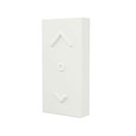

!!! info "Zigbee2Tasmota serves as a gateway for devices connected to a Zigbee wireless network to bridge their communications over to Wi-Fi"

Zigbee2Tasmota is a lightweight Zigbee solution running on an ESP82xx Wi-Fi chip. Hence it is easier to deploy wherever you want in your home. It is largely inspired by [Zigbee2mqtt](https://www.zigbee2mqtt.io/) but it's a complete rewrite to make it fit on an ESP82xx with 80kB of RAM and only 1MB of flash memory.

A list of compatible coordinators and Zigbee devices is maintained in the [Zigbee Device Compatibility Repository](https://zigbee.blakadder.com/zigbee2tasmota.html). 

## Zigbee Introduction
Before using Zigbee to Tasmota, you need to understand a few concepts. Here is a simplified comparison to the Wi-Fi equivalent (sort of).

|Zigbee concept|Wi-Fi equivalent|
|---|---|
|**Zigbee coordinator**<BR>The coordinator is responsible for selecting the channel, PanID, security policy, and stack profile for a network. Zigbee2Tasmota will act as a coordinator.<BR>You can have multiple coordinators as long as they have different PanIDs.|Wi-Fi Access Point|
|**PanID**<BR>(Personal Area Network IDentifier)<BR>This parameter is unique in a Zigbee network (16-bit integer, 0x0000–0x3FFF).<BR>*Default: 0x1A63*|SSID (the Wi-Fi network name)|
|**ShortAddr**<BR>Address of the device on the Zigbee network. This address is randomly assigned when the device first connects to the coordinator (16 bits integer, 0x0000–0xFFF7). The coordinator has address 0x0000.<BR>You need to track which device has which address or assing a "Friendly Name" to each new discovered device.|IP address|
|**GroupAddr**<BR>Group address of a collection of devices, it allows a single message to address multiple devices at once (16 bits integer, 0x0000–0xFFFF). For example a remote can turn on/off a group of lights. GroupAddr 0x0000 is not assigned.|Multicast|
|**Endpoint**<BR>The endpoint on the coordinator or on the Zigbee device the message is sent from/to. You can see endpoints as logical device providing distinct features (8 bits integer, 1–240).|IP Port|
|**IEEEAddr**<BR>Device hardware address (64 bits). This is unique per device and factory assigned.|MAC address|
|**Channel** 11-26<BR>*Default: 11* (See [Zigbee-Wifi coexistence](https://www.metageek.com/training/resources/zigbee-wifi-coexistence.html))|Wi-Fi Channel|
|**Encryption Key**<BR>128-bit encryption key.<BR>*default: 0x0D0C0A08060402000F0D0B0907050301*|Wi-Fi password|
|**Pairing**<BR>By default the coordinator does not accept new devices unless put in pairing mode. When in pairing mode, it will accept pairing requests from any device within range.<BR>*Default: pairing disabled*|WPS|

## Required Hardware
#### CC2530 Zigbee Adapter
Any TI CC2530 chip based module can serve as a coordinator. See [list of supported modules](https://zigbee.blakadder.com/zigbee2tasmota.html) with their pinouts and flashing instructions. 

!!! info "Devices based on CC2531 _can_ be used with Tasmota but _not in USB mode_!"
    Normally CC2531 supports USB communication, but Zigbee2Tasmota requires serial communication.
    When CC2530 firmware is flashed onto a CC2531, the CC2531 can be wired up for serial serial communication as described below.

These PCB make all the connections required to flash the CC2530 and to run Z2T.  

#### SuperHouse.tv  
  Jon Oxer created a [custom PCB](https://github.com/SuperHouse/Z2T) to connect a Wemos D1 Mini and a CC2530 board (with or without CC2591).  

  **Complete module**  
     

#### H4NC
  User _**h4nc**_ created a [custom PCB](https://github.com/h4nc/Zigbee2Tasmota_PCB) to connect a NodeMCU and a CC2530 board.  
  
  You can also get a complete Z2T module with case, pre-flashed and ready to configure and deploy.  
  

<!-- <table style="text-align:center; width: 80%;">
    <col style="width:30%">
    <col style="width:30%">
    <col style="width:30%">
  <tr>
    <th><a href="https://www.aliexpress.com/item/32904763478.html"> CC2530 with PCB antenna, DL-20</a></th>
    <th><a href="https://www.aliexpress.com/item/33007098493.html">CC2530 with external antenna</a></th>
    <th><a href="https://www.aliexpress.com/item/4000118023903.html">CC2530 with external antenna and CC2591 RF front end</a></th>
  </tr>
  <tr>
    <td>
      </img>
    </td>
    <td>
      </img>
    </td>
    <td>
      </img>
    </td>
</tr>
</table> -->

#### Wi-Fi Adapter
Using an ESP82xx device such as a Wemos D1 Mini or a NodeMCU to flash the CC2530 is a lower cost alternative than using a single purpose [CC_DEBUGGER](https://www.aliexpress.com/item/32869263224.html). 

In normal operation two free GPIOs are needed for the serial communication with the CC2530.  

## Configuration
### Flash CC2530 
Zigbee2Tasmota requires a TI CC2530 based module flashed with [Z-Stack CC2530 firmware file](https://github.com/Koenkk/Z-Stack-firmware/tree/master/coordinator/Z-Stack_Home_1.2/bin/default) from [Koen Kanters](https://github.com/Koenkk). 

Due to memory constraints of the CC2530, you can only pair 16 devices to a coordinator ([See details](https://github.com/Koenkk/Z-Stack-firmware/tree/master/coordinator)). 

!!! note
    There is an alternative firmware allowing for Zigbee routers to create a mesh network and go beyond 16 devices. This is currently not tested nor supported by Zigbee2Tasmota. It may be added later.

Flashing options:

- Flashing with [CCLoader](https://zigbee.blakadder.com/flashing_ccloader.html) and ESP8266 ==(recommended)==
- Flashing with [CCLib](Zigbee-CCLib-Flashing.md) and ESP8266
- Flash with a dedicated [CC Debugger](https://ptvo.info/how-to-select-and-flash-cc2530-144/) and Windows PC 
- Flasing with [RaspberryPi](https://github.com/jmichault/flash_cc2531) (flash_CC2531 from [jmichault](https://github.com/jmichault)) 


!!! note
    Flash the CC2531 USB Stick with the [Z-Stack CC2530](https://github.com/Koenkk/Z-Stack-firmware/tree/master/coordinator/Z-Stack_Home_1.2/bin/default) firmware file as mentioned above. Not with the CC2531 Firmware!
 

### Flash Tasmota
Once the CC2530 flashing process completes, you can re-use the  ESP82xx and flash Tasmota with Zigbee2Tasmota enabled firmware. Otherwise, you can use any ESP82xx device.  

!!! failure "Zigbee feature is not included in precompiled binaries"

To use it you must [compile your build](Compile-your-build). Add the following to `user_config_override.h`:
```arduino
#define USE_ZIGBEE 
```
#### Optional 
Run the ESP at 160MHz instead of 80MHz which ensures higher reliability in serial communication with CC2530.

In `platformio_override.ini` uncomment line 51:

`board_build.f_cpu = 160000000L`
  
If you find that your Zigbee2Tasmota operation is unstable, you may have an ESP82xx device that cannot operate reliably at the higher frequency. If you are using hardware serial (see below) and you still have unreliability, try compiling for 80MHz (reverse the options above) and flash the ESP82xx device again to see if operating at a lower frequency improves stability. Running at 80MHz will impact software serial communications so hardware serial is highly recommended if running the ESP82xx at 80MHz.
    
Flash the newly compiled binary usig the [normal flashing process](Getting-Started.md#flashing).

### Connect CC2530/2531 to Tasmota
If you are using your ESP82xx device to flash the Zigbee adapter as described in tutorials you may want to leave these connections in place in case you ever need to update CC2530 firmware. If not, any of the free GPIOs can be used.

**CC2531 USBStick**
On the CC2531 USBStick some of the connectors of the CC2531 have been removed to create extra solder pads. Among others also RX/TX. To see on the picture below. CC_RXD(P0.3), CC_TXD(P0.1).


If you want to supply the USB stick via 3.3V and GND from your ESP82xx board, you can use the corresponding pins of the debug header.
GND is located at pin 1 and 3.3V at pin 9 of the DebugHeader.
In addition, on some sticks, it is necessary to solder a solder bridge between the two small pads to the left of the "DEBUG" label just below the left side of the button, right next to the "D" of "Debug". You can see that one of the solder pads is connected to pin 9 of the debug header.


Solderpads:


!!! failure 
    Be careful not to solder a short circuit between the pads and the housing of the button.

!!! note "It is recommended that hardware serial pins be used (GPIO1/GPIO3 or GPIO13\[Rx]/GPIO15\[Tx])"
    Due to ESP82xx GPIO pin constraints, GPIO15 can only be used as serial Tx.  

The interface between the ESP82xx Wi-Fi device and the CC2530 Zigbee module uses high speed serial. 

!!! tip
    Tasmota also provides serial communications emulation through software (i.e., software serial). This allows any GPIO to be used. TasmotaSerial version 2.4.x (PR [#6377](https://github.com/arendst/Tasmota/pull/6377)) has improved the reliability of software serial making it feasible for use in this application. However, if you have an option to use hardware serial, choose that.

!!! bug "Z2T uses software serial by default to allow for serial logging on GPIO1/GPIO3"
    Use `SerialLog 0` to enable **hardware serial on GPIO13\[Rx]/GPIO15\[Tx]**.


Recommended wiring:  

ESP<BR>Device|Tasmota|<BR>CC2530
:--:|:--:|:--:
GPIO13|Zigbee RX (166)|CC_TXD<BR>(A.K.A. P0_3)
GPIO15|Zigbee TX (165)|CC_RXD<BR>(A.K.A. P0_2)
3V3 | VCC
GND | GND 

### Tasmota Settings 
In the **_Configuration -> Configure Module_** page assign:

- GPIO13 to `Zigbee RX (166)`   
- GPIO15 to `Zigbee TX (165)`


You can quickly configure Tasmota using a custom template instead. 

Use this one for the recommended wiring scheme:

```json
{"NAME":"Zigbee","GPIO":[0,0,0,0,0,0,0,0,0,166,0,165,0],"FLAG":0,"BASE":18}
```


### First Run

When the Tasmota device boots, Zigbee2Tasmota will wait for 15 seconds before initializing the CC2530. This time allows for Wi-Fi and MQTT to connect (hopefully).

First boot:
```
MQT: tele/%topic%/RESULT = {"ZbState":{"Status":1,"Message":"CC2530 booted","RestartReason":"Watchdog","MajorRel":2,"MinorRel":6}}
MQT: tele/%topic%/RESULT = {"ZbState":{"Status":50,"MajorRel":2,"MinorRel":6,"MaintRel":3,"Revision":20190608}}
MQT: tele/%topic%/RESULT = {"ZbState":{"Status":2,"Message":"Reseting configuration"}}
MQT: tele/%topic%/RESULT = {"ZbState":{"Status":3,"Message":"Configured, starting coordinator"}}
MQT: tele/%topic%/RESULT = {"ZbState":{"Status":51,"IEEEAddr":"0x00124B00199DF06F","ShortAddr":"0x0000","DeviceType":7,"DeviceState":9,"NumAssocDevices":0}}
MQT: tele/tasmota/Zigbee_home/RESULT = {"ZbState":{"Status":0,"Message":"Started"}}
ZIG: Zigbee started
ZIG: No zigbee devices data in Flash
```

Zigbee will automatically boot the CC2530 device, configure the device and wait for Zigbee messages.

Normal boot looks like:  
```
MQT: tele/%topic%/RESULT = {"ZbState":{"Status":1,"Message":"CC2530 booted","RestartReason":"Watchdog","MajorRel":2,"MinorRel":6}}
MQT: tele/%topic%/RESULT = {"ZbState":{"Status":50,"MajorRel":2,"MinorRel":6,"MaintRel":3,"Revision":20190608}}
MQT: tele/%topic%/RESULT = {"ZbState":{"Status":3,"Message":"Configured, starting coordinator"}}
MQT: tele/%topic%/RESULT = {"ZbState":{"Status":51,"IEEEAddr":"0x00124B00199DF06F","ShortAddr":"0x0000","DeviceType":7,"DeviceState":9,"NumAssocDevices":0}}
MQT: tele/%topic%/RESULT = {"ZbState":{"Status":0,"Message":"Started"}}
ZIG: Zigbee started
ZIG: Zigbee devices data in Flash (516 bytes)
```

!!! info "You can force a factory reset of your CC2530 with `ZigbeeReset 1` and reboot"


## Usage

For a list of available command see [Zigbee Commands](Commands.md#zigbee).  


## Pairing Zigbee Devices
When you first create a Zigbee network, it contains no device except the coordinator. The first step is to add devices to the network, which is called **pairing**.

By default, and for security reasons, the Zigbee coordinator does not automatically accept new devices. To pair new devices, use [`ZbPermitJoin 1`](Commands.md#zbpermitjoin). Once Zigbee2Tasmota is in pairing mode, put the Zigbee device into pairing mode. This is usually accomplished by pressing the button on the device for 5 seconds or more. To stop pairing, use [`ZbPermitJoin 0`](Commands.md#zbpermitjoin).

```json
ZbPermitJoin 1

CMD: ZbPermitJoin 1
MQT: stat/%topic%/RESULT = {"ZbPermitJoin":"Done"}
MQT: tele/%topic%/RESULT = {"ZbState":{"Status":21,"Message":"Enable Pairing mode for 60 seconds"}}
```

60 seconds later:

```json
MQT: tele/%topic%/RESULT = {"ZbState":{"Status":20,"Message":"Disable Pairing mode"}}
```

Although this is highly discouraged, you can permanently enable Zigbee pairing, until the next reboot, with `ZbPermitJoin 99`.

```json
ZbPermitJoin 99

MQT: tele/%topic%/RESULT = {"ZbState":{"Status":22,"Message":"Enable Pairing mode until next boot"}}

ZbPermitJoin 0
MQT: tele/%topic%/RESULT = {"ZbState":{"Status":20,"Message":"Disable Pairing mode"}}
```
```json
MQT: tele/%topic%/SENSOR = {"ZbState":{"Status":30,"IEEEAddr":"0x00158D00036B50AE","ShortAddr":"0x8F20","PowerSource":false,"ReceiveWhenIdle":false,"Security":false}}
```
#### Example for Aqara Temperature & Humidity Sensor

To pair this sensor, press and hold the button for 5 seconds. The led will flash several times and you will see logs entries, especially this one:

1. Put Zigbee2Tasmota into pairing mode using the `ZigbeePermitJoin` command as described above
2. Press the Xiaomi Aqara sensor's button for 5 seconds to pair the devices. You will see a message as follows: 

  ```
  MQT: tele/%topic%/SENSOR = {"ZbState":{"Status":30,"IEEEAddr":"0x00158D00036B50AE","ShortAddr":"0x8F20","PowerSource":false,"ReceiveWhenIdle":false,"Security":false}}
  ```

Message with `"Status":30` shows some characteristics of the device:

|Field name|Value|
|---|---|
|`Status`|`30` indicates a device connect or reconnect. This is the opportunity to match IEEEAddress and short address|
|`IEEEAddr`|Long unique address (64 bits) of the device - factory set|
|`ShortAddr`|Short address (16 bits) randomly assigned to the device on this Zigbee network|
|`PowerSource`|`true` = the device is connected to a power source<BR>`false` = the device runs on battery|
|`ReceiveWhenIdle`|`true` = the device can receive commands when idle<BR>`false` = the device is not listening. Commands should be sent when the device reconnects and is idle|
|`Security`|Security capability (meaning unknown, to be determined)|

### Zigbee Friendly Names

Supported since version 8.2!

Instead of a short address like `"0x4773"` you can assign a memorable friendly name like `"Room_Plug"`.

See [`ZbName`](Commands.md#zbname) command to set names.

!!! example "Xiaomi Aqara Cube with address `0x128F`"
```json
MQT: tele/%topic%/RESULT = {"ZbReceived":{"0x128F":{"AqaraVibrationMode":"tilt","AqaraVibrationsOrAngle":162,"AqaraAccelerometer":[-690,2,138],"AqaraAngles":[-78,0,11],"LinkQuality":158}}}
```

Setting its friendly name to `Vibration_sensor`:
```json
ZigbeeName 0x128F,Vibration_sensor
CMD: ZbName 0x128F,Vibration_sensor
MQT: stat/%topic%/RESULT = {"0x128F":{"Name":"Vibration_sensor"}}

(10 seconds later)
ZIG: Zigbee Devices Data store in Flash (0x402FF800 - 270 bytes)
```

Now the sensor readings includes the friendly name:
```json
MQT: tele/%topic%/RESULT = {"ZbReceived":{"0x128F":{"Name":"Vibration_sensor","AqaraVibrationMode":"tilt","AqaraVibrationsOrAngle":171,"AqaraAccelerometer":[-691,12,130],"AqaraAngles":[-78,1,11],"LinkQuality":153}}}
```

If you set [`SetOption83 1`](Commands.md#setoption83) sensor readings will use the friendly name as KSON key, short address is added as `Device`:
```json
MQT: tele/%topic%/RESULT = {"ZbReceived":{"Vibration_sensor":{"Device":"0x128F","AqaraVibrationMode":"tilt","AqaraVibrationsOrAngle":171,"AqaraAccelerometer":[-691,8,136],"AqaraAngles":[-78,1,11],"LinkQuality":153}}}
```

## Reading Sensors
Most sensors will spontaneously publish their readings, regularly or once a signifcant change happened: temperature, pressure, humidity, presence, illuminance...

Sensor messages are published via MQTT when they are received from the Zigbee device. Similar to Zigbee2MQTT, Z2T tries to group and debounce sensor values when they are received within a 300ms window.

!!! example "Aqara Temperature & Humidity Sensor"


This sensor monitors humidity, temperature, and air pressure.  Its Zigbee model ID is `lumi.weather`.

This device publishes sensor values roughly every hour or when a change occurs. You can also force an update pressing the device's button. It sends two kinds of messages, either 3x standard Zigbee messages, or a single proprietary message containing all sensor values.  

`0x8F20` is the ShortAddress of the sensor, and its name is `Kitchen` if you used `ZbName 0x8F20,Kithchen`.

```json
MQT: tele/%topic%/SENSOR ={"ZbReceived": {"0x8F20": {"Name": "Kitchen", "Voltage": 2.995, "Battery": 98, "Temperature": 21.01, "Humidity": 53.68, "Pressure": 1004.04, "PressureUnit": "hPa", "Endpoint": 1, "LinkQuality": 88}}
```

or prefixed by name if you set `SetOption83 1`

```json
MQT: tele/%topic%/SENSOR ={"ZbReceived": {"Kitchen": {"Device": "0x8F20", "Voltage": 2.995, "Battery": 98, "Temperature": 21.01, "Humidity": 53.68, "Pressure": 1004.04, "PressureUnit": "hPa", "Endpoint": 1, "LinkQuality": 88}}
```

Topic is device specific, to allow more effective retained messages, if you set `SetOption89 1`

```json
MQT: tele/%topic%/8F20/SENSOR ={"ZbReceived": {"Kitchen": {"Device": "0x8F20", "Voltage": 2.995, "Battery": 98, "Temperature": 21.01, "Humidity": 53.68, "Pressure": 1004.04, "PressureUnit": "hPa", "Endpoint": 1, "LinkQuality": 88}}
```


Supported values:  

|Field name|Value|
|---|---|
|`LinkQuality`|Stength of the Zigbee signal, between 1 and 254 (integer). See this [ZigBee and WiFi Coexistence](https://www.metageek.com/training/resources/zigbee-wifi-coexistence.html)|
|`Humidity`|Humidity in percentage (float)|
|`Pressure` and `PressureUnit`|Atmospheric pressure (float) and unit (string)<BR>Currently only `hPa` (A.K.A. mbar) is supported|
|`Temperature`|Temperature in Celsius (float)|
|`Voltage`|Battery voltage (float)|
|`Battery`|Battery charge in percentage (integer)|
|`ModelId`|Model name of the Zigbee device (string)<BR>Ex: `lumi.weather`|
|`ScaledValue` and `Scale`|Give the raw measure and the scale correction as 10^scale|
|And many more...||

If a value is not decoded, it will appear as `"<cluster>_<attr>":<value>` where `<cluster>` is the Zigbee ZCL Cluster of the attribute (family), `<attr>` is the attribute number and `<value>` its published value.

!!! example
    `"0402_0000":2240` is attribute 0x0000 from cluster 0x0402, which is the temperature in hundredth of °C. It is automatically converted to `"Temperature":22.40`.

## Device Information
You can dump the internal information gathered about connected Zigbee devices with the command [`ZigbeeStatus`](Commands.md#zigbeestatus).

You can use `ZbStatus2` to display all information and endpoints. If probing was successful (at pairing time or using `ZbProbe`), Tasmota will automatically find the right endpoint.

Depending on the number of device you have, `ZbStatus2` output can exceed tha maximum MQTT message size. You can request the status of each individual device using `ZbStatus2 1`, `ZbStatus2 2`, `ZbStatus2 3`...

`ZbStatus1` - List all connected devices  
```json
{"ZbStatus1":[{"Device":"0x6B58"},{"Device":"0xE9C3"},{"Device":"0x3D82"}]}
```

`ZbStatus2` - Display detailed information for each device, including long address, model and manufacturer:  
```json
{"ZbStatus2":[{"Device":"0x4773","IEEEAddr":"0x7CB03EAA0A0292DD","ModelId":"Plug 01","Manufacturer":"OSRAM","Endpoints":["0x03"]},{"Device":"0x135D","Name":"Temp_sensor","IEEEAddr":"0x00158D00036B50AE","ModelId":"lumi.weather","Manufacturer":"LUMI","Endpoints":["0x01"]}]}
```

_(formatted for readability)_  
```json
{
	"ZbStatus2": [{
		"Device": "0x4773",
		"IEEEAddr": "0x7CB03EAA0A0292DD",
		"ModelId": "Plug 01",
		"Manufacturer": "OSRAM",
		"Endpoints": ["0x03"]
	}, {
		"Device": "0x135D",
		"Name": "Temp_sensor",
		"IEEEAddr": "0x00158D00036B50AE",
		"ModelId": "lumi.weather",
		"Manufacturer": "LUMI",
		"Endpoints": ["0x01"]
	}]
}
```

### Understanding Endpoints

The endpoint on the coordinator or on the Zigbee device the message is sent from/to.

Z2T will automatically take the first endpoint in the list; this works most of the time. You normally don't need to specify the endpoint number. In rare case, you can still force a specific endpoint.

Example Endpoints:

Device|Endpoint
-|-
OSRAM Plug|`0x03`
Philips Hue Bulb|`0x0B`

## Sending Commands

You can send commands to device or groups of device, for example to turn on/off a light, set its brightness of open/close shutters.

Here is a list of supported commands, see below how to send any command if it's not in the list.

Command|Parameters|Cluster
-|-|-
Power|`1\|true\|"true"\|"on"`: On<BR>`0\|false\|"false"\|"off"`: Off<BR>`2\|"Toggle"`: Toggle|0x0006
Dimmer|`0..254`: Dimmer value<BR>255 is normally considered as invalid, and may be converted to 254|0x0008
DimmerUp|`null`: no parameter. Increases dimmer by 10%|0x0008
DimmerDown|`null`: no parameter. Decreases dimmer by 10%|0x0008
DimmerStop|`null`: no parameter. Stops any running increase of decrease of dimmer.|0x0008
ResetAlarm|`<alarmcode>,<clusterid>`: (to be documented later)|0x0009
ResetAllAlarms|`null`: no parameter, (to be documented later)|0x0009
Hue|`0..254`: change Hue value|0x0300
Sat|`0..254`: change Sat value|0x0300
HueSat|`0..254,0..254`: change both Hue and Sat values|0x0300
Color|`0..65534,0..65534`: change the color using [x,y] coordinates|0x0300
CT|`0..65534`: change the white color-temperature in Mireds|0x0300
Shutter|`0..254`: send any Shutter command (prefer the commands below)|0x0102
ShutterOpen|`null`: no parameter, open shutter|0x0102
ShutterClose|`null`: no parameter, close shutter|0x0102
ShutterStop|`null`: no parameter, stop shutter movement|0x0102
ShutterLift|`0..100`: move shutter to a specific position in percent<BR>`0`%=open, `100`%=closed|0x0102
ShutterTilt|`0..100`: move the shutter to the specific tilt position in percent|0x0102

The format of the command is following:

`ZbSend {"Device":"<device>","Send":{"<sendcmd>":<sendparam>}}` where<BR>`<device>`identifies the target and can be a shortaddr `0x1234`, a longaddr `0x1234567812345678` or a name `Kitchen`.<BR>
 `"<sendcmd>":<sendparam>` the command and its parameters

If the device has been correctly paired and its endpoints recorded by Z2T, you shouldn't need to specify a target endpoint. You can use an option `"endpoitn":<endpoint>` parameter if Z2T can't find the correct endpoint or if you want to change from the default endpoint. See below **Understanding endpoints**.

### Low-level Commands

There is a special syntax if you want to send arbitrary commands:
`"Send":"<send_bytes>"` where `<send_bytes>` has the following syntax:

`"<cluster>_<cmd>/<bytes>"`: send a non-cluster specific command for cluster id `<cluster>`, command id `<cmd>` and payload `<bytes>`. 

Example:
`ZbSend {"Device":"0x1234","Send":"0000_00/0500"}`
I.e. send a Read command (0x00) to the general cluster (0x0000) for attribute ManufId (0x0005). Note: all values are little-endian.

Or use '!' instead of '_' to specify cluster-specific commands:

`"<cluster>!<cmd>/<bytes>"`: send a cluster specific command for cluster id `<cluster>`, command id `<cmd>` and payload `<bytes>`.

Example:
`ZbSend {"Device":"0x1234","Send":"0008_04/800A00"}`
I.e. send a Dimmer command (0x04) from Level Control cluster (0x0008) with payload being: Dimmer value 0x80, and transition time of 1 second (0x000A = 10 tenths of seconds).

Of course the latter example could be simply:
`ZbSend {"Device":"0x1234","Send":{"Dimmer":"0x80"}`

### Examples

#### OSRAM Plug

```json
ZbSend { "device":"0x4773", "send":{"Power":"On"} }
ZbSend { "device":"0x4773", "send":{"Power":1} }
ZbSend { "device":"0x4773", "send":{"Power":false} }
ZbSend { "device":"0x4773", "send":{"Power":"Toggle"} }
```

Read the On/Off status: (all three commands below are synonyms)

```json
ZbRead { "device":"0x4773", "endpoint":"0x03", "cluster":"0x0006", "read":"0x0000" }
ZbRead { "device":"0x4773", "endpoint":"0x03", "cluster":"0x0006", "read":["0x0000"] }
ZbRead { "device":"0x4773", "endpoint":3, "cluster":6, "read":0 }
```

```json
MQT: tele/tasmota/SENSOR = {"ZbReceived":{"0x4773":{"Power":true,"LinkQuality":52}}}
```

#### Philips Hue bulb

```json
ZbSend { "device":"0x3D82", "send":{"Power":"Off"} }
ZbSend { "device":"0x3D82", "send":{"Dimmer":128} }
ZbSend { "device":"0x3D82", "send":{"Dimmer":254} }
ZbSend { "device":"0x3D82", "endpoint":"0x0B", "send":{"Dimmer":0} }
```

## Receiving Commands
If you pair device like switches and remotes, you will also see received commands from thos devices.

When a command is received, attributes are published both in their low-level and high-level formats (if known).

Low level format is the following: `"<cluster>!<cmd>":"<payload"`

Example for IKEA Remote:
`{"ZbReceived":{"IKEA_remote":{"Device":"0xF72F","0006!02":"","Power":2,"Endpoint":1,"LinkQuality":31}}}`

The command received `"0006!02":""` is Power Toggle (0x02) from On/Off cluster (0x0006) with no payload. It is also translated as `"Power":2`. `"Endpoint":1` tells you from which endpoint the command was send. Some Xiaomi multi-switches use different endpoints for each switch.

#### Light State Tracking
Once Z2T receives a command related to a light (Power, Dimmer, Color, ColorTemp), it sends right after a Read command to get the actual state of the light. This is used for Hue Emulation and Alexa support. The final attributes are read betwenn 200ms and 1000ms later, to allow for the light to achieve its target state.

Example:
```
16:02:04 MQT: tele/%topic%/SENSOR = {"ZbReceived":{"IKEA_remote":{"Device":"0xF72F","0006!02":"","Power":2,"Endpoint":1,"Group":100,"LinkQuality":75}}}
16:02:05 MQT: tele/%topic%/SENSOR = {"ZbReceived":{"IKEA_Light":{"Device":"0x5ADF","Power":true,"Endpoint":1,"LinkQuality":80}}}
16:02:06 MQT: tele/%topic%/SENSOR = {"ZbReceived":{"IKEA_remote":{"Device":"0xF72F","0008!06":"002B0500","DimmerUp":true,"Endpoint":1,"Group":100,"LinkQuality":75}}}
16:02:08 MQT: tele/%topic%/SENSOR = {"ZbReceived":{"IKEA_Light":{"Device":"0x5ADF","Dimmer":102,"Endpoint":1,"LinkQuality":80}}}
```

#### Ikea Remote (E1524/E1810)
`"ModelId":"TRADFRI remote control","Manufacturer":"IKEA of Sweden"`

- Short press center button - `"0006!02":""` and `"Power":2`
- Short press dimmer up - `"0008!06":"002B0500"` and `"DimmerUp":true`
- Short press dimmer down - `"0008!02":"012B05000000"` and `"DimmerStep":1`
- Short press arrow right - `"0005!07":"00010D00"` and `"ArrowClick":0`
- Short press arrow left - `"0xF72F","0005!07":"01010D00"` and `"ArrowClick":1`
- Long press dimmer up - `"0008!05":"0054"` and `"DimmerMove":0`
- Long press dimmer up release - `"0008!07":""` and `"DimmerStop":true`
- Long press dimmer down - `"0008!01":"01540000"` and `"DimmerMove":1`
- Long press dimmer down release - `,"0008!03":"0000"` and `"DimmerStop":true`

## Zigbee Groups
Zigbee has a unique feature call Groups. It allows you to send a single command to a group of devices. For example a remote can control a group of multiple lights.

Zigbee groups are 16 bits arbitrary numbers that you can freely assign. When you send to a group, you don't specify a targer address anymore nor an endpoint.

Groups works in two steps: first you add devices to groups, second you send commands to groups. See the below **Zigbee Binding** to configure a remote to send commands to a specific group.

Configuring groups for devices requires to send commands. Make sure the device is powered and awake (i.e. wake-up battery powered devices).

#### List all groups for a device.

`ZbSend {"device":"IKEA_Light","Send":{"GetAllGroups":true}}`

```
MQT: tele/%topic%/SENSOR = {"ZbReceived":{"IKEA_Light":{"Device":"0x5ADF","0004<02":"FF00","GetGroupCapacity":255,"GetGroupCount":0,"GetGroup":[],"Endpoint":1,"LinkQuality":80}}}
```

The following response tells you:
`"GetGroupCount":1` the light belongs to one group
`"GetGroup":[100]` and the group number is `100`.

```
MQT: tele/%topic%/SENSOR = {"ZbReceived":{"IKEA_Light":{"Device":"0x5ADF","0004<02":"FF016400","GetGroupCapacity":255,"GetGroupCount":1,"GetGroup":[100],"Endpoint":1,"LinkQuality":80}}}
```

#### Add a group to a device

`ZbSend {"device":"IKEA_Light","Send":{"AddGroup":100}}`

```
MQT: tele/%topic%/SENSOR = {"ZbReceived":{"IKEA_Light":{"Device":"0x5ADF","0004<00":"006400","AddGroup":100,"AddGroupStatus":0,"AddGroupStatusMsg":"SUCCESS","Endpoint":1,"LinkQuality":80}}}
```

Or if the group already exists:

```
MQT: tele/%topic%/SENSOR = {"ZbReceived":{"IKEA_Light":{"Device":"0x5ADF","0004<00":"8A6400","AddGroup":100,"AddGroupStatus":138,"AddGroupStatusMsg":"DUPLICATE_EXISTS","Endpoint":1,"LinkQuality":80}}}
```

#### Remove a group

`ZbSend {"device":"IKEA_Light","Send":{"RemoveGroup":100}}`

```
MQT: tele/%topic%/SENSOR = {"ZbReceived":{"IKEA_Light":{"Device":"0x5ADF","0004<03":"006400","RemoveGroup":100,"RemoveGroupStatus":0,"RemoveGroupStatusMsg":"SUCCESS","Endpoint":1,"LinkQuality":80}}}
```

or if the group does not exist

```
MQT: tele/%topic%/SENSOR = {"ZbReceived":{"IKEA_Light":{"Device":"0x5ADF","0004<03":"8B6400","RemoveGroup":100,"RemoveGroupStatus":139,"RemoveGroupStatusMsg":"NOT_FOUND","Endpoint":1,"LinkQuality":80}}}
```

#### Remove all groups

`ZbSend {"device":"IKEA_Light","Send":{"RemoveAllGroups":true}}`

```
MQT: tele/%topic%/SENSOR = {"ZbResponse":{"Device":"0x5ADF","Name":"IKEA_Light","Command":"0004!04","Status":0,"StatusMessage":"SUCCESS","Endpoint":1,"LinkQuality":80}}
```

#### Sending commands to a group

Just use the attribute `"Group":<group_id>` instead of `"Device":<device>` when sending a command.

Example:

- power on all light in group 100: `ZbSend {"group":100,"Send":{"Power":1}}`
- set all dimmers in group 100 to 50%: `ZbSend {"group":100,"Send":{"Dimmer":127}}`

## Zigbee Binding
Binding allows a device to send command to another device in the same Zigbee network, without any additional logic. For example, you can set a remote to control directly a group of lights, without any rules on the coordinator. The coordinator will still receive all commands.

Example of direct binding
`ZbBind {"Device":"0xC2EF","ToDevice":"0x5ADF","Endpoint":1,"ToEndpoint":1,"Cluster":6}`

This command links the device `0xC2EF` that will send all commands for cluster `6` (On/off cluster) frome endpoint `1` to the target device `0x5ADF` on endpoint `1`.

Example of group binding
`ZbBind {"Device":"0xC2EF","ToGroup":100,"Endpoint":1,"Cluster":6}`

This command links the device `0xC2EF` that will send all commands for cluster `6` (On/off clustre) and from endpoint `1` to the group `100`.

Reponse in case of success:
```
MQT: tele/%topic%/RESULT = {"ZbBind":{"Device":"0xF72F","Name":"IKEA_Remote","Status":0,"StatusMessage":"SUCCESS"}}
```

#### Example: IKEA remote and IKEA Light

IKEA remotes only support 1 group, and can be linked to a light only via group numbers (no direct binding).

1. Add the light to group 100
`ZbSend {"device":"IKEA_Light","Send":{"AddGroup":100}}`

2. Bind the remote to group 100. Note: you need to press a button on the remote right before sending this command to make sure it's not in sleep mode
`ZbBind {"Device":"IKEA_Remote","ToGroup":100,"Endpoint":1,"Cluster":6}`

## Zigbee and Hue Emulation for Alexa
Z2T now supports Hue Emulation for Zigbee lights. It will mimic most of Zigbee gateways, and allows you to control Zigbee lights directly with Alexa, without any MQTT broker nor Alexa skill.

Command `ZbLight` configures a Zigbee device to be Alexa controllable. Specify the number of channels the light supports:

* `0` Simple On/Off light
* `1` White Light with Dimmer
* `2` White Light with Dimmer and Cold/Warm White
* `3` RGB Light
* `4` RGBW Light
* `5` RGBCW Light, RGB and  Cold/Warm White

To set the light, use `ZbLight <device>,<nb_of_channels`.
Ex:
```
ZbLight 0x1234,2
ZbLight Kitchen_Light,1   (see ZbName)
```

Once a light is declared, Z2T will monitor any change made to the light via Z2T or via remotes, either from a direct message or via a group message. Z2T will then send a read command to the light, between 200ms and 1000ms later, and memorize the last value.

To read the last known status of a light, use `ZbLight <device>`

Ex:
```
ZbLight Kitchen_Light
MQT: stat/%topic%/RESULT = {"ZbLight":{"Kitchen_Light":{"Device":"0x5ADF","Light":2,"Power":0,"Dimmer":130,"Colormode":2,"CT":350}}}
```

## Specific Device Tutorials

### OSRAM mini switch and plug



Here is a short tutorial to configuring an ORSRAM switch bound to an OSRAM plug.

#### 1. Pair the OSRAM Plug

Initiate pairing mode:
   
```haskell
ZbPermitJoin 1

xx:xx:xx MQT: stat/<topic>/RESULT = {"ZbPermitJoin":"Done"}
xx:xx:xx MQT: tele/<topic>/RESULT = {"ZbState":{"Status":21,"Message":"Enable Pairing mode for 60 seconds"}}
```

Hold the on/off button until your hear a click (+- 10 seconds).

```haskell
xx:xx:xx MQT: stat/<topic>/RESULT = {"ZbState":{"Status":34,"IEEEAddr":"0x7CB03EAA0A0292DD","ShortAddr":"0xF75D","ParentNetwork":"0x0000"}}
xx:xx:xx MQT: stat/<topic>/RESULT = {"ZbState":{"Status":30,"IEEEAddr":"0x7CB03EAA0A0292DD","ShortAddr":"0xF75D","PowerSource":true,"ReceiveWhenIdle":true,"Security":false}}
xx:xx:xx MQT: stat/<topic>/RESULT = {"ZbState":{"Status":32,"ActiveEndpoints":["0x03"]}}
xx:xx:xx MQT: stat/<topic>/SENSOR = {"ZbReceived":{"OSRAM_Plug":{"Device":"0xF75D","Manufacturer":"OSRAM","ModelId":"Plug 01","Endpoint":3,"LinkQuality":44}}}
```
**(Optional) Give the device a name**

Giving the device a name makes it easier to configure than using the short address. When naming a device, it is preferable to use the long address `IEEEAddr` which remains unchanged if you need to pair again your device.

```haskell
ZbName 0x7CB03EAA0A0292DD,OSRAM_Plug

xx:xx:xx MQT: stat/<topic>/RESULT = {"0xF75D":{"Name":"OSRAM_Plug"}}
xx:xx:xx ZIG: Zigbee Devices Data store in Flash (0x402FF800 - xxx bytes)
```

#### 2. Pair the OSRAM Switch mini

Hold the Middle and Arrow Down Buttons for 10 Seconds to Reset the Device. 

Initiate pairing mode:
   
```haskell
ZbPermitJoin 1

xx:xx:xx MQT: stat/<topic>/RESULT = {"ZbPermitJoin":"Done"}
xx:xx:xx MQT: tele/<topic>/RESULT = {"ZbState":{"Status":21,"Message":"Enable Pairing mode for 60 seconds"}}
```

Hold the Middle and Arrow Up Buttons for 3 Seconds to connect.

```haskell
xx:xx:xx MQT: tele/<topic>/RESULT = {"ZbState":{"Status":34,"IEEEAddr":"0x000D6F00109C732A","ShortAddr":"0x080C","ParentNetwork":"0x0000"}}
xx:xx:xx MQT: tele/<topic>/RESULT = {"ZbState":{"Status":30,"IEEEAddr":"0x000D6F00109C732A","ShortAddr":"0x080C","PowerSource":false,"ReceiveWhenIdle":false,"Security":false}}
xx:xx:xx MQT: tele/<topic>/RESULT = {"ZbState":{"Status":32,"ActiveEndpoints":["0x01","0x02","0x03"]}}
xx:xx:xx MQT: tele/<topic>/SENSOR = {"ZbReceived":{"OSRAM_Remote":{"Device":"0x080C","Manufacturer":"OSRAM","ModelId":"Lightify Switch Mini","Endpoint":1,"LinkQuality":46}}}
xx:xx:xx ZIG: Zigbee Devices Data store in Flash (0x402FF800 - xxx bytes)
```

**(Optional) Give the device a name**

```haskell
ZbName 0x000D6F00109C732A,OSRAM_Remote

xx:xx:xx MQT: stat/<topic>/RESULT = {"0x080C":{"Name":"OSRAM_Remote"}}
xx:xx:xx MQT: stat/<topic>/RESULT = {"0xF75D":{"Name":"OSRAM_Plug"}}
xx:xx:xx ZIG: Zigbee Devices Data store in Flash (0x402FF800 - xxx bytes)
```

#### 3. Configure OSRAM switch bindings

By default the OSRAM switch broadcasts the on/off commands to the entire network. Pressing the Up arrow turns on all devices, and the Down arrows turns off all devices.

This is often not desirable. We will now bind the remote to a group address so you can selectively turn on and off a group of devices.

We will choose group address `101` below, but you can take any number between 1 and 65535. We need to bind cluster 6 (On/Off) for **both endpoints 1 and 2**.


> **Press any button on the switch** to get it out of sleep mode and immediatly after send the following command:

```haskell
ZbBind {"Device":"OSRAM_Remote","ToGroup":101,"Endpoint":2,"Cluster":6}

xx:xx:xx MQT: stat/<topic>/RESULT = {"ZbBind":"Done"}
xx:xx:xx MQT: stat/<topic>/RESULT = {"ZbBind":{"Device":"0x080C","Name":"OSRAM_Remote","Status":0,"StatusMessage":"SUCCESS"}}
```

Make sure you see **`"StatusMessage":"SUCCESS"`**

> **Press any button on the switch** to get it out of sleep mode and immediatly after send the following command:

```haskell
ZbBind {"Device":"OSRAM_Remote","ToGroup":101,"Endpoint":1,"Cluster":6}

xx:xx:xx MQT: stat/<topic>/RESULT = {"ZbBind":"Done"}
xx:xx:xx MQT: stat/<topic>/RESULT = {"ZbBind":{"Device":"0x080C","Name":"OSRAM_Remote","Status":0,"StatusMessage":"SUCCESS"}}
```

Make sure you see **`"StatusMessage":"SUCCESS"`**

Now the switch will only send commands to the group address `101`and no more to all devices.

You can check the current bindings with the following command (JSON indentation for to ease readability):

```haskell
ZbBindState OSRAM_Remote

xx:xx:xx MQT: stat/<topic>/RESULT = {"ZbBindState":"Done"}
xx:xx:xx MQT: stat/<topic>/RESULT =
    {"ZbBindState":
      {"Device":"0x080C","Name":"OSRAM_Remote","Status":0,"StatusMessage":"SUCCESS",
       "BindingsTotal":2,"Bindings":[
         {"Cluster":"0x0006","Endpoint":2,"ToGroup":101},
         {"Cluster":"0x0006","Endpoint":1,"ToGroup":101}]}}
```

You can now see what happens when you press the Up and Down arrow:

```haskell
xx:xx:xx MQT: stat/<topic>/SENSOR = {"ZbReceived":{"OSRAM_Remote":{"Device":"0x080C","0006!01":"","Power":1,"Endpoint":1,"Group":101,"LinkQuality":13}}}

xx:xx:xx MQT: stat/<topic>/SENSOR = {"ZbReceived":{"OSRAM_Remote":{"Device":"0x080C","0006!00":"","Power":0,"Endpoint":2,"Group":101,"LinkQuality":5}}}
```

#### 4. Add the Plug to the group address

Now we need to configure the plug to listen to group `101`.

```haskell
ZbSend {"Device":"OSRAM_Plug","Send":{"AddGroup":101}}


xx:xx:xx MQT: stat/<topic>/RESULT = {"ZbSend":"Done"}
xx:xx:xx MQT: stat/<topic>/SENSOR =
      {"ZbReceived":
        {"OSRAM_Plug":
          {"Device":"0xF75D","0004<00":"006500","AddGroup":101,
            "AddGroupStatus":0,"AddGroupStatusMsg":"SUCCESS",
            "Endpoint":3,"LinkQuality":46}}}
```

Make sure you see **`"AddGroupStatusMsg":"SUCCESS"`**

You can also check existing bindings with the following command:

```haskell
ZbSend {"Device":"OSRAM_Plug","Send":{"GetAllGroups":true}}

xx:xx:xx MQT: stat/<topic>/RESULT = {"ZbSend":"Done"}
xx:xx:xx MQT: stat/<topic>/SENSOR =
      {"ZbReceived":
        {"OSRAM_Plug":
          {"Device":"0xF75D","0004<02":"07016500","GetGroupCapacity":7,"GetGroupCount":1,
           "GetGroup":[101],"Endpoint":3,"LinkQuality":46}}}
```

#### 5. (Optional) Control the Plug with Alexa

You can also control your switch with Alexa through Philip Hue Emulation. It will be displayed as an On/Off light (0 channel).

```haskell
ZbLight OSRAM_Plug,0
```

#### Recap of commands

```haskell
ZbPermitJoin 1
```

On the Plug: hold the on/off button until your hear a click (+- 10 seconds).

On the Switch: hold the Middle and Arrow Up Buttons for 3 Seconds to connect.

```haskell
ZbName 0x7CB03EAA0A0292DD,OSRAM_Plug      (adapt to your actual IEEE Addresses)
ZbName 0x000D6F00109C732A,OSRAM_Remote    (adapt to your actual IEEE Addresses)
ZbSend {"Device":"OSRAM_Plug","Send":{"AddGroup":101}}
ZbLight OSRAM_Plug,0
```

Press any button on the switch to get it out of sleep mode.

```haskell
ZbBind {"Device":"OSRAM_Remote","ToGroup":101,"Endpoint":2,"Cluster":6}
ZbBind {"Device":"OSRAM_Remote","ToGroup":101,"Endpoint":1,"Cluster":6}
```

### Philips Hue Motion Sensor


Z2T supports Philips Hue Motion Sensor `SML001` and requires some additional configuration. By default the sensor will not report any value unless: 

1. you configure a Zigbee Binding to your coordinator
2. you set an explicit Configuration Reporting policy on the sensor

#### 1. Pair the device

Initiate pairing mode:

```haskell
ZbPermitJoin 1

xx:xx:xx MQT: stat/<topic>/RESULT = {"ZbPermitJoin":"Done"}
xx:xx:xx MQT: tele/<topic>/RESULT = {"ZbState":{"Status":21,"Message":"Enable Pairing mode for 60 seconds"}}
```

Press and hold the setup button on the rear of the device for +- 10 seconds (until the green light goes solid) to initiate pairing. Please note that the pairing indicator light is below the main sensor (as oppose to the obvious indicator above the main sensor).

```haskell
xx:xx:xx MQT: tele/<topic>/RESULT = {"ZbState":{"Status":34,"IEEEAddr":"0x0017880103295B70","ShortAddr":"0xB6CD","ParentNetwork":"0x0000"}}
xx:xx:xx MQT: tele/<topic>/RESULT = {"ZbState":{"Status":30,"IEEEAddr":"0x0017880103295B70","ShortAddr":"0xB6CD","PowerSource":false,"ReceiveWhenIdle":false,"Security":false}}
xx:xx:xx MQT: tele/<topic>/RESULT = {"ZbState":{"Status":32,"ActiveEndpoints":["0x02","0x01"]}}
xx:xx:xx MQT: tele/<topic>/SENSOR = {"ZbReceived":{"HueMotion":{"Device":"0xB6CD","Manufacturer":"Philips","ModelId":"SML001","Endpoint":2,"LinkQuality":15}}}
xx:xx:xx ZIG: Zigbee Devices Data store in Flash (0x402FF800 - xxx bytes)
```

**(Optional) Give the device a name**

Giving the device a name makes it easier to configure than using the short address. When naming a device, it is preferable to use the long address `IEEEAddr` which remains unchanged if you need to pair again your device.

```haskell
ZbName 0x0017880103295B70,HueMotion

xx:xx:xx MQT: stat/<topic>/RESULT = {"0xB6CD":{"Name":"HueMotion"}}
xx:xx:xx ZIG: Zigbee Devices Data store in Flash (0x402FF800 - xxx bytes)
```

#### 2. Set the Zigbee bindings

This will tell the device to send attributes readings to the coordinator. Coordinator's address is always `0x0000`.

```json
ZbBind {"Device":"HueMotion","Endpoint":2,"ToDevice":"0x0000","ToEndpoint":1,"Cluster":"0x0001"}
ZbBind {"Device":"HueMotion","Endpoint":2,"ToDevice":"0x0000","ToEndpoint":1,"Cluster":"0x0400"}
ZbBind {"Device":"HueMotion","Endpoint":2,"ToDevice":"0x0000","ToEndpoint":1,"Cluster":"0x0402"}
ZbBind {"Device":"HueMotion","Endpoint":2,"ToDevice":"0x0000","ToEndpoint":1,"Cluster":"0x0406"}
```

#### 3. Set Configure Reporting

This configuration tells the motion sensor to report attributes on a regular basis (min once per hour) and whenever a change occurs.

```json
ZbSend {"Device":"HueMotion","Endpoint":2,"Send":"0001_06/00210020100E30F200"}
ZbSend {"Device":"HueMotion","Endpoint":2,"Send":"0400_06/000000210000100E0000"}
ZbSend {"Device":"HueMotion","Endpoint":2,"Send":"0402_06/000000290000100E1900"}
ZbSend {"Device":"HueMotion","Endpoint":2,"Send":"0406_06/000000180000100E"}
```

#### Recap of commands

```haskell
ZbPermitJoin 1
```

Press and hold the setup button on the rear of the device for +- 10 seconds (until the green light goes solid).

```haskell
ZbName 0x0017880103295B70,HueMotion       (adapt to your actual IEEE Addresses)

ZbBind {"Device":"HueMotion","Endpoint":2,"ToDevice":"0x0000","ToEndpoint":1,"Cluster":"0x0001"}
ZbBind {"Device":"HueMotion","Endpoint":2,"ToDevice":"0x0000","ToEndpoint":1,"Cluster":"0x0400"}
ZbBind {"Device":"HueMotion","Endpoint":2,"ToDevice":"0x0000","ToEndpoint":1,"Cluster":"0x0402"}
ZbBind {"Device":"HueMotion","Endpoint":2,"ToDevice":"0x0000","ToEndpoint":1,"Cluster":"0x0406"}

ZbSend {"Device":"HueMotion","Endpoint":2,"Send":"0001_06/00210020100E30F200"}
ZbSend {"Device":"HueMotion","Endpoint":2,"Send":"0400_06/000000210000100E0000"}
ZbSend {"Device":"HueMotion","Endpoint":2,"Send":"0402_06/000000290000100E1900"}
ZbSend {"Device":"HueMotion","Endpoint":2,"Send":"0406_06/000000180000100E"}
```


### Ikea ON/OFF Switch (E1743)
`"ModelId":"TRADFRI on/off switch","Manufacturer":"IKEA of Sweden"`

- Short press `O` - `0006!00`
- Short press `I` - `0006!01`
- Long press `O` - `0008!01`
- Long press `I` - `0008!05`
- Long press release `O` or `I` - `0008!07`

In this example Tradfri switch reports on `0x7596` and is used to control another Tasmota light device:

```haskell
Rule
  on ZbReceived#0x7596#0006!00= do publish cmnd/%topic%/POWER OFF endon 
  on ZbReceived#0x7596#0006!01= do publish cmnd/%topic%/POWER OFF endon 
  on ZbReceived#0x7596#0008!01= do publish cmnd/%topic%/Dimmer - endon 
  on ZbReceived#0x7596#0008!05= do publish cmnd/%topic%/Dimmer + endon
```

### Aqara Water Leak Sensor (SJCGQ11LM)
`"ModelId":"lumi.sensor_wleak.aq1","Manufacturer":"LUMI"`

In this example sensor reports on `0x099F` and sends an mqtt message to topic `stat/leak_sensor/LEAK`:

```haskell
Rule
  on ZbReceived#0x099F#0500!00=010000FF0000 do publish stat/leak_sensor/LEAK ON endon 
  on ZbReceived#0x099F#0500!00=000000FF0000 do publish stat/leak_sensor/LEAK OFF endon 
```

### Unrecognized commands or attributes

If your device pairs successfully with Zigbee2Tasmota but doesn't report on standardized endpoint you will see messages like these:   
`{"ZbReceived":{"0x099F":{"0500!00":"010000FF0000","LinkQuality":70}}}`   
`{"ZbReceived":{"0x7596":{"0006!01":"","LinkQuality":65}}}`

In this case you will have to use rules or an external home automation solution to parse the ZbReceived messages. The following section will focus only on rules to utilize the device inside Tasmota ecosystem.

## Zigbee2Tasmota Status Codes
You can inspect the log output to determine whether Zigbee2Tasmota started correctly. Zigbee2Tasmota sends several status messages to inform the MQTT host about initialization.  

```
{"ZbState":{"Status":1,"Message":"CC2530 booted","RestartReason":"Watchdog","MajorRel":2,"MinorRel":6}}
```

* `Status` contains a numeric code about the status message
    - `0`: initialization complete, _Zigbee2Tasmota is running normally_
    - `1`: booting
    - `2`: resetting CC2530 configuration
    - `3`: starting Zigbee coordinator
    - `20`: disabling Permit Join
    - `21`: allowing Permit Join for 60 seconds
    - `22`: allowing Permit Join until next boot
    - `30`: Zigbee device connects or reconnects
    - `31`: Received Node Descriptor information for a Zigbee device
    - `32`: Received the list of active endpoints for a Zigbee device
    - `33`: Received the simple Descriptor with active ZCL clusters for a Zigbee device
    - `50`: reporting CC2530 firmware version
    - `51`: reporting CC2530 device information and associated devices
    - `98`: error, unsupported CC2530 firmware
    - `99`: general error, ==Zigbee2Tasmota was unable to start==
* `Message` (optional) a human-readable message
* other fields depending on the message (e.g., Status=`50` or Status=`51`)

## Zigbee internals

This page is for developers who want to understand how Zigbee2Tasmota (Z2T) works and its implementation details.

### CC2530 Serial protocol
The CC2530 is flashed with Texas Instrument ZNP Software version 1.2. The protocol is build on a serial communication between the main cpu and the CC2530.

[Z-Stack 1.2 Monitor and Test API](_media/zigbee/Z-Stack_API_1_2.pdf){target=_blank}

Serial communication is configured as 8N1, 115200 bauds. We suggest to use GPIO13/15 because they have hardware serial support. Please note that there is only one usable hardware serial, either on GPIO1/3 or GPIO13/15.

To enable hardware serial on GPIO13/15 for Tasmota, set `Serial 0` and restart. Otherwise Z2T will use Software serial provided by TasmotaSerial.

Receiving 115200 bauds in software is a timing challenge. Here is the anatomy of a byte transmitted in serial mode. Each bit is 8.7µs, or ~700 CPU cycles at 80MHz (1400 cycles at 160MHz).

It all starts with a LOW "start bit" that generates an interrupt transferred to TasmotaSerial. Then TasmotaSerial enters a tightly controlled loop to read each bit (least sifnificant first). The frame stops with a HIGH stop bit.


What can go wrong? Tasmota may be already handling an interrupt when the start bit arrives, potentially causing a shift by 1 bit and a wrong message.

Here is a 0xFE byte correctly received:


Same frame with a delay in the interrupt handler, and mistakenly read 0xFF:


TasmotaSerial has been improved to allow receiving a train of bytes withtout any disruption.

CC2530 generally sends all the bytes one after the other for a single ZNP message (up to 250 bytes). Instead of giving back control after the first byte, the TasmotaSerial interrupt handler continues to monitor the serial RX line for the next 4 bits and checks whether a new start bit arrived. It avoids any error after the first byte was received.


Still the first byte in the message could have been wrong. Fortunately, the first byte sent by ZNP is always 0xFE (see below). This means that if the interrupt arrives too late, Tasmota will read 0xFF instead of 0xFE. Z2T software does automatic error correction in this case, i.e. if the first byte received is 0xFF, it is automatically assumed to be 0xFE and the rest of the message is read normally.

With these two schemes, software serial for Zigbee proved to be extremely reliable, even at 80MHz. It is highly recommended though to run at 160MHz.

### State machine - CC2530 initialization and configuration
After Tasmota boots, it sends the sequence `410001` to force a CC2530 hardware reset. Z2T implements an asynchronous state machine to handle the initialization and configuration of the CC2530. The state machine sends commands and waits for responses (with time-outs) and takes different branches depending on the responses.

#### Instruction set

The program is encoded as a list of 32 bits instructions, stored in Flash in the `zb_prog` array of type `Zigbee_Instruction[]`. There is a PC (program counter) that is increased at each tick (i.e. every 50ms).

The state machine has very simple instructions.

Instructions encoded with 4 bytes:

* `NOOP`: no-operation, do nothing and move to the next instruction
* `LABEL(x)`: no-operation, and defines a Label (8 bits) that can be called by code.
* `GOTO(x)`: moves the PC to the instruction with LABEL(x)
* `ZI_ON_ERROR_GOTO(x)`: if an error occurs, move to label <x>
* `ZI_ON_TIMEOUT_GOTO(x)`: if a timeout occurs, move to lavel <x>
* `WAIT(y)`: wait for <y> milliseconds (unsigned 16 bits). Note the granularity is 50ms and the wait is non-blocking
* `WAIT_FOREVER`: pause the state machine and wait for an external goto
* `STOP`: stop completely the state machine, only used after an unrecoverable error

Instructions encoded with 8 bytes:

* `CALL(f, x)`: call a function, <f> is the address of the function of type `uint32_t f(uint8_t)`. The input parameter is <x>. The response is according to callbacks responses, except `-1` (time-out) simply continues the flow.
* `LOG(m)`: log the string <m>. <m> can be in PROGMEM. For debugging only.
* `MQTT_STATE(x, m)`: sends a MQTT `ZbState` message, with status code <x> and message <m>. <m> can be in PROGMEM.
* `SEND(d)`: send a ZNP sequence to CC2530. <d> is an array of <uint8_t>, a macro computes automatically the size of the array. <d> can be in PROGMEM.
* `WAIT_RECV(x, m)`: wait for a specific message <m> to be received with a time-out of <x> (uint16_t). Messages take into account are owly those matching the first 2 bytes. The complete message match is expected or an error is generated. If the message received is longer than <m>, additional bytes are ignored
* `WAIT_UNTIL(x, m)`: similar to `WAIT_RECV` but message that don't match are ignored, until a matching message is received.
* `ON_RECV_UNEXPECTED(f)`: if we received an unexpected (or unsupported) zigbee message, call function <f>


Instructions encoded with 12 bytes:

 * `WAIT_RECV_FUNC(x, m, f)`: similar to `WAIT_RECV` and a function <f> is called when the message matches.

All callbacks return `int32_t` with the following effect:

* `> 0`: goto the corresponding label
* `0`: continue
* `-1`: signal a time-out
* `< -1`: trigger an error (goto on\_error) 

#### Initialization code for the state machine
At Tasmota start-up, the state-machine fires. The current Z2T pseudo-code does the following:

Init:

* Set-up all the error handling functions
* Wait for 10.5 seconds after boot
* Send a RESET to CC2530
* Wait for CC2530 boot

Check configuration (if something is wrong, go to CONFIGURE):

* Check if the CC2530 was previously configured. It uses the same 1-byte Non-Volatile 0xF00 address and stores 0x55.
* Checks the Z-Stack version
* Checks the internal configuration: PanID, Ext PanID, Channel, PFGK and PFGKEN.
* If all good, emit an MQTT message saying Zigbee is configured
* Goto Start

Configure (only if needed):

* Emit an MQTT message for reconfiguration
* Do a factory reset of CC2530
* Reset the device once again
* Configure the following: PanId, Ext PanId, Channel, set type to Coordinator, PFKEY, PFKEYEN, Security Module
* Create NF 0xF00 location and store 0x55
* Goto Start

Start:

* Wait for CC2530 message saying the coordinator sucessfully started
* Query DeviceInfo
* Query Node Descriptor
* Query Active Endpoints
* Register 2 endpoints with profile 0x0104 (Home Automation) : 0x01 (default), 0x0B (for Xiaomi)
* Query Active Endpoints to verify 0x01 and 0x0B are active
* Close PermitJoin: don't accept any pairing
* Emit an MQTT message to indicate Zigbee started
* Mark Zigbee as initialized, accept incoming messages
* Load device configuration from Flash
* Query any lights declared with `ZbLight` to read their current states
* Pause the state machine

### Pairing devices
When you open pairing with `ZbPermitJoin 1` (60 seconds) or `ZbPermitJoin 99` (until next reboot), you allow new devices to join the network.

Example below is for an OSRAM Plug.

When a new devices joins, Z2T receives a TC Device Indication: `ZDO_TC_DEV_IND` (45CA) message with the device short (16 bits) address and IEEEAddress (64 bits).

```json
16:39:26 MQT: tele/Zigbee_home/RESULT = {"ZbState":{"Status":30,"IEEEAddr":"0x7CB03EAA0A0292DD","!!! info "Zigbee2Tasmota serves as a gateway for devices connected to a Zigbee wireless network to bridge their communications over to Wi-Fi"

Zigbee2Tasmota is a lightweight Zigbee solution running on an ESP82xx Wi-Fi chip. Hence it is easier to deploy wherever you want in your home. It is largely inspired by [Zigbee2mqtt](https://www.zigbee2mqtt.io/) but it's a complete rewrite to make it fit on an ESP82xx with 80kB of RAM and only 1MB of flash memory.

A list of compatible coordinators and Zigbee devices is maintained in the [Zigbee Device Compatibility Repository](https://zigbee.blakadder.com/zigbee2tasmota.html). 

## Zigbee Introduction
Before using Zigbee to Tasmota, you need to understand a few concepts. Here is a simplified comparison to the Wi-Fi equivalent (sort of).

|Zigbee concept|Wi-Fi equivalent|
|---|---|
|**Zigbee coordinator**<BR>The coordinator is responsible for selecting the channel, PanID, security policy, and stack profile for a network. Zigbee2Tasmota will act as a coordinator.<BR>You can have multiple coordinators as long as they have different PanIDs.|Wi-Fi Access Point|
|**PanID**<BR>(Personal Area Network IDentifier)<BR>This parameter is unique in a Zigbee network (16-bit integer, 0x0000–0x3FFF).<BR>*Default: 0x1A63*|SSID (the Wi-Fi network name)|
|**ShortAddr**<BR>Address of the device on the Zigbee network. This address is randomly assigned when the device first connects to the coordinator (16 bits integer, 0x0000–0xFFF7). The coordinator has address 0x0000.<BR>You need to track which device has which address or assing a "Friendly Name" to each new discovered device.|IP address|
|**GroupAddr**<BR>Group address of a collection of devices, it allows a single message to address multiple devices at once (16 bits integer, 0x0000–0xFFFF). For example a remote can turn on/off a group of lights. GroupAddr 0x0000 is not assigned.|Multicast|
|**Endpoint**<BR>The endpoint on the coordinator or on the Zigbee device the message is sent from/to. You can see endpoints as logical device providing distinct features (8 bits integer, 1–240).|IP Port|
|**IEEEAddr**<BR>Device hardware address (64 bits). This is unique per device and factory assigned.|MAC address|
|**Channel** 11-26<BR>*Default: 11* (See [Zigbee-Wifi coexistence](https://www.metageek.com/training/resources/zigbee-wifi-coexistence.html))|Wi-Fi Channel|
|**Encryption Key**<BR>128-bit encryption key.<BR>*default: 0x0D0C0A08060402000F0D0B0907050301*|Wi-Fi password|
|**Pairing**<BR>By default the coordinator does not accept new devices unless put in pairing mode. When in pairing mode, it will accept pairing requests from any device within range.<BR>*Default: pairing disabled*|WPS|

## Required Hardware
#### CC2530 Zigbee Adapter
Any TI CC2530 chip based module can serve as a coordinator. See [list of supported modules](https://zigbee.blakadder.com/zigbee2tasmota.html) with their pinouts and flashing instructions. 

!!! info "Devices based on CC2531 _can_ be used with Tasmota but _not in USB mode_!"
    Normally CC2531 supports USB communication, but Zigbee2Tasmota requires serial communication.
    When CC2530 firmware is flashed onto a CC2531, the CC2531 can be wired up for serial serial communication as described below.

These PCB make all the connections required to flash the CC2530 and to run Z2T.  

#### SuperHouse.tv  
  Jon Oxer created a [custom PCB](https://github.com/SuperHouse/Z2T) to connect a Wemos D1 Mini and a CC2530 board (with or without CC2591).  

  **Complete module**  
     

#### H4NC
  User _**h4nc**_ created a [custom PCB](https://github.com/h4nc/Zigbee2Tasmota_PCB) to connect a NodeMCU and a CC2530 board.  
  
  You can also get a complete Z2T module with case, pre-flashed and ready to configure and deploy.  
  

<!-- <table style="text-align:center; width: 80%;">
    <col style="width:30%">
    <col style="width:30%">
    <col style="width:30%">
  <tr>
    <th><a href="https://www.aliexpress.com/item/32904763478.html"> CC2530 with PCB antenna, DL-20</a></th>
    <th><a href="https://www.aliexpress.com/item/33007098493.html">CC2530 with external antenna</a></th>
    <th><a href="https://www.aliexpress.com/item/4000118023903.html">CC2530 with external antenna and CC2591 RF front end</a></th>
  </tr>
  <tr>
    <td>
      </img>
    </td>
    <td>
      </img>
    </td>
    <td>
      </img>
    </td>
</tr>
</table> -->

#### Wi-Fi Adapter
Using an ESP82xx device such as a Wemos D1 Mini or a NodeMCU to flash the CC2530 is a lower cost alternative than using a single purpose [CC_DEBUGGER](https://www.aliexpress.com/item/32869263224.html). 

In normal operation two free GPIOs are needed for the serial communication with the CC2530.  

## Configuration
### Flash CC2530 
Zigbee2Tasmota requires a TI CC2530 based module flashed with [Z-Stack CC2530 firmware file](https://github.com/Koenkk/Z-Stack-firmware/tree/master/coordinator/Z-Stack_Home_1.2/bin/default) from [Koen Kanters](https://github.com/Koenkk). 

Due to memory constraints of the CC2530, you can only pair 16 devices to a coordinator ([See details](https://github.com/Koenkk/Z-Stack-firmware/tree/master/coordinator)). 

!!! note
    There is an alternative firmware allowing for Zigbee routers to create a mesh network and go beyond 16 devices. This is currently not tested nor supported by Zigbee2Tasmota. It may be added later.

Flashing options:

- Flashing with [CCLoader](https://zigbee.blakadder.com/flashing_ccloader.html) and ESP8266 ==(recommended)==
- Flashing with [CCLib](Zigbee-CCLib-Flashing.md) and ESP8266
- Flash with a dedicated [CC Debugger](https://ptvo.info/how-to-select-and-flash-cc2530-144/) and Windows PC 

### Flash Tasmota
Once the CC2530 flashing process completes, you can re-use the  ESP82xx and flash Tasmota with Zigbee2Tasmota enabled firmware. Otherwise, you can use any ESP82xx device.  

!!! failure "Zigbee feature is not included in precompiled binaries"

To use it you must [compile your build](Compile-your-build). Add the following to `user_config_override.h`:
```arduino
#define USE_ZIGBEE 
```
#### Optional 
Run the ESP at 160MHz instead of 80MHz which ensures higher reliability in serial communication with CC2530.

In `platformio_override.ini` uncomment line 51:

`board_build.f_cpu = 160000000L`
  
If you find that your Zigbee2Tasmota operation is unstable, you may have an ESP82xx device that cannot operate reliably at the higher frequency. If you are using hardware serial (see below) and you still have unreliability, try compiling for 80MHz (reverse the options above) and flash the ESP82xx device again to see if operating at a lower frequency improves stability. Running at 80MHz will impact software serial communications so hardware serial is highly recommended if running the ESP82xx at 80MHz.
    
Flash the newly compiled binary usig the [normal flashing process](Getting-Started.md#flashing).

### Connect CC2530 to Tasmota
If you are using your ESP82xx device to flash the Zigbee adapter as described in tutorials you may want to leave these connections in place in case you ever need to update CC2530 firmware. If not, any of the free GPIOs can be used.

!!! note "It is recommended that hardware serial pins be used (GPIO1/GPIO3 or GPIO13\[Rx]/GPIO15\[Tx])"
    Due to ESP82xx GPIO pin constraints, GPIO15 can only be used as serial Tx.  

The interface between the ESP82xx Wi-Fi device and the CC2530 Zigbee module uses high speed serial. 

!!! tip
    Tasmota also provides serial communications emulation through software (i.e., software serial). This allows any GPIO to be used. TasmotaSerial version 2.4.x (PR [#6377](https://github.com/arendst/Tasmota/pull/6377)) has improved the reliability of software serial making it feasible for use in this application. However, if you have an option to use hardware serial, choose that.

!!! bug "Z2T uses software serial by default to allow for serial logging on GPIO1/GPIO3"
    Use `SerialLog 0` to enable **hardware serial on GPIO13\[Rx]/GPIO15\[Tx]**.

Recommended wiring:  

ESP<BR>Device|Tasmota|<BR>CC2530
:--:|:--:|:--:
GPIO13|Zigbee RX (166)|CC_TXD<BR>(A.K.A. P0_3)
GPIO15|Zigbee TX (165)|CC_RXD<BR>(A.K.A. P0_2)
3V3 | VCC
GND | GND 

### Tasmota Settings 
In the **_Configuration -> Configure Module_** page assign:

- GPIO13 to `Zigbee RX (166)`   
- GPIO15 to `Zigbee TX (165)`


You can quickly configure Tasmota using a custom template instead. 

Use this one for the recommended wiring scheme:

```json
{"NAME":"Zigbee","GPIO":[0,0,0,0,0,0,0,0,0,166,0,165,0],"FLAG":0,"BASE":18}
```


### First Run

When the Tasmota device boots, Zigbee2Tasmota will wait for 15 seconds before initializing the CC2530. This time allows for Wi-Fi and MQTT to connect (hopefully).

First boot:
```
MQT: tele/%topic%/RESULT = {"ZbState":{"Status":1,"Message":"CC2530 booted","RestartReason":"Watchdog","MajorRel":2,"MinorRel":6}}
MQT: tele/%topic%/RESULT = {"ZbState":{"Status":50,"MajorRel":2,"MinorRel":6,"MaintRel":3,"Revision":20190608}}
MQT: tele/%topic%/RESULT = {"ZbState":{"Status":2,"Message":"Reseting configuration"}}
MQT: tele/%topic%/RESULT = {"ZbState":{"Status":3,"Message":"Configured, starting coordinator"}}
MQT: tele/%topic%/RESULT = {"ZbState":{"Status":51,"IEEEAddr":"0x00124B00199DF06F","ShortAddr":"0x0000","DeviceType":7,"DeviceState":9,"NumAssocDevices":0}}
MQT: tele/tasmota/Zigbee_home/RESULT = {"ZbState":{"Status":0,"Message":"Started"}}
ZIG: Zigbee started
ZIG: No zigbee devices data in Flash
```

Zigbee will automatically boot the CC2530 device, configure the device and wait for Zigbee messages.

Normal boot looks like:  
```
MQT: tele/%topic%/RESULT = {"ZbState":{"Status":1,"Message":"CC2530 booted","RestartReason":"Watchdog","MajorRel":2,"MinorRel":6}}
MQT: tele/%topic%/RESULT = {"ZbState":{"Status":50,"MajorRel":2,"MinorRel":6,"MaintRel":3,"Revision":20190608}}
MQT: tele/%topic%/RESULT = {"ZbState":{"Status":3,"Message":"Configured, starting coordinator"}}
MQT: tele/%topic%/RESULT = {"ZbState":{"Status":51,"IEEEAddr":"0x00124B00199DF06F","ShortAddr":"0x0000","DeviceType":7,"DeviceState":9,"NumAssocDevices":0}}
MQT: tele/%topic%/RESULT = {"ZbState":{"Status":0,"Message":"Started"}}
ZIG: Zigbee started
ZIG: Zigbee devices data in Flash (516 bytes)
```

!!! info "You can force a factory reset of your CC2530 with `ZigbeeReset 1` and reboot"


## Usage

For a list of available command see [Zigbee Commands](Commands.md#zigbee).  


## Pairing Zigbee Devices
When you first create a Zigbee network, it contains no device except the coordinator. The first step is to add devices to the network, which is called **pairing**.

By default, and for security reasons, the Zigbee coordinator does not automatically accept new devices. To pair new devices, use [`ZbPermitJoin 1`](Commands.md#zbpermitjoin). Once Zigbee2Tasmota is in pairing mode, put the Zigbee device into pairing mode. This is usually accomplished by pressing the button on the device for 5 seconds or more. To stop pairing, use [`ZbPermitJoin 0`](Commands.md#zbpermitjoin).

```json
ZbPermitJoin 1

CMD: ZbPermitJoin 1
MQT: stat/%topic%/RESULT = {"ZbPermitJoin":"Done"}
MQT: tele/%topic%/RESULT = {"ZbState":{"Status":21,"Message":"Enable Pairing mode for 60 seconds"}}
```

60 seconds later:

```json
MQT: tele/%topic%/RESULT = {"ZbState":{"Status":20,"Message":"Disable Pairing mode"}}
```

Although this is highly discouraged, you can permanently enable Zigbee pairing, until the next reboot, with `ZbPermitJoin 99`.

```json
ZbPermitJoin 99

MQT: tele/%topic%/RESULT = {"ZbState":{"Status":22,"Message":"Enable Pairing mode until next boot"}}

ZbPermitJoin 0
MQT: tele/%topic%/RESULT = {"ZbState":{"Status":20,"Message":"Disable Pairing mode"}}
```
```json
MQT: tele/%topic%/SENSOR = {"ZbState":{"Status":30,"IEEEAddr":"0x00158D00036B50AE","ShortAddr":"0x8F20","PowerSource":false,"ReceiveWhenIdle":false,"Security":false}}
```
#### Example for Aqara Temperature & Humidity Sensor

To pair this sensor, press and hold the button for 5 seconds. The led will flash several times and you will see logs entries, especially this one:

1. Put Zigbee2Tasmota into pairing mode using the `ZigbeePermitJoin` command as described above
2. Press the Xiaomi Aqara sensor's button for 5 seconds to pair the devices. You will see a message as follows: 

  ```
  MQT: tele/%topic%/SENSOR = {"ZbState":{"Status":30,"IEEEAddr":"0x00158D00036B50AE","ShortAddr":"0x8F20","PowerSource":false,"ReceiveWhenIdle":false,"Security":false}}
  ```

Message with `"Status":30` shows some characteristics of the device:

|Field name|Value|
|---|---|
|`Status`|`30` indicates a device connect or reconnect. This is the opportunity to match IEEEAddress and short address|
|`IEEEAddr`|Long unique address (64 bits) of the device - factory set|
|`ShortAddr`|Short address (16 bits) randomly assigned to the device on this Zigbee network|
|`PowerSource`|`true` = the device is connected to a power source<BR>`false` = the device runs on battery|
|`ReceiveWhenIdle`|`true` = the device can receive commands when idle<BR>`false` = the device is not listening. Commands should be sent when the device reconnects and is idle|
|`Security`|Security capability (meaning unknown, to be determined)|

### Zigbee Friendly Names

Supported since version 8.2!

Instead of a short address like `"0x4773"` you can assign a memorable friendly name like `"Room_Plug"`.

See [`ZbName`](Commands.md#zbname) command to set names.

!!! example "Xiaomi Aqara Cube with address `0x128F`"
```json
MQT: tele/%topic%/RESULT = {"ZbReceived":{"0x128F":{"AqaraVibrationMode":"tilt","AqaraVibrationsOrAngle":162,"AqaraAccelerometer":[-690,2,138],"AqaraAngles":[-78,0,11],"LinkQuality":158}}}
```

Setting its friendly name to `Vibration_sensor`:
```json
ZigbeeName 0x128F,Vibration_sensor
CMD: ZbName 0x128F,Vibration_sensor
MQT: stat/%topic%/RESULT = {"0x128F":{"Name":"Vibration_sensor"}}

(10 seconds later)
ZIG: Zigbee Devices Data store in Flash (0x402FF800 - 270 bytes)
```

Now the sensor readings includes the friendly name:
```json
MQT: tele/%topic%/RESULT = {"ZbReceived":{"0x128F":{"Name":"Vibration_sensor","AqaraVibrationMode":"tilt","AqaraVibrationsOrAngle":171,"AqaraAccelerometer":[-691,12,130],"AqaraAngles":[-78,1,11],"LinkQuality":153}}}
```

If you set [`SetOption83 1`](Commands.md#setoption83) sensor readings will use the friendly name as KSON key, short address is added as `Device`:
```json
MQT: tele/%topic%/RESULT = {"ZbReceived":{"Vibration_sensor":{"Device":"0x128F","AqaraVibrationMode":"tilt","AqaraVibrationsOrAngle":171,"AqaraAccelerometer":[-691,8,136],"AqaraAngles":[-78,1,11],"LinkQuality":153}}}
```

## Reading Sensors
Most sensors will spontaneously publish their readings, regularly or once a signifcant change happened: temperature, pressure, humidity, presence, illuminance...

Sensor messages are published via MQTT when they are received from the Zigbee device. Similar to Zigbee2MQTT, Z2T tries to group and debounce sensor values when they are received within a 300ms window.

!!! example "Aqara Temperature & Humidity Sensor"


This sensor monitors humidity, temperature, and air pressure.  Its Zigbee model ID is `lumi.weather`.

This device publishes sensor values roughly every hour or when a change occurs. You can also force an update pressing the device's button. It sends two kinds of messages, either 3x standard Zigbee messages, or a single proprietary message containing all sensor values.  

`0x8F20` is the ShortAddress of the sensor, and its name is `Kitchen` if you used `ZbName 0x8F20,Kithchen`.

```json
MQT: tele/%topic%/SENSOR ={"ZbReceived": {"0x8F20": {"Name": "Kitchen", "Voltage": 2.995, "Battery": 98, "Temperature": 21.01, "Humidity": 53.68, "Pressure": 1004.04, "PressureUnit": "hPa", "Endpoint": 1, "LinkQuality": 88}}
```

or prefixed by name if you set `SetOption83 1`

```json
MQT: tele/%topic%/SENSOR ={"ZbReceived": {"Kitchen": {"Device": "0x8F20", "Voltage": 2.995, "Battery": 98, "Temperature": 21.01, "Humidity": 53.68, "Pressure": 1004.04, "PressureUnit": "hPa", "Endpoint": 1, "LinkQuality": 88}}
```

Topic is device specific, to allow more effective retained messages, if you set `SetOption89 1`

```json
MQT: tele/%topic%/8F20/SENSOR ={"ZbReceived": {"Kitchen": {"Device": "0x8F20", "Voltage": 2.995, "Battery": 98, "Temperature": 21.01, "Humidity": 53.68, "Pressure": 1004.04, "PressureUnit": "hPa", "Endpoint": 1, "LinkQuality": 88}}
```


Supported values:  

|Field name|Value|
|---|---|
|`LinkQuality`|Stength of the Zigbee signal, between 1 and 254 (integer). See this [ZigBee and WiFi Coexistence](https://www.metageek.com/training/resources/zigbee-wifi-coexistence.html)|
|`Humidity`|Humidity in percentage (float)|
|`Pressure` and `PressureUnit`|Atmospheric pressure (float) and unit (string)<BR>Currently only `hPa` (A.K.A. mbar) is supported|
|`Temperature`|Temperature in Celsius (float)|
|`Voltage`|Battery voltage (float)|
|`Battery`|Battery charge in percentage (integer)|
|`ModelId`|Model name of the Zigbee device (string)<BR>Ex: `lumi.weather`|
|`ScaledValue` and `Scale`|Give the raw measure and the scale correction as 10^scale|
|And many more...||

If a value is not decoded, it will appear as `"<cluster>_<attr>":<value>` where `<cluster>` is the Zigbee ZCL Cluster of the attribute (family), `<attr>` is the attribute number and `<value>` its published value.

!!! example
    `"0402_0000":2240` is attribute 0x0000 from cluster 0x0402, which is the temperature in hundredth of °C. It is automatically converted to `"Temperature":22.40`.

## Device Information
You can dump the internal information gathered about connected Zigbee devices with the command [`ZigbeeStatus`](Commands.md#zigbeestatus).

You can use `ZbStatus2` to display all information and endpoints. If probing was successful (at pairing time or using `ZbProbe`), Tasmota will automatically find the right endpoint.

Depending on the number of device you have, `ZbStatus2` output can exceed tha maximum MQTT message size. You can request the status of each individual device using `ZbStatus2 1`, `ZbStatus2 2`, `ZbStatus2 3`...

`ZbStatus1` - List all connected devices  
```json
{"ZbStatus1":[{"Device":"0x6B58"},{"Device":"0xE9C3"},{"Device":"0x3D82"}]}
```

`ZbStatus2` - Display detailed information for each device, including long address, model and manufacturer:  
```json
{"ZbStatus2":[{"Device":"0x4773","IEEEAddr":"0x7CB03EAA0A0292DD","ModelId":"Plug 01","Manufacturer":"OSRAM","Endpoints":["0x03"]},{"Device":"0x135D","Name":"Temp_sensor","IEEEAddr":"0x00158D00036B50AE","ModelId":"lumi.weather","Manufacturer":"LUMI","Endpoints":["0x01"]}]}
```

_(formatted for readability)_  
```json
{
	"ZbStatus2": [{
		"Device": "0x4773",
		"IEEEAddr": "0x7CB03EAA0A0292DD",
		"ModelId": "Plug 01",
		"Manufacturer": "OSRAM",
		"Endpoints": ["0x03"]
	}, {
		"Device": "0x135D",
		"Name": "Temp_sensor",
		"IEEEAddr": "0x00158D00036B50AE",
		"ModelId": "lumi.weather",
		"Manufacturer": "LUMI",
		"Endpoints": ["0x01"]
	}]
}
```

### Understanding Endpoints

The endpoint on the coordinator or on the Zigbee device the message is sent from/to.

Z2T will automatically take the first endpoint in the list; this works most of the time. You normally don't need to specify the endpoint number. In rare case, you can still force a specific endpoint.

Example Endpoints:

Device|Endpoint
-|-
OSRAM Plug|`0x03`
Philips Hue Bulb|`0x0B`

## Sending Commands

You can send commands to device or groups of device, for example to turn on/off a light, set its brightness of open/close shutters.

Here is a list of supported commands, see below how to send any command if it's not in the list.

Command|Parameters|Cluster
-|-|-
Power|`1\|true\|"true"\|"on"`: On<BR>`0\|false\|"false"\|"off"`: Off<BR>`2\|"Toggle"`: Toggle|0x0006
Dimmer|`0..254`: Dimmer value<BR>255 is normally considered as invalid, and may be converted to 254|0x0008
DimmerUp|`null`: no parameter. Increases dimmer by 10%|0x0008
DimmerDown|`null`: no parameter. Decreases dimmer by 10%|0x0008
DimmerStop|`null`: no parameter. Stops any running increase of decrease of dimmer.|0x0008
ResetAlarm|`<alarmcode>,<clusterid>`: (to be documented later)|0x0009
ResetAllAlarms|`null`: no parameter, (to be documented later)|0x0009
Hue|`0..254`: change Hue value|0x0300
Sat|`0..254`: change Sat value|0x0300
HueSat|`0..254,0..254`: change both Hue and Sat values|0x0300
Color|`0..65534,0..65534`: change the color using [x,y] coordinates|0x0300
CT|`0..65534`: change the white color-temperature in Mireds|0x0300
Shutter|`0..254`: send any Shutter command (prefer the commands below)|0x0102
ShutterOpen|`null`: no parameter, open shutter|0x0102
ShutterClose|`null`: no parameter, close shutter|0x0102
ShutterStop|`null`: no parameter, stop shutter movement|0x0102
ShutterLift|`0..100`: move shutter to a specific position in percent<BR>`0`%=open, `100`%=closed|0x0102
ShutterTilt|`0..100`: move the shutter to the specific tilt position in percent|0x0102

The format of the command is following:

`ZbSend {"Device":"<device>","Send":{"<sendcmd>":<sendparam>}}` where<BR>`<device>`identifies the target and can be a shortaddr `0x1234`, a longaddr `0x1234567812345678` or a name `Kitchen`.<BR>
 `"<sendcmd>":<sendparam>` the command and its parameters

If the device has been correctly paired and its endpoints recorded by Z2T, you shouldn't need to specify a target endpoint. You can use an option `"endpoitn":<endpoint>` parameter if Z2T can't find the correct endpoint or if you want to change from the default endpoint. See below **Understanding endpoints**.

### Low-level Commands

There is a special syntax if you want to send arbitrary commands:
`"Send":"<send_bytes>"` where `<send_bytes>` has the following syntax:

`"<cluster>_<cmd>/<bytes>"`: send a non-cluster specific command for cluster id `<cluster>`, command id `<cmd>` and payload `<bytes>`. 

Example:
`ZbSend {"Device":"0x1234","Send":"0000_00/0500"}`
I.e. send a Read command (0x00) to the general cluster (0x0000) for attribute ManufId (0x0005). Note: all values are little-endian.

Or use '!' instead of '_' to specify cluster-specific commands:

`"<cluster>!<cmd>/<bytes>"`: send a cluster specific command for cluster id `<cluster>`, command id `<cmd>` and payload `<bytes>`.

Example:
`ZbSend {"Device":"0x1234","Send":"0008_04/800A00"}`
I.e. send a Dimmer command (0x04) from Level Control cluster (0x0008) with payload being: Dimmer value 0x80, and transition time of 1 second (0x000A = 10 tenths of seconds).

Of course the latter example could be simply:
`ZbSend {"Device":"0x1234","Send":{"Dimmer":"0x80"}`

### Examples

#### OSRAM Plug

```json
ZbSend { "device":"0x4773", "send":{"Power":"On"} }
ZbSend { "device":"0x4773", "send":{"Power":1} }
ZbSend { "device":"0x4773", "send":{"Power":false} }
ZbSend { "device":"0x4773", "send":{"Power":"Toggle"} }
```

Read the On/Off status: (all three commands below are synonyms)

```json
ZbRead { "device":"0x4773", "endpoint":"0x03", "cluster":"0x0006", "read":"0x0000" }
ZbRead { "device":"0x4773", "endpoint":"0x03", "cluster":"0x0006", "read":["0x0000"] }
ZbRead { "device":"0x4773", "endpoint":3, "cluster":6, "read":0 }
```

```json
MQT: tele/tasmota/SENSOR = {"ZbReceived":{"0x4773":{"Power":true,"LinkQuality":52}}}
```

#### Philips Hue bulb

```json
ZbSend { "device":"0x3D82", "send":{"Power":"Off"} }
ZbSend { "device":"0x3D82", "send":{"Dimmer":128} }
ZbSend { "device":"0x3D82", "send":{"Dimmer":254} }
ZbSend { "device":"0x3D82", "endpoint":"0x0B", "send":{"Dimmer":0} }
```

## Receiving Commands
If you pair device like switches and remotes, you will also see received commands from thos devices.

When a command is received, attributes are published both in their low-level and high-level formats (if known).

Low level format is the following: `"<cluster>!<cmd>":"<payload"`

Example for IKEA Remote:
`{"ZbReceived":{"IKEA_remote":{"Device":"0xF72F","0006!02":"","Power":2,"Endpoint":1,"LinkQuality":31}}}`

The command received `"0006!02":""` is Power Toggle (0x02) from On/Off cluster (0x0006) with no payload. It is also translated as `"Power":2`. `"Endpoint":1` tells you from which endpoint the command was send. Some Xiaomi multi-switches use different endpoints for each switch.

#### Light State Tracking
Once Z2T receives a command related to a light (Power, Dimmer, Color, ColorTemp), it sends right after a Read command to get the actual state of the light. This is used for Hue Emulation and Alexa support. The final attributes are read betwenn 200ms and 1000ms later, to allow for the light to achieve its target state.

Example:
```
16:02:04 MQT: tele/%topic%/SENSOR = {"ZbReceived":{"IKEA_remote":{"Device":"0xF72F","0006!02":"","Power":2,"Endpoint":1,"Group":100,"LinkQuality":75}}}
16:02:05 MQT: tele/%topic%/SENSOR = {"ZbReceived":{"IKEA_Light":{"Device":"0x5ADF","Power":true,"Endpoint":1,"LinkQuality":80}}}
16:02:06 MQT: tele/%topic%/SENSOR = {"ZbReceived":{"IKEA_remote":{"Device":"0xF72F","0008!06":"002B0500","DimmerUp":true,"Endpoint":1,"Group":100,"LinkQuality":75}}}
16:02:08 MQT: tele/%topic%/SENSOR = {"ZbReceived":{"IKEA_Light":{"Device":"0x5ADF","Dimmer":102,"Endpoint":1,"LinkQuality":80}}}
```

#### Ikea Remote (E1524/E1810)
`"ModelId":"TRADFRI remote control","Manufacturer":"IKEA of Sweden"`

- Short press center button - `"0006!02":""` and `"Power":2`
- Short press dimmer up - `"0008!06":"002B0500"` and `"DimmerUp":true`
- Short press dimmer down - `"0008!02":"012B05000000"` and `"DimmerStep":1`
- Short press arrow right - `"0005!07":"00010D00"` and `"ArrowClick":0`
- Short press arrow left - `"0xF72F","0005!07":"01010D00"` and `"ArrowClick":1`
- Long press dimmer up - `"0008!05":"0054"` and `"DimmerMove":0`
- Long press dimmer up release - `"0008!07":""` and `"DimmerStop":true`
- Long press dimmer down - `"0008!01":"01540000"` and `"DimmerMove":1`
- Long press dimmer down release - `,"0008!03":"0000"` and `"DimmerStop":true`

## Zigbee Groups
Zigbee has a unique feature call Groups. It allows you to send a single command to a group of devices. For example a remote can control a group of multiple lights.

Zigbee groups are 16 bits arbitrary numbers that you can freely assign. When you send to a group, you don't specify a targer address anymore nor an endpoint.

Groups works in two steps: first you add devices to groups, second you send commands to groups. See the below **Zigbee Binding** to configure a remote to send commands to a specific group.

Configuring groups for devices requires to send commands. Make sure the device is powered and awake (i.e. wake-up battery powered devices).

#### List all groups for a device.

`ZbSend {"device":"IKEA_Light","Send":{"GetAllGroups":true}}`

```
MQT: tele/%topic%/SENSOR = {"ZbReceived":{"IKEA_Light":{"Device":"0x5ADF","0004<02":"FF00","GetGroupCapacity":255,"GetGroupCount":0,"GetGroup":[],"Endpoint":1,"LinkQuality":80}}}
```

The following response tells you:
`"GetGroupCount":1` the light belongs to one group
`"GetGroup":[100]` and the group number is `100`.

```
MQT: tele/%topic%/SENSOR = {"ZbReceived":{"IKEA_Light":{"Device":"0x5ADF","0004<02":"FF016400","GetGroupCapacity":255,"GetGroupCount":1,"GetGroup":[100],"Endpoint":1,"LinkQuality":80}}}
```

#### Add a group to a device

`ZbSend {"device":"IKEA_Light","Send":{"AddGroup":100}}`

```
MQT: tele/%topic%/SENSOR = {"ZbReceived":{"IKEA_Light":{"Device":"0x5ADF","0004<00":"006400","AddGroup":100,"AddGroupStatus":0,"AddGroupStatusMsg":"SUCCESS","Endpoint":1,"LinkQuality":80}}}
```

Or if the group already exists:

```
MQT: tele/%topic%/SENSOR = {"ZbReceived":{"IKEA_Light":{"Device":"0x5ADF","0004<00":"8A6400","AddGroup":100,"AddGroupStatus":138,"AddGroupStatusMsg":"DUPLICATE_EXISTS","Endpoint":1,"LinkQuality":80}}}
```

#### Remove a group

`ZbSend {"device":"IKEA_Light","Send":{"RemoveGroup":100}}`

```
MQT: tele/%topic%/SENSOR = {"ZbReceived":{"IKEA_Light":{"Device":"0x5ADF","0004<03":"006400","RemoveGroup":100,"RemoveGroupStatus":0,"RemoveGroupStatusMsg":"SUCCESS","Endpoint":1,"LinkQuality":80}}}
```

or if the group does not exist

```
MQT: tele/%topic%/SENSOR = {"ZbReceived":{"IKEA_Light":{"Device":"0x5ADF","0004<03":"8B6400","RemoveGroup":100,"RemoveGroupStatus":139,"RemoveGroupStatusMsg":"NOT_FOUND","Endpoint":1,"LinkQuality":80}}}
```

#### Remove all groups

`ZbSend {"device":"IKEA_Light","Send":{"RemoveAllGroups":true}}`

```
MQT: tele/%topic%/SENSOR = {"ZbResponse":{"Device":"0x5ADF","Name":"IKEA_Light","Command":"0004!04","Status":0,"StatusMessage":"SUCCESS","Endpoint":1,"LinkQuality":80}}
```

#### Sending commands to a group

Just use the attribute `"Group":<group_id>` instead of `"Device":<device>` when sending a command.

Example:

- power on all light in group 100: `ZbSend {"group":100,"Send":{"Power":1}}`
- set all dimmers in group 100 to 50%: `ZbSend {"group":100,"Send":{"Dimmer":127}}`

## Zigbee Binding
Binding allows a device to send command to another device in the same Zigbee network, without any additional logic. For example, you can set a remote to control directly a group of lights, without any rules on the coordinator. The coordinator will still receive all commands.

Example of direct binding
`ZbBind {"Device":"0xC2EF","ToDevice":"0x5ADF","Endpoint":1,"ToEndpoint":1,"Cluster":6}`

This command links the device `0xC2EF` that will send all commands for cluster `6` (On/off cluster) frome endpoint `1` to the target device `0x5ADF` on endpoint `1`.

Example of group binding
`ZbBind {"Device":"0xC2EF","ToGroup":100,"Endpoint":1,"Cluster":6}`

This command links the device `0xC2EF` that will send all commands for cluster `6` (On/off clustre) and from endpoint `1` to the group `100`.

Reponse in case of success:
```
MQT: tele/%topic%/RESULT = {"ZbBind":{"Device":"0xF72F","Name":"IKEA_Remote","Status":0,"StatusMessage":"SUCCESS"}}
```

#### Example: IKEA remote and IKEA Light

IKEA remotes only support 1 group, and can be linked to a light only via group numbers (no direct binding).

1. Add the light to group 100
`ZbSend {"device":"IKEA_Light","Send":{"AddGroup":100}}`

2. Bind the remote to group 100. Note: you need to press a button on the remote right before sending this command to make sure it's not in sleep mode
`ZbBind {"Device":"IKEA_Remote","ToGroup":100,"Endpoint":1,"Cluster":6}`

## Zigbee and Hue Emulation for Alexa
Z2T now supports Hue Emulation for Zigbee lights. It will mimic most of Zigbee gateways, and allows you to control Zigbee lights directly with Alexa, without any MQTT broker nor Alexa skill.

Command `ZbLight` configures a Zigbee device to be Alexa controllable. Specify the number of channels the light supports:

* `0` Simple On/Off light
* `1` White Light with Dimmer
* `2` White Light with Dimmer and Cold/Warm White
* `3` RGB Light
* `4` RGBW Light
* `5` RGBCW Light, RGB and  Cold/Warm White

To set the light, use `ZbLight <device>,<nb_of_channels`.
Ex:
```
ZbLight 0x1234,2
ZbLight Kitchen_Light,1   (see ZbName)
```

Once a light is declared, Z2T will monitor any change made to the light via Z2T or via remotes, either from a direct message or via a group message. Z2T will then send a read command to the light, between 200ms and 1000ms later, and memorize the last value.

To read the last known status of a light, use `ZbLight <device>`

Ex:
```
ZbLight Kitchen_Light
MQT: stat/%topic%/RESULT = {"ZbLight":{"Kitchen_Light":{"Device":"0x5ADF","Light":2,"Power":0,"Dimmer":130,"Colormode":2,"CT":350}}}
```

## Specific Device Tutorials

### OSRAM mini switch and plug


Here is a short tutorial to configuring an ORSRAM switch bound to an OSRAM plug.

#### 1. Pair the OSRAM Plug

Initiate pairing mode:
   
```haskell
ZbPermitJoin 1

xx:xx:xx MQT: stat/<topic>/RESULT = {"ZbPermitJoin":"Done"}
xx:xx:xx MQT: tele/<topic>/RESULT = {"ZbState":{"Status":21,"Message":"Enable Pairing mode for 60 seconds"}}
```

Hold the on/off button until your hear a click (+- 10 seconds).

```haskell
xx:xx:xx MQT: stat/<topic>/RESULT = {"ZbState":{"Status":34,"IEEEAddr":"0x7CB03EAA0A0292DD","ShortAddr":"0xF75D","ParentNetwork":"0x0000"}}
xx:xx:xx MQT: stat/<topic>/RESULT = {"ZbState":{"Status":30,"IEEEAddr":"0x7CB03EAA0A0292DD","ShortAddr":"0xF75D","PowerSource":true,"ReceiveWhenIdle":true,"Security":false}}
xx:xx:xx MQT: stat/<topic>/RESULT = {"ZbState":{"Status":32,"ActiveEndpoints":["0x03"]}}
xx:xx:xx MQT: stat/<topic>/SENSOR = {"ZbReceived":{"OSRAM_Plug":{"Device":"0xF75D","Manufacturer":"OSRAM","ModelId":"Plug 01","Endpoint":3,"LinkQuality":44}}}
```
**(Optional) Give the device a name**

Giving the device a name makes it easier to configure than using the short address. When naming a device, it is preferable to use the long address `IEEEAddr` which remains unchanged if you need to pair again your device.

```haskell
ZbName 0x7CB03EAA0A0292DD,OSRAM_Plug

xx:xx:xx MQT: stat/<topic>/RESULT = {"0xF75D":{"Name":"OSRAM_Plug"}}
xx:xx:xx ZIG: Zigbee Devices Data store in Flash (0x402FF800 - xxx bytes)
```

#### 2. Pair the OSRAM Switch mini

Hold the Middle and Arrow Down Buttons for 10 Seconds to Reset the Device. 

Initiate pairing mode:
   
```haskell
ZbPermitJoin 1

xx:xx:xx MQT: stat/<topic>/RESULT = {"ZbPermitJoin":"Done"}
xx:xx:xx MQT: tele/<topic>/RESULT = {"ZbState":{"Status":21,"Message":"Enable Pairing mode for 60 seconds"}}
```

Hold the Middle and Arrow Up Buttons for 3 Seconds to connect.

```haskell
xx:xx:xx MQT: tele/<topic>/RESULT = {"ZbState":{"Status":34,"IEEEAddr":"0x000D6F00109C732A","ShortAddr":"0x080C","ParentNetwork":"0x0000"}}
xx:xx:xx MQT: tele/<topic>/RESULT = {"ZbState":{"Status":30,"IEEEAddr":"0x000D6F00109C732A","ShortAddr":"0x080C","PowerSource":false,"ReceiveWhenIdle":false,"Security":false}}
xx:xx:xx MQT: tele/<topic>/RESULT = {"ZbState":{"Status":32,"ActiveEndpoints":["0x01","0x02","0x03"]}}
xx:xx:xx MQT: tele/<topic>/SENSOR = {"ZbReceived":{"OSRAM_Remote":{"Device":"0x080C","Manufacturer":"OSRAM","ModelId":"Lightify Switch Mini","Endpoint":1,"LinkQuality":46}}}
xx:xx:xx ZIG: Zigbee Devices Data store in Flash (0x402FF800 - xxx bytes)
```

**(Optional) Give the device a name**

```haskell
ZbName 0x000D6F00109C732A,OSRAM_Remote

xx:xx:xx MQT: stat/<topic>/RESULT = {"0x080C":{"Name":"OSRAM_Remote"}}
xx:xx:xx MQT: stat/<topic>/RESULT = {"0xF75D":{"Name":"OSRAM_Plug"}}
xx:xx:xx ZIG: Zigbee Devices Data store in Flash (0x402FF800 - xxx bytes)
```

#### 3. Configure OSRAM switch bindings

By default the OSRAM switch broadcasts the on/off commands to the entire network. Pressing the Up arrow turns on all devices, and the Down arrows turns off all devices.

This is often not desirable. We will now bind the remote to a group address so you can selectively turn on and off a group of devices.

We will choose group address `101` below, but you can take any number between 1 and 65535. We need to bind cluster 6 (On/Off) for **both endpoints 1 and 2**.


> **Press any button on the switch** to get it out of sleep mode and immediatly after send the following command:

```haskell
ZbBind {"Device":"OSRAM_Remote","ToGroup":101,"Endpoint":2,"Cluster":6}

xx:xx:xx MQT: stat/<topic>/RESULT = {"ZbBind":"Done"}
xx:xx:xx MQT: stat/<topic>/RESULT = {"ZbBind":{"Device":"0x080C","Name":"OSRAM_Remote","Status":0,"StatusMessage":"SUCCESS"}}
```

Make sure you see **`"StatusMessage":"SUCCESS"`**

> **Press any button on the switch** to get it out of sleep mode and immediatly after send the following command:

```haskell
ZbBind {"Device":"OSRAM_Remote","ToGroup":101,"Endpoint":1,"Cluster":6}

xx:xx:xx MQT: stat/<topic>/RESULT = {"ZbBind":"Done"}
xx:xx:xx MQT: stat/<topic>/RESULT = {"ZbBind":{"Device":"0x080C","Name":"OSRAM_Remote","Status":0,"StatusMessage":"SUCCESS"}}
```

Make sure you see **`"StatusMessage":"SUCCESS"`**

Now the switch will only send commands to the group address `101`and no more to all devices.

You can check the current bindings with the following command (JSON indentation for to ease readability):

```haskell
ZbBindState OSRAM_Remote

xx:xx:xx MQT: stat/<topic>/RESULT = {"ZbBindState":"Done"}
xx:xx:xx MQT: stat/<topic>/RESULT =
    {"ZbBindState":
      {"Device":"0x080C","Name":"OSRAM_Remote","Status":0,"StatusMessage":"SUCCESS",
       "BindingsTotal":2,"Bindings":[
         {"Cluster":"0x0006","Endpoint":2,"ToGroup":101},
         {"Cluster":"0x0006","Endpoint":1,"ToGroup":101}]}}
```

You can now see what happens when you press the Up and Down arrow:

```haskell
xx:xx:xx MQT: stat/<topic>/SENSOR = {"ZbReceived":{"OSRAM_Remote":{"Device":"0x080C","0006!01":"","Power":1,"Endpoint":1,"Group":101,"LinkQuality":13}}}

xx:xx:xx MQT: stat/<topic>/SENSOR = {"ZbReceived":{"OSRAM_Remote":{"Device":"0x080C","0006!00":"","Power":0,"Endpoint":2,"Group":101,"LinkQuality":5}}}
```

#### 4. Add the Plug to the group address

Now we need to configure the plug to listen to group `101`.

```haskell
ZbSend {"Device":"OSRAM_Plug","Send":{"AddGroup":101}}


xx:xx:xx MQT: stat/<topic>/RESULT = {"ZbSend":"Done"}
xx:xx:xx MQT: stat/<topic>/SENSOR =
      {"ZbReceived":
        {"OSRAM_Plug":
          {"Device":"0xF75D","0004<00":"006500","AddGroup":101,
            "AddGroupStatus":0,"AddGroupStatusMsg":"SUCCESS",
            "Endpoint":3,"LinkQuality":46}}}
```

Make sure you see **`"AddGroupStatusMsg":"SUCCESS"`**

You can also check existing bindings with the following command:

```haskell
ZbSend {"Device":"OSRAM_Plug","Send":{"GetAllGroups":true}}

xx:xx:xx MQT: stat/<topic>/RESULT = {"ZbSend":"Done"}
xx:xx:xx MQT: stat/<topic>/SENSOR =
      {"ZbReceived":
        {"OSRAM_Plug":
          {"Device":"0xF75D","0004<02":"07016500","GetGroupCapacity":7,"GetGroupCount":1,
           "GetGroup":[101],"Endpoint":3,"LinkQuality":46}}}
```

#### 5. (Optional) Control the Plug with Alexa

You can also control your switch with Alexa through Philip Hue Emulation. It will be displayed as an On/Off light (0 channel).

```haskell
ZbLight OSRAM_Plug,0
```

#### Recap of commands

```haskell
ZbPermitJoin 1
```

On the Plug: hold the on/off button until your hear a click (+- 10 seconds).

On the Switch: hold the Middle and Arrow Up Buttons for 3 Seconds to connect.

```haskell
ZbName 0x7CB03EAA0A0292DD,OSRAM_Plug      (adapt to your actual IEEE Addresses)
ZbName 0x000D6F00109C732A,OSRAM_Remote    (adapt to your actual IEEE Addresses)
ZbSend {"Device":"OSRAM_Plug","Send":{"AddGroup":101}}
ZbLight OSRAM_Plug,0
```

Press any button on the switch to get it out of sleep mode.

```haskell
ZbBind {"Device":"OSRAM_Remote","ToGroup":101,"Endpoint":2,"Cluster":6}
ZbBind {"Device":"OSRAM_Remote","ToGroup":101,"Endpoint":1,"Cluster":6}
```

### Philips Hue Motion Sensor


Z2T supports Philips Hue Motion Sensor `SML001` and requires some additional configuration. By default the sensor will not report any value unless: 

1. you configure a Zigbee Binding to your coordinator
2. you set an explicit Configuration Reporting policy on the sensor

#### 1. Pair the device

Initiate pairing mode:

```haskell
ZbPermitJoin 1

xx:xx:xx MQT: stat/<topic>/RESULT = {"ZbPermitJoin":"Done"}
xx:xx:xx MQT: tele/<topic>/RESULT = {"ZbState":{"Status":21,"Message":"Enable Pairing mode for 60 seconds"}}
```

Press and hold the setup button on the rear of the device for +- 10 seconds (until the green light goes solid) to initiate pairing. Please note that the pairing indicator light is below the main sensor (as oppose to the obvious indicator above the main sensor).

```haskell
xx:xx:xx MQT: tele/<topic>/RESULT = {"ZbState":{"Status":34,"IEEEAddr":"0x0017880103295B70","ShortAddr":"0xB6CD","ParentNetwork":"0x0000"}}
xx:xx:xx MQT: tele/<topic>/RESULT = {"ZbState":{"Status":30,"IEEEAddr":"0x0017880103295B70","ShortAddr":"0xB6CD","PowerSource":false,"ReceiveWhenIdle":false,"Security":false}}
xx:xx:xx MQT: tele/<topic>/RESULT = {"ZbState":{"Status":32,"ActiveEndpoints":["0x02","0x01"]}}
xx:xx:xx MQT: tele/<topic>/SENSOR = {"ZbReceived":{"HueMotion":{"Device":"0xB6CD","Manufacturer":"Philips","ModelId":"SML001","Endpoint":2,"LinkQuality":15}}}
xx:xx:xx ZIG: Zigbee Devices Data store in Flash (0x402FF800 - xxx bytes)
```

**(Optional) Give the device a name**

Giving the device a name makes it easier to configure than using the short address. When naming a device, it is preferable to use the long address `IEEEAddr` which remains unchanged if you need to pair again your device.

```haskell
ZbName 0x0017880103295B70,HueMotion

xx:xx:xx MQT: stat/<topic>/RESULT = {"0xB6CD":{"Name":"HueMotion"}}
xx:xx:xx ZIG: Zigbee Devices Data store in Flash (0x402FF800 - xxx bytes)
```

#### 2. Set the Zigbee bindings

This will tell the device to send attributes readings to the coordinator. Coordinator's address is always `0x0000`.

```json
ZbBind {"Device":"HueMotion","Endpoint":2,"ToDevice":"0x0000","ToEndpoint":1,"Cluster":"0x0001"}
ZbBind {"Device":"HueMotion","Endpoint":2,"ToDevice":"0x0000","ToEndpoint":1,"Cluster":"0x0400"}
ZbBind {"Device":"HueMotion","Endpoint":2,"ToDevice":"0x0000","ToEndpoint":1,"Cluster":"0x0402"}
ZbBind {"Device":"HueMotion","Endpoint":2,"ToDevice":"0x0000","ToEndpoint":1,"Cluster":"0x0406"}
```

#### 3. Set Configure Reporting

This configuration tells the motion sensor to report attributes on a regular basis (min once per hour) and whenever a change occurs.

```json
ZbSend {"Device":"HueMotion","Endpoint":2,"Send":"0001_06/00210020100E30F200"}
ZbSend {"Device":"HueMotion","Endpoint":2,"Send":"0400_06/000000210000100E0000"}
ZbSend {"Device":"HueMotion","Endpoint":2,"Send":"0402_06/000000290000100E1900"}
ZbSend {"Device":"HueMotion","Endpoint":2,"Send":"0406_06/000000180000100E"}
```

#### Recap of commands

```haskell
ZbPermitJoin 1
```

Press and hold the setup button on the rear of the device for +- 10 seconds (until the green light goes solid).

```haskell
ZbName 0x0017880103295B70,HueMotion       (adapt to your actual IEEE Addresses)

ZbBind {"Device":"HueMotion","Endpoint":2,"ToDevice":"0x0000","ToEndpoint":1,"Cluster":"0x0001"}
ZbBind {"Device":"HueMotion","Endpoint":2,"ToDevice":"0x0000","ToEndpoint":1,"Cluster":"0x0400"}
ZbBind {"Device":"HueMotion","Endpoint":2,"ToDevice":"0x0000","ToEndpoint":1,"Cluster":"0x0402"}
ZbBind {"Device":"HueMotion","Endpoint":2,"ToDevice":"0x0000","ToEndpoint":1,"Cluster":"0x0406"}

ZbSend {"Device":"HueMotion","Endpoint":2,"Send":"0001_06/00210020100E30F200"}
ZbSend {"Device":"HueMotion","Endpoint":2,"Send":"0400_06/000000210000100E0000"}
ZbSend {"Device":"HueMotion","Endpoint":2,"Send":"0402_06/000000290000100E1900"}
ZbSend {"Device":"HueMotion","Endpoint":2,"Send":"0406_06/000000180000100E"}
```


### Ikea ON/OFF Switch (E1743)
`"ModelId":"TRADFRI on/off switch","Manufacturer":"IKEA of Sweden"`

- Short press `O` - `0006!00`
- Short press `I` - `0006!01`
- Long press `O` - `0008!01`
- Long press `I` - `0008!05`
- Long press release `O` or `I` - `0008!07`

In this example Tradfri switch reports on `0x7596` and is used to control another Tasmota light device:

```haskell
Rule
  on ZbReceived#0x7596#0006!00= do publish cmnd/%topic%/POWER OFF endon 
  on ZbReceived#0x7596#0006!01= do publish cmnd/%topic%/POWER OFF endon 
  on ZbReceived#0x7596#0008!01= do publish cmnd/%topic%/Dimmer - endon 
  on ZbReceived#0x7596#0008!05= do publish cmnd/%topic%/Dimmer + endon
```

### Aqara Water Leak Sensor (SJCGQ11LM)
`"ModelId":"lumi.sensor_wleak.aq1","Manufacturer":"LUMI"`

In this example sensor reports on `0x099F` and sends an mqtt message to topic `stat/leak_sensor/LEAK`:

```haskell
Rule
  on ZbReceived#0x099F#0500!00=010000FF0000 do publish stat/leak_sensor/LEAK ON endon 
  on ZbReceived#0x099F#0500!00=000000FF0000 do publish stat/leak_sensor/LEAK OFF endon 
```

### Unrecognized commands or attributes

If your device pairs successfully with Zigbee2Tasmota but doesn't report on standardized endpoint you will see messages like these:   
`{"ZbReceived":{"0x099F":{"0500!00":"010000FF0000","LinkQuality":70}}}`   
`{"ZbReceived":{"0x7596":{"0006!01":"","LinkQuality":65}}}`

In this case you will have to use rules or an external home automation solution to parse the ZbReceived messages. The following section will focus only on rules to utilize the device inside Tasmota ecosystem.

## Zigbee2Tasmota Status Codes
You can inspect the log output to determine whether Zigbee2Tasmota started correctly. Zigbee2Tasmota sends several status messages to inform the MQTT host about initialization.  

```
{"ZbState":{"Status":1,"Message":"CC2530 booted","RestartReason":"Watchdog","MajorRel":2,"MinorRel":6}}
```

* `Status` contains a numeric code about the status message
    - `0`: initialization complete, _Zigbee2Tasmota is running normally_
    - `1`: booting
    - `2`: resetting CC2530 configuration
    - `3`: starting Zigbee coordinator
    - `20`: disabling Permit Join
    - `21`: allowing Permit Join for 60 seconds
    - `22`: allowing Permit Join until next boot
    - `30`: Zigbee device connects or reconnects
    - `31`: Received Node Descriptor information for a Zigbee device
    - `32`: Received the list of active endpoints for a Zigbee device
    - `33`: Received the simple Descriptor with active ZCL clusters for a Zigbee device
    - `50`: reporting CC2530 firmware version
    - `51`: reporting CC2530 device information and associated devices
    - `98`: error, unsupported CC2530 firmware
    - `99`: general error, ==Zigbee2Tasmota was unable to start==
* `Message` (optional) a human-readable message
* other fields depending on the message (e.g., Status=`50` or Status=`51`)

## Zigbee internals

This page is for developers who want to understand how Zigbee2Tasmota (Z2T) works and its implementation details.

### CC2530 Serial protocol
The CC2530 is flashed with Texas Instrument ZNP Software version 1.2. The protocol is build on a serial communication between the main cpu and the CC2530.

[Z-Stack 1.2 Monitor and Test API](_media/zigbee/Z-Stack_API_1_2.pdf){target=_blank}

Serial communication is configured as 8N1, 115200 bauds. We suggest to use GPIO13/15 because they have hardware serial support. Please note that there is only one usable hardware serial, either on GPIO1/3 or GPIO13/15.

To enable hardware serial on GPIO13/15 for Tasmota, set `Serial 0` and restart. Otherwise Z2T will use Software serial provided by TasmotaSerial.

Receiving 115200 bauds in software is a timing challenge. Here is the anatomy of a byte transmitted in serial mode. Each bit is 8.7µs, or ~700 CPU cycles at 80MHz (1400 cycles at 160MHz).

It all starts with a LOW "start bit" that generates an interrupt transferred to TasmotaSerial. Then TasmotaSerial enters a tightly controlled loop to read each bit (least sifnificant first). The frame stops with a HIGH stop bit.


What can go wrong? Tasmota may be already handling an interrupt when the start bit arrives, potentially causing a shift by 1 bit and a wrong message.

Here is a 0xFE byte correctly received:


Same frame with a delay in the interrupt handler, and mistakenly read 0xFF:


TasmotaSerial has been improved to allow receiving a train of bytes withtout any disruption.

CC2530 generally sends all the bytes one after the other for a single ZNP message (up to 250 bytes). Instead of giving back control after the first byte, the TasmotaSerial interrupt handler continues to monitor the serial RX line for the next 4 bits and checks whether a new start bit arrived. It avoids any error after the first byte was received.


Still the first byte in the message could have been wrong. Fortunately, the first byte sent by ZNP is always 0xFE (see below). This means that if the interrupt arrives too late, Tasmota will read 0xFF instead of 0xFE. Z2T software does automatic error correction in this case, i.e. if the first byte received is 0xFF, it is automatically assumed to be 0xFE and the rest of the message is read normally.

With these two schemes, software serial for Zigbee proved to be extremely reliable, even at 80MHz. It is highly recommended though to run at 160MHz.

### State machine - CC2530 initialization and configuration
After Tasmota boots, it sends the sequence `410001` to force a CC2530 hardware reset. Z2T implements an asynchronous state machine to handle the initialization and configuration of the CC2530. The state machine sends commands and waits for responses (with time-outs) and takes different branches depending on the responses.

#### Instruction set

The program is encoded as a list of 32 bits instructions, stored in Flash in the `zb_prog` array of type `Zigbee_Instruction[]`. There is a PC (program counter) that is increased at each tick (i.e. every 50ms).

The state machine has very simple instructions.

Instructions encoded with 4 bytes:

* `NOOP`: no-operation, do nothing and move to the next instruction
* `LABEL(x)`: no-operation, and defines a Label (8 bits) that can be called by code.
* `GOTO(x)`: moves the PC to the instruction with LABEL(x)
* `ZI_ON_ERROR_GOTO(x)`: if an error occurs, move to label <x>
* `ZI_ON_TIMEOUT_GOTO(x)`: if a timeout occurs, move to lavel <x>
* `WAIT(y)`: wait for <y> milliseconds (unsigned 16 bits). Note the granularity is 50ms and the wait is non-blocking
* `WAIT_FOREVER`: pause the state machine and wait for an external goto
* `STOP`: stop completely the state machine, only used after an unrecoverable error

Instructions encoded with 8 bytes:

* `CALL(f, x)`: call a function, <f> is the address of the function of type `uint32_t f(uint8_t)`. The input parameter is <x>. The response is according to callbacks responses, except `-1` (time-out) simply continues the flow.
* `LOG(m)`: log the string <m>. <m> can be in PROGMEM. For debugging only.
* `MQTT_STATE(x, m)`: sends a MQTT `ZbState` message, with status code <x> and message <m>. <m> can be in PROGMEM.
* `SEND(d)`: send a ZNP sequence to CC2530. <d> is an array of <uint8_t>, a macro computes automatically the size of the array. <d> can be in PROGMEM.
* `WAIT_RECV(x, m)`: wait for a specific message <m> to be received with a time-out of <x> (uint16_t). Messages take into account are owly those matching the first 2 bytes. The complete message match is expected or an error is generated. If the message received is longer than <m>, additional bytes are ignored
* `WAIT_UNTIL(x, m)`: similar to `WAIT_RECV` but message that don't match are ignored, until a matching message is received.
* `ON_RECV_UNEXPECTED(f)`: if we received an unexpected (or unsupported) zigbee message, call function <f>


Instructions encoded with 12 bytes:

 * `WAIT_RECV_FUNC(x, m, f)`: similar to `WAIT_RECV` and a function <f> is called when the message matches.

All callbacks return `int32_t` with the following effect:

* `> 0`: goto the corresponding label
* `0`: continue
* `-1`: signal a time-out
* `< -1`: trigger an error (goto on\_error) 

#### Initialization code for the state machine
At Tasmota start-up, the state-machine fires. The current Z2T pseudo-code does the following:

Init:

* Set-up all the error handling functions
* Wait for 10.5 seconds after boot
* Send a RESET to CC2530
* Wait for CC2530 boot

Check configuration (if something is wrong, go to CONFIGURE):

* Check if the CC2530 was previously configured. It uses the same 1-byte Non-Volatile 0xF00 address and stores 0x55.
* Checks the Z-Stack version
* Checks the internal configuration: PanID, Ext PanID, Channel, PFGK and PFGKEN.
* If all good, emit an MQTT message saying Zigbee is configured
* Goto Start

Configure (only if needed):

* Emit an MQTT message for reconfiguration
* Do a factory reset of CC2530
* Reset the device once again
* Configure the following: PanId, Ext PanId, Channel, set type to Coordinator, PFKEY, PFKEYEN, Security Module
* Create NF 0xF00 location and store 0x55
* Goto Start

Start:

* Wait for CC2530 message saying the coordinator sucessfully started
* Query DeviceInfo
* Query Node Descriptor
* Query Active Endpoints
* Register 2 endpoints with profile 0x0104 (Home Automation) : 0x01 (default), 0x0B (for Xiaomi)
* Query Active Endpoints to verify 0x01 and 0x0B are active
* Close PermitJoin: don't accept any pairing
* Emit an MQTT message to indicate Zigbee started
* Mark Zigbee as initialized, accept incoming messages
* Load device configuration from Flash
* Query any lights declared with `ZbLight` to read their current states
* Pause the state machine

### Pairing devices
When you open pairing with `ZbPermitJoin 1` (60 seconds) or `ZbPermitJoin 99` (until next reboot), you allow new devices to join the network.

Example below is for an OSRAM Plug.

When a new devices joins, Z2T receives a TC Device Indication: `ZDO_TC_DEV_IND` (45CA) message with the device short (16 bits) address and IEEEAddress (64 bits).

```json
16:39:26 MQT: tele/Zigbee_home/RESULT = {"ZbState":{"Status":30,"IEEEAddr":"0x7CB03EAA0A0292DD","ShortAddr":"0xF75D","PowerSource":true,"ReceiveWhenIdle":true,"Security":false}}
```

Z2T then queries the device for additional information, like `ZbProbe` would do.

First probe for Active Endpoint `ZDO_ACTIVE_EP_REQ`

```json
16:39:26 MQT: tele/Zigbee_home/RESULT = {"ZbState":{"Status":32,"ActiveEndpoints":["0x03"]}}
```

Finally query for the following general attributes: Manufacturer Id and Model Id.

```
16:39:26 ZIG: ZbZCLRawReceived: {"0xF75D":{"0000/0004":"OSRAM","0000/0005":"Plug 01"}}
16:39:26 MQT: tele/tasmota/Zigbee_home/SENSOR = {"ZbReceived":{"0xF75D":{"Manufacturer":"OSRAM","ModelId":"Plug 01","Endpoint":3,"LinkQuality":36}}}
```
ShortAddr":"0xF75D","PowerSource":true,"ReceiveWhenIdle":true,"Security":false}}
```

Z2T then queries the device for additional information, like `ZbProbe` would do.

First probe for Active Endpoint `ZDO_ACTIVE_EP_REQ`

```json
16:39:26 MQT: tele/Zigbee_home/RESULT = {"ZbState":{"Status":32,"ActiveEndpoints":["0x03"]}}
```

Finally query for the following general attributes: Manufacturer Id and Model Id.

```
16:39:26 ZIG: ZbZCLRawReceived: {"0xF75D":{"0000/0004":"OSRAM","0000/0005":"Plug 01"}}
16:39:26 MQT: tele/tasmota/Zigbee_home/SENSOR = {"ZbReceived":{"0xF75D":{"Manufacturer":"OSRAM","ModelId":"Plug 01","Endpoint":3,"LinkQuality":36}}}
```
