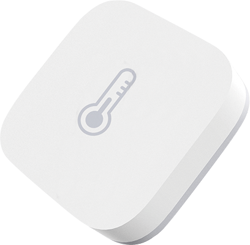

!!! info "Zigbee2Tasmota serves as a gateway for devices connected to a Zigbee wireless network to bridge their communications over to Wi-Fi"

!!! warning "If you are using [ZHA](https://www.home-assistant.io/integrations/zha/) or [Zigbee2MQTT](https://www.zigbee2mqtt.io/) via [Ser2Net](Serial-to-TCP-Bridge.md), Tasmota is only passing bytes between the controller (HA or Z2M) and the Zigbee MCU. Please refer to their respective sites to ask any question. All of the below is dedicated to Zigbee2Tasmota mode."

!!! example "Some sections are marked as 'Advanced topic', you can skip them at first and read them only when you need to go deeper."

Zigbee2Tasmota (Z2T) is a lightweight Zigbee gateway/bridge solution running on ESP8266/ESP8285 or ESP32 Wi-Fi chips. Hence it is easier to deploy wherever you want in your home. It was inspired by Zigbee2MQTT but it was written from scratch to make it fit into the resource constraints of an ESP82xx chip with just 80kB of RAM and only 1MB of flash memory.

For quick reference about Zigbee commands see [Zigbee Commands](Commands.md#zigbee).

## Hardware

Zigbee2Tasmota (Z2T) supports a wide variety of Zigbee MCUs from Texas Instruments (CC253X, CC26x2, CC13x2) and from Silicon Labs (EFR32MG12/EFRMG21), and runs on ESP8266 or any variant of ESP32. Since ESP8266 has very limited resources, we strongly advise to prefer ESP32 based Zigbee gateways.

Flashing and installation instructions for **ESP32** based:

- [Sonoff Zigbee Bridge Pro](https://zigbee.blakadder.com/Sonoff_ZBBridge-P.html)
- [ZB-GW03 eWeLink Ethernet Zigbee Gateway (also sold as EACHEN Zigbee Smart Hub and SmartWise Zigbee Bridge Pro)](https://templates.blakadder.com/ewelink_ZB-GW03)
- [Tube's Ethernet Zigbee Gateway (EFR32 variant)](https://templates.blakadder.com/tube_TUBE013_EFR32.html)
- [DIY Zigbee gateway/bridge device example based on Ebyte E180-ZG120B or E180-ZG120B-TB](https://github.com/zigpy/zigpy/discussions/584)

Flashing and installation instructions for **ESP8266** based:

- [Sonoff ZBBridge by ITead](https://zigbee.blakadder.com/Sonoff_ZBBridge.html)
- [CC2530 based devices](CC2530.md)
- [DIY Zigbee gateway/bridge device example based on IKEA TRÅDFRI ICC-A-1 Module](https://github.com/MattWestb/IKEA-TRADFRI-ICC-A-1-Module/tree/master/Tasmota)

A complete list of Zigbee coordinators and Zigbee devices compatible with Z2T is in the [Zigbee Device Compatibility Repository](https://zigbee.blakadder.com/zigbee2tasmota.html).

### Advanced topic: ZNP or EZSP

Z2T supports MCUs running either the ZNP or EZSP zigbee stack. They require different compilation options but from a user point of view the features are very similar.

Z-Stack or ZNP (Zigbee Network Processor) is an open-source Zigbee stack from Texas Instruments and runs on TI MCUs. Ready to use firmwares are found on [Koenkk's Github](https://github.com/Koenkk/Z-Stack-firmware). Older CC2530 require special wiring or external devices for flashing, while more recent like Sonoff Zigbee Bridge Pro (CC2652P) can be flashed directly from Tasmota. Z2T supports ZNP **version 2.6** (Z-Stack 1.3) and **version 2.7** (Z-Stack 3.x).

EZSP (EmberZNet Serial Protocol) is a commercial Zigbee stack from [Silicon Labs](https://www.silabs.com/). Sonoff/Eachen require encrypted signed firmwares, they can be found [here](https://github.com/arendst/Tasmota/tree/development/tools). Z2T supports EZSP versions 6.7.6 or above (EZSP protocol v8), recommended is **v6.7.9**.

## Introduction

Before using Zigbee with Tasmota, you need to understand a few concepts. Here is a simplified comparison to the Wi-Fi equivalent (sort of).

|Zigbee concept|Wi-Fi equivalent|
|---|---|
|**Zigbee coordinator**<BR>The coordinator is responsible for selecting the channel, PanID, security policy, and stack profile for a network. Zigbee2Tasmota will act as a coordinator.<BR>You can have multiple coordinators as long as they have different PanIDs.|Wi-Fi Access Point|
|**PanID**<BR>(Personal Area Network IDentifier)<BR>This parameter is unique in a Zigbee network (16-bit integer, 0x0000–0x3FFF).<BR>At initial start a pseudo-random PanID is derived from the ESP MAC address.|SSID (the Wi-Fi network name)|
|**ShortAddr**<BR>Address of the device on the Zigbee network. This address is randomly assigned when the device first connects to the coordinator (16 bits integer, 0x0000–0xFFF7). The coordinator has address 0x0000.<BR>You need to track which device has which address or assign a "Friendly Name" to each new discovered device.|IP address|
|**GroupAddr**<BR>Group address of a collection of devices, it allows a single message to address multiple devices at once (16 bits integer, 0x0000–0xFFFF). For example a remote can turn on/off a group of lights. GroupAddr 0x0000 is not assigned.|Multicast|
|**Endpoint**<BR>The endpoint on the coordinator or on the Zigbee device the message is sent from/to. You can see endpoints as logical devices providing distinct features (8 bits integer, 1–240).|TCP port|
|**IEEEAddr**<BR>Device hardware address (64 bits). This is unique per device and factory assigned.|MAC address|
|**Channel** 11-26<BR>*Default: 11* (See [Zigbee-Wifi coexistence](https://www.metageek.com/training/resources/zigbee-wifi-coexistence.html))|Wi-Fi Channel|
|**Encryption Key**<BR>128-bit encryption key.<BR>At initial start a pseudo-random Encryption key is derived from the ESP MAC address.|Wi-Fi password|
|**Pairing**<BR>By default the coordinator does not accept new devices unless put in pairing mode. When in pairing mode, it will accept pairing requests from any device within range.<BR>*Default: pairing disabled*|WPS|
|**Cluster**<BR>Clusters are a group of commands and attributes that define what a device can do. Think of clusters as a group of actions by function. A device can support multiple clusters to do a whole variety of tasks. The majority of clusters are defined by the ZigBee Alliance and listed in the [ZigBee Cluster Library](https://zigbeealliance.org/wp-content/uploads/2019/12/07-5123-06-zigbee-cluster-library-specification.pdf)| |

## Configuration

### Initial start

When you first start Z2T, pseudo-random parameters are derived from your device unique identifiers (MAC address...) for PanID and network encryption keys.

**Sonoff Zigbee Bridge Pro** (ESP32 + CC2652P with ZNP)

``` json
19:02:20.659 ZIG: rebooting ZNP device
19:02:22.960 ZbInput discarding byte 00
19:02:22.962 RSL: RESULT = {"ZbState":{"Status":1,"Message":"CCxxxx ZNP booted","RestartReason":"Power-up","MajorRel":2,"MinorRel":7}}
19:02:23.160 RSL: RESULT = {"ZbState":{"Status":50,"MajorRel":2,"MinorRel":7,"MaintRel":1,"Revision":20220219}}
19:02:23.311 RSL: RESULT = {"ZbState":{"Status":2,"Message":"Resetting configuration"}}
19:02:25.359 ZbInput discarding byte 00
19:02:25.911 RSL: RESULT = {"ZbState":{"Status":3,"Message":"Configured, starting coordinator"}}
19:02:30.062 RSL: RESULT = {"ZbState":{"Status":40,"NewState":9,"Message":"Started as coordinator"}}
19:02:30.162 RSL: RESULT = {"ZbState":{"Status":51,"IEEEAddr":"0x00124B0026B684E4","ShortAddr":"0x0000","DeviceType":7,"DeviceState":9,"NumAssocDevices":0}}
19:02:30.713 RSL: RESULT = {"ZbState":{"Status":0,"Message":"Started"}}
19:02:30.715 ZIG: Zigbee started
19:02:30.720 ZIG: No Zigbee device information
19:02:30.732 ZIG: Zigbee device data in File System (31 bytes)
```

**Sonoff Zigbee Bridge** (ESP8266 + EFR32 with EZSP)

``` json
19:08:26.057 ZIG: Resetting EZSP device
19:08:27.261 RSL: RESULT = {"ZbState":{"Status":1,"Message":"EFR32 EZSP booted","RestartReason":"Power-on","Code":2}}
19:08:27.315 RSL: RESULT = {"ZbState":{"Status":55,"Version":"6.7.8.0","Protocol":8,"Stack":2}}
19:08:27.316 RSL: RESULT = {"ZbState":{"Status":3,"Message":"Configured, starting coordinator"}}
19:08:28.758 RSL: RESULT = {"ZbState":{"Status":56,"IEEEAddr":"0x680AE2FFFE6E103B","ShortAddr":"0x0000","DeviceType":1}}
19:08:28.759 RSL: RESULT = {"ZbState":{"Status":2,"Message":"Resetting configuration"}}
19:08:44.260 ZIG: Resetting EZSP device
19:08:45.463 RSL: RESULT = {"ZbState":{"Status":1,"Message":"EFR32 EZSP booted","RestartReason":"Power-on","Code":2}}
19:08:45.518 RSL: RESULT = {"ZbState":{"Status":55,"Version":"6.7.8.0","Protocol":8,"Stack":2}}
19:08:45.520 RSL: RESULT = {"ZbState":{"Status":3,"Message":"Configured, starting coordinator"}}
19:08:46.822 ZIG: Factory reset EZSP device
19:08:47.053 ZIG: Subscribe to group 0 'ZbListen0 0'
19:08:47.108 RSL: RESULT = {"ZbState":{"Status":0,"Message":"Started"}}
19:08:47.108 ZIG: Zigbee started
19:08:47.138 ZIG: No Zigbee device information
19:08:47.145 ZIG: No Zigbee device data
```

When you further restart, logs are slightly shorter (less lines) since the MCU is already configured.

### Customize Zigbee configuration

At initial start, Tasmota generates pseudo-random Zigbee parameters. They should  work out of the box but you also may want to choose different values:

Use the command `ZbConfig` to dump the current configuration. For example it might return `{"ZbConfig":{"Channel":11,"PanID":"0x1A63","ExtPanID":"0xCCCCCCCCCCCCCCCC","KeyL":"0x0F0D0B0907050301","KeyH":"0x0D0C0A0806040200"}}`

To apply a new configuration, populate the fields you want to change in a single-level JSON:

`ZbConfig {"Channel":11,"PanID":"0x1A63","ExtPanID":"0xCCCCCCCCCCCCCCCC","KeyL":"0x0F0D0B0907050301","KeyH":"0x0D0C0A0806040200"}`

!!! info "Changing any parameter with `ZbConfig` requires to re-pair all devices."

!!! info "In case you coordinator fails at starting, for example because of conflicting PanID, you have about 15 seconds after boot to use ZbConfig to change your configuration. After the coordinator fails to start all, zigbee commands are disabled."

|Parameter|Description|
|---|---|
|Channel|`11-26` Zigbee radio channel, see above|
|PanID|`0x0001-0x3FFF` unique Zigbee network identifier. You should not have two coordinators using the same PanID, or bad things happen.<BR>If your coordinator fails to start, try changing the PanID as it may conflict with one already in use.|
|ExtPanID|This is a 64 bit unique identifier for the network. It is not used much in Z2T but needs to be unique.|
|KeyL KeyH|This is the 128 bit network encryption key split into High and Low 64 bit parts. Do not reveal this key or anyone can decrypt your Zigbee traffic.|
|TxRadio|On some devices you can set the radio power in dBm. You generally don't need to change it.|

### Advanced topic: GPIOs

You will usually find a ready to use template in the [Zigbee Device Compatibility Repository](https://zigbee.blakadder.com/zigbee2tasmota.html)

Below are the details of the GPIO configuration needed by Zigbee:

|GPIO|Description|
|---|---|
|`Zigbee Tx` and `Zigbee Rx`|GPIOs used for serial communication between Tasmota and the MCU (needed for both ZNP and EZSP). Communication is always 115200 bps 8N1.|
|`Zigbee Rst 1`|(optional) defines the hardware Reset for the Zigbee MCU. If not defined, Z2T will fallback to sending a soft-reset to the MCU using a special serial sequence (which may fail on rare occasions).|
|`Zigbee Rst 2`|(optional) defines a special pin used to put the MCU in bootloader and flashing mode when the hardware reset is pulled down. This is used both by EFR32 and CC2652P based devices. It allows to flash the MCU directly from Tasmota.|
|`LedLink` or `LedLink_i`|(optional) when defined, this led keeps its normal Wifi/MQTT status indicator (blinking) and adds a glowing light when Permit Join is active (i.e. new devices are allowed to pair).|
|`Led 1` or `Led_i 1`|(optional) when defined, used as an indicator of traffic between Tasmota and the MCU, which generally means Zigbee traffic is sent or received.|

### Advanced topic: Hardware or Software serial

On **ESP32** serial is always handled by hardware so you don't need to bother.

On **ESP8266** using the hardware serial is preferred. To do so, you need to use GPIOs 13/15 for Zigbee Rx/Tx and set `SerialLog 0`. By doing so, Z2T *steals* the hardware UART from the serial console and uses it for communicating with the MCU. Otherwise Z2T uses Software Serial which requires compiling at 160MHz and might be unreliable on very rare occasions.

## Commands

For a list of available commands see [Zigbee Commands](Commands.md#zigbee).

## Quick start

In this section, we'll give a quick overview of 2 devices:

- [Sonoff SNZB-02 Temperature And Humidity Sensor](https://zigbee.blakadder.com/Sonoff_SNZB-02.html)

- [BlitzWolf SHP15 Power Monitoring Plug](https://zigbee.blakadder.com/BlitzWolf_BW-SHP15.html)

## Definition File

From the start, Z2T design was to stick to a low-level view and provide higher level (named) attributes only for a limited set of mostly seen attributes. This raised difficulties and frustration for users with specific devices that use rare attributes, or devices that use non-standard attributes (like Tuya zigbee devices).

We are now providing a **Zigbee Device plugin** mechanisms, using simple text files. These files specify mapping on a per-device type basis. The goal is to fill most of the gap with Zigbee2MQTT (provided that you write the device plugin files). The lightweight nature of plugins permits to load only the plugins required by the devices used, and does not require a sowftare update for new devices.

### How does it work?

You simply copy device plugin files (externsion `*.zb`) in the file system and they are automatically loaded at start.

You can dynamically load new files with `ZbLoad <file>.zb` or unload definitions with `ZbUnload <file>.zb`. When you reload a file with the same name, it is first unloaded.

At Zigbee start, all files with `*.zb` suffix are loaded into memory. Be careful of not saturating memory, especially on ESP8266.

### Zigbee device plugin format

**Zigbee device plugin** have the following format:

- starts with `#Z2Tv1` on the first line
  - `#` is a marker for comments, and everything from `#` to end of line is ignored
  - rest of the file is of form **device matcher** followed by **attribute definitions** or **attribute synonyms**

#### **device matchers**

- composed of one or more lines defining the `modelId` and `manufacturerId`. If a field is empty, it matches all values
- `:<modelId>,<manufacturerId>`
- example: `:TS0601,_TZE200_sh1btabb` for GiEX water valve

#### **attribute matcher** specifies a cluster/attribute/type tuple and matches an attribute name

- `<cluster 4 hex>/<attribute 4 hex>` or `<cluster 4 hex>/<attribute 4 hex>%<type 2 hex>`
- Ex: `EF00/0365,IrrigationStartTime` (Tuya cluster EF00 does not need an explicit type)
- Ex: `0006/4001%bool,OnTime`

#### **attribute synonyms** specifies that a received attribute is a synonym for another attribute

- `<cluster 4 hex>/<attribute 4 hex>=<new_cluster 4 hex>/<new_attribute 4 hex>,<multiplier>`
- Ex: `EF00/026C=0001/0021,2` converts any EFOO/026C attribute received to `0001/0021` (BatteryPercentage) and multiplies by `2` to convert to ZCL standard.

Multiplier is 8 bit int (-128..127). If `0` or `1`, the value is unchanged. Otherwise the value is converted to `float` and is multiplied by `multiplier` if positive, or divided by `-multiplier` if negative.

I.e. `multiplier=10` means multiply by 10, `multiplier=-5` means divide by 5

### Sonoff SNZB-02 Sensor

{width="150"}

Put Z2T in **pairing mode** (command `ZbPermitJoin 1` or via WebUI) and keep the button of the sensor pressed for 5 seconds. Wait 20 seconds, you should see something similar to this in the logs:

``` json
17:07:53.015 RSL: RESULT = {"ZbState":{"Status":34,"IEEEAddr":"0x00124B001F841E41","ShortAddr":"0x2916","ParentNetwork":"0x0000"}}
17:07:53.465 RSL: RESULT = {"ZbState":{"Status":30,"IEEEAddr":"0x00124B001F841E41","ShortAddr":"0x2916","PowerSource":false,"ReceiveWhenIdle":false,"Security":false}}
17:07:54.565 RSL: RESULT = {"ZbState":{"Status":32,"ActiveEndpoints":["0x01"]}}
17:07:55.037 ZIG: Zigbee Devices Data saved in File System (18 bytes)
17:07:55.168 RSL: SENSOR = {"ZbReceived":{"0x2916":{"Device":"0x2916","ModelId":"TH01","Manufacturer":"eWeLink","Endpoint":1,"LinkQuality":120}}}
17:07:56.667 RSL: RESULT = {"ZbState":{"Status":33,"Device":"0x2916","Endpoint":"0x01","ProfileId":"0x0104","DeviceId":"0x0302","DeviceVersion":0,"InClusters":["0x0000","0x0003","0x0402","0x0405","0x0001"],"OutClusters":["0x0003"]}}
17:07:57.241 ZIG: Zigbee Devices Data saved in File System (29 bytes)
17:07:58.667 ZIG: auto-bind `ZbBind {"Device":"0x2916","Endpoint":1,"Cluster":"0x0001"}`
17:07:59.217 RSL: RESULT = {"ZbBind":{"Device":"0x2916","Status":0,"StatusMessage":"SUCCESS"}}
17:08:00.717 ZIG: auto-bind `ZbBind {"Device":"0x2916","Endpoint":1,"Cluster":"0x0402"}`
17:08:01.018 RSL: RESULT = {"ZbBind":{"Device":"0x2916","Status":0,"StatusMessage":"SUCCESS"}}
17:08:02.669 ZIG: auto-bind `ZbBind {"Device":"0x2916","Endpoint":1,"Cluster":"0x0405"}`
17:08:03.618 RSL: RESULT = {"ZbBind":{"Device":"0x2916","Status":0,"StatusMessage":"SUCCESS"}}
17:08:04.670 ZIG: auto-bind `ZbSend {"Device":"0x2916","Config":{"BatteryVoltage":{"MinInterval":3600,"MaxInterval":14400,"ReportableChange":0.2},"BatteryPercentage":{"MinInterval":3600,"MaxInterval":14400,"ReportableChange":5}}}`
17:08:05.271 RSL: SENSOR = {"ZbReceived":{"0x2916":{"Device":"0x2916","ConfigResponse":{},"Endpoint":1,"LinkQuality":123}}}
17:08:06.670 ZIG: auto-bind `ZbSend {"Device":"0x2916","Config":{"Temperature":{"MinInterval":30,"MaxInterval":3600,"ReportableChange":0.5}}}`
17:08:06.871 RSL: SENSOR = {"ZbReceived":{"0x2916":{"Device":"0x2916","ConfigResponse":{},"Endpoint":1,"LinkQuality":120}}}
17:08:08.670 ZIG: auto-bind `ZbSend {"Device":"0x2916","Config":{"Humidity":{"MinInterval":30,"MaxInterval":3600,"ReportableChange":1}}}`
17:08:09.421 RSL: SENSOR = {"ZbReceived":{"0x2916":{"Device":"0x2916","ConfigResponse":{},"Endpoint":1,"LinkQuality":120}}}
17:08:14.221 RSL: SENSOR = {"ZbReceived":{"0x2916":{"Device":"0x2916","Temperature":25.72,"Humidity":47.73,"Endpoint":1,"LinkQuality":116}}}
```

These logs are quite rich and we'll dive into the details later. Basically it says that the device paired successfully and is configured.

Next step is **setting a friendly name** with `zbname 0x2916,SNZB-02`

``` json
17:09:27.294 CMD: zbname 0x2916,SNZB-02
17:09:27.297 RSL: RESULT = {"0x2916":{"Name":"SNZB-02"}}
17:09:29.375 ZIG: Zigbee Devices Data saved in File System (37 bytes)
```

The device will regularly report readings like this:

``` json
17:09:44.351 RSL: SENSOR = {"ZbReceived":{"0x2916":{"Device":"0x2916","Name":"SNZB-02","Temperature":26.27,"Endpoint":1,"LinkQuality":105}}}
```

Information is also displayed in the WebUI.

{ width="352" }

When you hover the arrow on the name, you get additional information like short-address and manufacturer.

{ width="352" }

When you hover over the battery icon, you get a more precise reading.

{ width="352" }

### BlitzWolf SHP15 Plug

{width="150"}

Put Z2T in **pairing mode** (command `ZbPermitJoin 1` or via WebUI) and keep the button of the sensor pressed for 5 seconds. Wait 20 seconds, you should see something similar to this in the logs:

``` json
16:17:40.804 RSL: RESULT = {"ZbState":{"Status":34,"IEEEAddr":"0x842E14FFFE13A51E","ShortAddr":"0x7120","ParentNetwork":"0x0000"}}
16:17:40.854 RSL: RESULT = {"ZbState":{"Status":30,"IEEEAddr":"0x842E14FFFE13A51E","ShortAddr":"0x7120","PowerSource":true,"ReceiveWhenIdle":true,"Security":false}}
16:17:41.003 RSL: RESULT = {"ZbState":{"Status":32,"ActiveEndpoints":["0x01"]}}
16:17:41.408 RSL: SENSOR = {"ZbReceived":{"0x7120":{"Device":"0x7120","ModelId":"TS0121","Manufacturer":"_TZ3000_g5xawfcq","Endpoint":1,"LinkQuality":229}}}
16:17:42.655 RSL: RESULT = {"ZbState":{"Status":33,"Device":"0x7120","Endpoint":"0x01","ProfileId":"0x0104","DeviceId":"0x0051","DeviceVersion":1,"InClusters":["0x0000","0x0004","0x0005","0x0006","0x0702","0x0B04"],"OutClusters":["0x0019","0x000A"]}}
16:17:43.442 ZIG: Zigbee Devices Data saved in File System (40 bytes)
16:17:44.516 RSL: SENSOR = {"ZbReceived":{"0x7120":{"Device":"0x7120","Power":1,"0006/4001":0,"0006/4002":0,"0006/8001":1,"0006/8002":2,"Endpoint":1,"LinkQuality":229}}}
16:17:44.664 ZIG: auto-bind `ZbBind {"Device":"0x7120","Endpoint":1,"Cluster":"0x0006"}`
16:17:44.863 RSL: RESULT = {"ZbBind":{"Device":"0x7120","Status":0,"StatusMessage":"SUCCESS"}}
16:17:46.466 RSL: SENSOR = {"ZbReceived":{"0x7120":{"Device":"0x7120","EnergyTotal":"0x000000000000","Endpoint":1,"LinkQuality":229}}}
16:17:46.664 ZIG: auto-bind `ZbSend {"Device":"0x7120","Config":{"Power":{"MinInterval":1,"MaxInterval":3600}}}`
16:17:46.916 RSL: SENSOR = {"ZbReceived":{"0x7120":{"Device":"0x7120","ConfigResponse":{},"Endpoint":1,"LinkQuality":229}}}
16:17:47.815 ZIG: Auto-responder: ZbSend {"Device":"0x7120","Cluster":"0x000A","Endpoint":1,"Response":"000A/0007":711476267}
16:17:47.819 RSL: SENSOR = {"ZbReceived":{"0x7120":{"Device":"0x7120","Cluster":10,"Read":[7],"ReadNames":{"LocalTime":true},"Endpoint":1,"LinkQuality":229}}}
```

Again lots of lines we'll not explore for now.

You can **turn on** the plug:

`zbsend {"device":"SHP15","send":{"power":true}}`

``` json
16:24:24.208 RSL: RESULT = {"ZbSend":"Done"}
16:24:25.005 RSL: SENSOR = {"ZbReceived":{"0x7120":{"Device":"0x7120","Name":"SHP15","Power":1,"Endpoint":1,"LinkQuality":229}}}
```

You can **turn off** the plug: (you can use `"power":0` or `"power":false`)

`zbsend {"device":"SHP15","send":{"power":0}}`

``` json
16:24:01.456 RSL: RESULT = {"ZbSend":"Done"}
16:24:02.252 RSL: SENSOR = {"ZbReceived":{"0x7120":{"Device":"0x7120","Name":"SHP15","Power":0,"Endpoint":1,"LinkQuality":229}}}
```

You can **read the current state**: (you can use `"power":1` or `"power":true`)

`zbsend {"device":"SHP15","read":{"power":true}}`

``` json
16:24:45.265 RSL: RESULT = {"ZbSend":"Done"}
16:24:45.815 RSL: SENSOR = {"ZbReceived":{"0x7120":{"Device":"0x7120","Name":"SHP15","Power":1,"Endpoint":1,"LinkQuality":229}}}
```

You can **read the current power**: (here 0W)

`zbsend {"device":"SHP15","read":{"activepower":true}}`

``` json
16:29:17.309 RSL: RESULT = {"ZbSend":"Done"}
16:29:17.860 RSL: SENSOR = {"ZbReceived":{"0x7120":{"Device":"0x7120","Name":"SHP15","ActivePower":0,"Endpoint":1,"LinkQuality":229}}}
```

When you directly turn on or off the plug with its button, it also spontaneously reports the changes:

``` json
16:29:45.660 RSL: SENSOR = {"ZbReceived":{"0x7120":{"Device":"0x7120","Name":"SHP15","Power":0,"Endpoint":1,"LinkQuality":218}}}
16:29:52.460 RSL: SENSOR = {"ZbReceived":{"0x7120":{"Device":"0x7120","Name":"SHP15","Power":1,"Endpoint":1,"LinkQuality":218}}}
```

The WebUI is also reporting the last known values:

{ width="352" }

### Advanced topic: logs when pairing

This is an example of a pairing process for the [Aqara Temperature & Humidity Sensor](https://zigbee.blakadder.com/Xiaomi_WSDCGQ11LM.html). To pair this sensor, issue `ZbPermitJoin 1` and then press and hold the reset button for 5 seconds. The sensor LED will flash several times and you will see log entries in the console, especially this one:

```json
MQT: tele/%topic%/SENSOR = {"ZbState":{"Status":30,"IEEEAddr":"0x00158D00036B50AE","ShortAddr":"0x8F20","PowerSource":false,"ReceiveWhenIdle":false,"Security":false}}
```

Message with `"Status":30` shows some characteristics of the device:

|Field name|Value|
|---|---|
|`Status`|`30` indicates a device connect or reconnect. This is the opportunity to match IEEEAddress and short address|
|`IEEEAddr`|Long unique address (64 bits) of the device - factory set|
|`ShortAddr`|Short address (16 bits) randomly assigned to the device on this Zigbee network|
|`PowerSource`|`true` = the device is connected to a power source<BR>`false` = the device runs on battery|
|`ReceiveWhenIdle`|`true` = the device can receive commands when idle<BR>`false` = the device is not listening. Commands should be sent when the device reconnects and is idle|
|`Security`|Security capability (meaning unknown, to be determined)|

## Advanced topic: Zigbee plugin Definition File

From the start, Z2T design was to stick to a low-level view and provide higher level (named) attributes only for a limited set of mostly seen attributes. This raised difficulties and frustration for users with specific devices that use rare attributes, or devices that use non-standard attributes (like Tuya zigbee devices).

We are now providing a [**Zigbee Device plugin**](#advanced-topic-zigbee-device-plugin) mechanisms, using simple text files. These files specify mapping on a per-device type basis. The goal is to fill most of the gap with Zigbee2MQTT (provided that you write the device plugin files). The lightweight nature of plugins permits to load only the plugins required by the devices used, and does not require a software update for new devices.

### How does it work?

You simply copy device plugin files (externsion `*.zb`) in the file system and they are **automatically loaded at start**.

During troubleshooting, you can dynamically load new files with `ZbLoad <file>.zb` or unload definitions with `ZbUnload <file>.zb`. When you reload a file with the same name, it is first unloaded.

At Zigbee start, all files with `*.zb` suffix are loaded into memory. Be careful of not saturating memory, especially on ESP8266.

## Pairing Devices

When you create a new Zigbee network, it contains no devices except the coordinator (your Zigbee gateway). The first step is to add devices to the network, which is called **pairing**.

By default, and for security reasons, the Zigbee coordinator does not automatically accept new devices. To pair new devices, use [`ZbPermitJoin 1`](Commands.md#zbpermitjoin) or click **Zigbee Permit Join** in the WebUI to allow accepting new devices for the next 60 seconds. Then put your Zigbee device pairing mode. This is usually accomplished by pressing the button on the device for 5 seconds or more.

`ZbPermitJoin 1`

```json
CMD: ZbPermitJoin 1
MQT: stat/%topic%/RESULT = {"ZbPermitJoin":"Done"}
MQT: tele/%topic%/RESULT = {"ZbState":{"Status":21,"Message":"Enable Pairing mode for 60 seconds"}}
```

60 seconds later:

```json
MQT: tele/%topic%/RESULT = {"ZbState":{"Status":20,"Message":"Disable Pairing mode"}}
```

After the device has successfully paired it will be shown in the WebUI with its short address and its link quality number (LQI). When it is a battery powered device, the battery percentage will be displayed as soon as it is received from the device.

{ width="352" }

Devices will show their friendly name once you set it.

### Setting Friendly Name

Instead of a short address like `0x8F20` you can assign an easy to remember friendly name such as `Bedroom_Sensor`.

See [`ZbName`](Commands.md#zbname) command for all options.

!!! example "Xiaomi Aqara Cube with address `0x128F`"

```json
MQT: tele/%topic%/RESULT = {"ZbReceived":{"0x128F":{"AqaraVibrationMode":"tilt","AqaraVibrationsOrAngle":162,"AqaraAccelerometer":[-690,2,138],"AqaraAngles":[-78,0,11],"LinkQuality":158}}}
```

Setting its friendly name to `Vibration_sensor`:
```json
ZbName 0x128F,Vibration_sensor
CMD: ZbName 0x128F,Vibration_sensor
MQT: stat/%topic%/RESULT = {"0x128F":{"Name":"Vibration_sensor"}}

(10 seconds later)
ZIG: Zigbee Devices Data store in Flash (0x402FF800 - 270 bytes)
```

Now the sensor readings includes the friendly name:
```json
MQT: tele/%topic%/RESULT = {"ZbReceived":{"0x128F":{"Name":"Vibration_sensor","AqaraVibrationMode":"tilt","AqaraVibrationsOrAngle":171,"AqaraAccelerometer":[-691,12,130],"AqaraAngles":[-78,1,11],"LinkQuality":153}}}
```

If you set [`SetOption83 1`](Commands.md#setoption83) sensor readings will use the friendly name as JSON key, short address is added as `Device`:
```json
MQT: tele/%topic%/RESULT = {"ZbReceived":{"Vibration_sensor":{"Device":"0x128F","AqaraVibrationMode":"tilt","AqaraVibrationsOrAngle":171,"AqaraAccelerometer":[-691,8,136],"AqaraAngles":[-78,1,11],"LinkQuality":153}}}
```

### Removing Devices

A Zigbee device will continue to connect to a coordinator unless you ask it to "leave" or if you change the network configuration (change of PanID or network key - which means losing ALL devices).

To ask a device to leave the network, use command `ZbLeave <device>` or `ZbLeave <friendlyname>`. This sends a message to the device, which needs to be awake to process it. For battery powered devices, you need to wake them up when sending this command. Unfortunately there is no confirmation message sent back. Note: even if the device left the network, it is still registered in Z2T and continues to appear on the UI. To remove it from the list, use `ZbForget` below.

To remove a device from the Zigbee2Tasmota list of devices and from the WebUI, use the command `ZbForget <device>` or `ZbForget <friendlyname>`. If the device is still connected to the network, it will pop up again later. I.e. ZbForget does not remove a device from the network; else use `ZbLeave` above.

### Advanced topic: Device Information

You can get a quick list of Zigbee devices with the command [`ZbStatus`](Commands.md#zbstatus).

Example:

```json
18:30:58.972 CMD: ZbStatus
18:30:58.980 MQT: stat/xxx/RESULT = {"ZbStatus1":[{"Device":"0xECD0","Name":"IKEA_Bulb"},{"Device":"0x8959","Name":"Plug"}]}
```

You can use the command [`ZbInfo`](Commands.md#zbinfo) to display all information, endpoints and last known values for the main attributes. There are variants in the commands arguments:

- `ZbInfo` (no arg): list all known device one after the other
- `ZbInfo 0xECD0`: show information of a device by short address
- `Zbinfo IKEA_Bulb`: show information of a device by friendly name
- `Zbinfo 0x90FD9FFFFE03B051`: show information of a device by long address (IEEE address)
- `ZbInfo 1`, `ZbInfo 2`... iterate through devices in sequence

!!! note "`ZbInfo` does not query the device, it only shows the last known state of the device from Tasmota memory"

Example:

```json
18:38:51.523 CMD: ZbInfo
18:38:51.532 MQT: tele/xxx/SENSOR = {"ZbInfo":{"0xECD0":{"Device":"0xECD0","Name":"IKEA_Bulb","IEEEAddr":"0x90FD9FFFFE03B051","ModelId":"TRADFRI bulb E27 WS opal 980lm","Manufacturer":"IKEA of Sweden","Endpoints":[1],"Config":["O01","L01.2"],"Power":1,"Dimmer":160,"X":30138,"Y":26909,"CT":350,"ColorMode":2,"RGB":"FFC773","RGBb":"A17E49","Reachable":true,"LastSeen":353,"LastSeenEpoch":1658349178,"LinkQuality":79}}}
18:38:51.570 MQT: tele/xxxx/SENSOR = {"ZbInfo":{"0x8959":{"Device":"0x8959","Name":"Plug","IEEEAddr":"0x7CB03EAA0A0292DD","ModelId":"Plug 01","Manufacturer":"OSRAM","Endpoints":[3],"Config":["L03.0","O03"],"Dimmer":254,"Power":0,"Reachable":false,"LastSeen":16607299,"LastSeenEpoch":1641742232,"LinkQuality":147}}}
```

_(formatted for readability)_

```json
18:38:51.532 MQT: tele/xxx/SENSOR = 
{
	"ZbInfo": {
		"0xECD0": {
			"Device": "0xECD0",
			"Name": "IKEA_Bulb",
			"IEEEAddr": "0x90FD9FFFFE03B051",
			"ModelId": "TRADFRI bulb E27 WS opal 980lm",
			"Manufacturer": "IKEA of Sweden",
			"Endpoints": [1],
			"Config": ["O01", "L01.2"],
			"Power": 1,
			"Dimmer": 160,
			"X": 30138,
			"Y": 26909,
			"CT": 350,
			"ColorMode": 2,
			"RGB": "FFC773",
			"RGBb": "A17E49",
			"Reachable": true,
			"LastSeen": 353,
			"LastSeenEpoch": 1658349178,
			"LinkQuality": 79
		}
	}
}
18:38:51.570 MQT: tele/xxxx/SENSOR = 
{
	"ZbInfo": {
		"0x8959": {
			"Device": "0x8959",
			"Name": "Plug",
			"IEEEAddr": "0x7CB03EAA0A0292DD",
			"ModelId": "Plug 01",
			"Manufacturer": "OSRAM",
			"Endpoints": [3],
			"Config": ["L03.0", "O03"],
			"Dimmer": 254,
			"Power": 0,
			"Reachable": false,
			"LastSeen": 145,
			"LastSeenEpoch": 1641742232,
			"LinkQuality": 147
		}
	}
}
```

Most common attributes:

|Attribute|Description|
|---|---|
|Device|Zigbee device short address|
|Name|Friendly name|
|IEEEAddr|Zigbee device long address (does not change after new pairing)|
|ModelID|Zigbee Model name as configured by manufacturer (cannot be changed)|
|Manufacturer|Manufacturer name|
|Endpoints|List of endpoints|
|Config|(used internally)|
|(attributes)|attributes tracked by Z2T|
|LastSeen|Number of seconds since the last message was received|
|LastSeenEpoch|Timestamp when the last message was received|
|LinkQuality|Radio power of the last message received|


### Advanced topic: Sending sensor values to separated MQTT topics

It is possible to publish the sensor values to their own MQTT topic. For this functionality the following rule can be applied in the console:

```
Rule<x>
  on zbreceived#<zigbee_id>#<zigbee_sensorname> do publish home/zigbee/<zigbee_name>/<sensorname> %value% endon
	
Rule<x> 1
```

For example:
```
Rule1
  on zbreceived#0xAA7C#humidity do publish home/zigbee/office/humidity %value% endon
  on zbreceived#0xAA7C#temperature do publish home/zigbee/office/temperature %value% endon

Rule1 1
```

If retained values are preferred use publish2 instead of publish.

## Understanding Zigbee messages

There are 2 main types of Zigbee messages, **commands** and **reading/writing attributes**.

For example, you can send a command `"Power":1` to turn a bulb on or `"Power":0` to turn it off.

Simultaneously you can read the `"Power"` attribute to know the state of the bulb.

Some attributes are writable, but this corresponds to a change of configuration of the device. You generally can't change the status of a device writing to attributes, you need to use commands instead.

Internally, Zigbee uses low-level identifiers and Z2T provides human readable versions for the main attributes and commands. In the example above, although the command and the attribute have the same name `"Power"`, they have different low-lever identifiers.

### Operations on attributes and commands

Below are the possible Zigbee messages (we consider here messages between the coordinator and the Zigbee device):

- **Read attribute(s)**: send a 'read-attribute' message to the Zigbee device, the device then responds with the value of the attributes it supports. Ex: read the current brightness of a bulb or a sensor.
`ZbSend {"Device":"<device>", "Read":{...}}`

- **Write attribute(s)**: send a 'write-attribute' message to the Zigbee device with a value, the device confirms or sends an error. Ex: change the sensitivity of an illuminance sensor.
`ZbSend {"Device":"<device>", "Write":{...}}`

- **Report attribute(s)**: Zigbee device may spontaneously report attributes without polling. This happens typically with sensors. New attribute values are sent after a certain time or when the value changes above a threshold.

- **Send a command**: send a command to a Zigbee device, ex: turn on a bulb, change its color...
`ZbSend {"Device":"<device>", "Send":{...}}`

- **Receive a command**: Zigbee device may send commands to the coordinator (less frequent). Ex: an alarm sensor sends an 'Intruder Alert' command to the coordinator.

When a command is sent or an attribute is written to a device, the device may or may not acknowledge. However it will always report an error if the message is malformed or if some attributes/commands are not supported.

### Sleeping devices

Devices connected to mains (smart plugs, smart bulbs...) are always reachable and can accept Zigbee messages at any time.

Devices that are powered by batteries are not always reachable. Most of the time they are in sleep mode and not reachable. They regularly connect back to the coordinator to send new values and get messages (ex: once per hour). When you need to send messages to battery-powered devices, you must first wake them up, for example pressing on a button. The device may stay awake for only a couple of seconds, so you must send the message just before or just after pressing the button on the device.

### Configure Reporting
Devices normally report their status when the value changes. They can also report the state within certain intervals, to configure this the command ZbSend is used.

Example for setting the reporting interval for a smart plug to always report the state, regardless if it has changed or not:
```
ZbSend {"Device": "MySmartPlug1", "Config":{"Power":{"MinInterval":30, "MaxInterval": 50, "ReportableChange": 0}}}
```
Example for setting the reporting interval for a Parasoll-door-sensor to always report the state (keep sensor awake when sending this by triggering it):
```
ZbSend {"Device": "myDoorSensorSwitch", "Endpoint": 2, "Config": {"0500/0002": {"MinInterval": 60, "MaxInterval": 120, "ReportableChange": 0}}}
```

### Advanced topic: Endpoints and Clusters

An endpoint supports different functions separated in clusters, and a device can have multiple endpoints to do different things. To simplify, think of your Zigbee device as a normal Tasmota device with a Zigbee radio instead of Wi-Fi. Each endpoint is akin to a GPIO that has connected [Components](Components) or Clusters, in Zigbee terms.

Cluster definitions in relation to their endpoint are determined by [Zigbee Alliance](https://zigbeealliance.org/wp-content/uploads/2019/12/07-5123-06-zigbee-cluster-library-specification.pdf). Not all manufacturers followed the proposed allocations but in general it is a cornerstone document.

Z2T will automatically take the first endpoint in the list which works most of the time. You normally don't need to specify the endpoint number. In rare cases, you can force a specific endpoint.

## Reading Sensors
Most sensors will publish their readings regularly or once a significant change has happened: temperature, pressure, humidity, presence, illuminance...

Sensor messages are published via MQTT when they are received from the Zigbee device. Similar to Zigbee2MQTT, Z2T tries to group and debounce sensor values when they are received within a 350ms window (can be change with `USE_ZIGBEE_COALESCE_ATTR_TIMER` compile option).

!!! example "Aqara Temperature & Humidity Sensor"


This sensor monitors humidity, temperature, and air pressure.  Its Zigbee model ID is `lumi.weather`.

This device publishes sensor values roughly every hour or when a change occurs. You can also force an update pressing the device's button. It sends two kinds of messages, either 3x standard Zigbee messages, or a single proprietary message containing all sensor values.

`0x8F20` is the ShortAddress of the sensor, and its name is `Kitchen` if you used `ZbName 0x8F20,Kithchen`.

```json
MQT: tele/%topic%/SENSOR ={"ZbReceived": {"0x8F20": {"Name": "Kitchen", "Voltage": 2.995, "Battery": 98, "Temperature": 21.01, "Humidity": 53.68, "Pressure": 1004.04, "PressureUnit": "hPa", "Endpoint": 1, "LinkQuality": 88}}
```

or prefixed by name if you set `SetOption83 1`

```json
MQT: tele/%topic%/SENSOR ={"ZbReceived": {"Kitchen": {"Device": "0x8F20", "Voltage": 2.995, "Battery": 98, "Temperature": 21.01, "Humidity": 53.68, "Pressure": 1004.04, "PressureUnit": "hPa", "Endpoint": 1, "LinkQuality": 88}}
```

Topic is device specific, to allow more effective retained messages, if you set `SetOption89 1`

```json
MQT: tele/%topic%/8F20/SENSOR ={"ZbReceived": {"Kitchen": {"Device": "0x8F20", "Voltage": 2.995, "Battery": 98, "Temperature": 21.01, "Humidity": 53.68, "Pressure": 1004.04, "PressureUnit": "hPa", "Endpoint": 1, "LinkQuality": 88}}
```

Supported values:

|Field name|Value|
|---|---|
|`LinkQuality`|Strength of the Zigbee signal, between 1 and 254 (integer). See this [ZigBee and WiFi Coexistence](https://www.metageek.com/training/resources/zigbee-wifi-coexistence.html)|
|`Humidity`|Humidity in percentage (float)|
|`Pressure` and `PressureUnit`|Atmospheric pressure (float) and unit (string)<BR>Currently only `hPa` (A.K.A. mbar) is supported|
|`Temperature`|Temperature in Celsius (float)|
|`Voltage`|Battery voltage (float)|
|`Battery`|Battery charge in percentage (integer)|
|`ModelId`|Model name of the Zigbee device (string)<BR>Ex: `lumi.weather`|
|`ScaledValue` and `Scale`|Give the raw measure and the scale correction as 10^scale|
|And many more...||

If a value is not decoded, it will appear as `"<cluster>_<attr>":<value>` where `<cluster>` is the Zigbee ZCL Cluster of the attribute (family), `<attr>` is the attribute number and `<value>` its published value.

!!! example
    `"0402_0000":2240` is attribute 0x0000 from cluster 0x0402, which is the temperature in hundredth of °C. It is automatically converted to `"Temperature":22.40`.

## Sending Device Commands

You can send commands to a device or groups of devices similar to a normal Tasmota command. For example to turn on a light or switch off a plug.

Here is a list of supported commands, see below how to send any unlisted command.

Command|Parameters|Cluster number
-|-|-
Power|`1` or `true` or `"true"` or `"on"`: On <BR> `0` or `false` or `"false"` or `"off"`: Off <BR> `2` or `"toggle"`: Toggle|0x0006
Dimmer|`0..254`: Dimmer value<BR>255 is normally considered as invalid, and may be converted to 254|0x0008
DimmerUp|` `: no parameter. Increases dimmer by 10%|0x0008
DimmerDown|` `: no parameter. Decreases dimmer by 10%|0x0008
DimmerStop|` `: no parameter. Stops any running increase of decrease of dimmer.|0x0008
ResetAlarm|`<alarmcode>,<clusterid>`: (to be documented later)|0x0009
ResetAllAlarms|` `: no parameter, (to be documented later)|0x0009
Hue|`0..254`: change Hue value|0x0300
Sat|`0..254`: change Sat value|0x0300
HueSat|`0..254,0..254`: change both Hue and Sat values|0x0300
Color|`0..65534,0..65534`: change the color using [x,y] coordinates|0x0300
CT|`0..65534`: change the white color-temperature in [mireds](https://en.wikipedia.org/wiki/Mired)|0x0300
Shutter|`0..254`: send any Shutter command (prefer the commands below)|0x0102
ShutterOpen|` `: no parameter, open shutter|0x0102
ShutterClose|` `: no parameter, close shutter|0x0102
ShutterStop|` `: no parameter, stop shutter movement|0x0102
ShutterLift|`0..100`: move shutter to a specific position in percent<BR>`0`%=open, `100`%=closed|0x0102
ShutterTilt|`0..100`: move the shutter to the specific tilt position in percent|0x0102

The format of the command is following:

`ZbSend {"Device":"<device>","Send":{"<sendcmd>":<sendparam>}}` where<BR>`<device>`identifies the target and can be a shortaddr `0x1234`, a longaddr `0x1234567812345678` or a friendly name `Kitchen`.<BR>
 `"<sendcmd>":<sendparam>` is the command and its parameters from the table.

If the device has been correctly paired and its endpoints recorded by Z2T, you shouldn't need to specify a target endpoint. You can use an option `"endpoint":<endpoint>` parameter if Z2T can't find the correct endpoint or if you want to change from the default endpoint.

!!! example "MQTT command example"
	Topic = `cmnd/ZigbeeGateway/ZbSend`<BR>
	Payload = `{"Device":"0x1234","Send":{"Power":0}}` or `{"Device":"0x1234","Write":{"Power":0}}`
	
### Low-level Commands

There is a special syntax if you want to send arbitrary commands:
`"Send":"<send_bytes>"` where `<send_bytes>` has the following syntax:

`"<cluster>_<cmd>/<bytes>"`: send a non-cluster specific command for cluster id `<cluster>`, command id `<cmd>` and payload `<bytes>`.

!!! example
    `ZbSend {"Device":"0x1234","Send":"0000_00/0500"}`
     Send a Read command (0x00) to the general cluster (0x0000) for attribute ManufId (0x0005). Note: all values are little-endian.

Or use `'!'` instead of `'_'` to specify cluster-specific commands:

`"<cluster>!<cmd>/<bytes>"`: send a cluster specific command for cluster id `<cluster>`, command id `<cmd>` and payload `<bytes>`.

!!! example
    `ZbSend {"Device":"0x1234","Send":"0008!04/800A00"}`
    Send a Dimmer command (0x04) from Level Control cluster (0x0008) with payload being: Dimmer value 0x80, and transition time of 1 second (0x000A = 10 tenths of seconds).

Of course the latter example could be simply:
`ZbSend {"Device":"0x1234","Send":{"Dimmer":"0x80"}`

### Examples

#### Plug

```json
ZbSend { "device":"0x4773", "send":{"Power":"On"} }
ZbSend { "device":"0x4773", "send":{"Power":1} }
ZbSend { "device":"0x4773", "send":{"Power":false} }
ZbSend { "device":"0x4773", "send":{"Power":"Toggle"} }
```

Read the On/Off status: (all three commands below are synonyms)

```json
ZbSend { "device":"0x4773", "endpoint":"0x03", "cluster":"0x0006", "read":"0x0000" }
ZbSend { "device":"0x4773", "endpoint":"0x03", "cluster":"0x0006", "read":["0x0000"] }
ZbSend { "device":"0x4773", "endpoint":3, "cluster":6, "read":0 }
```

```json
MQT: tele/tasmota/SENSOR = {"ZbReceived":{"0x4773":{"Power":true,"LinkQuality":52}}}
```

#### Bulb

```json
ZbSend { "device":"0x3D82", "send":{"Power":"Off"} }
ZbSend { "device":"0x3D82", "send":{"Dimmer":128} }
ZbSend { "device":"0x3D82", "send":{"Dimmer":254} }
ZbSend { "device":"0x3D82", "endpoint":"0x0B", "send":{"Dimmer":0} }
```

## Receiving Commands
If you pair devices such as switches or remotes, you will also receive commands from those devices.

When a command is received, attributes are published both in their low-level and high-level formats (if known).

Low level format is the following: `"<cluster>!<cmd>":"<payload"`

!!! example "IKEA On/Off Switch"
    `{"ZbReceived":{"0x3476":{"Device":"0x3476","Name":"ikea_switch","0006!01":"","Power":1,"Endpoint":1,"LinkQuality":134}}}`
    
    The command received `"0006!01":""` is Power On (0x01) from On/Off cluster (0x0006) with no payload. It is also translated as `"Power":1`. `"Endpoint":1` tells you from which endpoint the command was sent.

#### Light State Tracking
Once Z2T receives a command related to a light (Power, Dimmer, Color, ColorTemp), it sends right after a Read command to get the actual state of the light. This is used for Hue Emulation and Alexa support. The final attributes are read betwenn 200ms and 1000ms later, to allow for the light to achieve its target state.

!!! example

```json
16:02:04 MQT: tele/%topic%/SENSOR = {"ZbReceived":{"IKEA_remote":{"Device":"0xF72F","0006!02":"","Power":2,"Endpoint":1,"Group":100,"LinkQuality":75}}}
16:02:05 MQT: tele/%topic%/SENSOR = {"ZbReceived":{"IKEA_Light":{"Device":"0x5ADF","Power":true,"Endpoint":1,"LinkQuality":80}}}
16:02:06 MQT: tele/%topic%/SENSOR = {"ZbReceived":{"IKEA_remote":{"Device":"0xF72F","0008!06":"002B0500","DimmerUp":true,"Endpoint":1,"Group":100,"LinkQuality":75}}}
16:02:08 MQT: tele/%topic%/SENSOR = {"ZbReceived":{"IKEA_Light":{"Device":"0x5ADF","Dimmer":102,"Endpoint":1,"LinkQuality":80}}}
```

#### Example
[Ikea Tradfri Remote](https://zigbee.blakadder.com/Ikea_E1810.html) received commands:

- Short press center button - `"0006!02":""` and `"Power":2`
- Short press dimmer up - `"0008!06":"002B0500"` and `"DimmerUp":true`
- Short press dimmer down - `"0008!02":"012B05000000"` and `"DimmerStep":1`
- Short press arrow right - `"0005!07":"00010D00"` and `"ArrowClick":0`
- Short press arrow left - `"0xF72F","0005!07":"01010D00"` and `"ArrowClick":1`
- Long press dimmer up - `"0008!05":"0054"` and `"DimmerMove":0`
- Long press dimmer up release - `"0008!07":""` and `"DimmerStop":true`
- Long press dimmer down - `"0008!01":"01540000"` and `"DimmerMove":1`
- Long press dimmer down release - `,"0008!03":"0000"` and `"DimmerStop":true`

## Zigbee Binding
Binding allows a device to send command to another device in the same Zigbee network, without any additional logic. For example, you can set a remote to control directly a group of lights, without any rules on the coordinator. The coordinator will still receive all commands.

Example of direct binding
`ZbBind {"Device":"0xC2EF","ToDevice":"0x5ADF","Endpoint":1,"ToEndpoint":1,"Cluster":6}`

This command links the device `0xC2EF` that will send all commands for cluster `6` (On/off cluster) from endpoint `1` to the target device `0x5ADF` on endpoint `1`.

Example of group binding
`ZbBind {"Device":"0xC2EF","ToGroup":100,"Endpoint":1,"Cluster":6}`

This command links the device `0xC2EF` that will send all commands for cluster `6` (On/off cluster) and from endpoint `1` to the group `100`.

Response in case of success
```json
MQT: tele/%topic%/RESULT = {"ZbBind":{"Device":"0xF72F","Name":"IKEA_Remote","Status":0,"StatusMessage":"SUCCESS"}}
```

#### Example: IKEA remote and IKEA Light

IKEA remotes only support 1 group and can be linked to a light only via group numbers (no direct binding).

1. Add the light to group 100
`ZbSend {"device":"IKEA_Light","Send":{"AddGroup":100}}`

2. Bind the remote to group 100. Note: you need to press a button on the remote right before sending this command to make sure it's not in sleep mode
`ZbBind {"Device":"IKEA_Remote","ToGroup":100,"Endpoint":1,"Cluster":6}`

## Zigbee Groups
Zigbee has a unique feature called Groups. It allows you to send a single command to a group of devices. For example: a remote can control a group of multiple lights when grouped.

Zigbee groups are 16 bits arbitrary numbers that you can freely assign. When you send to a group, you don't specify a target address anymore, nor an endpoint.

Groups works in two steps: first you add devices to groups, second you send commands to groups. See **[Zigbee Binding](#zigbee-binding)** on how to configure a remote to send commands to a specific group.

Configuring groups for devices requires sending commands. Make sure the device is powered and awake (wake-up battery powered devices).

#### List all groups for a device

`ZbSend {"device":"IKEA_Light","Send":{"GetAllGroups":true}}`

```json
MQT: tele/%topic%/SENSOR = {"ZbReceived":{"IKEA_Light":{"Device":"0x5ADF","0004<02":"FF00","GetGroupCapacity":255,"GetGroupCount":0,"GetGroup":[],"Endpoint":1,"LinkQuality":80}}}
```

The following response tells you:
`"GetGroupCount":1` the light belongs to one group
`"GetGroup":[100]` and the group number is `100`.

```json
MQT: tele/%topic%/SENSOR = {"ZbReceived":{"IKEA_Light":{"Device":"0x5ADF","0004<02":"FF016400","GetGroupCapacity":255,"GetGroupCount":1,"GetGroup":[100],"Endpoint":1,"LinkQuality":80}}}
```

#### Assign a group to a device

`ZbSend {"device":"IKEA_Light","Send":{"AddGroup":100}}`

```json
MQT: tele/%topic%/SENSOR = {"ZbReceived":{"IKEA_Light":{"Device":"0x5ADF","0004<00":"006400","AddGroup":100,"AddGroupStatus":0,"AddGroupStatusMsg":"SUCCESS","Endpoint":1,"LinkQuality":80}}}
```

Or if the group already exists:

```json
MQT: tele/%topic%/SENSOR = {"ZbReceived":{"IKEA_Light":{"Device":"0x5ADF","0004<00":"8A6400","AddGroup":100,"AddGroupStatus":138,"AddGroupStatusMsg":"DUPLICATE_EXISTS","Endpoint":1,"LinkQuality":80}}}
```

#### Remove a group

`ZbSend {"device":"IKEA_Light","Send":{"RemoveGroup":100}}`

```json
MQT: tele/%topic%/SENSOR = {"ZbReceived":{"IKEA_Light":{"Device":"0x5ADF","0004<03":"006400","RemoveGroup":100,"RemoveGroupStatus":0,"RemoveGroupStatusMsg":"SUCCESS","Endpoint":1,"LinkQuality":80}}}
```

or if the group does not exist

```json
MQT: tele/%topic%/SENSOR = {"ZbReceived":{"IKEA_Light":{"Device":"0x5ADF","0004<03":"8B6400","RemoveGroup":100,"RemoveGroupStatus":139,"RemoveGroupStatusMsg":"NOT_FOUND","Endpoint":1,"LinkQuality":80}}}
```

#### Remove all groups

`ZbSend {"device":"IKEA_Light","Send":{"RemoveAllGroups":true}}`

```json
MQT: tele/%topic%/SENSOR = {"ZbResponse":{"Device":"0x5ADF","Name":"IKEA_Light","Command":"0004!04","Status":0,"StatusMessage":"SUCCESS","Endpoint":1,"LinkQuality":80}}
```

#### Sending commands to a group

Just use the attribute `"Group":<group_id>` instead of `"Device":<device>` when sending a command.

Example:

- power on all light in group 100: `ZbSend {"group":100,"Send":{"Power":1}}`
- set all dimmers in group 100 to 50%: `ZbSend {"group":100,"Send":{"Dimmer":127}}`

## Zigbee and Hue Emulation for Alexa
Z2T now supports Hue Emulation for Zigbee lights. It will mimic most of Zigbee gateways, and allows you to control Zigbee lights directly with Alexa, without any MQTT broker nor Alexa skill.

Command `ZbLight` configures a Zigbee device to be Alexa controllable. Specify the number of channels the light supports:

* `0` Simple On/Off light
* `1` White Light with Dimmer
* `2` White Light with Dimmer and Cold/Warm White
* `3` RGB Light
* `4` RGBW Light
* `5` RGBCW Light, RGB and  Cold/Warm White

To set the light, use `ZbLight <device>,<nb_of_channels`.
Ex:
```haskell
ZbLight 0x1234,2
ZbLight Kitchen_Light,1   (see ZbName)
```

Once a light is declared, Z2T will monitor any change made to the light via Z2T or via remotes, either from a direct message or via a group message. Z2T will then send a read command to the light, between 200ms and 1000ms later, and memorize the last value.

To read the last known status of a light, use `ZbLight <device>`

!!! example

`ZbLight Kitchen_Light`

```json
MQT: stat/%topic%/RESULT = {"ZbLight":{"Kitchen_Light":{"Device":"0x5ADF","Light":2,"Power":0,"Dimmer":130,"Colormode":2,"CT":350}}}
```

## Specific Device Configuration

If your device pairs successfully with Zigbee2Tasmota but doesn't report on standardised endpoints you will see messages similar to:
`{"ZbReceived":{"0x099F":{"0500!00":"010000FF0000","LinkQuality":70}}}`
`{"ZbReceived":{"0x7596":{"0006!01":"","LinkQuality":65}}}`

In this case you will have to use rules or an external home automation solution to parse those messages. The following section will focus only on rules to utilize the device inside Tasmota ecosystem.

### Aqara Water Leak Sensor

`"ModelId":"lumi.sensor_wleak.aq1"`

In this example sensor reports on `0x099F` and sends an mqtt message to topic `stat/leak_sensor/LEAK`:

```haskell
Rule
  on ZbReceived#0x099F#0500!00=010000FF0000 do publish stat/leak_sensor/LEAK ON endon
  on ZbReceived#0x099F#0500!00=000000FF0000 do publish stat/leak_sensor/LEAK OFF endon
```

### Aqara Vibration Sensor

`"ModelId":"lumi.vibration.aq1"`

To modify sensor sensitivity use command. Replace `"device"` with your own device name:
```haskell
# for high sensitivity
ZbSend {"device":"vibration","Endpoint":1,"Cluster":0,"Manuf":"0x115F","Write":{"0000/FF0D%20":"0x01"}}
# for medium sensitivity
ZbSend {"device":"vibration","Endpoint":1,"Cluster":0,"Manuf":"0x115F","Write":{"0000/FF0D%20":"0x0B"}}
# for low sensitivity
ZbSend {"device":"vibration","Endpoint":1,"Cluster":0,"Manuf":"0x115F","Write":{"0000/FF0D%20":"0x15"}}
```
Command needs to be issued shortly after pressing the device button. There will be no response to the command but you can check if the new option is active by using

```haskell
ZbSend {"Device":"vibration","Endpoint":1,"Cluster":0,"Manuf":"0x115F","Read":"0xFF0D"}
```
Received response will be :
```haskell
{"ZbReceived":{"vibration":{"Device":"0x0B2D","Name":"vibration","0000/FF0D":1,"Endpoint":1,"LinkQuality":72}}}
```
`"0000/FF0D"` is the key, value `1` is high sensitivity, `11` medium and `21` is low.

### Osram/Ledvance Smart+ Switch Mini

`"ModelId":"Lightify Switch Mini"`

To pair the Smart+ Switch Mini with the Bridge you need to hold `Arrow Up` and `Middle Button` for 3 seconds.
Each Button is linked to another Endpoint. `Arrow Up`is Endpoint 1, `Arrow Down` is Endpoint 2 and `Middle Button`is Endpoint 3.
To link the Smart+ Switch Mini with IKEA Tradfri dimmable lights, I used the following commands

The IKEA light needs to be `Group 100`for this example.
```haskell
# for Power On and Power Off
ZbBind {"Device":"Name","ToGroup":100,"Endpoint":1,"Cluster":6}
ZbBind {"Device":"Name","ToGroup":100,"Endpoint":2,"Cluster":6}
# for dimming
ZbBind {"Device":"Name","ToGroup":100,"Endpoint":1,"Cluster":8}
ZbBind {"Device":"Name","ToGroup":100,"Endpoint":2,"Cluster":8}
```

### Sandy Beach/Tuya Thermostatic Radiator Valve (TS0601)
	
To pair the TRV to the Bridge you need to press and hold the Auto/Manual (8 o'clock position) and the Comfort/Energy Saving (4 o'clock position) buttons at the same time until the signal indicator flashes.
The Bridge will then automatically find the following useful parameters

	Ambient temperature (C)		(LocalTemperature)
	
	Temperature set point (C)	(TuyaTempTarget)
	
	Valve position (0-100%)		(TuyaValvePosition)

To set the Temperature Set Point use
```haskell
ZbSend {"Device": "0xXXXX", "Write":{"TuyaTempTarget":XX}}
```
The 'Device' can be the DeviceID 0x0000 or the ZbName so if a device has been named
```haskell
ZbName 0x1234,Utility
ZbSend {"Device": "0x1234", "Write":{"TuyaTempTarget":20}}
```
and
```haskell
ZbSend {"Device": "Utility", "Write":{"TuyaTempTarget":20}}
```
will set the TRV setpoint to 20C.
Other commands will be available and will be added when	clarified.


## Advanced Topic: Zigbee Device Plugin

Zigbee2Tasmota supports most common and standard attributes from ZCL, see [here](#advanced-topic-zigbee-reference).

But creativity of manufacturers is limitless. Some manufacturers make mistakes compared to the Zigbee ZCL standard (maybe because their developers didn't read the specifications thoroughly), and others invent their own standards - ex: TuyA devices sometimes use a encapsulation of TuYa Serial protocol in Zigbee.

The Zigbee plug-in mechanisms is composed of simple text files to describe device-specific non-standard attributes or non-standard mapping of values.

You simply need to copy the required file(s) in the coordinator's filesystem and restart. You should see logs similar to the following after Zigbee has started.

```
ZIG: Zigbee started
ZIG: Zigbee device information found in File System (1 devices - 48 bytes)
ZIG: Zigbee device data in File System (20 bytes)
ZIG: ZbLoad '<internal_plugin>' loaded successfully
ZIG: ZbLoad 'TS0001_switch.zb' loaded successfully
```

### Writing Zigbee plugins

A Zigbee plugin file needs to have `.zb` extension and start with the first line:

```
#Z2Tv1
```

The plugin file has 3 types of declarations:

- a device match pattern, specifies which `model` and/or `manufacturer` identifiers to match
- an attribute definition, defines a new attribute name
- an attribute synonym, remaps the incoming attribute to a new attribute (or the same) and applies multiplier/divisor
- `#` is a marker for comments, and everything from `#` to end of line is ignored

Note: Zigbee plugins currently only handles Zigbee attributes (read, write, report) but not Zigbee commands which can't be remapped. There hasn't been any need for command remapping but who knows...

#### Matching a device or a family of devices

A plugin section needs to start with one or more matching patterns. All the following statements share the same matching pattern until a new pattern appears.

A pattern is of form: `:<modelid>,<manufecturerid>`. Possible values are:

- "match all", if empty the pattern matches all devices
- "exact match", if a value is provided, the model or manufacturer value must exactly match
- "starts with", if a value ends with `*`, any value starting with this value macthes

Example:

Pattern|Description
:---|:---
`:,`|Matches all devices
`:TRADFRI*,`<br>`:SYMFONISK*,`|Matches any device with ModelID starting with `TRADFRI` or `SYMFONISK`
`:TS0201,_TZ3000_ywagc4rj`|Match only if DeviceID is `TS0201` and ManufacturerID is `_TZ3000_ywagc4rj`

!!! warning  "Only the first succesful match is applied, all subsequent statements are ignored. You may need to adjust the order of files if priority is needed between plugins"

#### Defining a new attribute

You can define or overwrite an attribute name for a specific cluser/attributeid, and apply optional multiplier/divider.

The format is:

```<cluster>/<attributeid>[%<type>],<name>[,mul:<mul>][,div:<div>][,add:<add>][,manuf:<manuf>]```

Parameter|Description
:---|:---
`<cluster>`|Cluster number in 4 digits hex<br>Example: `0006` for cluster 6
`<attributeid>`|Attribute identifier in 4 digits hex<br>Example: `0001` for attribute id 1
`%<type>`|(optional) Type of the attribute either in 2 digits hex format or using the Zigbee type name<BR>Example: `%21` or `%uint16`
`mul:<mul>`|(optional) `1..65535`: Apply a multiplier to the value received
`div:<div>`|(optional) `1..65535`: Apply a divider to the value received (after the multiplier is applied)
`add:<add>`|(optional) `-36278..32767`: Add/substract a value (after multiplier and divider are applied)
`manuf:<manuf>`|(optional) Add a manufacturer specific code in 4 digits hex

When a value is received, the following formula is applied (computed using integers):

`new_val = add + (val * mul) / div`

The inverse formula is applied when writing back an attribute. Beware of rounding errors.

**Special case of Tuya attributes (cluster `0xEF00`)**

For attributes from the Tuya cluster `0xEF00` the attribute has the form `AABB` where `AA` is the type and `BB` is the `dpid`. If you only care about receiving attributes, you can use `FF` as a type so Tasmota accepts any value. To be able to write the attribute, the type must be specified.

Example: `EF00/FF02` accepts any value for `dpip` `2`, while `EF00/0202` specifies the type `02` for this `dpid`. The regular Zigbee type `%<type>` is unused with Tuya attributes.

Tuya type|Description
:---|:---
`00`|raw bytes decoded as hex (n bytes)
`01`|bool (1 byte)
`02`|int32 (4 bytes)
`03`|string (n bytes)
`04`|enum (1 byte)
`05`|bitmap (1/2/4 bytes)


#### Defining an attribute synonym

An attribute synonym can remap an incoming attribute value to another attribute and apply the regular transformation. It can also be used to fix a value and keep the same attribute.

The format is:

```<cluster>/<attributeid>=<new_cluster>/<new_attributedid>[,mul:<mul>][,div:<div>][,add:<add>]```

Parameter|Description
:---|:---
`<cluster>`|Cluster number in 4 digits hex
`<attributeid>`|Attribute identifier in 4 digits hex
`<new_cluster>`|Cluster number in 4 digits hex
`<new_attributeid>`|Attribute identifier in 4 digits hex
`mul:<mul>`|(optional) `1..65535`: Apply a multiplier to the value received
`div:<div>`|(optional) `1..65535`: Apply a divider to the value received (after the multiplier is applied)
`add:<add>`|(optional) `-36278..32767`: Add/substract a value (after multiplier and divider are applied)


Currently the inverse attribute mapping is not done when writing an attribute.

### Troubleshooting

While all `*.zb` files are automatically loaded at startup, you can manually unload a file with `ZbUnload <file.zb>` and load a modified version with `ZbLoad <file.zb>`.

You can dump all the plugins loaded in memory with `ZbLoadDump`.

When a synonym is applied, you can see it in logs with loglevel 3 or more:

`ZIG: apply synonym 000C/0055 with 0B04/050B (mul:1 div:1)`

### Complete examples

#### Default plugin

Below is the default plug-in stored in Flash `<internal_plugin>` and automatically loaded. It handles the following:

- solve a bug in IKEA device where the BatteryPercentage is not multiplied by 2
- map the `Power` attribute of Aqara magnet window sensor to a synthetic attribute 0500/FFF2 for specific handling

```
#Z2Tv1
:TRADFRI*,
:SYMFONISK*,
0001/0021=0001/0021,mul:2
:lumi.sensor_magnet*,
0006/0000=0500/FFF2
```

#### Tuya Moes thermostat humidity bug

`Tuya_KCTW1Z.zb` fixes a bug where humidity should be multiplied by 10.

```
#Z2Tv1
# Tuya fix humidity by 10 
# https://zigbee.blakadder.com/Tuya_KCTW1Z.html
:TS0201,_TZ3000_ywagc4rj
0405/0000=0405/0000,mul:10

```

#### GiEX garden watering

The following plugin defines device specific Tuya attributes, and matches the `BatteryPercentage` to the regular ZCL attribute (multiplied by 2).

```
#Z2Tv1
# GiEX garden watering https://www.aliexpress.com/item/1005004222098040.html
:TS0601,_TZE200_sh1btabb
EF00/0101,WaterMode                 # duration=0 / capacity=1
EF00/0102,WaterState                # off=0 / on=1
EF00/0365,IrrigationStartTime       # (string) ex: "08:12:26"
EF00/0366,IrrigationStopTime        # (string) ex: "08:13:36"
EF00/0267,CycleIrrigationNumTimes   # number of cycle irrigation times, set to 0 for single cycle
EF00/0268,IrrigationTarget          # duration in minutes or capacity in Liters (depending on mode)
EF00/0269,CycleIrrigationInterval   # cycle irrigation interval (minutes, max 1440)
EF00/026A,CurrentTemperature        # (value ignored because isn't a valid tempurature reading.  Misdocumented and usage unclear)
EF00/026C=0001/0021,mul:2           # match to BatteryPercentage
EF00/026F,WaterConsumed             # water consumed (Litres)
EF00/0372,LastIrrigationDuration    # (string) Ex: "00:01:10,0"
```


## Advanced topic: Zigbee Reference

??? tip "Tasmota includes plain text aliases for most of the common ZCL attributes (click to expand)" 

	Alias|Cluster|Attribute|Type
	:---|:---|:---|:---
	`ZCLVersion`|0x0000|0x0000|%20 - uint8
	`AppVersion`|0x0000|0x0001|%20 - uint8
	`StackVersion`|0x0000|0x0002|%20 - uint8
	`HWVersion`|0x0000|0x0003|%20 - uint8
	`Manufacturer`|0x0000|0x0004|%42 - string
	`ModelId`|0x0000|0x0005|%42 - string
	`DateCode`|0x0000|0x0006|%42 - string
	`PowerSource`|0x0000|0x0007|%30 - enum8
	`GenericDeviceClass`|0x0000|0x0008|%30 - enum8
	`GenericDeviceType`|0x0000|0x0009|%30 - enum8
	`ProductCode`|0x0000|0x000A|%41 - octstr
	`ProductURL`|0x0000|0x000B|%42 - string
	`LocationDescription`|0x0000|0x0010|%42 - string
	`PhysicalEnvironment`|0x0000|0x0011|%30 - enum8
	`DeviceEnabled`|0x0000|0x0012|%10 - bool
	`AlarmMask`|0x0000|0x0013|%18 - map8
	`DisableLocalConfig`|0x0000|0x0014|%18 - map8
	`SWBuildID`|0x0000|0x4000|%42 - string
	`MullerLightMode`|0x0000|0x4005|%20 - uint8
	`MainsVoltage`|0x0001|0x0000|%21 - uint16
	`MainsFrequency`|0x0001|0x0001|%20 - uint8
	`MainsAlarmMask`|0x0001|0x0010|%18 - map8
	`MainsVoltageMinThreshold`|0x0001|0x0011|%21 - uint16
	`MainsVoltageMaxThreshold`|0x0001|0x0012|%21 - uint16
	`MainsVoltageDwellTripPoint`|0x0001|0x0013|%21 - uint16
	`BatteryVoltage`|0x0001|0x0020|%20 - uint8
	`BatteryPercentage`|0x0001|0x0021|%20 - uint8
	`BatteryManufacturer`|0x0001|0x0030|%42 - string
	`BatterySize`|0x0001|0x0031|%30 - enum8
	`BatteryAHrRating`|0x0001|0x0032|%21 - uint16
	`BatteryQuantity`|0x0001|0x0033|%20 - uint8
	`BatteryRatedVoltage`|0x0001|0x0034|%20 - uint8
	`BatteryAlarmMask`|0x0001|0x0035|%18 - map8
	`BatteryVoltageMinThreshold`|0x0001|0x0036|%20 - uint8
	`BatteryVoltageThreshold1`|0x0001|0x0037|%20 - uint8
	`BatteryVoltageThreshold2`|0x0001|0x0038|%20 - uint8
	`BatteryVoltageThreshold3`|0x0001|0x0039|%20 - uint8
	`BatteryPercentageMinThreshold`|0x0001|0x003A|%20 - uint8
	`BatteryPercentageThreshold1`|0x0001|0x003B|%20 - uint8
	`BatteryPercentageThreshold2`|0x0001|0x003C|%20 - uint8
	`BatteryPercentageThreshold3`|0x0001|0x003D|%20 - uint8
	`BatteryAlarmState`|0x0001|0x003E|%1B - map32
	`CurrentTemperature`|0x0002|0x0000|%29 - int16
	`MinTempExperienced`|0x0002|0x0001|%29 - int16
	`MaxTempExperienced`|0x0002|0x0002|%29 - int16
	`OverTempTotalDwell`|0x0002|0x0003|%21 - uint16
	`DeviceTempAlarmMask`|0x0002|0x0010|%18 - map8
	`LowTempThreshold`|0x0002|0x0011|%29 - int16
	`HighTempThreshold`|0x0002|0x0012|%29 - int16
	`LowTempDwellTripPoint`|0x0002|0x0013|%22 - uint24
	`HighTempDwellTripPoint`|0x0002|0x0014|%22 - uint24
	`IdentifyTime`|0x0003|0x0000|%21 - uint16
	`GroupNameSupport`|0x0004|0x0000|%18 - map8
	`SceneCount`|0x0005|0x0000|%20 - uint8
	`CurrentScene`|0x0005|0x0001|%20 - uint8
	`CurrentGroup`|0x0005|0x0002|%21 - uint16
	`SceneValid`|0x0005|0x0003|%10 - bool
	`SceneNameSupport`|0x0005|0x0004|%18 - map8
	`LastConfiguredBy`|0x0005|0x0005|%F0 - EUI64
	`Power`|0x0006|0x0000|%10 - bool
	`StartUpOnOff`|0x0006|0x4003|%30 - enum8
	`Power`|0x0006|0x8000|%10 - bool
	`OnOff`|0x0006|0x4000|%10 - bool
	`OnTime`|0x0006|0x4001|%21 - uint16
	`OffWaitTime`|0x0006|0x4002|%21 - uint16
	`SwitchType`|0x0007|0x0000|%30 - enum8
	`SwitchActions`|0x0007|0x0010|%30 - enum8
	`Dimmer`|0x0008|0x0000|%20 - uint8
	`DimmerRemainingTime`|0x0008|0x0001|%21 - uint16
	`DimmerMinLevel`|0x0008|0x0002|%20 - uint8
	`DimmerMaxLevel`|0x0008|0x0003|%20 - uint8
	`DimmerCurrentFrequency`|0x0008|0x0004|%21 - uint16
	`DimmerMinFrequency`|0x0008|0x0005|%21 - uint16
	`DimmerMaxFrequency`|0x0008|0x0006|%21 - uint16
	`OnOffTransitionTime`|0x0008|0x0010|%21 - uint16
	`OnLevel`|0x0008|0x0011|%20 - uint8
	`OnTransitionTime`|0x0008|0x0012|%21 - uint16
	`OffTransitionTime`|0x0008|0x0013|%21 - uint16
	`DefaultMoveRate`|0x0008|0x0014|%21 - uint16
	`DimmerOptions`|0x0008|0x000F|%18 - map8
	`DimmerStartUpLevel`|0x0008|0x4000|%20 - uint8
	`AlarmCount`|0x0009|0x0000|%21 - uint16
	`Time`|0x000A|0x0000|%E2 - UTC
	`TimeStatus`|0x000A|0x0001|%18 - map8
	`TimeZone`|0x000A|0x0002|%2B - int32
	`DstStart`|0x000A|0x0003|%23 - uint32
	`DstEnd`|0x000A|0x0004|%23 - uint32
	`DstShift`|0x000A|0x0005|%2B - int32
	`StandardTime`|0x000A|0x0006|%23 - uint32
	`LocalTime`|0x000A|0x0007|%23 - uint32
	`LastSetTime`|0x000A|0x0008|%E2 - UTC
	`ValidUntilTime`|0x000A|0x0009|%E2 - UTC
	`TimeEpoch`|0x000A|0xFF00|%E2 - UTC
	`LocationType`|0x000B|0x0000|%08 - data8
	`LocationMethod`|0x000B|0x0001|%30 - enum8
	`LocationAge`|0x000B|0x0002|%21 - uint16
	`QualityMeasure`|0x000B|0x0003|%20 - uint8
	`NumberOfDevices`|0x000B|0x0004|%20 - uint8
	`Coordinate1`|0x000B|0x0010|%29 - int16
	`Coordinate2`|0x000B|0x0011|%29 - int16
	`Coordinate3`|0x000B|0x0012|%29 - int16
	`LocationPower`|0x000B|0x0013|%29 - int16
	`PathLossExponent`|0x000B|0x0014|%21 - uint16
	`ReportingPeriod`|0x000B|0x0015|%21 - uint16
	`CalculationPeriod`|0x000B|0x0016|%21 - uint16
	`NumberRSSIMeasurements`|0x000B|0x0016|%20 - uint8
	`AnalogInDescription`|0x000C|0x001C|%42 - string
	`AnalogInMaxValue`|0x000C|0x0041|%39 - single
	`AnalogInMinValue`|0x000C|0x0045|%39 - single
	`AnalogInOutOfService`|0x000C|0x0051|%10 - bool
	`AnalogValue`|0x000C|0x0055|%39 - single
	`AnalogInReliability`|0x000C|0x0067|%30 - enum8
	`AnalogInResolution`|0x000C|0x006A|%39 - single
	`AnalogInStatusFlags`|0x000C|0x006F|%18 - map8
	`AnalogInEngineeringUnits`|0x000C|0x0075|%31 - enum16
	`AnalogInApplicationType`|0x000C|0x0100|%23 - uint32
	`AqaraRotate`|0x000C|0xFF55|%21 - uint16
	`Aqara_FF05`|0x000C|0xFF05|%21 - uint16
	`AnalogOutDescription`|0x000D|0x001C|%42 - string
	`AnalogOutMaxValue`|0x000D|0x0041|%39 - single
	`AnalogOutMinValue`|0x000D|0x0045|%39 - single
	`AnalogOutOutOfService`|0x000D|0x0051|%10 - bool
	`AnalogOutValue`|0x000D|0x0055|%39 - single
	`AnalogOutReliability`|0x000D|0x0067|%30 - enum8
	`AnalogOutRelinquishDefault`|0x000D|0x0068|%39 - single
	`AnalogOutResolution`|0x000D|0x006A|%39 - single
	`AnalogOutStatusFlags`|0x000D|0x006F|%18 - map8
	`AnalogOutEngineeringUnits`|0x000D|0x0075|%31 - enum16
	`AnalogOutApplicationType`|0x000D|0x0100|%23 - uint32
	`AnalogDescription`|0x000E|0x001C|%42 - string
	`AnalogOutOfService`|0x000E|0x0051|%10 - bool
	`AnalogValue`|0x000E|0x0055|%39 - single
	`AnalogPriorityArray`|0x000E|0x0057|%FF - unk
	`AnalogReliability`|0x000E|0x0067|%30 - enum8
	`AnalogRelinquishDefault`|0x000E|0x0068|%39 - single
	`AnalogStatusFlags`|0x000E|0x006F|%18 - map8
	`AnalogEngineeringUnits`|0x000E|0x0075|%31 - enum16
	`AnalogApplicationType`|0x000E|0x0100|%23 - uint32
	`BinaryInActiveText`|0x000F|0x0004|%42 - string
	`BinaryInDescription`|0x000F|0x001C|%42 - string
	`BinaryInInactiveText`|0x000F|0x002E|%42 - string
	`BinaryInOutOfService`|0x000F|0x0051|%10 - bool
	`BinaryInPolarity`|0x000F|0x0054|%30 - enum8
	`BinaryInValue`|0x000F|0x0055|%10 - bool
	`BinaryInReliability`|0x000F|0x0067|%30 - enum8
	`BinaryInStatusFlags`|0x000F|0x006F|%18 - map8
	`BinaryInApplicationType`|0x000F|0x0100|%23 - uint32
	`BinaryOutActiveText`|0x0010|0x0004|%42 - string
	`BinaryOutDescription`|0x0010|0x001C|%42 - string
	`BinaryOutInactiveText`|0x0010|0x002E|%42 - string
	`BinaryOutMinimumOffTime`|0x0010|0x0042|%23 - uint32
	`BinaryOutMinimumOnTime`|0x0010|0x0043|%23 - uint32
	`BinaryOutOutOfService`|0x0010|0x0051|%10 - bool
	`BinaryOutPolarity`|0x0010|0x0054|%30 - enum8
	`BinaryOutValue`|0x0010|0x0055|%10 - bool
	`BinaryOutReliability`|0x0010|0x0067|%30 - enum8
	`BinaryOutRelinquishDefault`|0x0010|0x0068|%10 - bool
	`BinaryOutStatusFlags`|0x0010|0x006F|%18 - map8
	`BinaryOutApplicationType`|0x0010|0x0100|%23 - uint32
	`BinaryActiveText`|0x0011|0x0004|%42 - string
	`BinaryDescription`|0x0011|0x001C|%42 - string
	`BinaryInactiveText`|0x0011|0x002E|%42 - string
	`BinaryMinimumOffTime`|0x0011|0x0042|%23 - uint32
	`BinaryMinimumOnTime`|0x0011|0x0043|%23 - uint32
	`BinaryOutOfService`|0x0011|0x0051|%10 - bool
	`BinaryValue`|0x0011|0x0055|%10 - bool
	`BinaryReliability`|0x0011|0x0067|%30 - enum8
	`BinaryRelinquishDefault`|0x0011|0x0068|%10 - bool
	`BinaryStatusFlags`|0x0011|0x006F|%18 - map8
	`BinaryApplicationType`|0x0011|0x0100|%23 - uint32
	`MultiInDescription`|0x0012|0x001C|%42 - string
	`MultiInNumberOfStates`|0x0012|0x004A|%21 - uint16
	`MultiInOutOfService`|0x0012|0x0051|%10 - bool
	`MultiInValue`|0x0012|0x0055|%21 - uint16
	`MultiInReliability`|0x0012|0x0067|%30 - enum8
	`MultiInStatusFlags`|0x0012|0x006F|%18 - map8
	`MultiInApplicationType`|0x0012|0x0100|%23 - uint32
	`MultiOutDescription`|0x0013|0x001C|%42 - string
	`MultiOutNumberOfStates`|0x0013|0x004A|%21 - uint16
	`MultiOutOutOfService`|0x0013|0x0051|%10 - bool
	`MultiOutValue`|0x0013|0x0055|%21 - uint16
	`MultiOutReliability`|0x0013|0x0067|%30 - enum8
	`MultiOutRelinquishDefault`|0x0013|0x0068|%21 - uint16
	`MultiOutStatusFlags`|0x0013|0x006F|%18 - map8
	`MultiOutApplicationType`|0x0013|0x0100|%23 - uint32
	`MultiDescription`|0x0014|0x001C|%42 - string
	`MultiNumberOfStates`|0x0014|0x004A|%21 - uint16
	`MultiOutOfService`|0x0014|0x0051|%10 - bool
	`MultiValue`|0x0014|0x0055|%21 - uint16
	`MultiReliability`|0x0014|0x0067|%30 - enum8
	`MultiRelinquishDefault`|0x0014|0x0068|%21 - uint16
	`MultiStatusFlags`|0x0014|0x006F|%18 - map8
	`MultiApplicationType`|0x0014|0x0100|%23 - uint32
	`TotalProfileNum`|0x001A|0x0000|%20 - uint8
	`MultipleScheduling`|0x001A|0x0001|%10 - bool
	`EnergyFormatting`|0x001A|0x0002|%18 - map8
	`EnergyRemote`|0x001A|0x0003|%10 - bool
	`ScheduleMode`|0x001A|0x0004|%18 - map8
	`CheckinInterval`|0x0020|0x0000|%23 - uint32
	`LongPollInterval`|0x0020|0x0001|%23 - uint32
	`ShortPollInterval`|0x0020|0x0002|%21 - uint16
	`FastPollTimeout`|0x0020|0x0003|%21 - uint16
	`CheckinIntervalMin`|0x0020|0x0004|%23 - uint32
	`LongPollIntervalMin`|0x0020|0x0005|%23 - uint32
	`FastPollTimeoutMax`|0x0020|0x0006|%21 - uint16
	`MaxSinkTableEntries`|0x0021|0x0000|%20 - uint8
	`SinkTable`|0x0021|0x0001|%43 - octstr16
	`CommunicationMode`|0x0021|0x0002|%18 - map8
	`CcommissioningExitMode`|0x0021|0x0003|%18 - map8
	`CommissioningWindow`|0x0021|0x0004|%21 - uint16
	`SecurityLevel`|0x0021|0x0005|%18 - map8
	`ServerFunctionality`|0x0021|0x0006|%1A - map24
	`ServerActiveFunctionality`|0x0021|0x0007|%1A - map24
	`MaxProxyTableEntries`|0x0021|0x0010|%20 - uint8
	`ProxyTable`|0x0021|0x0011|%43 - octstr16
	`NotificationRetryNumber`|0x0021|0x0012|%20 - uint8
	`NotificationRetryTimer`|0x0021|0x0013|%20 - uint8
	`MaxSearchCounter`|0x0021|0x0014|%20 - uint8
	`BlockedGPDID`|0x0021|0x0015|%43 - octstr16
	`ClientFunctionality`|0x0021|0x0016|%1A - map24
	`ClientActiveFunctionality`|0x0021|0x0017|%1A - map24
	`SharedSecurityKeyType`|0x0021|0x0020|%18 - map8
	`SharedSecurityKey`|0x0021|0x0021|%F1 - key128
	`LinkKey`|0x0021|0x0022|%F1 - key128
	`PhysicalClosedLimit`|0x0100|0x0000|%21 - uint16
	`MotorStepSize`|0x0100|0x0001|%20 - uint8
	`Status`|0x0100|0x0002|%18 - map8
	`ClosedLimit`|0x0100|0x0010|%21 - uint16
	`Mode`|0x0100|0x0011|%30 - enum8
	`LockState`|0x0101|0x0000|%30 - enum8
	`LockType`|0x0101|0x0001|%30 - enum8
	`ActuatorEnabled`|0x0101|0x0002|%10 - bool
	`DoorState`|0x0101|0x0003|%30 - enum8
	`DoorOpenEvents`|0x0101|0x0004|%23 - uint32
	`DoorClosedEvents`|0x0101|0x0005|%23 - uint32
	`OpenPeriod`|0x0101|0x0006|%21 - uint16
	`NumberOfLogRecordsSupported`|0x0101|0x0010|%21 - uint16
	`NumberOfTotalUsersSupported`|0x0101|0x0011|%21 - uint16
	`NumberOfPINUsersSupported`|0x0101|0x0012|%21 - uint16
	`NumberOfRFIDUsersSupported`|0x0101|0x0013|%21 - uint16
	`NumberOfWeekDaySchedulesSupportedPerUser`|0x0101|0x0014|%20 - uint8
	`NumberOfYearDaySchedulesSupportedPerUser`|0x0101|0x0015|%20 - uint8
	`NumberOfHolidaySchedulesSupported`|0x0101|0x0016|%20 - uint8
	`MaxPINCodeLength`|0x0101|0x0017|%20 - uint8
	`MinPINCodeLength`|0x0101|0x0018|%20 - uint8
	`MaxRFIDCodeLength`|0x0101|0x0019|%20 - uint8
	`MinRFIDCodeLength`|0x0101|0x0011|%20 - uint8
	`LockEnableLogging`|0x0101|0x0020|%10 - bool
	`LockLanguage`|0x0101|0x0021|%42 - string
	`LockLEDSettings`|0x0101|0x0022|%20 - uint8
	`AutoRelockTime`|0x0101|0x0023|%23 - uint32
	`LockSoundVolume`|0x0101|0x0024|%20 - uint8
	`LockOperatingMode`|0x0101|0x0025|%30 - enum8
	`LockSupportedOperatingModes`|0x0101|0x0026|%19 - map16
	`LockDefaultConfigurationRegister`|0x0101|0x0027|%19 - map16
	`LockEnableLocalProgramming`|0x0101|0x0028|%10 - bool
	`LockEnableOneTouchLocking`|0x0101|0x0029|%10 - bool
	`LockEnableInsideStatusLED`|0x0101|0x002A|%10 - bool
	`LockEnablePrivacyModeButton`|0x0101|0x002B|%10 - bool
	`LockAlarmMask`|0x0101|0x0040|%19 - map16
	`LockKeypadOperationEventMask`|0x0101|0x0041|%19 - map16
	`LockRFOperationEventMask`|0x0101|0x0042|%19 - map16
	`LockManualOperationEventMask`|0x0101|0x0043|%19 - map16
	`LockRFIDOperationEventMask`|0x0101|0x0044|%19 - map16
	`LockKeypadProgrammingEventMask`|0x0101|0x0045|%19 - map16
	`LockRFProgrammingEventMask`|0x0101|0x0046|%19 - map16
	`LockRFIDProgrammingEventMask`|0x0101|0x0047|%19 - map16
	`AqaraVibrationMode`|0x0101|0x0055|%21 - uint16
	`AqaraVibrationsOrAngle`|0x0101|0x0503|%21 - uint16
	`AqaraVibration505`|0x0101|0x0505|%23 - uint32
	`AqaraAccelerometer`|0x0101|0x0508|%25 - uint48
	`WindowCoveringType`|0x0102|0x0000|%30 - enum8
	`PhysicalClosedLimitLift`|0x0102|0x0001|%21 - uint16
	`PhysicalClosedLimitTilt`|0x0102|0x0002|%21 - uint16
	`CurrentPositionLift`|0x0102|0x0003|%21 - uint16
	`CurrentPositionTilt`|0x0102|0x0004|%21 - uint16
	`NumberofActuationsLift`|0x0102|0x0005|%21 - uint16
	`NumberofActuationsTilt`|0x0102|0x0006|%21 - uint16
	`ConfigStatus`|0x0102|0x0007|%18 - map8
	`CurrentPositionLiftPercentage`|0x0102|0x0008|%20 - uint8
	`CurrentPositionTiltPercentage`|0x0102|0x0009|%20 - uint8
	`InstalledOpenLimitLift`|0x0102|0x0010|%21 - uint16
	`InstalledClosedLimitLift`|0x0102|0x0011|%21 - uint16
	`InstalledOpenLimitTilt`|0x0102|0x0012|%21 - uint16
	`InstalledClosedLimitTilt`|0x0102|0x0013|%21 - uint16
	`VelocityLift`|0x0102|0x0014|%21 - uint16
	`AccelerationTimeLift`|0x0102|0x0015|%21 - uint16
	`DecelerationTimeLift`|0x0102|0x0016|%21 - uint16
	`Mode`|0x0102|0x0017|%18 - map8
	`IntermediateSetpointsLift`|0x0102|0x0018|%41 - octstr
	`IntermediateSetpointsTilt`|0x0102|0x0019|%41 - octstr
	`TuyaMovingState`|0x0102|0xF000|%30 - enum8
	`TuyaCalibration`|0x0102|0xF001|%30 - enum8
	`TuyaMotorReversal`|0x0102|0xF002|%30 - enum8
	`TuyaCalibrationTime`|0x0102|0xF003|%21 - uint16
	`LocalTemperature`|0x0201|0x0000|%29 - int16
	`OutdoorTemperature`|0x0201|0x0001|%29 - int16
	`ThermostatOccupancy`|0x0201|0x0002|%18 - map8
	`AbsMinHeatSetpointLimit`|0x0201|0x0003|%29 - int16
	`AbsMaxHeatSetpointLimit`|0x0201|0x0004|%29 - int16
	`AbsMinCoolSetpointLimit`|0x0201|0x0005|%29 - int16
	`AbsMaxCoolSetpointLimit`|0x0201|0x0006|%29 - int16
	`PICoolingDemand`|0x0201|0x0007|%20 - uint8
	`PIHeatingDemand`|0x0201|0x0008|%20 - uint8
	`HVACSystemTypeConfiguration`|0x0201|0x0009|%18 - map8
	`LocalTemperatureCalibration`|0x0201|0x0010|%28 - int8
	`OccupiedCoolingSetpoint`|0x0201|0x0011|%29 - int16
	`OccupiedHeatingSetpoint`|0x0201|0x0012|%29 - int16
	`UnoccupiedCoolingSetpoint`|0x0201|0x0013|%29 - int16
	`UnoccupiedHeatingSetpoint`|0x0201|0x0014|%29 - int16
	`MinHeatSetpointLimit`|0x0201|0x0015|%29 - int16
	`MaxHeatSetpointLimit`|0x0201|0x0016|%29 - int16
	`MinCoolSetpointLimit`|0x0201|0x0017|%29 - int16
	`MaxCoolSetpointLimit`|0x0201|0x0018|%29 - int16
	`MinSetpointDeadBand`|0x0201|0x0019|%28 - int8
	`ThermostatAlarmMask`|0x0201|0x001D|%18 - map8
	`ThermostatRunningMode`|0x0201|0x001E|%30 - enum8
	`RemoteSensing`|0x0201|0x001A|%18 - map8
	`ControlSequenceOfOperation`|0x0201|0x001B|%30 - enum8
	`SystemMode`|0x0201|0x001C|%30 - enum8
	`TRVMode`|0x0201|0x4000|%30 - enum8
	`ValvePosition`|0x0201|0x4001|%20 - uint8
	`EurotronicErrors`|0x0201|0x4002|%20 - uint8
	`CurrentTemperatureSetPoint`|0x0201|0x4003|%29 - int16
	`EurotronicHostFlags`|0x0201|0x4008|%22 - uint24
	`TRVMirrorDisplay`|0x0201|0xF002|%10 - bool
	`TRVBoost`|0x0201|0xF004|%10 - bool
	`TRVWindowOpen`|0x0201|0xF010|%10 - bool
	`TRVChildProtection`|0x0201|0xF080|%10 - bool
	`ThSetpoint`|0x0201|0xFFF0|%20 - uint8
	`TempTarget`|0x0201|0xFFF1|%29 - int16
	`FanMode`|0x0202|0x0000|%30 - enum8
	`FanModeSequence`|0x0202|0x0001|%30 - enum8
	`RelativeHumidity`|0x0203|0x0000|%20 - uint8
	`DehumidificationCooling`|0x0203|0x0001|%20 - uint8
	`RHDehumidificationSetpoint`|0x0203|0x0010|%20 - uint8
	`RelativeHumidityMode`|0x0203|0x0011|%30 - enum8
	`DehumidificationLockout`|0x0203|0x0012|%30 - enum8
	`DehumidificationHysteresis`|0x0203|0x0013|%20 - uint8
	`DehumidificationMaxCool`|0x0203|0x0014|%20 - uint8
	`RelativeHumidityDisplay`|0x0203|0x0015|%30 - enum8
	`TemperatureDisplayMode`|0x0204|0x0000|%30 - enum8
	`ThermostatKeypadLockout`|0x0204|0x0001|%30 - enum8
	`ThermostatScheduleProgrammingVisibility`|0x0204|0x0002|%30 - enum8
	`Hue`|0x0300|0x0000|%20 - uint8
	`Sat`|0x0300|0x0001|%20 - uint8
	`RemainingTime`|0x0300|0x0002|%21 - uint16
	`X`|0x0300|0x0003|%21 - uint16
	`Y`|0x0300|0x0004|%21 - uint16
	`DriftCompensation`|0x0300|0x0005|%30 - enum8
	`CompensationText`|0x0300|0x0006|%42 - string
	`CT`|0x0300|0x0007|%21 - uint16
	`ColorMode`|0x0300|0x0008|%30 - enum8
	`NumberOfPrimaries`|0x0300|0x0010|%20 - uint8
	`Primary1X`|0x0300|0x0011|%21 - uint16
	`Primary1Y`|0x0300|0x0012|%21 - uint16
	`Primary1Intensity`|0x0300|0x0013|%20 - uint8
	`Primary2X`|0x0300|0x0015|%21 - uint16
	`Primary2Y`|0x0300|0x0016|%21 - uint16
	`Primary2Intensity`|0x0300|0x0017|%20 - uint8
	`Primary3X`|0x0300|0x0019|%21 - uint16
	`Primary3Y`|0x0300|0x001A|%21 - uint16
	`Primary3Intensity`|0x0300|0x001B|%20 - uint8
	`Primary4X`|0x0300|0x0020|%21 - uint16
	`Primary4Y`|0x0300|0x0021|%21 - uint16
	`Primary4Intensity`|0x0300|0x0022|%20 - uint8
	`Primary5X`|0x0300|0x0024|%21 - uint16
	`Primary5Y`|0x0300|0x0025|%21 - uint16
	`Primary5Intensity`|0x0300|0x0026|%20 - uint8
	`Primary6X`|0x0300|0x0028|%21 - uint16
	`Primary6Y`|0x0300|0x0029|%21 - uint16
	`Primary6Intensity`|0x0300|0x002A|%20 - uint8
	`WhitePointX`|0x0300|0x0030|%21 - uint16
	`WhitePointY`|0x0300|0x0031|%21 - uint16
	`ColorPointRX`|0x0300|0x0032|%21 - uint16
	`ColorPointRY`|0x0300|0x0033|%21 - uint16
	`ColorPointRIntensity`|0x0300|0x0034|%20 - uint8
	`ColorPointGX`|0x0300|0x0036|%21 - uint16
	`ColorPointGY`|0x0300|0x0037|%21 - uint16
	`ColorPointGIntensity`|0x0300|0x0038|%20 - uint8
	`ColorPointBX`|0x0300|0x003A|%21 - uint16
	`ColorPointBY`|0x0300|0x003B|%21 - uint16
	`ColorPointBIntensity`|0x0300|0x003C|%20 - uint8
	`EnhancedCurrentHue`|0x0300|0x4000|%21 - uint16
	`EnhancedColorMode`|0x0300|0x4001|%30 - enum8
	`ColorLoopActive`|0x0300|0x4002|%20 - uint8
	`ColorLoopDirection`|0x0300|0x4003|%20 - uint8
	`ColorLoopTime`|0x0300|0x4004|%21 - uint16
	`ColorLoopStartEnhancedHue`|0x0300|0x4005|%21 - uint16
	`ColorLoopStoredEnhancedHue`|0x0300|0x4006|%21 - uint16
	`ColorCapabilities`|0x0300|0x400A|%19 - map16
	`ColorTempPhysicalMinMireds`|0x0300|0x400B|%21 - uint16
	`ColorTempPhysicalMaxMireds`|0x0300|0x400C|%21 - uint16
	`ColorStartUpColorTempireds`|0x0300|0x4010|%21 - uint16
	`BallastPhysicalMinLevel`|0x0301|0x0000|%20 - uint8
	`BallastPhysicalMaxLevel`|0x0301|0x0001|%20 - uint8
	`BallastStatus`|0x0301|0x0002|%18 - map8
	`BallastMinLevel`|0x0301|0x0010|%20 - uint8
	`BallastMaxLevel`|0x0301|0x0011|%20 - uint8
	`BallastPowerOnLevel`|0x0301|0x0012|%20 - uint8
	`BallastPowerOnFadeTime`|0x0301|0x0013|%21 - uint16
	`IntrinsicBallastFactor`|0x0301|0x0014|%20 - uint8
	`BallastFactorAdjustment`|0x0301|0x0015|%20 - uint8
	`BallastLampQuantity`|0x0301|0x0020|%20 - uint8
	`LampType`|0x0301|0x0030|%42 - string
	`LampManufacturer`|0x0301|0x0031|%42 - string
	`LampRatedHours`|0x0301|0x0032|%22 - uint24
	`LampBurnHours`|0x0301|0x0033|%22 - uint24
	`LampAlarmMode`|0x0301|0x0034|%18 - map8
	`LampBurnHoursTripPoint`|0x0301|0x0035|%22 - uint24
	`Illuminance`|0x0400|0x0000|%21 - uint16
	`IlluminanceMinMeasuredValue`|0x0400|0x0001|%21 - uint16
	`IlluminanceMaxMeasuredValue`|0x0400|0x0002|%21 - uint16
	`IlluminanceTolerance`|0x0400|0x0003|%21 - uint16
	`IlluminanceLightSensorType`|0x0400|0x0004|%30 - enum8
	`IlluminanceLevelStatus`|0x0401|0x0000|%30 - enum8
	`IlluminanceLightSensorType`|0x0401|0x0001|%30 - enum8
	`IlluminanceTargetLevel`|0x0401|0x0010|%21 - uint16
	`Temperature`|0x0402|0x0000|%29 - int16
	`TemperatureMinMeasuredValue`|0x0402|0x0001|%29 - int16
	`TemperatureMaxMeasuredValue`|0x0402|0x0002|%29 - int16
	`TemperatureTolerance`|0x0402|0x0003|%21 - uint16
	`Pressure`|0x0403|0x0000|%29 - int16
	`PressureMinMeasuredValue`|0x0403|0x0001|%29 - int16
	`PressureMaxMeasuredValue`|0x0403|0x0002|%29 - int16
	`PressureTolerance`|0x0403|0x0003|%21 - uint16
	`PressureScaledValue`|0x0403|0x0010|%29 - int16
	`PressureMinScaledValue`|0x0403|0x0011|%29 - int16
	`PressureMaxScaledValue`|0x0403|0x0012|%29 - int16
	`PressureScaledTolerance`|0x0403|0x0013|%21 - uint16
	`PressureScale`|0x0403|0x0014|%28 - int8
	`SeaPressure`|0x0403|0xFFF0|%29 - int16
	`FlowRate`|0x0404|0x0000|%21 - uint16
	`FlowMinMeasuredValue`|0x0404|0x0001|%21 - uint16
	`FlowMaxMeasuredValue`|0x0404|0x0002|%21 - uint16
	`FlowTolerance`|0x0404|0x0003|%21 - uint16
	`Humidity`|0x0405|0x0000|%21 - uint16
	`HumidityMinMeasuredValue`|0x0405|0x0001|%21 - uint16
	`HumidityMaxMeasuredValue`|0x0405|0x0002|%21 - uint16
	`HumidityTolerance`|0x0405|0x0003|%21 - uint16
	`Occupancy`|0x0406|0x0000|%18 - map8
	`OccupancySensorType`|0x0406|0x0001|%30 - enum8
	`PIROccupiedToUnoccupiedDelay`|0x0406|0x0010|%21 - uint16
	`PIRUnoccupiedToOccupiedDelay`|0x0406|0x0011|%21 - uint16
	`PIRUnoccupiedToOccupiedThreshold`|0x0406|0x0012|%20 - uint8
	`ZoneState`|0x0500|0x0000|%30 - enum8
	`ZoneType`|0x0500|0x0001|%31 - enum16
	`ZoneStatus`|0x0500|0x0002|%19 - map16
	`IASCIEAddress`|0x0500|0x0010|%F0 - EUI64
	`ZoneID`|0x0500|0x0011|%20 - uint8
	`NumberOfZoneSensitivityLevelsSupported`|0x0500|0x0012|%20 - uint8
	`CurrentZoneSensitivityLevel`|0x0500|0x0013|%20 - uint8
	`CIE`|0x0500|0xFFF0|%20 - uint8
	`Occupancy`|0x0500|0xFFF1|%20 - uint8
	`Contact`|0x0500|0xFFF2|%20 - uint8
	`Fire`|0x0500|0xFFF3|%20 - uint8
	`Water`|0x0500|0xFFF4|%20 - uint8
	`CO`|0x0500|0xFFF5|%20 - uint8
	`PersonalAlarm`|0x0500|0xFFF6|%20 - uint8
	`Movement`|0x0500|0xFFF7|%20 - uint8
	`Panic`|0x0500|0xFFF8|%20 - uint8
	`GlassBreak`|0x0500|0xFFF9|%20 - uint8
	`CurrentSummationDelivered`|0x0702|0x0000|%25 - uint48
	`CurrentSummationReceived`|0x0702|0x0001|%25 - uint48
	`CurrentMaxDemandDelivered`|0x0702|0x0002|%25 - uint48
	`CurrentMaxDemandReceived`|0x0702|0x0003|%25 - uint48
	`DFTSummation`|0x0702|0x0004|%25 - uint48
	`DailyFreezeTime`|0x0702|0x0005|%21 - uint16
	`PowerFactor`|0x0702|0x0006|%28 - int8
	`ReadingSnapShotTime`|0x0702|0x0007|%E2 - UTC
	`CurrentMaxDemandDeliveredTime`|0x0702|0x0008|%E2 - UTC
	`CurrentMaxDemandReceivedTime`|0x0702|0x0009|%E2 - UTC
	`DefaultUpdatePeriod`|0x0702|0x000A|%20 - uint8
	`FastPollUpdatePeriod`|0x0702|0x000B|%20 - uint8
	`CurrentBlockPeriodConsumptionDelivered`|0x0702|0x000C|%25 - uint48
	`DailyConsumptionTarget`|0x0702|0x000D|%22 - uint24
	`CurrentBlock`|0x0702|0x000E|%30 - enum8
	`ProfileIntervalPeriod`|0x0702|0x000F|%30 - enum8
	`IntervalReadReportingPeriod`|0x0702|0x0010|%21 - uint16
	`PresetReadingTime`|0x0702|0x0011|%21 - uint16
	`VolumePerReport`|0x0702|0x0012|%21 - uint16
	`FlowRestriction`|0x0702|0x0013|%20 - uint8
	`SupplyStatus`|0x0702|0x0014|%30 - enum8
	`CurrentInletEnergyCarrierSummation`|0x0702|0x0015|%25 - uint48
	`CurrentOutletEnergyCarrierSummation`|0x0702|0x0016|%25 - uint48
	`InletTemperature`|0x0702|0x0017|%2A - int24
	`OutletTemperature`|0x0702|0x0018|%2A - int24
	`ControlTemperature`|0x0702|0x0019|%2A - int24
	`CurrentInletEnergyCarrierDemand`|0x0702|0x001A|%2A - int24
	`CurrentOutletEnergyCarrierDemand`|0x0702|0x001B|%2A - int24
	`PreviousBlockPeriodConsumptionDelivered`|0x0702|0x001C|%25 - uint48
	`CompanyName`|0x0B01|0x0000|%42 - string
	`MeterTypeID`|0x0B01|0x0001|%21 - uint16
	`DataQualityID`|0x0B01|0x0004|%21 - uint16
	`CustomerName`|0x0B01|0x0005|%42 - string
	`Model`|0x0B01|0x0006|%41 - octstr
	`PartNumber`|0x0B01|0x0007|%41 - octstr
	`ProductRevision`|0x0B01|0x0008|%41 - octstr
	`SoftwareRevision`|0x0B01|0x000A|%41 - octstr
	`UtilityName`|0x0B01|0x000B|%42 - string
	`POD`|0x0B01|0x000C|%42 - string
	`AvailablePower`|0x0B01|0x000D|%2A - int24
	`PowerThreshold`|0x0B01|0x000E|%2A - int24
	`ElectricalMeasurementType`|0x0B04|0x0000|%1B - map32
	`DCVoltage`|0x0B04|0x0100|%29 - int16
	`DCVoltageMin`|0x0B04|0x0101|%29 - int16
	`DCVoltageMax`|0x0B04|0x0102|%29 - int16
	`DCCurrent`|0x0B04|0x0103|%29 - int16
	`DCCurrentMin`|0x0B04|0x0104|%29 - int16
	`DCCurrentMax`|0x0B04|0x0105|%29 - int16
	`DCPower`|0x0B04|0x0106|%29 - int16
	`DCPowerMin`|0x0B04|0x0107|%29 - int16
	`DCPowerMax`|0x0B04|0x0108|%29 - int16
	`DCVoltageMultiplier`|0x0B04|0x0200|%21 - uint16
	`DCVoltageDivisor`|0x0B04|0x0201|%21 - uint16
	`DCCurrentMultiplier`|0x0B04|0x0202|%21 - uint16
	`DCCurrentDivisor`|0x0B04|0x0203|%21 - uint16
	`DCPowerMultiplier`|0x0B04|0x0204|%21 - uint16
	`DCPowerDivisor`|0x0B04|0x0205|%21 - uint16
	`ACFrequency`|0x0B04|0x0300|%21 - uint16
	`ACFrequencyMin`|0x0B04|0x0301|%21 - uint16
	`ACFrequencyMax`|0x0B04|0x0302|%21 - uint16
	`NeutralCurrent`|0x0B04|0x0303|%21 - uint16
	`TotalActivePower`|0x0B04|0x0304|%2B - int32
	`TotalReactivePower`|0x0B04|0x0305|%2B - int32
	`TotalApparentPower`|0x0B04|0x0306|%23 - uint32
	`Measured1stHarmonicCurrent`|0x0B04|0x0307|%29 - int16
	`Measured3rdHarmonicCurrent`|0x0B04|0x0308|%29 - int16
	`Measured5thHarmonicCurrent`|0x0B04|0x0309|%29 - int16
	`Measured7thHarmonicCurrent`|0x0B04|0x030A|%29 - int16
	`Measured9thHarmonicCurrent`|0x0B04|0x030B|%29 - int16
	`Measured11thHarmonicCurrent`|0x0B04|0x030C|%29 - int16
	`MeasuredPhase1stHarmonicCurrent`|0x0B04|0x030D|%29 - int16
	`MeasuredPhase3rdHarmonicCurrent`|0x0B04|0x030E|%29 - int16
	`MeasuredPhase5thHarmonicCurrent`|0x0B04|0x030F|%29 - int16
	`MeasuredPhase7thHarmonicCurrent`|0x0B04|0x0310|%29 - int16
	`MeasuredPhase9thHarmonicCurrent`|0x0B04|0x0311|%29 - int16
	`MeasuredPhase11thHarmonicCurrent`|0x0B04|0x0312|%29 - int16
	`ACFrequencyMultiplier`|0x0B04|0x0400|%21 - uint16
	`ACFrequencyDivisor`|0x0B04|0x0401|%21 - uint16
	`PowerMultiplier`|0x0B04|0x0402|%23 - uint32
	`PowerDivisor`|0x0B04|0x0403|%23 - uint32
	`HarmonicCurrentMultiplier`|0x0B04|0x0404|%28 - int8
	`PhaseHarmonicCurrentMultiplier`|0x0B04|0x0405|%28 - int8
	`LineCurrent`|0x0B04|0x0501|%21 - uint16
	`ActiveCurrent`|0x0B04|0x0502|%29 - int16
	`ReactiveCurrent`|0x0B04|0x0503|%29 - int16
	`RMSVoltage`|0x0B04|0x0505|%21 - uint16
	`RMSVoltageMin`|0x0B04|0x0506|%21 - uint16
	`RMSVoltageMax`|0x0B04|0x0507|%21 - uint16
	`RMSCurrent`|0x0B04|0x0508|%21 - uint16
	`RMSCurrentMin`|0x0B04|0x0509|%21 - uint16
	`RMSCurrentMax`|0x0B04|0x050A|%21 - uint16
	`ActivePower`|0x0B04|0x050B|%29 - int16
	`ActivePowerMin`|0x0B04|0x050C|%21 - uint16
	`ActivePowerMax`|0x0B04|0x050D|%21 - uint16
	`ReactivePower`|0x0B04|0x050E|%29 - int16
	`ApparentPower`|0x0B04|0x050F|%29 - int16
	`PowerFactor`|0x0B04|0x0510|%28 - int8
	`AverageRMSVoltageMeasurementPeriod`|0x0B04|0x0511|%21 - uint16
	`AverageRMSOverVoltageCounter`|0x0B04|0x0512|%21 - uint16
	`AverageRMSUnderVoltageCounter`|0x0B04|0x0513|%21 - uint16
	`RMSExtremeOverVoltagePeriod`|0x0B04|0x0514|%21 - uint16
	`RMSExtremeUnderVoltagePeriod`|0x0B04|0x0515|%21 - uint16
	`RMSVoltageSagPeriod`|0x0B04|0x0516|%21 - uint16
	`RMSVoltageSwellPeriod`|0x0B04|0x0517|%21 - uint16
	`ACVoltageMultiplier`|0x0B04|0x0600|%21 - uint16
	`ACVoltageDivisor`|0x0B04|0x0601|%21 - uint16
	`ACCurrentMultiplier`|0x0B04|0x0602|%21 - uint16
	`ACCurrentDivisor`|0x0B04|0x0603|%21 - uint16
	`ACPowerMultiplier`|0x0B04|0x0604|%21 - uint16
	`ACPowerDivisor`|0x0B04|0x0605|%21 - uint16
	`DCOverloadAlarmsMask`|0x0B04|0x0700|%18 - map8
	`DCVoltageOverload`|0x0B04|0x0701|%29 - int16
	`DCCurrentOverload`|0x0B04|0x0702|%29 - int16
	`ACAlarmsMask`|0x0B04|0x0800|%19 - map16
	`ACVoltageOverload`|0x0B04|0x0801|%29 - int16
	`ACCurrentOverload`|0x0B04|0x0802|%29 - int16
	`ACActivePowerOverload`|0x0B04|0x0803|%29 - int16
	`ACReactivePowerOverload`|0x0B04|0x0804|%29 - int16
	`AverageRMSOverVoltage`|0x0B04|0x0805|%29 - int16
	`AverageRMSUnderVoltage`|0x0B04|0x0806|%29 - int16
	`RMSExtremeOverVoltage`|0x0B04|0x0807|%29 - int16
	`RMSExtremeUnderVoltage`|0x0B04|0x0808|%29 - int16
	`RMSVoltageSag`|0x0B04|0x0809|%29 - int16
	`RMSVoltageSwell`|0x0B04|0x080A|%29 - int16
	`LineCurrentPhB`|0x0B04|0x0901|%21 - uint16
	`ActiveCurrentPhB`|0x0B04|0x0902|%29 - int16
	`ReactiveCurrentPhB`|0x0B04|0x0903|%29 - int16
	`RMSVoltagePhB`|0x0B04|0x0905|%21 - uint16
	`RMSVoltageMinPhB`|0x0B04|0x0906|%21 - uint16
	`RMSVoltageMaxPhB`|0x0B04|0x0907|%21 - uint16
	`RMSCurrentPhB`|0x0B04|0x0908|%21 - uint16
	`RMSCurrentMinPhB`|0x0B04|0x0909|%21 - uint16
	`RMSCurrentMaxPhB`|0x0B04|0x090A|%21 - uint16
	`ActivePowerPhB`|0x0B04|0x090B|%29 - int16
	`ActivePowerMinPhB`|0x0B04|0x090C|%29 - int16
	`ActivePowerMaxPhB`|0x0B04|0x090D|%29 - int16
	`ReactivePowerPhB`|0x0B04|0x090E|%29 - int16
	`ApparentPowerPhB`|0x0B04|0x090F|%21 - uint16
	`PowerFactorPhB`|0x0B04|0x0910|%28 - int8
	`AverageRMSVoltageMeasurementPeriodPhB`|0x0B04|0x0911|%21 - uint16
	`AverageRMSOverVoltageCounterPhB`|0x0B04|0x0912|%21 - uint16
	`AverageRMSUnderVoltageCounterPhB`|0x0B04|0x0913|%21 - uint16
	`RMSExtremeOverVoltagePeriodPhB`|0x0B04|0x0914|%21 - uint16
	`RMSExtremeUnderVoltagePeriodPhB`|0x0B04|0x0915|%21 - uint16
	`RMSVoltageSagPeriodPhB`|0x0B04|0x0916|%21 - uint16
	`RMSVoltageSwellPeriodPhB`|0x0B04|0x0917|%21 - uint16
	`LineCurrentPhC`|0x0B04|0x0A01|%21 - uint16
	`ActiveCurrentPhC`|0x0B04|0x0A02|%29 - int16
	`ReactiveCurrentPhC`|0x0B04|0x0A03|%29 - int16
	`RMSVoltagePhC`|0x0B04|0x0A05|%21 - uint16
	`RMSVoltageMinPhC`|0x0B04|0x0A06|%21 - uint16
	`RMSVoltageMaxPhC`|0x0B04|0x0A07|%21 - uint16
	`RMSCurrentPhC`|0x0B04|0x0A08|%21 - uint16
	`RMSCurrentMinPhC`|0x0B04|0x0A09|%21 - uint16
	`RMSCurrentMaxPhC`|0x0B04|0x0A0A|%21 - uint16
	`ActivePowerPhC`|0x0B04|0x0A0B|%29 - int16
	`ActivePowerMinPhC`|0x0B04|0x0A0C|%29 - int16
	`ActivePowerMaxPhC`|0x0B04|0x0A0D|%29 - int16
	`ReactivePowerPhC`|0x0B04|0x0A0E|%29 - int16
	`ApparentPowerPhC`|0x0B04|0x0A0F|%21 - uint16
	`PowerFactorPhC`|0x0B04|0x0A10|%28 - int8
	`AverageRMSVoltageMeasurementPeriodPhC`|0x0B04|0x0A11|%21 - uint16
	`AverageRMSOverVoltageCounterPhC`|0x0B04|0x0A12|%21 - uint16
	`AverageRMSUnderVoltageCounterPhC`|0x0B04|0x0A13|%21 - uint16
	`RMSExtremeOverVoltagePeriodPhC`|0x0B04|0x0A14|%21 - uint16
	`RMSExtremeUnderVoltagePeriodPhC`|0x0B04|0x0A15|%21 - uint16
	`RMSVoltageSagPeriodPhC`|0x0B04|0x0A16|%21 - uint16
	`RMSVoltageSwellPeriodPhC`|0x0B04|0x0A17|%21 - uint16
	`NumberOfResets`|0x0B05|0x0000|%21 - uint16
	`PersistentMemoryWrites`|0x0B05|0x0001|%21 - uint16
	`LastMessageLQI`|0x0B05|0x011C|%20 - uint8
	`LastMessageRSSI`|0x0B05|0x011D|%20 - uint8
	`LegrandOpt1`|0xFC01|0x0000|%09 - data16
	`LegrandOpt2`|0xFC01|0x0001|%10 - bool
	`LegrandOpt3`|0xFC01|0x0002|%10 - bool
	`LegrandHeatingMode`|0xFC40|0x0000|%30 - enum8
	`OppleMode`|0xFCC0|0x0009|%20 - uint8
	`TerncyDuration`|0xFCCC|0x001A|%21 - uint16
	`TerncyRotate`|0xFCCC|0x001B|%29 - int16

??? tip "Tasmota includes plain text aliases for most of the common ZCL commands (click to expand)" 

	Alias|Cluster|Command
	:---|:---|:---
	`Identify`|0x0003|0x00
	`IdentifyQuery`|0x0003|0x01
	`AddGroup`|0x0004|0x00
	`ViewGroup`|0x0004|0x01
	`GetGroup`|0x0004|0x02
	`GetAllGroups`|0x0004|0x02
	`RemoveGroup`|0x0004|0x03
	`RemoveAllGroups`|0x0004|0x04
	`ViewScene`|0x0005|0x01
	`RemoveScene`|0x0005|0x02
	`RemoveAllScenes`|0x0005|0x03
	`RecallScene`|0x0005|0x05
	`GetSceneMembership`|0x0005|0x06
	`PowerOffEffect`|0x0006|0x40
	`PowerOnRecall`|0x0006|0x41
	`PowerOnTimer`|0x0006|0x42
	`LidlPower`|0x0006|0xFD
	`Power`|0x0006|0xFF
	`Dimmer`|0x0008|0x04
	`DimmerUp`|0x0008|0x06
	`DimmerDown`|0x0008|0x06
	`DimmerStop`|0x0008|0x03
	`ResetAlarm`|0x0009|0x00
	`ResetAllAlarms`|0x0009|0x01
	`Hue`|0x0300|0x00
	`Sat`|0x0300|0x03
	`HueSat`|0x0300|0x06
	`Color`|0x0300|0x07
	`CT`|0x0300|0x0A
	`RGB`|0x0300|0xF0
	`ShutterOpen`|0x0102|0x00
	`ShutterClose`|0x0102|0x01
	`ShutterStop`|0x0102|0x02
	`ShutterLift`|0x0102|0x05
	`ShutterTilt`|0x0102|0x08
	`Shutter`|0x0102|0xFF
	`LegrandMode`|0xFC40|0x00
	`TuyaQuery`|0xEF00|0x03
	`TuyaMCUVersion`|0xEF00|0x10
	`Dimmer`|0x0008|0x00
	`DimmerMove`|0x0008|0x01
	`DimmerStepUp`|0x0008|0x02
	`DimmerStepDown`|0x0008|0x02
	`DimmerStep`|0x0008|0x02
	`DimmerMove`|0x0008|0x05
	`DimmerUp`|0x0008|0x06
	`DimmerDown`|0x0008|0x06
	`DimmerStop`|0x0008|0x07
	`HueMove`|0x0300|0x01
	`HueStepUp`|0x0300|0x02
	`HueStepDown`|0x0300|0x02
	`HueStep`|0x0300|0x02
	`SatMove`|0x0300|0x04
	`SatStep`|0x0300|0x05
	`ColorMove`|0x0300|0x08
	`ColorStep`|0x0300|0x09
	`ColorTempMoveUp`|0x0300|0x4B
	`ColorTempMoveDown`|0x0300|0x4B
	`ColorTempMoveStop`|0x0300|0x4B
	`ColorTempMove`|0x0300|0x4B
	`ColorTempStepUp`|0x0300|0x4C
	`ColorTempStepDown`|0x0300|0x4C
	`ColorTempStep`|0x0300|0x4C
	`ArrowClick`|0x0005|0x07
	`ArrowHold`|0x0005|0x08
	`ArrowRelease`|0x0005|0x09
	``|0xEF00|0xFF
	`GPIdentify`|0xF021|0x00
	`GPScene0`|0xF021|0x10
	`GPScene1`|0xF021|0x11
	`GPScene2`|0xF021|0x12
	`GPScene3`|0xF021|0x13
	`GPScene4`|0xF021|0x14
	`GPScene5`|0xF021|0x15
	`GPScene6`|0xF021|0x16
	`GPScene7`|0xF021|0x17
	`GPScene8`|0xF021|0x18
	`GPScene9`|0xF021|0x19
	`GPScene10`|0xF021|0x1A
	`GPScene11`|0xF021|0x1B
	`GPScene12`|0xF021|0x1C
	`GPScene13`|0xF021|0x1D
	`GPScene14`|0xF021|0x1E
	`GPScene15`|0xF021|0x1F
	`GPOff`|0xF021|0x20
	`GPOn`|0xF021|0x21
	`GPToggle`|0xF021|0x22
	`GPRelease`|0xF021|0x23
	`GPMoveUp`|0xF021|0x30
	`GPMoveDown`|0xF021|0x31
	`GPStepUp`|0xF021|0x32
	`GPStepDown`|0xF021|0x33
	`GPLevelStop`|0xF021|0x34
	`GPMoveUpOnOff`|0xF021|0x35
	`GPMoveDownOnOff`|0xF021|0x36
	`GPStepUpOnOff`|0xF021|0x37
	`GPStepDownOnOff`|0xF021|0x38
	`GPHueStop`|0xF021|0x40
	`GPMoveHueUp`|0xF021|0x41
	`GPMoveHueDown`|0xF021|0x42
	`GPStepHueUp`|0xF021|0x43
	`GPStepHueDown`|0xF021|0x44
	`GPSatStop`|0xF021|0x45
	`GPMoveSatUp`|0xF021|0x46
	`GPMoveSatDown`|0xF021|0x47
	`GPStepSatUp`|0xF021|0x48
	`GPStepSatDown`|0xF021|0x49
	`GPMoveColor`|0xF021|0x4A
	`GPStepColor`|0xF021|0x4B
	`GPLockDoor`|0xF021|0x50
	`GPUnlockDoor`|0xF021|0x51
	`GPPress1of1`|0xF021|0x60
	`GPRelease1of1`|0xF021|0x61
	`GPPress1of2`|0xF021|0x62
	`GPRelease1of2`|0xF021|0x63
	`GPPress2of2`|0xF021|0x64
	`GPRelease2of2`|0xF021|0x65
	`GPShortPress1of1`|0xF021|0x66
	`GPShortPress1of2`|0xF021|0x67
	`GPShortPress2of2`|0xF021|0x68

## Zigbee2Tasmota Status Codes

You can inspect the log output to determine whether Zigbee2Tasmota started correctly. Zigbee2Tasmota sends several status messages to inform the MQTT host about initialization.

```json
{"ZbState":{"Status":1,"Message":"CC2530 booted","RestartReason":"Watchdog","MajorRel":2,"MinorRel":6}}
```

* `Status` contains a numeric code about the status message

    Status code|Description
	:---|:---
    `0`|initialization complete, _Zigbee2Tasmota is running normally_
    `1`|booting
    `2`|resetting CC2530 configuration
    `3`|starting Zigbee coordinator
    `20`|disabling Permit Join
    `21`|allowing Permit Join for 60 seconds
    `22`|allowing Permit Join for some period
	`23`|Permit Join error
    `30`|Zigbee device connects or reconnects
    `31`|Received Node Descriptor information for a Zigbee device
    `32`|Received the list of active endpoints for a Zigbee device
    `33`|Received the simple Descriptor with active ZCL clusters for a Zigbee device
	`34`|Device announced its IEEE address
	`40`|Response from a device scan
    `50`|reporting ZNP firmware version
    `51`|reporting ZNP device information and associated devices
	`55`|reporting EZSP firmware version
	`56`|reporting EZSP information
    `98`|error, unsupported CC2530 firmware
    `99`|general error, _Zigbee2Tasmota was unable to start_

* `Message` (optional) a human-readable message
* other fields depending on the message (e.g., Status=`50` or Status=`51`)

## Zigbee Internals

If you want a more technical explanation on how all this works read [Zigbee-Internals](Zigbee-Internals.md)
