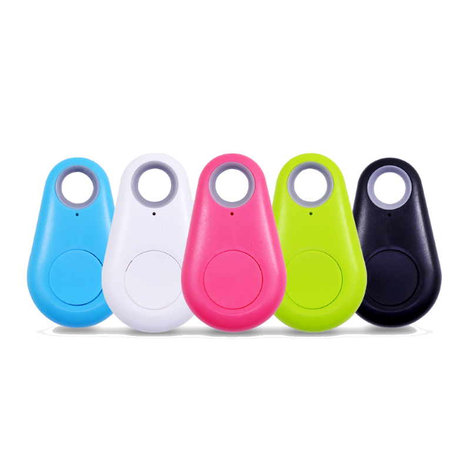
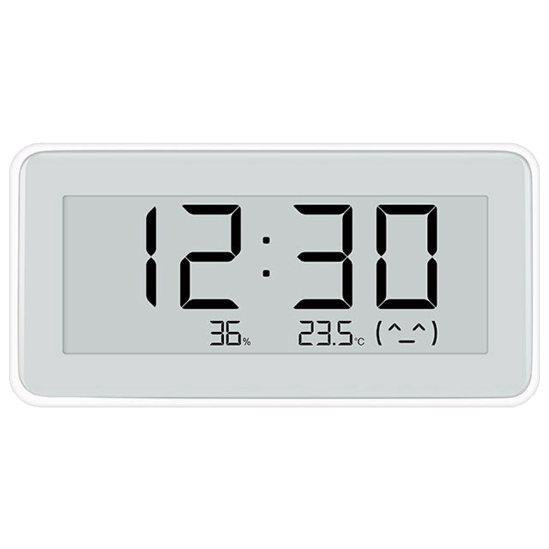

Native Bluetooth Low Energy in Tasmota with ESP32:

## ESP32 native Bluetooth Low Energy support
This allows for the receiving of BLE advertisments from BLE devices, including "iBeacons" and BLE sensors, but also for the control of simple BLE devices, providing for reading, writing and receiving notifications. 

Native ESP32 BLE depends on:

`#define USE_BLE_ESP32` 

There is a special Tasmota build '-bluetooth' which has this turned on.
If you wish to combine it with other features (e.g. sensors), then add this to yout `user_config_override.h` and [compile your build](../Compile-your-build).

Be aware, enabling of the native BLE on ESP32 has an impact on wifi performance.  Although later SDK helped a bit, expect more lag on the web interface and on MQTT.
If only controlling BLE devices, then scanning can be disabled, which will minimise wifi impact.
BLE can be enabled from the web UI menus. 

This is compiled by default in the Bluetooth firmware, but you still need to enable it using the web interface `configure BLE` button or setoption115 1.

## General Commands and Configuration

Note that the only configuration stored is the setOption115 to turn BLE on and off.  All other configurations can be set at boot if necessary using Rules. (note that setoptiuon115 is the same as enable in the Web UI configuration).

### Available BLE Commands

Command|Parameters
:---|:---
BLEPeriod<a id="bleperiod"></a>|Set the period for publish of BLE data<BR>`<value>` = set interval in seconds
BLEOp<a id="bleop"></a>|Setup and execute an active BLE operation (read/write/notify)<BR>see separate description in source code
BLEMode<a id="blemode"></a>|Set the mode of the driver<BR>`<value>` 0 = Stop and Disable BLE. 1 = Enable BLE, but only scan on command. 2 = Enable BLE and scan regularly 
BLEDetails<a id="bledetails"></a>|Display details about adverts for one or more devices.<BR>`BLEDetails0` - don't show any. `BLEDetails2 MAC|Alias` - show all advert details for the MAC or Alias. `BLEDetails3` - show ALL advert details.
BLEScan<a id="blescan"></a>|Set the scan mode, or start a manual scan.<BR>`BLEScan0 <value>` 0 = passive scan, 1 = active scan. `BLEScan1 <ss>` start a manual scan for ss seconds (2-40), or 20s if ss not given.
BLEAlias<a id="blealias"></a>|Set one or more aliases for device MAC addresses.<BR>`MAC=Alias <mac2=Alias2>`
BLEName<a id="blename"></a>|Read or Write the BLE name for a device.<BR>`MAC|Alias` = read. `MAC|Alias name` = write.<BR>NOTE: This attempts to use BLE to actually write a name to a device - success is indicated in a BLEOperation.
BLEDebug<a id="bledebug"></a>|Display more BLE related logs.<BR>`BLEDebug0` = less. `BLEDebug|BLEDebug1` = more.
BLEDevices<a id="bledevices"></a>|Display or Clear seen BLE devices.<BR>`BLEDevices0` = clear device list. `BLEDevices1` = publish tele mesg.
BLEMaxAge<a id="blemaxage"></a>|Display or Set the age at which a seen BLE device will be forgotten.<BR>`BLEMaxage` = display. `BLEMaxAge ss` = set to ss seconds.
BLEAddrFilter<a id="bleaddrfilter"></a>|Display or Set the type od BLE addresses accepted.<BR>`BLEAddrFilter` = display. `BLEAddrFilter value` = set to value (0-default,1,2,3).  Set to 1 to hear certain devices with static random addresses. 


### BLE Command examples


#### Setup a rule to set some aliases at boot time
```
Rule1 ON System#Boot DO BLEAlias A4C1386A1E24=fred A4C1387FC1E1=james endon
Rule1 1
```

#### Enable static random mac addresses in addition to public mac addresses
```
BLEAddrFilter 1
```

#### Check the interval between BLE tele messages
```
BLEPeriod
```
Set it to 40s
```
BLEPeriod 40
```

## iBeacon  

Hear adverts from BLE devices, and produce MQTT messages containing RSSI and other information about them.  Break out iBeacon specific data if present. 


Enabled by

```
#define USE_IBEACON          // Add support for bluetooth LE passive scan of ibeacon devices 
```

### Available iBeacon Commands

Command|Parameters
:---|:---
iBeacon<a id="ibeacon"></a>|Show or set enable for the iBeacon driver<BR>`iBeacon` = Display 0|1<BR>`iBeacon 0` = disable<BR>`iBeacon 1` = enable.
iBeaconOnlyAliased<a id="ibeacononlyaliased"></a>|Show or set OnlyAliased for the iBeacon driver<BR>`iBeaconOnlyAliased` = Display 0|1<BR>`iBeaconOnlyAliased 0` = enable iBeacon to hear ALL BLE devices<BR>`iBeaconOnlyAliased 1` = enable iBeacon to hear ONLY devices with valid BLEAlias<BR>`iBeaconOnlyAliased 2` = enable iBeacon to hear ONLY devices with valid BLEAlias starting `iB`
iBeaconClear<a id="ibeaconclear"></a>|Clear iBeacon list
iBeaconPeriod<a id="ibeaconperiod"></a>|Display or Set the period for publish of iBeacon data<BR>`iBeaconPeriod` = display interval<BR>`iBeaconPeriod ss` = set interval in seconds
iBeaconTimeout<a id="ibeacontimeout"></a>|Display or Set the timeout for iBeacon devices<BR>`iBeaconTimeout` = display timeout<BR>`iBeaconTimeout ss` = set timeout in seconds


This driver reports all beacons found during a scan with its ID (derived from beacon's MAC address) prefixed with `IBEACON_` and RSSI value.

Every beacon report is published as an MQTT tele/%topic%/SENSOR in a separate message:

```json
tele/ibeacon/SENSOR = {"Time":"2021-01-02T12:08:40","IBEACON":{"MAC":"A4C1387FC1E1","RSSI":-56,"STATE":"ON"}}
```

If the beacon can no longer be found during a scan and the timeout interval has passed the beacon's RSSI is set to zero (0) and it is no longer displayed in the webUI

```json
tele/ibeacon/SENSOR = {"Time":"2021-01-02T12:08:40","IBEACON":{"MAC":"A4C1387FC1E1","RSSI":-56,"STATE":"OFF"}}
```

Additional fields will be present depending upon the beacon, e.g. NAME, UID, MAJOR, MINOR.

### iBeacon MQTT fields

#### Always present
json|meaning
:---|:---
Time|time of MQTT send
IBEACON.MAC|mac addr
IBEACON.RSSI|signal strength
IBEACON.STATE|ON - present, OFF - last MQTT you will get for now (device removed)

#### Optional
json|meaning
:---|:---
IBEACON.NAME|name if in scan, or BLEAlias if set - only present if NAME present
IBEACON.PERSEC|count of adverts per sec.  Useful for detecting button press
IBEACON.MAJOR|some iBeacon related term? - only present for some
IBEACON.MINOR|some iBeacon related term? - only present for some

### iBeacon Command examples

#### Setup a rule to set some aliases at boot time, and only allow those starting `iB`
```
Rule1 ON System#Boot DO backlog iBeacon 1; BLEAlias A4C1386A1E24=iBfred A4C1387FC1E1=iBjames; iBeaconOnlyAliased 2 endon
Rule1 1
```

### Supported Devices


All Apple compatible iBeacon devices should be discoverable. 

Various nRF51822 beacons should be fully Apple compatible, programmable and their battery lasts about a year.

- [Amazon.com](https://www.amazon.com/s?k=nRF51822+4.0)
- [Aliexpress](https://www.aliexpress.com/af/NRF51822-beacon.html)

Cheap "iTag" beacons with a beeper. The battery on these lasts only about a month.

- [Aliexpress](https://www.aliexpress.com/af/itag.html?trafficChannel=af&SearchText=itag&ltype=affiliate&SortType=default&g=y&CatId=0)
- [eBay](https://www.ebay.de/sch/i.html?_from=R40&_trksid=m570.l1313&_nkw=Smart-Tag-GPS-Tracker-Bluetooth-Anti-verlorene-Alarm-Key-Finder-Haustier-Kind&_sacat=0)
- [Amazon.com](https://www.amazon.com/s?k=itag+tracker+4.0)



!!! tip
    You can activate a beacon with a beeper using command `IBEACON_%BEACONID%_RSSI 99` (ID is visible in webUI and SENSOR reports). This command can freeze the Bluetooth module and beacon scanning will stop. After a reboot of Tasmota the beacon will start beeping and scanning will resume. (untested on ESP32 native BLE)  
  


## `MI32` Bluetooth Low Energy Sensors

Enabled by
```
#define USE_MI_ESP32
```


Different vendors offer Bluetooth solutions as part of the XIAOMI family often under the MIJIA-brand (while AQUARA is the typical name for a ZigBee sensor).  
The sensors supported by Tasmota use BLE (Bluetooth Low Energy) to transmit the sensor data, but they differ in their accessibilities quite substantially.  
  
Basically all of them use of so-called „MiBeacons“ which are BLE advertisement packets with a certain data structure, which are broadcasted by the devices automatically while the device is not in an active bluetooth connection.  
The frequency of these messages is set by the vendor and ranges from one per 3 seconds to one per hour (for the battery status of the LYWSD03MMC). Motion sensors and BLE remote controls start to send when an event is triggered.  
These packets already contain the sensor data and can be passively received by other devices and will be published regardless if a user decides to read out the sensors via connections or not. Thus the battery life of a BLE sensor is not influenced by reading these advertisements and the big advantage is the power efficiency as no active bi-directional connection has to be established. The other advantage is, that scanning for BLE advertisements can happen nearly parallel (= very quick one after the other), while a direct connection must be established for at least a few seconds and will then block both involved devices for that time.  
This is therefore the preferred option, if technically possible (= for the supported sensors).
  
Most of the „older“ BLE-sensor-devices use unencrypted messages, which can be read by all kinds of BLE-devices or even a NRF24L01. With the arrival of "newer" sensors came the problem of encrypted data in MiBeacons, which can be decrypted in Tasmota (not yet with the HM-1x).  
Meanwhile it is possible to get the needed "bind_key" with the help of an open-source project: https://atc1441.github.io/TelinkFlasher.html  
At least the LYWSD03 allows the use of a simple BLE connection without any encrypted authentication and the reading of the sensor data using normal subscription methods to GATT-services (currently used on the HM-1x). This is more power hungry than the passive reading of BLE advertisements.  
Other sensors like the MJYD2S are not usable without the "bind_key".  
  
### Supported Devices

!!! note "It can not be ruled out, that changes in the device firmware may break the functionality of this driver completely!"  

The naming conventions in the product range of bluetooth sensors in XIAOMI-universe can be a bit confusing. The exact same sensor can be advertised under slightly different names depending on the seller (Mijia, Xiaomi, Cleargrass, ...).

 <table>
  <tr>
    <th class="th-lboi">MJ_HT_V1</th>
    <th class="th-lboi">LYWSD02</th>
    <th class="th-lboi">CGG1</th>
    <th class="th-lboi">CGD1</th>
  </tr>
  <tr>
    <td class="tg-lboi"></td>
    <td class="tg-lboi"></td>
    <td class="tg-lboi"></td>
    <td class="tg-lboi"></td>
  </tr>
  <tr>
    <td class="tg-lboi">temperature, humidity, battery</td>
    <td class="tg-lboi">temperature, humidity, battery</td>
    <td class="tg-lboi">temperature, humidity, battery</td>
    <td class="tg-lboi">temperature, humidity, battery</td>
  </tr>
    <tr>
    <td class="tg-lboi">passive for all entities, reliable battery value</td>
    <td class="tg-lboi">battery only active, thus not on the NRF24L01, set clock and unit, very frequent data sending</td>
    <td class="tg-lboi">passive for all entities, reliable battery value</td>
    <td class="tg-lboi">battery only active, thus not on the NRF24L01, no reliable battery value, no clock functions</td>
  </tr>
</table>  
  
 <table>
  <tr>
    <th class="th-lboi">MiFlora</th>
    <th class="th-lboi">LYWSD03MMC / ATC</th>
    <th class="th-lboi">NLIGHT</th>
    <th class="th-lboi">MJYD2S</th>
  </tr>
  <tr>
    <td class="tg-lboi"></td>
    <td class="tg-lboi"></td>
    <td class="tg-lboi"></td>
    <td class="tg-lboi"></td>
  </tr>
  <tr>
    <td class="tg-lboi">temperature, illuminance, soil humidity, soil fertility, battery, firmware version</td>
    <td class="tg-lboi">temperature, humidity, battery</td>
    <td class="tg-lboi">motion</td>
    <td class="tg-lboi">motion, illuminance, battery, no-motion-time</td>
  </tr>
  <tr>
    <td class="tg-lboi">passive only with newer firmware (>3.0?), battery only active, thus not on the NRF24L01</td>
    <td class="tg-lboi">passive only with decryption or using custom ATC-firmware, no reliable battery value with stock firmware</td>
    <td class="tg-lboi">NRF24L01, ESP32</td>
    <td class="tg-lboi">passive only with decryption, thus only NRF24L01, ESP32</td>
  </tr>
</table>  
  
 <table>
  <tr>
    <th class="th-lboi">YEE RC</th>
    <th class="th-lboi">MHO-C401</th>
    <th class="th-lboi">MHO-C303</th>
  </tr>
  <tr>
    <td class="tg-lboi"></td>
    <td class="tg-lboi"></td>
    <td class="tg-lboi"></td>
  </tr>
  <tr>
    <td class="tg-lboi">button press (single and long)</td>
    <td class="tg-lboi">temperature, humidity, battery</td>
    <td class="tg-lboi">temperature, humidity, battery</td>
  </tr>
     <tr>
    <td class="tg-lboi">passive</td>
    <td class="tg-lboi">equal to the LYWS03MMC, but no custom firmware yet</td>
    <td class="tg-lboi">passive for all entities,  set clock and unit, no alarm functions, very frequent data sending</td>
  </tr>
</table> 
passive: data is received via BLE advertisments  
active: data is received via bidrectional connection to the sensor  
  
#### Devices with payload encryption  
  
The LYWSD03MMC, MHO-C401 and the MJYD2S will start to send advertisements with encrypted sensor data after pairing it with the official Xiaomi app (using TelinkFlasher to get the key also acts as a trigger to start sending?). Out-of-the-box the sensors do only publish a static advertisement.  
It is possible to do a pairing and get the necessary decryption key ("bind_key") here: https://atc1441.github.io/TelinkFlasher.html - note you do not have to flash the ATC firmware! 
This project also provides a custom firmware for the LYWSD03MMC, which then becomes an ATC and is supported by Tasmota too. Default ATC-setting will drain the battery more than stock firmware, because of very frequent data sending.  

An encrypted sensor will show a link to the telelink flasher page, marked as 'NoKey' if an encrypted packet has been received and no key is present (you may wait some minutes before an encrypted packet arrives).

To set the key(s) for a device(s) the key command is

`MI32Keys mac|alias=key mac|alias=key`
or
`MI32Key keymac`

where mac is a mac address.  A BLEAlias may be used in place of the mac (see BLE commands).  The Key is the 32 character (16 byte) key retrieved by TelelinkFlasher.  `MI32Key` is retained for b ackward compatibility, needing a 44 character combination of key and MAC.

LYWSD03MMC sends encrypted sensor data every 10 minutes. As there are no confirmed reports about correct battery presentation of the sensor (always shows 99%), this function is currently not supported.  
MJYD2S sends motion detection events and 2 discrete illuminance levels (1 lux or 100 lux for a dark or bright environment). Additionally battery level and contiguous time without motion in discrete growing steps (no motion time = NMT).    
 
  
##### Options to read out the LYWSD03MMC  
  
1. Generate a bind_key  
The web-tool https://atc1441.github.io/TelinkFlasher.html allows the generation of a so-called bind_key by faking a pairing with the Xiaomi cloud. You can copy-paste this key and add the MAC to use this resultig key-MAC-string with key-command (NRFkey or MI32key). Then the driver will receive the sensors data roughly every 10 minutes (in two chunks for humidity and temperature with about a minute in between) and decode the data. This is the most energy efficient way. 
The current way of storing these keys on the ESP32 is to use RULES like that (for the NRF24L01 you would use NRFkey):  
```haskell
rule1 on System#Boot do backlog MI32key 00112233445566778899AABBCCDDEEFF112233445566; MI32key 00112233445566778899AABBCCDDEEFFAABBCCDDEEFF endon
```  
This option is currently not available for the HM-10 because of memory considerations as part of the standard sensor-firmware package.  

Note: in the latest Tasmota, a blue link will show next to a device if the device needs a key.  Clicking this likn will take you to a page guiding you to create a key, and at the end, puts that key into Tasmota, leaving you on a page with the required command to add to your rule. 

2. Flash custom ATC-firmware  
Use the same https://atc1441.github.io/TelinkFlasher.html to flash a custom ATC-firmware on the LYWSD03MMC. This will work out of the box with all three Tasmota-drivers. There is a slight chance of bricking the sensor, which would require some soldering and compiling skills to un-brick. This firmware does send data more frequently and is a little bit more power hungry than the stock firmware.  
There is also another new custom firmware here https://github.com/pvvx/ATC_MiThermometer with it's own flasher/config page.
The Custom mode is supported in latest Tasmota ESP32, but beware not to use 'All' mode.
  
3. Use active connections  
By default a device without a key ,may be read using an active connection. This circumvents the data encryption, but is power hungry and drains the battery fast. Thus it is only recommended as fallback mechanism.


#### Commands

Command|Parameters
:---|:---
MI32Period<a id="mi32period"></a>|Show interval in seconds between sensor read cycles for the LYWSD03. Set to TelePeriod value at boot.<BR>|`<value>` = set interval in seconds
MI32Time <a id="mi32time"></a>|`<n>` = set time time of a **LYWSD02 only** sensor to Tasmota UTC time and timezone. `<n>` is the sensor number in order of discovery starting with 0 (topmost sensor in the webUI list).
MI32Unit <a id="mi32unit"></a>|`<n>` = toggle the displayed temperature units of a **LYWSD02 only** sensor. `<n>` is the sensor number in order of discovery starting with 0 (topmost sensor in the webUI list).  Reporting of the temperature is always in Celcius, this only changes the value shown on the device.
MI32Page<a id="mi32page"></a>|Show the maximum number of sensors shown per page in the webUI list.<BR>`<value>` = set number of sensors _(default = 4)_
MI32Battery<a id="mi32battery"></a>|Reads missing battery data for LYWSD02, Flora and CGD1.
MI32Key<a id="mi32key"></a>| (depreciated - pls use MI32Keys) Set a "bind_key" for a MAC-address to decrypt sensor data (LYWSD03MMC, MJYD2S). The argument is a 44 uppercase characters long string, which is the concatenation of the bind_key and the corresponding MAC.<BR>`<00112233445566778899AABBCCDDEEFF>` (32 characters) = bind_key<BR>`<112233445566>` (12 characters) = MAC of the sensor<BR>`<00112233445566778899AABBCCDDEEFF112233445566>` (44 characters)= final string
MI32Keys<a id="mi32keys"></a>| Set one or more "bind_key" for a MAC-address to decrypt sensor data (LYWSD03MMC, MJYD2S).<BR>`MI32Keys mac=key (mac=key)` = set the 32 character key for `<mac>` (more than one mac=key may be specified).
MI32Blockx <a id="mi32block"></a>| Ignore Xiaomi sensors using the (fixed) MAC-address<BR>x=1 - show block list<BR>x=0 - delete block list<BR> x=1 + MAC-address - add MAC to to be blocked to the block list<BR>x=0 + MAC-address - remove MAC to to be blocked to the block list<BR>`<value>` (12 or 17 characters) = MAC interpreted as a string `AABBCCDDEEFF` (also valid: `aa:BB:cc:dd:EE:FF`)
MI32Optionx n<a id="mi32option"></a>| Set driver options at runtime<BR> x=0 - 0 -> sends only recently received sensor data, 1 -> aggregates all recent sensors data types<BR>x=1 - 0 -> shows full sensor data at TELEPERIOD, 1 -> shows no sensor data at TELEPERIOD<BR>x=2 - 0 -> sensor data only at TELEPERIOD (default and "usual" Tasmota style), 1 -> direct bridging of BLE-data to mqtt-messages<BR>x=5 - 0 -> show all relevant BLE sensors, 1 -> show only sensors with a BLEAlias<BR>x=6 (from v 9.0.2.1) 1 -> always use MQTT Topic like `tele/tasmota_ble/<name>` containing only one sensor
  
!!! tip 
If you really want to read battery for LYWSD02, Flora and CGD1, consider doing it once a day with a RULE:
`RULE1 on Time#Minute=30 do MI32Battery endon`
This will update every day at 00:30 AM.  
  

### MI32 MQTT messages

Because we can have MANY sensors reporting, tele messages are chunked to have a maximum of four sensors per message.

If you enable HASS discovery (setoption19 1), the ADDITIONAL MQTT messages are send.
(note: from 9.0.2.1, you can enable the below style of MQTT using 'MI32Option6 1' - even if not using HASS discovery mode.)

Primarily, at teleperiod or MI32period, discovery messages are sent.  These inform homeassistant of the devices.  Device names can be dependent upon BLEAlias, so set BLEAlias at boot....

Additional actual data messages are sent on topics includinmg the device name:

```
tele/tasmota_ble/<name>
```

Each message for ONE sensor.

These messages can be used without homeassistant if it is a preferred format.

NOTE: The topic would be the SAME from all Tasmota if they have the same BLEAlias or no BLEAlias.  So if you wish to 'hear' the same device separately from different Tasmota, use different BLEAlias names.... 


## EQ3 radiator valve driver

A preliminary EQ3 driver is in production

[Documentation](EQ3-TRV_with_BLE-ESP32.md) 

