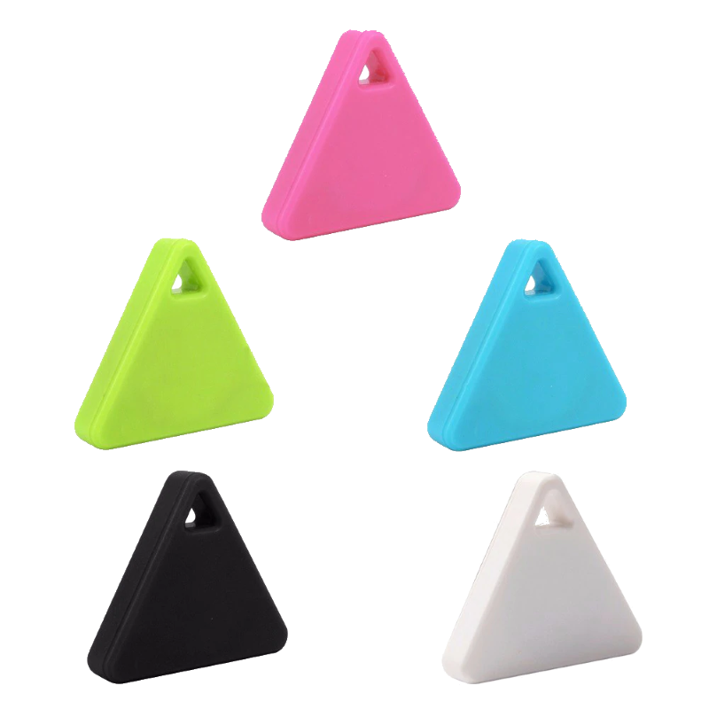
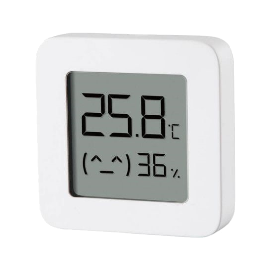
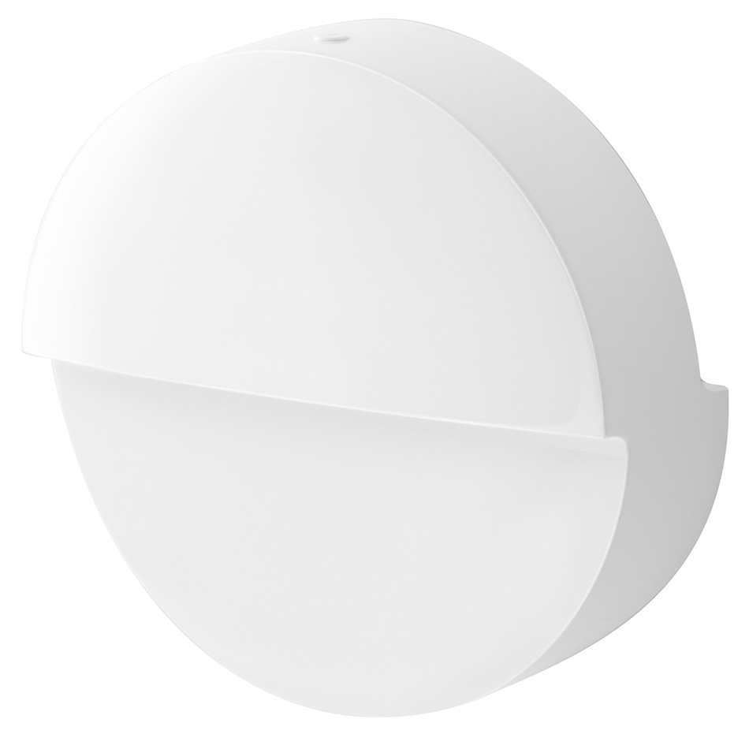
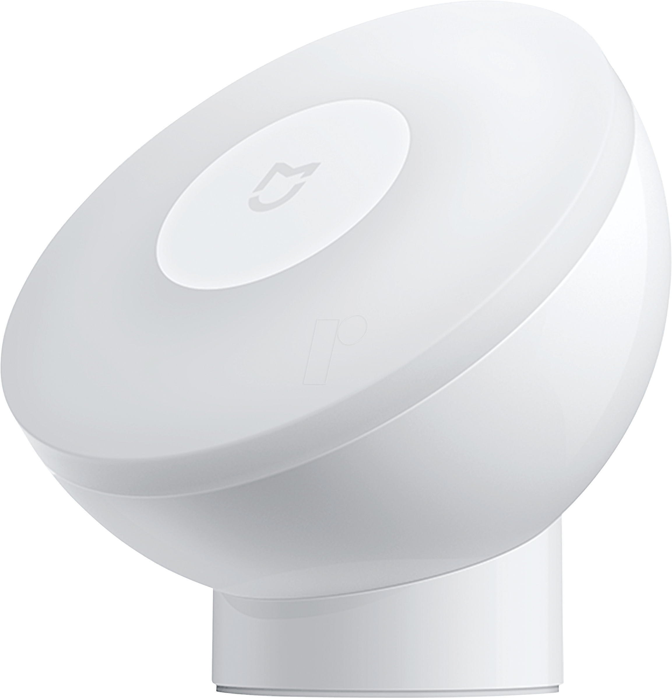

Bluetooth Low Energy in Tasmota on Esp8266 consists of:

## ESP8266 via HM-1x or nRF24L01(+)
This allows for the receiving of BLE advertisments from BLE devices, including "iBeacons"

## iBeacon  

!!! info "This feature is included only in tasmota-sensors.bin"
Otherwise you must [compile your build](../Compile-your-build). Add the following to `user_config_override.h`:

### For ESP8266 via HM-1x or nRF24L01(+)
  
Tasmota uses a BLE 4.x module to scan for [iBeacon](https://en.wikipedia.org/wiki/IBeacon) devices. This driver is working with [HM-10 and clones](../HM-10) and [HM16/HM17](../HM-17) Bluetooth modules and potentially with other HM-1x modules depending on firmware capabilities.

!!! tip
    If using an extenral module, When first connected some modules will be in peripheral mode. You have to change it to central mode using commands `Sensor52 1` and `Sensor52 2`.

### Features
For a list of all available commands see [Sensor52](../Commands.md#sensor52) command.  

This driver reports all beacons found during a scan with its ID (derived from beacon's MAC address) prefixed with `IBEACON_` and RSSI value.

Every beacon report is published as an MQTT tele/%topic%/SENSOR in a separate message:

```json
tele/ibeacon/SENSOR = {"Time":"2021-01-02T12:08:40","IBEACON":{"MAC":"A4C1387FC1E1","RSSI":-56,"STATE":"ON"}}
```

If the beacon can no longer be found during a scan and the timeout interval has passed the beacon's RSSI is set to zero (0) and it is no longer displayed in the webUI

```json
tele/ibeacon/SENSOR = {"Time":"2021-01-02T12:08:40","IBEACON":{"MAC":"A4C1387FC1E1","RSSI":-56,"STATE":"OFF"}}
```

Additional fields will be present depending upon the beacon, e.g. NAME, UID, MAJOR, MINOR.


### Supported Devices


All Apple compatible iBeacon devices should be discoverable. 

Various nRF51822 beacons should be fully Apple compatible, programmable and their battery lasts about a year.

- [Amazon.com](https://www.amazon.com/s?k=nRF51822+4.0)
- [Aliexpress](https://www.aliexpress.com/af/NRF51822-beacon.html)


Cheap "iTag" beacons with a beeper. The battery on these lasts only about a month.

- [Aliexpress](https://www.aliexpress.com/af/itag.html?trafficChannel=af&SearchText=itag&ltype=affiliate&SortType=default&g=y&CatId=0)
- [eBay](https://www.ebay.de/sch/i.html?_from=R40&_trksid=m570.l1313&_nkw=Smart-Tag-GPS-Tracker-Bluetooth-Anti-verlorene-Alarm-Key-Finder-Haustier-Kind&_sacat=0)
- [Amazon.com](https://www.amazon.com/s?k=itag+tracker+4.0)



!!! tip
    You can activate a beacon with a beeper using command `IBEACON_%BEACONID%_RSSI 99` (ID is visible in webUI and SENSOR reports). This command can freeze the Bluetooth module and beacon scanning will stop. After a reboot of Tasmota the beacon will start beeping and scanning will resume. (untested on ESP32 native BLE)
  
  
  
## Bluetooth Low Energy Sensors

Different vendors offer Bluetooth solutions as part of the XIAOMI family often under the MIJIA-brand (while AQUARA is the typical name for a ZigBee sensor).  
The sensors supported by Tasmota use BLE (Bluetooth Low Energy) to transmit the sensor data, but they differ in their accessibilities quite substantially.  
  
Basically all of them use of so-called „MiBeacons“ which are BLE advertisement packets with a certain data structure, which are broadcasted by the devices automatically while the device is not in an active bluetooth connection.  
The frequency of these messages is set by the vendor and ranges from one per 3 seconds to one per hour (for the battery status of the LYWSD03MMC). Motion sensors and BLE remote controls start to send when an event is triggered.  
These packets already contain the sensor data and can be passively received by other devices and will be published regardless if a user decides to read out the sensors via connections or not. Thus the battery life of a BLE sensor is not influenced by reading these advertisements and the big advantage is the power efficiency as no active bi-directional connection has to be established. The other advantage is, that scanning for BLE advertisements can happen nearly parallel (= very quick one after the other), while a direct connection must be established for at least a few seconds and will then block both involved devices for that time.  
This is therefore the preferred option, if technically possible (= for the supported sensors).
  
Most of the „older“ BLE-sensor-devices use unencrypted messages, which can be read by all kinds of BLE-devices or even a NRF24L01. With the arrival of "newer" sensors came the problem of encrypted data in MiBeacons, which can be decrypted in Tasmota (not yet with the HM-1x).  
Meanwhile it is possible to get the needed "bind_key" with the help of an open-source project: https://atc1441.github.io/TelinkFlasher.html  
At least the LYWSD03 allows the use of a simple BLE connection without any encrypted authentication and the reading of the sensor data using normal subscription methods to GATT-services (currently used on the HM-1x). This is more power hungry than the passive reading of BLE advertisements.  
Other sensors like the MJYD2S are not usable without the "bind_key".  
  
### Supported Devices

!!! note "It can not be ruled out, that changes in the device firmware may break the functionality of this driver completely!"  

The naming conventions in the product range of bluetooth sensors in XIAOMI-universe can be a bit confusing. The exact same sensor can be advertised under slightly different names depending on the seller (Mijia, Xiaomi, Cleargrass, ...).

 <table>
  <tr>
    <th class="th-lboi">MJ_HT_V1</th>
    <th class="th-lboi">LYWSD02</th>
    <th class="th-lboi">CGG1</th>
    <th class="th-lboi">CGD1</th>
  </tr>
  <tr>
    <td class="tg-lboi"></td>
    <td class="tg-lboi"></td>
    <td class="tg-lboi"></td>
    <td class="tg-lboi"></td>
  </tr>
  <tr>
    <td class="tg-lboi">temperature, humidity, battery</td>
    <td class="tg-lboi">temperature, humidity, battery</td>
    <td class="tg-lboi">temperature, humidity, battery</td>
    <td class="tg-lboi">temperature, humidity, battery</td>
  </tr>
    <tr>
    <td class="tg-lboi">passive for all entities, reliable battery value</td>
    <td class="tg-lboi">battery only active, thus not on the NRF24L01, set clock and unit, very frequent data sending</td>
    <td class="tg-lboi">passive for all entities, reliable battery value</td>
    <td class="tg-lboi">battery only active, thus not on the NRF24L01, no reliable battery value, no clock functions</td>
  </tr>
</table>  
  
 <table>
  <tr>
    <th class="th-lboi">MiFlora</th>
    <th class="th-lboi">LYWSD03MMC / ATC</th>
    <th class="th-lboi">NLIGHT</th>
    <th class="th-lboi">MJYD2S</th>
  </tr>
  <tr>
    <td class="tg-lboi"></td>
    <td class="tg-lboi"></td>
    <td class="tg-lboi"></td>
    <td class="tg-lboi"></td>
  </tr>
  <tr>
    <td class="tg-lboi">temperature, illuminance, soil humidity, soil fertility, battery, firmware version</td>
    <td class="tg-lboi">temperature, humidity, battery</td>
    <td class="tg-lboi">motion</td>
    <td class="tg-lboi">motion, illuminance, battery, no-motion-time</td>
  </tr>
  <tr>
    <td class="tg-lboi">passive only with newer firmware (>3.0?), battery only active, thus not on the NRF24L01</td>
    <td class="tg-lboi">passive only with decryption or using custom ATC-firmware, no reliable battery value with stock firmware</td>
    <td class="tg-lboi">NRF24L01, ESP32</td>
    <td class="tg-lboi">passive only with decryption, thus only NRF24L01, ESP32</td>
  </tr>
</table>  
  
 <table>
  <tr>
    <th class="th-lboi">YEE RC</th>
    <th class="th-lboi">MHO-C401</th>
    <th class="th-lboi">MHO-C303</th>
  </tr>
  <tr>
    <td class="tg-lboi"></td>
    <td class="tg-lboi"></td>
    <td class="tg-lboi"></td>
  </tr>
  <tr>
    <td class="tg-lboi">button press (single and long)</td>
    <td class="tg-lboi">temperature, humidity, battery</td>
    <td class="tg-lboi">temperature, humidity, battery</td>
  </tr>
     <tr>
    <td class="tg-lboi">passive</td>
    <td class="tg-lboi">equal to the LYWS03MMC, but no custom firmware yet</td>
    <td class="tg-lboi">passive for all entities,  set clock and unit, no alarm functions, very frequent data sending</td>
  </tr>
</table> 
passive: data is received via BLE advertisments  
active: data is received via bidrectional connection to the sensor  
  
#### Devices with payload encryption  
  
The LYWSD03MMC, MHO-C401 and the MJYD2S will start to send advertisements with encrypted sensor data after pairing it with the official Xiaomi app (using TelinkFlasher to get the key also acts as a trigger to start sending?). Out-of-the-box the sensors do only publish a static advertisement.  
It is possible to do a pairing and get the necessary decryption key ("bind_key") here: https://atc1441.github.io/TelinkFlasher.html - note you do not have to flash the ATC firmware! 
This project also provides a custom firmware for the LYWSD03MMC, which then becomes an ATC and is supported by Tasmota too. Default ATC-setting will drain the battery more than stock firmware, because of very frequent data sending.  

For NRF based BLE:
This key and the corresponding MAC of the sensor can be injected with the NRFKEY-command (or NRFMJYD2S). It is probably a good idea to save the whole config as RULE like that:  
  
```haskell
rule1 on System#Boot do backlog NRFkey 00112233445566778899AABBCCDDEEFF112233445566; NRFkey 00112233445566778899AABBCCDDEEFF112233445566; NRFPage 6; NRFUse 0; NRFUse 4 endon
```  
(key for two sensors, 6 sensors per page in the WebUI, turn off all sensors, turn on LYWS03)  


LYWSD03MMC sends encrypted sensor data every 10 minutes. As there are no confirmed reports about correct battery presentation of the sensor (always shows 99%), this function is currently not supported.  
MJYD2S sends motion detection events and 2 discrete illuminance levels (1 lux or 100 lux for a dark or bright environment). Additionally battery level and contiguous time without motion in discrete growing steps (no motion time = NMT).    
 
  
#### Working principle of Tasmota BLE drivers (>8.5.)
  
The idea is to provide drivers with as many automatic functions as possible. Besides the hardware setup, there are zero or very few things to configure.  
The sensor namings are based on the original sensor names and shortened if appropriate (Flower care -> Flora). A part of the MAC will be added to the name as a suffix.  
All sensors are treated as if they are physically connected to the ESP8266 device. For motion and remote control sensors MQTT-messages will be published in (nearly) real time.
The ESP32 and the HM-1x-modules are real BLE devices whereas the NRF24L01 (+) is only a generic 2.4 GHz transceiver with very limited capabilities.  


##### Options to read out the LYWSD03MMC  
  
1. Generate a bind_key  
The web-tool https://atc1441.github.io/TelinkFlasher.html allows the generation of a so-called bind_key by faking a pairing with the Xiaomi cloud. You can copy-paste this key and add the MAC to use this resultig key-MAC-string with key-command (NRFkey or MI32key). Then the driver will receive the sensors data roughly every 10 minutes (in two chunks for humidity and temperature with about a minute in between) and decode the data. This is the most energy efficient way. 
The current way of storing these keys on the ESP32 is to use RULES like that (for the NRF24L01 you would use NRFkey):  
```haskell
rule1 on System#Boot do backlog MI32key 00112233445566778899AABBCCDDEEFF112233445566; MI32key 00112233445566778899AABBCCDDEEFFAABBCCDDEEFF endon
```  
This option is currently not available for the HM-10 because of memory considerations as part of the standard sensor-firmware package.  

2. Flash custom ATC-firmware  
Use the same https://atc1441.github.io/TelinkFlasher.html to flash a custom ATC-firmware on the LYWSD03MMC. This will work out of the box with all three Tasmota-drivers. There is a slight chance of bricking the sensor, which would require some soldering and compiling skills to un-brick. This firmware does send data more frequently and is a little bit more power hungry than the stock firmware.  
There is also another new custom firmware here https://github.com/pvvx/ATC_MiThermometer with it's own flasher/config page.
The Custom mode is supported in latest Tasmota ESP32, but beware not to use 'All' mode.
  
3. Use active connections  
By default on the HM-10 (for legacy reasons) the method to connect to the sensor from time to time. This circumvents the data encryption. This is very power hungry and drains the battery fast. Thus it is only recommended as fallback mechanism.

  
## BLE Sensors using HM-1x

!!! info "This feature is included only in tasmota-sensors.bin"
Otherwise you must [compile your build](../Compile-your-build). Add the following to `user_config_override.h`:

```
#ifndef USE_HM10
#define USE_HM10          // Add support for HM-10 as a BLE-bridge (+9k3 code)
#endif
```

### Features
Supported sensors will be connected to at a set interval (default interval equals TelePeriod). A subscription is established for 5 seconds and data (e.g. temperature, humidity and battery) is read and reported to an mqtt topic (Dew point is calculated):

```json
tele/%topic%/SENSOR = {"Time":"2020-03-24T12:47:51","LYWSD03-52680f":{"Temperature":21.1,"Humidity":58.0,"DewPoint":12.5,"Battery":100},"LYWSD02-a2fd09":{"Temperature":21.4,"Humidity":57.0,"DewPoint":12.5,"Battery":2},"MJ_HT_V1-d8799d":{"Temperature":21.4,"Humidity":54.6,"DewPoint":11.9},"TempUnit":"C"}
```

After a completed discovery scan, the driver will report the number of found sensors. As Tasmota can not know how many sensors are meant to be discovered you have to force a re-scan until the desired number of devices is found.
```haskell
Rule1 ON HM10#Found<6 DO Add1 1 ENDON ON Var1#State<=3 DO HM10Scan ENDON 
```
This will re-scan up to 3 times if less than 6 sensors are found.

#### Commands

Command|Parameters
:---|:---
HM10Scan<a id="hm10scan"></a>|Start a new device discovery scan
HM10Period<a id="hm10period"></a>|Show interval in seconds between sensor read cycles. Set to TelePeriod value at boot.<BR>|`<value>` = set interval in seconds
HM10Baud<a id="hm10baud"></a>|Show ESP8266 serial interface baudrate (***Not HM-10 baudrate***)<BR>`<value>` = set baudrate
HM10AT<a id="hm10at"></a>|`<command>` = send AT commands to HM-10. See [list](http://www.martyncurrey.com/hm-10-bluetooth-4ble-modules/#HM-10%20-%20AT%20commands)
HM10Time <a id="hm10time"></a>|`<n>` = set time time of a **LYWSD02 only** sensor to Tasmota UTC time and timezone. `<n>` is the sensor number in order of discovery starting with 0 (topmost sensor in the webUI list).
HM10Auto <a id="hm10auto"></a>|`<value>` = start an automatic discovery scan with an interval of  `<value>` seconds to receive data in BLE advertisements periodically.<BR>This is a passive scan and does not produce a scan response from the BLE sensor. It does not increase the sensors battery drain.
HM10Page<a id="hm10page"></a>|Show the maximum number of sensors shown per page in the webUI list.<BR>`<value>` = set number of sensors _(default = 4)_
HM10Beaconx <a id="HM10beacon"></a>| Set a BLE device as a beacon using the (fixed) MAC-address<BR>x - set beacon 1 .. 4 <BR> x= 0 - will start a BLE scan and print result to the console <BR>`<value>` (12 or 17 characters) = use beacon given the MAC interpreted as a string `AABBCCDDEEFF` (also valid: `aa:BB:cc:dd:EE:FF`)  MAC of `00:00:00:00:00:00` will stop beacon x
  
  
## BLE Sensors using nRF24L01(+)

### Configuration
  
You must [compile your build](../Compile-your-build). Change the following in `my_user_config.h`:

```
// -- SPI sensors ---------------------------------
#define USE_SPI                                  // Hardware SPI using GPIO12(MISO), GPIO13(MOSI) and GPIO14(CLK) in addition to two user selectable GPIOs(CS and DC)
#ifdef USE_SPI
  #define USE_NRF24                              // Add SPI support for NRF24L01(+) (+2k6 code)
  #ifdef USE_NRF24
    #define USE_MIBLE                            // BLE-bridge for some Mijia-BLE-sensors (+4k7 code)
```    
    
Sensors will be discriminated by using the Product-ID of the MiBeacon. A human readable short product name will be shown instead of the company-assigned ID of the BLE Public Device Address (= the "lower" 24 bits). 

A TELE message could like look this:  
  
```
10:13:38 RSL: stat/tasmota/STATUS8 = {"StatusSNS":{"Time":"2019-12-18T10:13:38","Flora-6ab577":{"Temperature":21.7,"Illuminance":21,"Humidity":0,"Fertility":0},"MJ_HT_V1-3108be":{"Temperature":22.3,"Humidity":56.1},"TempUnit":"C"}}
```
  
As the NRF24L01 can only read BLE-advertisements, only the data in these advertisements is accessible.  
All sensors have an additional GATT-interface with more data in it, but it can not be read with a NRF24l01. 
  
As we can not use a checksum to test data integrity of the packet, only data of sensors whose adresses showed up more than once (default = 3 times) will be published. 
Internally from time to time "fake" sensors will be created, when there was data corruption in the address bytes.  These will be removed automatically.  
  
  
#### Commands

Command|Parameters
:---|:---
NRFPage<a id="nrfpage"></a>|Show the maximum number of sensors shown per page in the webUI list.<BR>`<value>` = set number of sensors _(default = 4)_
NRFIgnore<a id="nrfignore"></a>|`0` = all known sensor types active_(default)_<BR>`<value>` =  ignore certain sensor type (`1` = Flora, `2` = MJ_HT_V1, `3` = LYWSD02, `4` = LYWSD03, `5` = CGG1, `6` = CGD1, `7` = NLIGHT,`8` = MJYD2S,`9` = YEERC (DEPRECATED, please switch to NRFUSE)
NRFUse<a id="nrfuse"></a>|`0` = all known sensor types inactive<BR>`<value>` =  ignore certain sensor type (`1` = Flora, `2` = MJ_HT_V1, `3` = LYWSD02, `4` = LYWSD03, `5` = CGG1, `6` = CGD1, `7` = NLIGHT,`8` = MJYD2S,`9` = YEERC
NRFScan<a id="nrfscan"></a>| Scan for regular BLE-advertisements and show a list in the console<BR>`0` = start a new scan list<BR>`1` = append to the scan list<BR>`2` = stop running scan
NRFBeacon<a id="nrfbeacon"></a>| Set a BLE device as a beacon using the (fixed) MAC-address<BR>`<value>` (1-3 digits) = use beacon from scan list<BR>`<value>` (12 characters) = use beacon given the MAC interpreted as an uppercase string `AABBCCDDEEFF`
NRFKey<a id="nrfkey"></a>| Set a "bind_key" for a MAC-address to decrypt (LYWSD03MMC & MHO-C401). The argument is a 44 uppercase characters long string, which is the concatenation of the bind_key and the corresponding MAC.<BR>`<00112233445566778899AABBCCDDEEFF>` (32 characters) = bind_key<BR>`<112233445566>` (12 characters) = MAC of the sensor<BR>`<00112233445566778899AABBCCDDEEFF112233445566>` (44 characters)= final string
NRFMjyd2s<a id="nrfmjyd2s"></a>| Set a "bind_key" for a MAC-address to decrypt sensor data of the MJYD2S. The argument is a 44 characters long string, which is the concatenation of the bind_key and the corresponding MAC.<BR>`<00112233445566778899AABBCCDDEEFF>` (32 characters) = bind_key<BR>`<112233445566>` (12 characters) = MAC of the sensor<BR>`<00112233445566778899AABBCCDDEEFF112233445566>` (44 characters)= final string
NRFNlight<a id="nrfnlight"></a>| Set the MAC of an NLIGHT<BR>`<value>` (12 characters) =  MAC interpreted as an uppercase string `AABBCCDDEEFF`
  
  
### Beacon  
  
A simplified presence dection will scan for regular BLE advertisements of a given BT-device defined by its MAC-address. It is important to know, that many new devices (nearly every Apple-device) will change its MAC every few minutes to prevent tracking.  
If the driver receives a packet from the "beacon" a counter will be (re-)started with an increment every second. This timer is published in the TELE-message, presented in the webUI and processed as a RULE.
The stability of regular readings will be strongly influenced by the local environment (many BLE-devices nearby or general noise in the 2.4-GHz-band). 

  
