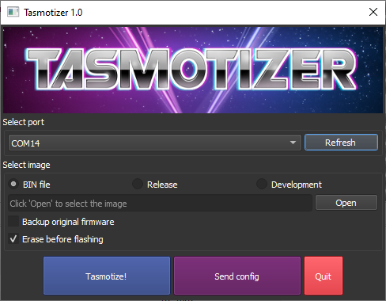
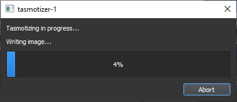
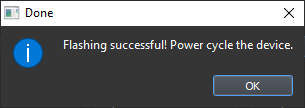

If you have read through the [Prerequisites](/installation/Prerequisites) you should have selected [a pre-compiled Tasmota firmware binary](/installation/Prerequisites#tasmota-firmware-binary) or chosen to [compile your own Tasmota firmware binary](#compiling-from-source).

Once you have followed [Hardware preparation](/installation/Hardware-Preparation), your device should be in Flash Mode and ready for a Tasmota firmware binary file to be flashed. For that you need a **flashing tool**.

Optionally, you may want to back up the device manufacturer's firmware on the 1 in a million chance you don't like Tasmota.

## Tasmotizer!
Tasmotizer! is specifically designed for use with Tasmota with an easy to use GUI and [esptool.py](https://github.com/espressif/esptool) under the hood.

Download the [latest release](https://github.com/tasmota/tasmotizer/releases) for your platform. If using Windows just double click the downloaded file and it'll start, no installation required. For python follow the installation [instructions](https://github.com/tasmota/tasmotizer#installation-and-how-to-run). You can also watch our [Video tutorial for Tasmotizer](https://youtu.be/hIwIhu5OWiA). Thx Jon!

> [!NOTE] If you get an anti-virus infection warning don't fret, it is a [known false positive](https://stackoverflow.com/questions/43777106/program-made-with-pyinstaller-now-seen-as-a-trojan-horse-by-avg). If you're still apprehensive you can always run the Python version. 

**It is time to Tasmotize!**



1. Connect your device to the serial-to-USB adapter or plug in NodeMCU/D1 mini.
1. Check whether the correct **serial port** (COM or tty port) is selected. Tasmotizer! will try its best to select the right one for you.
1. Choose Tasmota firmware binary:
   * **BIN file** - browse to the Tasmota firmware binary you downloaded or compiled.
   * **Release** - select from a list of available release binaries
   * **Development** - select from a list of latest development binaries
4. _optional_ Backup the original device firmware
5. Erase flash
> [!DANGER] Leave *Erase before flashing* checked if it is the first time flashing Tasmota on the device or you're experiencing issues with the existing flash and need to do a full erase. If you're upgrading an already flashed Tasmota and wish to keep your settings, uncheck *Erase before flashing*.

6. Click **Tasmotize** and wait until done.



If the flash was successful it will display: 



Unplug your serial programming adapter or device and plug it back in or connect to another power source. Your device is now ready for [Initial configuration](/installation/Initial-Configuration). 

> [!TIP]
>You can use **Send Config** Tasmotizer! button for the initial configuration of your device.

<!-- ## Tasmota PyFlasher
</img>
Tasmota PyFlasher is specifically designed for use with Tasmota binaries with an easy to use GUI. It is based on [NodeMcu Pyflasher](https://github.com/marcelstoer/nodemcu-pyflasher) and [esptool.py](https://github.com/espressif/esptool).

Download the [latest release](https://github.com/tasmota/tasmota-pyflasher/releases) for your platform (currently only Windows). Double click the downloaded file and it'll start, no installation required. Simple and fast...


1. Connect your device to the serial-to-USB adapter or plug in NodeMCU/D1 mini.
2. Select the correct **Serial port** (COM# port). Leave on auto-select if not sure.
3. **Browse** to the Tasmota firmware binary you downloaded or compiled.

> [!DANGER] Leave *Erase flash* on *yes, wipe all data!!!* if it is the first time flashing Tasmota on the device or you're experiencing issues with the existing flash and need to do a full erase. If you're upgrading an already flashed Tasmota and wish to keep your settings, set it to *no*.

4. Click **Flash Tasmota** and wait until done.

If the flash was successful the _Console_ window will display: 


Unplug your serial programming adapter or device and plug it back in or connect to another power source. Your device is now ready for [Initial configuration](/installation/Initial-Configuration).  -->

## esptool.py

Esptool is the official Espressif tool for flashing ESP8266 chips. It requires Python, if you do not have an installed copy of Python 2.x or 3.x download and install it from https://www.python.org.

Download the [esptool Source code](https://github.com/espressif/esptool/releases) to a folder of your choice.
Go to the folder and install Esptool with command 
```
python setup.py install
```

#### Upload Tasmota
Make sure you followed the steps to put your device in flash mode. Place your chosen firmware binary file in the same folder as esptool.py.

Esptool uses the serial interface to communicate with your device. On Windows these interfaces are named COM1, COM2, etc. and on Linux they are named /dev/ttyUSB0, /dev/ttyUSB1, etc. Before using esptool, make sure you know which serial port your programming adapter is connected to.

The following use `COM5` as an example. Change `COM5` with your serial port designation.

Ensure the device is in flash mode before each step.

#### Backup Firmware <small>(optional step)</small>
Backup the current firmware with the following command:
```
esptool.py --port COM5 read_flash 0x00000 0x100000 fwbackup.bin
```
*When the command completes the device is not in flash mode anymore.* Repeat the process of putting your device in programming mode.

#### Erase Flash Memory
Erase the complete flash memory holding the firmware with the following command:
```
esptool.py --port COM5 erase_flash
```
It only takes a few seconds to erase 1M of flash.

*When the command completes the device is not in flash mode anymore.* Repeat the process of putting your device in programming mode.

#### Upload Firmware
Load the chosen Tasmota firmware file with the following command (e.g., `tasmota.bin` in this example):

```
esptool.py --port COM5 write_flash -fs 1MB -fm dout 0x0 tasmota.bin
```

Unplug your serial programming adapter or your device and plug it back in or connect to another power source. Your device is now ready for [Initial configuration](/installation/Initial-Configuration). 

> [!TIP]
>For proper device initialization after the firmware upload completes, power down and power up the device.

## Esptool Executable
The executable version of esptool is maintained by Ivan Grokhotkov and releases are kept at [https://github.com/igrr/esptool-ck/releases](https://github.com/igrr/esptool-ck/releases). Supports Linux, Linux ARM, Windows 32-bit and Mac

#### First Step
For the purpose of simplicity only the Windows version will be explained here, but the commands and parameters are the same for Windows, Linux and Mac.

Download the latest release of [Esptool-CK](https://github.com/igrr/esptool-ck/releases) and extract the compressed file to a folder of your choice.

Place your chosen firmware binary file (e.g., `tasmota.bin` in the example below) in the same folder as Esptool-CK to simplify the process.

The following commands use `COM5` as an example. Change `COM5` with your port designation.

Ensure the device is in flash mode before each step.

#### Erase Flash Memory  
```
esptool -cp COM5 -ce -v
```

#### Upload firmware
Once the erase is complete, put device back into programming mode and upload the firmware
```
esptool -cp COM5 -bm dout -cf tasmota.bin -v
```

Unplug your serial programming adapter or your device and plug it back in or connect to another power source. Your device is now ready for [Initial configuration](/installation/Initial-Configuration). **For proper device initialization after the firmware upload completes, power down and power up the device.**

## Compiling from Source
Tutorials for setting up development environments if you want to modify the code or default settings and [compile your own binaries](compile-your-build).
- [**PlatformIO**](PlatformIO) -  setup and configure [PlatformIO](https://platformio.org) for compilation and upload
- [**PlatformIO CLI**](PlatformIO-CLI) - use the PlatformIO command line interface on Linux for compilation and upload
- [**PlatformIO-Core**](Create-your-own-Firmware-Build-without-IDE) - automate firmware builds using PlatformIO-Core and flash with esptool
- [**Visual Studio Code**](Visual-Studio-Code) -  setup and configure [Visual Studio Code](https://code.visualstudio.com) with PlatformIO for Tasmota
- [**Atom**](Beginner-Guide---Create-your-own-Firmware-Build) - beginner guide building Tasmota firmware using [Atom](https://atom.io/) with PlatformIO plugin
- [**Arduino IDE**](Arduino-IDE) - setup and configure Arduino IDE for Tasmota compilation and upload
- [**Docker Tasmota**](https://github.com/tasmota/docker-tasmota) - compile from a Docker container using PlatformIO

In PlatformIO, be sure that you always have the latest build of the ESP Core. 
Delete the following in your `.platformio` folder (`%USERPROFILE%\.platformio` in Windows):
- Everything in `.platformio/platforms`  
- All folders that begin with `framework...` in `.platformio/packages`  

Read more in [Compile Your Own Tasmota](Compile-your-build).

#### Online Compilers
_**Can only create a firmware binary.** Use one of the [tools](/installation/Prerequisites#flashing-tool) to flash it to your device._
- [**Gitpod**](Gitpod) - compile your own binary in the cloud using [Gitpod](https://www.gitpod.io/).  
- [**TasmoCompiler**](https://github.com/benzino77/tasmocompiler) - simple web GUI to compile Tasmota with your own settings

## OTA Flashing Tools
**Tasmota is NOT a developer of these tools. For help and troubleshooting you will need to _get support from those projects_.**
- [**EspBuddy**](https://github.com/soif/EspBuddy) - OTA  or serial flash (using intermediate firmware for 1M devices), backup settings and past firmwares, auto-build using custom flags, flash in batch, handle Sonoff DIY devices...
- [**Tuya Convert**](Tuya-Convert) - easy OTA flash for devices with Tuya chips, no disassembly required
- [**Sonoff DIY**](Sonoff-DIY) - OTA flash for select Sonoff devices (some disassembly required)
- [**Node-RED OTA server and firmware manager**](https://flows.nodered.org/flow/888b4cd95250197eb429b2f40d188185) - [Node-RED](https://nodered.org/) flow for managing OTA updates 
- [**OTA over SCP**](OTA-over-SCP) - setup and configure "OTA over SCP" upload for PlatformIO
- [**Python HTTP OTA server**](Python-HTTP-OTA-Server) - setting up a small Python server to serve OTA upgrade binaries
- [**SonOTA**](SonOTA---Espressif2Arduino---Tasmota-without-compiling) - OTA flash eWeLink based devices *(mostly outdated)*

## Need More Help?
If you have encountered problems during flash see the [FAQ](/help/). Ask for help in [Discord](https://discord.gg/Ks2Kzd4) or [Community Forum](https://groups.google.com/d/forum/sonoffusers)
