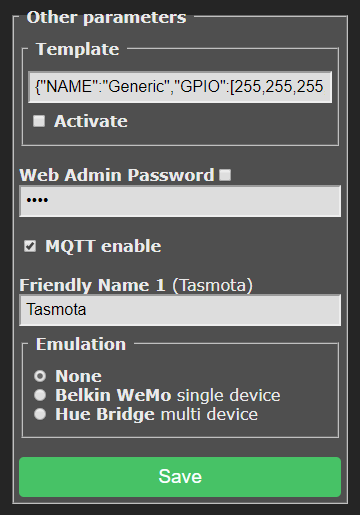

!> **This feature is included only in builds: tasmota, tasmota-sensors and tasmota-basic.**     

To use in other builds you must [compile your own build](compile-your-build). Add the following to `user_config_override.h`:
```
#ifndef EMULATION
#define EMULATION       EMUL_NONE       // [Emulation] Select Belkin WeMo (single relay/light) or Hue Bridge emulation (multi relay/light) (EMUL_NONE, EMUL_WEMO or EMUL_HUE)
#endif
```

`EMUL_NONE` = disables emulation   
`EMUL_WEMO` = enables Belking WeMo emulation   
`EMUL_HUE` = enables Hue Bridge emulation   

----
## Connecting to Alexa

You can interact with Tasmota using Amazon Alexa through its Echo devices . 

In **Configuration - Configure Other** page in the webUI select emulation type.



> [!WARNING]
> Alexa Hue integration requires a physical Alexa device. The app alone is not enough.

#### Belkin WeMo Emulation
Use Belkin WeMo for devices with a single relay or Hue Bridge for devices with one or more relays or for lights. Tasmota devices will be discovered by the Alexa app.

#### Hue Bridge Emulation
For control of lights, color control (introduced in version 6.5.0.9), on/off, and dimming is supported. Enable `Hue Bridge` emulation and perform a device discovery in the Alexa app. No skill needs to be added to Alexa. Select Hue Bridge V1 as the device type.

Relays and lights with friendly names beginning with a dollar sign (`$`) will cause Tasmota to not "announce" them (i.e., be hidden) to Alexa. If they were previously discovered, they will still continue to work. As there are only four friendly names provided in Tasmota, if `FriendlyName4` begins with `$`, component 4 and all higher numbered discoverable components will not be discovered by Alexa.  

> [!NOTE]
> Hue Bridge emulation does not support sensors.**  

