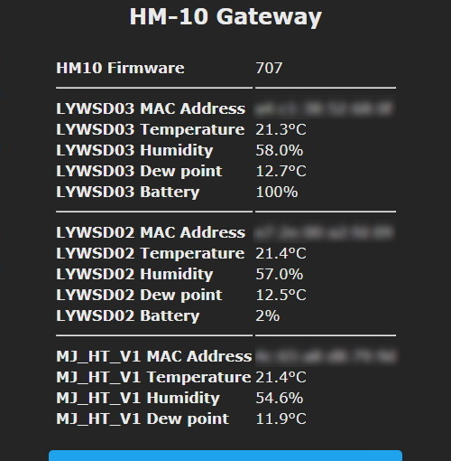

**This feature is included only in tasmota-sensors.bin** 

Otherwise you must [compile your build](compile-your-build). Add the following to `user_config_override.h`:

```
#ifndef USE_HM10
#define USE_HM10          // Add support BLE sensor bridge (+5k1 code)
#endif

#ifndef USE_IBEACON
#define USE_IBEACON          // Add support for bluetooth LE passive scan of ibeacon devices 
#endif
```
----

HM-10 is a Bluetooth BLE V4.0 module based on TI CC254x chip. Originally manufactured by [Jinan Huamao](http://www.jnhuamao.cn/bluetooth.asp) but there are many clones in the market ([MLT-BT05, CC41-A](https://blog.yavilevich.com/2017/03/mlt-bt05-ble-module-a-clone-of-a-clone/), [JDY-08](https://www.vokolo.cz/user/related_files/jdy-08_bluetooth_le_module_datasheet.pdf), AT-09, ...)


While they look similar and utilize the same CC254x Bluetooth chip, the firmware on them is different. In order to get any type of module to work work Tasmota it is mandatory to [flash the original firmware on it](https://github.com/Jason2866/CCLoader). Use the newest V707 firmware but at least V609 is required to work with the Tasmota driver.

> [!TIP] It is possible to do this without soldering by directly sticking male jumper wire connectors through the plastic foil on some boards or using some removable adhesives (bluetack).  

## Configuration
Check whether your module is communicating properly over its TX/RX pins and that it has the required firmware (preferably `HMSoft V707`). Only when you're sure everything is ok proceed with the configuration.

#### Wiring
| HM-10   | ESP8266 |
|---|---|
|GND   |GND   
|VCC   |3.3V
|TX   | GPIOx
|RX   | GPIOy

#### Tasmota Settings for BLE sensors

In the _Configuration -> Configure Module_ page assign:
1. GPIOx to `HM10 TX (195)`
2. GPIOy to `HM10 RX (194)`

If you have the proper firmware webUI should show (in this case V707 is the fflashed firmware version):


If you have supported Bluetooth devices in range, they will soon be discovered and start to populate the webUI with data as it is transmitted:



> [!WARNING] Most of the self-flashed modules will still have their factory default settings with baud rate of 9600 but Tasmota requires 115200.
>To fix try commands from Tasmota console:
`HM10Baud 9600` then `HM10AT RENEW`
and reboot Tasmota. If that doesn't solve it you will have to connect to the HM-10 with serial-to-USB adapter and set the baudrate in a terminal using commands `AT+RENEW` then `AT+BAUD?`. If the output is 4 baudrate is properly set to 115200, if not use `AT+BAUD4`

For a complete overview of supported devices, commands and features read the [Bluetooth article](/Bluetooth#BLE-Sensors-using-HM-1x)

#### Tasmota Settings for iBeacon

In the _Configuration -> Configure Module_ page assign:
1. GPIOx to `iBeacon TX (168)`
2. GPIOy to `iBeacon RX (169)`

When first connected HM-10 is in peripheral mode. You have to change it to central mode using commands `Sensor52 1` and `Sensor52 2`.

If you have supported iBeacon Bluetooth devices in range, they will be discovered and will start to populate the webUI with data:


For a complete overview of supported devices, commands and features read the [Bluetooth article](/Bluetooth#iBeacon)

## Breakout Boards
