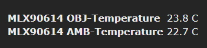
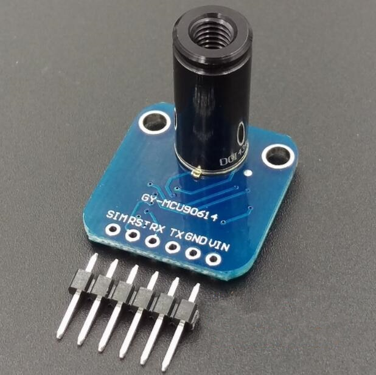
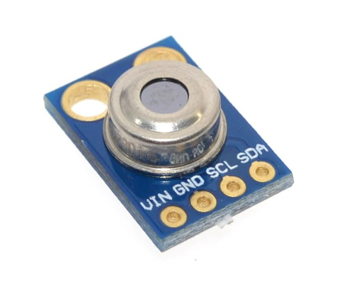
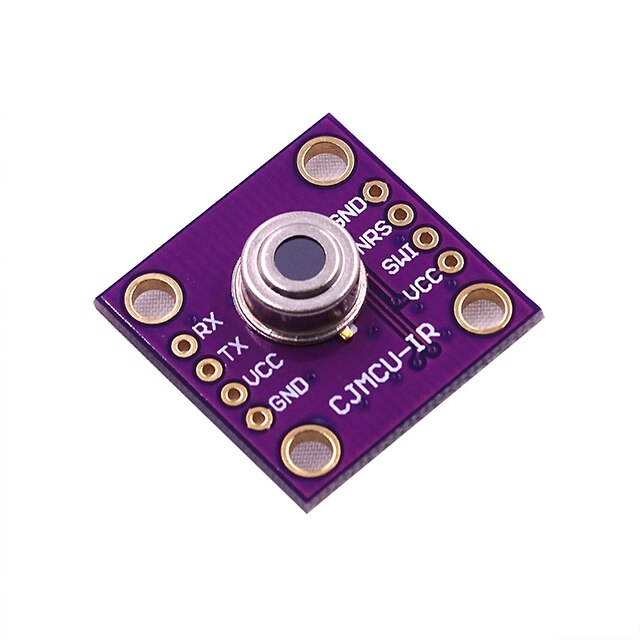
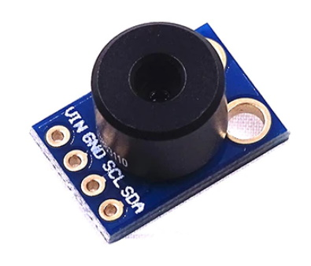
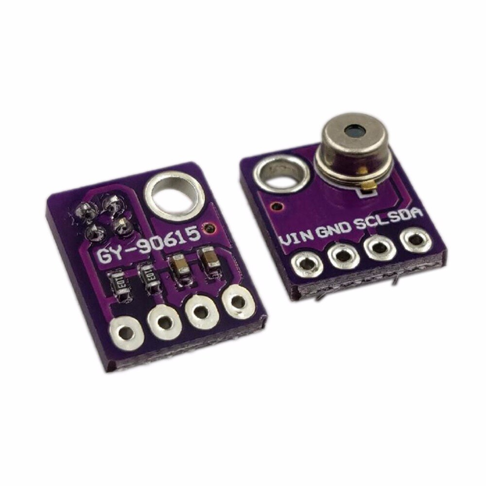

!> **This feature is not included in precompiled binaries.**  

To use it you must [compile your build](compile-your-build). Add the following to `user_config_override.h`:
```
#ifndef USE_MLX90614
#define USE_MLX90614            // [I2cDriver32] Enable MLX90614 ir temp sensor (I2C address 0x5a) (+0.6k code)
#endif
```
----
The MLX90614 is an infrared thermometer for non-contact temperature measurements.

## Configuration

#### Wiring
| MLX90614   | ESP8266 |
|---|---|
|GND   |GND   
|VCC   |3.3V
|SDA   | GPIOx
|SCL   | GPIOy

#### Tasmota Settings 
In the _Configuration -> Configure Module_ page assign:
1. GPIOx to `I2C SDA (6)`
2. GPIOy to `I2C SCL (5)`

After a reboot the driver will detect MLX90614 automatically and display Temperature measurements.



Sensor sends a  `tele/%topic%/SENSOR` JSON reponse:

```json
tele/tasmota/SENSOR = {"Time":"2019-11-11T00:03:30","MLX90614":{"OBJTMP":23.8,"AMBTMP":22.7}}
```


## Breakout Boards





## MLX90615

This driver will also work with MLX90615 sensor with some code alterations.

Change lines 26-30
```
#define I2_ADR_IRT      0x5b

#define MLX90614_RAWIR1 0x05
#define MLX90614_TA     0x26
#define MLX90614_TOBJ1  0x27
```


