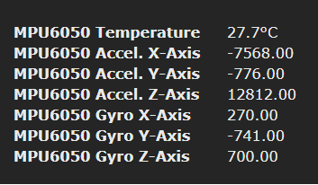
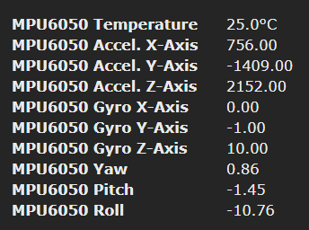

!> **This feature is not included in precompiled binaries.**  

To use it you must [compile your build](compile-your-build). Add the following to `user_config_override.h`:
```
#ifndef USE_MPU6050
#define USE_MPU6050                // [I2cDriver25] Enable MPU6050 sensor (I2C address 0x68 AD0 low or 0x69 AD0 high) (+3K3 of code and 188 Bytes of RAM)
  #define USE_MPU6050_DMP          // Enable in MPU6050 to use the DMP on the chip, should create better results (+8k6 of code)
#endif
```
----
The MPU-6050 combines a 3-axis gyroscope and a 3-axis accelerometer on the same silicon die, together with an onboard Digital Motion Processor™ (DMP™), which processes complex 6-axis MotionFusion algorithms.

[Datasheet](https://www.invensense.com/products/motion-tracking/6-axis/mpu-6050/)
## Configuration

#### Wiring
| MPU-6050   | ESP8266 |
|---    |---|
|GND    | GND   
|VCC    | 3.3V
|SDA    | GPIOx
|SCL    | GPIOy
|XDA    |
|XCL    |
|AD0    |
|INT    |

#### Tasmota Settings 
In the _Configuration -> Configure Module_ page assign:
1. GPIOx to `I2C SDA (6)`
2. GPIOy to `I2C SCL (5)`

After a reboot the driver will detect MCU-69050 automatically and display measurements.



Sensor sends a `tele/%topic%/SENSOR` JSON reponse:

```json
tele/tasmota/SENSOR = {"Time":"2019-12-10T19:37:50","MPU6050":{"Temperature":27.7,"AccelXAxis":-7568.00,"AccelYAxis":-776.00,"AccelZAxis":12812.00,"GyroXAxis":270.00,"GyroYAxis":-741.00,"GyroZAxis":700.00},"TempUnit":"C"}
```

#### Digital Motion Processor Enabled

If you define flag
```
  #define USE_MPU6050_DMP          // Enable in MPU6050 to use the DMP on the chip, should create better results (+8k6 of code)
```
enabling Digital Motion Processor™ (DMP™) you will get additional Yaw, Pitch and Roll measurements and more accurate measurements overall



Sensor sends an expanded `tele/%topic%/SENSOR` JSON reponse:

```json
tele/tasmota/SENSOR = {"Time":"2019-12-10T19:24:55","MPU6050":{"Temperature":25.0,"AccelXAxis":756.00,"AccelYAxis":-1409.00,"AccelZAxis":2152.00,"GyroXAxis":0.00,"GyroYAxis":-1.00,"GyroZAxis":10.00,"Yaw":0.86,"Pitch":-1.45,"Roll":-10.76},"TempUnit":"C"}
```

## Breakout Boards


