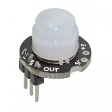
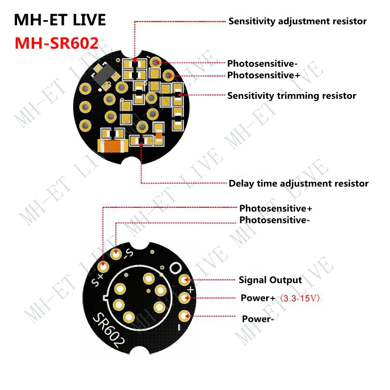
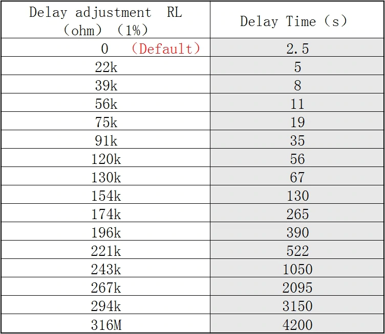

PIR motion sensors, albeit called sensors, are configured as switches in Tasmota since they basically report _motion_ (`1`) or _no motion_ (`0`) to the device. 

Most PIR's are single wire and they require connecting to VCC, GND and one GPIO. In this guide we will use `GPIO15` as the pin that the PIR output is connected to.

#### Tasmota Settings
In _Configuration -> Configure Module_ menu change `GPIO15` to `Switch1`.


If there already is a `Switch1` simply choose the next in line. Same applies if you're connecting more than 1 PIR on a single device.

A configured PIR will not appear in the web UI in any form. To make it report like a sensor we need a rule that will send movement triggers to an MQTT topic.

```console
SwitchMode1 1
SwitchTopic 0
Rule1 on Switch1#state=1 do publish stat/%topic%/PIR1 ON endon on Switch1#state=0 do Publish stat/%topic%/PIR1 OFF endon
Rule1 1
```
You can change (`PIR1`) and the message (`ON`/`OFF`) to whatever suits your needs. `%topic%` is the configured device topic.

Look in console for motion detection messages ```[20:24:03] stat/%topic%/PIR1 ON``` to verify everything is working

optional:
>Before using rules configure any GPIO that doesn't have anything connected to it as `Relay1`.    
>This creates a dummy relay which is triggered by the PIR so you can see the changes in the web UI. This method is not recommended for daily use and should only be used for testing.

A more [advanced example](Rule-Cookbook#Auto-off-Motion-Sense-Switch) of rules with PIRs.

## AM312 

[AM312](http://www.image.micros.com.pl/_dane_techniczne_auto/cz%20am312.pdf) works even on 3.3v instead of 5v (like HC-SR501) which makes it perfect for ESP8266 devices without a 5V line (like Sonoff Basic). It is also less prone to false triggers due to Wi-Fi interference.

</img>

### Pinout


Pin marked VOUT is connected to a free GPIO pin on the device.


This PIR goes to off state after a few seconds so we need to use this rule *instead* of the one in the example. 
```console
Rule1 on Switch1#state=1 do Backlog Publish stat/%topic%/PIR1 ON; RuleTimer1 30 endon on Rules#Timer=1 do Publish stat/%topic%/PIR1 OFF endon
```
With this it will stay ON for 30 seconds then send OFF message and the timer restarts every time there's an ON trigger.

Another use case as a [hand wave switch](peripherals/Project-AM312-and-Sonoff-R2).

## HC-SR501


### Pinout


## MH-SR602
This is a very small version of a PIR that is able to modify the sensitivity and delay by soldering resistors.


With factory settings this PIR goes to off state after a few seconds so we need to use this rule *instead* of the one in the example. 
```console
Rule1 on Switch1#state=1 do Backlog Publish stat/%topic%/PIR1 ON; RuleTimer1 30 endon on Rules#Timer=1 do Publish stat/%topic%/PIR1 OFF endon
```
With this it will stay ON for 30 seconds then send OFF message and the timer restarts every time there's an ON trigger.


### Pinout



