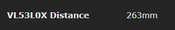
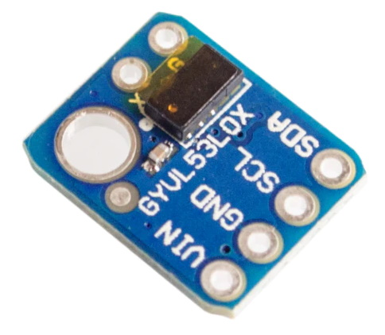
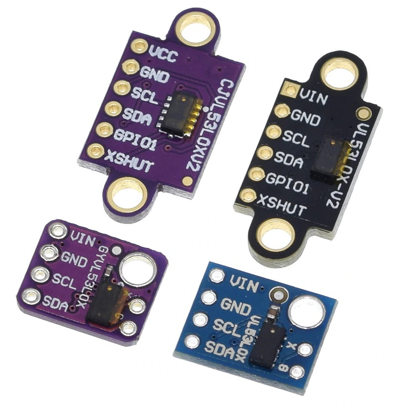

The VL53L0X is a Time-of-Flight (ToF) laser-ranging module.

## Configuration

#### Wiring
| VL53L0x   | ESP8266 |
|---|---|
|GND   |GND   
|VCC   |3.3V
|SDA   | GPIOx
|SCL   | GPIOy

#### Tasmota Settings 
In the _Configuration -> Configure Module_ page assign:
1. GPIOx to `I2C SDA (6)`
2. GPIOy to `I2C SCL (5)`

After a reboot the driver will detect VL530L0x automatically and display Illuminance.



Sensor sends a  `tele/%topic%/SENSOR` JSON reponse:

```json
{"Time":"2019-12-20T11:29:22","VL53L0X":{"Distance":263}}
```


## Breakout Boards


